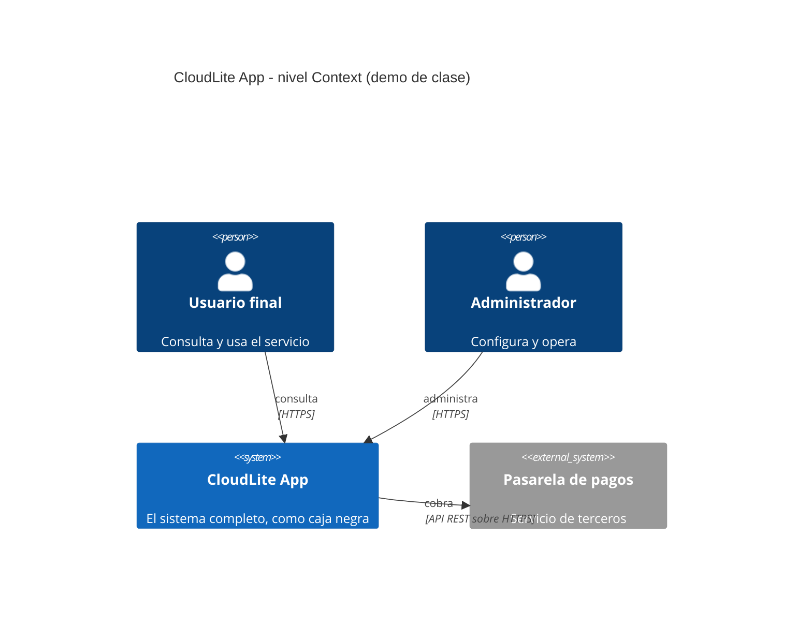

# Guion docente — Clase 1: Introducción a arquitecturas cloud

## Información de la clase
- Asignatura: Arquitectura de Sistemas Computacionales (FI303380)
- Duración del bloque: **120 min**
- Tipo: Clase regular (teoría + taller PI) · encuentro síncrono
- Enfoque: **Proyecto Integrador CloudLite App** (parte práctica)
- Sin fechas de periodo · sin bio · sin mapa completo del curso

## Objetivos de la clase
- Ubicar el curso como diseño de arquitecturas cloud al servicio del PI CloudLite App.
- Distinguir nube vs on-prem y los bloques de una arquitectura cloud simple.
- Dejar el dominio y alcance del PI escritos y compartibles.

## Hoy avanzamos el PI en…
**Definir dominio CloudLite App + 3–5 capacidades + problema en 2–3 frases**

**Entregable concreto:** Ficha PI de 6 bloques + C4 Context en Mermaid renderizado en ExamLab (boceto previo en Excalidraw/draw.io)

**Herramienta:** Padlet · Excalidraw / draw.io

## Fundamento teórico para el docente
### PI CloudLite - entregable de hoy: la ficha de 6 bloques - diapositiva 4
La diapositiva 4 presenta el entregable de hoy: una ficha individual con seis bloques rotulados que cada estudiante llena por su cuenta y que no vuelve a cambiar en el resto del semestre. DOMINIO fija en una linea el problema de negocio elegido (AgendaU, BiblioLite, InventarioLab, TurnosClinica, EventosCampus u otro del mismo tamano); un dominio generico (una red social, una tienda en linea sin mas detalle) hace imposible evaluar las decisiones de las clases siguientes, porque no hay nada concreto que arquitecturar. PROBLEMA obliga a nombrar en tres frases quien sufre la situacion, como se resuelve hoy sin CloudLite y una cifra medible del dolor; sin esa cifra el problema es una opinion y no algo que un diseno pueda mejorar o empeorar de forma verificable. CAPACIDADES son los verbos de negocio que el sistema debe permitir (reservar, publicar, cancelar, notificar), nunca piezas tecnicas como login o cache, porque las capacidades describen el fin y la tecnologia es solo el medio. ACTORES son las personas que interactuan con el sistema, cada una con una frase de que espera obtener; sin esto no hay a quien pedirle validacion cuando en clases futuras se revisen los diagramas. SISTEMAS EXTERNOS es el bloque nuevo de este semestre: dos o tres sistemas de terceros con los que CloudLite intercambia informacion (un proveedor de identidad, un servicio de correo, una pasarela de pagos); es exactamente lo que despues aparece como System_Ext en el diagrama C4 Context de la pregunta 2 de ExamLab, asi que conviene que el estudiante los escriba aqui ANTES de dibujar, no despues. FUERA DE ALCANCE cierra la ficha nombrando tres cosas que CloudLite no hara este semestre; ese bloque evita que el alcance crezca sin control clase a clase y es lo primero que hay que revisar cuando un estudiante pida mas tiempo en una entrega futura.

### Que es arquitectura cloud (mapa mental) - diapositiva 5
Arquitectura de software es el conjunto de decisiones estructurales que resultan costosas o imposibles de cambiar despues: como se dividen los componentes, como se comunican, donde se despliegan y que atributos de calidad se priorizan cuando entran en conflicto. La prueba practica para saber si una decision es arquitectonica consiste en preguntar cuanto costaria revertirla en tres meses. Cambiar el color de un boton no es arquitectura; cambiar de base de datos relacional a documental si lo es, porque arrastra el modelo de datos, las consultas, el codigo de acceso y las pruebas. Esa asimetria de costo es la razon de existir de la materia: si el docente no la instala el primer dia, el curso se percibe como una coleccion de diagramas decorativos y el estudiante concluye que la arquitectura es documentacion que se produce para la nota.

Conviene separar de entrada dos cosas que el estudiante confunde siempre: el stack tecnologico y la arquitectura. El stack es la lista de tecnologias concretas; la arquitectura es la estructura y las razones. Dos proyectos pueden usar el mismo stack y tener arquitecturas opuestas: uno con un solo proceso que hace todo, otro con tres servicios que se comunican por red. Una forma rapida de demostrarlo es escribir en el tablero «React + Node + PostgreSQL» y preguntar al curso cuantos usuarios simultaneos soporta eso, o que ocurre si la base de datos deja de responder. Nadie puede contestar, porque el stack no contiene esa informacion; las respuestas viven en la arquitectura. Hacer visible ese vacio en los primeros veinte minutos ahorra tres semanas de malentendidos.

Los atributos de calidad son las propiedades medibles que el sistema debe exhibir, y son el vocabulario con el que se justifica cualquier decision. Los cuatro que este curso usa de forma permanente son rendimiento, disponibilidad, seguridad y costo. Rendimiento se expresa en tiempo de respuesta: una convencion de usabilidad ampliamente aceptada dice que una interaccion web se siente inmediata por debajo de 100 milisegundos, aceptable hasta unos 300 y claramente lenta por encima de 1 segundo; son convenciones, no leyes fisicas, y conviene decirlo asi. Disponibilidad se expresa como porcentaje de tiempo en que el sistema responde, y ahi el numero si es aritmetica exacta: 99 % permite unas 7 horas de caida al mes, 99,9 % (los llamados tres nueves) alrededor de 43 minutos, y 99,99 % poco mas de 4 minutos. Vale hacer ese calculo en el tablero, porque 43 minutos al mes es un dato que el estudiante recuerda, mientras que la expresion «alta disponibilidad» no significa nada. El punto central es que estos atributos compiten entre si: mas disponibilidad exige redundancia, la redundancia cuesta dinero, y por eso la arquitectura es sobre todo el oficio de elegir que se sacrifica.

Nube no significa internet ni «el servidor de otra persona». Es un modelo operativo con cinco rasgos que conviene enunciar tal cual, porque son el estandar con el que se define el termino: autoservicio bajo demanda, es decir que quien necesita recursos los aprovisiona sin pedir permiso ni esperar dias; acceso amplio por red; agrupacion de recursos, donde el proveedor comparte hardware fisico entre muchos clientes mediante virtualizacion, tema de la Clase 3; elasticidad rapida, con capacidad que sube y baja en minutos y no en semanas; y medicion del servicio, o pago por lo consumido. El cambio economico que esto produce es lo relevante para la arquitectura, porque la infraestructura deja de ser una compra que se hace por adelantado y se amortiza a largo plazo, y pasa a ser un gasto operativo que cambia con cada decision de diseno. Por eso en la nube el costo se convierte en un atributo de calidad tecnico y no solo administrativo, idea que el curso retoma de forma explicita en la Clase 10.

### Nube y on-premise: la decision de hoy - diapositiva 6
Aqui hay que ser explicito porque es un objetivo de la clase y vale 35 de los 100 puntos del taller, entre la pregunta de seleccion multiple y la tabla. On-premise, «en las instalaciones», significa que el servidor es una maquina fisica que vive en la universidad: alguien la compra, la instala en un cuarto de equipos, le pone el sistema operativo, la parcha, la respalda y la reemplaza cuando se dana. Nube significa que no se compra nada: se alquila capacidad a un proveedor, se pide cuando se necesita, se devuelve cuando no y se paga por lo consumido. La pregunta que el estudiante tiene que poder responder al salir no es cual es mejor en abstracto, sino cual conviene a SU CloudLite y que riesgo asume al elegirla.

Los cuatro criterios de la tabla no son arbitrarios; cada uno aisla una diferencia que el estudiante puede verificar. El primero es la inversion inicial, y ahi la diferencia es de naturaleza y no de monto: on-premise exige gasto de capital, dinero comprometido antes de escribir una linea de codigo y amortizado a varios anos, mientras la nube es gasto operativo que empieza casi en cero y sube con el uso. El segundo es el tiempo hasta la primera demo, que en un proyecto de un semestre es el criterio que mas pesa y el que los estudiantes olvidan: cotizar, comprar, instalar y conseguir permisos de la oficina de TI toma semanas, y el semestre tiene trece sesiones. El tercero es quien opera el sistema operativo, los parches y los respaldos; conviene decir que en la nube esa responsabilidad NO desaparece, se reparte, y cuanto se reparte es exactamente lo que decide el modelo de servicio de la Clase 2. Ese matiz es el que la pregunta de seleccion multiple castiga: la opcion que dice que migrar a la nube elimina la responsabilidad del equipo sobre la seguridad de su propia aplicacion es falsa, y es la trampa mas comun. El cuarto es el dia del pico, que en un dominio academico es concreto: la semana de matricula, el inicio de semestre, la jornada de citas. On-premise tiene capacidad fija y si se queda corta no hay nada que hacer ese dia; la nube permite subir mientras dura el pico y devolver despues, y esa es la elasticidad, que es distinta de la escalabilidad y se trabaja en la Clase 13.

Para un proyecto academico de un semestre, sin presupuesto y con una sola persona desarrollando, el veredicto honesto es nube en casi todos los dominios, y el docente no deberia fingir que es una decision abierta cuando no lo es. Lo que si hay que exigir es que el estudiante nombre el riesgo que asume, porque un veredicto sin riesgo no es una decision de arquitectura sino una preferencia. El riesgo principal tiene nombre: dependencia del proveedor, o amarre, que es la dificultad y el costo de mudarse si el proveedor sube precios, cambia condiciones o cierra el servicio; se agrava cuando se usan servicios propietarios que no tienen equivalente en otro proveedor. Hay otros dos que valen: el costo puede crecer sin control precisamente porque es facil aprovisionar, tema de la Clase 10, y los datos quedan alojados por un tercero, lo que en un dominio con datos personales de estudiantes tiene implicaciones que la Clase 6 retoma. Un estudiante que escriba «elijo nube porque es mas facil» no ha respondido; uno que escriba «elijo nube porque necesito la primera demo en dos semanas y no tengo presupuesto de capital, y acepto quedar amarrado al proveedor que elija» si.

Error tipico del docente que no domina el tema: presentar la nube como la respuesta correcta y on-premise como la anticuada. La consecuencia aguas abajo es que en la Clase 2 el estudiante no puede redactar el ADR-001, porque un ADR necesita alternativas descartadas CON su motivo, y quien nunca vio merito en la alternativa no sabe que descarto. El segundo error es dejar que la tabla se llene con teoria general copiada de internet en vez de con el dominio propio: una celda que dice «la nube es escalable» no dice nada sobre AgendaU, y la rubrica pide maximo dos lineas por celda referidas al dominio del estudiante justamente para forzar eso.

### CloudLite App - el hilo conductor - diapositiva 7
Aterricemos en CloudLite App, el proyecto integrador que atraviesa las quince clases. Supongamos que un estudiante elige como dominio la gestion de turnos de una barberia. El diagrama de contexto correcto tiene una sola caja llamada CloudLite Turnos, tres actores alrededor (el cliente que reserva, el barbero que consulta su agenda del dia y el administrador que configura horarios y precios) y dos o tres sistemas externos con la flecha etiquetada: una pasarela de pagos, con la etiqueta «envia solicitud de cobro y recibe confirmacion»; un proveedor de correo, con la etiqueta «envia recordatorio de turno»; y quizas un servicio de mapas. Nada mas: la API, la base de datos y el almacenamiento de fotos no aparecen todavia porque son interiores. Ese diagrama de cinco o seis elementos es el entregable de hoy, y su valor esta en que obliga a responder dos preguntas que el estudiante no se habia hecho: quien exactamente usa esto y de que terceros depende para funcionar. Un sistema que depende de una pasarela de pagos hereda su disponibilidad, y esa herencia es una decision arquitectonica aunque nadie la haya escrito.

### De dominio a arquitectura (mini-metodo) - diapositiva 8
El modelo C4 es la notacion que este curso usa para dibujar arquitectura, y su virtud es ofrecer cuatro niveles de zoom con reglas claras sobre que se muestra en cada uno, en lugar de un unico diagrama que mezcla todo. Nivel 1, Contexto: el sistema es una sola caja negra y alrededor aparecen unicamente las personas que lo usan y los sistemas externos con los que intercambia informacion. Nivel 2, Contenedores: se abre esa caja y se ven las aplicaciones, servicios y bases de datos que la componen. Nivel 3, Componentes: se abre un contenedor y se ven sus modulos internos. Nivel 4, Codigo: clases y funciones, que en la practica casi nunca se dibuja porque el codigo mismo ya lo documenta. Hoy se trabaja unicamente el nivel 1, y la regla es estricta: si en el diagrama de contexto aparecen las palabras PostgreSQL, Docker o Redis, el diagrama esta mal, porque eso es interior del sistema y corresponde al nivel 2 de la Clase 4.

El segundo artefacto de hoy es la ficha con cuatro capacidades y el problema en tres frases. Una capacidad se escribe como un verbo de negocio que el usuario puede ejecutar, no como una pieza tecnica: «reservar un turno disponible», «cancelar o reprogramar hasta dos horas antes», «consultar la agenda del dia» y «cobrar un anticipo» son capacidades; «tener login con JWT», «usar cache» o «tener panel administrativo» no lo son, porque son medios y no fines. El limite de cuatro capacidades es una decision pedagogica deliberada y no una regla de la industria: con cada estudiante trabajando de forma individual durante doce semanas, un alcance de ocho capacidades garantiza que el proyecto no llegue a ninguna parte. El enunciado del problema debe nombrar a quien le duele y que pierde hoy, con alguna cifra aunque sea estimada: «la barberia agenda por mensajeria instantanea, pierde alrededor de tres turnos diarios por doble reserva y no tiene registro de cuantos clientes no se presentaron». Un problema sin afectado concreto y sin magnitud produce arquitecturas que nadie puede evaluar, porque no hay contra que comparar.

### Ejemplo de diagrama C4 - nivel Context - diapositiva 9
Use el diagrama proyectado (System, dos Person, System_Ext) como plantilla en vivo: reemplace actor, sistema y externo por el dominio de un estudiante voluntario mientras explica que en el nivel Context el sistema sigue siendo UNA sola caja, sin abrir por dentro. Es el mismo modelo C4 explicado arriba, ahora aplicado con nombres concretos, y sirve de puente directo hacia la pregunta 2 del taller en ExamLab (el diagrama Mermaid que cada estudiante entrega hoy).

### Preguntas frecuentes y cierre conceptual (de la diapositiva 5 a la diapositiva 9)
Tres preguntas aparecen casi siempre en esta primera clase y conviene tener la respuesta lista. La primera: cual es la diferencia entre arquitectura y diseno. Respuesta: es una diferencia de alcance y de reversibilidad, no de naturaleza; arquitectura son las decisiones que afectan a todo el sistema y son caras de revertir, diseno son las decisiones internas de un componente que se pueden cambiar sin tocar a los demas. La segunda: por que no usamos una cuenta real de un proveedor de nube. Respuesta, y hay que darla sin disculparse: porque este curso evalua razonamiento arquitectonico y no el manejo de una consola que cambia de aspecto cada semestre; ninguna actividad exigira tarjeta de credito ni cuenta de pago, todo se hace con draw.io, Excalidraw, Killercoda y el nivel gratuito de GitHub Actions, y quien aprende a justificar un trade-off lo aplica luego en cualquier proveedor en una tarde. La tercera: cuantas cajas debe tener mi diagrama. Respuesta: en el nivel de contexto, entre cuatro y ocho elementos en total; si hay veinte, es casi seguro que se colaron piezas internas. Y vale cerrar ubicando al docente en el mapa del curso, porque la Clase 1 no es una introduccion suelta sino el cimiento de una cadena. Lo que se decida hoy (dominio, actores, capacidades, problema) es la entrada obligatoria de la Clase 2, que se dicta la semana siguiente en sesion virtual sincrona y pide elegir entre IaaS, PaaS y SaaS registrando la decision; de la Clase 3, donde se contenerizara uno de los servicios de este mismo sistema; y sobre todo de la Clase 4, que abre la caja negra dibujada hoy para mostrar de dos a cinco contenedores logicos. La Clase 5 es el primer parcial y evalua justamente este vocabulario. Conviene decirlo en voz alta al cerrar: el estudiante que salga hoy sin dominio definido no tiene sobre que trabajar en las siguientes cuatro sesiones, y el docente debe negarse a dejar el tema abierto para la proxima semana.

Error tipico del docente que no domina el tema: confundir arquitectura con stack tecnologico y permitir que el estudiante presente una lista de tecnologias como si fuera una arquitectura. La consecuencia aguas abajo es directa: en la Clase 2 ese estudiante no podra sustentar su registro de decision, porque nunca hizo explicito un atributo de calidad que la justifique, y en la Clase 4 producira un diagrama de contenedores que es un inventario de herramientas sin fronteras de responsabilidad. El segundo error es aceptar diagramas de contexto contaminados con piezas internas (base de datos, cache, balanceador) porque «se ven mas completos»; si eso se aprueba hoy, el nivel de contenedores de la Clase 4 pierde todo sentido, ya que no habra nada nuevo que revelar, y la sustentacion final de la Clase 15 terminara siendo un unico diagrama ilegible en el que el estudiante no sabe a que nivel de zoom esta hablando.

## Referencias a diapositivas
Numeración real del deck `Clases/Clase 1 - Introduccion a arquitecturas cloud/Presentacion.pptx` (solo tema
de esta clase). Las etiquetas [Slide N] del plan y del fundamento apuntan aquí.

1. Portada · Clase 1 · Introducción a arquitecturas cloud
2. Agenda de hoy (120 min)
3. Objetivos de la clase
4. PI CloudLite — entregable de hoy
5. Qué es arquitectura cloud (mapa mental)
6. Nube vs on-premise para CloudLite
7. CloudLite App — el hilo conductor
8. De dominio a arquitectura (mini-método)
9. Ejemplo de diagrama C4 — nivel Context
10. Herramientas de hoy
11. Del boceto a ExamLab (diagrama)
12. Taller PI (paso a paso)
13. Para continuar (PI)
14. Clase 1 · PI en movimiento

## Plan de clase minuto a minuto (120 min)

### 0–10 · Encuadre PI · [Slide 2][Slide 3][Slide 4]
Di casi literal:
> "Hoy avanzamos el PI CloudLite App en: Definir dominio CloudLite App + 3–5 capacidades + problema en 2–3 frases. Entregable concreto: Ficha PI de 6 bloques + C4 Context en Mermaid renderizado en ExamLab (boceto previo en Excalidraw/draw.io). Teoría breve y luego taller; no es un lab suelto."

**[Nota docente]:** pasa la diapositiva de agenda y la de objetivos. Abre el enunciado PI si alguien aún no lo tiene.

**[Nota docente]:** pregunta de arranque (1 min) para detectar estudiantes rezagados antes de avanzar:
> "¿En qué quedó tu CloudLite la clase pasada?"

### 10–40 · Teoría Core (al servicio del taller) · desde [Slide 5]
Cubre estos conceptos, en este orden, ~7 min cada uno (son los títulos de las diapositivas de teoría):
- Qué es arquitectura cloud (mapa mental)
- Nube vs on-premise para CloudLite
- CloudLite App — el hilo conductor
- De dominio a arquitectura (mini-método)

El desarrollo completo de cada uno está arriba, en «Fundamento teórico para el docente», ya dividido
por diapositiva: esa sección está escrita para que puedas dictarla sin consultar otra fuente.

**[Nota docente]:** cada 8–10 min amarra al artefacto («esto es lo que van a dejar hoy en su informe/diagrama/repo»)
y pide un estudiante voluntario para usar SU dominio como ejemplo en vivo (no el de la demo).

### 40–55 · Demo en vivo · [Slide 11]
Herramienta del día: **Padlet · Excalidraw / draw.io**.
**Demo que usted debe poder repetir:** Dibujar en vivo el C4 Context de un CloudLite de ejemplo

1. Abra draw.io en blanco y dibuje UNA caja al centro rotulada «CloudLite App».
2. Agregue 2 monigotes a la izquierda (Usuario final, Administrador) con flechas rotuladas «consulta», «administra».
3. Agregue 1 caja gris a la derecha rotulada «Pasarela de pagos (externo)» y una flecha «cobra».
4. Diga en voz alta: «no dibuje que hay ADENTRO de la caja; eso es Clase 4».

**Referencia del resultado:** C4 Context de la demo (el mismo de `Capturas/demo-clase01.png`). Si la red falla o prefiere no dibujar a mano, pegue este codigo en la pregunta de diagrama de ExamLab y proyectelo renderizado; tambien sirve para volver a generar la imagen en cualquier editor que soporte Mermaid.

**[Nota docente]:** narra los clics en voz alta. Si falla la red, proyecta las capturas de `Kit docente/Clase 1/Capturas/`.
Cierra la demo diciendo:
> "Copien la estructura, no el dominio de mi ejemplo."

**Cierra la demo dentro de ExamLab** [Slide 11] — es el paso que el estudiante no adivina: pasa el boceto a codigo Mermaid con ayuda de una IA, pegalo en la pregunta de diagrama y muestralo renderizado.

**Del boceto al codigo Mermaid.** No subas una imagen: la respuesta de esta pregunta es texto Mermaid.

- **1. Disena visual** Dibuja el diagrama como quieras en Excalidraw o draw.io: es mas rapido arrastrar cajas que escribir codigo, y ahi es donde piensas el modelo.
- **2. Traduce con IA** Copia o describe tu boceto a una IA y pidele el codigo Mermaid: «convierte este diagrama a Mermaid usando `C4Context`». Revisa el resultado: la IA acierta la sintaxis, no tu modelo.
- **3. Pega y renderiza en ExamLab** Pega ese codigo en la caja de texto de la pregunta y mira como lo dibuja la plataforma. Si no renderiza, corrige ahi mismo: lo que se califica es el diagrama renderizado dentro de ExamLab.
- **4. Guarda el PNG para tu PI** Exporta tambien la imagen a la carpeta de tu Proyecto Integrador. Esa copia es para tu informe; no reemplaza la respuesta en la plataforma.
📸 C4 Context de la demo en vivo: asi debe quedar el tablero al terminar [[captura: demo-clase01.png]]

### 55–100 · Taller guiado PI (individual) · [Slide 12]
**[Nota docente]:** proyecta la lista de pasos del taller del estudiante (está en la sección «Actividad / taller»
de este guion). Circula por mesas/Meet con la lista de errores frecuentes de abajo en la mano: son los que vas
a ver hoy. A los 80 min anuncia:
> "Faltan 20 min. Falta evidencia: PNG/YAML/enlace. Empiecen a subir borrador."

### 100–115 · Comprobación y evidencias
**[Nota docente]:** haz 3–4 de las preguntas de comprobación oral de abajo, a personas distintas y al azar
(no al que levanta la mano). Es el mecanismo para verificar la regla de los 60 segundos.
Aplica el quiz corto de `Kit docente/Clase 1/Quiz Clase 1 - Introduccion a arquitecturas cloud.docx`
(la clave va en archivo aparte y **no se proyecta**).
Mientras responden, verifica que el entregable esté realmente subido.
Retroalimenta 2–3 estudiantes en voz alta, nombrando el error y la corrección concreta.

### 115–120 · Cierre · [Slide 14]
Di:
> "Queda avanzado: Definir dominio CloudLite App + 3–5 capacidades + problema en 2–3 frases. Criterio de éxito: el estudiante explica su artefacto en 60 s. Entrega domingo 23:59 en ExamLab. Siguiente hito del PI según el plan."

## Actividad / taller (detalle)
1. Paso 1: elija un dominio concreto entre AgendaU, BiblioLite, InventarioLab, TurnosClinica o EventosCampus (o uno propio del mismo tamano) y escriba el problema en exactamente 3 frases: quien sufre el problema, como se resuelve hoy sin CloudLite y una cifra medible del dolor (por ejemplo 40 correos por semana para cuadrar 12 asesorias), verificando que en ninguna de las 3 frases aparezca una expresion generica como app de la universidad o red social; el resultado queda en la seccion 1 Dominio y problema del informe del PI.
2. Paso 2: liste exactamente 4 capacidades con la forma verbo mas objeto de negocio (reservar cita, publicar cupo, cancelar reserva, notificar recordatorio), 3 actores humanos con lo que espera cada uno, 2 o 3 sistemas externos con los que CloudLite intercambia informacion (por ejemplo proveedor de identidad, correo transaccional o pasarela de pagos) y 3 elementos de fuera de alcance, verificando que ninguna capacidad nombre tecnologia (nada de usar PostgreSQL ni desplegar en Docker) y que las 4 capacidades se lean como frases del negocio; queda en la seccion 1 del informe y se pega tal cual en la pregunta 1 de ExamLab.
3. Paso 3: dibuje primero el boceto del C4 Context en Excalidraw o draw.io, que es donde se piensa el modelo, y despues pidale a una IA que lo traduzca a Mermaid («convierte este diagrama a Mermaid usando C4Context»); pegue ese codigo en la pregunta de tipo diagrama de ExamLab y verifique que renderice ahi mismo, con exactamente 1 System para CloudLite, 2 Person, 2 System_Ext y 5 relaciones etiquetadas con verbo de negocio y protocolo, verificando en el diagrama ya renderizado que no aparezca ninguna caja interna (ni base de datos ni API ni worker, eso es Clase 4) y que cada flecha se lea en voz alta como una frase completa.
4. Paso 4: resuelva la tabla comparativa nube frente a on-premise en la pregunta 4, con los 4 criterios en este orden (inversion inicial, tiempo hasta la primera demo, quien opera el sistema operativo y los respaldos, y que pasa el dia del pico de su dominio) y maximo 2 lineas por celda, verificando que cada celda hable de SU dominio y no de teoria general; la estructura es la que se proyecto en clase, resuelta sobre AgendaU.
5. Paso 5: cierre esa misma pregunta 4 con el veredicto de 2 frases: (a) que opcion elige para su CloudLite y (b) que riesgo concreto asume al elegirla, verificando que el riesgo este nombrado y no solo insinuado (por ejemplo dependencia del proveedor). Hoy se decide unicamente nube u on-premise: el modelo de servicio (IaaS, PaaS o SaaS) se decide en la Clase 2, y este veredicto es la entrada del ADR-001 de esa clase.
6. Paso 6: suba a ExamLab (modulo Talleres) las 5 preguntas resueltas antes del domingo 23:59, verificando antes de enviar que la ficha de la pregunta 1, el diagrama renderizado de la pregunta 2 y el veredicto de la pregunta 4 usen exactamente los mismos nombres de actores y de sistemas externos; si no coinciden, no son el mismo sistema y las Clases 4, 7, 11 y 15 reutilizan esos nombres.

### Criterio de éxito
- Artefacto integrado al paquete PI (no archivo huérfano).
- Evidencia adjunta.
- Explicación oral de 60 s por el estudiante (muestreo).

## Errores frecuentes del estudiante (y cómo corregirlos en el momento)
- Dominio vago tipo «una red social» o «un e-commerce»: sin problema concreto no hay decisiones que tomar. Exija sector, usuario y dolor observable.
- Dibujar lo que hay DENTRO del sistema en el nivel Context (base de datos, API). Se corrige recordando que eso es el nivel Containers de la Clase 4.
- Confundir capacidad con pantalla: «tener un login» no es capacidad; «autenticar usuarios» si.

## Preguntas de comprobación oral (no son del quiz)
Úsalas en el tramo 100–115, a personas distintas y al azar.
1. Cual es la diferencia entre arquitectura y stack tecnologico?
1. Que va DENTRO y que va FUERA de la caja en un diagrama C4 Context?
1. Digan una capacidad de su CloudLite que NO sea una pantalla.

## Solución del taller (privada)
`Kit docente/Clase 1/Solucion Taller Clase 1 - CloudLite.docx` — es la referencia con la que
comparas lo que entregan los estudiantes. **No proyectarla completa** antes de que trabajen.

## Quiz
`Kit docente/Clase 1/Quiz Clase 1 - Introduccion a arquitecturas cloud.docx` (versión estudiante, sin respuestas)
y `Kit docente/Clase 1/Quiz Clase 1 - CLAVE DOCENTE.docx` (clave, privada).

## Capturas sugeridas
- 📸 La herramienta del día en uso con el artefacto CloudLite [[captura: demo-clase01.png | receta: 1) Abre Padlet · Excalidraw / draw.io y repite la demo de este guion.  2) Captura solo la ventana útil, no el escritorio completo.  3) Recorta a ~1200 px de ancho.  4) Guárdala como Kit docente/Clase 1/Capturas/demo-clase01.png.  5) Vuelve a generar el guion y la imagen queda embebida aquí sola. Detalle en Capturas/README.txt.]]
- 📸 Evidencia del entregable de un estudiante (diagrama / YAML / lab) [[captura: evidencia-clase01.png | receta: 1) Con permiso del estudiante, captura su artefacto de hoy.  2) Recorta nombre y correo antes de guardar.  3) Guárdala como Kit docente/Clase 1/Capturas/evidencia-clase01.png.  4) Es para tu registro del corte; no se proyecta en clase.]]

## Notas operativas
- Plataforma de entrega: ExamLab (https://uniaj.examlab.workers.dev/). No es la plataforma oficial de la UNIAJC; la universidad no tiene campus virtual propio.
- La entrega oficial se hace respondiendo las preguntas abiertas del taller dentro de ExamLab (https://uniaj.examlab.workers.dev/). El documento/ficha en Word o Google Docs es opcional, solo para que el estudiante conserve sus respuestas; lo que califica es lo que quede escrito en las preguntas de ExamLab.
- Prohibido pedir cloud con tarjeta: todo el curso corre con free tier o en el navegador.
- Día de parcial = solo evaluación (no aplica a esta clase).
