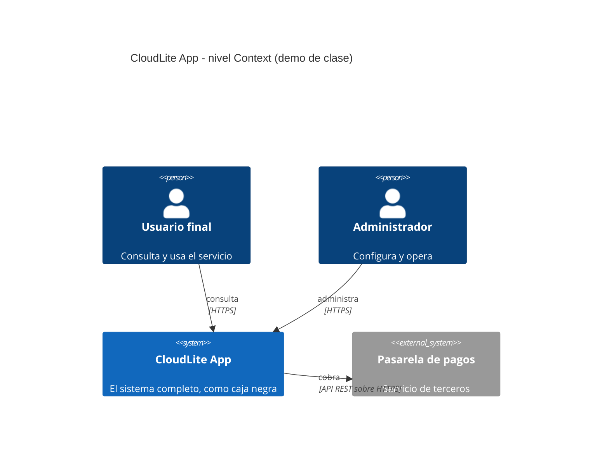

# Guion docente — Clase 1: Introducción a arquitecturas cloud

## Información de la clase
- Asignatura: Arquitectura de Sistemas Computacionales (FI303380)
- Duración del bloque: **120 min**
- Tipo: Clase regular (teoría + taller PI) · encuentro síncrono
- Enfoque: **Proyecto Integrador CloudLite App** (parte práctica)
- Sin fechas de periodo · sin bio · sin mapa completo del curso

## Objetivos de la clase
- Ubicar el curso como diseño de arquitecturas cloud al servicio del PI CloudLite App.
- Cerrar el dominio del PI en una ficha de cinco bloques, con capacidades de negocio y no piezas tecnicas.
- Dejar el dominio y alcance del PI escritos y compartibles.

## Hoy avanzamos el PI en…
**Definir dominio CloudLite App + 3–5 capacidades + problema en 2–3 frases**

**Entregable concreto:** Ficha PI de 5 bloques + C4 Context en Mermaid renderizado en la plataforma (boceto previo en Excalidraw/draw.io)

**Herramienta:** Navegador · editor de diagramas del curso · boceto libre (papel o Excalidraw) opcional

## Fundamento teórico para el docente
## Apoyo por diapositiva

Todo lo que hay que decir **esta proyectado**. Esta seccion dice que subrayar en cada lamina, no repite su contenido.

**[Slide 7] PI CloudLite - entregable de hoy: la ficha de 6 bloques (1/2)** — 3 vinetas.
  - DOMINIO fija en una linea el problema de negocio elegido (AgendaU, BiblioLite, InventarioLab, TurnosClinica, EventosCampus u otro del mismo tamano); un dominio generico (una red social, una tienda en linea sin mas detalle) hace imposible evaluar las decisiones de las clases siguientes, porque no hay nada concreto que arquitecturar.
  - SISTEMAS EXTERNOS es el bloque nuevo de este semestre: dos o tres sistemas de terceros con los que CloudLite intercambia informacion (un proveedor de identidad, un servicio de correo, una pasarela de pagos); es exactamente lo que despues aparece como System_Ext en el diagrama C4 Context de la pregunta 2 de la plataforma del curso, asi que conviene que el estudiante los escriba aqui ANTES de dibujar, no despues.

**[Slide 8] PI CloudLite - entregable de hoy: la ficha de 6 bloques (2/2)** — 2 vinetas.

**[Slide 9] Que es arquitectura cloud (mapa mental) (1/4)** — 6 vinetas.
  - Esa asimetria de costo es la razon de existir de la materia: si el docente no la instala el primer dia, el curso se percibe como una coleccion de diagramas decorativos y el estudiante concluye que la arquitectura es documentacion que se produce para la nota.
  - Conviene separar de entrada dos cosas que el estudiante confunde siempre: el stack tecnologico y la arquitectura.
  - Nadie puede contestar, porque el stack no contiene esa informacion; las respuestas viven en la arquitectura.
  - Hacer visible ese vacio en los primeros veinte minutos ahorra tres semanas de malentendidos.
  - Nube no significa internet ni «el servidor de otra persona».
  - Por eso en la nube el costo se convierte en un atributo de calidad tecnico y no solo administrativo, idea que el curso retoma de forma explicita en la Clase 10.

**[Slide 10] Que es arquitectura cloud (mapa mental) (2/4)** — 5 vinetas.

**[Slide 11] Que es arquitectura cloud (mapa mental) (3/4)** — 5 vinetas.

**[Slide 12] Que es arquitectura cloud (mapa mental) (4/4)** — 3 vinetas.

**[Slide 13] CloudLite App - el hilo conductor (1/2)** — 4 vinetas.
  - Aterricemos en CloudLite App, el proyecto integrador que atraviesa las quince clases.
  - Supongamos que un estudiante elige como dominio la gestion de turnos de una barberia.

**[Slide 14] CloudLite App - el hilo conductor (2/2)** — 2 vinetas.

**[Slide 15] De dominio a arquitectura (mini-metodo) (1/3)** — 5 vinetas.
  - Un problema sin afectado concreto y sin magnitud produce arquitecturas que nadie puede evaluar, porque no hay contra que comparar.

**[Slide 16] De dominio a arquitectura (mini-metodo) (2/3)** — 4 vinetas.

**[Slide 17] De dominio a arquitectura (mini-metodo) (3/3)** — 3 vinetas.

**[Slide 18] Ejemplo de diagrama C4 - nivel Context** — 3 vinetas.

**[Slide 19] Preguntas frecuentes y cierre conceptual () (1/3)** — 5 vinetas.
  - Tres preguntas aparecen casi siempre en esta primera clase y conviene tener la respuesta lista.
  - La primera: cual es la diferencia entre arquitectura y diseno.
  - Lo que se decida hoy (dominio, actores, capacidades, problema) es la entrada obligatoria de la Clase 2, que se dicta la semana siguiente en sesion virtual sincrona y pide elegir entre IaaS, PaaS y SaaS registrando la decision; de la Clase 3, donde se contenerizara uno de los servicios de este mismo sistema; y sobre todo de la Clase 4, que abre la caja negra dibujada hoy para mostrar de dos a cinco contenedores logicos.
  - Conviene decirlo en voz alta al cerrar: el estudiante que salga hoy sin dominio definido no tiene sobre que trabajar en las siguientes cuatro sesiones, y el docente debe negarse a dejar el tema abierto para la proxima semana.

**[Slide 20] Preguntas frecuentes y cierre conceptual () (2/3)** — 6 vinetas.

**[Slide 21] Preguntas frecuentes y cierre conceptual () (3/3)** — 4 vinetas.

## Referencias a diapositivas
Numeración real del deck `Clases/Clase 1 - Introduccion a arquitecturas cloud/Presentacion.pptx` (solo tema
de esta clase). Las etiquetas [Slide N] del plan y del fundamento apuntan aquí.

1. Portada · Clase 1 · Introducción a arquitecturas cloud
2. Agenda de hoy (120 min)
3. Objetivos de la clase
4. Qué es arquitectura cloud (mapa mental)
5. CloudLite App — el hilo conductor
6. De dominio a arquitectura (mini-método)
7. PI CloudLite - entregable de hoy: la ficha de 6 bloques (1/2)
8. PI CloudLite - entregable de hoy: la ficha de 6 bloques (2/2)
9. Que es arquitectura cloud (mapa mental) (1/4)
10. Que es arquitectura cloud (mapa mental) (2/4)
11. Que es arquitectura cloud (mapa mental) (3/4)
12. Que es arquitectura cloud (mapa mental) (4/4)
13. CloudLite App - el hilo conductor (1/2)
14. CloudLite App - el hilo conductor (2/2)
15. De dominio a arquitectura (mini-metodo) (1/3)
16. De dominio a arquitectura (mini-metodo) (2/3)
17. De dominio a arquitectura (mini-metodo) (3/3)
18. Ejemplo de diagrama C4 - nivel Context
19. Preguntas frecuentes y cierre conceptual () (1/3)
20. Preguntas frecuentes y cierre conceptual () (2/3)
21. Preguntas frecuentes y cierre conceptual () (3/3)
22. Ejemplo de diagrama C4 — nivel Context
23. Herramientas de hoy
24. Del boceto a la plataforma del curso (diagrama)
25. PI CloudLite — entregable de hoy
26. Manos a la obra (paso a paso)
27. Para continuar (PI)
28. Clase 1 · PI en movimiento

## Plan de clase minuto a minuto (120 min)

### 0–10 · Encuadre PI · [Slide 2][Slide 3][Slide 7]
Di casi literal:
> "Hoy avanzamos el PI CloudLite App en: Definir dominio CloudLite App + 3–5 capacidades + problema en 2–3 frases. Entregable concreto: Ficha PI de 5 bloques + C4 Context en Mermaid renderizado en la plataforma (boceto previo en Excalidraw/draw.io). Teoría breve y luego taller; no es un lab suelto."

**[Nota docente]:** pasa la diapositiva de agenda y la de objetivos. Abre el enunciado PI si alguien aún no lo tiene.

**[Nota docente]:** pregunta de arranque (1 min) para detectar estudiantes rezagados antes de avanzar:
> "¿En qué quedó tu CloudLite la clase pasada?"

### 10–40 · Teoría Core (al servicio del taller) · desde [Slide 4]
Cubre estos conceptos, en este orden, ~10 min cada uno, con su diapositiva:
- **Qué es arquitectura cloud (mapa mental)** · [Slide 4]
- **CloudLite App — el hilo conductor** · [Slide 5]
- **De dominio a arquitectura (mini-método)** · [Slide 6]

**[Nota docente]: ninguna se salta** — cada una de esas diapositivas es el mecanismo con que se
resuelve al menos una pregunta de la actividad calificada de hoy.
El desarrollo completo de cada uno está arriba, en «Fundamento teórico para el docente», ya dividido
por diapositiva: esa sección está escrita para que puedas dictarla sin consultar otra fuente.

**[Nota docente]:** cada 8–10 min amarra al artefacto («esto es lo que van a dejar hoy en su informe/diagrama/repo»)
y pide un estudiante voluntario para usar SU dominio como ejemplo en vivo (no el de la demo).

### 40–55 · Demo en vivo · [Slide 24]
Herramienta del día: **Navegador · editor de diagramas del curso · boceto libre (papel o Excalidraw) opcional**.
**Demo que usted debe poder repetir:** Dibujar en vivo el C4 Context de un CloudLite de ejemplo

1. Abra draw.io en blanco y dibuje UNA caja al centro rotulada «CloudLite App».
2. Agregue 2 monigotes a la izquierda (Usuario final, Administrador) con flechas rotuladas «consulta», «administra».
3. Agregue 1 caja gris a la derecha rotulada «Pasarela de pagos (externo)» y una flecha «cobra».
4. Diga en voz alta: «no dibuje que hay ADENTRO de la caja; eso es Clase 4».

**Referencia del resultado:** C4 Context de la demo (el mismo de `Capturas/demo-clase01.png`). Si la red falla o prefiere no dibujar a mano, pegue este codigo en la pregunta de diagrama de la actividad y proyectelo renderizado; tambien sirve para volver a generar la imagen en cualquier editor que soporte Mermaid.

**[Nota docente]:** narra los clics en voz alta. Si falla la red, proyecta las capturas de `Kit docente/Clase 1/Capturas/`.
Cierra la demo diciendo:
> "Copien la estructura, no el dominio de mi ejemplo."

**Cierra la demo en la plataforma del curso** [Slide 24] — es el paso que el estudiante no adivina: pasa el boceto a codigo Mermaid con ayuda de una IA, pegalo en la pregunta de diagrama y muestralo renderizado.

**Del boceto al codigo Mermaid.** No subas una imagen: la respuesta de esta pregunta es texto Mermaid.

- **1. Disena visual** Dibuja el diagrama como quieras en Excalidraw o draw.io: es mas rapido arrastrar cajas que escribir codigo, y ahi es donde piensas el modelo.
- **2. Traduce con IA** Copia o describe tu boceto a una IA y pidele el codigo Mermaid: «convierte este diagrama a Mermaid usando `C4Context`». Revisa el resultado: la IA acierta la sintaxis, no tu modelo.
- **3. Pega y renderiza en la plataforma del curso** Pega ese codigo en la caja de texto de la pregunta y mira como lo dibuja la plataforma. Si no renderiza, corrige ahi mismo: lo que se califica es el diagrama renderizado dentro de la plataforma del curso.
- **4. Guarda el PNG para tu PI** Exporta tambien la imagen a la carpeta de tu Proyecto Integrador. Esa copia es para tu informe; no reemplaza la respuesta en la plataforma.
📸 C4 Context de la demo en vivo: asi debe quedar el tablero al terminar [[captura: demo-clase01.png]]

### 55–100 · Taller guiado PI (individual) · [Slide 26]
**[Nota docente]:** proyecta la lista de pasos del taller del estudiante (está en la sección «Actividad / taller»
de este guion). Circula por mesas/Meet con la lista de errores frecuentes de abajo en la mano: son los que vas
a ver hoy. A los 80 min anuncia:
> "Faltan 20 min. Falta evidencia: PNG/YAML/enlace. Empiecen a subir borrador."

### 100–115 · Comprobación y evidencias
**[Nota docente]:** haz 3–4 de las preguntas de comprobación oral de abajo, a personas distintas y al azar
(no al que levanta la mano). Es el mecanismo para verificar la regla de los 60 segundos.
Aplica el quiz corto de `Kit docente/Clase 1/Quiz Clase 1 - Introduccion a arquitecturas cloud.docx`
(la clave va en archivo aparte y **no se proyecta**).
Mientras responden, verifica que el entregable esté realmente subido.
Retroalimenta 2–3 estudiantes en voz alta, nombrando el error y la corrección concreta.

### 115–120 · Cierre · [Slide 28]
Di:
> "Queda avanzado: Definir dominio CloudLite App + 3–5 capacidades + problema en 2–3 frases. Criterio de éxito: el estudiante explica su artefacto en 60 s. Entrega domingo 23:59 en la plataforma del curso. Siguiente hito del PI según el plan."

## Actividad / taller (detalle)
1. Paso 1: elija un dominio concreto entre AgendaU, BiblioLite, InventarioLab, TurnosClinica o EventosCampus (o uno propio del mismo tamano) y escriba en la pregunta 1 el problema en 2 o 3 frases, diciendo QUIEN lo sufre con un rol concreto y COMO se mide con una cifra, aunque sea estimada; verifique que su enunciado no sirva igual para cualquier otro sistema, porque entonces el dominio todavia es generico.
2. Paso 2: complete en la pregunta 2 la ficha de cinco bloques (DOMINIO, PROBLEMA, ACTORES, CAPACIDADES, FUERA DE ALCANCE) con 3 a 5 capacidades en la forma verbo mas objeto de negocio, 2 a 3 actores con lo que espera cada uno, los sistemas externos dentro del bloque ACTORES, y lo que el sistema no hara este semestre; verifique que ninguna capacidad nombre tecnologia.
3. Paso 3: dibuje primero el boceto del C4 Context en Excalidraw o draw.io, que es donde se piensa el modelo, y despues pidale a una IA que lo traduzca a Mermaid («convierta este diagrama a Mermaid usando C4Context»); peguelo en la pregunta 3 y verifique en el diagrama ya renderizado que el sistema sea UNA sola caja, que no aparezca ninguna caja interna (eso es la pregunta 13) y que cada flecha lleve verbo y protocolo.
4. Paso 4: elija en la pregunta 4 dos atributos de calidad de los cuatro del curso, escriba por que pesan en SU dominio y como los mediria con un numero y una unidad, y cierre diciendo cual sacrificaria y que gana a cambio; revise ademas que los nombres de actores y de sistemas externos sean EXACTAMENTE los mismos en la ficha y en el diagrama, porque las preguntas 12 a 15 los reutilizan. Las preguntas 5 a 15 se resuelven en las Clases 2, 3 y 4: la actividad se entrega completa al cierre del Corte 1, no hoy.

### Criterio de éxito
- Artefacto integrado al paquete PI (no archivo huérfano).
- Evidencia adjunta.
- Explicación oral de 60 s por el estudiante (muestreo).

## Errores frecuentes del estudiante (y cómo corregirlos en el momento)
- Dominio vago tipo «una red social» o «un e-commerce»: sin problema concreto no hay decisiones que tomar. Exija sector, usuario y dolor observable.
- Dibujar lo que hay DENTRO del sistema en el nivel Context (base de datos, API). Se corrige recordando que eso es el nivel Containers de la Clase 4.
- Confundir capacidad con pantalla: «tener un login» no es capacidad; «autenticar usuarios» si.

## Preguntas de comprobación oral (no son del quiz)
Úsalas en el tramo 100–115, a personas distintas y al azar.
1. Cual es la diferencia entre arquitectura y stack tecnologico?
1. Que va DENTRO y que va FUERA de la caja en un diagrama C4 Context?
1. Digan una capacidad de su CloudLite que NO sea una pantalla.

## Solución del taller (privada)
`Kit docente/Clase 1/Solucion Taller Clase 1 - CloudLite.docx` — es la referencia con la que
comparas lo que entregan los estudiantes. **No proyectarla completa** antes de que trabajen.

## Quiz
`Kit docente/Clase 1/Quiz Clase 1 - Introduccion a arquitecturas cloud.docx` (versión estudiante, sin respuestas)
y `Kit docente/Clase 1/Quiz Clase 1 - CLAVE DOCENTE.docx` (clave, privada).

## Capturas sugeridas
- 📸 La herramienta del día en uso con el artefacto CloudLite [[captura: demo-clase01.png | receta: 1) Abre Navegador · editor de diagramas del curso · boceto libre (papel o Excalidraw) opcional y repite la demo de este guion.  2) Captura solo la ventana útil, no el escritorio completo.  3) Recorta a ~1200 px de ancho.  4) Guárdala como Kit docente/Clase 1/Capturas/demo-clase01.png.  5) Vuelve a generar el guion y la imagen queda embebida aquí sola. Detalle en Capturas/README.txt.]]
- 📸 Evidencia del entregable de un estudiante (diagrama / YAML / lab) [[captura: evidencia-clase01.png | receta: 1) Con permiso del estudiante, captura su artefacto de hoy.  2) Recorta nombre y correo antes de guardar.  3) Guárdala como Kit docente/Clase 1/Capturas/evidencia-clase01.png.  4) Es para tu registro del corte; no se proyecta en clase.]]

## Notas operativas
- Plataforma de entrega: la plataforma del curso (la plataforma del curso). No es la plataforma oficial de la UNIAJC; la universidad no tiene campus virtual propio.
- La entrega oficial se hace respondiendo las preguntas abiertas del taller en la plataforma del curso. El documento/ficha en Word o Google Docs es opcional, solo para que el estudiante conserve sus respuestas; lo que califica es lo que quede escrito en las preguntas de la actividad.
- Prohibido pedir cloud con tarjeta: todo el curso corre con free tier o en el navegador.
- Día de parcial = solo evaluación (no aplica a esta clase).
