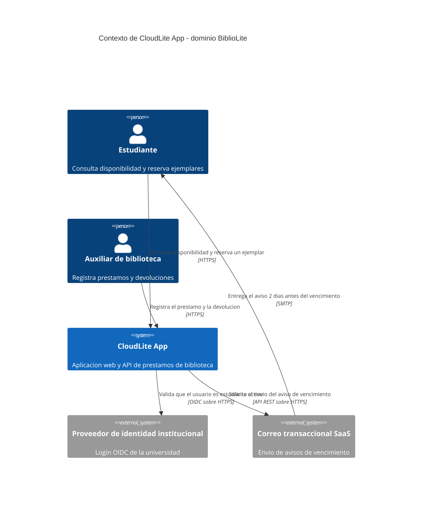
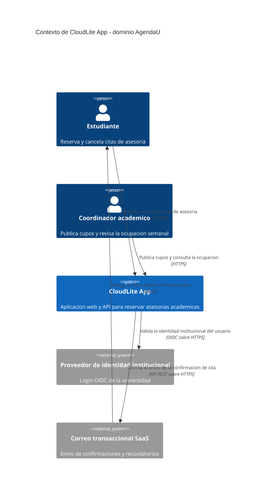

# Solucion Taller Clase 1 — Ficha, C4 Context y nube vs on-premise

> **DOCUMENTO DOCENTE — PRIVADO.** No publicar en `Clases/` ni en ExamLab antes del cierre de la entrega.

**Resumen:** Las 5 preguntas resueltas sobre el dominio **BiblioLite** (prestamos de biblioteca). El dominio de la solucion es distinto del que se proyecta en clase (AgendaU) a proposito: sirve de contraste para calificar, y evita que esta solucion se convierta en la respuesta que todos copian.

## Alineacion con el taller

- Taller del estudiante: `Clases/Clase 1 - Introduccion a arquitecturas cloud/`
- Configuracion en la plataforma: `Kit docente/Clase 1/Taller en ExamLab - Clase 1 (configuracion).md`
- Hito del PI: Definir dominio CloudLite App + 3–5 capacidades + problema en 2–3 frases
- Entregable: Ficha PI de 6 bloques + C4 Context en Mermaid renderizado en ExamLab (boceto previo en Excalidraw/draw.io)
- **Total: 100 puntos** repartidos en 5 preguntas.

| # | Pregunta | Tipo | Puntos |
|---|---|---|---|
| 1 | Ficha del PI CloudLite App | `abierta` | 20 |
| 2 | C4 Context en Mermaid | `diagrama` | 35 |
| 3 | Nube y on-premise: que es cierto | `cerrada_multi` | 15 |
| 4 | Nube u on-premise para CloudLite: tabla y veredicto | `abierta` | 20 |
| 5 | Nivel del modelo C4 | `cerrada` | 10 |

---

## Pregunta 1 · Ficha del PI CloudLite App · 20 pts

### Respuesta esperada

**1. DOMINIO**
BiblioLite: prestamo y devolucion de libros de la biblioteca de la universidad.

**2. PROBLEMA** (3 frases: quien sufre, como se resuelve hoy, cifra del dolor)
Los estudiantes que necesitan un libro de reserva no saben si esta disponible sin ir
hasta el mostrador. Hoy la biblioteca lleva los prestamos en una planilla de Excel que
solo la auxiliar puede abrir, y las renovaciones se piden por WhatsApp al numero
personal de la auxiliar. En el ultimo semestre se registraron 38 libros devueltos tarde
sin cobro de multa porque nadie noto el vencimiento.

**3. CAPACIDADES** (4, verbo + objeto de negocio, sin tecnologia)
- Consultar disponibilidad de un titulo
- Reservar un ejemplar
- Renovar un prestamo vigente
- Notificar el vencimiento del prestamo

**4. ACTORES** (3, con lo que espera cada uno)
- Estudiante: quiere saber si el libro esta libre sin caminar hasta la biblioteca.
- Auxiliar de biblioteca: quiere registrar un prestamo en menos de 30 segundos.
- Coordinador de la biblioteca: quiere saber que titulos se agotan cada semestre.

**5. SISTEMAS EXTERNOS** (2 o 3, con los que BiblioLite intercambia informacion)
- Proveedor de identidad institucional: valida que quien reserva es estudiante activo.
- Correo transaccional SaaS: envia el aviso de vencimiento.

**6. FUERA DE ALCANCE** (3)
- No cobra multas ni procesa pagos.
- No digitaliza el contenido de los libros.
- No gestiona compras ni inventario de adquisiciones.

### Como calificar

- 3 pts los 6 bloques rotulados y completos.
- 4 pts el problema con las 3 frases exigidas **y una cifra medible**. La cifra es lo que mas falta: sin ella el problema es una opinion.
- 4 pts las 4 capacidades en verbo + objeto, **sin nombrar tecnologia**.
- 3 pts los 3 actores con expectativa explicita.
- 3 pts los 2 o 3 sistemas externos, y que sean **los mismos** que los `System_Ext` de la pregunta 2.
- 3 pts las 3 exclusiones.
- Si el dominio es generico («una app de la universidad», «una red social»), los bloques 1 y 2 valen **cero**: sin dominio concreto no hay nada que arquitecturar en las clases siguientes.

### Errores frecuentes y que hacer

- «Tener login con JWT» como capacidad. Es un medio, no un fin: la capacidad seria «autenticar al estudiante». Se corrige en el momento preguntando «¿que puede HACER el usuario con eso?».
- Problema sin cifra: «se pierde mucho tiempo». Pida un numero, aunque sea estimado; «38 libros» sirve, «mucho tiempo» no.
- Sistemas externos inventados que no vuelven a aparecer en el diagrama. Compare los dos bloques antes de poner nota: es el criterio de 3 pts.
- Fuera de alcance con cosas que nadie iba a pedir («no viaja a Marte»). Debe excluir lo que un evaluador razonable SI esperaria.

---

## Pregunta 2 · C4 Context en Mermaid · 35 pts

### Respuesta esperada (dominio de la solucion)

### Modelo de referencia que ve el estudiante

Es el que aparece en el enunciado de la plataforma, sobre el dominio **AgendaU**. Sirve para comparar estructura y conteos, no para calificar contenido:

### Como calificar

- 12 pts los conteos exactos: **1** `System`, **2** `Person`, **2** `System_Ext`. Se cuentan, no se estiman.
- 12 pts las **5** `Rel` con verbo de negocio **y** protocolo. Una flecha sin protocolo o rotulada «usa» no suma.
- 6 pts que renderice sin error de sintaxis dentro de ExamLab.
- 5 pts coherencia de nombres con la ficha de la pregunta 1.
- **Los 12 pts de conteos se pierden completos** si aparece un contenedor interno (base de datos, API, worker, cache): eso es nivel 2, y aprobarlo hoy deja sin sentido la Clase 4.

### Errores frecuentes y que hacer

- Base de datos o API dentro del diagrama. Es el error numero uno. La regla que hay que repetir: en Context el sistema es UNA caja negra.
- Flechas sin protocolo. Exija `HTTPS`, `OIDC sobre HTTPS`, `SMTP` o `API REST sobre HTTPS`; el protocolo es la mitad del criterio.
- Comas dentro de las etiquetas entre comillas: rompen la sintaxis del C4 en Mermaid. Se separa con «y» o con guion.
- Pegar el Mermaid que devolvio la IA sin revisarlo: aparecen cajas internas o los nombres no coinciden con la ficha. La IA acierta la sintaxis; el modelo sigue siendo del estudiante.
- Entregar solo el PNG del boceto y dejar la pregunta vacia. La pregunta es de tipo diagrama: si no renderiza, no se puede calificar.

---

## Pregunta 3 · Nube y on-premise: que es cierto · 15 pts

### Clave y por que

La clave se lee del banco de la plataforma, asi que esta es la que se califica. La columna de la derecha es lo que hay que poder responderle al estudiante cuando pregunte.

| | Opcion | Por que |
|---|---|---|
| **SI** | En la nube el costo se comporta como gasto operativo variable, mientras en on-premise es una inversion de capital anticipada. | CORRECTA. Es la diferencia de fondo y no de monto: on-premise compromete dinero antes de que exista una linea de codigo y se amortiza a anos; la nube se paga por lo consumido, mes a mes. Por eso en la nube el costo pasa a ser un atributo tecnico y no solo administrativo, idea que la Clase 10 retoma. |
| **SI** | La elasticidad permite devolver capacidad cuando baja la demanda, algo que no ocurre con servidores ya comprados. | CORRECTA. Devolver capacidad es lo que distingue elasticidad de «tener capacidad de sobra». Un servidor ya comprado no se puede devolver el lunes siguiente al pico. |
| no | Migrar a la nube elimina la responsabilidad del equipo sobre la seguridad de su propia aplicacion. | FALSA, y es la trampa principal. En la nube la responsabilidad se REPARTE, no desaparece: el proveedor responde por su infraestructura y el equipo sigue respondiendo por su propia aplicacion, sus permisos y sus datos. Cuanto se reparte es lo que decide el modelo de servicio de la Clase 2. |
| **SI** | En on-premise el equipo sigue respondiendo por la energia, el enfriamiento y el reemplazo del hardware. | CORRECTA. Energia, enfriamiento y reemplazo de hardware son costos y trabajo que no desaparecen porque el servidor este «ahi». Es el criterio 3 de la tabla de la pregunta 4. |
| no | La nube garantiza automaticamente menor latencia para todos los usuarios sin importar la region. | FALSA. La latencia depende de la distancia fisica a la region donde se despliega. Un usuario en Cali contra una region en Virginia puede estar peor que contra un servidor en el campus. |
| no | Todo sistema en la nube es por definicion mas barato que su equivalente on-premise. | FALSA. Es la generalizacion mas comun. La nube suele ganar en time-to-market y en no comprometer capital; en carga constante y predecible durante anos, on-premise puede salir mas barato. |

### Como calificar

- 5 pts por cada opcion correcta marcada.
- Se **descuentan 5 pts** por cada opcion incorrecta marcada, sin bajar de cero.
- Marcar las seis da **cero**: el diseno de la pregunta castiga marcar todo por seguridad.

### Errores frecuentes y que hacer

- Marcar la opcion de «la nube elimina la responsabilidad de seguridad». Si aparece muy repetida en el grupo, vale dedicarle dos minutos en la Clase 2, porque es el cimiento del modelo de responsabilidad compartida.
- Marcar «siempre mas barato». Suele venir de material de marketing; la respuesta corta es «depende de la carga y del plazo».

---

## Pregunta 4 · Nube u on-premise para CloudLite: tabla y veredicto · 20 pts

### Respuesta esperada

| Criterio | On-premise en la UNIAJC | Nube |
|---|---|---|
| Inversion inicial | Hay que comprar un servidor y su UPS antes de tener la primera pantalla de BiblioLite. No tengo presupuesto. | Arranco en cero y pago por lo que use mientras dure el semestre. |
| Tiempo hasta la primera demo del PI | Semanas: cotizar, comprar y pedir permiso a la oficina de TI para montar algo en la red del campus. | Minutos: aprovisiono y despliego el stub el mismo dia. |
| Quien opera SO, parches y respaldos | Yo, o la oficina de TI, todo el semestre. Si el prestamo se cae un sabado, no hay quien lo levante. | El proveedor la infraestructura; yo sigo respondiendo por la app y por los datos de los estudiantes. |
| El dia del pico (inicio de semestre) | La capacidad es la que compre. La semana de matricula todos buscan los libros de reserva a la vez y BiblioLite se cae. | Subo capacidad esa semana y la devuelvo despues. |

**Veredicto (las 2 frases que se piden):**

> Elijo **nube** para BiblioLite, porque necesito la primera demo en dos semanas y no tengo presupuesto de capital. **Asumo el riesgo de quedar amarrado al proveedor que elija**: si sube precios o cierra el servicio, mudar la base de prestamos y el envio de avisos me costaria rehacer la integracion.

### Como calificar

- 8 pts la tabla con los **4 criterios en el orden pedido** y las 3 columnas.
- 6 pts que las **8 celdas de comparacion hablen del dominio propio** y no de teoria generica. Una celda que dice «la nube es escalable» no dice nada sobre BiblioLite y no suma.
- 6 pts el veredicto de 2 frases con eleccion **y riesgo asumido**. **Cero en el veredicto si no nombra un riesgo**, aunque la eleccion sea razonable.
- Si el estudiante entrega la tabla de **AgendaU** que se proyecto en clase, tal cual, pierde los 6 pts de dominio propio: la diapositiva era una referencia de estructura, no la respuesta.

### Errores frecuentes y que hacer

- Veredicto sin riesgo: «elijo nube porque es mas facil». Es media respuesta y son 6 pts. El riesgo esperable es dependencia del proveedor; tambien valen el costo que crece sin control (Clase 10) o los datos alojados por un tercero (Clase 6).
- Decidir IaaS, PaaS o SaaS aqui. Hoy solo se decide nube u on-premise; el modelo de servicio es el ADR-001 de la Clase 2 y este veredicto es su entrada, no su conclusion.
- Celdas copiadas de internet. Se detectan rapido: no nombran el dominio ni una sola vez.
- Elegir on-premise. No es incorrecto por si mismo y **no se penaliza**, pero exija que el veredicto explique como consigue el servidor y quien lo opera durante el semestre; si no puede responderlo, la eleccion no esta sustentada.

---

## Pregunta 5 · Nivel del modelo C4 · 10 pts

### Clave y por que

La clave se lee del banco de la plataforma, asi que esta es la que se califica. La columna de la derecha es lo que hay que poder responderle al estudiante cuando pregunte.

| | Opcion | Por que |
|---|---|---|
| no | Nivel 1 - Context: el sistema como caja negra frente a actores y sistemas externos. | Incorrecta, y es la confusion que la pregunta busca detectar. Context es lo que el estudiante entrego HOY: el sistema como caja negra frente a actores y sistemas externos. |
| **SI** | Nivel 2 - Container: las aplicaciones y los almacenes de datos que forman el sistema. | CORRECTA. Container es el nivel que muestra las aplicaciones y los almacenes de datos que forman el sistema: la SPA, la API y la base de datos. Es el entregable de la Clase 4. |
| no | Nivel 3 - Component: las piezas internas de un unico contenedor. | Incorrecta. Component abre UN contenedor y muestra sus modulos internos; el enunciado pide las cajas del sistema completo, no las de una sola. |
| no | Nivel 4 - Code: las clases y las funciones. | Incorrecta. Code son clases y funciones, y en la practica casi nunca se dibuja porque el codigo mismo ya lo documenta. |

### Como calificar

- 10 pts la opcion correcta, 0 en cualquier otra. No hay puntos parciales.
- Comprueba que el estudiante distingue el nivel que entrega hoy (Context) del que entrega en la Clase 4 (Container). Si falla mas de un tercio del grupo, conviene repetir la regla de los cuatro niveles al abrir la Clase 4.

### Errores frecuentes y que hacer

- Marcar Context. Suele venir de haber memorizado «C4 = una caja» sin los cuatro niveles.
- Marcar Component. Confunde «piezas internas del sistema» con «piezas internas de un contenedor».

---

## Lo que van a preguntar (respuestas listas)

Estas son las dudas que aparecen todos los semestres. Tenerlas resueltas por escrito es lo que evita responder la misma cosa quince veces durante el taller.

**¿Puedo cambiar de dominio en la Clase 2?**

No. El dominio se cierra hoy y las Clases 4, 7, 11 y 15 reutilizan estos mismos nombres. Si el dominio elegido resulta demasiado grande, se recorta el bloque «fuera de alcance», no se cambia de dominio.

**¿El diagrama lo tengo que escribir a mano en Mermaid?**

No. Dibujelo en Excalidraw o draw.io, que es donde se piensa el modelo, y pida a una IA que lo traduzca a Mermaid. Usted revisa el resultado y lo pega en ExamLab. Lo que se califica es el diagrama renderizado en la plataforma, no el PNG.

**¿Por que mi diagrama no puede tener la base de datos?**

Porque este es el nivel Context, donde el sistema es una caja negra. La base de datos aparece en el nivel Container, que es el entregable de la Clase 4. Si se dibuja hoy, la Clase 4 no tendria nada nuevo que revelar.

**¿Cuantas cajas debe tener el diagrama?**

Entre cuatro y ocho elementos en total. Si hay veinte, es casi seguro que se colaron piezas internas del sistema.

**¿Entonces la respuesta correcta siempre es nube?**

Para un proyecto de un semestre, sin presupuesto y con una sola persona desarrollando, casi siempre si. Pero lo que se califica no es la eleccion: son los 4 criterios aplicados a su dominio y el riesgo que declara asumir. Un veredicto por on-premise bien sustentado vale lo mismo.

**¿Tengo que abrir una cuenta en AWS o en Azure?**

No, y ninguna actividad del curso lo va a pedir. Todo se trabaja con draw.io, Excalidraw, Killercoda y el nivel gratuito de GitHub Actions. No se pide tarjeta de credito en ningun momento del semestre.

**¿La ficha la entrego en Word o en ExamLab?**

La entrega que se califica es la respuesta dentro de ExamLab. El documento en Word o Google Docs es opcional y solo sirve para que conserve sus respuestas.

---

## Politica de entrega

La entrega que se califica es la respuesta dentro de ExamLab (https://uniaj.examlab.workers.dev/). El documento en Word o Google Docs es opcional y solo sirve para que el estudiante conserve sus respuestas. Gratis + navegador; sin cuentas cloud de pago ni tarjeta.
