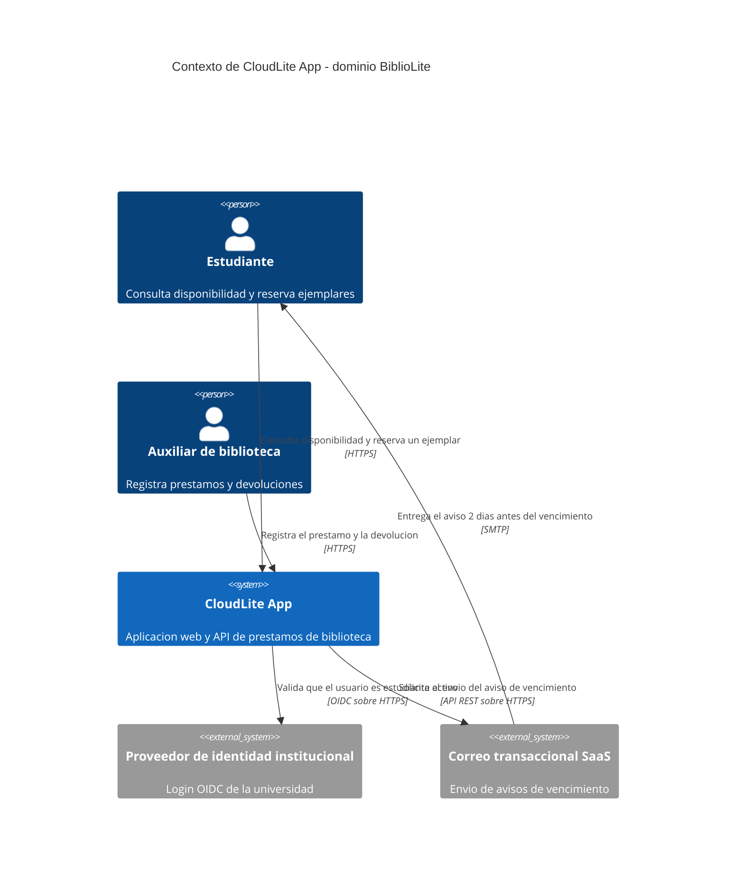
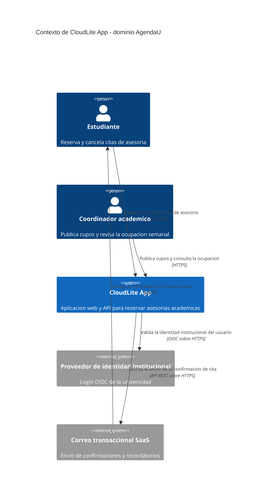

# Solucion — Actividad del Corte 1, preguntas 1 a 4 (dominio, ficha, C4 Context y calidad)

> **DOCUMENTO DOCENTE — PRIVADO.** No publicar en `Clases/` ni en ExamLab antes del cierre de la entrega.

**Resumen:** Las cuatro preguntas que corresponden a la Clase 1, resueltas sobre el dominio **BiblioLite** (prestamos de biblioteca). El dominio de la solucion es distinto del que se proyecta en clase (**AgendaU**) a proposito: sirve de contraste para calificar y evita que esta solucion se convierta en la respuesta que todos copian.

> Estas 4 preguntas valen **25 de los 100 puntos** de la actividad del Corte 1, que es **una sola para las Clases 1 a 4** y se entrega completa al cierre del corte. Las preguntas 5 a 15 se resuelven en las Clases 2, 3 y 4.

## Alineacion con el taller

- Taller del estudiante: `Clases/Clase 1 - Introduccion a arquitecturas cloud/`
- Configuracion en la plataforma: `Kit docente/Clase 1/Taller en ExamLab - Clase 1 (configuracion).md`
- Hito del PI: Definir dominio CloudLite App + 3–5 capacidades + problema en 2–3 frases
- Entregable: Ficha PI de 5 bloques + C4 Context en Mermaid renderizado en ExamLab (boceto previo en Excalidraw/draw.io)
- **Estas preguntas: 25.0 puntos** en 4 preguntas.

| # | Pregunta | Tipo | Puntos |
|---|---|---|---|
| 1 | Dominio y problema de CloudLite App | `abierta` | 5.0 |
| 2 | Ficha del dominio (cinco bloques) | `abierta` | 7.0 |
| 3 | C4 Context en Mermaid | `diagrama` | 8.0 |
| 4 | Atributos de calidad de su CloudLite | `abierta` | 5.0 |

---

## Pregunta 1 · Dominio y problema de CloudLite App · 5.0 pts

### Respuesta esperada

**DOMINIO**
BiblioLite: prestamo y devolucion de libros de la biblioteca de la universidad.

**PROBLEMA** (3 frases: quien lo sufre y como se mide)
El auxiliar de biblioteca lleva los prestamos en una planilla de Excel que solo el puede
abrir, y las renovaciones le llegan por WhatsApp a su numero personal. Los estudiantes que
necesitan un libro de reserva no saben si esta disponible sin ir hasta el mostrador. El
semestre pasado se registraron 38 libros devueltos tarde sin cobro de multa, porque nadie
noto el vencimiento.

### Como calificar

- 3 pts el dominio concreto y del tamano adecuado.
- 1.5 pts que el problema nombre a **QUIEN** lo sufre con un rol concreto. «Los usuarios» no es un rol; «el auxiliar de biblioteca» si.
- 1.75 pts que incluya **una cifra** que mida el dolor. Una cifra estimada sirve; «mucho tiempo» o «se pierde informacion» no.
- **Si el dominio es generico** («una red social», «una app de la universidad», «un e-commerce»), **toda la pregunta vale cero**: sin dominio concreto no hay nada que arquitecturar en las clases siguientes, y el estudiante llegaria a la pregunta 13 sin sistema que dibujar.
- Se descuenta si el problema pasa de 3 frases.

### Errores frecuentes y que hacer

- Dominio generico. Es el error que hay que cortar HOY, porque arrastra las once preguntas. La prueba rapida: si el enunciado sirve igual para otro sistema, no es un dominio.
- Problema sin cifra: «se pierde mucho tiempo». Pida un numero, aunque sea estimado, y aceptelo: el objetivo es que exista algo medible contra lo que comparar, no la exactitud del dato.
- Problema que describe la solucion y no el dolor: «el problema es que no tienen una app». El problema es lo que pasa hoy sin el sistema.
- Confundir quien sufre con quien paga. El coordinador aprueba el proyecto; el que sufre es quien hace el trabajo manual todos los dias.

---

## Pregunta 2 · Ficha del dominio (cinco bloques) · 7.0 pts

### Respuesta esperada

**DOMINIO**
BiblioLite: prestamo y devolucion de libros de la biblioteca de la universidad.

**PROBLEMA**
(el mismo de la pregunta 1, repetido para que la ficha se lea completa)

**ACTORES** (2 a 3, con lo que espera cada uno, y los sistemas externos)
- Estudiante: quiere saber si el libro esta libre sin caminar hasta la biblioteca.
- Auxiliar de biblioteca: quiere registrar un prestamo en menos de 30 segundos.
- Coordinador de la biblioteca: quiere saber que titulos se agotan cada semestre.
- Sistemas externos: proveedor de identidad institucional (valida que quien reserva es
  estudiante activo) y correo transaccional SaaS (envia el aviso de vencimiento).

**CAPACIDADES** (3 a 5, verbo + objeto de negocio)
- Consultar disponibilidad de un titulo
- Reservar un ejemplar
- Renovar un prestamo vigente
- Notificar el vencimiento del prestamo

**FUERA DE ALCANCE**
- No cobra multas ni procesa pagos.
- No digitaliza el contenido de los libros.
- No gestiona compras ni inventario de adquisiciones.

### Como calificar

- 2 pts los **cinco** bloques presentes y rotulados en el orden pedido.
- 2.5 pts las capacidades (**3 a 5**) en verbo mas objeto de negocio, sin nombrar tecnologia. Se descuenta por cada capacidad que sea una pieza tecnica.
- 2.25 pts los actores (**2 a 3**) con su expectativa explicita, **mas los sistemas externos nombrados dentro de este mismo bloque**.
- 2 pts el fuera de alcance con exclusiones que un evaluador razonable si habria esperado.
- Los sistemas externos de la ficha deben ser **los mismos** que aparezcan en el diagrama de la pregunta 3. Compare los dos antes de poner nota.

### Errores frecuentes y que hacer

- «Tener login con JWT» o «usar cache» como capacidad. Son medios, no fines. Se corrige en el momento preguntando «¿que puede HACER el usuario con eso?»: la capacidad seria «autenticar al estudiante».
- Poner los sistemas externos en un bloque aparte. La ficha son cinco bloques y van dentro de ACTORES; no penalice la intencion, pero corrija la estructura porque la rubrica cuenta cinco.
- Ocho o diez capacidades. El rango es 3 a 5 y es una decision pedagogica: con una sola persona y doce semanas, un alcance de ocho capacidades garantiza que el proyecto no llegue a ninguna parte.
- Fuera de alcance con cosas que nadie iba a pedir («no viaja a Marte»). Debe excluir lo que un evaluador razonable SI esperaria.
- Actores que no son personas: «la base de datos» no es un actor. Los actores son humanos con un rol; lo demas son sistemas externos.

---

## Pregunta 3 · C4 Context en Mermaid · 8.0 pts

### Respuesta esperada (dominio de la solucion)

### Modelo de referencia que ve el estudiante

Es el que aparece en el enunciado de la plataforma, sobre el dominio **AgendaU**. Sirve para comparar estructura y conteos, no para calificar contenido:

### Como calificar

- 3 pts **una sola caja** `System` para CloudLite completo.
- 2 pts los actores como `Person`, coherentes con la ficha.
- 2 pts los sistemas externos como `System_Ext`, los mismos que la ficha.
- 2 pts que **toda** flecha lleve verbo de negocio **y** protocolo. Una flecha rotulada «usa», o sin protocolo, no suma.
- 1 pt que el diagrama renderice sin error dentro de la plataforma.
- **Si aparece un contenedor interno** (base de datos, API, worker, cache) se pierden los 3 pts de la caja del sistema: eso es el nivel Container de la pregunta 13, y aprobarlo aqui la deja sin nada que revelar.

### Errores frecuentes y que hacer

- Base de datos o API dentro del diagrama. Es el error numero uno. La regla que hay que repetir: en Context el sistema es UNA caja negra.
- Flechas sin protocolo. Exija `HTTPS`, `OIDC sobre HTTPS`, `SMTP` o `API REST sobre HTTPS`; el protocolo es la mitad del criterio.
- Comas dentro de las etiquetas entre comillas: rompen la sintaxis del C4 en Mermaid. Se separa con «y» o con guion.
- Pegar el Mermaid que devolvio la IA sin revisarlo: aparecen cajas internas o los nombres no coinciden con la ficha. La IA acierta la sintaxis; el modelo sigue siendo del estudiante.
- Entregar solo el PNG del boceto y dejar la pregunta vacia. La pregunta es de tipo diagrama: si no renderiza, no se puede calificar.

---

## Pregunta 4 · Atributos de calidad de su CloudLite · 5.0 pts

### Respuesta esperada

**Atributo 1 — Disponibilidad**
Por que pesa en BiblioLite: la semana de matricula todos buscan los libros de reserva a la
vez, y si el sistema no responde el estudiante vuelve al mostrador, que es justo el
problema que veniamos a resolver.
Como lo mediria: el sistema responde el 99,5 % del mes, es decir que acepto hasta unas 3
horas y media de caida, siempre que no caigan en la semana de matricula.

**Atributo 2 — Rendimiento**
Por que pesa en BiblioLite: la consulta de disponibilidad es la accion que mas se repite y
compite contra la alternativa de caminar hasta la biblioteca; si tarda, nadie la usa.
Como lo mediria: el listado de disponibilidad de un titulo responde en menos de 400 ms
para el 95 % de las consultas.

**Conflicto**
Sacrifico disponibilidad antes que rendimiento. Prefiero un sistema que a veces este caido
pero que cuando responda sea inmediato, porque el estudiante que encuentra el sistema
caido camina hasta la biblioteca igual que hoy, mientras que uno que espera diez segundos
deja de confiar en el dato y tampoco vuelve. A cambio acepto no montar redundancia, que es
lo que me permite sostener el proyecto sin presupuesto.

### Como calificar

- 1 pt la eleccion de dos atributos **con una razon atada al dominio**. «La disponibilidad es importante» no es una razon; «la semana de matricula todos consultan a la vez» si.
- 2 pts las dos metricas, con **numero y unidad**. Una metrica sin numero («que sea rapido», «que sea seguro») no suma. El numero puede ser discutible; lo que no puede es faltar.
- 2 pts la frase de conflicto: **cual sacrifica y que gana**. **Cero en este criterio** si la respuesta dice que los cuatro son igual de importantes o no elige: es justamente lo que la pregunta evalua.

### Errores frecuentes y que hacer

- Elegir los cuatro «porque todos importan». Es la respuesta que la pregunta busca descartar: si no se sacrifica nada, no se decidio nada. Devuelvala pidiendo que elija dos.
- Metricas copiadas de la clase sin aterrizar: «menos de 300 ms» sirve solo si dice de QUE operacion de su dominio.
- Confundir seguridad con disponibilidad: «que nadie lo tumbe» es disponibilidad; seguridad es quien puede ver o cambiar que.
- Usar porcentajes sin traducirlos a tiempo. Si escribe 99,9 %, pidale que diga cuantos minutos al mes son: es la unica forma de saber si entendio lo que esta prometiendo.

---

## Lo que van a preguntar (respuestas listas)

Estas son las dudas que aparecen todos los semestres. Tenerlas resueltas por escrito es lo que evita responder la misma cosa quince veces durante el taller.

**¿La actividad se entrega hoy?**

No. Es una sola actividad de 15 preguntas para las Clases 1 a 4. Hoy se resuelven las cuatro primeras; la entrega completa cierra al final del Corte 1. Conviene decirlo al abrir el taller, porque es la duda que mas aparece.

**¿Puede cambiar de dominio en la Clase 2?**

No. El dominio se cierra hoy y las preguntas 5 a 15 lo reutilizan. Si el dominio elegido resulta demasiado grande, se recorta el bloque «fuera de alcance», no se cambia de dominio.

**¿Cuantos actores y capacidades exactamente?**

Son rangos, no numeros fijos: 2 a 3 actores y 3 a 5 capacidades. Lo que se califica no es la cantidad sino la forma: actor con expectativa, capacidad en verbo mas objeto de negocio.

**¿Los sistemas externos son un bloque de la ficha?**

No. La ficha son cinco bloques y los sistemas externos van dentro de ACTORES. Si un estudiante los pone aparte, corrija la estructura pero no penalice la intencion: lo que importa es que esten y que coincidan con el diagrama.

**¿El diagrama hay que escribirlo a mano en Mermaid?**

No. Se disena en Excalidraw o draw.io, que es donde se piensa el modelo, y se pide a una IA que lo traduzca. Lo que se califica es el diagrama renderizado dentro de ExamLab, no el PNG.

**¿Por que el diagrama no puede tener la base de datos?**

Porque es el nivel Context, donde el sistema es una caja negra. La base de datos aparece en el nivel Container, que es la pregunta 13 de esta misma actividad. Si se dibuja hoy, esa pregunta no tendria nada nuevo que revelar.

**¿Cuantas cajas debe tener el diagrama?**

Entre cuatro y ocho elementos en total. Si hay veinte, es casi seguro que se colaron piezas internas del sistema.

**¿Hay que abrir una cuenta en AWS o en Azure?**

No, y ninguna actividad del curso lo va a pedir. Todo se trabaja con draw.io, Excalidraw, Killercoda y el nivel gratuito de GitHub Actions. No se pide tarjeta de credito en ningun momento del semestre.

---

## Politica de entrega

La entrega que se califica es la respuesta dentro de ExamLab (https://uniaj.examlab.workers.dev/). El documento en Word o Google Docs es opcional y solo sirve para que el estudiante conserve sus respuestas. Gratis + navegador; sin cuentas cloud de pago ni tarjeta.
