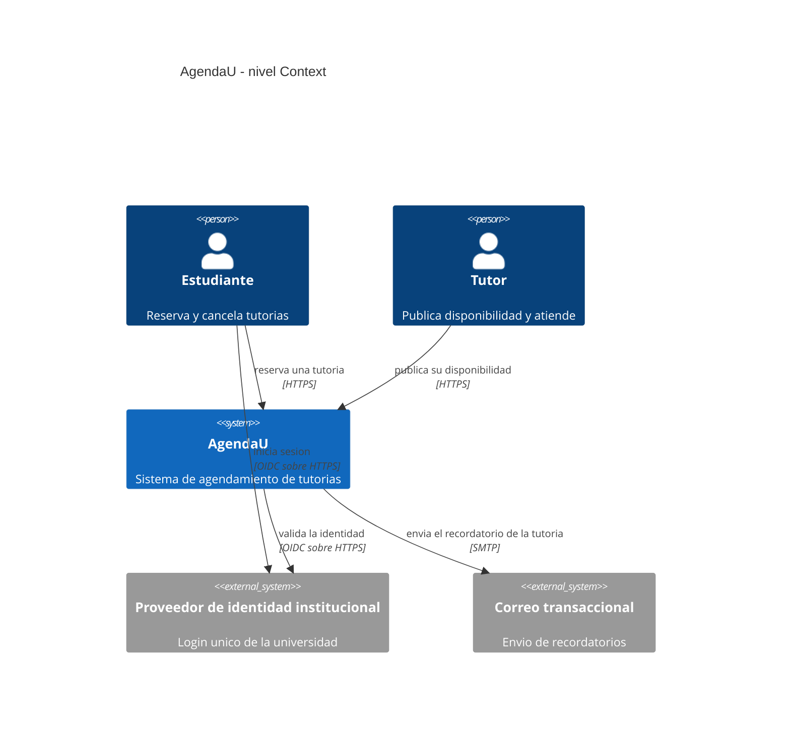

# Solución Taller Clase 1 — Ficha + C4 Context CloudLite

> DOCUMENTO DOCENTE — PRIVADO. No publicar en Clases/ ni en ExamLab antes del cierre.

**Resumen:** Ejemplo aceptable (AgendaU). Actividad individual. Otros dominios válidos si cumplen criterios.

## Alineacion al enunciado estudiante
- Taller: `Clases/Clase 1 - Introduccion a arquitecturas cloud/Taller Clase 1 — Ficha y boceto CloudLite App.docx`
- Hito PI: Definir dominio CloudLite + 3-5 capacidades + problema en 2-3 frases
- Entregable: Ficha PI: dominio, capacidades, actores y boceto C4 Context
- Actividad **individual**: cada estudiante entrega su propia ficha y su propio diagrama en ExamLab.

## Solucion paso a paso
1. Actividad individual. Dominio: AgendaU (tutorías estudiante-docente).
2. Problema: estudiantes pierden turnos por doble agenda y recordatorios débiles.
3. Capacidades: reservar, cancelar, recordar, ver disponibilidad.
4. Actores: Estudiante, Tutor; sistemas externos: proveedor de identidad, correo/calendario.
5. C4 Context: boceto en Excalidraw o draw.io → conversión a Mermaid (`C4Context`) con ayuda de una IA → pegado y **renderizado** en la pregunta 2 de ExamLab. El PNG/.drawio exportado va a la carpeta del PI, pero lo que se califica es el Mermaid renderizado.

## Ejemplo / artefactos esperados
- DOMINIO: AgendaU
- PROBLEMA: pérdida de turnos por solapamientos y falta de recordatorio.
- CAPACIDADES: reservar, cancelar, listar disponibilidad, notificar.
- ACTORES: Estudiante, Tutor.
- SISTEMAS EXTERNOS: proveedor de identidad institucional (login), correo/calendario SaaS (recordatorios).
- FUERA DE ALCANCE: pagos, videollamada, app nativa.
- C4: CloudLite App <-HTTPS-> personas; CloudLite ->SMTP-> correo SaaS; CloudLite ->OIDC-> proveedor de identidad.

**Mermaid de referencia** (es el que debería producir un estudiante que hizo bien el paso 3; úselo para comparar conteos: 1 `System`, 2 `Person`, 2 `System_Ext`, 5 `Rel`):

## Rubrica corta / checklist de correccion
- [ ] Dominio concreto (2)
- [ ] Capacidades+actores (2)
- [ ] Sistemas externos coherentes con el C4 (1)
- [ ] C4 correcto (3)
- [ ] Evidencia+entrega (1)
- [ ] Fuera de alcance (1)
- [ ] El diagrama quedó **renderizado dentro de ExamLab** (no basta el PNG adjunto)
- [ ] Los nombres de actores y sistemas externos son los mismos en la ficha y en el diagrama

## Errores frecuentes
- Rechazar dominio vago sin actor/métrica.
- No pedir Containers internos hoy.
- C4 sin flechas.
- Ficha con bloque EQUIPO cuando el docente no autorizo equipos: la actividad es individual por defecto y solo admite lenguaje de equipo si hubo autorizacion.
- Entregar el PNG del boceto y dejar vacía la pregunta de diagrama. La pregunta 2 es de tipo `diagrama` y solo recibe texto Mermaid: si no renderiza, no se puede calificar. Es el error más frecuente de la primera clase, así que conviene anunciarlo antes de que empiecen.
- Pegar el Mermaid que devolvió la IA sin revisarlo: aparecen contenedores internos (base de datos, API), se pierden las etiquetas de protocolo o los nombres no coinciden con la ficha. La IA acierta la sintaxis; el modelo sigue siendo del estudiante.

## Entrega / politica
La entrega oficial es la respuesta a las preguntas abiertas dentro de ExamLab (https://uniaj.examlab.workers.dev/); el documento en Word/Google Docs es opcional y solo sirve para conservar respuestas. Gratis + navegador · sin cloud con tarjeta.
La UNIAJC no tiene campus virtual propio.
