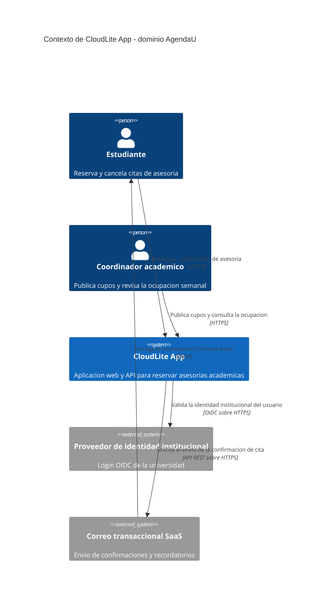

# Taller de la Clase 1 en ExamLab - configuracion

- **Curso:** Arquitectura de Sistemas Computacionales (FI303380)
- **Taller:** Taller Clase 1 en ExamLab - Ficha y C4 Context de CloudLite App
- **Preguntas:** 5 · **Total:** 100 puntos
- **Plataforma:** ExamLab (https://examlab.lovable.app/) · modulo Talleres
- **Hito del PI:** Definir dominio CloudLite App + 3–5 capacidades + problema en 2–3 frases
- **Entregable de la clase:** Ficha PI: dominio, capacidades, actores y boceto C4 Context (Excalidraw/draw.io)

> ExamLab no importa preguntas desde archivo: el alta se hace en la UI del
> docente (o con la pestana de IA). Este documento trae el texto exacto de cada
> campo para copiar y pegar, incluidos el SQL de partida y el codigo base.

**Que produce el estudiante:** El estudiante sale con el dominio de CloudLite cerrado en una ficha de 6 bloques y con el diagrama C4 Context renderizado dentro de ExamLab, que es la semilla de todos los diagramas del semestre.

---

## Pregunta 1 - Respuesta escrita · 20 pts

**Tipo en la plataforma:** `abierta`

**Enunciado (campo Contenido):**

## Ficha del PI CloudLite App

Esta es una actividad **individual**: cada estudiante entrega su propia ficha y su propio diagrama. Escriba su ficha respetando **exactamente** esta estructura de 6 bloques rotulados:

1. **DOMINIO**: una linea. Elija uno concreto: AgendaU (asesorias academicas), BiblioLite (prestamos), InventarioLab (equipos de laboratorio), TurnosClinica (citas) o EventosCampus (inscripciones). Puede proponer uno propio del mismo tamano.
2. **PROBLEMA**: exactamente 3 frases, en este orden: (a) quien sufre el problema, (b) como se resuelve hoy sin CloudLite, (c) una cifra medible del dolor. Ejemplo de (c): `hoy se cruzan 40 correos por semana para cuadrar 12 asesorias`.
3. **CAPACIDADES**: exactamente 4 capacidades en formato verbo + objeto de negocio (reservar cita, publicar cupo, cancelar reserva, notificar recordatorio). **Prohibido nombrar tecnologia.**
4. **ACTORES**: exactamente 3 actores humanos, cada uno con una frase de que espera del sistema.
5. **SISTEMAS EXTERNOS**: 2 o 3 sistemas de terceros con los que CloudLite intercambia informacion (por ejemplo un proveedor de identidad institucional, un servicio de correo transaccional o una pasarela de pagos). Estos mismos nombres son los que despues aparecen como `System_Ext` en el diagrama de la pregunta 2.
6. **FUERA DE ALCANCE**: exactamente 3 cosas que CloudLite NO hara este semestre.

Esta ficha es la seccion 1 del informe del PI y el dominio **no vuelve a cambiar** en el resto del curso: las clases 4, 7, 11 y 15 reutilizan estos mismos nombres.

> **La entrega oficial es esta respuesta dentro de ExamLab.** El documento o ficha en Word/Google Docs que use para preparar sus ideas es opcional y solo sirve para conservar sus respuestas; lo que se califica es lo que quede escrito aqui.

**Rubrica esperada (campo Rubrica):**

3 pts los 6 bloques rotulados y completos. 4 pts el problema con las 3 frases exigidas y una cifra medible. 4 pts las 4 capacidades en verbo + objeto sin mencionar tecnologia. 3 pts los 3 actores con expectativa explicita. 3 pts los 2 o 3 sistemas externos coherentes con los System_Ext del diagrama de la pregunta 2. 3 pts las 3 exclusiones. Si el dominio es generico (app de la universidad, red social), los bloques 1 y 2 valen cero.

---

## Pregunta 2 - Diagrama (Mermaid) · 35 pts

**Tipo en la plataforma:** `diagrama`

**Enunciado (campo Contenido):**

## C4 Context de CloudLite App

Escriba en Mermaid el diagrama **C4Context** de su CloudLite. La primera linea debe ser exactamente `C4Context`. Debe contener:

- Exactamente **1** `System(...)`: CloudLite App completo, como caja negra.
- Exactamente **2** `Person(...)`: sus dos actores principales de la ficha.
- Exactamente **2** `System_Ext(...)`: dos sistemas de terceros con los que CloudLite habla (por ejemplo el proveedor de identidad institucional y el servicio de correo transaccional).
- Exactamente **5** `Rel(...)`, cada una con **verbo de negocio** y **protocolo** (`HTTPS`, `OIDC sobre HTTPS`, `SMTP`, `API REST sobre HTTPS`).

**Verifique antes de enviar**, renderizando dentro de ExamLab: (a) no aparece ninguna caja interna del sistema (nada de base de datos, API ni worker: eso es la Clase 4), (b) cada flecha se lee como frase completa, (c) los nombres son identicos a los de su ficha.

> El modelo de referencia esta escrito sobre el dominio **AgendaU**. Usted conserva la estructura y los conteos, y cambia los nombres por los de su dominio.

**Consejo de sintaxis:** no use comas dentro de las etiquetas entre comillas del C4; separe con `y` o con guion.

**Diagrama de referencia (Mermaid):**

**Rubrica esperada (campo Rubrica):**

12 pts los conteos exactos: 1 System, 2 Person, 2 System_Ext. 12 pts las 5 relaciones con verbo de negocio y protocolo. 6 pts que el diagrama renderice sin error de sintaxis. 5 pts coherencia de nombres con la ficha. Se pierden los 12 pts de conteos si aparecen contenedores internos (base de datos, API, worker) porque eso es nivel 2.

---

## Pregunta 3 - Seleccion multiple · 15 pts

**Tipo en la plataforma:** `cerrada_multi`

**Enunciado (campo Contenido):**

## Nube y on-premise: que es cierto

Seleccione las **3 afirmaciones correctas** para un proyecto academico como CloudLite App.

**Opciones:**

- [x] En la nube el costo se comporta como gasto operativo variable, mientras en on-premise es una inversion de capital anticipada.
- [x] La elasticidad permite devolver capacidad cuando baja la demanda, algo que no ocurre con servidores ya comprados.
- [ ] Migrar a la nube elimina la responsabilidad del equipo sobre la seguridad de su propia aplicacion.
- [x] En on-premise el equipo sigue respondiendo por la energia, el enfriamiento y el reemplazo del hardware.
- [ ] La nube garantiza automaticamente menor latencia para todos los usuarios sin importar la region.
- [ ] Todo sistema en la nube es por definicion mas barato que su equivalente on-premise.

**Rubrica esperada (campo Rubrica):**

5 pts por cada opcion correcta marcada; se descuentan 5 pts por cada opcion incorrecta marcada, sin bajar de cero. Marcar las seis da cero.

---

## Pregunta 4 - Respuesta escrita · 20 pts

**Tipo en la plataforma:** `abierta`

**Enunciado (campo Contenido):**

## Nube u on-premise para CloudLite

Construya una tabla de **3 columnas** con los encabezados exactos `Criterio | On-premise en la UNIAJC | Nube` y **exactamente 4 filas**, una por criterio y en este orden:

1. Inversion inicial necesaria para arrancar.
2. Tiempo hasta la primera demo del PI.
3. Quien opera el sistema operativo, los parches y los respaldos.
4. Que pasa el dia del pico de su dominio (matricula, inicio de semestre, jornada de citas).

Cada celda: **maximo 2 lineas** y siempre referida a *su* dominio, no a teoria general.

Cierre con un **veredicto de 2 frases**: (a) que opcion elige para CloudLite, (b) cual es el riesgo concreto que asume al elegirla. Ese veredicto se copia a la seccion 1 del informe y es la entrada del ADR-001 de la Clase 2.

**Rubrica esperada (campo Rubrica):**

8 pts la tabla con los 4 criterios en el orden pedido y las 3 columnas. 6 pts que las 8 celdas de comparacion hablen del dominio propio y no de teoria generica. 6 pts el veredicto de 2 frases con eleccion y riesgo asumido; cero en el veredicto si no nombra un riesgo.

---

## Pregunta 5 - Seleccion unica · 10 pts

**Tipo en la plataforma:** `cerrada`

**Enunciado (campo Contenido):**

## Nivel del modelo C4

Usted quiere mostrar **las cajas internas de CloudLite** (la SPA, la API y la base de datos) y como se comunican entre si. Que nivel del modelo C4 corresponde?

**Opciones:**

- [ ] Nivel 1 - Context: el sistema como caja negra frente a actores y sistemas externos.
- [x] Nivel 2 - Container: las aplicaciones y los almacenes de datos que forman el sistema.
- [ ] Nivel 3 - Component: las piezas internas de un unico contenedor.
- [ ] Nivel 4 - Code: las clases y las funciones.

**Rubrica esperada (campo Rubrica):**

10 pts la opcion correcta, 0 en cualquier otra. Comprueba que el estudiante distingue el nivel que entrega hoy (Context) del que entrega en la Clase 4 (Container).

---

## Al terminar de crearlo

- Verifique que la suma de puntos sea la esperada: **100**.
- Publique el taller y confirme la fecha limite (domingo 23:59 segun el Acuerdo).
- Las preguntas con SQL o codigo: ejecutelas una vez usted mismo antes de publicar,
  para confirmar que el SQL de partida corre y que el starter compila.
