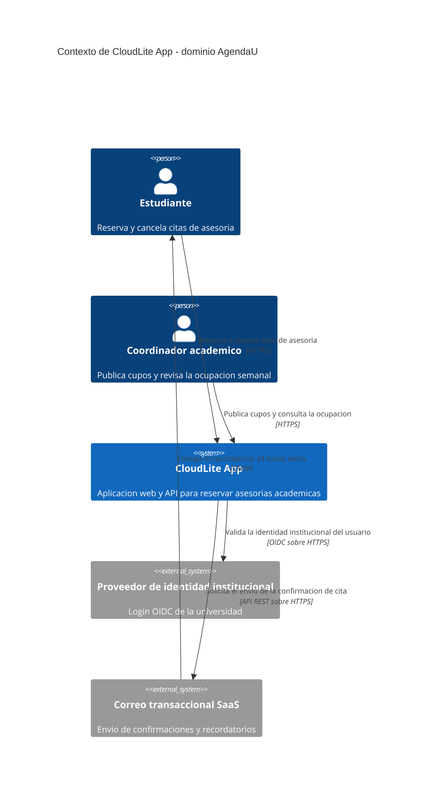

# Taller de la Clase 1 en ExamLab - configuracion

- **Curso:** Arquitectura de Sistemas Computacionales (FI303380)
- **Taller:** Actividad del Corte 1 (preguntas 1 a 4) - Dominio, ficha, C4 Context y calidad
- **Preguntas:** 4 · **Total:** 25 puntos
- **Plataforma:** ExamLab (https://uniaj.examlab.workers.dev/) · modulo Talleres
- **Hito del PI:** Definir dominio CloudLite App + 3–5 capacidades + problema en 2–3 frases
- **Entregable de la clase:** Ficha PI de 5 bloques + C4 Context en Mermaid renderizado en ExamLab (boceto previo en Excalidraw/draw.io)

> ExamLab no importa preguntas desde archivo: el alta se hace en la UI del
> docente (o con la pestana de IA). Este documento trae el texto exacto de cada
> campo para copiar y pegar, incluidos el SQL de partida y el codigo base.

**Que produce el estudiante:** Las preguntas 1 a 4 de la actividad del Corte 1, que es una sola para las Clases 1 a 4. El estudiante sale con el dominio de CloudLite cerrado en una ficha de cinco bloques y con el diagrama C4 Context renderizado dentro de ExamLab, que es la semilla de todos los diagramas del semestre.

---

## Pregunta 1 - Respuesta escrita · 5.0 pts

**Tipo en la plataforma:** `abierta`

**Enunciado (campo Contenido):**

## Dominio y problema de CloudLite App

Elija un dominio **concreto** para CloudLite App y escriba el problema en **2 o 3 frases**.

Dominios sugeridos: **AgendaU** (asesorias academicas) · **BiblioLite** (prestamos de
biblioteca) · **InventarioLab** (equipos de laboratorio) · **TurnosClinica** (citas) ·
**EventosCampus** (inscripciones). Puede proponer uno propio del mismo tamano.

El problema debe decir dos cosas, y las dos se califican:

1. **QUIEN lo sufre.** Una persona concreta con un rol, no «los usuarios».
2. **COMO se mide.** Una cifra, aunque sea estimada: `se cruzan 40 correos por semana
   para cuadrar 12 asesorias`, `38 libros devueltos tarde el semestre pasado`.

> No vale un dominio generico. «Una red social», «una app de la universidad» o «un
> e-commerce» no permiten evaluar ninguna decision de arquitectura, porque no hay nada
> concreto que disenar. Si su enunciado sirve igual para cualquier otro sistema, todavia
> no es un dominio.

Este dominio **no vuelve a cambiar** en el resto del curso: las Clases 2, 3 y 4 de esta
misma actividad, y las Clases 7, 11 y 15, reutilizan estos nombres.

> La entrega oficial es esta respuesta dentro de ExamLab. El documento en Word o Google Docs es opcional y solo sirve para conservar sus respuestas.

**Rubrica esperada (campo Rubrica):**

3 pts el dominio concreto y del tamano adecuado. Si es generico (red social, app de la universidad), toda la pregunta vale cero: sin dominio no hay nada que arquitecturar en las clases siguientes. 1.5 pts que el problema nombre a QUIEN lo sufre con un rol concreto. 1.75 pts que incluya una cifra que mida el dolor; una cifra estimada sirve, «mucho tiempo» no. Se descuenta si el problema pasa de 3 frases.

---

## Pregunta 2 - Respuesta escrita · 7.0 pts

**Tipo en la plataforma:** `abierta`

**Enunciado (campo Contenido):**

## Ficha del dominio

Complete la ficha del dominio que eligio en la pregunta anterior. Son **cinco bloques
rotulados**, en este orden:

```
DOMINIO
PROBLEMA
ACTORES
CAPACIDADES
FUERA DE ALCANCE
```

- **DOMINIO** y **PROBLEMA**: repita lo que escribio en la pregunta 1, para que la ficha
  se lea completa.
- **ACTORES**: de **2 a 3** actores humanos, cada uno con una frase de que espera del
  sistema. En este mismo bloque liste tambien **los sistemas externos** con los que
  CloudLite se conecta (por ejemplo un proveedor de identidad institucional o un servicio
  de correo transaccional). Esos sistemas externos son los que despues aparecen en el
  diagrama de la pregunta 3, asi que conviene escribirlos aqui **antes** de dibujar.
- **CAPACIDADES**: de **3 a 5**, en la forma **verbo + objeto de negocio**: `reservar una
  asesoria`, `publicar un cupo`, `cancelar una reserva`, `notificar el recordatorio`.
  **Prohibido nombrar tecnologia**: «tener login con JWT» o «usar cache» no son
  capacidades, son medios. Una capacidad describe lo que el usuario puede HACER.
- **FUERA DE ALCANCE**: que **no** va a hacer el sistema este semestre. Es el bloque que
  evita que el alcance crezca sin control, y es lo primero que se revisa cuando alguien
  pida mas tiempo en una entrega futura.

> La entrega oficial es esta respuesta dentro de ExamLab. El documento en Word o Google Docs es opcional y solo sirve para conservar sus respuestas.

**Rubrica esperada (campo Rubrica):**

2 pts los cinco bloques presentes y rotulados en el orden pedido. 2.5 pts las capacidades (3 a 5) en verbo mas objeto de negocio, sin nombrar tecnologia; se descuenta por cada capacidad que sea una pieza tecnica. 2.25 pts los actores (2 a 3) con su expectativa explicita, mas los sistemas externos nombrados. 2 pts el fuera de alcance con exclusiones que un evaluador razonable si habria esperado. Los sistemas externos de este bloque deben ser los mismos que aparezcan en el diagrama de la pregunta 3.

---

## Pregunta 3 - Diagrama (Mermaid) · 8.0 pts

**Tipo en la plataforma:** `diagrama`

**Enunciado (campo Contenido):**

## C4 Context de CloudLite App

Modele el diagrama **C4 de nivel Context** de su CloudLite, en Mermaid. La primera linea
debe ser exactamente `C4Context`.

El diagrama debe mostrar:

- El sistema como **UNA sola caja**: `System(...)`. Es el sistema completo, no un modulo
  interno.
- Los **actores que lo usan**: `Person(...)`, los mismos de su ficha.
- Los **sistemas externos** con los que se conecta: `System_Ext(...)`, los mismos que
  listo en el bloque ACTORES.
- **Cada flecha** (`Rel`) etiquetada con un **verbo de negocio** y un **protocolo**
  (`HTTPS`, `OIDC sobre HTTPS`, `SMTP`, `API REST sobre HTTPS`). Una flecha rotulada
  «usa», o sin protocolo, no cuenta.

> **No incluya todavia los contenedores internos.** Nada de base de datos, API, worker ni
> cache: en el nivel Context el sistema es una caja negra. Esas cajas son el diagrama de
> la pregunta 13 de esta misma actividad, que corresponde a la Clase 4. Si se dibujan aqui,
> ese diagrama se queda sin nada nuevo que mostrar.

**Antes de enviar, verifique renderizando dentro de ExamLab:** que el diagrama se dibuje
sin error de sintaxis, que cada flecha se lea en voz alta como una frase completa, y que
los nombres sean identicos a los de su ficha.

**Consejo de sintaxis:** no use comas dentro de las etiquetas entre comillas del C4;
separe con «y» o con guion.

**Tamano de referencia:** entre cuatro y ocho elementos en total. Si tiene veinte, es casi
seguro que se colaron piezas internas del sistema.

> La entrega oficial es esta respuesta dentro de ExamLab. El documento en Word o Google Docs es opcional y solo sirve para conservar sus respuestas.

**Pegar al final del enunciado — flujo de entrega del diagrama:**

**Del boceto al codigo Mermaid.** No subas una imagen: la respuesta de esta pregunta es texto Mermaid.

- **1. Disena visual** Dibuja el diagrama como quieras en Excalidraw o draw.io: es mas rapido arrastrar cajas que escribir codigo, y ahi es donde piensas el modelo.
- **2. Traduce con IA** Copia o describe tu boceto a una IA y pidele el codigo Mermaid: «convierte este diagrama a Mermaid usando `C4Context`». Revisa el resultado: la IA acierta la sintaxis, no tu modelo.
- **3. Pega y renderiza en ExamLab** Pega ese codigo en la caja de texto de la pregunta y mira como lo dibuja la plataforma. Si no renderiza, corrige ahi mismo: lo que se califica es el diagrama renderizado dentro de ExamLab.
- **4. Guarda el PNG para tu PI** Exporta tambien la imagen a la carpeta de tu Proyecto Integrador. Esa copia es para tu informe; no reemplaza la respuesta en la plataforma.

**Diagrama de referencia (Mermaid):**



**Rubrica esperada (campo Rubrica):**

3 pts una sola caja System para CloudLite completo. 2 pts los actores como Person, coherentes con la ficha. 2 pts los sistemas externos como System_Ext, los mismos que la ficha. 2 pts que TODA flecha lleve verbo de negocio y protocolo. 1 pt que el diagrama renderice sin error dentro de la plataforma. Si aparece un contenedor interno (base de datos, API, worker, cache) se pierden los 3 pts de la caja del sistema, porque eso es el nivel Container de la pregunta 13.

---

## Pregunta 4 - Respuesta escrita · 5.0 pts

**Tipo en la plataforma:** `abierta`

**Enunciado (campo Contenido):**

## Atributos de calidad de su CloudLite

Los atributos de calidad son las propiedades **medibles** que el sistema debe exhibir, y
son el vocabulario con el que se justifica cualquier decision de arquitectura. Este curso
usa cuatro de forma permanente: **rendimiento**, **disponibilidad**, **seguridad** y
**costo**.

Elija **dos** de los cuatro, los que mas pesen en su dominio, y para cada uno escriba:

1. **Por que ese pesa en SU dominio.** Una frase que lo ate al problema de la pregunta 1,
   no a la teoria general.
2. **Como lo mediria**, con un **numero y una unidad**. Ejemplos de la forma esperada:
   `el listado de disponibilidad responde en menos de 300 ms`, `el sistema responde el
   99,9 % del mes, es decir que acepto hasta unos 43 minutos de caida`.

Cierre con **una frase de conflicto**: nombre **cual de los dos sacrificaria** si no puede
tener los dos al mismo tiempo, y **que gana** a cambio.

> El punto de la pregunta es ese cierre. Los atributos compiten entre si: mas
> disponibilidad exige redundancia, la redundancia cuesta dinero, y por eso la
> arquitectura es sobre todo el oficio de elegir que se sacrifica. Una respuesta que diga
> que los cuatro son igual de importantes no ha decidido nada.

Lo que escriba aqui vuelve dos veces en el curso: el **costo** se retoma en la Clase 10 y
el **rendimiento** con percentiles en la Clase 12.

> La entrega oficial es esta respuesta dentro de ExamLab. El documento en Word o Google Docs es opcional y solo sirve para conservar sus respuestas.

**Rubrica esperada (campo Rubrica):**

1 pt la eleccion de dos atributos con una razon atada al dominio propio y no a la teoria general. 2 pts las dos metricas, con numero Y unidad: una metrica sin numero («que sea rapido», «que sea seguro») no suma. 2 pts la frase de conflicto, que debe nombrar cual se sacrifica y que se gana; cero en este criterio si la respuesta afirma que los cuatro son igual de importantes o no elige.

---

## Al terminar de crearlo

- Verifique que la suma de puntos sea la esperada: **25**.
- Publique el taller y confirme la fecha limite (domingo 23:59 segun el Acuerdo).
- Las preguntas con SQL o codigo: ejecutelas una vez usted mismo antes de publicar,
  para confirmar que el SQL de partida corre y que el starter compila.
