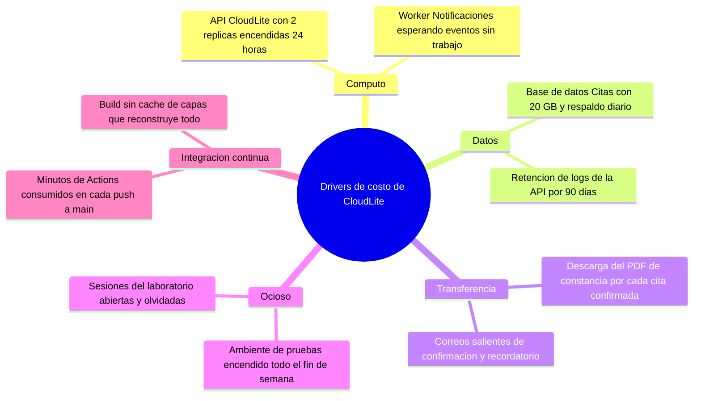

# Taller de la Clase 10 en ExamLab - configuracion

- **Curso:** Arquitectura de Sistemas Computacionales (FI303380)
- **Taller:** Taller Clase 10 en ExamLab - Costos y sostenibilidad de CloudLite
- **Preguntas:** 5 · **Total:** 100 puntos
- **Plataforma:** ExamLab (https://uniaj.examlab.workers.dev/) · modulo Talleres
- **Hito del PI:** Estimación cualitativa de costos + notas de sostenibilidad
- **Entregable de la clase:** Sección Costos/Sostenibilidad del informe (bajo/medio + drivers)

> ExamLab no importa preguntas desde archivo: el alta se hace en la UI del
> docente (o con la pestana de IA). Este documento trae el texto exacto de cada
> campo para copiar y pegar, incluidos el SQL de partida y el codigo base.

**Que produce el estudiante:** El estudiante entrega la seccion de costos de CloudLite con 6 elementos del despliegue mapeados a drivers y niveles cualitativos, tres apalancamientos de ahorro con antes y despues, y tres acciones de sostenibilidad verificables.

---

## Pregunta 1 - Respuesta escrita · 30 pts

**Tipo en la plataforma:** `abierta`

**Enunciado (campo Contenido):**

## Tabla de costos de CloudLite

En este curso **no se inventan facturas en dolares**: el costo se expresa como `bajo` / `medio` / `alto` mas el driver que lo causa.

Construya una tabla de **5 columnas** con encabezados exactos:

`Elemento del despliegue | Driver de costo | Nivel B/M/A | Apalancamiento | Riesgo del apalancamiento`

con **exactamente 6 filas**, una por elemento, tomadas de su C4Deployment de la Clase 7:

1. Edge TLS y proxy reverso.
2. API CloudLite.
3. Worker Notificaciones.
4. Base de datos Citas.
5. Almacen Adjuntos (objetos).
6. Minutos de GitHub Actions.

Reglas:
- `Driver de costo` debe ser un mecanismo (`horas encendido sin trafico`, `gigabytes de salida hacia el navegador`, `gigabytes almacenados con respaldo diario`, `minutos de ejecucion por push`). **Ningun driver se repite** entre filas.
- `Nivel B/M/A` va acompanado de media linea que diga **por que ese nivel en su dominio**.
- `Riesgo del apalancamiento` dice que se degrada al aplicarlo (`menos replicas implica peor p95 en el pico`).

La palabra `caro` por si sola no es una explicacion valida.

**Rubrica esperada (campo Rubrica):**

10 pts las 6 filas con los 6 elementos del despliegue propio. 8 pts los 6 drivers expresados como mecanismo y sin repetirse. 6 pts el nivel B/M/A justificado en el dominio. 6 pts el apalancamiento con su riesgo de degradacion en las 6 filas. Cero en la fila que use caro o costoso como unica explicacion.

---

## Pregunta 2 - Diagrama (Mermaid) · 20 pts

**Tipo en la plataforma:** `diagrama`

**Enunciado (campo Contenido):**

## Mapa de drivers de costo

Escriba un `mindmap` de Mermaid con la raiz `Drivers de costo de CloudLite` y **exactamente 5 ramas**: `Computo`, `Datos`, `Transferencia`, `Ocioso`, `Integracion continua`.

Cada rama lleva **exactamente 2 hojas**, y cada hoja debe nombrar **un elemento real de su despliegue** con una cifra o cantidad aproximada (`API con 2 replicas encendidas 24 horas`, `Base de datos Citas con 20 GB y respaldo diario`, `descarga de PDF de constancia por cada cita`).

**Verificacion:** al renderizar debe contar 1 raiz, 5 ramas y 10 hojas; si una hoja no se puede senalar en su C4Deployment, reemplacela.

**Pegar al final del enunciado — flujo de entrega del diagrama:**

**Del boceto al codigo Mermaid.** No subas una imagen: la respuesta de esta pregunta es texto Mermaid.

- **1. Disena visual** Dibuja el diagrama como quieras en Excalidraw o draw.io: es mas rapido arrastrar cajas que escribir codigo, y ahi es donde piensas el modelo.
- **2. Traduce con IA** Copia o describe tu boceto a una IA y pidele el codigo Mermaid: «convierte este diagrama a Mermaid usando `mindmap`». Revisa el resultado: la IA acierta la sintaxis, no tu modelo.
- **3. Pega y renderiza en ExamLab** Pega ese codigo en la caja de texto de la pregunta y mira como lo dibuja la plataforma. Si no renderiza, corrige ahi mismo: lo que se califica es el diagrama renderizado dentro de ExamLab.
- **4. Guarda el PNG para tu PI** Exporta tambien la imagen a la carpeta de tu Proyecto Integrador. Esa copia es para tu informe; no reemplaza la respuesta en la plataforma.

**Diagrama de referencia (Mermaid):**

**Rubrica esperada (campo Rubrica):**

8 pts la estructura exacta de 1 raiz, 5 ramas y 10 hojas. 8 pts que las 10 hojas nombren elementos reales del despliegue con cantidad o cifra. 4 pts que renderice sin error y que las ramas tengan los 5 nombres pedidos.

---

## Pregunta 3 - Respuesta escrita · 20 pts

**Tipo en la plataforma:** `abierta`

**Enunciado (campo Contenido):**

## Tres apalancamientos de ahorro

Desarrolle **exactamente 3 apalancamientos** de la tabla anterior, cada uno con **estas 5 lineas rotuladas**:

1. **Apalancamiento**: que va a cambiar, en una frase.
2. **Antes**: el estado actual con una cifra (`imagen de 940 MB`, `2 replicas encendidas 24 horas`, `build de 6 minutos sin cache`).
3. **Despues**: el estado esperado con la cifra objetivo (`imagen por debajo de 200 MB`, `1 replica en horario nocturno`).
4. **Como se verifica**: el comando, la pantalla o el archivo donde un tercero comprueba el cambio.
5. **Que se degrada**: el precio que se paga (mayor latencia en el primer acceso, menos margen en el pico, mas trabajo manual).

Los 3 apalancamientos deben atacar **drivers distintos**. Al menos uno debe afectar el **computo ocioso** y al menos uno la **imagen o el pipeline**.

Ninguno puede romper un requisito del PI: si el ahorro implica quitar la ruta de salud, el pipeline o la seguridad, no se acepta.

**Rubrica esperada (campo Rubrica):**

9 pts los 3 apalancamientos con las 5 lineas rotuladas. 5 pts que el antes y el despues tengan cifras comparables. 4 pts que atiendan drivers distintos incluido el computo ocioso y la imagen o el pipeline. 2 pts la degradacion declarada en los tres.

---

## Pregunta 4 - Respuesta escrita · 20 pts

**Tipo en la plataforma:** `abierta`

**Enunciado (campo Contenido):**

## Tres acciones de sostenibilidad

Escriba **exactamente 3 acciones** de sostenibilidad aplicables a *su* diseno, cada una con **3 lineas rotuladas**:

1. **Accion**: que se hace, en imperativo (`apagar el ambiente de pruebas los viernes a las 18:00`).
2. **Efecto ambiental o de recursos**: que se deja de consumir (energia por horas encendido, almacenamiento del registro de imagenes, minutos de runner).
3. **Evidencia verificable**: donde queda la prueba de que se hizo (`captura del historial del lab con la hora`, `salida de docker images con el tamano`, `bitacora del repositorio`).

Al menos una accion debe referirse a **imagenes ligeras**, una a **apagado de laboratorios o ambientes** y una a **evitar sobredimensionar** (right sizing).

Cierre con **una frase** que responda: cual de las 3 acciones haria de todas formas aunque no la calificaran, y por que.

**Rubrica esperada (campo Rubrica):**

9 pts las 3 acciones con las 3 lineas rotuladas. 6 pts que cubran imagenes ligeras, apagado de ambientes y right sizing. 4 pts que las 3 evidencias sean verificables por un tercero. 1 pt la frase de cierre. Cero en la accion cuya evidencia sea prometemos hacerlo.

---

## Pregunta 5 - Seleccion multiple · 10 pts

**Tipo en la plataforma:** `cerrada_multi`

**Enunciado (campo Contenido):**

## Costos en la nube: que es cierto

Seleccione las **3 afirmaciones correctas**.

**Opciones:**

- [x] Dejar el ambiente de pruebas encendido el fin de semana sin trafico genera costo ocioso.
- [x] Servir miles de descargas de PDF directamente desde la API aumenta el costo de transferencia de salida.
- [x] Una imagen base slim reduce el tiempo de construccion y el almacenamiento del registro de imagenes.
- [ ] El almacenamiento de objetos es siempre mas caro que el de bloque para archivos grandes poco consultados.
- [ ] Los respaldos no generan costo porque no reciben trafico.
- [ ] Aumentar el numero de replicas no afecta el costo mientras el trafico no suba.

**Rubrica esperada (campo Rubrica):**

4 pts por cada correcta marcada hasta un maximo de 10; se descuentan 4 pts por cada incorrecta marcada, sin bajar de cero.

---

## Al terminar de crearlo

- Verifique que la suma de puntos sea la esperada: **100**.
- Publique el taller y confirme la fecha limite (domingo 23:59 segun el Acuerdo).
- Las preguntas con SQL o codigo: ejecutelas una vez usted mismo antes de publicar,
  para confirmar que el SQL de partida corre y que el starter compila.
