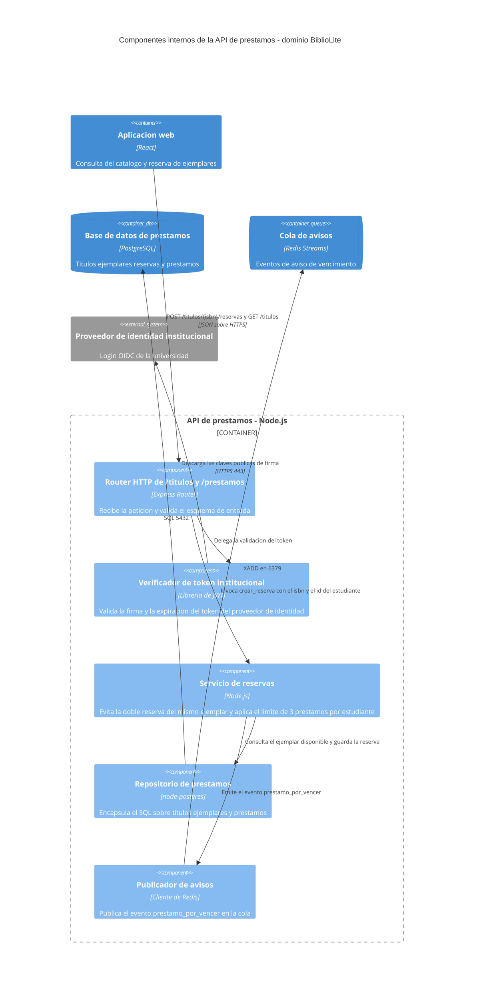
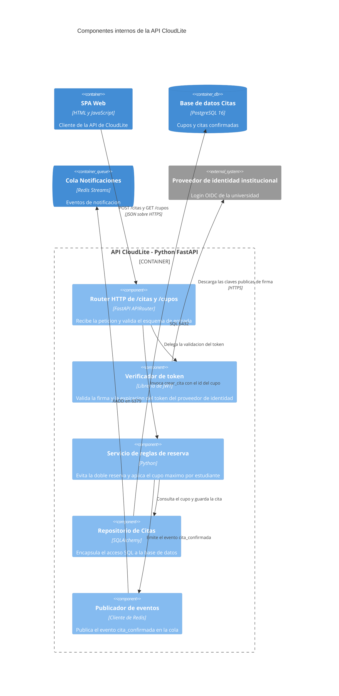

# Solucion del Taller Clase 11 - Checkpoint del paquete v1 (BiblioLite)

> **DOCUMENTO DOCENTE — PRIVADO.** No publicar en `Clases/` ni en ExamLab antes del cierre de la entrega.

**Resumen:** Taller propio de 100 puntos en cinco preguntas. Es el checkpoint: no se produce arquitectura nueva, se audita la que ya existe. La solucion resuelve el checklist de las diez evidencias con ruta real, reconcilia los cinco nombres canonicos entre diagramas y codigo, abre la API en un C4Component de cinco componentes y deja un backlog fechado de cinco items hacia la sustentacion. Aqui se documenta tambien la unica evolucion de arquitectura del semestre: BiblioLite suma la cola de avisos y el procesador de avisos, que la lista canonica exige desde esta clase.

> **Nota de calendario 2026-2.** Las Clases 11 y 12 caen en la **misma sesion doble del lunes 26/10/2026**, asi que el criterio de la pregunta 4 —«las 5 fechas deben ser anteriores a la Clase 12»— no se puede cumplir literalmente: la Clase 12 es hoy. Se califica leyendolo como **anteriores a la sesion autonoma de la Clase 13 (02/11/2026)** para los items que bloquean a otros, y en todo caso **anteriores a la sustentacion de la Clase 15 (16/11/2026)**. Cualquier fecha real entre el 27/10/2026 y el 13/11/2026 se acepta sin descuento. Anunciarlo en voz alta al abrir el taller evita quince preguntas identicas.

## Alineacion con el taller

- Taller del estudiante: `Clases/Clase 11 - Avance del proyecto final/`
- Configuracion en la plataforma: `Kit docente/Clase 11/Taller en ExamLab - Clase 11 (configuracion).md`
- Hito del PI: Integrar diagramas v1 + checklist de avance PI
- Entregable: Paquete v1: Context + Containers + Deployment + Dockerfile + Actions + informe 60%+
- **Estas preguntas: 100 puntos** en 5 preguntas.

| # | Pregunta | Tipo | Puntos |
|---|---|---|---|
| 1 | Checklist del paquete v1 | `abierta` | 25 |
| 2 | Reconciliacion de nombres entre artefactos | `abierta` | 20 |
| 3 | C4 Component: por dentro de la API de prestamos | `diagrama` | 25 |
| 4 | Backlog de 5 items hacia la Clase 12 | `abierta` | 20 |
| 5 | Huecos tipicos del paquete v1 | `cerrada_multi` | 10 |

---

## Pregunta 1 · Checklist del paquete v1 · 25 pts

### Respuesta esperada

| Evidencia | Estado | Ruta o enlace exacto | Responsable |
|---|---|---|---|
| 1. Ficha de dominio con 4 capacidades (Clase 1) | si | `/informe/01-ficha-dominio.md`, seccion 1 | Autor del paquete |
| 2. Diagrama C4 Context (Clase 1) | si | `/diagramas/c4-context.png` con fuente `/diagramas/c4-context.mmd` | Autor del paquete |
| 3. ADR-001 del modelo de servicio (Clase 2) | si | `/adr/ADR-001-modelo-de-servicio.md` | Autor del paquete |
| 4. Dockerfile del stub y evidencia del lab (Clase 3) | si | `/docker/Dockerfile` y `/capturas/clase03-docker-ps.png` | Autor del paquete |
| 5. Diagrama C4 Container y tabla de 3 contratos (Clase 4) | parcial | `/diagramas/c4-container.png` y `/informe/04-contratos.md` | Autor del paquete - cierra B-02 el 30/10/2026 |
| 6. Modelo de amenazas y politica de secretos (Clase 6) | si | `/informe/06-amenazas.md` y `/informe/06-politica-secretos.md` | Autor del paquete |
| 7. Diagrama C4 Deployment con zonas y almacenamiento (Clase 7) | parcial | `/diagramas/c4-deployment.png` | Autor del paquete - cierra B-01 el 28/10/2026 |
| 8. Workflow ci.yml con enlace al run verde (Clase 8) | si | `/.github/workflows/ci.yml` y el run `https://github.com/USUARIO/bibliolite/actions/runs/ID` | Autor del paquete |
| 9. Seccion de costos y sostenibilidad (Clase 10) | si | `/informe/10-costos-sostenibilidad.md` | Autor del paquete |
| 10. Informe del PI al 60 por ciento o mas | si | `/informe/informe-pi.md` (68 por ciento; el indice de la primera pagina enlaza cada evidencia por su ruta) | Autor del paquete |

**Linea de cierre:** 8 filas en `si` sobre 10. Las dos en `parcial` son las filas 5 y 7, ambas con item de backlog y fecha.

Tres cosas que sostienen esta tabla y que conviene decir en voz alta al revisar:

1. **Las rutas son rutas dentro del paquete, no descripciones.** `/diagramas/c4-container.png` se abre; «el diagrama del container» no se abre. La regla del enunciado es dura a proposito: una fila en `si` sin ruta se califica como `no` y ademas descuenta 2 pts. Es la unica forma de que el checklist no se convierta en una declaracion de buenas intenciones.
2. **Los dos `parcial` no son un fracaso, son el resultado del trabajo de hoy.** La pregunta 3 abre la API y, al hacerlo, BiblioLite pasa a tener cinco contenedores canonicos en lugar de tres (ver la pregunta 2). Eso deja desactualizados exactamente dos artefactos: el C4 Container de la Clase 4 —que sigue con tres cajas y una tabla de tres contratos— y el C4 Deployment de la Clase 7 —que no tiene la cola en la zona privada—. Un checkpoint que descubre incoherencias esta funcionando; uno que sale con diez `si` normalmente es uno que no se leyo.
3. **El enlace del run verde debe ser el del estudiante.** Aqui aparece con `USUARIO` y `ID` en mayusculas porque este documento es del docente. En el paquete real va la URL completa del run de GitHub Actions, y el docente la abre: si el run esta rojo o no existe, la fila 8 es `no`, no `parcial`.

### Como calificar

- **10 pts** las 10 filas presentes y en el orden pedido por el enunciado (Clase 1, 1, 2, 3, 4, 6, 7, 8, 10, informe). Se descuenta 1 pt por fila ausente o desordenada; no se penaliza dos veces la misma fila.
- **8 pts** que cada `si` tenga ruta o enlace verificable. Se reparte proporcionalmente entre las filas marcadas `si`: con 8 filas en `si`, cada una vale 1 pt.
- **5 pts** que cada `parcial` o `no` traiga responsable **y** fecha de cierre. Falta cualquiera de los dos y esa fila no suma.
- **2 pts** la linea de conteo final (cuantas filas en `si` sobre 10).
- **Descuento de 2 pts por cada `si` sin ruta**, aplicado despues de sumar. Es el unico descuento de la pregunta y se aplica sin excepcion: es la regla que le da valor a las otras nueve filas.
- Se acepta cualquier estructura de carpetas del paquete, siempre que las rutas de la tabla coincidan con la del ZIP o el repositorio entregado. Abrir dos rutas al azar del paquete es la verificacion mas rentable.

### Errores frecuentes y que hacer

- **Diez `si` sin una sola ruta.** Es el error mas comun y el mas caro: la tabla queda en 10 pts de estructura y pierde los 8 de rutas mas 20 de descuento, con piso en cero. Antes de calificar, avisar en voz alta que las rutas se abren.
- **Ruta que apunta a Google Drive o a WhatsApp.** No es ruta dentro del paquete ni enlace publico verificable: si el docente no puede abrirlo sin pedir permiso, cuenta como `no`. Se acepta un enlace publico de GitHub.
- **`parcial` sin fecha, o con «pronto» y «esta semana».** El enunciado pide fecha, y la nota de calendario de arriba fija la ventana valida. Devolver para que escriba una fecha real de octubre o noviembre de 2026.
- **Marcar `si` la fila 8 con el enlace al repositorio en vez del run.** El repositorio no prueba que el pipeline paso; el run verde si. Es `parcial`, con la accion «capturar el enlace del run» en el backlog.
- **Inflar el informe al 60 por ciento contando la portada y la bibliografia.** El porcentaje se estima sobre secciones con contenido propio. Si el informe tiene los titulos pero no el texto, es `parcial`, no `si`.

---

## Pregunta 2 · Reconciliacion de nombres entre artefactos · 20 pts

### Respuesta esperada

| Nombre canonico | En el C4 Container | En el C4 Deployment | En el Dockerfile o ci.yml | Correccion aplicada |
|---|---|---|---|---|
| Aplicacion web | Aplicacion web | Aplicacion web | no aplica | sin cambios - el bundle de React se publica como estatico y el pipeline de la Clase 8 solo construye la imagen de la API |
| API de prestamos | API de prestamos | API de prestamos | `bibliolite-api:0.1.0` y `--name api` | renombre `--name api` a `--name api-prestamos` en `.github/workflows/ci.yml`, paso «Arranque y health»; la imagen sigue siendo `bibliolite-api` y el informe trae el mapeo nombre-slug |
| Procesador de avisos | Procesador de avisos (agregado hoy) | no aplica todavia | no aplica todavia | agregue el contenedor a `/diagramas/c4-container.mmd` y regenere el PNG; el despliegue queda en B-01 y el pipeline en B-03 |
| Base de datos de prestamos | Base de datos de prestamos | Base de datos de prestamos | no aplica (entra como el secreto `DATABASE_URL`) | sin cambios - en el pipeline la base no es un servicio con nombre sino una cadena de conexion inyectada como secreto |
| Cola de avisos | Cola de avisos (agregada hoy) | no aplica todavia | no aplica todavia | agregue el contenedor a `/diagramas/c4-container.mmd` y regenere el PNG; el despliegue queda en B-01 |

**Linea de cierre:** 3 correcciones aplicadas hoy (una en el `ci.yml` y dos en `c4-container.mmd`); 2 elementos quedan en `no aplica todavia` en dos columnas, con B-01 y B-03 abiertos y fechados.

**Por que BiblioLite tiene ahora cinco contenedores y no tres.** La lista canonica que esta clase exige es interfaz web, API, procesador asincrono, base de datos y cola. La Clase 4 dibujo tres cajas, y eso no fue un descuido: fue la decision de monolito modular para un equipo de una persona en doce semanas. Lo que aparecio despues fue la evidencia de que el modulo de notificaciones no puede vivir en la peticion HTTP. Esta escrito en dos artefactos propios: la tabla de riesgos de la Clase 4 dice «si el correo esta caido el aviso muere y nadie se entera», y la tabla de senales de la Clase 8 tiene una fila entera para «fallos de envio de correo». Un aviso que debe reintentarse necesita alguien que lo reintente cuando la peticion ya termino. Eso es un procesador asincrono, y para hablarle hace falta una cola.

**Y por que esto no rompe el ADR-001 ni la decision de la Clase 4.** El procesador de avisos **no es un microservicio nuevo**: es la **misma imagen** `bibliolite-api:0.1.0` arrancada con otro comando (`CMD ["node", "src/worker.js"]` en lugar de `src/server.js`). Un repositorio, un build, un pipeline, dos procesos. El monolito modular sigue en pie: lo que cambio es que uno de sus modulos corre fuera del ciclo de peticion. Decirlo asi, con el nombre del archivo, es lo que distingue una evolucion justificada de un cambio de opinion.

**El caso incomodo de la fila 2, que hay que saber responder.** El enunciado pide que el nombre canonico quede identico en las tres columnas del medio. En un artefacto de codigo eso es literalmente imposible: un nombre de imagen de Docker no admite espacios ni mayusculas, asi que `API de prestamos` no puede aparecer tal cual en un tag. La regla operativa que se califica es esta: **el nombre canonico manda en la prosa y en los diagramas, y en el codigo aparece como su slug** (`API de prestamos` -> `api-prestamos`), con un mapeo de dos lineas en el informe. Lo que si es un hallazgo real es que el contenedor del run se llamaba `api`, un nombre que no se parece a nada: ese es el que se renombro.

### Como calificar

- **8 pts** las 5 filas con las 5 columnas, una por elemento de la lista canonica. Si el estudiante tiene un sexto elemento real (un edge, un almacen de objetos) puede agregar la fila: no resta.
- **6 pts** que el nombre canonico quede identico en las tres columnas del medio **al terminar el ejercicio**, o que la diferencia quede explicada. Se acepta el slug en la columna de codigo (`api-prestamos` para `API de prestamos`) siempre que el informe traiga el mapeo; no se acepta un nombre sin relacion (`app`, `servicio1`, `test`).
- **4 pts** la columna de correccion citando **el archivo editado** con su nombre, no la accion en abstracto. «Renombre en el diagrama» no suma; «renombre en `c4-deployment.mmd`» si.
- **2 pts** las justificaciones de media linea de cada `no aplica` y la linea de conteo final.
- Se acepta `no aplica todavia` con un item de backlog fechado para un elemento que el estudiante agrego hoy: es el caso de las filas 3 y 5 de esta solucion y es la respuesta correcta, no una excusa. Lo que no se acepta es la celda vacia.

### Errores frecuentes y que hacer

- **Rellenar las tres columnas del medio con el nombre canonico sin haber abierto los archivos.** Se detecta en diez segundos: se abre el `.mmd` o el `ci.yml` y se busca el nombre. Si no esta, la fila pierde los pts de coherencia y la de correccion.
- **Cambiar el nombre canonico para que coincida con el codigo.** Es al reves: manda el nombre del dominio, no el identificador que quedo de un tutorial. Un canonico que se llama `app` es una senal de que no hubo reconciliacion.
- **Poner `no aplica` sin justificar.** Vale 0 en los 2 pts de justificaciones, y suele esconder un elemento que si existe pero que el estudiante no encontro.
- **Agregar la cola y el procesador sin justificar de donde salen.** Si aparecen porque el enunciado los nombra, el diagrama de la pregunta 3 no se sostiene en el Q&A de la Clase 15. Pedir la frase: que evidencia propia los hizo necesarios.
- **Declarar microservicios porque ahora hay cinco cajas.** Cinco contenedores no son cinco servicios: aqui son dos procesos de la misma imagen, un estatico, una base y una cola. Si el estudiante cambio el ADR-001 sin nueva evidencia, devolver.

---

## Pregunta 3 · C4 Component: por dentro de la API de prestamos · 25 pts

### Respuesta esperada

Conteos que se verifican de un golpe: **5 `Component`** dentro de la frontera, **4 elementos externos** (`Container`, `ContainerDb`, `ContainerQueue`, `System_Ext`), **8 `Rel`** y la primera linea exactamente `C4Component`.

**La frontera es la caja de la Clase 4, con su tecnologia.** `Container_Boundary(api, "API de prestamos - Node.js")` repite el nombre y la tecnologia del C4 Container. Ese es el enlace entre los dos niveles: si la frontera se llamara `Backend` o `Servidor`, el diagrama seria de otro sistema.

**Ninguno de los cinco componentes es un contenedor disfrazado.** La prueba es de una linea: un componente es codigo que se despliega **dentro** del mismo proceso; un contenedor es algo que se despliega **aparte** y se alcanza por red. El `Repositorio de prestamos` es codigo que habla SQL: componente. La `Base de datos de prestamos` escucha en 5432: contenedor, y por eso esta fuera de la frontera. El error que cuesta 10 pts es exactamente ese: meter `ContainerDb` o la cola adentro.

**El flujo se lee de punta a punta y pasa por los cinco.** Aplicacion web -> router (valida el esquema) -> verificador de token (y este consulta las claves del IdP) -> servicio de reservas (la regla de negocio: no hay doble reserva del mismo ejemplar) -> repositorio (el unico que sabe SQL) -> base de datos. Y en paralelo, el servicio de reservas emite el evento al publicador, que hace `XADD` en la cola. La regla de negocio no le habla ni a la base ni a la cola directamente: siempre a traves de la pieza que encapsula ese detalle. Eso es lo que hace que el diagrama sirva para algo, y es la respuesta al «por que» de la Clase 15.

**Continuidad con lo ya entregado.** El `409` del contrato `POST /titulos/{isbn}/reservas` de la Clase 4 se decide en el `Servicio de reservas`; la validacion de token de la Clase 6 es el `Verificador de token institucional`; el puerto 5432 de la zona de datos de la Clase 7 es la unica flecha que sale del repositorio. Nada nuevo: se abrio la caja y adentro estaba lo que se venia diciendo.

### Respuesta esperada (dominio de la solucion)

### Modelo de referencia del kit docente (el estudiante NO lo ve)

Vive en `Taller en ExamLab - Clase 11 (configuracion).md` y no se pega en el enunciado; esta resuelto sobre el dominio **AgendaU**. Sirve para comparar estructura y conteos —cuantas cajas, cuales son almacenes, si toda flecha lleva protocolo y formato—, **nunca** para calificar contenido ni nombres:

### Como calificar

- **10 pts** los 5 componentes dentro de la frontera, cada uno con nombre, tecnologia y responsabilidad en una frase, cubriendo las 5 responsabilidades del enunciado: recibir y validar HTTP, verificar el token, regla de negocio, acceso a datos, publicar el evento. Son 2 pts cada una; una responsabilidad ausente no se compensa con dos componentes de otra.
- **6 pts** los 4 elementos externos con los nombres canonicos de la pregunta 2 **y el tipo correcto**: `Container` la web, `ContainerDb` la base, `ContainerQueue` la cola, `System_Ext` el proveedor de identidad. 1.5 pts cada uno; un tipo equivocado (la cola como `Container`) pierde la mitad de su parte.
- **6 pts** las 8 relaciones formando un flujo legible de la web a la base pasando por los cinco componentes. Se acepta que dos relaciones no lleven protocolo si son internas al proceso; las que cruzan a la base, la cola o el IdP si deben llevarlo.
- **3 pts** que renderice sin error en la plataforma. Se verifica abriendo la respuesta, no leyendo el codigo.
- **Descuento de 10 pts si un componente es en realidad un contenedor de la Clase 4** (la base, la cola o la interfaz web dentro del `Container_Boundary`). Es el error conceptual que la pregunta persigue y el descuento se aplica completo, una sola vez.
- Se acepta otro reparto de las 5 responsabilidades entre nombres distintos (`Controlador` en vez de `Router`, `DAO` en vez de `Repositorio`) siempre que la responsabilidad escrita sea la pedida.

### Errores frecuentes y que hacer

- **La base de datos como sexto componente adentro.** Es el descuento de 10 pts. Devolver con la prueba de una linea: ¿se alcanza por red o corre en el mismo proceso?
- **Cinco componentes que son cinco endpoints** (`GET /titulos`, `POST /prestamos`...). Un componente es una responsabilidad tecnica, no una ruta. Se detecta porque las responsabilidades escritas se repiten.
- **`Component` en lugar de `Container_Boundary`, o `System_Boundary`.** El diagrama renderiza pero el nivel queda mal: en C4 Component la frontera es el contenedor. Cuesta los 3 pts de render solo si falla; si renderiza, cuesta parte de los 6 de externos.
- **Renombrar el contenedor de la frontera.** Si la API se llama `Backend` aqui y `API de prestamos` en la Clase 4, el trabajo de la pregunta 2 se deshizo en la pregunta 3. Es el chequeo cruzado mas rapido del taller.
- **Publicar el evento desde el router.** Renderiza igual, pero significa que el aviso se emite antes de saber si la reserva se guardo. Vale la pena senalarlo aunque no descuente: es material del Q&A de la Clase 15.
- **Nueve o siete relaciones.** El enunciado pide exactamente 8. Contar es parte de la tarea; se descuenta dentro de los 6 pts de relaciones, no en toda la pregunta.

---

## Pregunta 4 · Backlog de 5 items hacia la Clase 12 · 20 pts

### Respuesta esperada

| ID | Hueco detectado | Accion concreta | Responsable | Fecha de cierre |
|---|---|---|---|---|
| B-01 | **[docente]** El C4 Deployment no tiene la cola de avisos ni el procesador de avisos, que hoy quedaron en el C4 Container y en el C4 Component - Clase 7, fila 7 del checklist | Agregar los dos nodos a la zona privada de `/diagramas/c4-deployment.mmd` con puerto y protocolo (6379 TCP para la cola) y regenerar el PNG | Autor del paquete | 28/10/2026 |
| B-02 | La tabla de contratos tiene 3 filas y ninguna describe la publicacion en la cola - Clase 4, fila 5 del checklist | Agregar la cuarta fila a `/informe/04-contratos.md`: evento `prestamo_por_vencer`, productor la API, consumidor el procesador, error de negocio «mensaje duplicado» resuelto por idempotencia con `id_prestamo` | Autor del paquete | 30/10/2026 |
| B-03 | El `ci.yml` construye y arranca solo la API; el procesador de avisos no se arranca ni se prueba - Clase 8, fila 8 del checklist | Agregar al workflow un paso que arranque la misma imagen con `node src/worker.js`, publique un mensaje de prueba en la cola y verifique que el worker lo consume | Autor del paquete | 02/11/2026 |
| B-04 | La tabla de senales no vigila la profundidad de la cola, que ahora es una pieza real del sistema - Clase 8, fila 8 del checklist | Agregar la fila «profundidad de la cola de avisos» con umbral de revision en 500 mensajes, alerta en 1000 y accion «revisar si el procesador esta caido» | Autor del paquete | 05/11/2026 |
| B-05 | La seccion de costos no tiene fila para la cola ni para el procesador de avisos - Clase 10, fila 9 del checklist | Agregar dos filas con driver de costo y nivel B/M/A, y reescribir el apalancamiento del procesador: escala a cero fuera de la ventana de avisos de las 06:00 | Autor del paquete | 09/11/2026 |

**Las 2 lineas de cierre:**

> **Bloqueante:** B-01. Mientras el C4 Deployment no tenga los dos nodos, B-03 no sabe en que zona corre el procesador ni contra que host de cola apunta, y B-05 no tiene una caja a la cual asignarle un driver de costo. Los tres items se ordenan detras de el.
> **Deuda tecnica aceptada:** no se va a separar el modulo de notificaciones en su propio repositorio con su propio pipeline. Razon: el ADR-001 y la decision de la Clase 4 fijaron monolito modular para un equipo de una persona, y el procesador de avisos es el mismo artefacto (misma imagen, otro comando), asi que separarlo duplicaria el pipeline sin cambiar el riesgo. Se revisa si la cola pasa de 1000 mensajes sostenidos, que es justo el umbral de alerta que B-04 va a escribir.

Los cinco items comparten una forma que conviene exigir: **el hueco cita la evidencia y la clase de origen**, la accion **empieza por un verbo** (agregar, agregar, agregar, agregar, agregar —aqui todos son de completar, que es lo normal en un checkpoint— y no «mejorar» ni «revisar»), y la fecha es una fecha. El item marcado `[docente]` es B-01: salio de la cola de revision de hoy, no de la autoevaluacion, y por eso es el que encabeza.

Sobre el orden: no esta ordenado por esfuerzo sino por **cuantos otros items desbloquea**. B-01 desbloquea tres; B-02 cierra la fila 5 del checklist, que es la otra `parcial`; B-03, B-04 y B-05 son independientes entre si y podrian hacerse en cualquier orden. Decir esto en voz alta cuesta treinta segundos y es la mitad de la nota de la pregunta.

### Como calificar

- **8 pts** las 5 filas con IDs `B-01` a `B-05` y las 5 columnas completas. Sin IDs no hay como referenciar los items en la Clase 15: se descuenta.
- **5 pts** que cada hueco cite **evidencia y clase de origen**. «Falta documentacion» no cita nada; «el `ci.yml` no arranca el worker - Clase 8» si. 1 pt por fila.
- **4 pts** que al menos un item venga del feedback del docente, marcado `[docente]`, **y** que las 5 fechas sean previas al plazo del calendario. Ver la nota de arriba: por la sesion doble del 26/10/2026 se lee como «antes del 13/11/2026», y ninguna fecha se penaliza por caer despues del 26/10.
- **3 pts** las 2 lineas de cierre: el item bloqueante **con la razon del bloqueo** y la deuda aceptada **con su justificacion**. Nombrar el item sin decir por que bloquea vale la mitad.
- Se acepta que los cinco items sean de completar artefactos existentes: en un checkpoint eso es lo esperable. Lo que no se acepta es un item que no se pueda cerrar en una semana (reescribir la API, migrar a microservicios).

### Errores frecuentes y que hacer

- **Cinco items que son cinco tareas del proyecto** («terminar el informe», «hacer el pitch»). El backlog es de **huecos de coherencia** detectados hoy, no el cronograma del PI. Devolver pidiendo que cada fila apunte a una fila del checklist de la pregunta 1.
- **Ningun item marcado `[docente]`.** Cuesta parte de los 4 pts y suele significar que el estudiante no paso por la cola de revision. Si paso y no lo marco, se acepta con la marca agregada en el momento.
- **Fechas como «semana 12» o «antes de la entrega».** Se pide fecha real. Conviene tener el calendario a la vista al calificar: 02/11 y 16/11 son las dos referencias que importan.
- **Deuda aceptada que en realidad es un hueco grave** («aceptamos no tener manejo de secretos»). La deuda se acepta cuando el riesgo esta acotado y argumentado; si lo aceptado es un requisito del curso, no cuenta y ademas abre un item nuevo.
- **Item bloqueante elegido por ser el mas grande.** Bloquea el que otros necesitan, no el que mas cuesta. Preguntar «¿que item no puedes empezar si este no esta?» resuelve la duda en el momento.

---

## Pregunta 5 · Huecos tipicos del paquete v1 · 10 pts

### Clave y por que

La clave se lee del banco de la plataforma, asi que esta es la que se califica. La columna de la derecha es lo que hay que poder responderle al estudiante cuando pregunte.

|  | Opcion | Por que |
|---|---|---|
| **SI** | El C4 llama Servicio de reservas a la caja que en el despliegue aparece como api-citas. | **Hueco.** Es exactamente el ejercicio de la pregunta 2: el mismo elemento con tres nombres. Rompe la trazabilidad entre niveles y en la sustentacion obliga a traducir en voz alta, que es donde se cae el «por que». |
| **SI** | El ci.yml tiene un unico paso que imprime build ok y ninguna prueba. | **Hueco.** Es el «CI que no es CI» de la Clase 8: un paso que imprime `build ok` no verifica nada. Sin al menos un build real y una prueba, el run verde no es evidencia de nada. |
| no | El Dockerfile fija la imagen base con un tag de version en lugar de usar latest. | **No es hueco: es la practica correcta, invertida a proposito.** Fijar la imagen base con un tag de version (`node:20-alpine`) es lo que hace el build reproducible; `latest` es el antipatron, porque la misma linea construye una imagen distinta cada semana. Quien marca esta opcion tiene el concepto al reves y perdio 4 pts. |
| **SI** | La seccion de seguridad tiene 5 amenazas pero ninguna se puede senalar en un diagrama. | **Hueco.** Es la arquitectura de papel de la Clase 6: la columna «donde se ve (caja o flecha)» existe justamente para que ninguna amenaza quede sin un punto del diagrama al cual senalar. Cinco amenazas que no se pueden senalar son cinco parrafos, no un modelo. |
| no | El informe enlaza cada evidencia con su ruta dentro del paquete. | **No es hueco: es el criterio de aprobacion de la pregunta 1.** Que el informe enlace cada evidencia por su ruta dentro del paquete es precisamente lo que se pide; sin eso, una fila en `si` se califica como `no`. |
| no | El diagrama de despliegue ubica la base de datos en la zona de datos sin IP publica. | **No es hueco: es el acierto de la Clase 7.** La base en la zona de datos y sin IP publica es la regla dura del diagrama de despliegue, la que cuesta los 4 pts completos cuando se incumple. Marcarla como hueco senala que el estudiante no interiorizo las zonas. |

### Como calificar

- **4 pts por cada hueco correctamente identificado, con techo de 10.** Las tres correctas son las opciones 1, 2 y 4 tal como aparecen numeradas en la plataforma (nombres desalineados, `ci.yml` sin pruebas, amenazas que no se pueden senalar). La clave se lee del banco: no calificar de memoria.
- **Se descuentan 4 pts por cada practica correcta marcada como hueco**, sin bajar de cero. Marcar las seis da cero, no diez: es el diseno de la pregunta.
- Las tres distractoras no son ruido: cada una es un criterio que el curso ya califico (tag de version en la Clase 3, enlace por ruta en esta misma pregunta 1, zona de datos en la Clase 7). Si un estudiante marca alguna, conviene devolverle a que clase pertenece.
- Es la unica pregunta de la actividad que se autocalifica. Sirve como termometro: si mas de la mitad del grupo marca la opcion del tag de version, el repaso de la Clase 12 debe empezar por reproducibilidad de la imagen.

### Errores frecuentes y que hacer

- **Marcar las seis para asegurar las tres correctas.** El descuento lo deja en cero. Vale decirlo antes de abrir la actividad: aqui marcar de mas cuesta.
- **Confundir «tag de version» con «version vieja».** Fijar `node:20-alpine` no es quedarse atras: es decidir cuando se actualiza. Es la confusion mas frecuente en esta pregunta.
- **Leer la opcion del informe como una acusacion** («enlaza cada evidencia» leido como «solo enlaza»). Si varios caen ahi, el problema es de lectura y no de concepto; se aclara en voz alta y no se cambia la clave.
- **Marcar la opcion de la base de datos por asociar «zona de datos» con riesgo.** Es al contrario. Devolver al criterio de la Clase 7: sin IP publica es lo correcto.

---

## Lo que van a preguntar (respuestas listas)

Estas son las dudas que aparecen todos los semestres. Tenerlas resueltas por escrito es lo que evita responder la misma cosa quince veces durante el taller.

**¿Por que aparecen una cola y un procesador de avisos que en la Clase 4 no estaban?**

Porque la lista canonica de esta clase los exige y porque el propio paquete ya los pedia: la tabla de riesgos de la Clase 4 dice que si el correo esta caido el aviso muere, y la tabla de senales de la Clase 8 tiene una fila para fallos de envio. Un aviso que hay que reintentar necesita a alguien que lo reintente cuando la peticion HTTP ya termino. No es un cambio de rumbo: el procesador es la misma imagen arrancada con otro comando, asi que el monolito modular del ADR-001 sigue vigente.

**Mi nombre canonico tiene espacios y mayusculas. No cabe en un tag de Docker. ¿Como lo reconcilio?**

Con un slug. El nombre canonico manda en los diagramas y en el informe; en el codigo aparece como `api-prestamos` o `bibliolite-api`, y el informe trae dos lineas de mapeo. Se califica igual. Lo que no se acepta es un identificador que no se parezca a nada, tipo `app` o `test`.

**Si la Clase 12 es hoy mismo, ¿como pongo fechas anteriores a la Clase 12?**

No se puede, y no es su culpa: en 2026-2 las Clases 11 y 12 caen en la misma sesion doble del 26/10. Ponga fechas reales entre el 27/10 y el 13/11, con los items que bloquean antes del 02/11. Nadie pierde puntos por esto.

**¿El C4 Component reemplaza al C4 Container?**

No. Se suma. Son dos niveles de zoom del mismo sistema: el Container muestra las piezas que se despliegan aparte, el Component abre una de ellas. En el paquete van los dos, y la frontera del Component debe llamarse igual que la caja del Container.

**Mi API tiene ocho responsabilidades. ¿Puedo poner ocho componentes?**

El enunciado pide exactamente cinco, y estan elegidas para cubrir el camino completo de una peticion. Agrupe: lo que valida esquemas va con el router, lo que arma consultas va con el repositorio. Si de verdad sobra una responsabilidad que no encaja en ninguna de las cinco, es una senal interesante para el Q&A, pero el diagrama se entrega con cinco.

**¿La deuda tecnica aceptada me resta puntos?**

Al contrario: es parte de los 3 pts del cierre. Lo que resta es aceptar como deuda algo que el curso pide (secretos, base en zona privada, un run verde). Deuda legitima es la que tiene riesgo acotado y una condicion escrita para revisarla.

**Mi dominio no manda avisos. ¿Igual tengo que inventar una cola?**

No se inventa nada. Si su dominio no tiene ninguna tarea que sobreviva a la peticion, escriba `no aplica` en esa fila de la pregunta 2 y justifique en media linea; son 2 pts que se ganan explicando, no rellenando. En el C4 Component el quinto componente puede publicar a otro destino asincrono real de su sistema.

**¿Cuenta como evidencia un pantallazo pegado en el informe, sin el archivo?**

Como `parcial`. La captura prueba que algo paso; la ruta al artefacto prueba que existe y se puede volver a correr. Deje la captura y agregue el archivo: es el tipo de item que se cierra en diez minutos y libera una fila del checklist.

---

## Cierre de la clase

Lo que queda de hoy es un paquete que se puede abrir en otra maquina y una lista corta de lo que le falta, con fechas. Los dos hallazgos que importan quedaron escritos: los nombres estaban desalineados en el pipeline y el sistema ya necesitaba una cola y un procesador de avisos que ningun diagrama tenia. Ese segundo hallazgo es el que hay que llevar a la Clase 12, porque el escenario de carga y el presupuesto de latencia se calculan sobre las cajas que existen de verdad: la peticion de reserva ahora termina cuando la API publica en la cola, no cuando el correo sale. Y el backlog es la agenda: B-01 primero, porque sin el despliegue actualizado la Clase 13 no tiene sobre que escribir la politica de autoescalado.

---

## Politica de entrega

La entrega que se califica es la respuesta dentro de ExamLab (https://uniaj.examlab.workers.dev/). El documento en Word o Google Docs es opcional y solo sirve para que el estudiante conserve sus respuestas. Gratis + navegador; sin cuentas cloud de pago ni tarjeta.
