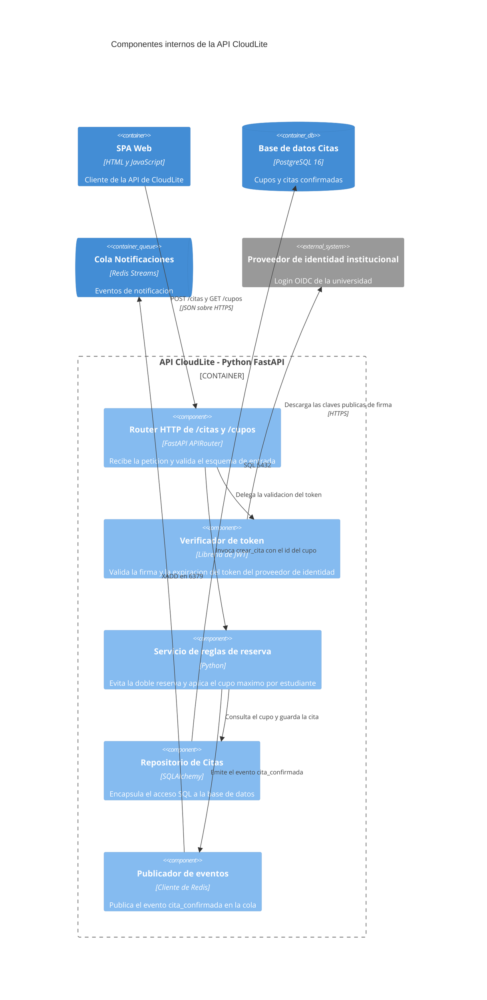

# Taller de la Clase 11 en ExamLab - configuracion

- **Curso:** Arquitectura de Sistemas Computacionales (FI303380)
- **Taller:** Taller Clase 11 en ExamLab - Checkpoint del paquete v1 de CloudLite
- **Preguntas:** 5 · **Total:** 100 puntos
- **Plataforma:** ExamLab (https://uniaj.examlab.workers.dev/) · modulo Talleres
- **Hito del PI:** Integrar diagramas v1 + checklist de avance PI
- **Entregable de la clase:** Paquete v1: Context + Containers + Deployment + Dockerfile + Actions + informe 60%+

> ExamLab no importa preguntas desde archivo: el alta se hace en la UI del
> docente (o con la pestana de IA). Este documento trae el texto exacto de cada
> campo para copiar y pegar, incluidos el SQL de partida y el codigo base.

**Que produce el estudiante:** El estudiante consolida el paquete v1 de CloudLite con checklist enlazado, nombres reconciliados entre todos los artefactos, el interior de la API en un C4Component y un backlog de 5 items hacia la Clase 12.

---

## Pregunta 1 - Respuesta escrita · 25 pts

**Tipo en la plataforma:** `abierta`

**Enunciado (campo Contenido):**

## Checklist del paquete v1

Construya una tabla de **4 columnas** con encabezados exactos:

`Evidencia | Estado si/no/parcial | Ruta o enlace exacto | Responsable`

con **exactamente 10 filas**, en este orden:

1. Ficha de dominio con 4 capacidades (Clase 1).
2. Diagrama C4 Context (Clase 1).
3. ADR-001 del modelo de servicio (Clase 2).
4. Dockerfile del stub y evidencia del lab (Clase 3).
5. Diagrama C4 Container y tabla de 3 contratos (Clase 4).
6. Modelo de amenazas y politica de secretos (Clase 6).
7. Diagrama C4 Deployment con zonas y almacenamiento (Clase 7).
8. Workflow ci.yml con enlace al run verde (Clase 8).
9. Seccion de costos y sostenibilidad (Clase 10).
10. Informe del PI al 60 por ciento o mas.

Reglas de verificacion:
- Toda fila marcada `si` **debe** llevar ruta dentro del paquete (`/diagramas/c4-container.png`) o enlace publico. **Una fila `si` sin ruta se califica como `no`.**
- Toda fila `parcial` o `no` debe indicar en la columna `Responsable` **quien lo cierra y en que fecha**.

Cierre con **una linea**: cuantas filas quedaron en `si` sobre 10.

**Rubrica esperada (campo Rubrica):**

10 pts las 10 filas presentes en el orden pedido. 8 pts que cada si tenga ruta o enlace verificable. 5 pts que cada parcial o no tenga responsable y fecha de cierre. 2 pts el conteo final. Se descuentan 2 pts por cada si sin ruta.

---

## Pregunta 2 - Respuesta escrita · 20 pts

**Tipo en la plataforma:** `abierta`

**Enunciado (campo Contenido):**

## Reconciliacion de nombres entre artefactos

El hueco mas comun del PI: el diagrama llama `Servicio de reservas` a lo que el despliegue llama `api-citas` y el pipeline llama `app`. Corrijalo hoy.

Construya una tabla de **5 columnas** con encabezados exactos:

`Nombre canonico | Como aparece en el C4 Container | Como aparece en el C4 Deployment | Como aparece en el Dockerfile o ci.yml | Correccion aplicada`

con **exactamente 5 filas**, una por cada elemento de su lista canonica de la Clase 4 (interfaz web, API, procesador asincrono, base de datos, cola).

Reglas:
- La columna `Nombre canonico` es la que manda y **debe quedar igual en las tres columnas del medio** al terminar el ejercicio.
- La columna `Correccion aplicada` dice **que archivo edito** (`renombre el servicio en docker-compose.yml y en el ci.yml`) o `sin cambios` si ya coincidia.
- Si un elemento no aparece en algun artefacto, escriba `no aplica` **y justifique en media linea** por que no aplica.

Cierre con **una linea**: cuantas correcciones aplico en total.

**Rubrica esperada (campo Rubrica):**

8 pts las 5 filas con las 5 columnas. 6 pts que el nombre canonico quede identico en las tres columnas de artefactos al final. 4 pts la columna de correccion citando el archivo editado. 2 pts las justificaciones de no aplica y el conteo final.

---

## Pregunta 3 - Diagrama (Mermaid) · 25 pts

**Tipo en la plataforma:** `diagrama`

**Enunciado (campo Contenido):**

## C4 Component: por dentro de la API CloudLite

Hasta ahora la API era una caja. Abrala. Escriba en Mermaid un diagrama **C4Component**. La primera linea debe ser exactamente `C4Component`. Debe contener:

- Un `Container_Boundary(...)` con **el mismo nombre y tecnologia** que su API en el C4Container de la Clase 4.
- **Exactamente 5 `Component(...)`** dentro de la frontera, cada uno con nombre, tecnologia y responsabilidad en una frase. Deben cubrir estas 5 responsabilidades: (1) recibir y validar la peticion HTTP, (2) verificar el token de identidad, (3) aplicar la regla de negocio principal de su dominio, (4) encapsular el acceso a datos, (5) publicar el evento asincrono.
- Fuera de la frontera: la interfaz web como `Container(...)`, la base de datos como `ContainerDb(...)`, la cola como `ContainerQueue(...)` y el proveedor de identidad como `System_Ext(...)`, todos con **los nombres canonicos** de su tabla de reconciliacion.
- Exactamente **8 `Rel(...)`**.

**Verificacion:** ninguno de los 5 componentes puede ser un contenedor de la Clase 4 disfrazado (si un componente es la base de datos, esta mal); el flujo debe poder leerse desde la interfaz web hasta la base de datos pasando por los 5 componentes.

**Diagrama de referencia (Mermaid):**

**Rubrica esperada (campo Rubrica):**

10 pts los 5 componentes dentro de la frontera con nombre tecnologia y responsabilidad, cubriendo las 5 responsabilidades pedidas. 6 pts los 4 elementos externos con los nombres canonicos y los tipos correctos. 6 pts las 8 relaciones formando un flujo legible de punta a punta. 3 pts que renderice sin error. Se descuentan 10 pts si un componente es en realidad un contenedor de la Clase 4.

---

## Pregunta 4 - Respuesta escrita · 20 pts

**Tipo en la plataforma:** `abierta`

**Enunciado (campo Contenido):**

## Backlog de 5 items hacia la Clase 12

Construya una tabla de **5 columnas** con encabezados exactos:

`ID | Hueco detectado | Accion concreta | Responsable | Fecha de cierre`

con **exactamente 5 filas**, con IDs `B-01` a `B-05`, ordenadas de mayor a menor prioridad.

Reglas:
- Cada `Hueco detectado` debe citar **la evidencia y la clase de origen** (`el ci.yml no tiene pruebas reales - Clase 8`).
- Cada `Accion concreta` debe poder cerrarse **en una semana** y empezar con un verbo (`agregar`, `renombrar`, `documentar`, `capturar`).
- Al menos **un item debe provenir del feedback del docente** recibido hoy: marquelo con `[docente]`.
- Las 5 fechas deben ser **anteriores a la Clase 12** y estar escritas como fecha real.

Cierre con **2 lineas**: cual item bloquea a los demas si no se cierra, y que item decidieron **no** hacer y por que (deuda tecnica aceptada).

**Rubrica esperada (campo Rubrica):**

8 pts las 5 filas con IDs y las 5 columnas completas. 5 pts que cada hueco cite evidencia y clase de origen. 4 pts que al menos un item venga del feedback del docente y que las 5 fechas sean previas a la Clase 12. 3 pts las 2 lineas de cierre con el bloqueante y la deuda aceptada.

---

## Pregunta 5 - Seleccion multiple · 10 pts

**Tipo en la plataforma:** `cerrada_multi`

**Enunciado (campo Contenido):**

## Huecos tipicos del paquete v1

Seleccione las **3 situaciones que son huecos** que hay que corregir antes de la Clase 12.

**Opciones:**

- [x] El C4 llama Servicio de reservas a la caja que en el despliegue aparece como api-citas.
- [x] El ci.yml tiene un unico paso que imprime build ok y ninguna prueba.
- [ ] El Dockerfile fija la imagen base con un tag de version en lugar de usar latest.
- [x] La seccion de seguridad tiene 5 amenazas pero ninguna se puede senalar en un diagrama.
- [ ] El informe enlaza cada evidencia con su ruta dentro del paquete.
- [ ] El diagrama de despliegue ubica la base de datos en la zona de datos sin IP publica.

**Rubrica esperada (campo Rubrica):**

4 pts por cada hueco correctamente identificado hasta un maximo de 10; se descuentan 4 pts por cada practica correcta marcada como hueco, sin bajar de cero.

---

## Al terminar de crearlo

- Verifique que la suma de puntos sea la esperada: **100**.
- Publique el taller y confirme la fecha limite (domingo 23:59 segun el Acuerdo).
- Las preguntas con SQL o codigo: ejecutelas una vez usted mismo antes de publicar,
  para confirmar que el SQL de partida corre y que el starter compila.
