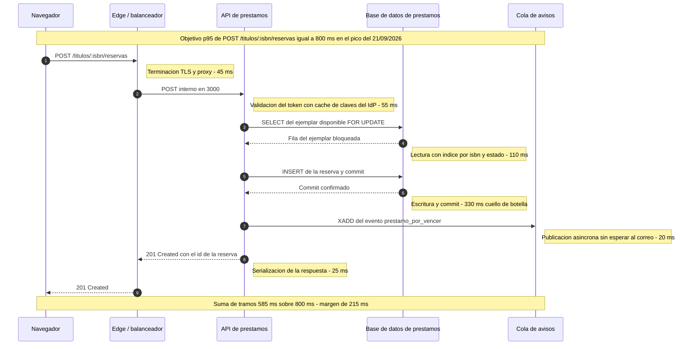
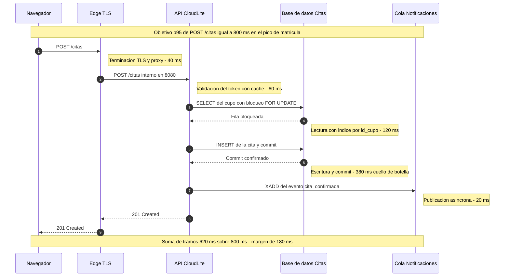

# Solucion del Taller Clase 12 - Rendimiento y ensayo de sustentacion (BiblioLite)

> **DOCUMENTO DOCENTE — PRIVADO.** No publicar en `Clases/` ni en ExamLab antes del cierre de la entrega.

**Resumen:** Taller propio de 100 puntos en seis preguntas. La primera mitad convierte «va rapido» en numeros: escenario del pico con seis datos calculados, presupuesto de latencia repartido salto por salto en un diagrama de secuencia, tres metricas objetivo con ventana de medicion y el cuello de botella con dos mitigaciones argumentadas. La segunda mitad es el guion cronometrado del pitch, con los tiempos reales de dos ensayos y lo que se recorto para entrar en el tiempo.

> **Nota de calendario 2026-2.** Las Clases 11 y 12 caen en la **misma sesion doble del lunes 26/10/2026**: este taller se abre en el segundo bloque, despues del checkpoint. Los dos tiempos de ensayo de la pregunta 5 se cronometran **hoy en clase, con el celular en la mano**; no se aceptan tiempos estimados. **No se pide ninguna herramienta de carga de pago ni cuenta de nube:** todo el escenario se aproxima con aritmetica de servilleta mas una medicion real de `curl` contra el contenedor local del lab, y la pregunta 1 exige declarar el limite de esa aproximacion.

## Alineacion con el taller

- Taller del estudiante: `Clases/Clase 12 - Pruebas de rendimiento y preparacion final/`
- Configuracion en la plataforma: `Kit docente/Clase 12/Taller en ExamLab - Clase 12 (configuracion).md`
- Hito del PI: Escenario de rendimiento + ensayo 5–8 min de sustentación
- Entregable: Sección Rendimiento + guion de pitch + paquete casi-final
- **Estas preguntas: 100 puntos** en 6 preguntas.

| # | Pregunta | Tipo | Puntos |
|---|---|---|---|
| 1 | Escenario de carga del pico de su dominio | `abierta` | 22 |
| 2 | Presupuesto de latencia del camino critico | `diagrama` | 18 |
| 3 | Tres metricas objetivo verificables | `abierta` | 18 |
| 4 | Cuello de botella y dos mitigaciones | `abierta` | 15 |
| 5 | Guion cronometrado del pitch | `abierta` | 17 |
| 6 | Rendimiento: que es cierto | `cerrada_multi` | 10 |

---

## Pregunta 1 · Escenario de carga del pico de su dominio · 22 pts

### Respuesta esperada

**1. Evento del pico.** Lunes **21/09/2026**, primer dia de la semana de parciales del Corte 1. La demanda se concentra porque los ejemplares de bibliografia obligatoria se reservan casi todos ese dia: es el unico momento del semestre en que la misma lista de veinte titulos la busca medio programa a la vez.

**2. Usuarios concurrentes: 288.** Calculo: 2 400 estudiantes matriculados con acceso a la biblioteca, de los cuales un **12 por ciento** entra dentro de la misma ventana (2 400 x 0.12 = 288). El 12 por ciento no es un numero inventado: es la proporcion de estudiantes que en el semestre anterior pidio ejemplares de reserva en la semana de parciales, segun el conteo del mostrador.

**3. Peticiones por segundo: 15.** Calculo: cada usuario concurrente lanza una peticion cada **20 segundos** (busca, lee la ficha, decide, reserva), asi que 288 / 20 = 14.4, que se redondea a **15 req/s** sostenidas. Es el numero que la pregunta 3 usa como objetivo de capacidad.

**4. Mezcla de operaciones.** `GET /titulos` (busqueda) **62 por ciento**, `GET /titulos/{isbn}` (ficha del titulo) **20 por ciento**, `POST /titulos/{isbn}/reservas` **13 por ciento**, `POST /prestamos/{id}/renovacion` **5 por ciento**. Suman **100**. La lectura es el 82 por ciento del trafico, pero el 13 por ciento de escritura es el que decide el diseno: es el unico que bloquea filas.

**5. Duracion de la ventana: 40 minutos**, de 11:40 a 12:20, entre el fin del bloque de la manana y el inicio de los parciales de la tarde.

**6. Volumen de datos de partida.** **14 800 ejemplares** catalogados sobre **9 200 titulos**, **6 300 prestamos historicos** y **240 reservas vivas** al abrir la ventana.

**Frase de honestidad tecnica.** Este escenario no se va a medir con una herramienta de carga: se aproxima con el calculo analitico de arriba mas una medicion real de 20 peticiones con `curl -w "%{time_total}"` contra el contenedor local del lab. **El limite de esa aproximacion es concreto y hay que decirlo:** `curl` mide un solo usuario sin contencion, asi que no reproduce lo que pasa cuando 288 sesiones compiten por la misma fila de `ejemplares` con un bloqueo. El numero de la base de datos del presupuesto de la pregunta 2 es por eso una estimacion con margen deliberado, no una medicion; lo que si es medible hoy es la latencia sin carga, y eso es el piso, no el pico.

### Como calificar

- **10 pts** los 6 datos rotulados y presentes, en el orden del enunciado. Son 1.67 pts cada uno; un dato sin rotulo, escondido en un parrafo, no suma: el rotulo es lo que hace la tabla auditable.
- **5 pts** que usuarios concurrentes **y** peticiones por segundo traigan el calculo que los sustenta, con las dos cifras de entrada visibles (poblacion y porcentaje; concurrentes y tiempo entre peticiones). Un numero solo, sin operacion, vale 0 de estos 5 aunque sea razonable.
- **4 pts** que la mezcla sume exactamente 100. Se suma con calculadora al calificar: es el chequeo mas rapido del taller y falla mas de lo que parece.
- **3 pts** la frase de honestidad tecnica **con el limite** de la aproximacion. Decir «mediremos con curl» sin decir que curl no reproduce contencion vale la mitad.
- Se acepta cualquier evento de pico con fecha real del calendario del dominio del estudiante (matricula, entrega de notas, jornada de vacunacion). Lo que se exige es la fecha y la razon por la que ese dia concentra demanda.

### Errores frecuentes y que hacer

- **Numeros redondos sin origen** (1 000 usuarios, 100 req/s). Se detecta porque no hay operacion; y ademas suele producir un escenario que ningun proyecto academico puede sostener. Devolver pidiendo la poblacion real del dominio y un porcentaje justificado.
- **Mezcla que suma 95 o 110.** Cuesta los 4 pts completos. Si el estudiante esta en el taller, se le dice y corrige en el momento: el objetivo es que aprenda a sumarla, no penalizarlo.
- **Confundir usuarios concurrentes con usuarios totales.** 2 400 matriculados no son 2 400 concurrentes; la diferencia es el porcentaje simultaneo, y es justo la parte que exige pensar.
- **Peticiones por segundo derivadas de la nada** cuando ya hay usuarios concurrentes. El puente es el tiempo entre peticiones de un usuario; sin ese dato el calculo no cierra.
- **Frase de honestidad que es una disculpa** («no pudimos medir bien porque no tenemos servidor»). No es una disculpa: es declarar el metodo y su limite. Reescribirla en una linea con el estudiante.

---

## Pregunta 2 · Presupuesto de latencia del camino critico · 18 pts

### Respuesta esperada

**La aritmetica, que es lo que se verifica a mano:** 45 + 55 + 110 + 330 + 20 + 25 = **585 ms**, sobre un objetivo de **800 ms**, **margen de 215 ms**. Seis notas de milisegundos, una por salto; cinco participantes con los nombres canonicos de la pregunta 2 de la Clase 11.

**Por que el objetivo es 800 ms y no los 400 de la Clase 8.** Es la pregunta que el docente debe poder responder sin dudar, porque parece una contradiccion y no lo es. La tabla de senales de la Clase 8 fijo **p95 por debajo de 400 ms** para el trafico general, que es el 82 por ciento de lecturas de la pregunta 1, y **alerta a los 800 ms**. La operacion de escritura tiene su propio presupuesto, mas holgado, porque hace dos viajes a la base y uno de ellos con la fila bloqueada. El paquete queda coherente si el informe dice las dos cosas: 400 ms para `GET /titulos`, 800 ms para `POST /titulos/:isbn/reservas`. Un solo numero para todo el sistema es lo que produce objetivos que nadie cumple.

**Por que el cuello esta en el commit y no en otra parte.** El `INSERT` con su commit se lleva **330 de los 585 ms, el 56 por ciento del camino critico**, y es el unico salto que ocurre con la fila ya bloqueada por el `FOR UPDATE` del salto anterior. Eso significa que con 288 sesiones el tiempo no se mantiene: se serializa, y ese salto es el que decide si el pico se sostiene. Es exactamente el insumo de la pregunta 4.

**Los 20 ms de la cola son el rendimiento del trabajo de la Clase 11.** Antes de que existiera la `Cola de avisos`, este camino terminaba cuando el `Correo transaccional SaaS` respondia: una llamada a un tercero por internet, que en el peor caso son cientos de milisegundos y en el caso malo es un timeout. Publicar en la cola cuesta 20 ms y saca al correo del camino critico. La decision de arquitectura de la Clase 11 se ve aqui como un numero, y eso es lo que hay que hacer notar en voz alta.

**El margen de 215 ms es deliberado.** No es tiempo sobrante: es el colchon para lo que el `curl` sin contencion no puede medir (la espera en el pool de conexiones y la serializacion de los bloqueos en el pico). Un presupuesto que suma exactamente el objetivo es un presupuesto que ya se incumplio.

### Respuesta esperada (dominio de la solucion)

### Modelo de referencia que ve el estudiante

Es el que aparece en el enunciado de la plataforma, sobre el dominio **AgendaU**. Sirve para comparar estructura y conteos, no para calificar contenido:

### Como calificar

- **6 pts** los 5 participantes con nombres canonicos del paquete y el flujo completo de la operacion de escritura, ida y vuelta. Un participante con nombre generico (`Servidor`, `BD`) pierde su parte: la trazabilidad con el C4 Container es el punto.
- **6 pts** una nota de milisegundos por salto. Se cuentan las notas y se cuentan los saltos: si hay siete saltos y cinco notas, se descuenta proporcionalmente.
- **4 pts** que la suma sea **menor o igual** al objetivo y que el margen de la nota final sea **exactamente** la diferencia. Se suma a mano al calificar; una suma que no cuadra cuesta los 4 completos, incluso si el diagrama es bueno, porque el ejercicio era precisamente sumar.
- **2 pts** el cuello de botella rotulado con la palabra en la nota del salto correspondiente.
- Se acepta cualquier reparto de milisegundos que sea defendible en voz alta: no hay una respuesta unica. Lo que no se acepta es un reparto plano (todos los saltos con el mismo numero), que revela que no se penso donde esta el trabajo real.
- Se acepta que un estudiante fije un objetivo distinto de 800 ms si lo justifica y lo deja coherente con su tabla de senales de la Clase 8. Lo que se exige es que los dos documentos digan lo mismo.

### Errores frecuentes y que hacer

- **Suma que excede el objetivo.** Es el error que la verificacion del enunciado persigue: si los tramos suman 900 sobre un objetivo de 800, el presupuesto declara por escrito que la operacion no cumple. Devolver para que ajuste el reparto o suba el objetivo con justificacion.
- **Margen calculado al ojo** (suma 585, objetivo 800, margen «unos 200»). Cuesta parte de los 4 pts: el margen es una resta, no una impresion.
- **Cuatro o seis participantes.** El enunciado pide 5. Falta tipicamente la cola, porque el estudiante todavia piensa el sistema como el de la Clase 4; es la senal de que el trabajo de la Clase 11 no se propago.
- **El correo como quinto participante en lugar de la cola.** Renderiza igual, pero deja al tercero dentro del camino critico y contradice la decision de la Clase 11. Vale senalarlo aunque el diagrama este bien formado: es material del Q&A.
- **Sin `autonumber`.** Parece cosmetico y no lo es: sin numeros de salto la parte A de la pregunta 4 no puede citar «el salto 8-9». Se pide agregarlo en el momento.
- **Notas de milisegundos sin unidad** (`330` en vez de `330 ms`). Se acepta con observacion la primera vez; en el paquete final debe llevar unidad.

---

## Pregunta 3 · Tres metricas objetivo verificables · 18 pts

### Respuesta esperada

| Metrica | Objetivo con numero y ventana | Como se mide | Que pasa si no se cumple |
|---|---|---|---|
| Latencia | p95 de `POST /titulos/:isbn/reservas` **por debajo de 800 ms**, medido en ventanas de 5 minutos durante los 40 de la ventana del pico (`GET /titulos` mantiene el objetivo de 400 ms de la Clase 8) | 20 peticiones con `curl -w "%{time_total}"` contra el contenedor del lab, ordenadas de mayor a menor: el percentil 95 de 20 muestras es la segunda peor. Cuando exista el edge, el log de acceso da la serie completa | Se agrega el indice compuesto por `(isbn, estado)` sobre `ejemplares`, que es lo que sostiene el `SELECT ... FOR UPDATE` de 110 ms; si aun no alcanza, se aplica la mitigacion estructural de la pregunta 4 |
| Tasa de error | **5xx por debajo del 0.5 por ciento** de las peticiones en ventanas de 5 minutos. Los **409** de doble reserva se cuentan aparte y no son error: son la regla de negocio funcionando, con umbral de revision en el 5 por ciento | Conteo de codigos de estado en la salida del script de 20 peticiones y en `docker logs api-prestamos`, que ya imprime metodo, ruta y estado por linea | Si el 5xx sube, se baja el pool de 20 a 12 conexiones para que la espera se vea como latencia y no como error, y se agrega reintento con espera en el cliente. Si los 409 pasan del 5 por ciento **no se toca la base**: se corrige la interfaz, que esta ofreciendo ejemplares ya reservados |
| Capacidad | **15 peticiones por segundo sostenidas** durante los 40 minutos de la ventana, con la latencia p95 dentro del objetivo de la primera fila | Calculo analitico del escenario de la pregunta 1 mas una corrida de 200 peticiones secuenciales cronometradas en el lab, que da el techo de un solo proceso sin contencion | Se pasa de 1 a 2 replicas de la API detras del edge —la API no guarda estado, asi que se puede— **repartiendo el pool a 10 conexiones por replica** para no exceder las 20 del motor. Si con eso no alcanza, el limite ya no es la API sino la base, y eso es tema de la Clase 13 |

**Linea de cierre:** el promedio no sirve porque se puede cumplir mientras el sistema falla. Con 99 peticiones de 100 ms y una de 4 000 ms el promedio es 139 ms —parece excelente— y sin embargo hubo un estudiante esperando cuatro segundos frente a la pantalla. El p95 dice algo verificable y rompible: «1 de cada 20 estudiantes puede esperar mas de 800 ms, ninguno mas». Un objetivo que no se puede incumplir no es un objetivo.

Dos detalles de esta tabla que valen mas que las cifras:

**La fuente de medicion existe hoy.** No dice «Prometheus» ni «un APM»: dice `curl` y `docker logs`, que son las dos cosas que el proyecto ya tiene. Es la misma honestidad tecnica de la pregunta 1, y es lo que hace la fila verificable en la sustentacion, donde el docente puede pedir la corrida en vivo.

**La columna de la derecha son decisiones, no quejas.** «Se agrega el indice por `(isbn, estado)`», «se baja el pool a 12», «se pasa a 2 replicas con 10 conexiones cada una». Cada una nombra el artefacto que se edita. Y la fila del 409 dice explicitamente que **no** se toca la base: cuando la regla de negocio dispara mucho, el problema casi siempre esta en la interfaz que ofrece lo que no puede dar.

### Como calificar

- **7 pts** las 3 filas con los 3 tipos de metrica —latencia, tasa de error y capacidad— y las 4 columnas. Tres filas de latencia con nombres distintos valen una sola: los tipos son los que manda el enunciado.
- **5 pts** que los 3 objetivos traigan **numero y ventana de medicion**. `p95 por debajo de 800 ms` sin ventana vale la mitad de su parte; `rapido`, `bueno` o `aceptable` valen 0 en esa fila, sin negociacion.
- **4 pts** que la fuente de medicion exista realmente en el proyecto. Se verifica preguntando «muestremela»: si nombra una herramienta que nadie instalo, no suma. `curl`, `docker logs`, el cronometro del celular y la salida de una prueba del lab son fuentes validas.
- **2 pts** que las 3 filas cierren con una decision de arquitectura y no con una queja. «Optimizar la consulta» es una queja; «agregar indice por `(isbn, estado)`» es una decision.
- Se acepta que el estudiante cuente aparte los errores de negocio (409, 422) de los 5xx: es lo correcto y conviene reconocerlo en voz alta, porque mezclarlos es el error que hace que la tabla no sirva.

### Errores frecuentes y que hacer

- **Objetivos sin ventana.** «p95 menor a 800 ms» a secas: ¿medido cuando, sobre cuantas peticiones? Sin ventana no hay como declarar cumplimiento ni incumplimiento. Es el descuento mas frecuente de la pregunta.
- **Nombrar Prometheus, Grafana o New Relic sin tenerlos.** Suena bien y no es verificable. Devolver a la fuente real: el proyecto tiene `curl` y logs, y con eso se puede sostener las tres filas.
- **Contar los 409 como errores.** Hace que el sistema parezca roto justo cuando la regla de negocio funciona, y ademas invita a la mitigacion equivocada (quitar el bloqueo). Corregir siempre, aunque la fila este bien formada.
- **Usar el promedio como objetivo** y descubrirlo solo en la linea de cierre. Si la fila de latencia dice «promedio menor a 400 ms», la linea de cierre se contradice con la tabla: se devuelve para que las dos digan lo mismo.
- **Tercera fila que repite la latencia.** Capacidad es peticiones por segundo sostenidas, y viene calculada de la pregunta 1: si el estudiante no la conecta con su propio escenario, la fila queda huerfana.

---

## Pregunta 4 · Cuello de botella y dos mitigaciones · 15 pts

### Respuesta esperada

**Parte A. El cuello de botella.** El `INSERT` de la reserva con su commit en la `Base de datos de prestamos`: **330 ms de los 585** del camino critico, el **56 por ciento del presupuesto en una sola pieza**. Como lo se: es el salto 8-9 del diagrama de la pregunta 2, la nota `Escritura y commit - 330 ms`. Y hay un segundo argumento que importa mas que el numero: es el unico salto que ocurre **con la fila ya bloqueada** por el `SELECT ... FOR UPDATE` del salto 6-7, asi que con 288 sesiones concurrentes esos 330 ms no se mantienen constantes: **se serializan**. El cuello no es solo el mas lento, es el que no escala con la concurrencia.

**Parte B, mitigacion 1 (estructural).**

1. **Mitigacion:** reemplazar el bloqueo pesimista por una **restriccion unica parcial** sobre `(id_ejemplar)` donde `estado = 'reservado'`, y hacer la reserva con un solo `INSERT ... ON CONFLICT DO NOTHING`: si no inserta fila, el `Servicio de reservas` devuelve el **409** que ya esta en el contrato de la Clase 4.
2. **Efecto esperado:** desaparece el viaje de lectura bloqueante (110 ms) y el commit se acorta porque la transaccion pasa de dos sentencias a una. Se espera recuperar **unos 150 ms de los 440** que hoy consumen los dos saltos de base, y sobre todo que la seccion critica dure lo que dura un `INSERT` y no lo que dura una ida y vuelta de aplicacion.
3. **Costo o riesgo:** la regla de no-doble-reserva deja de estar en codigo legible y pasa a vivir en una restriccion de la base; hay que mantener el indice parcial unico y traducir el error del motor a un 409 en la capa de servicio, que es una linea facil de olvidar en un `catch` generico.
4. **Trade-off:** acepto que la regla de negocio principal quede menos visible en el codigo para conseguir un camino critico de una sola escritura y sin bloqueo explicito.

**Parte B, mitigacion 2 (de capacidad).**

1. **Mitigacion:** pasar de 1 a **2 replicas de la `API de prestamos`** detras del edge y repartir el pool de conexiones a **10 por replica**, para no exceder las 20 del motor.
2. **Efecto esperado:** no baja la latencia de una peticion aislada —el commit sigue costando 330 ms— pero **sostiene las 15 req/s sin que el p95 se degrade por espera en el pool**. Recupera el margen que hoy se pierde cuando el pool llega a 16 de 20 conexiones, que es el umbral de la tabla de senales de la Clase 8.
3. **Costo o riesgo:** duplica las horas encendidas de la fila mas cara de la tabla de costos de la Clase 10, que ya estaba en nivel **A**; agrega una pieza al despliegue; y tiene un techo duro, porque el motor **no** escala con las replicas de la API (es la opcion falsa de la pregunta 6 y el tema central de la Clase 13).
4. **Trade-off:** acepto duplicar las horas de computo de la pieza mas cara para conseguir que la ventana de 40 minutos no degrade el p95.

**Parte C. La mitigacion que no aplicaria.** No cachearia la disponibilidad de los ejemplares con un TTL de un minuto, aunque sea la optimizacion mas barata del catalogo. Romperia el PI porque la disponibilidad es **precisamente el dato que decide si hay doble reserva**: con un cache de sesenta segundos, en el pico se ofreceria como disponible un ejemplar ya reservado, el 409 pasaria de excepcion a respuesta habitual y la capacidad «reservar ejemplar» de la ficha de la Clase 1 dejaria de cumplirse. Cachear el resultado de `GET /titulos` si; el estado de un ejemplar, no.

### Como calificar

- **5 pts** el cuello nombrado en una frase **y** respaldado con el salto exacto del diagrama y su cantidad de milisegundos. Nombrarlo sin citar el salto vale 2; citar el salto equivocado (uno que no es el mayor) vale 0, porque el ejercicio era leer el propio presupuesto.
- **6 pts** las 2 mitigaciones con sus **4 lineas rotuladas** (mitigacion, efecto esperado, costo o riesgo, trade-off). Son 3 pts cada una, 0.75 por linea. Una linea de trade-off que no tiene la forma «acepto X para conseguir Y» no suma: la forma es el contenido.
- **3 pts** que una sea estructural y la otra de capacidad. Dos estructurales valen 1.5: el punto del ejercicio es que el estudiante distinga cambiar el diseno de comprar mas maquina.
- **1 pt** la parte C, con la razon por la que romperia el PI. Nombrar una mitigacion absurda («no usaria mainframe») no suma: tiene que ser una tentacion real y mal aplicada.
- Se acepta cualquier efecto esperado en milisegundos o porcentaje, aunque sea optimista, si esta razonado. Lo que no se acepta es «mejoraria mucho»: sin cifra no hay como saber despues si la mitigacion sirvio.

### Errores frecuentes y que hacer

- **Cuello de botella declarado sin mirar el diagrama** («la base de datos»). Es probablemente cierto y vale poco: el enunciado pide el salto y los milisegundos. Devolver al diagrama de la pregunta 2.
- **Dos mitigaciones de capacidad** (mas replicas y un nodo mas grande). Cuesta la mitad de los 3 pts del reparto y suele significar que el estudiante no ve que el diseno se puede cambiar sin gastar mas.
- **Costo o riesgo en blanco, o «ninguno».** Toda mitigacion cuesta algo; si no se ve el costo, no se entendio la mitigacion. Es la linea que mas distingue una respuesta pensada.
- **Trade-off que es un resumen** («esta mitigacion es buena porque mejora el rendimiento»). Se pide la forma «acepto X para conseguir Y», con X un costo real. Reescribirla en el momento cuesta treinta segundos.
- **Proponer microservicios como mitigacion.** Contradice el ADR-001 y la Clase 4 sin evidencia nueva, y ademas agrega saltos de red a un camino critico que ya tiene el cuello en el commit. Devolver a la tabla de riesgos de la Clase 4.
- **Parte C que descarta la mitigacion obvia** («no agregaria un indice porque cuesta»). El indice es la mitigacion correcta; lo que hay que descartar es lo que rompe una capacidad de la ficha.

---

## Pregunta 5 · Guion cronometrado del pitch · 17 pts

### Respuesta esperada

| Minuto | Seccion | Quien habla | Mensaje clave en una frase | Evidencia en pantalla |
|---|---|---|---|---|
| 0:00 a 1:00 | Problema y dominio | Autor del paquete | La biblioteca reserva dos veces el mismo ejemplar y avisa tarde de los vencimientos: BiblioLite resuelve consultar, reservar, renovar y avisar | Ficha de dominio con las 4 capacidades y el C4 Context renderizado |
| 1:00 a 2:30 | Arquitectura logica | Autor del paquete | Cinco contenedores y un monolito modular: la decision fue **no** distribuir, y esta escrita con su fecha en el ADR-001 | C4 Container renderizado y el ADR-001 abierto en la seccion de decision |
| 2:30 a 3:45 | Contenedor y pipeline | Autor del paquete | La misma imagen corre la API y el procesador de avisos, y el pipeline la construye y la verifica en cada push a main | `/docker/Dockerfile` y la captura del run verde de Actions |
| 3:45 a 5:00 | Seguridad | Autor del paquete | Cinco amenazas STRIDE, cada una senalada en una caja o una flecha, y ningun secreto dentro de la imagen | Tabla STRIDE con la columna «donde se ve» y el paso del `ci.yml` que falla si encuentra un `.env` en la imagen |
| 5:00 a 6:15 | Costos y escalabilidad | Autor del paquete | El costo se ordena por driver y no por precio: la API se paga por horas encendidas, y por eso escala a cero de 22:00 a 06:00 | Tabla de costos con niveles B/M/A y la fila del presupuesto de latencia de hoy |
| 6:15 a 7:00 | Cierre y preguntas | Autor del paquete | Lo que falta esta en un backlog con fechas y lo que decidimos no hacer esta escrito como deuda aceptada | Backlog B-01 a B-05 y la linea de deuda tecnica del checkpoint |

**Tiempos reales cronometrados.** `ensayo 1: 9:12` · `ensayo 2: 7:35` · `ensayo 3: 6:58`.

**Lo que se recorto para entrar en el tiempo (2:14 del primer ensayo):** se elimino la lectura del ADR-001 completo —queda abierto en pantalla y se cita una sola linea, la de la decision—, se paso de explicar las seis categorias de STRIDE a mostrar solo las cinco amenazas propias, y la demo en vivo del `docker run` se reemplazo por la captura ya tomada, que era el minuto mas riesgoso del pitch.

**El reparto suma 7:00, dentro de los 5 a 8 minutos**, y ninguna seccion pasa de 1:30. Eso ultimo no es un detalle de forma: una seccion de tres minutos significa que el resto del sistema se cuenta a las carreras, y es lo que produce pitches donde la arquitectura se explica bien y los costos no se alcanzan a mencionar. El bloque mas largo es el de arquitectura logica, que es el que sostiene el «por que»; el mas corto es el cierre, que solo tiene que dejar dos artefactos en pantalla.

**Cada fila cita un artefacto que existe en el paquete v1.** Ninguna dice «diapositiva de seguridad»: dicen tabla STRIDE, run verde, Dockerfile, backlog. Esa columna es la que convierte el guion en un ensayo verificable, porque el docente puede pedir cualquiera de los seis artefactos en el momento y debe estar a un clic.

**Sobre la columna «Quien habla»:** en este documento dice «Autor del paquete» porque es material docente. En la entrega real va **el nombre del estudiante**; y si el docente autorizo equipo, van todos los integrantes, ninguno con mas de tres filas.

### Como calificar

- **7 pts** las 6 filas con las 6 secciones en el orden del enunciado (problema y dominio, arquitectura logica, contenedor y pipeline, seguridad, costos y escalabilidad, cierre y preguntas) y las 5 columnas. Una seccion fuera de orden se observa pero no descuenta; una seccion ausente si.
- **4 pts** que los minutos sumen entre 5 y 8 **y** que ninguna seccion pase de 2:00. Los rangos se suman al calificar: es la verificacion de treinta segundos. En equipo autorizado, ademas, deben aparecer todos los integrantes y ninguno con mas de 3 filas.
- **4 pts** que cada fila cite un artefacto concreto del paquete. «Slide de seguridad» no es artefacto; «tabla STRIDE» si. Se reparte a 0.67 pts por fila.
- **2 pts** los 2 tiempos de ensayo cronometrados **y** la linea de recorte. Un solo ensayo vale 1; ensayos sin recorte declarado valen 1, porque el aprendizaje del ejercicio esta en decidir que sale.
- El indicador de que el ensayo fue real: el primer tiempo casi siempre pasa de 8 minutos. Un estudiante que reporta 6:00 y 6:05 en los dos ensayos probablemente no cronometro; preguntarle que recorto entre uno y otro resuelve la duda sin acusar a nadie.

### Errores frecuentes y que hacer

- **Guion que suma 12 minutos.** Cuesta los 4 pts del tiempo y, mas caro, garantiza que en la Clase 15 el pitch se corte en la mitad de seguridad. Se corrige en clase: se recorta con el estudiante en el momento.
- **Una seccion de 3:00 y el resto de 0:30.** Es el reparto que el enunciado prohibe con el techo de 2:00. Casi siempre la seccion larga es arquitectura, porque es la mas comoda de contar.
- **Evidencia en pantalla escrita como titulo de diapositiva.** El pitch se sostiene mostrando artefactos, no vinetas. Pedir que cambie las seis celdas por rutas del paquete.
- **Tiempos de ensayo inventados.** Se detecta porque no hay recorte declarado o porque los dos tiempos son casi iguales. Se pide cronometrar en el momento: son siete minutos de clase y valen la pena.
- **Mensaje clave que describe en vez de argumentar** («explicaremos la arquitectura del sistema»). El mensaje clave es la frase que el jurado debe recordar; si es una descripcion del orden del dia, no cumple.
- **En equipo, un integrante con cinco filas y el otro con una.** El enunciado pone techo de 3 filas por persona justamente para eso. Se redistribuye antes de la Clase 15.

---

## Pregunta 6 · Rendimiento: que es cierto · 10 pts

### Clave y por que

La clave se lee del banco de la plataforma, asi que esta es la que se califica. La columna de la derecha es lo que hay que poder responderle al estudiante cuando pregunte.

|  | Opcion | Por que |
|---|---|---|
| **SI** | El promedio puede verse bien mientras el p95 esta muy por encima del objetivo. | **Cierta.** Es la linea de cierre de la pregunta 3, con numeros: 99 peticiones de 100 ms y una de 4 000 ms dan un promedio de 139 ms —que parece excelente— mientras un estudiante espero cuatro segundos. El promedio esconde la cola; el percentil la muestra. |
| **SI** | Un objetivo de rendimiento sin numero ni ventana de medicion no es verificable. | **Cierta.** Es el criterio con el que se califica la pregunta 3: «rapido» no se puede cumplir ni incumplir. Un objetivo verificable necesita numero **y** ventana de medicion, porque sin ventana no hay momento en el cual declarar el resultado. |
| no | Si la API escala a mas replicas, la base de datos primaria escala sola en la misma proporcion. | **Falsa, y es la falsa mas importante del taller.** La base primaria no escala con las replicas de la API: es una sola pieza que recibe mas conexiones de las que tenia. Es exactamente el riesgo declarado en la mitigacion 2 de la pregunta 4 (repartir el pool a 10 por replica para no pasar de 20) y es el tema central de la Clase 13, «lo que NO escala». Quien la marca perdio 4 pts y necesita ese repaso antes del 02/11. |
| **SI** | Conviene medir tambien la tasa de error, porque un sistema que devuelve 500 rapido parece rapido. | **Cierta.** Un sistema que devuelve 500 en 40 ms tiene una latencia envidiable y no sirve para nada. Por eso la tabla de la pregunta 3 tiene una fila entera de tasa de error, con los 409 contados aparte. |
| no | Probar con 3 usuarios en el portatil del equipo demuestra el comportamiento en el pico de matricula. | **Falsa.** Es justamente el limite que la frase de honestidad tecnica de la pregunta 1 obliga a declarar: tres usuarios en un portatil miden latencia sin contencion, que es el piso. No reproducen 288 sesiones compitiendo por la misma fila con un bloqueo. Medir asi esta bien; concluir de ahi el comportamiento en el pico, no. |
| no | El cuello de botella de una aplicacion web siempre esta en el frontend. | **Falsa.** A veces el cuello esta en el frontend, y muchas veces no: en BiblioLite esta en el commit de la reserva, con 330 de 585 ms. La palabra que hace falsa la afirmacion es «siempre»; el cuello se encuentra midiendo, no por reputacion de la capa. |

### Como calificar

- **4 pts por cada afirmacion correcta marcada, con techo de 10.** Las tres ciertas son las opciones 1, 2 y 4 tal como estan numeradas en la plataforma (promedio contra p95, objetivo sin numero, tasa de error). La clave se lee del banco, no de memoria.
- **Se descuentan 4 pts por cada incorrecta marcada**, sin bajar de cero. Marcar las seis da cero: conviene advertirlo antes de abrir la actividad.
- Las tres falsas cubren tres confusiones distintas y vale la pena leer el reporte por opcion: la base que escala sola (Clase 13), el portatil como prueba de carga (pregunta 1) y el frontend culpable por defecto (pregunta 4). No son ruido de relleno.
- Si mas de la mitad del grupo marca la opcion de la base que escala sola, la Clase 13 debe abrir por ahi: es la mitad del entregable de esa clase y la confusion mas costosa del corte.

### Errores frecuentes y que hacer

- **Marcar las seis.** El descuento lo deja en cero. Es la unica pregunta autocalificada del taller y la unica donde marcar de mas cuesta.
- **Marcar la opcion de la base que escala sola** porque «horizontal es mejor». Escalar la API es facil precisamente porque no guarda estado; la base guarda estado y ahi esta toda la dificultad.
- **Descartar la opcion de la tasa de error** por parecer obvia. Es cierta y vale 4 pts; el reflejo de «esta demasiado facil, debe ser trampa» cuesta puntos todos los semestres.
- **Marcar la del frontend** despues de haber escrito en la pregunta 4 que su cuello esta en la base. Es la contradiccion interna mas facil de senalar y la mas util para el estudiante.

---

## Lo que van a preguntar (respuestas listas)

Estas son las dudas que aparecen todos los semestres. Tenerlas resueltas por escrito es lo que evita responder la misma cosa quince veces durante el taller.

**No tengo herramienta de carga ni servidor. ¿Como mido 15 peticiones por segundo?**

No las mide: las **calcula** y lo declara. La pregunta 1 pide justamente eso, y la frase de honestidad tecnica es donde se dice el limite. Lo que si se mide hoy es la latencia de una peticion con `curl -w "%{time_total}"` contra el contenedor del lab, veinte veces. Eso da el piso real; el pico se estima.

**¿Por que el objetivo de la escritura es 800 ms si en la Clase 8 puse 400?**

Porque son dos caminos distintos. Los 400 ms son para las lecturas, que son el 82 por ciento del trafico; la escritura hace dos viajes a la base y uno con la fila bloqueada, asi que tiene su propio presupuesto. Lo que se exige es que el informe diga las dos cifras y a que operacion aplica cada una.

**¿El percentil 95 se puede calcular con 20 mediciones?**

De forma aproximada, si: se ordenan de mayor a menor y el p95 de 20 muestras es la segunda peor. Con 20 datos el numero es grueso y hay que decirlo, pero es infinitamente mejor que un promedio. Con 100 mediciones ya es razonable.

**Mi presupuesto de latencia suma mas que el objetivo. ¿Subo el objetivo?**

Puede, si lo justifica y ajusta la tabla de senales para que digan lo mismo. Pero primero mire el reparto: si un salto se lleva mas de la mitad, ahi esta su cuello de botella y la pregunta 4 se responde sola. Un presupuesto que no cuadra es un hallazgo, no un error de forma.

**¿Puedo poner cache como una de las dos mitigaciones?**

Como estructural, si —siempre que sea cache de **lecturas**, tipo `GET /titulos`—. Lo que no se acepta es cachear el dato que decide la regla de negocio: la disponibilidad de un ejemplar cacheada un minuto convierte el 409 en la respuesta normal del pico. Ese es el ejemplo de la parte C.

**¿El ensayo del pitch cuenta si lo hice solo, en la casa?**

Cuenta si esta cronometrado y si declara el recorte. Lo que se califica son los dos tiempos y la decision de que sacar, no el publico. Dicho eso, el ensayo de hoy en clase es el que sirve de verdad: en voz alta y con alguien mirando, el tiempo siempre es mayor.

**Somos equipo. ¿Como reparto las seis filas?**

Con el techo del enunciado: ninguno mas de tres filas y todos deben aparecer. La reparticion que funciona es por bloques tematicos, no alternando frases: quien escribio el ADR cuenta arquitectura, quien armo el pipeline cuenta contenedor y CI. Cambiar de voz en mitad de un tema cuesta tiempo y coherencia.

**¿Tengo que mostrar la demo en vivo en el pitch?**

No, y normalmente conviene que no. Cinco a ocho minutos no dan para que algo se cuelgue: la captura del run verde y el `docker ps` ya tomados prueban lo mismo sin el riesgo. Fue justo lo que se recorto entre el ensayo 1 y el 2 de esta solucion.

---

## Cierre de la clase

Lo que queda de hoy es que el sistema pasa de «funciona» a «funciona dentro de un numero»: 15 peticiones por segundo durante 40 minutos, p95 de 800 ms en la escritura y 400 en la lectura, 5xx por debajo del 0.5 por ciento, y un cuello de botella identificado con su salto y sus 330 ms. Las dos cosas que hay que llevar a la Clase 13 son ese cuello y el riesgo de la mitigacion de capacidad: la API se puede replicar porque no guarda estado, pero la base no escala con ella, y esa frase es literalmente la mitad del entregable de la clase autonoma del 02/11. Y del lado del pitch queda un guion de 7:00 con seis artefactos en pantalla, que es lo que se sustenta el 16/11: ensayarlo dos veces mas antes de esa fecha es la unica preparacion que hace diferencia.

---

## Politica de entrega

La entrega que se califica es la respuesta dentro de ExamLab (https://uniaj.examlab.workers.dev/). El documento en Word o Google Docs es opcional y solo sirve para que el estudiante conserve sus respuestas. Gratis + navegador; sin cuentas cloud de pago ni tarjeta.
