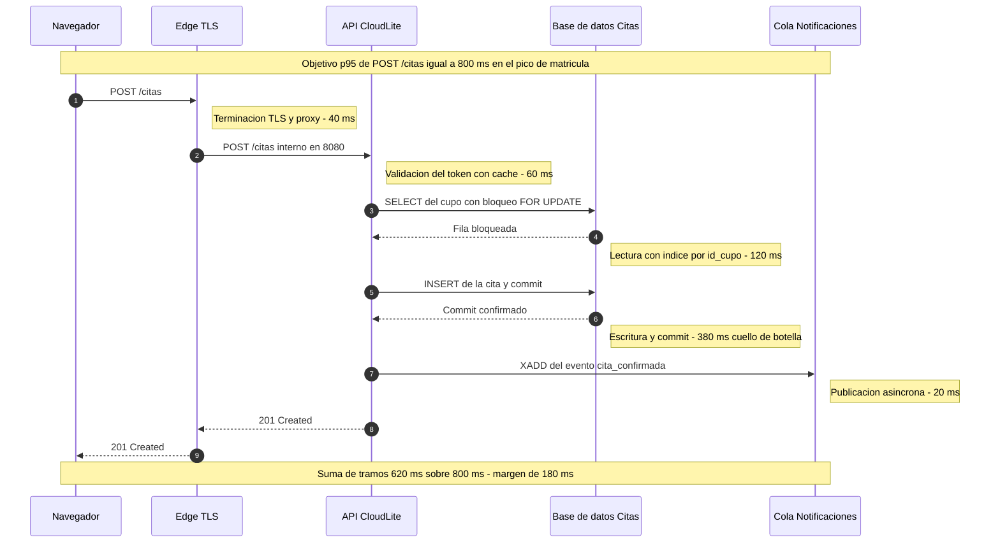

# Taller de la Clase 12 en ExamLab - configuracion

- **Curso:** Arquitectura de Sistemas Computacionales (FI303380)
- **Taller:** Taller Clase 12 en ExamLab - Rendimiento y ensayo de sustentacion de CloudLite
- **Preguntas:** 6 · **Total:** 100 puntos
- **Plataforma:** ExamLab (https://uniaj.examlab.workers.dev/) · modulo Talleres
- **Hito del PI:** Escenario de rendimiento + ensayo 5–8 min de sustentación
- **Entregable de la clase:** Sección Rendimiento + guion de pitch + paquete casi-final

> ExamLab no importa preguntas desde archivo: el alta se hace en la UI del
> docente (o con la pestana de IA). Este documento trae el texto exacto de cada
> campo para copiar y pegar, incluidos el SQL de partida y el codigo base.

**Que produce el estudiante:** El estudiante entrega el escenario de carga del pico de su dominio con 3 metricas objetivo numericas, el presupuesto de latencia repartido por salto en un diagrama de secuencia y el guion cronometrado del pitch de sustentacion.

---

## Pregunta 1 - Respuesta escrita · 22 pts

**Tipo en la plataforma:** `abierta`

**Enunciado (campo Contenido):**

## Escenario de carga del pico de su dominio

Escriba el escenario con **estos 6 datos rotulados**, en este orden:

1. **Evento del pico**: cual dia y por que se concentra la demanda (`primera semana de matricula`, `dia de entrega de notas`, `jornada de vacunacion`). Incluya una fecha real del calendario de su dominio.
2. **Usuarios concurrentes**: un numero y como lo estimo (`320 estudiantes del programa por 15 por ciento simultaneos`).
3. **Peticiones por segundo**: un numero y el calculo que lo sustenta.
4. **Mezcla de operaciones**: porcentajes por operacion (`GET /cupos 70 por ciento`, `POST /citas 25 por ciento`, `DELETE /citas 5 por ciento`). **Deben sumar exactamente 100.**
5. **Duracion de la ventana**: cuanto dura el pico (`45 minutos`).
6. **Volumen de datos de partida**: cuantos registros ya existen (`8000 citas historicas y 1200 cupos publicados`).

Cierre con **una frase de honestidad tecnica**: como piensa aproximar este escenario **sin cloud de pago** (medicion en el lab con pocas peticiones, calculo analitico, prueba cualitativa) y cual es el limite de esa aproximacion.

**Rubrica esperada (campo Rubrica):**

10 pts los 6 datos rotulados y presentes. 5 pts que los usuarios concurrentes y las peticiones por segundo tengan el calculo que los sustenta. 4 pts que la mezcla de operaciones sume exactamente 100 por ciento. 3 pts la frase de honestidad tecnica con el limite de la aproximacion.

---

## Pregunta 2 - Diagrama (Mermaid) · 18 pts

**Tipo en la plataforma:** `diagrama`

**Enunciado (campo Contenido):**

## Presupuesto de latencia del camino critico

Escriba un `sequenceDiagram` de la **operacion de escritura principal** de su dominio, con **exactamente 5 participantes** (navegador, edge, API, base de datos y cola), usando los nombres canonicos de su paquete.

Requisitos:
1. `autonumber`.
2. Una `Note over` inicial que declare el **objetivo de p95** de la operacion (`p95 de POST /citas igual a 800 ms en el pico`).
3. Una `Note right of` **por cada salto** con los **milisegundos asignados** a ese salto.
4. El salto que consume mas tiempo debe estar rotulado como **cuello de botella**.
5. Una `Note over` final con la **suma de los tramos** y el **margen restante** frente al objetivo.

**Verificacion:** sume a mano los milisegundos de las notas; la suma debe ser **menor o igual** al objetivo declarado y el margen de la nota final debe ser exactamente la diferencia.

**Pegar al final del enunciado — flujo de entrega del diagrama:**

**Del boceto al codigo Mermaid.** No subas una imagen: la respuesta de esta pregunta es texto Mermaid.

- **1. Disena visual** Dibuja el diagrama como quieras en Excalidraw o draw.io: es mas rapido arrastrar cajas que escribir codigo, y ahi es donde piensas el modelo.
- **2. Traduce con IA** Copia o describe tu boceto a una IA y pidele el codigo Mermaid: «convierte este diagrama a Mermaid usando `sequenceDiagram`». Revisa el resultado: la IA acierta la sintaxis, no tu modelo.
- **3. Pega y renderiza en ExamLab** Pega ese codigo en la caja de texto de la pregunta y mira como lo dibuja la plataforma. Si no renderiza, corrige ahi mismo: lo que se califica es el diagrama renderizado dentro de ExamLab.
- **4. Guarda el PNG para tu PI** Exporta tambien la imagen a la carpeta de tu Proyecto Integrador. Esa copia es para tu informe; no reemplaza la respuesta en la plataforma.

**Diagrama de referencia (Mermaid):**

**Rubrica esperada (campo Rubrica):**

6 pts los 5 participantes con nombres canonicos y el flujo completo de la operacion. 6 pts una nota de milisegundos por salto. 4 pts que la suma sea menor o igual al objetivo y que el margen final sea correcto. 2 pts el cuello de botella rotulado.

---

## Pregunta 3 - Respuesta escrita · 18 pts

**Tipo en la plataforma:** `abierta`

**Enunciado (campo Contenido):**

## Tres metricas objetivo verificables

Construya una tabla de **4 columnas** con encabezados exactos:

`Metrica | Objetivo con numero y ventana | Como se mide | Que pasa si no se cumple`

con **exactamente 3 filas**, una por cada tipo: **latencia**, **tasa de error** y **capacidad** (peticiones por segundo sostenidas).

Reglas:
- El objetivo debe llevar **numero y ventana de medicion**: `p95 por debajo de 800 ms medido en ventanas de 5 minutos`. Palabras como `rapido`, `bueno` o `aceptable` sin cifra invalidan la fila.
- `Como se mide` nombra la **fuente real** disponible en su proyecto (log del edge, salida de una prueba en el lab, cronometro con 20 peticiones manuales, tiempos del `curl -w`).
- `Que pasa si no se cumple` es una **decision de arquitectura**, no una queja (`se agrega indice por id_cupo`, `se mueve el envio de correo a la cola`).

Cierre con **una linea**: por que el promedio no sirve como objetivo y el p95 si.

**Rubrica esperada (campo Rubrica):**

7 pts las 3 filas con los 3 tipos de metrica y las 4 columnas. 5 pts que los 3 objetivos tengan numero y ventana de medicion. 4 pts que la fuente de medicion exista realmente en el proyecto. 2 pts la decision de arquitectura en las 3 filas.

---

## Pregunta 4 - Respuesta escrita · 15 pts

**Tipo en la plataforma:** `abierta`

**Enunciado (campo Contenido):**

## Cuello de botella y mitigaciones

**Parte A.** Nombre **el cuello de botella** de su arquitectura en **una frase** e indique **como lo sabe**: cite el salto exacto del diagrama de la pregunta 2 y su cantidad de milisegundos.

**Parte B.** Proponga **exactamente 2 mitigaciones**, cada una con **4 lineas rotuladas**:

1. **Mitigacion**: que cambia en el diseno.
2. **Efecto esperado**: cuantos milisegundos o cuanto porcentaje espera recuperar.
3. **Costo o riesgo**: que empeora (complejidad, consistencia eventual, mas dinero, mas piezas que fallan).
4. **Trade-off en una frase**: `acepto X para conseguir Y`.

Una de las 2 mitigaciones debe ser **estructural** (indice, cache, mover trabajo a la cola, separar lectura de escritura) y la otra **de capacidad** (mas replicas, nodo mas grande, ajuste del pool de conexiones).

**Parte C.** Una linea: que mitigacion **no** aplicaria y por que romperia el PI.

**Rubrica esperada (campo Rubrica):**

5 pts el cuello de botella nombrado y respaldado con el salto y los milisegundos del diagrama. 6 pts las 2 mitigaciones con sus 4 lineas rotuladas. 3 pts que una sea estructural y otra de capacidad. 1 pt la parte C.

---

## Pregunta 5 - Respuesta escrita · 17 pts

**Tipo en la plataforma:** `abierta`

**Enunciado (campo Contenido):**

## Guion cronometrado del pitch

Construya una tabla de **5 columnas** con encabezados exactos:

`Minuto | Seccion | Quien habla | Mensaje clave en una frase | Evidencia en pantalla`

con **exactamente 6 filas**, en este orden de secciones: **problema y dominio**, **arquitectura logica**, **contenedor y pipeline**, **seguridad**, **costos y escalabilidad**, **cierre y preguntas**.

Reglas:
- La columna `Minuto` usa rangos (`0:00 a 1:00`) y la **suma total debe quedar entre 5 y 8 minutos**.
- La columna `Quien habla` lleva **su nombre** en modo individual; si el docente autorizo equipo, **deben aparecer todos los integrantes** en la columna y ninguno puede llevar mas de 3 filas. En los dos casos **ninguna seccion puede pasar de 2:00**: el guion se reparte por bloques tematicos, no en un solo tramo largo.
- `Evidencia en pantalla` cita el **artefacto concreto** que se muestra (`diagrama C4 Container renderizado`, `captura del run verde de Actions`, `tabla STRIDE`).

Debajo de la tabla escriba el **tiempo real cronometrado del ensayo** (`ensayo 1: 9:12`, `ensayo 2: 7:35`) con al menos **2 ensayos**, y **una linea** con lo que recortaron para entrar en el tiempo.

**Rubrica esperada (campo Rubrica):**

7 pts las 6 filas con las 6 secciones en orden y las 5 columnas. 4 pts que los minutos sumen entre 5 y 8 y que el guion quede repartido por bloques tematicos sin ninguna seccion de mas de 2:00 (en equipo autorizado, que ademas hablen todos los integrantes). 4 pts que cada fila cite un artefacto concreto como evidencia. 2 pts los 2 tiempos de ensayo cronometrados y el recorte declarado.

---

## Pregunta 6 - Seleccion multiple · 10 pts

**Tipo en la plataforma:** `cerrada_multi`

**Enunciado (campo Contenido):**

## Rendimiento: que es cierto

Seleccione las **3 afirmaciones correctas**.

**Opciones:**

- [x] El promedio puede verse bien mientras el p95 esta muy por encima del objetivo.
- [x] Un objetivo de rendimiento sin numero ni ventana de medicion no es verificable.
- [ ] Si la API escala a mas replicas, la base de datos primaria escala sola en la misma proporcion.
- [x] Conviene medir tambien la tasa de error, porque un sistema que devuelve 500 rapido parece rapido.
- [ ] Probar con 3 usuarios en el portatil del equipo demuestra el comportamiento en el pico de matricula.
- [ ] El cuello de botella de una aplicacion web siempre esta en el frontend.

**Rubrica esperada (campo Rubrica):**

4 pts por cada correcta marcada hasta un maximo de 10; se descuentan 4 pts por cada incorrecta marcada, sin bajar de cero.

---

## Al terminar de crearlo

- Verifique que la suma de puntos sea la esperada: **100**.
- Publique el taller y confirme la fecha limite (domingo 23:59 segun el Acuerdo).
- Las preguntas con SQL o codigo: ejecutelas una vez usted mismo antes de publicar,
  para confirmar que el SQL de partida corre y que el starter compila.
