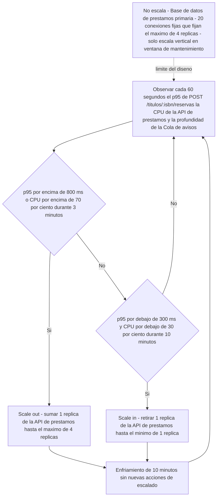
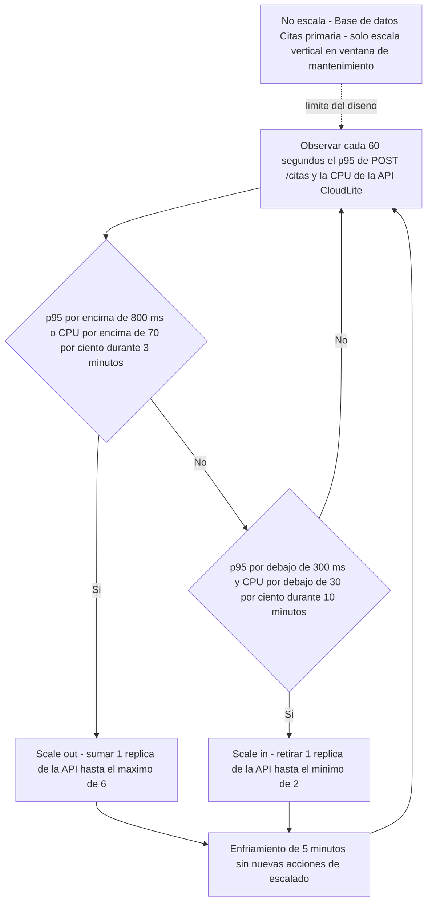

# Solucion del Taller Clase 13 - Politica de autoescalado (BiblioLite)

> **DOCUMENTO DOCENTE — PRIVADO.** No publicar en `Clases/` ni en ExamLab antes del cierre de la entrega.

**Resumen:** Taller propio de 100 puntos en cinco preguntas, de la clase autonoma del 02/11/2026. La politica se escribe componente por componente con disparadores numericos, minimos, maximos y enfriamiento; se dibuja como maquina de decision que cierra el ciclo; se declara con nombre y razon tecnica lo que **no** escala —y ahi esta el hallazgo de la clase: el maximo de replicas de la API no lo decide la API, lo decide el limite de 20 conexiones del motor—; y se enlaza con la tabla de costos de la Clase 10 en tres escenarios.

> **Clase autonoma.** El 02/11/2026 es festivo y no hay sesion sincrona: el taller se resuelve en casa con el fundamento de la clase, que esta escrito para ser guia y material de estudio a la vez. **La politica es conceptual:** no se pide configurar un autoescalador real, ni abrir cuenta en ningun proveedor, ni tarjeta de credito. Lo que se califica es la tabla, el diagrama y los argumentos. Los numeros deben ser **los mismos** que el estudiante ya escribio en la Clase 12 (presupuesto de latencia) y en la Clase 8 (tabla de senales): la coherencia entre los tres documentos es la mitad de la nota.

## Alineacion con el taller

- Taller del estudiante: `Clases/Clase 13 - Escalabilidad automatica/`
- Configuracion en la plataforma: `Kit docente/Clase 13/Taller en ExamLab - Clase 13 (configuracion).md`
- Hito del PI: Documentar política de autoescalado conceptual de CloudLite
- Entregable: Sección Escalabilidad: triggers, límites, qué escala y qué no
- **Estas preguntas: 100 puntos** en 5 preguntas.

| # | Pregunta | Tipo | Puntos |
|---|---|---|---|
| 1 | Politica de autoescalado de BiblioLite | `abierta` | 30 |
| 2 | Maquina de decision del autoescalado | `diagrama` | 25 |
| 3 | Lo que NO escala y por que | `abierta` | 20 |
| 4 | Impacto del autoescalado en costos y sostenibilidad | `abierta` | 15 |
| 5 | Disparadores de autoescalado | `cerrada_multi` | 10 |

---

## Pregunta 1 · Politica de autoescalado de BiblioLite · 30 pts

### Respuesta esperada

| Componente | Tipo de escala | Disparador de subida | Disparador de bajada | Minimo y maximo | Enfriamiento |
|---|---|---|---|---|---|
| Edge / balanceador | horizontal | conexiones concurrentes por encima de 400 durante 3 minutos, medidas en el log de acceso del proxy | conexiones concurrentes por debajo de 120 durante 15 minutos | min 1 y max 2 | 15 minutos |
| API de prestamos | horizontal | p95 de `POST /titulos/:isbn/reservas` por encima de 800 ms **o** CPU por encima del 70 por ciento, sostenido 3 minutos | p95 por debajo de 300 ms **y** CPU por debajo del 30 por ciento, sostenido 10 minutos | min 1 y max 4 (4 replicas x 5 conexiones = las 20 del motor) | 10 minutos |
| Procesador de avisos | horizontal | profundidad de la `Cola de avisos` por encima de 500 mensajes durante 2 minutos | profundidad por debajo de 50 mensajes durante 10 minutos | min 0 y max 3 | 10 minutos |
| Base de datos de prestamos | no escala | no aplica | no aplica | capacidad fija: 1 primaria, 2 vCPU, 4 GB y **20 conexiones** | no aplica - solo cambia en ventana de mantenimiento anunciada |
| Cola de avisos | vertical | memoria usada por encima del 75 por ciento de los 512 MB durante 10 minutos | no aplica - el redimensionamiento a la baja se decide a mano en la ventana de mantenimiento, nunca en automatico | capacidad fija de 1 instancia; de 512 MB a 1 GB en ventana de mantenimiento | no aplica en automatico - 1 ventana por corte (unas 5 semanas) |

**Linea de cierre:** el primero que escala cuando llega el pico es el `Procesador de avisos`, porque su ventana de medicion es la mas corta de la politica (2 minutos) y su cola acumula de inmediato; el ultimo es la `Base de datos de prestamos`, que **no escala en absoluto** y que por eso le impone su techo a todos los demas.

**El hallazgo de la clase, y hay que decirlo en voz alta: el maximo de la API no lo decide la API.** Cada replica abre su propio pool de conexiones y el motor acepta 20 en total. Con 5 conexiones por replica, el techo son **4 replicas**, y ese numero no sale de la CPU de la API ni del trafico esperado: sale de la unica pieza que no escala. Es la definicion operativa de cuello de botella estructural, y es la respuesta que el jurado de la Clase 15 va a buscar cuando pregunte «¿y si le llegan mil usuarios?».

**Por que el minimo de la API es 1 y no 2.** Con 2 replicas habria alta disponibilidad: una se puede reiniciar sin cortar el servicio. Con 1, un reinicio son unos 20 segundos de caida. Se elige 1 a proposito, porque la tabla de costos de la Clase 10 dejo la fila de la API en nivel **A** por horas encendidas y el apalancamiento declarado alli era bajar de 720 a 480 horas al mes. Es una **deuda aceptada**, no un olvido, y asi debe quedar escrita en el informe: se acepta una ventana de 20 segundos en los reinicios para conseguir un tercio menos de horas encendidas.

**Por que el minimo del procesador de avisos es 0, y la trampa que eso esconde.** Escalar a cero es el apalancamiento que la Clase 10 anoto para el worker, y aqui se puede porque el aviso de vencimiento sale **dos dias antes** de la fecha: un retraso de dos minutos es irrelevante para el negocio. Pero hay un detalle que se le escapa a casi todo el mundo: **si el worker esta en cero, no es el worker el que ve la cola**. La profundidad la observa el orquestador, desde fuera. Si la metrica se midiera dentro del worker, con cero replicas nadie miraria y los avisos no saldrian nunca.

**Por que los enfriamientos son largos, y el efecto secundario que hay que aceptar.** La regla es que el enfriamiento no puede ser mas corto que la ventana de medicion, o el sistema decide con datos que todavia esta produciendo: sube, y antes de que la replica nueva reciba trafico ya volvio a medir alto, y sube otra vez. De ahi los 10 minutos de la API, que igualan la ventana de bajada. La consecuencia es incomoda y conviene calcularla: con enfriamiento de 10 minutos y un pico de **40 minutos** (el del 21/09/2026 de la Clase 12), la politica alcanza a subir de 1 a 4 replicas justo cuando el pico esta terminando. Ese es el argumento tecnico para pre-escalar a mano antes de las 11:40, y es exactamente lo que la pregunta 4 escribe como accion de sostenibilidad.

### Como calificar

- **10 pts** las 5 filas con los 5 componentes del C4 Deployment del estudiante y los 6 campos llenos. 2 pts por fila. Los nombres deben ser los canonicos de la Clase 11: una fila que diga «servidor» no suma.
- **8 pts** que los disparadores lleven **metrica + umbral numerico + ventana** en todas las filas que escalan. **Cero en la fila cuyo disparador no tenga numero**, tal como lo anuncia el enunciado: es el descuento por fila y no admite excepcion.
- **6 pts** minimos y maximos con dos numeros concretos y sin infinitos. Se acepta `min 0` para un procesador asincrono si el estudiante justifica la tolerancia del negocio; no se acepta «segun demanda» ni «sin limite».
- **4 pts** el enfriamiento coherente con la ventana: **nunca mas corto que la ventana de medicion**. Es la verificacion aritmetica de la pregunta y se hace comparando dos celdas de la misma fila.
- **2 pts** la linea de cierre con el primero y el ultimo en escalar.
- Al menos una fila debe ser `no escala`; si el estudiante marca dos (por ejemplo base y cola) se acepta, siempre que la capacidad fija este escrita. Cinco filas `no escala` no: eso no es una politica.

### Errores frecuentes y que hacer

- **Disparadores sin ventana** («CPU por encima del 70 por ciento»). Es el error mas frecuente y el mas caro, porque la fila entera se va a cero. Sin ventana el sistema escala por un pico de un segundo y entra en oscilacion.
- **`max: sin limite` o `max: segun se necesite`.** El enunciado lo prohibe explicitamente. Un maximo abierto es como se producen las facturas de miles de dolares que salen en las noticias, y en este curso ademas contradice la restriccion de no usar cloud de pago.
- **Enfriamiento de 30 segundos con ventana de 3 minutos.** Es la incoherencia que la pregunta 5 pone como opcion falsa. Se detecta comparando dos celdas; devolver para que iguale el enfriamiento a la ventana mas larga de la fila.
- **Ninguna fila `no escala`.** Casi siempre significa que el estudiante puso la base de datos como `horizontal` para que la tabla quedara «completa». Es el error conceptual central del tema y hay que corregirlo con la razon tecnica, no con la regla del enunciado.
- **Maximo de replicas elegido al azar** (`max 10`) cuando el motor acepta 20 conexiones. No descuenta por si mismo si el numero esta escrito, pero deja la pregunta 3 sin su mejor argumento: vale la pena senalarlo con la aritmetica del pool.
- **Metricas de disparo que el proyecto no puede observar** (latencia p99 desde un APM que nadie instalo). Se pide lo mismo que en la Clase 12: la fuente debe existir. `docker stats`, el log del proxy y la profundidad de la cola son fuentes validas.

---

## Pregunta 2 · Maquina de decision del autoescalado · 25 pts

### Respuesta esperada

**Los seis elementos que pide el enunciado, senalados uno por uno:** el nodo `obs` trae el **periodo de evaluacion** (60 segundos) y las tres metricas observadas; `up` y `down` son los dos rombos con **los umbrales exactos de la tabla de la pregunta 1** —800/70 con 3 minutos para subir, 300/30 con 10 minutos para bajar—; `out` e `inn` llevan **su limite** (maximo de 4, minimo de 1); `cool` es el enfriamiento de 10 minutos por el que pasan **las dos** acciones; y `noesc` es lo que no escala, unido con **arista punteada** rotulada `limite del diseno`.

**El ciclo cierra, y se puede recorrer con el dedo:** obs -> up -> (No) -> down -> (No) -> obs es la vuelta en la que no pasa nada, que es la vuelta normal. Las dos vueltas que actuan son obs -> up -> Si -> out -> cool -> obs y obs -> up -> No -> down -> Si -> inn -> cool -> obs. Ningun camino termina en un nodo sin salida: eso es lo que distingue una maquina de decision de un dibujo de cajas.

**Por que el enfriamiento esta despues de las dos acciones y no solo del scale out.** Es el detalle que se salta la mitad del grupo. La oscilacion —subir, bajar, subir— aparece justo cuando la bajada no espera: se retira una replica, el p95 sube porque las que quedan reciben mas trafico, y a los 60 segundos el rombo de subida dice que hay que sumar otra. Un enfriamiento que solo aplica a la subida no evita nada.

**Por que la arista de `noesc` es punteada y va a `obs`.** No es un paso del ciclo: es una **restriccion** sobre el ciclo. La base de datos no participa de la decision —nunca se le suma ni se le quita nada— pero condiciona el limite del nodo `out`: el maximo de 4 esta ahi por sus 20 conexiones. La arista punteada dice exactamente eso, «esto no fluye, esto limita», y es la unica forma de que la restriccion quede en el diagrama sin mentir sobre el flujo.

**Sobre el procesador de avisos.** Tiene su propio ciclo, de la misma forma, con la profundidad de la cola como metrica, 500/2 minutos para subir, 50/10 para bajar y minimo 0. Se deja fuera de esta lamina a proposito: dibujar los dos ciclos duplica los nodos sin agregar una idea nueva, y el enunciado pide **el** ciclo de decision. Si un estudiante dibuja los dos y se entiende, se acepta sin objecion.

### Respuesta esperada (dominio de la solucion)

### Modelo de referencia del kit docente (el estudiante NO lo ve)

Vive en `Taller en ExamLab - Clase 13 (configuracion).md` y no se pega en el enunciado; esta resuelto sobre el dominio **AgendaU**. Sirve para comparar estructura y conteos —cuantas cajas, cuales son almacenes, si toda flecha lleva protocolo y formato—, **nunca** para calificar contenido ni nombres:

### Como calificar

- **8 pts** el nodo de observacion con **periodo y metricas** y los 2 rombos con **umbrales numericos**. Los numeros del diagrama deben ser identicos a los de la tabla de la pregunta 1: se comparan celda por celda y una discrepancia descuenta, porque el ejercicio es la coherencia.
- **6 pts** los nodos de scale out y scale in **con su limite** escrito en la etiqueta («hasta el maximo de 4», «hasta el minimo de 1»). Un nodo que solo diga «escalar» vale la mitad.
- **5 pts** el nodo de enfriamiento por el que pasan **ambas** acciones y el cierre del ciclo sobre el nodo de observacion. Si el enfriamiento cuelga solo del scale out, son 2.5.
- **4 pts** el nodo de lo que no escala con **arista punteada** (`-.->`) rotulada `limite del diseno`. Una arista solida no suma: la diferencia entre flujo y restriccion es el concepto que se califica.
- **2 pts** que renderice sin error. Se verifica abriendo la respuesta en la plataforma. Recordar el consejo del enunciado: umbrales con palabras («por encima de») y no con simbolos, que en un rombo de Mermaid rompen el render.
- Se acepta un segundo ciclo para el procesador asincrono, y se acepta que el estudiante use `subgraph` para separarlos, siempre que cada ciclo cierre.

### Errores frecuentes y que hacer

- **El ciclo no cierra:** el camino «No, No» termina en un nodo sin salida en vez de volver a observar. Es el error que la verificacion del enunciado persigue y significa que el estudiante penso el escalado como un evento y no como un bucle.
- **Umbrales en el diagrama distintos de los de la tabla** (800 en la tabla, 70 por ciento en el rombo, 500 ms en el nodo). Es el chequeo cruzado mas rentable de esta pregunta y falla a menudo porque el estudiante escribe el diagrama primero.
- **Simbolos de mayor y menor dentro del rombo** (`p95 > 800ms`). Rompe el render de Mermaid y cuesta los 2 pts, pero peor: el estudiante cree que el diagrama esta mal cuando solo esta mal escrito. El enunciado lo advierte.
- **Arista solida hacia el nodo de lo que no escala**, o peor, ese nodo dentro del ciclo con un scale out propio. Contradice la tabla de la pregunta 1 y cuesta los 4 pts.
- **Enfriamiento sin minutos** («esperar un rato»). El nodo tiene que llevar el numero, porque es el que hace la politica reproducible.
- **Un rombo unico con las dos decisiones** («¿alto o bajo?»). Renderiza, pero esconde que los umbrales de subida y bajada son distintos y separados a proposito: esa separacion es lo que evita la oscilacion.

---

## Pregunta 3 · Lo que NO escala y por que · 20 pts

### Respuesta esperada

**Uno. Base de datos de prestamos (primaria de escrituras).**

1. **Componente:** `Base de datos de prestamos`, la instancia primaria, tal como se llama en el C4 Container y en el C4 Deployment.
2. **Por que no escala horizontalmente:** es la unica instancia que acepta escrituras, y esa unicidad es justamente lo que resuelve la doble reserva. Dos primarias tendrian que acordar cual de las dos gano el ultimo ejemplar del mismo `isbn`, y ese acuerdo es el problema que la arquitectura evita teniendo **un solo arbitro**. A eso se suma un limite duro: acepta **20 conexiones**, y ese numero es el que fija el maximo de 4 replicas de la API en la politica de la pregunta 1.
3. **Que pasa si el pico lo desborda:** las reservas primero tardan y despues fallan por agotamiento del pool. El estudiante ve la rueda girando y luego un error. Aparece en la senal de **saturacion** de la Clase 8 (pool en 16 de 20 conexiones) y, cuando ya no queda ninguna, en la de **errores 5xx**.
4. **Plan alterno, ejecutable sin cloud de pago:** escala **vertical** en ventana de mantenimiento anunciada (2 a 4 vCPU), mas una **replica de solo lectura** que atienda `GET /titulos`, que es el 82 por ciento del trafico segun la mezcla de la Clase 12, mas un **limite de peticiones por usuario** en el edge. Los tres se hacen en el lab: la replica de lectura es un segundo contenedor de PostgreSQL con replicacion en streaming, y el limite de peticiones son tres lineas de configuracion del proxy.

**Dos. El limite de envio del proveedor de correo (aspecto no de infraestructura).**

1. **Componente o aspecto:** la cuota del `Correo transaccional SaaS`, el sistema externo del C4 Context.
2. **Por que no escala horizontalmente:** el plan gratuito admite **100 mensajes por hora**, y ese techo es de un tercero: no cambia por agregar replicas del `Procesador de avisos`. Cinco workers golpeando la misma cuota solo consiguen que el proveedor devuelva `429` mas rapido. Es la leccion incomoda del tema: **escalar la pieza propia no mueve el limite ajeno**.
3. **Que pasa si el pico lo desborda:** los avisos de vencimiento se retrasan y el estudiante recibe el correo el mismo dia del vencimiento en vez de dos dias antes, que es exactamente la capacidad que la ficha de la Clase 1 promete. Aparece en la senal de **fallos de envio de correo** de la Clase 8, no en la de latencia.
4. **Plan alterno, ejecutable sin cloud de pago:** la `Cola de avisos` **es** la amortiguacion, y esta para eso: el worker consume a ritmo controlado —1 mensaje cada 40 segundos, 90 por hora, con margen bajo la cuota— y la cola guarda el resto sin perder nada. Mas un agrupamiento por estudiante: un correo con tres libros por vencer en vez de tres correos. Ambos son codigo y configuracion.

**Tres. El limite de 3 prestamos activos por estudiante (aspecto no de infraestructura).**

1. **Componente o aspecto:** el invariante «ningun estudiante con mas de 3 prestamos activos», que hoy vive en el `Servicio de reservas` del C4 Component de la Clase 11.
2. **Por que no escala horizontalmente:** es una regla **global** que se evalua leyendo y despues escribiendo. Si dos replicas de la API la verifican al mismo tiempo, las dos leen «tiene 2» y las dos insertan: el estudiante termina con 4. Y aqui esta lo que hay que subrayar: **agregar replicas empeora la probabilidad del error en vez de mejorarla**. Es el unico caso de la politica donde escalar horizontalmente es contraproducente.
3. **Que pasa si el pico lo desborda:** aparecen prestamos que violan la regla, en silencio. No se ve en latencia ni en 5xx —el sistema responde `201 Created` con toda normalidad— y por eso hay que buscarlo en el registro de **auditoria**, uno de los dos registros que la Clase 8 dejo declarados, con una consulta de conteo por estudiante.
4. **Plan alterno, ejecutable sin cloud de pago:** que la verificacion no la haga la aplicacion sino la base, en la misma sentencia que inserta (`INSERT ... WHERE (SELECT count(*) FROM prestamos WHERE id_estudiante = ... AND estado = 'activo') < 3`), de modo que el arbitro siga siendo uno solo aunque haya cuatro replicas. Es SQL: no cuesta un peso.

### Como calificar

- **9 pts** los 3 componentes con las **4 lineas rotuladas** cada uno (componente, por que no escala, que pasa en el pico, plan alterno). 3 pts por bloque, 0.75 por linea. Una linea sin rotulo, fundida en el parrafo, no suma: los rotulos son lo que hace la respuesta auditable.
- **5 pts** que las razones sean **tecnicas**. «No nos alcanzo el tiempo», «no sabemos como» y «no tenemos presupuesto» valen 0 en esa linea. La prueba: la razon debe seguir siendo verdadera aunque el equipo tuviera seis meses y dinero.
- **4 pts** que uno de los tres sea la **base de datos primaria de escrituras** y uno sea un aspecto **no de infraestructura** (estado de sesion, contador global, cuota de un tercero). 2 pts cada condicion.
- **2 pts** que los 3 planes alternos sean ejecutables sin cloud de pago. Un plan que empiece por «contratar» no suma; «configurar», «agregar un contenedor», «cambiar la consulta» si.
- Se valora especialmente —aunque el enunciado no lo exija— que el estudiante diga en cual senal de la Clase 8 aparece el sintoma. Es lo que conecta esta pregunta con el monitoreo y suele ser la respuesta que gana el Q&A de la Clase 15.

### Errores frecuentes y que hacer

- **Tres razones que son la misma** («es un solo servidor»). El ejercicio pide tres limites de naturaleza distinta; si los tres son de infraestructura, se pierden los 2 pts del aspecto no de infraestructura y ademas la respuesta no muestra comprension del tema.
- **«No escala porque no tuvimos tiempo de configurarlo».** Es el error que la rubrica castiga con 5 pts. Devolver con la pregunta: ¿seguiria sin escalar si tuvieras un semestre mas? Si la respuesta es no, ese no es un limite de diseno.
- **Confundir «no escala» con «no lo hicimos».** La base de datos primaria no escala horizontalmente aunque se le dedique el semestre completo; el ci.yml sin pruebas si se puede hacer. Lo segundo es un item de backlog, no un limite.
- **Plan alterno que es cloud de pago** («usar Aurora Multi-Master», «un cluster gestionado»). Contradice la restriccion del curso. La replica de solo lectura en un contenedor local es la version equivalente y gratuita.
- **Sintoma descrito desde el servidor y no desde el usuario** («se agota el pool»). Falta la mitad: ¿que ve el estudiante en la pantalla? Esa es la linea que hace util el analisis.
- **Olvidar que escalar puede empeorar las cosas.** Si ninguno de los tres bloques menciona un invariante global, vale la pena senalarlo en la devolucion: es el concepto mas fino del tema y el que mas se pregunta en entrevistas.

---

## Pregunta 4 · Impacto del autoescalado en costos y sostenibilidad · 15 pts

### Respuesta esperada

| Escenario | Replicas activas | Costo cualitativo B/M/A | Accion de sostenibilidad |
|---|---|---|---|
| Valle: 22:00 a 06:00 y domingos | API 1, procesador 0, edge 1 | **B** (en la Clase 10 la API estaba en **A**) | Bajar la API a 1 replica y el procesador a 0 entre las 22:00 y las 06:00, y dejar la evidencia en `/capturas/escalado-AAAAMMDD.txt` con la salida de `docker ps` y la hora del sistema |
| Dia normal, lunes a viernes en jornada | API 1 a 2, procesador 0 a 1, edge 1 | **M** | Mantener activo el disparador de bajada para que la segunda replica no quede encendida despues del mediodia; revisar el historial de escalado una vez por semana y anotar cuantas veces bajo |
| Pico del 21/09/2026, 11:40 a 12:20 | API hasta 4, procesador hasta 3, edge hasta 2 | **A** | Pre-escalar a mano a 2 replicas a las 11:30 y devolver la politica a automatico a las 12:30, con las dos horas anotadas en la bitacora: evita que el enfriamiento de 10 minutos se gaste la mitad del pico subiendo de a una |

**La media linea que explica el cambio de nivel.** En la Clase 10 la fila de la API quedo en nivel **A** porque el driver era horas encendidas y se calculo sobre **720 al mes** (encendida siempre). En el escenario de valle baja a **B** precisamente porque la politica reduce esas horas a unas **480**: el nivel no cambio de opinion, cambio de escenario, y el apalancamiento que alli estaba anunciado —«escalar a cero fuera de la ventana de uso»— es el que hoy quedo escrito como disparador con numero. La tabla de la Clase 10 sigue siendo valida como promedio del mes; esta la desagrega en tres momentos.

**Frase de cierre.** De las 4 replicas maximas de la API, **3 solo existen durante los 40 minutos del pico**: el 75 por ciento de la capacidad maxima instalada vive **menos del 0.1 por ciento de las horas del mes** (40 minutos sobre 43 200). Dicho al reves, y esta es la conclusion que importa: casi todo el costo del PI viene de la **capacidad base**, no del pico, y por eso el apalancamiento real esta en el valle —bajar a 1 replica ocho horas cada noche— y no en recortar el pico, que es donde la intuicion manda mirar.

**Por que la accion del pico es «pre-escalar a mano» y no un disparador mejor.** Es la consecuencia aritmetica de la pregunta 1 y conviene decirla sin adornos: con enfriamiento de 10 minutos, subir de 1 a 4 replicas toma 30 minutos de un pico que dura 40. La politica automatica esta bien para lo inesperado; para un pico **con fecha en el calendario** lo correcto es anticiparlo. Reconocer que el autoescalado no es la respuesta a todo es criterio de arquitectura, no una concesion.

### Como calificar

- **6 pts** las 3 filas (valle, dia normal, pico) con las 4 columnas y las replicas **dentro del rango declarado en la pregunta 1**. Se verifica comparando con la tabla: un pico con 6 replicas cuando el maximo era 4 es incoherencia y descuenta.
- **5 pts** la coherencia de los niveles B/M/A con la seccion de costos de la Clase 10, **o** la media linea que explica el cambio. Cambiar el nivel sin explicar vale 0 de estos 5; explicarlo bien vale los 5 completos, aunque el nivel sea distinto.
- **3 pts** las acciones de sostenibilidad concretas y verificables: deben decir **donde queda la evidencia**. «Ser eficientes» no suma; «dejar la salida de `docker ps` en `/capturas/` con la hora» si.
- **1 pt** la frase de cierre sobre cuanto del costo viene de capacidad de pico. Se acepta cualitativa si esta razonada, pero la version con la division hecha (minutos de pico sobre minutos del mes) es la que muestra el punto.
- Se valora que el estudiante llegue a la conclusion contraintuitiva —el ahorro esta en el valle, no en el pico—. No es obligatoria para los puntos, pero es la mejor respuesta posible a esta pregunta y conviene reconocerla en la devolucion.

### Errores frecuentes y que hacer

- **Replicas del pico por encima del maximo de la pregunta 1.** Es la incoherencia mas comun entre las dos tablas y se detecta en cinco segundos.
- **Nivel B/M/A cambiado en silencio.** Si en la Clase 10 la API era A y aqui es B sin la media linea, se pierden los 5 pts de coherencia. La media linea es facil de escribir y es justamente el aprendizaje.
- **Acciones de sostenibilidad que son intenciones** («optimizar el consumo», «usar menos recursos»). Sin artefacto donde comprobarlas no son verificables. Pedir la ruta del archivo o el nombre del registro.
- **Valle con 0 replicas de la API.** Bajar la API a cero significa que la primera peticion de la manana espera el arranque completo, y el minimo declarado en la pregunta 1 era 1: es incoherente con su propia politica. El que si va a cero es el procesador de avisos.
- **Frase de cierre invertida** («casi todo el costo viene del pico»). Suena razonable y es falso en este proyecto: son 40 minutos al mes. Vale la pena hacer la division con el estudiante en la devolucion.

---

## Pregunta 5 · Disparadores de autoescalado · 10 pts

### Clave y por que

La clave se lee del banco de la plataforma, asi que esta es la que se califica. La columna de la derecha es lo que hay que poder responderle al estudiante cuando pregunte.

|  | Opcion | Por que |
|---|---|---|
| **SI** | El p95 de POST /citas por encima de 800 ms sostenido 3 minutos es un disparador valido porque es medible y tiene ventana. | **Cierta.** Tiene las tres partes que la pregunta 1 exige: metrica (p95 de una operacion concreta), umbral numerico (800 ms) y ventana (3 minutos sostenidos). Es literalmente la fila de la API de la tabla, y el 800 viene del presupuesto de latencia de la Clase 12. |
| **SI** | La longitud de la cola de notificaciones por encima de 500 mensajes es un disparador valido para el worker. | **Cierta.** Es la fila del `Procesador de avisos`: la profundidad de la cola es la metrica correcta para un consumidor asincrono, porque mide trabajo pendiente y no esfuerzo. Un worker con CPU baja y 800 mensajes en cola necesita replicas; uno con CPU alta y cola vacia, no. |
| no | Cuando el sistema se sienta lento es un disparador valido si el equipo lo revisa a diario. | **Falsa.** «Cuando el sistema se sienta lento» no es una metrica: no tiene numero, no tiene ventana y no la puede evaluar una maquina cada 60 segundos. Que el equipo lo revise a diario no lo arregla; lo convierte en un procedimiento manual, que es lo contrario de una politica de autoescalado. |
| **SI** | Toda politica de autoescalado necesita un maximo de replicas para no escalar sin techo. | **Cierta.** Sin maximo, un error de codigo o una rafaga de trafico escalan sin techo: asi se producen las facturas de miles de dolares que salen en las noticias. En BiblioLite el maximo tiene ademas una razon tecnica y no solo economica: 4 replicas por 5 conexiones son las 20 que acepta el motor. |
| no | Un enfriamiento de 10 segundos evita que el sistema suba y baje replicas continuamente. | **Falsa, y es la trampa fina del taller.** Un enfriamiento de 10 segundos no evita la oscilacion: **la provoca**. La ventana de medicion es de 3 minutos, asi que a los 10 segundos el sistema decide otra vez con datos que todavia reflejan el estado anterior, antes de que la replica nueva reciba trafico. La regla de la pregunta 1 es exactamente esta: el enfriamiento nunca mas corto que la ventana. |
| no | Escalar horizontalmente la base de datos primaria de escrituras es tan simple como sumar replicas. | **Falsa.** Es la pieza que la pregunta 3 obliga a declarar como «no escala». Sumar primarias de escritura obliga a resolver quien gano el ultimo ejemplar del mismo `isbn`, que es el problema que la arquitectura evita teniendo un solo arbitro. Escalar la API es facil porque no guarda estado; la base guarda estado y ahi esta toda la dificultad. |

### Como calificar

- **4 pts por cada afirmacion correcta marcada, con techo de 10.** Las tres ciertas son las opciones 1, 2 y 4 tal como estan numeradas en la plataforma (disparador con ventana, profundidad de cola, necesidad de maximo). La clave se lee del banco.
- **Se descuentan 4 pts por cada incorrecta marcada**, sin bajar de cero. Marcar las seis da cero.
- Las tres falsas son las tres confusiones que esta clase tiene que dejar resueltas: el disparador sin numero, el enfriamiento demasiado corto y la base que se cree elastica. Cada una tiene su contraparte en una pregunta abierta del mismo taller, asi que un estudiante que falle aqui y acierte alla probablemente adivino en una de las dos.
- Es la unica pregunta autocalificada del taller. Si mas de la mitad del grupo marca la del enfriamiento de 10 segundos, conviene abrir la Clase 15 con dos minutos de oscilacion dibujada en el tablero: es un concepto que se entiende mejor viendolo que leyendolo.

### Errores frecuentes y que hacer

- **Marcar la del enfriamiento de 10 segundos** porque «mas rapido reacciona, mejor». Es el error mas instructivo del taller: reaccionar mas rapido que la medicion es decidir con informacion vieja.
- **Marcar la de la base de datos** por analogia con la API. La diferencia es el estado, no la tecnologia; conviene devolver al bloque uno de la pregunta 3, que el estudiante acaba de escribir.
- **Descartar la del maximo de replicas** por parecer de sentido comun. Es cierta y vale 4 pts; el reflejo de «esto es muy obvio, debe ser trampa» cuesta puntos cada semestre.
- **Marcar la de «se sienta lento»** porque el equipo si revisa a diario. La afirmacion habla de un disparador **valido**, y un disparador es algo que una maquina evalua sola: la revision diaria es otra cosa, igual de respetable y no automatizable.

---

## Lo que van a preguntar (respuestas listas)

Estas son las dudas que aparecen todos los semestres. Tenerlas resueltas por escrito es lo que evita responder la misma cosa quince veces durante el taller.

**Es clase autonoma y no hubo sesion. ¿Con que resuelvo el taller?**

Con el fundamento de la Clase 13, que esta escrito para funcionar sin explicacion en vivo, y con dos artefactos propios: el presupuesto de latencia de la Clase 12 —de ahi salen los 800 ms del disparador— y la tabla de senales de la Clase 8 —de ahi salen los umbrales de saturacion—. Si esos dos documentos estan, la tabla de hoy se llena casi sola.

**¿Tengo que configurar un autoescalador real en algun proveedor?**

No. La politica es conceptual y no se pide ninguna cuenta de nube ni tarjeta. Lo que se califica es la tabla con numeros, el diagrama del ciclo y los argumentos. Escribir la politica es lo dificil; aplicarla en una consola es un formulario.

**¿De donde saco el maximo de replicas? Puse 10 al azar.**

De la pieza que no escala. Su base acepta un numero fijo de conexiones (aqui 20) y cada replica abre su pool: si cada una toma 5, el techo son 4 replicas. Ese razonamiento es el mejor argumento de todo el taller y ademas conecta la pregunta 1 con la 3.

**¿Puede el minimo ser 0?**

Para un procesador asincrono, si, y en BiblioLite es lo correcto: el aviso sale dos dias antes del vencimiento, asi que un retraso de dos minutos no le importa a nadie. Para la API que atiende peticiones de usuarios, no: la primera peticion de la manana pagaria el arranque completo. Con una condicion en el caso del cero: la profundidad de la cola la tiene que observar el orquestador desde fuera, no el worker, porque el worker no esta.

**¿Por que el enfriamiento no puede ser corto? Quiero que reaccione rapido.**

Porque el enfriamiento mas corto que la ventana de medicion produce oscilacion: se decide con datos que todavia no reflejan la accion anterior. Sube, mide alto otra vez porque la replica nueva no recibio trafico aun, y vuelve a subir. Es la opcion falsa de la pregunta 5 y el error mas comun del tema.

**Mi pico dura 40 minutos y el enfriamiento 10. No alcanza a escalar. ¿Cambio el enfriamiento?**

No: cambie la estrategia. Ese calculo es un hallazgo, no un error, y la respuesta correcta es pre-escalar a mano antes del pico, porque el pico tiene fecha en el calendario. El autoescalado sirve para lo inesperado; lo que esta en la agenda se anticipa. Escribalo asi en la pregunta 4 y gana los puntos de sostenibilidad.

**Mi dominio no tiene cola ni worker. ¿Que pongo en esas dos filas?**

Ponga los cinco componentes que su C4 Deployment tenga de verdad. Si no hay cola, la quinta fila puede ser el almacenamiento de objetos, un servicio de reportes o cualquier pieza real; lo que no se acepta es inventar una caja para llenar la tabla. Lo que si es obligatorio es que al menos una fila diga `no escala`.

**¿Puedo decir que nada escala porque el proyecto es academico?**

No, y por dos razones. La primera es que el ejercicio es diseñar la politica, que es gratis; la segunda es que si nada escala, la pregunta 4 no tiene tres escenarios y la 3 pierde su sentido. Lo honesto es lo que hace esta solucion: la politica esta escrita, se puede aplicar en el lab con replicas de contenedores, y lo que no escala esta declarado con razon tecnica.

---

## Cierre de la clase

Lo que queda de hoy es una politica que se puede leer y aplicar: cinco componentes con disparadores numericos, un ciclo que cierra, tres cosas que no escalan con su razon tecnica y tres escenarios de costo. Y queda un numero que hay que llevar a la sustentacion del 16/11 porque es la mejor respuesta del paquete: el maximo de replicas de la API es 4, y no lo decide la API sino las 20 conexiones de la base de datos, que es la pieza que deliberadamente no escala. Con eso cierra el Corte 3: el sistema tiene un numero que cumplir, un cuello identificado, una politica para crecer y un limite escrito. La Clase 15 no agrega arquitectura: la defiende.

---

## Politica de entrega

La entrega que se califica es la respuesta dentro de ExamLab (https://uniaj.examlab.workers.dev/). El documento en Word o Google Docs es opcional y solo sirve para que el estudiante conserve sus respuestas. Gratis + navegador; sin cuentas cloud de pago ni tarjeta.
