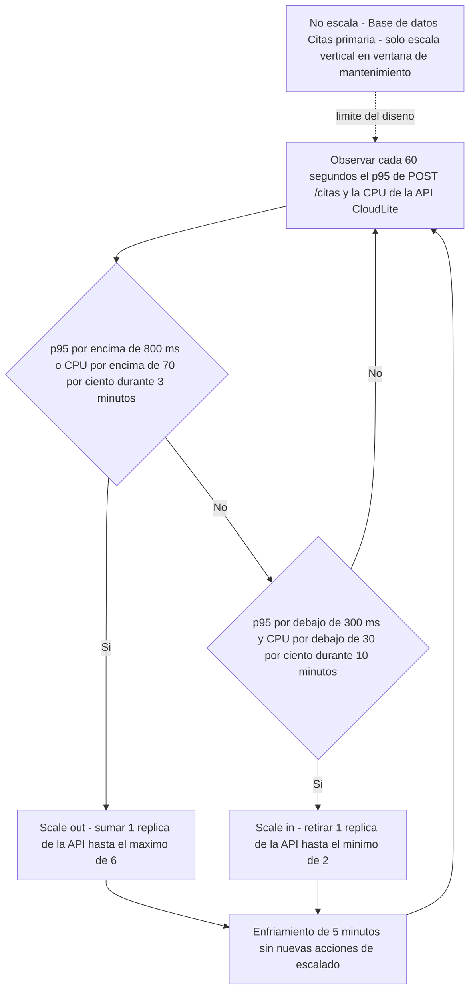

# Taller de la Clase 13 en ExamLab - configuracion

- **Curso:** Arquitectura de Sistemas Computacionales (FI303380)
- **Taller:** Taller Clase 13 en ExamLab - Politica de autoescalado de CloudLite
- **Preguntas:** 5 · **Total:** 100 puntos
- **Plataforma:** ExamLab (https://examlab.lovable.app/) · modulo Talleres
- **Hito del PI:** Documentar política de autoescalado conceptual de CloudLite
- **Entregable de la clase:** Sección Escalabilidad: triggers, límites, qué escala y qué no

> ExamLab no importa preguntas desde archivo: el alta se hace en la UI del
> docente (o con la pestana de IA). Este documento trae el texto exacto de cada
> campo para copiar y pegar, incluidos el SQL de partida y el codigo base.

**Que produce el estudiante:** El estudiante entrega la politica de autoescalado conceptual de CloudLite con disparadores numericos, minimos y maximos, tiempo de enfriamiento, los componentes que deliberadamente no escalan y el impacto en costos.

---

## Pregunta 1 - Respuesta escrita · 30 pts

**Tipo en la plataforma:** `abierta`

**Enunciado (campo Contenido):**

## Politica de autoescalado de CloudLite

Construya una tabla de **6 columnas** con encabezados exactos:

`Componente | Tipo de escala | Disparador de subida | Disparador de bajada | Minimo y maximo | Enfriamiento`

con **exactamente 5 filas**, una por componente de su C4Deployment: **Edge TLS**, **API CloudLite**, **Worker Notificaciones**, **Base de datos Citas**, **Cola Notificaciones**.

Reglas de verificacion:
- `Tipo de escala` usa **solo** estos rotulos: `horizontal`, `vertical`, `no escala`. **Al menos una fila debe ser `no escala`.**
- Cada disparador lleva **metrica + umbral numerico + ventana de tiempo**: `p95 de POST /citas por encima de 800 ms durante 3 minutos`, `longitud de la cola por encima de 500 mensajes durante 2 minutos`. Un disparador sin numero o sin ventana invalida la celda.
- `Minimo y maximo` con dos numeros concretos (`min 2 y max 6`). **Nada de sin limite.**
- `Enfriamiento` con minutos concretos y **coherente** con el disparador (no puede ser mas corto que la ventana de medicion).
- Las filas `no escala` llevan en los disparadores la frase `no aplica` y en `Minimo y maximo` la capacidad fija.

Cierre con **una linea**: cual componente escala primero cuando llega el pico y cual es el ultimo.

**Rubrica esperada (campo Rubrica):**

10 pts las 5 filas con los 5 componentes y los 6 campos. 8 pts que los disparadores tengan metrica umbral numerico y ventana en todas las filas que escalan. 6 pts los minimos y maximos con numeros concretos y sin infinitos. 4 pts el enfriamiento coherente con la ventana de medicion. 2 pts la linea de cierre. Cero en la fila cuyo disparador no tenga numero.

---

## Pregunta 2 - Diagrama (Mermaid) · 25 pts

**Tipo en la plataforma:** `diagrama`

**Enunciado (campo Contenido):**

## Maquina de decision del autoescalado

Escriba un `flowchart TD` que represente el ciclo de decision de su politica. Debe contener:

1. Un nodo de **observacion** con el **periodo de evaluacion** y las metricas observadas (`evaluar cada 60 segundos el p95 y la CPU de la API`).
2. Un **rombo de decision de subida** con **los umbrales exactos de su tabla**.
3. Un **rombo de decision de bajada** con sus umbrales.
4. Un nodo de **scale out** y un nodo de **scale in**, ambos con el **limite** correspondiente (`hasta el maximo de 6`, `hasta el minimo de 2`).
5. Un nodo de **enfriamiento** con los minutos, por el que pasan las dos acciones antes de volver a observar.
6. Un nodo aparte para **lo que no escala**, unido con **arista punteada** rotulada `limite del diseno`.

**Verificacion:** el ciclo debe cerrarse sobre el nodo de observacion (debe poder recorrerlo con el dedo y volver al inicio), y los numeros del diagrama deben ser identicos a los de la tabla de la pregunta 1.

**Consejo de sintaxis:** escriba los umbrales con palabras (`por encima de`, `por debajo de`) en lugar de los simbolos de mayor y menor.

**Diagrama de referencia (Mermaid):**

**Rubrica esperada (campo Rubrica):**

8 pts el nodo de observacion con periodo y metricas y los 2 rombos con umbrales numericos. 6 pts los nodos de scale out y scale in con su limite maximo y minimo. 5 pts el nodo de enfriamiento por el que pasan ambas acciones y el cierre del ciclo. 4 pts el nodo de lo que no escala con arista punteada. 2 pts que renderice sin error.

---

## Pregunta 3 - Respuesta escrita · 20 pts

**Tipo en la plataforma:** `abierta`

**Enunciado (campo Contenido):**

## Lo que NO escala y por que

Una politica honesta dice que **no** puede escalar. Escriba **exactamente 3 componentes o aspectos** de CloudLite que no escalan horizontalmente, cada uno con **4 lineas rotuladas**:

1. **Componente o aspecto**: nombre canonico de su paquete.
2. **Por que no escala horizontalmente**: razon **tecnica**, no falta de tiempo (`es la unica instancia que acepta escrituras y dos primarias generarian conflicto de version del cupo`).
3. **Que pasa si el pico lo desborda**: el sintoma que veria el usuario y en cual metrica de la Clase 8 aparece.
4. **Plan alterno**: que haria en su lugar (escala vertical en ventana de mantenimiento, replica de solo lectura, cola de amortiguacion, limite de peticiones por usuario), **ejecutable sin cloud de pago**.

Al menos uno de los 3 debe ser la **base de datos primaria de escrituras**, y al menos uno debe ser un aspecto **no de infraestructura** (por ejemplo el estado de sesion, un contador global, un limite de la API de correo externa).

**Rubrica esperada (campo Rubrica):**

9 pts los 3 componentes con las 4 lineas rotuladas. 5 pts que las razones sean tecnicas y no de falta de tiempo. 4 pts que uno sea la base de datos primaria y uno un aspecto no de infraestructura. 2 pts que los planes alternos sean ejecutables sin cloud de pago.

---

## Pregunta 4 - Respuesta escrita · 15 pts

**Tipo en la plataforma:** `abierta`

**Enunciado (campo Contenido):**

## Impacto del autoescalado en costos y sostenibilidad

Enlace esta politica con su seccion de costos de la Clase 10. Construya una tabla de **4 columnas** con encabezados exactos:

`Escenario | Replicas activas | Costo cualitativo B/M/A | Accion de sostenibilidad`

con **exactamente 3 filas**:

1. **Valle** (madrugada o fin de semana sin trafico).
2. **Dia normal**.
3. **Pico** del evento que definio en la Clase 12.

Reglas:
- `Replicas activas` debe respetar el minimo y el maximo de su tabla de la pregunta 1.
- `Costo cualitativo B/M/A` debe usar **los mismos niveles** que escribio en la seccion de costos de la Clase 10; si aqui cambia el nivel, explique en media linea por que.
- `Accion de sostenibilidad` es concreta y verificable (`bajar a 1 replica entre las 22:00 y las 06:00 y dejar registro en la bitacora`).

Cierre con **una frase**: cuanto del costo total del PI viene de capacidad que solo se usa en el pico.

**Rubrica esperada (campo Rubrica):**

6 pts las 3 filas con las 4 columnas y replicas dentro del rango declarado. 5 pts la coherencia de los niveles B/M/A con la seccion de costos de la Clase 10. 3 pts las acciones de sostenibilidad verificables. 1 pt la frase de cierre.

---

## Pregunta 5 - Seleccion multiple · 10 pts

**Tipo en la plataforma:** `cerrada_multi`

**Enunciado (campo Contenido):**

## Disparadores de autoescalado

Seleccione las **3 afirmaciones correctas**.

**Opciones:**

- [x] El p95 de POST /citas por encima de 800 ms sostenido 3 minutos es un disparador valido porque es medible y tiene ventana.
- [x] La longitud de la cola de notificaciones por encima de 500 mensajes es un disparador valido para el worker.
- [ ] Cuando el sistema se sienta lento es un disparador valido si el equipo lo revisa a diario.
- [x] Toda politica de autoescalado necesita un maximo de replicas para no escalar sin techo.
- [ ] Un enfriamiento de 10 segundos evita que el sistema suba y baje replicas continuamente.
- [ ] Escalar horizontalmente la base de datos primaria de escrituras es tan simple como sumar replicas.

**Rubrica esperada (campo Rubrica):**

4 pts por cada correcta marcada hasta un maximo de 10; se descuentan 4 pts por cada incorrecta marcada, sin bajar de cero.

---

## Al terminar de crearlo

- Verifique que la suma de puntos sea la esperada: **100**.
- Publique el taller y confirme la fecha limite (domingo 23:59 segun el Acuerdo).
- Las preguntas con SQL o codigo: ejecutelas una vez usted mismo antes de publicar,
  para confirmar que el SQL de partida corre y que el starter compila.
