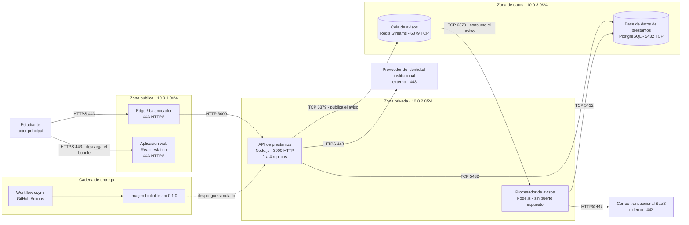
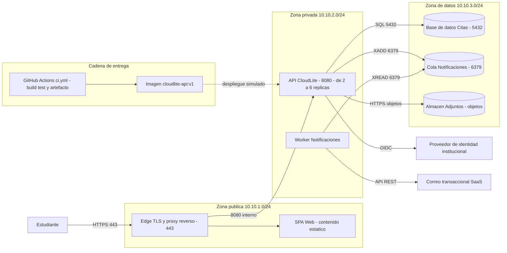

# Solucion del Taller Clase 15 - Entrega final y sustentacion (BiblioLite)

> **DOCUMENTO DOCENTE — PRIVADO.** No publicar en `Clases/` ni en ExamLab antes del cierre de la entrega.

**Resumen:** Taller de cierre de 100 puntos en cinco preguntas, de la sesion de sustentaciones del 16/11/2026. No agrega arquitectura nueva: la consolida y la defiende. Indice del paquete con las 8 filas verificadas desde otra maquina, la lamina unica de 11 nodos que se proyecta en los 60 segundos de apertura, el Q and A escrito con evidencia y trade-off en cada respuesta, la reflexion del trade-off mas dificil y los tiempos reales del pitch. La solucion asume el paquete que se fue construyendo desde la Clase 1: 7 filas en `completo` sobre 8, y la que queda `parcial` esta ahi a proposito para mostrar como se responde por un pendiente sin decir «no alcanzo el tiempo».

> **Sesion de cierre: lunes 16/11/2026, 10:00 a 12:00, virtual.** El taller es la **evidencia escrita** de la sustentacion, no un sustituto: se califica junto con lo que el estudiante defiende en vivo. Dos condiciones operativas que conviene anunciar en la Clase 13 y repetir por escrito: **el paquete se sube antes del turno** —quien lo suba durante la sesion pierde los 5 pts de la Parte A de la pregunta 5— y **los enlaces se abren desde una ventana privada**, porque el error mas comun de esta entrega no es un archivo que falta sino un Drive que pide permisos. Como en todo el curso, nada de esto requiere cloud de pago ni tarjeta: el paquete vive en un repositorio publico de GitHub y en capturas.

## Alineacion con el taller

- Taller del estudiante: `Clases/Clase 15 - Presentacion del proyecto y cierre/`
- Configuracion en la plataforma: `Kit docente/Clase 15/Taller en ExamLab - Clase 15 (configuracion).md`
- Hito del PI: Sustentar en vivo el PI CloudLite App y entregar el paquete final
- Entregable: Paquete final en ExamLab (módulo Proyectos) + pitch de 5–8 min sustentado hoy en clase + Q&A
- **Estas preguntas: 100 puntos** en 5 preguntas.

| # | Pregunta | Tipo | Puntos |
|---|---|---|---|
| 1 | Indice del paquete final | `abierta` | 25 |
| 2 | Lamina unica de arquitectura para la sustentacion | `diagrama` | 25 |
| 3 | Q and A escrito: las 3 preguntas que teme | `abierta` | 20 |
| 4 | Reflexion: el trade-off mas dificil | `abierta` | 15 |
| 5 | Evidencia del pitch y tiempos reales | `abierta` | 15 |

---

## Pregunta 1 · Indice del paquete final · 25 pts

### Respuesta esperada

| Entregable | Nombre del archivo | Ruta dentro del paquete o enlace | Estado |
|---|---|---|---|
| 1. Informe de arquitectura completo | `informe-pi-bibliolite.pdf` | `/informe/informe-pi-bibliolite.pdf` | completo |
| 2. Diagrama C4 Context y C4 Container | `c4-context.png`, `c4-context.mmd`, `c4-container.png`, `c4-container.mmd` | `/diagramas/` | completo |
| 3. Diagrama C4 Deployment | `c4-deployment.png`, `c4-deployment.mmd` | `/diagramas/` | completo |
| 4. Dockerfile y evidencia del lab de contenedores | `Dockerfile`, `clase03-docker-ps.png` | `/docker/Dockerfile` y `/capturas/clase03-docker-ps.png` | completo |
| 5. Workflow `ci.yml` y enlace al run verde | `ci.yml` | `/.github/workflows/ci.yml` y `https://github.com/USUARIO/bibliolite/actions/runs/ID` | **parcial** (el run verde ejecuta `lint` y `build`; falta la etapa de pruebas automatizadas, que quedo como B-01 del backlog de la Clase 11) |
| 6. Seccion de seguridad con tabla STRIDE y politica de secretos | `06-amenazas.md` | `/informe/06-amenazas.md` | completo |
| 7. Secciones de costos, sostenibilidad y escalabilidad | `10-costos-sostenibilidad.md`, `13-escalado.md` | `/informe/` | completo |
| 8. Presentacion de sustentacion | `pitch-bibliolite.pdf`, `guion-pitch.md` | `/pitch/` | completo |

**Linea de verificacion obligatoria, debajo de la tabla:**

> `verificado desde otra maquina el 15/11/2026`

**Linea de cierre:** 7 filas en `completo` sobre 8.

**Por que la verificacion desde otra maquina vale 6 de los 25 puntos.** Porque es el fallo que mas entregas ha hundido en este curso y no tiene nada que ver con arquitectura: el archivo existe, el estudiante lo ve, y el docente recibe «Solicitar acceso». El navegador propio lleva la sesion abierta y miente sistematicamente. La verificacion correcta son tres pasos: ventana privada, pegar el enlace, y confirmar que el PDF **se abre y se puede pasar de pagina** —no solo que carga la vista previa—. Si el paquete esta en GitHub el riesgo baja mucho, pero sigue existiendo con el repositorio privado y con los `.mmd` que solo renderizan si el visor los soporta.

**Por que los nombres no llevan espacios ni tildes.** No es una preferencia estetica: un espacio en un nombre de archivo rompe la URL (`Informe Final.pdf` viaja como `Informe%20Final.pdf` y se pega mal en la mitad de los clientes de correo), y una tilde puede cambiar de codificacion entre Windows y Linux y dejar el archivo inalcanzable desde el pipeline. Es la misma leccion de la Clase 11 sobre nombres canonicos, aplicada al sistema de archivos: el nombre en prosa puede tener tildes, el nombre del artefacto no.

**Por que hay una fila `parcial` y por que eso NO cuesta puntos.** El enunciado permite `parcial` y solo exige que diga **que falta** entre parentesis. Escribir 8 de 8 en `completo` cuando el `ci.yml` no corre pruebas es lo que si cuesta: es una afirmacion falsa sobre el propio trabajo, y el docente la comprueba abriendo el run en 20 segundos. La fila 5 declarada como parcial hace tres cosas a la vez: es honesta, se conecta con el backlog de la Clase 11 (B-01) y le da al estudiante la mejor respuesta posible en el Q and A de la pregunta 3 —«lo dejamos fuera a proposito porque...»—. Un pendiente declarado es un item de backlog; un pendiente escondido es un hallazgo.

**Sobre el orden de las 8 filas.** Es el orden del enunciado y no es arbitrario: reproduce el recorrido del semestre (informe, logica, despliegue, contenedor, pipeline, seguridad, costos, pitch) y es el mismo orden en que el jurado va a pedir las evidencias durante el Q and A. Un estudiante que reordena las filas «como le queda mejor» pierde 10 pts y, peor, pierde el mapa: en la sustentacion va a buscar el archivo mientras el cronometro corre.

### Como calificar

- **10 pts** las 8 filas **en el orden del enunciado** con las 4 columnas. 1.25 pts por fila. El orden se verifica de un vistazo y no admite reacomodo: es el orden en que se piden las evidencias.
- **6 pts** rutas o enlaces **reales** y nombres de archivo sin espacios ni tildes. Se toman dos enlaces al azar y se abren; si el nombre trae espacios se descuenta aunque el enlace funcione, porque el criterio es el nombre.
- **6 pts** la linea `verificado desde otra maquina el <fecha>` con fecha **anterior o igual** a la de entrega. Una fecha posterior al turno de sustentacion no vale: seria una verificacion que aun no ocurrio.
- **3 pts** el estado de cada fila, con el faltante entre parentesis en las parciales. Un `parcial` sin parentesis vale la mitad.
- **Cada archivo que no abra descuenta 3 pts**, tal como anuncia el enunciado, y el descuento se aplica sobre el total de la pregunta. Se verifica en ventana privada, no en la sesion del docente: si el docente tiene acceso porque el estudiante lo compartio con su correo, el archivo sigue estando mal publicado.
- Un `parcial` bien declarado **no descuenta**. Conviene decirlo en voz alta antes de la entrega: la honestidad no cuesta puntos aqui y ademas se paga en la pregunta 3.

### Errores frecuentes y que hacer

- **Enlaces que piden permisos.** El error numero uno de esta entrega, todos los semestres. La causa es siempre la misma: se verifico con la sesion propia abierta. Aplicar el descuento de 3 pts por archivo y dejar la razon escrita en la devolucion, porque es un habito profesional que hay que instalar.
- **8 de 8 en `completo` con un `ci.yml` que solo tiene un `echo`.** Es afirmacion falsa y se comprueba abriendo el run. Cuesta los 3 pts del estado y ademas envenena la pregunta 3, porque el estudiante ya no puede usar el pendiente como trade-off: acaba de declarar que no existe.
- **Rutas locales del computador** (`C:\Users\...\informe.pdf`). No es una ruta dentro del paquete: nadie mas puede abrirla. Se descuenta como enlace irreal.
- **Un solo enlace a la carpeta raiz para las 8 filas.** La columna pide la ruta **del entregable**; una carpeta con 40 archivos sueltos obliga al jurado a buscar. Es el mismo criterio de la Clase 11: el paquete se navega, no se explora.
- **Nombres con espacios y tildes** (`Diagrama Despliegue Final (versión 2).png`). Ademas del descuento, ese nombre delata que no hubo control de versiones: «version 2» dentro del nombre es lo que git hace por uno.
- **Linea de verificacion sin fecha** («verificado desde otra maquina»). Los 6 pts son de la linea **con fecha**: sin ella no se puede saber si la verificacion es de hoy o de hace tres semanas, cuando el paquete era otro.

---

## Pregunta 2 · Lamina unica de arquitectura para la sustentacion · 25 pts

### Respuesta esperada

**Conteo de nodos: 11 de los 14 permitidos.** Estudiante, edge, spa, api, worker, db, cola, wf, img, idp y correo. Los cuatro `subgraph` no son nodos, son las zonas. Sobran tres nodos de margen a proposito: es el espacio para que un dominio con una pieza mas —un almacen de objetos, un servicio de reportes— quepa sin rehacer la lamina.

**Los seis requisitos, senalados uno por uno.** (1) Las tres zonas llevan **subred**, que es lo nuevo respecto de la Clase 7: alli las zonas se describieron por su alcance («solo alcanzable desde el edge») y hoy se les pone el CIDR, porque en una lamina de sustentacion no hay espacio para la frase. (2) Los 5 contenedores canonicos mas el edge, cada uno con puerto. (3) La API con `1 a 4 replicas`, el rango de la politica de la Clase 13. (4) La cadena de entrega en su subgrafo, unida por **arista punteada** rotulada `despliegue simulado`. (5) Los dos sistemas externos, fuera de las zonas. (6) El estudiante entrando por HTTPS 443.

**El detalle que va a preguntar el jurado: «¿por que el procesador de avisos no tiene puerto?».** Porque no atiende peticiones: **el trabajo lo va a buscar a la cola**. Un contenedor sin puerto expuesto es un contenedor al que nadie puede llegar desde fuera, y esa es su mejor propiedad de seguridad, no una carencia. Decirlo asi —«sin puerto expuesto»— en la etiqueta es mas fuerte que dejarla en blanco: la ausencia deliberada se escribe.

**El otro detalle fino: el `worker` esta en la zona privada y sale a internet.** No es contradiccion, y conviene tener la respuesta lista: la zona privada **no acepta trafico entrante** de internet pero **si tiene salida** (por NAT), y por eso el worker puede llamar al correo transaccional. La que no tiene salida es la **zona de datos**: la base y la cola no pueden iniciar conexiones hacia afuera, que es exactamente el control que evita la exfiltracion de la Clase 6. Entrante y saliente son dos reglas distintas y es el error conceptual mas comun sobre subredes.

**Por que el rango dice 1 a 4 y no 2 a 6.** El enunciado pone `2 a 6` como ejemplo; lo que se califica es que el rango sea **el de la politica propia** de la Clase 13. En BiblioLite el maximo es 4 porque cada replica abre 5 conexiones y el motor acepta 20, y el minimo es 1 como deuda aceptada por horas encendidas. Copiar el `2 a 6` del enunciado teniendo otra politica es la incoherencia que esta pregunta busca.

**Como se proyecta esta lamina en 60 segundos.** Se recorre el camino del usuario con el cursor, en este orden y sin desviarse: estudiante -> edge -> API -> base de datos, y despues «y cuando hay que avisar, la API publica en la cola y el procesador manda el correo». Doce segundos por salto. La cadena de entrega y los externos **no se explican** salvo que los pregunten: estan ahi para que se vean, no para narrarlos.

### Respuesta esperada (dominio de la solucion)

### Modelo de referencia del kit docente (el estudiante NO lo ve)

Vive en `Taller en ExamLab - Clase 15 (configuracion).md` y no se pega en el enunciado; esta resuelto sobre el dominio **AgendaU**. Sirve para comparar estructura y conteos —cuantas cajas, cuales son almacenes, si toda flecha lleva protocolo y formato—, **nunca** para calificar contenido ni nombres:

### Como calificar

- **10 pts** las 3 zonas **con su subred** y los 6 elementos —5 contenedores canonicos mas el edge— en la zona correcta y **con puerto** en la etiqueta. Una base de datos en la zona publica cuesta la mitad de estos puntos: es un error de seguridad, no de dibujo.
- **6 pts** el rango de replicas de la API **coherente con la politica de la Clase 13** (3 pts) y la cadena de entrega unida por **arista punteada** rotulada `despliegue simulado` (3 pts). Arista solida hacia la API significa que el pipeline despliega en produccion, que en este curso no ocurre: no suma.
- **5 pts** los 2 sistemas externos **fuera** de los subgrafos y el actor entrando por **443**. Un sistema externo dentro de una zona propia es el error que borra la frontera de confianza de la Clase 6.
- **4 pts** legibilidad: **maximo 14 nodos** —se cuentan, no se estiman— y nombres identicos a la tabla de reconciliacion de la Clase 11. 15 nodos es cero en este renglon aunque el diagrama sea bonito: el criterio es que quepa en una pantalla.
- Prueba practica de la que habla el enunciado, y vale la pena hacerla en voz alta con cada estudiante: **seguir el camino del usuario hasta la base de datos con el dedo, sin abrir el informe**. Si el docente se pierde, el jurado tambien.

### Errores frecuentes y que hacer

- **Volver a dibujar el C4 Container.** Es la lamina del semestre, no un cuarto diagrama: si no tiene zonas, puertos ni cadena de entrega, es el diagrama de la Clase 4 con otro titulo y pierde la mayor parte de los puntos.
- **Mas de 14 nodos** por meter cada endpoint, cada tabla y cada libreria. Es el error de criterio de esta pregunta: la lamina de sustentacion se optimiza para 60 segundos de atencion ajena, no para demostrar cuanto se hizo.
- **Zonas sin subred**, solo con el nombre. La rubrica pide las dos cosas; y sin CIDR no se puede argumentar por que la base no es alcanzable desde internet.
- **Copiar el `2 a 6 replicas` del enunciado** cuando la politica propia dice otra cosa. Es la incoherencia mas facil de detectar del taller: se abre la pregunta 1 de la Clase 13 y se compara.
- **Sistemas externos dentro de la zona publica.** «Publica» no significa «de otros»: significa alcanzable desde internet **y bajo mi responsabilidad**. El proveedor de identidad no esta bajo su responsabilidad y por eso va fuera.
- **Nodos que el paquete no tiene** —un almacen de objetos, una cache— puestos para que la lamina «se vea completa». En BiblioLite se decidio explicitamente en la Clase 7 que no habria almacen de objetos para datos del dominio: dibujarlo hoy contradice el propio informe y es el tipo de incoherencia que el jurado encuentra en la primera pregunta.

---

## Pregunta 3 · Q and A escrito: las 3 preguntas que teme · 20 pts

### Respuesta esperada

**Pregunta 1 — Decision de arquitectura: «¿por que cinco contenedores y no tres microservicios, o uno solo?»**

> Porque `ADR-001` decidio monolito modular sobre IaaS: un repositorio, un build y un pipeline, con la logica separada por modulos y no por procesos.
> Los cinco elementos no son cinco servicios: son un frontend, **una misma imagen corriendo dos veces** (`bibliolite-api:0.1.0` como API y como procesador de avisos), la base y la cola.
> La cola y el worker se agregaron en la Clase 11 por el riesgo que la Clase 4 dejo escrito —«si el correo esta caido el aviso se pierde»—, no por moda arquitectonica.
> **Trade-off aceptado:** los dos procesos comparten build y dependencias, asi que un `npm install` roto detiene las dos piezas y no puedo actualizar una sin la otra. Se acepta a cambio de un solo pipeline mantenible por una persona en trece semanas.

**Pregunta 2 — Seguridad: «¿como protege el activo mas sensible?»**

> El activo mas sensible no son las credenciales: es el **historial de prestamos**, que revela que lee cada estudiante. Esta en la fila 3 de la `tabla STRIDE` como divulgacion de informacion.
> Tres controles, todos verificables en el paquete: la base vive en la zona de datos **sin salida a internet** (`c4-deployment.mmd`), el token se valida en cada peticion contra el proveedor institucional, y ningun secreto esta en el repositorio: van como secretos del workflow (`06-amenazas.md`, seccion de politica de secretos).
> **Trade-off aceptado:** **no** hay cifrado en reposo a nivel de columna. Un volcado del volumen expondria el historial en claro. Se acepta porque el cifrado por columna habria obligado a descifrar en la aplicacion para cualquier consulta por rango de fechas, y el proyecto no tiene la infra de gestion de llaves que eso exige; queda escrito como riesgo residual, no como olvido.

**Pregunta 3 — Escala o rendimiento: «¿que pasa el dia del pico y que no escala?»**

> El pico esta medido, no imaginado: 15 peticiones por segundo durante 40 minutos (21/09/2026, 11:40 a 12:20), del escenario de carga de la Clase 12.
> La reserva completa cuesta **585 ms** contra un presupuesto de **800 ms** (`diagrama de secuencia con el presupuesto de 800 ms`), con el commit de la base como cuello: 330 de esos 585 ms.
> Lo que **no** escala es la base primaria de escrituras, y ahi esta el numero que importa: acepta 20 conexiones, cada replica abre 5, luego el maximo de la API son **4 replicas** (`politica de escalado, fila API`). El techo de la API lo fija la base, no la API.
> **Trade-off aceptado:** el minimo son **1 replica**, no 2, asi que un reinicio son unos 20 segundos de caida. Se acepta para bajar de 720 a 480 horas encendidas al mes, que era el apalancamiento declarado en la seccion de costos.

### Como calificar

- **9 pts** las 3 preguntas de los 3 tipos exigidos, **en ese orden**, con respuesta de **maximo 4 lineas**. 3 pts cada una. Una respuesta de nueve lineas vale la mitad: el limite es parte del ejercicio, porque en la sustentacion se responde en 30 segundos.
- **6 pts** que cada respuesta **cite una evidencia concreta** del paquete, con nombre de artefacto y ubicacion (`ADR-001`, `tabla STRIDE fila 3`, `politica de escalado fila API`). 2 pts cada una. «Como se explico en el informe» no es una cita.
- **5 pts** que cada una nombre **el trade-off aceptado**, no solo la virtud. Aproximadamente 1.7 pts cada una. La prueba es sencilla: si la respuesta solo dice cosas buenas del diseno, no hay trade-off; toda decision de arquitectura le quita algo a alguien.
- **Cero en la respuesta que se limite a decir que no alcanzo el tiempo.** Es explicito en la rubrica. Pero cuidado con el matiz: «lo dejamos fuera a proposito porque el pipeline con pruebas exigia... y ganamos...» **si** puntua completo. Lo que vale cero es la queja, no el pendiente.
- Se valora que la evidencia citada **exista de verdad**: se toma una de las tres al azar y se abre. Una cita a un `ADR-002` que no esta en el paquete es peor que no citar, y ademas es exactamente lo que el jurado hace en vivo.

### Errores frecuentes y que hacer

- **«No lo alcanzamos a hacer».** Cero en esa respuesta, por rubrica. La reescritura correcta se le puede dictar al estudiante: «lo dejamos fuera a proposito porque X, y con eso el proyecto gano Y». Hay que ensenar la conversion, porque es una habilidad profesional real, no una excusa elegante.
- **Tres respuestas sin trade-off**, escritas como folleto de ventas («elegimos esto porque es escalable, seguro y mantenible»). Cuesta los 5 pts y es la senal mas clara de que el estudiante no entendio de que se trata la materia.
- **Citar el informe en bloque** («esta en el informe»). No es evidencia localizable. La cita tiene que decir **cual** artefacto y **cual** parte, porque en la sustentacion hay que abrirla en cinco segundos.
- **Elegir el activo sensible equivocado**: casi todos responden «las contrasenas», que no estan en la base porque la identidad la maneja el proveedor institucional. El activo es el dato del dominio —aqui el historial de lectura—, y darse cuenta de eso es la mitad de la pregunta.
- **Preguntas de mentira**, hechas para tener respuesta facil («¿usaron Docker?»). El enunciado pide las 3 que **teme**. Si las tres son comodas, la pregunta no se hizo: devolver pidiendo la que le da miedo.
- **Respuesta a la de escala sin un solo numero.** «Escalamos horizontalmente» no responde nada. Los numeros ya existen desde la Clase 12 y la 13; no citarlos aqui es desperdiciar dos semanas de trabajo.

---

## Pregunta 4 · Reflexion: el trade-off mas dificil · 15 pts

### Respuesta esperada

**1. La decision.** El trade-off mas dificil del semestre fue mantener BiblioLite como monolito modular con dos procesos en vez de separar las notificaciones en un servicio con su propio repositorio y su propio pipeline.

**2. La alternativa que descarto.** La alternativa era un microservicio de notificaciones independiente, con su repositorio, su `ci.yml` y su despliegue propio. La defendia yo mismo en la Clase 4, cuando la palabra «microservicios» todavia sonaba a la respuesta correcta a cualquier pregunta. Lo que me hizo cambiar no fue un argumento teorico sino la aritmetica de la Clase 11: trece semanas, una persona, y ya iba retrasado en el pipeline que si tenia.

**3. Que sacrifico.** Aislamiento de fallos y de dependencias. Los dos procesos comparten imagen, asi que un cambio de version de una libreria toca las dos piezas y un build roto las detiene juntas. Tambien sacrifique la posibilidad de que otra persona trabajara en las notificaciones sin tocar mi repositorio. Lo que gane fue concreto: un solo pipeline que efectivamente quedo verde, y tiempo para escribir la seguridad y el escalado, que de otro modo habrian quedado en el backlog.

**4. Como se ve hoy en el paquete.** Quedo escrita en `ADR-001` (`/adr/ADR-001-modelo-de-servicio.md`), en la seccion de consecuencias, con la frase que resume la decision: «un repositorio, un build, un pipeline, dos procesos». Se ve tambien en el `Dockerfile`, que produce **una** imagen, y en el C4 Deployment, donde el `Procesador de avisos` aparece como la misma imagen con otro comando de arranque.

**5. Que haria distinto.** Escribiria las pruebas del pipeline antes de agregar la cola. Hoy tengo una cola funcionando y un `ci.yml` sin etapa de pruebas, y ese es el unico `parcial` del indice: si volviera a empezar manana, la etapa de pruebas seria la Clase 8 y la cola la 11, en ese orden.

### Como calificar

- **8 pts** los 5 bloques **rotulados** y desarrollados, entre 200 y 300 palabras. 1.6 pts por bloque. Se cuentan las palabras: 150 son un resumen y 400 son un desahogo. La version de arriba tiene unas 290.
- **4 pts** que el sacrificio y la alternativa descartada sean **concretos**. La prueba: ¿se puede discutir con argumentos? «Sacrifique la simplicidad» no se puede discutir; «sacrifique el aislamiento de dependencias: un build roto detiene las dos piezas» si.
- **3 pts** que el bloque 4 cite el **artefacto real** con su ruta. Se abre y se busca la frase. Si el ADR no menciona la decision, el bloque 4 no cumple, aunque el ADR exista.
- Se valora que el bloque 2 diga **quien** defendia la alternativa. La respuesta honesta suele ser «yo mismo al principio», y admitir eso por escrito es mas valioso academicamente que cualquier decision brillante: es la evidencia de que hubo aprendizaje y no solo ejecucion.
- Es una reflexion **tecnica**. Si el texto agradece al docente y no discute una decision, se devuelve sin nota parcial y se pide reescribir: el ejercicio no se hizo.

### Errores frecuentes y que hacer

- **La carta de agradecimiento.** «Aprendi mucho, el curso fue muy completo, gracias por la paciencia». No responde ninguno de los 5 bloques. Devolver con una pregunta concreta: ¿cual decision te costo mas trabajo tomar?
- **Trade-off que no es un trade-off** («decidi usar Docker»). Si no hubo algo que se perdio, no hubo trade-off: hubo una eleccion obvia. Pedir la decision en la que las dos opciones tenian defensa.
- **Alternativa descartada generica** («la otra opcion era hacerlo mal»). No es una alternativa, es un espantapajaros. La alternativa descartada tiene que ser la que alguien razonable defenderia.
- **Bloque 4 sin artefacto** («quedo en el informe»). Cuesta los 3 pts. Es el bloque mas facil de la pregunta y el que mas se pierde por descuido: solo hay que copiar una ruta.
- **Fuera del rango de palabras.** 120 palabras es no haber hecho el ejercicio; 500 es no haber decidido que importa. Ambos casos descuentan sobre los 8 pts del primer renglon.
- **«Que haria distinto: nada, todo salio bien».** Con un `parcial` en el indice y un cuello de botella identificado, esa frase se contradice con el propio paquete. Devolver senalando la contradiccion, que es la mejor ensenanza posible de la pregunta.

---

## Pregunta 5 · Evidencia del pitch y tiempos reales · 15 pts

### Respuesta esperada

| Seccion | Tiempo real | Quien hablo | Evidencia mostrada |
|---|---|---|---|
| 1. Problema y dominio | 1:05 | Autor del paquete | Ficha de dominio (`/informe/01-ficha-dominio.md`): las 4 capacidades y las 3 cosas fuera de alcance |
| 2. Arquitectura logica | 1:40 | Autor del paquete | Lamina unica de la pregunta 2, recorriendo estudiante -> edge -> API -> base de datos |
| 3. Contenedor y pipeline | 1:12 | Autor del paquete | `Dockerfile` en pantalla y el run verde de `/.github/workflows/ci.yml` |
| 4. Seguridad | 1:08 | Autor del paquete | Fila 3 de la tabla STRIDE (`/informe/06-amenazas.md`) y la politica de secretos |
| 5. Costos y escalabilidad | 1:20 | Autor del paquete | Tabla de costos B/M/A y la fila API de la politica de escalado (`/informe/13-escalado.md`) |
| 6. Cierre y preguntas | 1:01 | Autor del paquete | El unico `parcial` del indice, convertido en item de backlog con fecha |

**Parte A.**

> Turno de sustentacion: **lunes 16/11/2026, 10:40 a 10:50** (sesion de cierre del curso, 10:00 a 12:00, grupo 6303C, virtual).
> `paquete subido el 15/11/2026, verificado en ventana privada`

**Parte B — total real: 7:26.** Suma de la tabla (1:05 + 1:40 + 1:12 + 1:08 + 1:20 + 1:01) y **queda dentro de la ventana de 5:00 a 8:00**, asi que no hace falta la linea de recorte. Vale la pena anotarlo igual, porque es lo que se aprende de cronometrar: la unica seccion que se paso del guion de la Clase 12 fue **arquitectura logica**, 1:40 contra 1:30 planeados, y se sabe exactamente por que —se nombraron los cinco contenedores uno por uno en vez de recorrer el camino del usuario sobre la lamina—. Si el turno hubiera sido de 6 minutos, ese es el recorte: 20 segundos en la seccion 2 y 15 en la 5, sin tocar seguridad.

**Parte C — autoevaluacion.**

> **4 de 5.** El hecho concreto: los 8 entregables del indice existen y abren desde otra maquina, y las tres decisiones principales estan escritas en ADR con su alternativa descartada. La nota no es 5 por un hecho igual de concreto: el `ci.yml` corre `lint` y `build` pero no tiene etapa de pruebas, que es el unico `parcial` del paquete y estaba planeado desde la Clase 8.

**Por que 7:26 y no 7:00 exactos, y por que eso es una buena senal.** Los ensayos de la Clase 12 dieron 9:12, 7:35 y 6:58. El tiempo real quedo entre el segundo y el tercer ensayo, que es lo normal: en vivo se habla un poco mas despacio que ensayando solo. Un estudiante que reporte exactamente el mismo tiempo de su guion probablemente no cronometro; uno que reporte 4:10 no dio el pitch, lo leyo.

**Por que la columna «Quien hablo» existe aunque el trabajo sea individual.** Porque la tabla es la misma para equipos autorizados y para trabajo individual, y porque en la sustentacion en vivo el docente compara: si en la tabla figuran dos personas y una no dijo una palabra, esa fila es una afirmacion falsa. En trabajo individual se escribe «Autor del paquete» —no el nombre propio— y con eso basta.

### Como calificar

- **5 pts** la fecha y hora del **turno** —no la fecha de la clase— con la confirmacion `paquete subido el <fecha>, verificado en ventana privada`, y con la fecha de subida **anterior** al turno. Si el paquete se subio durante la sesion, estos 5 pts no se dan: es la unica regla dura de la entrega y hay que anunciarla antes.
- **6 pts** la tabla de **6 filas** —las mismas 6 secciones del guion de la Clase 12, en el mismo orden— con tiempo real, quien hablo y evidencia mostrada. 1 pt por fila. Una fila sin evidencia concreta vale la mitad.
- **3 pts** el total en minutos y segundos **entre 5:00 y 8:00**, o la linea de recorte si se paso. La suma se verifica: es la aritmetica mas facil de revisar del taller y falla mas de lo que deberia.
- **1 pt** la autoevaluacion de 1 a 5 con **hecho concreto**. «Me esforce mucho» no es un hecho; «los 8 entregables abren desde otra maquina» si. Es 1 punto, pero conviene leerlo con atencion: una autoevaluacion de 5 en un paquete con tres `parcial` dice mas del estudiante que toda la reflexion de la pregunta 4.
- Se contrasta con lo que ocurrio en vivo. Los tiempos declarados y las evidencias mostradas deben coincidir con lo que el docente vio: esta pregunta es la unica del curso que se califica con dos fuentes.

### Errores frecuentes y que hacer

- **Confundir la fecha de la clase con la del turno.** El turno es una franja de 10 minutos dentro de la sesion; escribir «16/11/2026» sin hora no cumple y cuesta parte de los 5 pts.
- **Paquete subido el mismo dia, minutos antes del turno o durante la sesion.** Es exactamente lo que la Parte A esta disenada para desincentivar. Se detecta con la fecha del commit o del archivo, no con lo que diga la linea.
- **Tiempos «planeados» disfrazados de reales:** seis filas de 1:10 exactos que suman 7:00 redondos. Nadie habla asi. Se detecta por la sospechosa regularidad y significa que no hubo cronometro; devolver pidiendo el ensayo con el celular en la mano.
- **Total fuera de la ventana sin linea de recorte.** Si el pitch dio 9:40 y no hay linea de que se recortaria, se pierden los 3 pts. La linea de recorte salva la pregunta: pasarse no es el problema, no saber que sobra si.
- **Columna de evidencia vacia o generica** («las diapositivas»). La evidencia es el artefacto concreto que estuvo en pantalla, con su ruta si la tiene. Es lo que permite auditar la sustentacion despues.
- **Autoevaluacion de 5 sin hecho, o de 3 por modestia.** Las dos son igualmente inutiles. Lo que se pide es un hecho verificable que sostenga el numero, en cualquier direccion.

---

## Lo que van a preguntar (respuestas listas)

Estas son las dudas que aparecen todos los semestres. Tenerlas resueltas por escrito es lo que evita responder la misma cosa quince veces durante el taller.

**¿Puedo poner `parcial` en varias filas o me castiga?**

Puede, y no castiga: el `parcial` bien declarado —con el faltante entre parentesis— no descuenta un solo punto. Lo que descuenta es un `completo` que no lo es, porque eso se comprueba abriendo el archivo. Y hay un beneficio adicional: cada `parcial` honesto es material para la pregunta 3, donde un pendiente convertido en decision puntua completo.

**Mis enlaces funcionan perfecto. ¿Igual tengo que hacer la verificacion?**

Si, y son 6 de los 25 puntos de la pregunta 1. «Funcionan perfecto» casi siempre significa «funcionan con mi sesion abierta». La verificacion son tres pasos y dos minutos: ventana privada, pegar el enlace, pasar de pagina en el PDF. El error de permisos es el que mas entregas ha hundido en este curso y es el mas facil de evitar.

**¿La lamina unica puede ser el C4 Container que ya tengo?**

No, y es la trampa mas comun de la pregunta 2. La lamina de sustentacion tiene cosas que el C4 Container no tiene: zonas con subred, puertos, el rango de replicas y la cadena de entrega. Es una consolidacion del semestre en una sola pantalla, no un diagrama reciclado.

**El enunciado dice `2 a 6 replicas` pero mi politica dice otro rango. ¿Cual pongo?**

El suyo, siempre. El `2 a 6` es un ejemplo de formato. Lo que se califica es la coherencia con la politica de la Clase 13, y copiar el numero del enunciado teniendo otro en su tabla es justo la incoherencia que la pregunta busca. En BiblioLite el rango es `1 a 4` y hay una razon tecnica detras: 4 replicas por 5 conexiones son las 20 que acepta el motor.

**En la pregunta 3, ¿que hago si de verdad no alcance a hacer algo?**

Convertirlo en decision, que es lo que el enunciado pide literalmente: «lo dejamos fuera a proposito porque...» y decir que gano el proyecto con eso. La version que vale cero es «no alcanzamos»; la version que vale todos los puntos es «el pipeline con pruebas exigia escribir la suite y preferi cerrar seguridad y escalado, que pesan mas en la rubrica; queda como B-01 con fecha». Es la misma informacion, dicha como profesional.

**¿Cual es el activo mas sensible de mi dominio? Puse las contrasenas.**

Casi seguro que no son las contrasenas: si la identidad la maneja un proveedor institucional, su sistema no las guarda. El activo sensible es el **dato del dominio** que revela algo de una persona: en una biblioteca, el historial de lectura; en una veterinaria, la historia clinica; en un sistema de turnos, con quien se cito el paciente. Darse cuenta de eso es la mitad de la respuesta.

**Cronometre y me dio 9:40. ¿Pierdo puntos?**

Solo si no escribe que recortaria. La ventana es de 5:00 a 8:00 y pasarse es normal en el primer intento —los ensayos de la Clase 12 empezaron en 9:12—; lo que se califica es que sepa **que sobra**. Una linea concreta («20 segundos en arquitectura logica y 15 en costos, sin tocar seguridad») salva los 3 pts y ademas es lo que hay que hacer si el turno se acorta en vivo.

**Trabaje solo. ¿Que pongo en la columna «Quien hablo»?**

«Autor del paquete» en las seis filas, sin el nombre propio. La columna existe porque la tabla sirve tambien para los equipos autorizados, y ahi si se compara con lo que el docente vio en vivo: una fila que atribuya la explicacion a alguien que no hablo es una afirmacion falsa. En trabajo individual la columna es un formalismo, y esta bien que lo sea.

---

## Cierre de la clase

El curso cierra sin agregar arquitectura: hoy solo se defiende la que ya existe. Lo que queda en las manos del estudiante es un paquete indexado y verificado desde otra maquina, una lamina de 11 nodos que explica el sistema en 60 segundos, tres respuestas con evidencia y trade-off, y un pitch de 7:26 cronometrado de verdad. Y queda algo que no esta en la rubrica y es lo que se lleva al trabajo: la capacidad de decir «esto lo dejamos fuera a proposito porque...» en vez de «no alcanzamos». Todas las decisiones de BiblioLite —el modelo de servicio, el monolito modular, las cinco piezas, el minimo de una replica, el ci.yml sin pruebas— estan escritas con su alternativa descartada y con lo que costaron. Eso es arquitectura de software: no la lista de tecnologias, sino el registro de por que se decidio asi y que se acepto perder.

---

## Politica de entrega

La entrega que se califica es la respuesta dentro de ExamLab (https://uniaj.examlab.workers.dev/). El documento en Word o Google Docs es opcional y solo sirve para que el estudiante conserve sus respuestas. Gratis + navegador; sin cuentas cloud de pago ni tarjeta.
