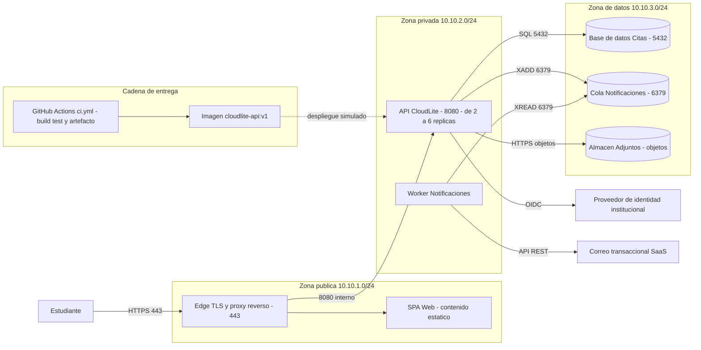

# Taller de la Clase 15 en ExamLab - configuracion

- **Curso:** Arquitectura de Sistemas Computacionales (FI303380)
- **Taller:** Taller Clase 15 en ExamLab - Entrega final y sustentacion de CloudLite
- **Preguntas:** 5 · **Total:** 100 puntos
- **Plataforma:** ExamLab (https://examlab.lovable.app/) · modulo Talleres
- **Hito del PI:** Sustentación / entrega final del PI CloudLite App
- **Entregable de la clase:** Paquete final + presentación 5–8 min (entrega en ExamLab · módulo Proyectos)

> ExamLab no importa preguntas desde archivo: el alta se hace en la UI del
> docente (o con la pestana de IA). Este documento trae el texto exacto de cada
> campo para copiar y pegar, incluidos el SQL de partida y el codigo base.

**Que produce el estudiante:** El estudiante entrega el paquete final de CloudLite indexado y verificado, la lamina unica de arquitectura que proyecta en la sustentacion, el Q and A escrito, los tiempos reales del pitch y la reflexion del trade-off mas difícil.

---

## Pregunta 1 - Respuesta escrita · 25 pts

**Tipo en la plataforma:** `abierta`

**Enunciado (campo Contenido):**

## Indice del paquete final

Construya una tabla de **4 columnas** con encabezados exactos:

`Entregable | Nombre del archivo | Ruta dentro del paquete o enlace | Estado`

con **exactamente 8 filas**, en este orden:

1. Informe de arquitectura completo (PDF o DOCX).
2. Diagrama C4 Context y C4 Container.
3. Diagrama C4 Deployment.
4. Dockerfile y evidencia del lab de contenedores.
5. Workflow `ci.yml` y enlace al run verde.
6. Seccion de seguridad con tabla STRIDE y politica de secretos.
7. Secciones de costos, sostenibilidad y escalabilidad.
8. Presentacion de sustentacion (diapositivas o guion) y enlace al video si aplica.

Reglas de verificacion:
- `Estado` usa **solo** `completo` o `parcial`; si es `parcial`, agregue entre parentesis **que falta**.
- Los nombres de archivo **no llevan espacios ni tildes** (use guiones).
- **Verificacion obligatoria antes de enviar:** abra los 8 archivos **desde otra maquina o desde una ventana privada del navegador** y confirme que ninguno pide permisos; escriba debajo de la tabla la linea `verificado desde otra maquina el <fecha>`.

Cierre con **una linea**: cuantas filas quedaron en `completo` sobre 8.

**Rubrica esperada (campo Rubrica):**

10 pts las 8 filas en el orden pedido con las 4 columnas. 6 pts las rutas o enlaces reales y nombres de archivo sin espacios ni tildes. 6 pts la linea de verificacion desde otra maquina. 3 pts el estado de cada fila con el faltante entre parentesis en las parciales. Cada archivo que no abra descuenta 3 pts.

---

## Pregunta 2 - Diagrama (Mermaid) · 25 pts

**Tipo en la plataforma:** `diagrama`

**Enunciado (campo Contenido):**

## Lamina unica de arquitectura para la sustentacion

Esta es **la lamina que va a proyectar** cuando le pidan explicar CloudLite en 60 segundos. Escriba un `flowchart LR` que consolide todo el semestre en un solo diagrama legible:

1. **3 subgrafos de zona** con su subred: `Zona publica`, `Zona privada`, `Zona de datos`.
2. Los **5 contenedores canonicos** mas el **edge**, cada uno en su zona, con **el puerto** en la etiqueta.
3. La **API con su rango de replicas** de la Clase 13 (`2 a 6 replicas`).
4. Un **subgrafo de cadena de entrega** con el workflow y la imagen etiquetada, unido a la API por una **arista punteada** rotulada `despliegue simulado`.
5. Los **2 sistemas externos** (identidad y correo) fuera de las zonas.
6. El **actor principal** entrando por HTTPS 443 al edge.

Reglas de verificacion:
- Todos los nombres deben ser **los canonicos** de su tabla de reconciliacion de la Clase 11.
- Debe entenderse **sin leer el informe**: si un jurado no puede seguir el camino del usuario hasta la base de datos, simplifique.
- Debe caber en una pantalla: **maximo 14 nodos** contando los de los subgrafos.

**Diagrama de referencia (Mermaid):**

**Rubrica esperada (campo Rubrica):**

10 pts las 3 zonas con sus subredes y los 6 elementos ubicados correctamente con puerto. 6 pts el rango de replicas de la API y la cadena de entrega con arista punteada de despliegue simulado. 5 pts los 2 sistemas externos y el actor entrando por 443. 4 pts legibilidad: maximo 14 nodos y nombres canonicos coherentes con el resto del paquete.

---

## Pregunta 3 - Respuesta escrita · 20 pts

**Tipo en la plataforma:** `abierta`

**Enunciado (campo Contenido):**

## Q and A escrito: las 3 preguntas que teme

Escriba **exactamente 3 preguntas** que un jurado podria hacerle y respondalas usted mismo. Una de cada tipo, en este orden:

1. **Decision de arquitectura**: por que eligio el modelo de servicio o por que 5 contenedores y no otro numero.
2. **Seguridad**: como protege el activo mas sensible de su dominio.
3. **Escala o rendimiento**: que pasa el dia del pico y que no escala.

Cada respuesta:
- **Maximo 4 lineas.**
- Debe **citar la evidencia** del paquete que la respalda (`ADR-001`, `tabla STRIDE fila 3`, `politica de escalado fila API`, `diagrama de secuencia con el presupuesto de 800 ms`).
- Debe nombrar **el trade-off aceptado**, no solo la virtud.

**Prohibido** responder `no lo alcanzamos a hacer` sin convertirlo en una decision: si algo quedo fuera, escriba `lo dejamos fuera a proposito porque ...` y diga que gano el proyecto con eso.

**Rubrica esperada (campo Rubrica):**

9 pts las 3 preguntas de los 3 tipos exigidos con respuesta de maximo 4 lineas. 6 pts que cada respuesta cite una evidencia concreta del paquete. 5 pts que cada una nombre el trade-off aceptado. Cero en la respuesta que se limite a decir que no alcanzo el tiempo.

---

## Pregunta 4 - Respuesta escrita · 15 pts

**Tipo en la plataforma:** `abierta`

**Enunciado (campo Contenido):**

## Reflexion: el trade-off mas dificil

Escriba media pagina (entre 200 y 300 palabras) con **estos 5 bloques rotulados**:

1. **La decision**: cual fue el trade-off mas dificil del semestre, en una frase.
2. **La alternativa que descarto**: que era y quien del equipo la defendia.
3. **Que sacrifico**: lo concreto que se perdio al decidir asi (velocidad, simplicidad, seguridad, costo, aprendizaje).
4. **Como se ve hoy en el paquete**: en cual artefacto quedo escrita esa decision (ADR, diagrama, seccion del informe).
5. **Que haria distinto**: una accion concreta si volviera a empezar CloudLite manana.

Es una reflexion tecnica, no una carta de agradecimiento: cada bloque debe poder discutirse con argumentos.

**Rubrica esperada (campo Rubrica):**

8 pts los 5 bloques rotulados y desarrollados dentro de las 200 a 300 palabras. 4 pts que el sacrificio y la alternativa descartada sean concretos y no genericos. 3 pts que el bloque 4 cite el artefacto real donde quedo la decision.

---

## Pregunta 5 - Respuesta escrita · 15 pts

**Tipo en la plataforma:** `abierta`

**Enunciado (campo Contenido):**

## Evidencia del pitch y tiempos reales

**Parte A.** Segun la instruccion del docente, pegue el **enlace al video del pitch** (5 a 8 minutos) o la **fecha y hora de la presentacion en vivo**. Si es enlace, escriba la linea `verificado en ventana privada el <fecha>` confirmando que abre sin pedir permisos.

**Parte B.** Construya una tabla de **4 columnas** con encabezados exactos:

`Seccion | Tiempo real | Integrante que hablo | Evidencia mostrada`

con **exactamente 6 filas**, las mismas 6 secciones del guion de la Clase 12 (problema y dominio, arquitectura logica, contenedor y pipeline, seguridad, costos y escalabilidad, cierre y preguntas).

Escriba debajo el **total real en minutos y segundos** y verifique que quede **entre 5:00 y 8:00**; si se paso, agregue una linea de que recortaria.

**Parte C.** Una linea de autoevaluacion del equipo: nota de 1 a 5 al trabajo del equipo y **el hecho concreto** que la sustenta.

**Rubrica esperada (campo Rubrica):**

5 pts el enlace o la fecha del pitch con la verificacion de acceso. 6 pts la tabla de 6 secciones con tiempo real integrante y evidencia. 3 pts el total entre 5:00 y 8:00 o el recorte propuesto si se paso. 1 pt la autoevaluacion con hecho concreto.

---

## Al terminar de crearlo

- Verifique que la suma de puntos sea la esperada: **100**.
- Publique el taller y confirme la fecha limite (domingo 23:59 segun el Acuerdo).
- Las preguntas con SQL o codigo: ejecutelas una vez usted mismo antes de publicar,
  para confirmar que el SQL de partida corre y que el starter compila.
