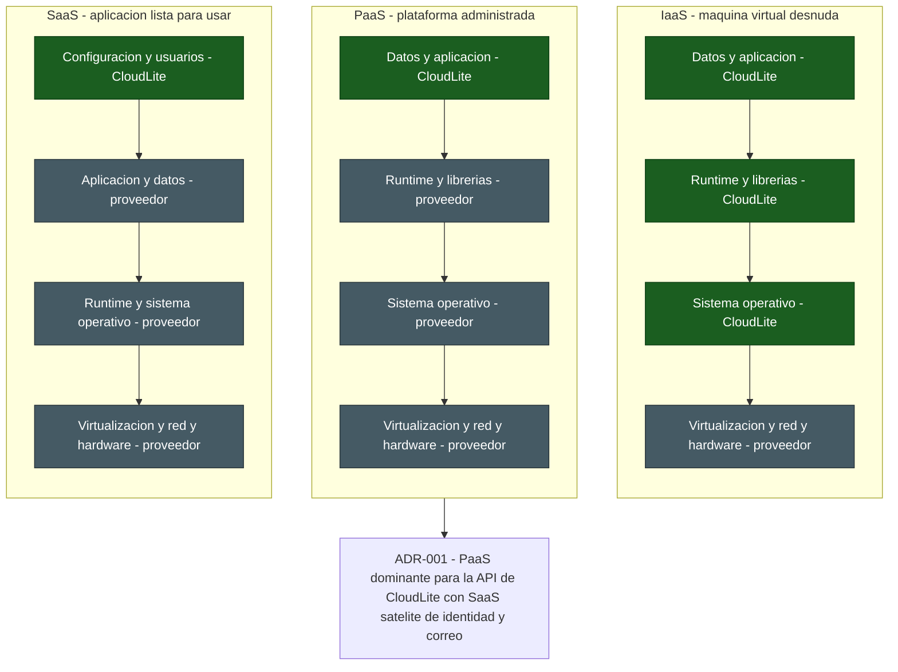

# Taller de la Clase 2 en ExamLab - configuracion

- **Curso:** Arquitectura de Sistemas Computacionales (FI303380)
- **Taller:** Taller Clase 2 en ExamLab - ADR-001 del modelo de servicio
- **Preguntas:** 5 · **Total:** 100 puntos
- **Plataforma:** ExamLab (https://uniaj.examlab.workers.dev/) · modulo Talleres
- **Hito del PI:** Decidir modelo dominante (IaaS/PaaS/SaaS) para CloudLite + ADR breve
- **Entregable de la clase:** ADR-001: decisión de modelo de servicio + matriz de comparación aplicada al dominio

> ExamLab no importa preguntas desde archivo: el alta se hace en la UI del
> docente (o con la pestana de IA). Este documento trae el texto exacto de cada
> campo para copiar y pegar, incluidos el SQL de partida y el codigo base.

**Que produce el estudiante:** El estudiante produce el ADR-001 de CloudLite con una matriz puntuada IaaS/PaaS/SaaS y un diagrama de responsabilidad compartida que justifica el modelo dominante elegido.

---

## Pregunta 1 - Respuesta escrita · 25 pts

**Tipo en la plataforma:** `abierta`

**Enunciado (campo Contenido):**

## Matriz IaaS / PaaS / SaaS aplicada a su dominio

Construya una tabla de **4 columnas** con encabezados exactos `Criterio | IaaS | PaaS | SaaS` y **exactamente 5 filas**, en este orden:

1. Control sobre el sistema operativo y el runtime.
2. Esfuerzo de operacion que recae en el equipo (parches, respaldos, monitoreo).
3. Tiempo hasta la primera demo del PI.
4. Costo cualitativo para CloudLite: `bajo` / `medio` / `alto` **mas el driver que lo causa**.
5. Portabilidad y riesgo de quedar amarrado al proveedor.

En cada celda escriba **una frase referida a su dominio** y termine la celda con una nota de **1 a 3** (3 = mejor para CloudLite).

Debajo de la tabla sume las notas por columna y escriba los 3 totales. **Verificacion obligatoria:** los tres totales deben ser distintos entre si; si dos empatan, el criterio esta mal aplicado y debe volver a puntuar antes de enviar.

**Rubrica esperada (campo Rubrica):**

10 pts la tabla completa con los 5 criterios en orden y las 15 celdas con frase de dominio. 8 pts las notas de 1 a 3 en las 15 celdas y los 3 totales calculados. 4 pts que la fila de costo nombre el driver y no solo el nivel. 3 pts que los tres totales sean distintos.

---

## Pregunta 2 - Respuesta escrita · 30 pts

**Tipo en la plataforma:** `abierta`

**Enunciado (campo Contenido):**

## ADR-001: modelo de servicio dominante de CloudLite

Redacte el ADR-001 con **estas 7 secciones rotuladas, en este orden y sin agregar otras**:

1. **Titulo**: `ADR-001 Modelo de servicio dominante de CloudLite App`.
2. **Estado**: `Aceptado` mas la fecha.
3. **Contexto**: exactamente 3 frases. Una del dominio, una de la restriccion del curso (gratis, en navegador, sin tarjeta de credito) y una de la capacidad real de quien desarrolla (una persona, o 2 o 3 si el docente autorizo equipo; un semestre).
4. **Decision**: **una sola frase** que nombre **un unico modelo dominante** (IaaS, PaaS o SaaS) para la aplicacion propia de CloudLite.
5. **Alternativas descartadas**: exactamente 2, cada una con el motivo del descarte expresado en terminos de este dominio.
6. **Consecuencias**: exactamente 2 positivas y 2 negativas, rotuladas con `+` y `-`. Al menos una negativa debe hablar de amarre al proveedor o de perdida de control.
7. **Impacto en el PI**: 2 lineas que digan que secciones del informe cambian por esta decision.

Si la seccion 4 nombra dos modelos, esa seccion vale cero. Puede aclarar en las consecuencias que consume **SaaS satelite** para identidad y correo.

**Rubrica esperada (campo Rubrica):**

6 pts las 7 secciones presentes y rotuladas. 6 pts el contexto con las 3 frases exigidas incluida la restriccion sin tarjeta. 6 pts la decision en una frase con un unico modelo dominante. 6 pts las 2 alternativas con motivo del dominio. 6 pts las 2 consecuencias positivas y 2 negativas con una de amarre o perdida de control.

---

## Pregunta 3 - Diagrama (Mermaid) · 25 pts

**Tipo en la plataforma:** `diagrama`

**Enunciado (campo Contenido):**

## Responsabilidad compartida en Mermaid

Escriba un `flowchart TB` con **3 subgrafos** rotulados `IaaS`, `PaaS` y `SaaS`. Cada subgrafo lleva **exactamente 4 nodos**, uno por capa, de arriba hacia abajo:

`Datos y aplicacion` -> `Runtime y librerias` -> `Sistema operativo` -> `Virtualizacion y red y hardware`

En cada nodo escriba la capa **y quien la gestiona**, con el formato `Capa - CloudLite` o `Capa - proveedor`.

Agregue un nodo `decision` con el texto del ADR-001 y una flecha desde el subgrafo del modelo elegido hacia ese nodo. Use `classDef` y `class` para pintar distinto lo que gestiona el equipo y lo que gestiona el proveedor.

**Verificacion:** al renderizar debe poder contar 12 nodos de capa, y la cantidad de nodos con la palabra `CloudLite` debe bajar de IaaS a SaaS (3, luego 1, luego 1).

**Diagrama de referencia (Mermaid):**

**Rubrica esperada (campo Rubrica):**

10 pts los 3 subgrafos con 4 capas cada uno en el orden pedido. 8 pts que cada nodo declare quien gestiona la capa y que el reparto sea correcto por modelo. 4 pts el nodo de decision conectado desde el modelo elegido y coherente con el ADR-001. 3 pts que renderice sin error.

---

## Pregunta 4 - Seleccion multiple · 12 pts

**Tipo en la plataforma:** `cerrada_multi`

**Enunciado (campo Contenido):**

## Que es cierto de PaaS

Seleccione las **3 afirmaciones correctas** sobre PaaS.

**Opciones:**

- [x] El proveedor aplica los parches del sistema operativo y del runtime; el equipo mantiene el codigo y los datos.
- [ ] El equipo debe dimensionar y actualizar las maquinas virtuales una por una.
- [x] Se llega mas rapido a una demo funcional porque no hay que construir la plataforma base.
- [x] El riesgo principal es el amarre al proveedor por servicios propietarios de plataforma.
- [ ] El equipo pierde el control del codigo fuente de su aplicacion.
- [ ] Consumir un SaaS de correo o de identidad contradice haber elegido PaaS como modelo dominante.

**Rubrica esperada (campo Rubrica):**

4 pts por cada correcta marcada; se descuentan 4 pts por cada incorrecta marcada, sin bajar de cero.

---

## Pregunta 5 - Seleccion unica · 8 pts

**Tipo en la plataforma:** `cerrada`

**Enunciado (campo Contenido):**

## Clasifique esta parte de CloudLite

El equipo decide **no** operar servidores de correo ni de identidad: usara el login institucional por OIDC y un servicio de correo de terceros a traves de su API. Como se clasifica **esa parte** de la arquitectura de CloudLite?

**Opciones:**

- [ ] IaaS, porque detras hay maquinas de un proveedor.
- [ ] PaaS, porque se despliega codigo propio sobre una plataforma.
- [x] SaaS satelite, porque se consume una aplicacion completa de terceros por su API.
- [ ] No aplica: los servicios de terceros quedan fuera de la arquitectura.

**Rubrica esperada (campo Rubrica):**

8 pts la opcion correcta, 0 en cualquier otra.

---

## Al terminar de crearlo

- Verifique que la suma de puntos sea la esperada: **100**.
- Publique el taller y confirme la fecha limite (domingo 23:59 segun el Acuerdo).
- Las preguntas con SQL o codigo: ejecutelas una vez usted mismo antes de publicar,
  para confirmar que el SQL de partida corre y que el starter compila.
