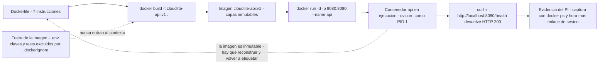

# Taller de la Clase 3 en ExamLab - configuracion

- **Curso:** Arquitectura de Sistemas Computacionales (FI303380)
- **Taller:** Taller Clase 3 en ExamLab - Contenedor stub de CloudLite
- **Preguntas:** 5 · **Total:** 100 puntos
- **Plataforma:** ExamLab (https://uniaj.examlab.workers.dev/) · modulo Talleres
- **Hito del PI:** Contenerizar un stub del servicio principal de CloudLite
- **Entregable de la clase:** Dockerfile (+ compose opcional) + captura/enlace lab navegador

> ExamLab no importa preguntas desde archivo: el alta se hace en la UI del
> docente (o con la pestana de IA). Este documento trae el texto exacto de cada
> campo para copiar y pegar, incluidos el SQL de partida y el codigo base.

**Que produce el estudiante:** El estudiante deja el contexto de build verificado en la consola de ExamLab, el Dockerfile de 7 instrucciones documentado y la evidencia del contenedor corriendo en LabEx Docker Playground con su ruta de salud respondiendo 200.

---

## Pregunta 1 - Seleccion multiple · 10 pts

**Tipo en la plataforma:** `cerrada_multi`

**Enunciado (campo Contenido):**

## Maquina virtual o contenedor

Seleccione las **3 afirmaciones correctas**.

**Opciones:**

- [x] El contenedor comparte el kernel del host y por eso arranca en segundos.
- [ ] Cada contenedor incluye su propio kernel completo, igual que una maquina virtual.
- [x] La imagen es inmutable y de solo lectura; el contenedor agrega encima una capa de escritura efimera.
- [x] Si el contenedor se destruye se pierde lo escrito en su capa efimera, salvo que exista un volumen.
- [ ] Un contenedor aisla el hardware mediante un hipervisor de tipo 1.
- [ ] Dejar el archivo .env con la clave del correo dentro de la imagen es aceptable si el repositorio es privado.

**Rubrica esperada (campo Rubrica):**

4 pts por cada correcta marcada hasta un maximo de 10; se descuentan 4 pts por cada incorrecta marcada, sin bajar de cero.

---

## Pregunta 2 - Respuesta escrita · 30 pts

**Tipo en la plataforma:** `abierta`

**Enunciado (campo Contenido):**

## Dockerfile del stub de CloudLite

> ExamLab **no ejecuta** este Dockerfile: la construccion real ocurre en LabEx Docker Playground (pregunta 4). Aqui se evalua el contenido y su justificacion.

Pegue el Dockerfile completo del servicio que eligio, con **exactamente 7 instrucciones**, en este orden:

1. `FROM` con imagen **slim y tag de version fijo** (nunca `latest`).
2. `WORKDIR`.
3. `COPY` **solo** del archivo de dependencias.
4. `RUN` de instalacion con `--no-cache-dir` (o el equivalente de su lenguaje).
5. `COPY` del codigo de la aplicacion.
6. `EXPOSE` con el puerto que declaro en la ficha del paso 1.
7. `CMD` en forma de lista, apuntando al mismo puerto del `EXPOSE`.

Debajo agregue una tabla de **2 columnas** (`Instruccion | Por que esta y que pasaria si no estuviera`) con **7 filas**, una por instruccion.

Cierre con **3 lineas**: nombre de la imagen y tag (`cloudlite-api:v1`), puerto publicado y ruta de salud.

**Verificacion:** el numero de puerto debe aparecer identico en `EXPOSE`, en `CMD` y en la linea de cierre.

**Rubrica esperada (campo Rubrica):**

10 pts las 7 instrucciones en el orden pedido con tag fijo y variante slim. 8 pts que el COPY de dependencias este separado del COPY del codigo y que el RUN use --no-cache-dir. 8 pts la tabla de 7 filas explicando el efecto de cada instruccion. 4 pts que el puerto coincida en EXPOSE, CMD y linea de cierre. Cero en toda la pregunta si aparece un secreto o un archivo .env copiado a la imagen.

---

## Pregunta 3 - Consola Linux · 22 pts

**Tipo en la plataforma:** `so_consola`

**Enunciado (campo Contenido):**

## Consola Linux: arme y valide el contexto de build

La consola de ExamLab es un Linux real **pero sin red y sin Docker**: aqui **no** se ejecuta `docker build`, eso va en LabEx Docker Playground (pregunta 4). Lo que se evalua es que el **contexto de build** quede bien armado y verificado.

Ejecute y deje visible en la sesion:

1. `mkdir -p /root/cloudlite-api/app` y entre al directorio.
2. Cree `app/main.py` con un stub de 3 lineas que exponga `/health`, usando `cat > app/main.py << 'EOF' ... EOF`.
3. Cree `requirements.txt` con **exactamente 2 dependencias fijadas por version** (por ejemplo `fastapi==0.115.0` y `uvicorn==0.30.6`).
4. Cree el `Dockerfile` con las **mismas 7 instrucciones** de la pregunta 2, con el mismo heredoc.
5. Cree `.dockerignore` con **exactamente 4 entradas**: `.git`, `__pycache__`, `*.env`, `tests/`.
6. Ejecute `chmod 644 Dockerfile requirements.txt .dockerignore` y luego `ls -la` y `wc -l Dockerfile .dockerignore`.
7. Ejecute `grep -c '' Dockerfile` y confirme que el conteo es **7 o mas**.
8. Ejecute `grep -rniE 'password|secret|token|api_key' .` y confirme que **la salida es vacia**.

Deje la sesion terminando con el `ls -la` y el `grep` vacio a la vista.

**Rubrica esperada (campo Rubrica):**

6 pts los 5 archivos creados en /root/cloudlite-api con la estructura pedida. 5 pts requirements.txt con 2 dependencias fijadas por version y .dockerignore con las 4 entradas. 5 pts los permisos 644 y las salidas de ls -la y wc -l visibles. 6 pts el grep de secretos ejecutado y con salida vacia. Se anula la pregunta si intenta pasar como evidencia un docker build en esta consola.

---

## Pregunta 4 - Respuesta escrita · 20 pts

**Tipo en la plataforma:** `abierta`

**Enunciado (campo Contenido):**

## Bitacora del laboratorio en LabEx Docker Playground

Abra **LabEx Docker Playground** (labex.io, inicie sesion con su cuenta de Google o Microsoft; si no carga, **Killercoda**), suba su contexto de build y ejecute el ciclo completo. Reporte una tabla de **4 columnas** (`Comando | Que esperaba | Que salio realmente | Evidencia`) con **exactamente 5 filas**, una por comando, en este orden:

1. `docker build -t cloudlite-api:v1 .`
2. `docker images | grep cloudlite-api`
3. `docker run -d -p 8080:8080 --name api cloudlite-api:v1`
4. `docker ps`
5. `curl -i http://localhost:8080/health`

En la columna `Evidencia` escriba el fragmento textual de la salida (numero de capas, ID corto del contenedor, `HTTP/1.1 200 OK`).

Debajo de la tabla pegue:
- El **enlace de la sesion** del lab **mas la nota de que la sesion es temporal** (`la sesion de LabEx es temporal; guarde evidencia antes de cerrarla`).
- La descripcion de la **captura** que adjunta: debe mostrarse al mismo tiempo el prompt del lab, la salida de `docker ps` y la hora del sistema (`date`).
- **Una fila extra de incidente**: un comando que le fallo y como lo resolvio. Si nada fallo, escriba el comando que estuvo a punto de fallar y por que no fallo.

**Rubrica esperada (campo Rubrica):**

8 pts las 5 filas con el comando y la evidencia textual, no parafraseada. 5 pts el 200 OK de la ruta de salud demostrado con la salida de curl. 4 pts el enlace de sesion con nota de caducidad y la captura con prompt, docker ps y hora. 3 pts la fila de incidente resuelto.

---

## Pregunta 5 - Diagrama (Mermaid) · 18 pts

**Tipo en la plataforma:** `diagrama`

**Enunciado (campo Contenido):**

## Del Dockerfile al contenedor en ejecucion

Escriba un `flowchart LR` con **exactamente 7 nodos** que muestre el ciclo real que acaba de ejecutar, en este orden:

`Dockerfile` -> `docker build` -> `Imagen con tag` -> `docker run` -> `Contenedor en ejecucion` -> `curl a la ruta de salud` -> `Evidencia para el PI`

Requisitos:
- El nodo de la imagen debe llevar el **tag exacto** que uso (`cloudlite-api:v1`).
- El nodo de `docker run` debe mostrar el **mapeo de puertos** (`-p 8080:8080`).
- Agregue **una arista punteada** desde el nodo del contenedor de vuelta al Dockerfile rotulada con el motivo del reciclo (por ejemplo `la imagen es inmutable y hay que reconstruir`).
- Agregue **un nodo aparte** rotulado con lo que **no** entra en la imagen (`.env y claves quedan fuera por .dockerignore`) conectado con arista punteada al `docker build`.

**Verificacion:** al renderizar debe contar 8 nodos en total (7 del ciclo mas el de los secretos excluidos) y 2 aristas punteadas.

**Diagrama de referencia (Mermaid):**

**Rubrica esperada (campo Rubrica):**

8 pts los 7 nodos del ciclo en el orden correcto. 4 pts el tag exacto de la imagen y el mapeo de puertos visibles en los nodos. 4 pts las 2 aristas punteadas: reciclo por inmutabilidad y secretos excluidos. 2 pts que renderice sin error.

---

## Al terminar de crearlo

- Verifique que la suma de puntos sea la esperada: **100**.
- Publique el taller y confirme la fecha limite (domingo 23:59 segun el Acuerdo).
- Las preguntas con SQL o codigo: ejecutelas una vez usted mismo antes de publicar,
  para confirmar que el SQL de partida corre y que el starter compila.
