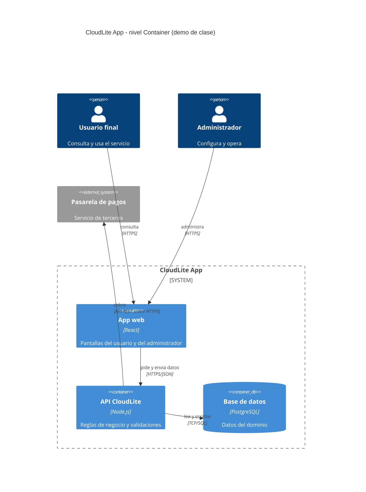

# Guion docente — Clase 4: Microservicios · Arquitecturas distribuidas

## Información de la clase
- Asignatura: Arquitectura de Sistemas Computacionales (FI303380)
- Duración del bloque: **120 min**
- Tipo: Clase regular (teoría + taller PI) · encuentro síncrono
- Enfoque: **Proyecto Integrador CloudLite App** (parte práctica)
- Sin fechas de periodo · sin bio · sin mapa completo del curso

## Objetivos de la clase
- Contrastar monolito vs microservicios con criterios de equipo y acoplamiento.
- Modelar CloudLite en C4 Container (Mermaid) con 2–5 cajas justificadas.
- Definir 3 contratos con verbo, ruta y error de negocio, y nombrar 3 riesgos de distribución.

## Hoy avanzamos el PI en…
**Diagramar componentes/servicios de CloudLite y sus contratos**

**Entregable concreto:** Diagrama C4 Container en Mermaid + tabla de 3 contratos + 3 riesgos de distribución

**Herramienta:** draw.io o Excalidraw para bocetar · Mermaid dentro de ExamLab para entregar

## Fundamento teórico para el docente
### De donde viene la clase y que se abre hoy - diapositiva 4
La Clase 3 dejo al estudiante con una unidad de despliegue concreta en las manos: una imagen que se ejecuta como contenedor. La Clase 1 le dejo una caja negra llamada CloudLite App con actores y sistemas externos alrededor. Hoy se juntan las dos cosas: se abre la caja negra y se decide de cuantas piezas esta hecha por dentro y por que. Ese es el nivel 2 del modelo C4, el de contenedores, y el entregable son tres cosas: la decision de arquitectura en una frase con sus dos criterios, el diagrama de contenedores escrito en Mermaid, y una tabla de tres contratos mas tres riesgos de distribucion. La pregunta que organiza la clase no es que son los microservicios, sino una mas incomoda y mas util: cada vez que un sistema se parte en dos, se gana algo y se paga algo, y hoy hay que decir explicitamente que se gana y que se paga. Un estudiante que solo aprende la primera mitad de esa frase sale convencido de que mas servicios es mejor arquitectura, que es exactamente el error que esta clase debe prevenir.
### Monolito: lo que la palabra realmente significa - diapositiva 5
Empecemos por el termino que el estudiante trae con mala fama. Un monolito es un sistema que se despliega como una sola unidad: todo su codigo se construye junto y sale al aire junto. No es un insulto ni un error, es la arquitectura correcta por defecto para la mayoria de los sistemas pequenos, y varios proyectos de este curso deberian ser monolitos bien organizados. Un microservicio, en cambio, es una unidad de despliegue independiente con una frontera de responsabilidad de negocio propia. La palabra decisiva es independiente, y admite una prueba de una linea que el docente debe usar como criterio de correccion: si para poner en produccion el servicio A hay que desplegar tambien el servicio B, entonces A y B no son dos microservicios, son un solo sistema partido en dos repositorios, con todos los costos de la distribucion y ninguno de sus beneficios. Tres senales de una frontera real: el servicio es dueno de sus propios datos, puede liberarse a su propio ritmo y corresponde a una capacidad de negocio que se puede nombrar sin usar palabras tecnicas. En cuanto a la notacion, el nivel de contenedores del modelo C4 pide dibujar, dentro del sistema, cada cosa que se ejecuta o almacena de forma independiente, con tres datos obligatorios por caja (nombre, tecnologia y responsabilidad en una frase) y cada flecha etiquetada con protocolo y formato, nunca una linea muda. Aqui hay que repetir la advertencia de la clase pasada, porque es la fuente numero uno de confusion: contenedor en C4 no significa contenedor de Docker. Una aplicacion web de una sola pagina que corre en el navegador, una API, una base de datos gestionada, una cola de mensajes y un proceso trabajador en segundo plano son cinco contenedores C4, aunque solo dos de ellos esten dockerizados. Confundirlo lleva al estudiante a creer que debe empaquetar cada caja con Docker para que el diagrama sea valido, lo cual no es cierto y desvia el trabajo de la semana hacia una tarea que nadie pidio.

Con eso claro, lo primero que el estudiante entrega hoy es la decision, y tiene una forma exigida que conviene dictar literal porque se corrige asi. Es UNA frase y elige UNA de las dos opciones: monolito modular o microservicios. «Un poco de los dos» vale cero, y hay que decir por que: no es una posicion intermedia sensata, es la frase de quien no decidio, y un sistema no se puede desplegar de las dos formas a la vez. La decision se sostiene con exactamente dos criterios. El primero es el tamano del equipo, y se exige CON numero y CON plazo: «somos dos personas y tenemos doce semanas» es un criterio; «el equipo es pequeno» no lo es, porque no permite verificar nada. La razon de fondo es la que se repite en el cierre: la cantidad de servicios que una organizacion sostiene es funcion del numero de equipos autonomos, no del gusto por la modularidad. El segundo criterio es el acoplamiento, y se responde diciendo QUE partes cambian juntas: si al tocar el calendario de disponibilidad hay que tocar tambien el registro de clientes, esas dos cosas no son dos servicios. Y la frase se cierra con las dos mitades del trade-off: lo que se gana y lo que se pierde. Sin la segunda mitad no hubo decision, hubo una justificacion escrita despues de los hechos —el mismo defecto que la Clase 2 senalaba en los ADR sin consecuencias negativas—, y esa simetria entre las dos clases vale la pena nombrarla en voz alta.
### Las tres reglas del nivel Container y la trazabilidad con el Context - diapositiva 6
Antes del ejemplo conviene fijar las tres reglas con las que se corrige el diagrama, porque cada una tiene puntos asignados y las tres se pierden por descuido y no por no saber. La primera: cada caja lleva TRES datos, no uno. Nombre, tecnologia y responsabilidad en una frase. Una caja que dice solo «API» no es un contenedor descrito, es una etiqueta; con «API de turnos · Node.js · valida la franja y registra el turno» ya se puede discutir si esa frontera tiene sentido. La segunda: lo que guarda datos no es una caja mas. En la notacion se marca como almacen —en el codigo, ContainerDb en lugar de Container— y esa distincion no es cosmetica: un almacen no se replica igual que un servicio, no se despliega igual y no falla igual, y todo eso se retoma en las Clases 7 y 13. La tercera: ninguna flecha queda muda, y media etiqueta tampoco alcanza. Cada flecha lleva protocolo Y formato: HTTPS/JSON, TCP/SQL. «HTTP» a secas no dice como viajan los datos y «SQL» a secas no dice sobre que transporte; con las dos mitades, cualquiera que lea el diagrama sabe por donde puede romperse.

Y hay una cuarta condicion que no es del nivel sino de la continuidad del proyecto: los nombres tienen que ser IDENTICOS a los del C4 Context de la Clase 1. Si alli decia «Pasarela de pagos», aqui no puede decir «Pagos». No es pedanteria de notacion; es lo unico que permite afirmar que los dos dibujos son el mismo sistema visto desde distinta altura, y es exactamente lo que se volvera a verificar en la Clase 7 contra el diagrama de despliegue y en la Clase 11 en la auditoria del paquete. Los actores y los sistemas externos del Context siguen existiendo hoy y siguen estando FUERA del recuadro del sistema: abrir la caja no elimina lo que la rodeaba. Ese es el error de dibujo mas comun de la clase, meter al usuario o a la pasarela de pagos dentro del sistema propio, y se detecta en dos segundos preguntando quien lo opera.
### C4Container en Mermaid: la sintaxis que la plataforma renderiza - diapositiva 11
El diagrama no se entrega como imagen: se entrega como codigo, y la plataforma lo renderiza. Eso cambia lo que el docente tiene que ensenar, porque un boceto correcto escrito con la sintaxis equivocada no renderiza y entonces no hay diagrama que calificar. Son cinco reglas de escritura y conviene recorrerlas sobre la diapositiva, linea por linea. La primera linea es exactamente C4Container, sin nada antes; C4Context es el nivel de la Clase 1 y graph TD es otro tipo de diagrama, y cualquiera de los dos deja la respuesta en el nivel equivocado. Los actores se declaran con Person y los sistemas ajenos con System_Ext, los dos por fuera del bloque del sistema. El sistema propio se abre con System_Boundary y una llave, y dentro van las cajas: Container para lo que ejecuta y ContainerDb para lo que almacena, cada una con identificador, nombre, tecnologia y responsabilidad. La llave se cierra, y las relaciones van despues, con Rel y cuatro datos: origen, destino, que hace y con que protocolo y formato. El identificador corto de cada caja —en el molde proyectado son spa, api, db y worker— es el que usan las relaciones; si no coincide, no dibuja la flecha y tampoco avisa con claridad.

Vale la pena decir en voz alta que aqui el uso de una IA es legitimo y ademas recomendado: pasar un boceto a codigo Mermaid es justo la tarea mecanica en la que ayuda sin sustituir el criterio. Lo que NO delega el estudiante es la revision, y hay tres cosas que tiene que verificar el mismo antes de enviar, porque son las que la IA equivoca con frecuencia: que la primera linea sea C4Container, que la base de datos haya quedado como ContainerDb y no como Container, y que ninguna relacion haya perdido la mitad de su etiqueta. La regla operativa del dia se dice como consecuencia y no como consejo: se pega el codigo, se mira renderizado, y solo entonces se envia. Un codigo que no renderiza vale cero, y es el unico punto del taller donde el estudiante puede comprobar su propia nota antes de entregar.
### Primer ejemplo: los tres contenedores de CloudLite Turnos - diapositiva 9
Primer ejemplo concreto, y conviene construirlo en el tablero en vivo. CloudLite Turnos, el sistema de agendamiento de la barberia, empieza con tres contenedores: una aplicacion web que corre en el navegador del cliente, una API que atiende peticiones HTTP con cuerpo en formato JSON, y una base de datos relacional donde viven turnos, clientes y horarios. La flecha entre la web y la API dice «HTTPS/JSON, consulta disponibilidad y crea reservas»; la flecha entre la API y la base de datos dice «TCP, lee y escribe turnos». Con eso ya existe un diagrama valido y defendible. Ahora viene la parte interesante: la cuarta caja aparece solo si hay una razon. El envio del correo de confirmacion tarda, con proveedores reales de correo, entre 300 y 2000 milisegundos, y puede fallar por causas ajenas al sistema. Si la API espera ese envio antes de responder, la reserva de un turno hereda esa latencia y ese riesgo. Esa es una razon legitima para separar: se agrega una cola de mensajes y un trabajador de notificaciones, la API escribe el turno, publica un mensaje y responde en decenas de milisegundos, y el trabajador envia el correo despues, con reintentos si falla. Cuatro contenedores con una justificacion medible es mejor arquitectura que ocho por moda.
### Los contratos: cuatro datos por fila y un 409 obligatorio - diapositiva 7
Si cada flecha del diagrama lleva protocolo y formato, el paso siguiente es decir QUE se negocia por esa flecha, y eso es un contrato. Un contrato entre dos piezas de un sistema tiene cuatro datos y los cuatro se piden por separado: como se llama la interaccion en terminos de negocio, quien llama a quien, con que verbo y ruta —o con que nombre de evento, si es asincrono—, y cual es el error de negocio que puede devolver. El cuarto es el que se olvida y el que hace util al contrato. Un error de negocio es una respuesta prevista, que forma parte del diseno: la franja ya esta tomada, el cupo se agoto, el usuario no tiene permiso. Un 500 no es un error de negocio, es una falla del sistema; nadie lo disena, y por eso poner 500 en esa columna es la senal de que el estudiante no distinguio las dos cosas. La diapositiva proyecta los tres contratos resueltos sobre CloudLite Turnos y conviene recorrerlos leyendo la cuarta columna en voz alta, porque es lo que hay que replicar.

Dos exigencias mas, que valen puntos y se pierden sin darse cuenta. La primera: al menos uno de los tres contratos tiene que ser un 409 de conflicto, y la razon es de dominio y no de capricho. El 409 es la respuesta que dice «tu peticion es valida, pero el estado actual del sistema no la admite», y en cualquier dominio de reservas ese caso existe siempre: dos clientes quieren la misma franja. Un estudiante que no encuentra ningun 409 en su sistema casi nunca tiene un dominio sin conflictos; lo que tiene es un diagrama que no modela ninguna regla de negocio. Conviene tambien tener a mano la diferencia con sus vecinos, porque se confunden: 400 es que la peticion esta mal formada, 401 que no se sabe quien eres, 403 que se sabe y no te corresponde, 404 que no existe, 422 que esta bien formada pero sus datos no pasan una validacion, y 409 que choca con el estado actual. La segunda exigencia: los tres contratos no pueden ser entre el mismo par de cajas. Tres filas que digan «App web → API» describen un solo canal contado tres veces, y lo que se esta evaluando es si el estudiante entendio que su sistema tiene varias fronteras. Y si el contrato es con la base de datos, en la columna del verbo va la sentencia (INSERT, SELECT) y no una ruta REST, porque la base no expone rutas; ponerle POST /turnos a la base de datos es el error que delata que se lleno la tabla por analogia y no leyendo el propio diagrama.
### Lo que se paga al distribuir: la red no es una llamada de funcion - diapositiva 8
El segundo bloque de contenido es el mas importante del dia: que se paga al distribuir. Una llamada a una funcion dentro del mismo proceso cuesta del orden de nanosegundos y no puede fallar por causas de red. La misma llamada convertida en peticion HTTP entre dos contenedores de la misma maquina o del mismo centro de datos cuesta tipicamente entre 1 y 5 milisegundos, y entre regiones geograficas distintas puede subir a 50 o 200 milisegundos. Es decir, convertir una llamada local en remota empeora el costo en varios ordenes de magnitud, y a eso se suma que ahora la llamada puede perderse, llegar duplicada o tardar indefinidamente. Hay una aritmetica que conviene mostrar porque impresiona con razon: si una peticion del usuario atraviesa en cadena cinco servicios y cada uno esta disponible el 99,9 % del tiempo, la disponibilidad del recorrido completo es 0,999 elevado a la quinta potencia, alrededor del 99,5 %, lo que pasa de unos 43 minutos de indisponibilidad al mes a mas de tres horas. Ese calculo es exacto y no una convencion, y es el argumento mas contundente contra multiplicar servicios sin necesidad.
### Timeout, reintento, idempotencia y circuit breaker - diapositiva 8
De ahi salen cuatro mecanismos que el diagrama y la tabla deben poder mencionar. Un timeout es el tiempo maximo que un servicio espera respuesta antes de darse por vencido; sin timeout explicito, un servicio lento no falla sino que deja colgado a quien lo llamo, y el bloqueo se propaga hacia arriba hasta tumbar el sistema completo. Los valores tipicos para llamadas internas estan entre 2 y 5 segundos, y son convencion, no ley. Un reintento es volver a intentar la llamada fallida, y trae una trampa: si todos los clientes reintentan de inmediato contra un servicio ya saturado, lo hunden mas, por lo que se limita a dos o tres reintentos con espera creciente entre uno y otro. Los reintentos exigen idempotencia, que significa que ejecutar la misma operacion dos veces produzca el mismo resultado que ejecutarla una vez. En CloudLite eso es literal: si el reintento de crear turno no es idempotente, el cliente termina con dos reservas para el mismo horario, y la solucion habitual es que la peticion lleve un identificador unico que el servidor reconozca como repetido. El cuarto mecanismo es el interruptor de circuito, o circuit breaker, que tras varias fallas consecutivas deja de intentar por un rato y responde de inmediato con un error controlado, para no gastar recursos golpeando algo que esta caido.
### Los datos: donde se rompen los proyectos academicos - diapositiva 10
El punto donde los proyectos academicos se rompen es el de los datos. La regla ortodoxa de los microservicios dice que cada servicio es dueno exclusivo de su base de datos y que nadie mas la consulta directamente; si dos servicios comparten tablas, estan acoplados y no pueden desplegarse por separado, lo que contradice la definicion. Pero cumplir esa regla tiene un precio real: una consulta que antes era un join deja de existir y hay que resolverla llamando a otro servicio, y una operacion que abarca dos servicios ya no puede ser una transaccion unica sino una secuencia de pasos con compensaciones. Eso introduce consistencia eventual, es decir un lapso durante el cual dos partes del sistema tienen versiones distintas de la verdad, con consecuencias visibles para el usuario. La postura honesta para este curso, y hay que enunciarla en voz alta, es que un CloudLite con una base de datos compartida y propiedad de tablas claramente documentada resulta aceptable, siempre que el estudiante lo registre como un trade-off consciente en su informe y no lo presente como microservicios puros. Fingir ortodoxia es peor que documentar una concesion.
### El tercer entregable: los tres riesgos, y por que son esos tres - diapositiva 8
El tercer entregable es lo que impide que la clase quede en pura teoria, y no es una tabla libre de riesgos: son TRES riesgos, cada uno responde una pregunta distinta, y estan elegidos para que ninguno se pueda contestar sin mirar el propio diagrama. Conviene dictarlos asi, porque un estudiante que entiende por que son esos tres no escribe generalidades.

El primero pregunta que se cae. Se nombra UNA caja del diagrama y se dice que deja de funcionar y —esta es la mitad que se olvida— que SIGUE funcionando. «Se cae todo» vale la mitad de los puntos, y con razon: en un sistema bien partido nunca se cae todo, y el ejercicio consiste precisamente en descubrir que algunas cosas sobreviven. En CloudLite Turnos, si se cae el trabajador de notificaciones, los turnos se siguen reservando y lo que se pierde es el correo de confirmacion; si se cae la base de turnos, no se reserva nada, pero la aplicacion web sigue cargando y puede mostrar un mensaje decente en lugar de una pantalla en blanco. Ese razonamiento es el que en la Clase 7 permite decidir que va en cada zona de red y en la Clase 13 que pieza vale la pena replicar.

El segundo pregunta cuantos saltos de red tiene una operacion de punta a punta, y se responde con un numero, contado sobre el propio dibujo. Reservar un turno en el ejemplo de tres cajas son tres saltos: el navegador a la aplicacion web, la aplicacion web a la API, y la API a la base de datos; si se agrega el correo son cuatro, y si el correo se envia por cola, cinco. El numero importa por lo que se explico arriba: cada salto agrega latencia y una probabilidad de fallo, y esa aritmetica es la unica defensa contra multiplicar cajas por gusto. Un estudiante que no puede contar sus saltos no esta leyendo su diagrama, esta recordandolo.

El tercero pregunta por un dato que se escribe en dos pasos, y es el mas dificil de los tres porque exige mirar la escritura y no la lectura. En el ejemplo, el turno se escribe en la base y despues se publica el mensaje del correo: si el segundo paso falla, el turno existe y el cliente nunca se entero. Ese es el problema de fondo de todo sistema distribuido, y hoy no se resuelve con una saga completa: se reconoce, se nombra el dato concreto y se dice que queda inconsistente. Si un estudiante dice que no encuentra ningun riesgo, casi siempre es porque su diagrama tiene flechas sin protocolo o sin formato: no sabe por donde puede romperse porque nunca definio como se comunican las piezas. Devolverle el diagrama es mas util que darle un ejemplo.
### Preguntas frecuentes y cierre conceptual (de la diapositiva 5 a la diapositiva 10)
Las preguntas de esta clase son predecibles y conviene responderlas con firmeza. Cuantos microservicios son los correctos: no hay numero correcto, hay justificacion por frontera, y el rango de dos a cinco contenedores que exige el curso es una restriccion pedagogica pensada para proyectos de una a tres personas en doce semanas, no un hallazgo de la ingenieria. Si las empresas grandes tienen cientos de servicios, por que nosotros solo tres: porque el numero de servicios que una organizacion puede sostener es funcion del numero de equipos autonomos y de la madurez de su automatizacion de despliegue y observabilidad, condiciones que un equipo de tres no tiene, y copiar la forma sin las condiciones produce lo que aqui se llama microservicios teatro. Y la tercera, que hay que responder sin ambiguedad: esta mal hacer un monolito. No; esta mal hacerlo sin saber que se eligio, y un monolito modular bien argumentado recibe mejor calificacion que cinco servicios sin razon. Conviene cerrar ubicando el curso: este diagrama es el ultimo insumo del Parcial 1 de la Clase 5; en la Clase 6 cada flecha se convertira en una superficie de ataque que hay que proteger; en la Clase 7 estas mismas cajas se reubicaran en un diagrama de despliegue con zonas publicas y privadas, conservando exactamente los mismos nombres; en la Clase 8 cada contenedor implicara su propio pipeline de integracion continua; y en las Clases 12 y 13 se preguntara cual de estas piezas es el cuello de botella y cual se puede replicar.

Error tipico del docente que no domina el tema: aplaudir un diagrama con ocho microservicios sin preguntar por que existe cada uno. El numero de servicios no mide calidad arquitectonica; la justificacion de cada frontera si. La consecuencia aguas abajo es que ese estudiante llega a la Clase 7 con ocho cajas que no puede ubicar en zonas de red, a la Clase 8 con ocho pipelines que nunca construira y a la Clase 12 sin poder identificar un cuello de botella, porque no entiende el flujo de su propio sistema. El segundo error es tratar la latencia y los fallos parciales como un detalle de implementacion que se vera despues: si hoy no se dice que una flecha en el diagrama es una llamada de red que puede fallar, el estudiante disenara como si distribuir fuera gratis, no incluira timeouts ni idempotencia en su tabla de riesgos, y en la Clase 13 pedira autoescalado como solucion magica a un problema de diseno originado precisamente en esta clase.

## Referencias a diapositivas
Numeración real del deck `Clases/Clase 4 - Microservicios y arquitecturas distribuidas/Presentacion.pptx` (solo tema
de esta clase). Las etiquetas [Slide N] del plan y del fundamento apuntan aquí.

1. Portada · Clase 4 · Microservicios · Arquitecturas distribuidas
2. Agenda de hoy (120 min)
3. Objetivos de la clase
4. PI CloudLite — entregable de hoy
5. Monolito vs microservicios (para el PI)
6. C4-lite: del Context a los Containers
7. Los tres contratos de CloudLite: cuatro datos por fila
8. Distribuido implica fallos
9. Ejemplo de diagrama C4 — nivel Containers
10. Microservicios de verdad vs microservicios teatro
11. C4Container en Mermaid: el molde que ExamLab renderiza
12. Herramientas de hoy
13. Del boceto a ExamLab (diagrama)
14. Taller PI (paso a paso)
15. Para continuar (PI)
16. Clase 4 · PI en movimiento

## Plan de clase minuto a minuto (120 min)

### 0–10 · Encuadre PI · [Slide 2][Slide 3][Slide 4]
Di casi literal: «Hoy avanzamos el PI CloudLite App en: **Diagramar componentes/servicios de CloudLite y sus contratos**.
Entregable concreto: Diagrama C4 Container en Mermaid + tabla de 3 contratos + 3 riesgos de distribución.
Teoría breve y luego taller; no es un lab suelto.»
Pasa la diapositiva de agenda y la de objetivos. Abre el enunciado PI si alguien aún no lo tiene.
Pregunta de arranque (1 min): «¿En qué quedó tu CloudLite la clase pasada?» — sirve para detectar estudiantes rezagados antes de avanzar.

### 10–40 · Teoría Core (al servicio del taller) · desde [Slide 5]
Cubre estos conceptos, en este orden, ~7 min cada uno, con su diapositiva:
- **Monolito vs microservicios (para el PI)** · [Slide 5]
- **C4-lite: del Context a los Containers** · [Slide 6]
- **Los tres contratos de CloudLite: cuatro datos por fila** · [Slide 7]
- **Distribuido implica fallos** · [Slide 8]

**Ninguna se salta**: cada una de esas diapositivas es el mecanismo con que se resuelve
al menos una pregunta de la actividad calificada de hoy.
El desarrollo completo de cada uno está arriba, en «Fundamento teórico para el docente»:
esa sección está escrita para que puedas dictarla sin consultar otra fuente.
Cada 8–10 min amarra al artefacto: «esto es lo que van a dejar hoy en su informe/diagrama/repo».
Pide un estudiante voluntario y usa SU dominio como ejemplo en vivo (no el de la demo).

### 40–55 · Demo en vivo · [Slide 13]
Herramienta del día: **draw.io o Excalidraw para bocetar · Mermaid dentro de ExamLab para entregar**.
**Demo que usted debe poder repetir:** Convertir el Context de la Clase 1 en Containers, y dejarlo renderizado en ExamLab

1. Abra el diagrama C4 Context de la demo de Clase 1 y haga zoom a la caja «CloudLite App». Diga: «hoy no dibujamos otro sistema, abrimos este».
2. Reemplace esa caja por 3 cajas internas: «App web», «API de turnos» y «Base de turnos». Escriba en cada una sus TRES datos: nombre, tecnologia y responsabilidad en una frase.
3. Senale la base de datos y diga: «esta no es un Container mas, es un ALMACEN; en el codigo va como ContainerDb y son 2 puntos». Deje el cliente y el correo FUERA del recuadro del sistema.
4. Rotule CADA flecha con protocolo Y formato: «HTTPS/JSON», «TCP/SQL». Borre a proposito una etiqueta y pregunte que se pierde: sin ella nadie puede decir por donde se rompe.
5. Proponga una cuarta caja, el worker de avisos, y pida la razon de negocio. Si nadie la da, borrela en vivo: «eso es microservicios teatro». Si alguien la da (el correo tarda y puede fallar), quedese con ella y anote la razon al lado.
6. Verifique nombre por nombre contra el C4 Context de la Clase 1: si alli decia «Pasarela de pagos», aqui no puede decir «Pagos». Son 2 puntos de la pregunta 13.
7. Cierre en ExamLab: pegue el codigo Mermaid de la diapositiva del molde, cambie los nombres por los del ejemplo del tablero y proyecte el resultado RENDERIZADO. Diga: «si no renderiza, no hay diagrama; se revisa antes de enviar».

**Referencia del resultado:** C4 Container de la demo (el Context de la Clase 1, ya abierto). Si la red falla o prefiere no dibujar a mano, pegue este codigo en la pregunta de diagrama de ExamLab y proyectelo renderizado; tambien sirve para volver a generar la imagen en cualquier editor que soporte Mermaid.

Narra los clics en voz alta. Si falla la red, proyecta la [Slide 11], que ya trae el resultado de la demo, y recórrela rótulo por rótulo.
Cierra la demo con: «copien la estructura, no el dominio de mi ejemplo.»

**Cierra la demo dentro de ExamLab** [Slide 13] — es el paso que el estudiante no adivina: pasa el boceto a codigo Mermaid con ayuda de una IA, pegalo en la pregunta de diagrama y muestralo renderizado.

**Del boceto al codigo Mermaid.** No subas una imagen: la respuesta de esta pregunta es texto Mermaid.

- **1. Disena visual** Dibuja el diagrama como quieras en Excalidraw o draw.io: es mas rapido arrastrar cajas que escribir codigo, y ahi es donde piensas el modelo.
- **2. Traduce con IA** Copia o describe tu boceto a una IA y pidele el codigo Mermaid: «convierte este diagrama a Mermaid usando `C4Container`». Revisa el resultado: la IA acierta la sintaxis, no tu modelo.
- **3. Pega y renderiza en ExamLab** Pega ese codigo en la caja de texto de la pregunta y mira como lo dibuja la plataforma. Si no renderiza, corrige ahi mismo: lo que se califica es el diagrama renderizado dentro de ExamLab.
- **4. Guarda el PNG para tu PI** Exporta tambien la imagen a la carpeta de tu Proyecto Integrador. Esa copia es para tu informe; no reemplaza la respuesta en la plataforma.

### 55–100 · Taller guiado PI (individual · equipos de 2–3 solo si tú los autorizaste) · [Slide 14]
Proyecta la lista de pasos del taller del estudiante (está en la sección «Actividad / taller» de este guion).
Circula por mesas/Meet con la lista de errores frecuentes de abajo en la mano: son los que vas a ver hoy.
A los 80 min anuncia: «faltan 20 min. Falta evidencia: PNG/YAML/enlace. Empiecen a subir borrador.»

### 100–115 · Comprobación y evidencias
Haz 3–4 de las preguntas de comprobación oral de abajo, a personas distintas y al azar
(no al que levanta la mano). Es el mecanismo para verificar la regla de los 60 segundos.
Aplica el quiz corto de `Kit docente/Clase 4/Quiz Clase 4 - Microservicios y arquitecturas distribuidas.docx`
(la clave va en archivo aparte y **no se proyecta**).
Mientras responden, verifica que el entregable esté realmente subido.
Retroalimenta 2–3 estudiantes en voz alta, nombrando el error y la corrección concreta.

### 115–120 · Cierre · [Slide 16]
Di: «Queda avanzado: Diagramar componentes/servicios de CloudLite y sus contratos.
Criterio de éxito: el estudiante explica su artefacto en 60 s.
Entrega domingo 23:59 en ExamLab. Siguiente hito del PI según el plan.»

## Actividad / taller (detalle)
1. Paso 1: decida en la pregunta 12 si su CloudLite es un monolito modular o microservicios, con los dos criterios aplicados a su caso (tamano del equipo con numero y plazo, y que partes cambian juntas) y lo que gana y pierde; verifique que no escribio «un poco de los dos», porque eso vale cero.
2. Paso 2: modele en la pregunta 13 el C4 Container partiendo del C4 Context de la pregunta 3, con entre 2 y 5 contenedores coherentes con la decision anterior, los almacenes de datos como ContainerDb y toda flecha con protocolo y formato; verifique que los nombres de sistema, actores y sistemas externos sean identicos a los del Context.
3. Paso 3: liste en la pregunta 14 los 3 contratos con quien llama a quien usando los nombres exactos del diagrama, el verbo y la ruta (o el evento) y el error de negocio con su codigo y su significado en el dominio; verifique que al menos uno sea un 409 de conflicto y que ninguno diga «500 error del servidor».
4. Paso 4: analice en la pregunta 15 los tres riesgos de distribucion nombrando una caja concreta que se cae, contando los saltos de red de una operacion de punta a punta y nombrando un dato expuesto a inconsistencia; con esto la actividad del Corte 1 queda completa y se entrega en ExamLab antes del domingo 23:59 de esta semana.

### Criterio de éxito
- Artefacto integrado al paquete PI (no archivo huérfano).
- Evidencia adjunta.
- Explicación oral de 60 s por estudiante (muestreo; si autorizaste equipos, pregunta a cualquier integrante).

## Errores frecuentes del estudiante (y cómo corregirlos en el momento)
- Inventar 6 u 8 servicios para verse sofisticados. Pregunte por cada uno: que responsabilidad de negocio propia tiene y quien lo despliega por separado.
- Flechas sin etiqueta, o con media etiqueta. No basta «HTTP» ni «SQL»: toda flecha lleva protocolo Y formato de datos («HTTPS/JSON», «TCP/SQL»).
- Marcar la base de datos como `Container` y no como `ContainerDb`. Son 2 puntos y se pierden en un solo caracter; revise ese renglon del codigo antes de que envien.
- Renombrar las cajas respecto al C4 Context de la pregunta 3 («Pagos» donde antes decia «Pasarela de pagos»). Pidales los dos diagramas lado a lado y compare palabra por palabra.
- Responder «un poco de los dos» en la decision de la pregunta 12: vale cero. Devuelvala pidiendo UNA opcion y las dos mitades del trade-off, lo que se gana y lo que se pierde.
- Riesgos genericos tipo «los microservicios son mas complejos» o «puede haber latencia». No nombran caja, ni salto, ni dato: exija los tres riesgos concretos que pide el enunciado, y en el primero, que digan tambien que SIGUE funcionando.

## Preguntas de comprobación oral (no son del quiz)
Úsalas en el tramo 100–115, a personas distintas y al azar.
1. Que justifica que dos funciones vivan en servicios separados?
1. Que cambia cuando una llamada de funcion se vuelve una llamada de red?
1. Como se llama en su C4 Containers el servicio que expone la API? Se llama igual en su C4 Context de la Clase 1?
1. Cual de sus cajas es un almacen y como se escribe en el codigo del diagrama?
1. Cuantos saltos de red tiene la operacion principal de su sistema, contados sobre su propio diagrama?
1. Si se cae su base de datos, que deja de funcionar y que SIGUE funcionando?

## Solución del taller (privada)
`Kit docente/Clase 4/Solucion Taller Clase 4 - CloudLite.docx` — es la referencia con la que
comparas lo que entregan los estudiantes. **No proyectarla completa** antes de que trabajen.

## Quiz
`Kit docente/Clase 4/Quiz Clase 4 - Microservicios y arquitecturas distribuidas.docx` (versión estudiante, sin respuestas)
y `Kit docente/Clase 4/Quiz Clase 4 - CLAVE DOCENTE.docx` (clave, privada).

## Capturas sugeridas
- 📸 La herramienta del día en uso con el artefacto CloudLite [[captura: demo-clase04.png | receta: 1) Abre draw.io o Excalidraw para bocetar · Mermaid dentro de ExamLab para entregar y repite la demo de este guion.  2) Captura solo la ventana útil, no el escritorio completo.  3) Recorta a ~1200 px de ancho.  4) Guárdala como Kit docente/Clase 4/Capturas/demo-clase04.png.  5) Vuelve a generar el guion y la imagen queda embebida aquí sola. Detalle en Capturas/README.txt.]]
- 📸 Evidencia del entregable de un estudiante (diagrama / YAML / lab) [[captura: evidencia-clase04.png | receta: 1) Con permiso del estudiante, captura su artefacto de hoy.  2) Recorta nombre y correo antes de guardar.  3) Guárdala como Kit docente/Clase 4/Capturas/evidencia-clase04.png.  4) Es para tu registro del corte; no se proyecta en clase.]]

## Notas operativas
- Plataforma de entrega: ExamLab (https://uniaj.examlab.workers.dev/). No es la plataforma oficial de la UNIAJC; la universidad no tiene campus virtual propio.
- Prohibido pedir cloud con tarjeta: todo el curso corre con free tier o en el navegador.
- Día de parcial = solo evaluación (no aplica a esta clase).
