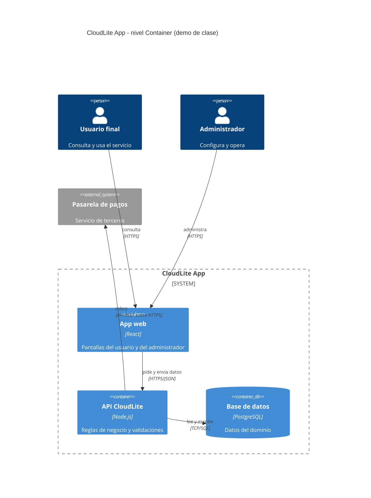

# Guion docente — Clase 4: Microservicios · Arquitecturas distribuidas

## Información de la clase
- Asignatura: Arquitectura de Sistemas Computacionales (FI303380)
- Duración del bloque: **120 min**
- Tipo: Clase regular (teoría + taller PI) · encuentro síncrono
- Enfoque: **Proyecto Integrador CloudLite App** (parte práctica)
- Sin fechas de periodo · sin bio · sin mapa completo del curso

## Objetivos de la clase
- Contrastar monolito vs microservicios con criterios de equipo y acoplamiento.
- Modelar CloudLite en C4 Container (Mermaid) con 2–5 cajas justificadas.
- Definir 3 contratos con verbo, ruta y error de negocio, y nombrar 3 riesgos de distribución.

## Hoy avanzamos el PI en…
**Diagramar componentes/servicios de CloudLite y sus contratos**

**Entregable concreto:** Diagrama C4 Container en Mermaid + tabla de 3 contratos + 3 riesgos de distribución

**Herramienta:** draw.io o Excalidraw para bocetar · Mermaid dentro de ExamLab para entregar

## Fundamento teórico para el docente
## Apoyo por diapositiva

Todo lo que hay que decir **esta proyectado**. Esta seccion dice que subrayar en cada lamina, no repite su contenido.

**[Slide 8] De donde viene la clase y que se abre hoy** — 6 vinetas.

**[Slide 9] Monolito: lo que la palabra realmente significa (1/3)** — 7 vinetas.
  - La palabra decisiva es independiente, y admite una prueba de una linea que el docente debe usar como criterio de correccion: si para poner en produccion el servicio A hay que desplegar tambien el servicio B, entonces A y B no son dos microservicios, son un solo sistema partido en dos repositorios, con todos los costos de la distribucion y ninguno de sus beneficios.

**[Slide 10] Monolito: lo que la palabra realmente significa (2/3)** — 6 vinetas.

**[Slide 11] Monolito: lo que la palabra realmente significa (3/3)** — 7 vinetas.

**[Slide 12] Las tres reglas del nivel Container y la trazabilidad con el Context (1/2)** — 8 vinetas.

**[Slide 13] Las tres reglas del nivel Container y la trazabilidad con el Context (2/2)** — 7 vinetas.

**[Slide 14] C4Container en Mermaid: la sintaxis que la plataforma renderiza (1/2)** — 7 vinetas.
  - Eso cambia lo que el docente tiene que ensenar, porque un boceto correcto escrito con la sintaxis equivocada no renderiza y entonces no hay diagrama que calificar.
  - Vale la pena decir en voz alta que aqui el uso de una IA es legitimo y ademas recomendado: pasar un boceto a codigo Mermaid es justo la tarea mecanica en la que ayuda sin sustituir el criterio.

**[Slide 15] C4Container en Mermaid: la sintaxis que la plataforma renderiza (2/2)** — 5 vinetas.

**[Slide 16] Primer ejemplo: los tres contenedores de CloudLite Turnos (1/2)** — 6 vinetas.

**[Slide 17] Primer ejemplo: los tres contenedores de CloudLite Turnos (2/2)** — 4 vinetas.

**[Slide 18] Los contratos: cuatro datos por fila y un 409 obligatorio (1/2)** — 8 vinetas.
  - Conviene tambien tener a mano la diferencia con sus vecinos, porque se confunden: 400 es que la peticion esta mal formada, 401 que no se sabe quien eres, 403 que se sabe y no te corresponde, 404 que no existe, 422 que esta bien formada pero sus datos no pasan una validacion, y 409 que choca con el estado actual.

**[Slide 19] Los contratos: cuatro datos por fila y un 409 obligatorio (2/2)** — 7 vinetas.

**[Slide 20] Lo que se paga al distribuir: la red no es una llamada de funcion** — 7 vinetas.

**[Slide 21] Timeout, reintento, idempotencia y circuit breaker (1/2)** — 4 vinetas.

**[Slide 22] Timeout, reintento, idempotencia y circuit breaker (2/2)** — 3 vinetas.

**[Slide 23] Los datos: donde se rompen los proyectos academicos (1/2)** — 5 vinetas.

**[Slide 24] Los datos: donde se rompen los proyectos academicos (2/2)** — 4 vinetas.

**[Slide 25] El tercer entregable: los tres riesgos, y por que son esos tres (1/3)** — 6 vinetas.
  - Conviene dictarlos asi, porque un estudiante que entiende por que son esos tres no escribe generalidades.

**[Slide 26] El tercer entregable: los tres riesgos, y por que son esos tres (2/3)** — 6 vinetas.

**[Slide 27] El tercer entregable: los tres riesgos, y por que son esos tres (3/3)** — 4 vinetas.

**[Slide 28] Preguntas frecuentes y cierre conceptual () (1/2)** — 7 vinetas.
  - Conviene cerrar ubicando el curso: este diagrama es el ultimo insumo del Parcial 1 de la Clase 5; en la Clase 6 cada flecha se convertira en una superficie de ataque que hay que proteger; en la Clase 7 estas mismas cajas se reubicaran en un diagrama de despliegue con zonas publicas y privadas, conservando exactamente los mismos nombres; en la Clase 8 cada contenedor implicara su propio pipeline de integracion continua; y en las Clases 12 y 13 se preguntara cual de estas piezas es el cuello de botella y cual se puede replicar.

**[Slide 29] Preguntas frecuentes y cierre conceptual () (2/2)** — 7 vinetas.

## Referencias a diapositivas
Numeración real del deck `Clases/Clase 4 - Microservicios y arquitecturas distribuidas/Presentacion.pptx` (solo tema
de esta clase). Las etiquetas [Slide N] del plan y del fundamento apuntan aquí.

1. Portada · Clase 4 · Microservicios · Arquitecturas distribuidas
2. Agenda de hoy (120 min)
3. Objetivos de la clase
4. Monolito vs microservicios (para el PI)
5. C4-lite: del Context a los Containers
6. Los tres contratos de CloudLite: cuatro datos por fila
7. Distribuido implica fallos
8. De donde viene la clase y que se abre hoy
9. Monolito: lo que la palabra realmente significa (1/3)
10. Monolito: lo que la palabra realmente significa (2/3)
11. Monolito: lo que la palabra realmente significa (3/3)
12. Las tres reglas del nivel Container y la trazabilidad con el Context (1/2)
13. Las tres reglas del nivel Container y la trazabilidad con el Context (2/2)
14. C4Container en Mermaid: la sintaxis que la plataforma renderiza (1/2)
15. C4Container en Mermaid: la sintaxis que la plataforma renderiza (2/2)
16. Primer ejemplo: los tres contenedores de CloudLite Turnos (1/2)
17. Primer ejemplo: los tres contenedores de CloudLite Turnos (2/2)
18. Los contratos: cuatro datos por fila y un 409 obligatorio (1/2)
19. Los contratos: cuatro datos por fila y un 409 obligatorio (2/2)
20. Lo que se paga al distribuir: la red no es una llamada de funcion
21. Timeout, reintento, idempotencia y circuit breaker (1/2)
22. Timeout, reintento, idempotencia y circuit breaker (2/2)
23. Los datos: donde se rompen los proyectos academicos (1/2)
24. Los datos: donde se rompen los proyectos academicos (2/2)
25. El tercer entregable: los tres riesgos, y por que son esos tres (1/3)
26. El tercer entregable: los tres riesgos, y por que son esos tres (2/3)
27. El tercer entregable: los tres riesgos, y por que son esos tres (3/3)
28. Preguntas frecuentes y cierre conceptual () (1/2)
29. Preguntas frecuentes y cierre conceptual () (2/2)
30. Ejemplo de diagrama C4 — nivel Containers
31. Microservicios de verdad vs microservicios teatro
32. C4Container en Mermaid: el molde que ExamLab renderiza
33. Herramientas de hoy
34. Del boceto a ExamLab (diagrama)
35. PI CloudLite — entregable de hoy
36. Manos a la obra (paso a paso)
37. Para continuar (PI)
38. Clase 4 · PI en movimiento

## Plan de clase minuto a minuto (120 min)

### 0–10 · Encuadre PI · [Slide 2][Slide 3][Slide 35]
Di casi literal: «Hoy avanzamos el PI CloudLite App en: **Diagramar componentes/servicios de CloudLite y sus contratos**.
Entregable concreto: Diagrama C4 Container en Mermaid + tabla de 3 contratos + 3 riesgos de distribución.
Teoría breve y luego taller; no es un lab suelto.»
Pasa la diapositiva de agenda y la de objetivos. Abre el enunciado PI si alguien aún no lo tiene.
Pregunta de arranque (1 min): «¿En qué quedó tu CloudLite la clase pasada?» — sirve para detectar estudiantes rezagados antes de avanzar.

### 10–40 · Teoría Core (al servicio del taller) · desde [Slide 4]
Cubre estos conceptos, en este orden, ~7 min cada uno, con su diapositiva:
- **Monolito vs microservicios (para el PI)** · [Slide 4]
- **C4-lite: del Context a los Containers** · [Slide 5]
- **Los tres contratos de CloudLite: cuatro datos por fila** · [Slide 6]
- **Distribuido implica fallos** · [Slide 7]

**Ninguna se salta**: cada una de esas diapositivas es el mecanismo con que se resuelve
al menos una pregunta de la actividad calificada de hoy.
El desarrollo completo de cada uno está arriba, en «Fundamento teórico para el docente»:
esa sección está escrita para que puedas dictarla sin consultar otra fuente.
Cada 8–10 min amarra al artefacto: «esto es lo que van a dejar hoy en su informe/diagrama/repo».
Pide un estudiante voluntario y usa SU dominio como ejemplo en vivo (no el de la demo).

### 40–55 · Demo en vivo · [Slide 34]
Herramienta del día: **draw.io o Excalidraw para bocetar · Mermaid dentro de ExamLab para entregar**.
**Demo que usted debe poder repetir:** Convertir el Context de la Clase 1 en Containers, y dejarlo renderizado en ExamLab

1. Abra el diagrama C4 Context de la demo de Clase 1 y haga zoom a la caja «CloudLite App». Diga: «hoy no dibujamos otro sistema, abrimos este».
2. Reemplace esa caja por 3 cajas internas: «App web», «API de turnos» y «Base de turnos». Escriba en cada una sus TRES datos: nombre, tecnologia y responsabilidad en una frase.
3. Senale la base de datos y diga: «esta no es un Container mas, es un ALMACEN; en el codigo va como ContainerDb y son 2 puntos». Deje el cliente y el correo FUERA del recuadro del sistema.
4. Rotule CADA flecha con protocolo Y formato: «HTTPS/JSON», «TCP/SQL». Borre a proposito una etiqueta y pregunte que se pierde: sin ella nadie puede decir por donde se rompe.
5. Proponga una cuarta caja, el worker de avisos, y pida la razon de negocio. Si nadie la da, borrela en vivo: «eso es microservicios teatro». Si alguien la da (el correo tarda y puede fallar), quedese con ella y anote la razon al lado.
6. Verifique nombre por nombre contra el C4 Context de la Clase 1: si alli decia «Pasarela de pagos», aqui no puede decir «Pagos». Son 2 puntos de la pregunta 13.
7. Cierre en ExamLab: pegue el codigo Mermaid de la diapositiva del molde, cambie los nombres por los del ejemplo del tablero y proyecte el resultado RENDERIZADO. Diga: «si no renderiza, no hay diagrama; se revisa antes de enviar».

**Referencia del resultado:** C4 Container de la demo (el Context de la Clase 1, ya abierto). Si la red falla o prefiere no dibujar a mano, pegue este codigo en la pregunta de diagrama de ExamLab y proyectelo renderizado; tambien sirve para volver a generar la imagen en cualquier editor que soporte Mermaid.

Narra los clics en voz alta. Si falla la red, proyecta la [Slide 32], que ya trae el resultado de la demo, y recórrela rótulo por rótulo.
Cierra la demo con: «copien la estructura, no el dominio de mi ejemplo.»

**Cierra la demo dentro de ExamLab** [Slide 34] — es el paso que el estudiante no adivina: pasa el boceto a codigo Mermaid con ayuda de una IA, pegalo en la pregunta de diagrama y muestralo renderizado.

**Del boceto al codigo Mermaid.** No subas una imagen: la respuesta de esta pregunta es texto Mermaid.

- **1. Disena visual** Dibuja el diagrama como quieras en Excalidraw o draw.io: es mas rapido arrastrar cajas que escribir codigo, y ahi es donde piensas el modelo.
- **2. Traduce con IA** Copia o describe tu boceto a una IA y pidele el codigo Mermaid: «convierte este diagrama a Mermaid usando `C4Container`». Revisa el resultado: la IA acierta la sintaxis, no tu modelo.
- **3. Pega y renderiza en ExamLab** Pega ese codigo en la caja de texto de la pregunta y mira como lo dibuja la plataforma. Si no renderiza, corrige ahi mismo: lo que se califica es el diagrama renderizado dentro de ExamLab.
- **4. Guarda el PNG para tu PI** Exporta tambien la imagen a la carpeta de tu Proyecto Integrador. Esa copia es para tu informe; no reemplaza la respuesta en la plataforma.

### 55–100 · Taller guiado PI (individual · equipos de 2–3 solo si tú los autorizaste) · [Slide 36]
Proyecta la lista de pasos del taller del estudiante (está en la sección «Actividad / taller» de este guion).
Circula por mesas/Meet con la lista de errores frecuentes de abajo en la mano: son los que vas a ver hoy.
A los 80 min anuncia: «faltan 20 min. Falta evidencia: PNG/YAML/enlace. Empiecen a subir borrador.»

### 100–115 · Comprobación y evidencias
Haz 3–4 de las preguntas de comprobación oral de abajo, a personas distintas y al azar
(no al que levanta la mano). Es el mecanismo para verificar la regla de los 60 segundos.
Aplica el quiz corto de `Kit docente/Clase 4/Quiz Clase 4 - Microservicios y arquitecturas distribuidas.docx`
(la clave va en archivo aparte y **no se proyecta**).
Mientras responden, verifica que el entregable esté realmente subido.
Retroalimenta 2–3 estudiantes en voz alta, nombrando el error y la corrección concreta.

### 115–120 · Cierre · [Slide 38]
Di: «Queda avanzado: Diagramar componentes/servicios de CloudLite y sus contratos.
Criterio de éxito: el estudiante explica su artefacto en 60 s.
Entrega domingo 23:59 en ExamLab. Siguiente hito del PI según el plan.»

## Actividad / taller (detalle)
1. Paso 1: decida en la pregunta 12 si su CloudLite es un monolito modular o microservicios, con los dos criterios aplicados a su caso (tamano del equipo con numero y plazo, y que partes cambian juntas) y lo que gana y pierde; verifique que no escribio «un poco de los dos», porque eso vale cero.
2. Paso 2: modele en la pregunta 13 el C4 Container partiendo del C4 Context de la pregunta 3, con entre 2 y 5 contenedores coherentes con la decision anterior, los almacenes de datos como ContainerDb y toda flecha con protocolo y formato; verifique que los nombres de sistema, actores y sistemas externos sean identicos a los del Context.
3. Paso 3: liste en la pregunta 14 los 3 contratos con quien llama a quien usando los nombres exactos del diagrama, el verbo y la ruta (o el evento) y el error de negocio con su codigo y su significado en el dominio; verifique que al menos uno sea un 409 de conflicto y que ninguno diga «500 error del servidor».
4. Paso 4: analice en la pregunta 15 los tres riesgos de distribucion nombrando una caja concreta que se cae, contando los saltos de red de una operacion de punta a punta y nombrando un dato expuesto a inconsistencia; con esto la actividad del Corte 1 queda completa y se entrega en ExamLab antes del domingo 23:59 de esta semana.

### Criterio de éxito
- Artefacto integrado al paquete PI (no archivo huérfano).
- Evidencia adjunta.
- Explicación oral de 60 s por estudiante (muestreo; si autorizaste equipos, pregunta a cualquier integrante).

## Errores frecuentes del estudiante (y cómo corregirlos en el momento)
- Inventar 6 u 8 servicios para verse sofisticados. Pregunte por cada uno: que responsabilidad de negocio propia tiene y quien lo despliega por separado.
- Flechas sin etiqueta, o con media etiqueta. No basta «HTTP» ni «SQL»: toda flecha lleva protocolo Y formato de datos («HTTPS/JSON», «TCP/SQL»).
- Marcar la base de datos como `Container` y no como `ContainerDb`. Son 2 puntos y se pierden en un solo caracter; revise ese renglon del codigo antes de que envien.
- Renombrar las cajas respecto al C4 Context de la pregunta 3 («Pagos» donde antes decia «Pasarela de pagos»). Pidales los dos diagramas lado a lado y compare palabra por palabra.
- Responder «un poco de los dos» en la decision de la pregunta 12: vale cero. Devuelvala pidiendo UNA opcion y las dos mitades del trade-off, lo que se gana y lo que se pierde.
- Riesgos genericos tipo «los microservicios son mas complejos» o «puede haber latencia». No nombran caja, ni salto, ni dato: exija los tres riesgos concretos que pide el enunciado, y en el primero, que digan tambien que SIGUE funcionando.

## Preguntas de comprobación oral (no son del quiz)
Úsalas en el tramo 100–115, a personas distintas y al azar.
1. Que justifica que dos funciones vivan en servicios separados?
1. Que cambia cuando una llamada de funcion se vuelve una llamada de red?
1. Como se llama en su C4 Containers el servicio que expone la API? Se llama igual en su C4 Context de la Clase 1?
1. Cual de sus cajas es un almacen y como se escribe en el codigo del diagrama?
1. Cuantos saltos de red tiene la operacion principal de su sistema, contados sobre su propio diagrama?
1. Si se cae su base de datos, que deja de funcionar y que SIGUE funcionando?

## Solución del taller (privada)
`Kit docente/Clase 4/Solucion Taller Clase 4 - CloudLite.docx` — es la referencia con la que
comparas lo que entregan los estudiantes. **No proyectarla completa** antes de que trabajen.

## Quiz
`Kit docente/Clase 4/Quiz Clase 4 - Microservicios y arquitecturas distribuidas.docx` (versión estudiante, sin respuestas)
y `Kit docente/Clase 4/Quiz Clase 4 - CLAVE DOCENTE.docx` (clave, privada).

## Capturas sugeridas
- 📸 La herramienta del día en uso con el artefacto CloudLite [[captura: demo-clase04.png | receta: 1) Abre draw.io o Excalidraw para bocetar · Mermaid dentro de ExamLab para entregar y repite la demo de este guion.  2) Captura solo la ventana útil, no el escritorio completo.  3) Recorta a ~1200 px de ancho.  4) Guárdala como Kit docente/Clase 4/Capturas/demo-clase04.png.  5) Vuelve a generar el guion y la imagen queda embebida aquí sola. Detalle en Capturas/README.txt.]]
- 📸 Evidencia del entregable de un estudiante (diagrama / YAML / lab) [[captura: evidencia-clase04.png | receta: 1) Con permiso del estudiante, captura su artefacto de hoy.  2) Recorta nombre y correo antes de guardar.  3) Guárdala como Kit docente/Clase 4/Capturas/evidencia-clase04.png.  4) Es para tu registro del corte; no se proyecta en clase.]]

## Notas operativas
- Plataforma de entrega: ExamLab (https://uniaj.examlab.workers.dev/). No es la plataforma oficial de la UNIAJC; la universidad no tiene campus virtual propio.
- Prohibido pedir cloud con tarjeta: todo el curso corre con free tier o en el navegador.
- Día de parcial = solo evaluación (no aplica a esta clase).
