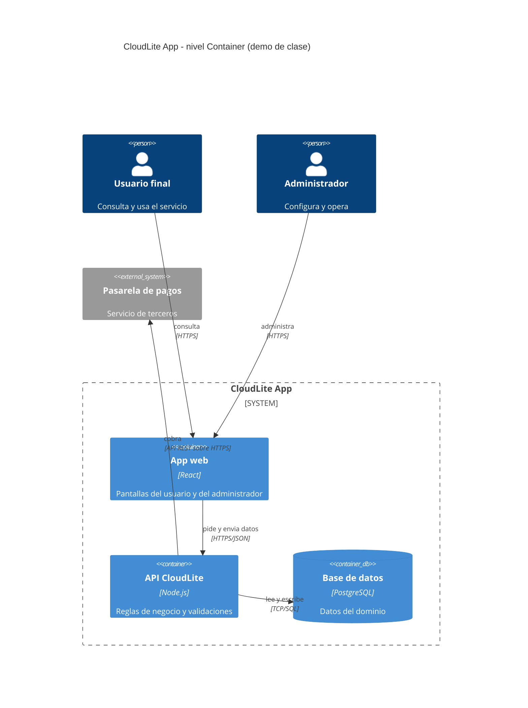

# Guion docente — Clase 4: Microservicios · Arquitecturas distribuidas

## Información de la clase
- Asignatura: Arquitectura de Sistemas Computacionales (FI303380)
- Duración del bloque: **120 min**
- Tipo: Clase regular (teoría + taller PI) · encuentro síncrono
- Enfoque: **Proyecto Integrador CloudLite App** (parte práctica)
- Sin fechas de periodo · sin bio · sin mapa completo del curso

## Objetivos de la clase
- Contrastar monolito vs microservicios con criterios de equipo y acoplamiento.
- Modelar CloudLite en C4 Container (Mermaid) con 2–5 cajas justificadas.
- Definir 3 contratos con verbo, ruta y error de negocio, y nombrar 3 riesgos de distribución.

## Hoy avanzamos el PI en…
**Diagramar componentes/servicios de CloudLite y sus contratos**

**Entregable concreto:** Diagrama C4 Container en Mermaid + tabla de 3 contratos + 3 riesgos de distribución

**Herramienta:** Navegador · editor de diagramas del curso (Mermaid) · boceto libre opcional

## Fundamento teórico para el docente
## Apoyo por diapositiva

Todo lo que hay que decir **esta proyectado**. Esta seccion dice que subrayar en cada lamina, no repite su contenido.

**[Slide 8] De donde viene la clase y que se abre hoy** — 5 vinetas.
  - (No se proyecta) La Clase 3 dejo al estudiante con una unidad de despliegue concreta en las manos: una imagen que se ejecuta como contenedor.
  - (No se proyecta) La Clase 1 le dejo una caja negra llamada CloudLite App con actores y sistemas externos alrededor.
  - (No se proyecta) La pregunta que organiza la clase no es que son los microservicios, sino una mas incomoda y mas util: cada vez que un sistema se parte en dos, se gana algo y se paga algo, y hoy hay que decir explicitamente que se gana y que se paga.
  - (No se proyecta) Un estudiante que solo aprende la primera mitad de esa frase sale convencido de que mas servicios es mejor arquitectura, que es exactamente el error que esta clase debe prevenir.

**[Slide 9] Monolito: lo que la palabra realmente significa (1/4)** — 5 vinetas.
  - La decision se sostiene con exactamente dos criterios.
  - La razon de fondo es la que se repite en el cierre: la cantidad de servicios que una organizacion sostiene es funcion del numero de equipos autonomos, no del gusto por la modularidad.
  - Esa frase tiene decision, 2 criterios y las 2 mitades del trade-off.
  - El modular conserva la opcion de extraer un servicio despues.
  - (No se proyecta) Empecemos por el termino que el estudiante trae con mala fama.
  - (No se proyecta) La palabra decisiva es independiente, y admite una prueba de una linea que el docente debe usar como criterio de correccion: si para poner en produccion el servicio A hay que desplegar tambien el servicio B, entonces A y B no son dos microservicios, son un solo sistema partido en dos repositorios, con todos los costos de la distribucion y ninguno de sus beneficios.
  - (No se proyecta) Aqui hay que repetir la advertencia de la clase pasada, porque es la fuente numero uno de confusion: contenedor en C4 no significa contenedor de Docker.
  - (No se proyecta) Con eso claro, lo primero que el estudiante entrega hoy es la decision, y tiene una forma exigida que conviene dictar literal porque se corrige asi.
  - (No se proyecta) Sin la segunda mitad no hubo decision, hubo una justificacion escrita despues de los hechos —el mismo defecto que la Clase 2 senalaba en los ADR sin consecuencias negativas—.

**[Slide 10] Monolito: lo que la palabra realmente significa (2/4)** — 4 vinetas.

**[Slide 11] Monolito: lo que la palabra realmente significa (3/4)** — 5 vinetas.

**[Slide 12] Monolito: lo que la palabra realmente significa (4/4)** — 3 vinetas.

**[Slide 13] Las tres reglas del nivel Container y la trazabilidad con el Context (1/2)** — 5 vinetas.
  - Nombre, tecnologia y responsabilidad en una frase.
  - «HTTP» a secas no dice como viajan los datos y «SQL» a secas no dice sobre que transporte; con las dos mitades, cualquiera que lea el diagrama sabe por donde puede romperse.
  - (No se proyecta) Antes del ejemplo conviene fijar las tres reglas con las que se corrige el diagrama, porque cada una tiene puntos asignados y las tres se pierden por descuido y no por no saber.
  - (No se proyecta) Y hay una cuarta condicion que no es del nivel sino de la continuidad del proyecto: los nombres tienen que ser IDENTICOS a los del C4 Context de la Clase 1.
  - (No se proyecta) No es pedanteria de notacion; es lo unico que permite afirmar que los dos dibujos son el mismo sistema visto desde distinta altura, y es exactamente lo que se volvera a verificar en la Clase 7 contra el diagrama de despliegue y en la Clase 11 en la auditoria del paquete.
  - (No se proyecta) Ese es el error de dibujo mas comun de la clase, meter al usuario o a la pasarela de pagos dentro del sistema propio, y se detecta en dos segundos preguntando quien lo opera.

**[Slide 14] Las tres reglas del nivel Container y la trazabilidad con el Context (2/2)** — 4 vinetas.

**[Slide 15] C4Container en Mermaid: la sintaxis que se renderiza (1/2)** — 4 vinetas.
  - (No se proyecta) Eso cambia lo que el docente tiene que ensenar, porque un boceto correcto escrito con la sintaxis equivocada no renderiza y entonces no hay diagrama que calificar.
  - (No se proyecta) Son cinco reglas de escritura y conviene recorrerlas sobre la diapositiva, linea por linea.
  - (No se proyecta) C4Context es el nivel de la Clase 1 y graph TD es otro tipo de diagrama, y cualquiera de los dos deja la respuesta en el nivel equivocado.
  - (No se proyecta) Vale la pena decir en voz alta que aqui el uso de una IA es legitimo y ademas recomendado: pasar un boceto a codigo Mermaid es justo la tarea mecanica en la que ayuda sin sustituir el criterio.
  - (No se proyecta) Lo que NO delega el estudiante es la revision, y hay tres cosas que tiene que verificar el mismo antes de enviar, porque son las que la IA equivoca con frecuencia: que la primera linea sea C4Container, que la base de datos haya quedado como ContainerDb y no como Container, y que ninguna relacion haya perdido la mitad de su etiqueta.
  - (No se proyecta) Un codigo que no renderiza vale cero, y es el unico punto del taller donde el estudiante puede comprobar su propia nota antes de entregar.

**[Slide 16] C4Container en Mermaid: la sintaxis que se renderiza (2/2)** — 3 vinetas.

**[Slide 17] Primer ejemplo: los tres contenedores de CloudLite Turnos** — 5 vinetas.
  - La flecha entre la web y la API dice «HTTPS/JSON, consulta disponibilidad y crea reservas»; la flecha entre la API y la base de datos dice «TCP, lee y escribe turnos».
  - Con eso ya existe un diagrama valido y defendible.
  - Si la API espera ese envio antes de responder, la reserva de un turno hereda esa latencia y ese riesgo.
  - Esa es una razon legitima para separar: se agrega una cola de mensajes y un trabajador de notificaciones, la API escribe el turno, publica un mensaje y responde en decenas de milisegundos, y el trabajador envia el correo despues, con reintentos si falla.
  - (No se proyecta) Primer ejemplo concreto, y conviene construirlo en el tablero en vivo.

**[Slide 18] Los contratos: cuatro datos por fila y un 409 obligatorio (1/2)** — 6 vinetas.
  - (No se proyecta) Un 500 no es un error de negocio, es una falla del sistema; nadie lo disena, y por eso poner 500 en esa columna es la senal de que el estudiante no distinguio las dos cosas.
  - (No se proyecta) La diapositiva proyecta los tres contratos resueltos sobre CloudLite Turnos y conviene recorrerlos leyendo la cuarta columna en voz alta, porque es lo que hay que replicar.
  - (No se proyecta) Dos exigencias mas, que valen puntos y se pierden sin darse cuenta.
  - (No se proyecta) Conviene tambien tener a mano la diferencia con sus vecinos, porque se confunden: 400 es que la peticion esta mal formada, 401 que no se sabe quien eres, 403 que se sabe y no te corresponde, 404 que no existe, 422 que esta bien formada pero sus datos no pasan una validacion, y 409 que choca con el estado actual.
  - (No se proyecta) Tres filas que digan «App web → API» describen un solo canal contado tres veces, y lo que se esta evaluando es si el estudiante entendio que su sistema tiene varias fronteras.

**[Slide 19] Los contratos: cuatro datos por fila y un 409 obligatorio (2/2)** — 5 vinetas.

**[Slide 20] Lo que se paga al distribuir: la red no es una llamada de funcion** — 5 vinetas.
  - (No se proyecta) Hay una aritmetica que conviene mostrar porque impresiona con razon: si una peticion del usuario atraviesa en cadena cinco servicios y cada uno esta disponible el 99,9 % del tiempo, la disponibilidad del recorrido completo es 0,999 elevado a la quinta potencia, alrededor del 99,5 %, lo que pasa de unos 43 minutos de indisponibilidad al mes a mas de tres horas.

**[Slide 21] Timeout, reintento, idempotencia y circuit breaker (1/2)** — 3 vinetas.
  - De ahi salen cuatro mecanismos que el diagrama y la tabla deben poder mencionar.
  - Los reintentos exigen idempotencia, que significa que ejecutar la misma operacion dos veces produzca el mismo resultado que ejecutarla una vez.

**[Slide 22] Timeout, reintento, idempotencia y circuit breaker (2/2)** — 2 vinetas.

**[Slide 23] Los datos: donde se rompen los proyectos academicos (1/2)** — 5 vinetas.
  - Eso introduce consistencia eventual, es decir un lapso durante el cual dos partes del sistema tienen versiones distintas de la verdad, con consecuencias visibles para el usuario.
  - (No se proyecta) La postura honesta para este curso es que un CloudLite con una base de datos compartida y propiedad de tablas claramente documentada resulta aceptable, siempre que el estudiante lo registre como un trade-off consciente en su informe y no lo presente como microservicios puros.

**[Slide 24] Los datos: donde se rompen los proyectos academicos (2/2)** — 4 vinetas.

**[Slide 25] Los tres riesgos de distribuir, y por que son esos tres (1/3)** — 5 vinetas.
  - El primero pregunta que se cae.
  - El segundo pregunta cuantos saltos de red tiene una operacion de punta a punta, y se responde con un numero, contado sobre el propio dibujo.
  - (No se proyecta) Conviene dictarlos asi, porque un estudiante que entiende por que son esos tres no escribe generalidades.
  - (No se proyecta) «Se cae todo» vale la mitad de los puntos, y con razon: en un sistema bien partido nunca se cae todo, y el ejercicio consiste precisamente en descubrir que algunas cosas sobreviven.
  - (No se proyecta) Ese razonamiento es el que en la Clase 7 permite decidir que va en cada zona de red y en la Clase 13 que pieza vale la pena replicar.
  - (No se proyecta) Devolverle el diagrama es mas util que darle un ejemplo.

**[Slide 26] Los tres riesgos de distribuir, y por que son esos tres (2/3)** — 5 vinetas.

**[Slide 27] Los tres riesgos de distribuir, y por que son esos tres (3/3)** — 3 vinetas.

**[Slide 28] Preguntas frecuentes y cierre conceptual** — 5 vinetas.

**[Slide 29] El C4 Container en Mermaid: la forma que un visor renderiza** — 17 vinetas.

**[Slide 30] Lo que importa del diagrama, y no es el dibujo** — 13 vinetas.

## Referencias a diapositivas
Numeración real del deck `Clases/Clase 4 - Microservicios y arquitecturas distribuidas/Presentacion.pptx` (solo tema
de esta clase). Las etiquetas [Slide N] del plan y del fundamento apuntan aquí.

1. Portada · Clase 4 · Microservicios · Arquitecturas distribuidas
2. Agenda de hoy (120 min)
3. Objetivos de la clase
4. Monolito vs microservicios (para el PI)
5. C4-lite: del Context a los Containers
6. Los tres contratos de CloudLite: cuatro datos por fila
7. Distribuido implica fallos
8. De donde viene la clase y que se abre hoy
9. Monolito: lo que la palabra realmente significa (1/4)
10. Monolito: lo que la palabra realmente significa (2/4)
11. Monolito: lo que la palabra realmente significa (3/4)
12. Monolito: lo que la palabra realmente significa (4/4)
13. Las tres reglas del nivel Container y la trazabilidad con el Context (1/2)
14. Las tres reglas del nivel Container y la trazabilidad con el Context (2/2)
15. C4Container en Mermaid: la sintaxis que se renderiza (1/2)
16. C4Container en Mermaid: la sintaxis que se renderiza (2/2)
17. Primer ejemplo: los tres contenedores de CloudLite Turnos
18. Los contratos: cuatro datos por fila y un 409 obligatorio (1/2)
19. Los contratos: cuatro datos por fila y un 409 obligatorio (2/2)
20. Lo que se paga al distribuir: la red no es una llamada de funcion
21. Timeout, reintento, idempotencia y circuit breaker (1/2)
22. Timeout, reintento, idempotencia y circuit breaker (2/2)
23. Los datos: donde se rompen los proyectos academicos (1/2)
24. Los datos: donde se rompen los proyectos academicos (2/2)
25. Los tres riesgos de distribuir, y por que son esos tres (1/3)
26. Los tres riesgos de distribuir, y por que son esos tres (2/3)
27. Los tres riesgos de distribuir, y por que son esos tres (3/3)
28. Preguntas frecuentes y cierre conceptual
29. El C4 Container en Mermaid: la forma que un visor renderiza
30. Lo que importa del diagrama, y no es el dibujo
31. Ejemplo de diagrama C4 — nivel Containers
32. Microservicios de verdad vs microservicios teatro
33. C4Container en Mermaid: el molde que un visor renderiza
34. Del boceto al código Mermaid
35. Clase 4 · cierre conceptual

## Plan de clase minuto a minuto (120 min)

### 0–10 · Encuadre PI · [Slide 2][Slide 3]
Di casi literal: «Hoy avanzamos el PI CloudLite App en: **Diagramar componentes/servicios de CloudLite y sus contratos**.
Entregable concreto: Diagrama C4 Container en Mermaid + tabla de 3 contratos + 3 riesgos de distribución.
Teoría breve y luego taller; no es un lab suelto.»
Pasa la diapositiva de agenda y la de objetivos. Abre el enunciado PI si alguien aún no lo tiene.
Pregunta de arranque (1 min): «¿En qué quedó tu CloudLite la clase pasada?» — sirve para detectar estudiantes rezagados antes de avanzar.

### 10–40 · Teoría Core (al servicio del taller) · desde [Slide 4]
Cubre estos conceptos, en este orden, ~7 min cada uno, con su diapositiva:
- **Monolito vs microservicios (para el PI)** · [Slide 4]
- **C4-lite: del Context a los Containers** · [Slide 5]
- **Los tres contratos de CloudLite: cuatro datos por fila** · [Slide 6]
- **Distribuido implica fallos** · [Slide 7]

**Ninguna se salta**: cada una de esas diapositivas es el mecanismo con que se resuelve
al menos una pregunta de la actividad calificada de hoy.
El desarrollo completo de cada uno está arriba, en «Fundamento teórico para el docente»:
esa sección está escrita para que puedas dictarla sin consultar otra fuente.
Cada 8–10 min amarra al artefacto: «esto es lo que van a dejar hoy en su informe/diagrama/repo».
Pide un estudiante voluntario y usa SU dominio como ejemplo en vivo (no el de la demo).

### 40–55 · Demo en vivo · [Slide 34]
Herramienta del día: **Navegador · editor de diagramas del curso (Mermaid) · boceto libre opcional**.
**Demo que usted debe poder repetir:** Convertir el Context de la Clase 1 en Containers, y dejarlo renderizado en la plataforma

1. Abra el diagrama C4 Context de la demo de Clase 1 y haga zoom a la caja «CloudLite App». Diga: «hoy no dibujamos otro sistema, abrimos este».
2. Reemplace esa caja por 3 cajas internas: «App web», «API de turnos» y «Base de turnos». Escriba en cada una sus TRES datos: nombre, tecnologia y responsabilidad en una frase.
3. Senale la base de datos y diga: «esta no es un Container mas, es un ALMACEN; en el codigo va como ContainerDb y son 2 puntos». Deje el cliente y el correo FUERA del recuadro del sistema.
4. Rotule CADA flecha con protocolo Y formato: «HTTPS/JSON», «TCP/SQL». Borre a proposito una etiqueta y pregunte que se pierde: sin ella nadie puede decir por donde se rompe.
5. Proponga una cuarta caja, el worker de avisos, y pida la razon de negocio. Si nadie la da, borrela en vivo: «eso es microservicios teatro». Si alguien la da (el correo tarda y puede fallar), quedese con ella y anote la razon al lado.
6. Verifique nombre por nombre contra el C4 Context de la Clase 1: si alli decia «Pasarela de pagos», aqui no puede decir «Pagos». Son 2 puntos de la pregunta 13.
7. Cierre en la plataforma del curso: pegue el codigo Mermaid de la diapositiva del molde, cambie los nombres por los del ejemplo del tablero y proyecte el resultado RENDERIZADO. Diga: «si no renderiza, no hay diagrama; se revisa antes de enviar».

**Referencia del resultado:** C4 Container de la demo (el Context de la Clase 1, ya abierto). Si la red falla o prefiere no dibujar a mano, pegue este codigo en la pregunta de diagrama de la actividad y proyectelo renderizado; tambien sirve para volver a generar la imagen en cualquier editor que soporte Mermaid.

```mermaid
C4Container
    title CloudLite App - nivel Container (demo de clase)
    Person(usuario, "Usuario final", "Consulta y usa el servicio")
    Person(admin, "Administrador", "Configura y opera")
    System_Boundary(cloudlite, "CloudLite App") {
      Container(web, "App web", "React", "Pantallas del usuario y del administrador")
      Container(api, "API CloudLite", "Node.js", "Reglas de negocio y validaciones")
      ContainerDb(db, "Base de datos", "PostgreSQL", "Datos del dominio")
    }
    System_Ext(pagos, "Pasarela de pagos", "Servicio de terceros")
    Rel(usuario, web, "consulta", "HTTPS")
    Rel(admin, web, "administra", "HTTPS")
    Rel(web, api, "pide y envia datos", "HTTPS/JSON")
    Rel(api, db, "lee y escribe", "TCP/SQL")
    Rel(api, pagos, "cobra", "API REST sobre HTTPS")
```

Narra los clics en voz alta. Si falla la red, proyecta la [Slide 33], que ya trae el resultado de la demo, y recórrela rótulo por rótulo.
Cierra la demo con: «copien la estructura, no el dominio de mi ejemplo.»

**Si se hace el taller, cierra la demo en la plataforma del curso** (sin diapositiva: el flujo está en el `Taller … .docx`) — es el paso que el estudiante no adivina: pasa el boceto a codigo Mermaid con ayuda de una IA, pegalo en la pregunta de diagrama y muestralo renderizado.

**Del boceto al codigo Mermaid.** No subas una imagen: la respuesta de esta pregunta es texto Mermaid.

- **1. Disena visual** Dibuja el diagrama como quieras en Excalidraw o draw.io: es mas rapido arrastrar cajas que escribir codigo, y ahi es donde piensas el modelo.
- **2. Traduce con IA** Copia o describe tu boceto a una IA y pidele el codigo Mermaid: «convierte este diagrama a Mermaid usando `C4Container`». Revisa el resultado: la IA acierta la sintaxis, no tu modelo.
- **3. Pega y renderiza en la plataforma del curso** Pega ese codigo en la caja de texto de la pregunta y mira como lo dibuja la plataforma. Si no renderiza, corrige ahi mismo: lo que se califica es el diagrama renderizado dentro de la plataforma del curso.
- **4. Guarda el PNG para tu PI** Exporta tambien la imagen a la carpeta de tu Proyecto Integrador. Esa copia es para tu informe; no reemplaza la respuesta en la plataforma.

### 55–100 · Taller guiado PI (individual · equipos de 2–3 solo si tú los autorizaste) · opcional · sin diapositiva
El taller es **opcional** y ya no está en el deck: si se hace hoy, comparte el `Taller … .docx` de
`Clases/Clase 4 - Microservicios y arquitecturas distribuidas/` (los pasos también están en la sección «Actividad / taller» de este guion).
Circula por mesas/Meet con la lista de errores frecuentes de abajo en la mano: son los que vas a ver hoy.
A los 80 min anuncia: «faltan 20 min. Falta evidencia: PNG/YAML/enlace. Empiecen a subir borrador.»

### 100–115 · Comprobación y evidencias
Haz 3–4 de las preguntas de comprobación oral de abajo, a personas distintas y al azar
(no al que levanta la mano). Es el mecanismo para verificar la regla de los 60 segundos.
Aplica el quiz corto de `Kit docente/Clase 4/Quiz Clase 4 - Microservicios y arquitecturas distribuidas.docx`
(la clave va en archivo aparte y **no se proyecta**).
Mientras responden, verifica que el entregable esté realmente subido.
Retroalimenta 2–3 estudiantes en voz alta, nombrando el error y la corrección concreta.

### 115–120 · Cierre · [Slide 35]
Di: «Queda avanzado: Diagramar componentes/servicios de CloudLite y sus contratos.
Criterio de éxito: el estudiante explica su artefacto en 60 s.
Entrega domingo 23:59 en la plataforma del curso. Siguiente hito del PI según el plan.»

## Actividad / taller (detalle)
1. Paso 1: decida en la pregunta 12 si su CloudLite es un monolito modular o microservicios, con los dos criterios aplicados a su caso (tamano del equipo con numero y plazo, y que partes cambian juntas) y lo que gana y pierde; verifique que no escribio «un poco de los dos», porque eso vale cero.
2. Paso 2: modele en la pregunta 13 el C4 Container partiendo del C4 Context de la pregunta 3, con entre 2 y 5 contenedores coherentes con la decision anterior, los almacenes de datos como ContainerDb y toda flecha con protocolo y formato; verifique que los nombres de sistema, actores y sistemas externos sean identicos a los del Context.
3. Paso 3: liste en la pregunta 14 los 3 contratos con quien llama a quien usando los nombres exactos del diagrama, el verbo y la ruta (o el evento) y el error de negocio con su codigo y su significado en el dominio; verifique que al menos uno sea un 409 de conflicto y que ninguno diga «500 error del servidor».
4. Paso 4: analice en la pregunta 15 los tres riesgos de distribucion nombrando una caja concreta que se cae, contando los saltos de red de una operacion de punta a punta y nombrando un dato expuesto a inconsistencia; con esto la actividad del Corte 1 queda completa y se entrega en la plataforma del curso antes del domingo 23:59 de esta semana.

### Criterio de éxito
- Artefacto integrado al paquete PI (no archivo huérfano).
- Evidencia adjunta.
- Explicación oral de 60 s por estudiante (muestreo; si autorizaste equipos, pregunta a cualquier integrante).

## Errores frecuentes del estudiante (y cómo corregirlos en el momento)
- Inventar 6 u 8 servicios para verse sofisticados. Pregunte por cada uno: que responsabilidad de negocio propia tiene y quien lo despliega por separado.
- Flechas sin etiqueta, o con media etiqueta. No basta «HTTP» ni «SQL»: toda flecha lleva protocolo Y formato de datos («HTTPS/JSON», «TCP/SQL»).
- Marcar la base de datos como `Container` y no como `ContainerDb`. Son 2 puntos y se pierden en un solo caracter; revise ese renglon del codigo antes de que envien.
- Renombrar las cajas respecto al C4 Context de la pregunta 3 («Pagos» donde antes decia «Pasarela de pagos»). Pidales los dos diagramas lado a lado y compare palabra por palabra.
- Responder «un poco de los dos» en la decision de la pregunta 12: vale cero. Devuelvala pidiendo UNA opcion y las dos mitades del trade-off, lo que se gana y lo que se pierde.
- Riesgos genericos tipo «los microservicios son mas complejos» o «puede haber latencia». No nombran caja, ni salto, ni dato: exija los tres riesgos concretos que pide el enunciado, y en el primero, que digan tambien que SIGUE funcionando.

## Preguntas de comprobación oral (no son del quiz)
Úsalas en el tramo 100–115, a personas distintas y al azar.
1. Que justifica que dos funciones vivan en servicios separados?
1. Que cambia cuando una llamada de funcion se vuelve una llamada de red?
1. Como se llama en su C4 Containers el servicio que expone la API? Se llama igual en su C4 Context de la Clase 1?
1. Cual de sus cajas es un almacen y como se escribe en el codigo del diagrama?
1. Cuantos saltos de red tiene la operacion principal de su sistema, contados sobre su propio diagrama?
1. Si se cae su base de datos, que deja de funcionar y que SIGUE funcionando?

## Solución del taller (privada)
`Kit docente/Clase 4/Solucion Taller Clase 4 - CloudLite.docx` — es la referencia con la que
comparas lo que entregan los estudiantes. **No proyectarla completa** antes de que trabajen.

## Quiz
`Kit docente/Clase 4/Quiz Clase 4 - Microservicios y arquitecturas distribuidas.docx` (versión estudiante, sin respuestas)
y `Kit docente/Clase 4/Quiz Clase 4 - CLAVE DOCENTE.docx` (clave, privada).

## Capturas sugeridas
- 📸 La herramienta del día en uso con el artefacto CloudLite [[captura: demo-clase04.png | receta: 1) Abre Navegador · editor de diagramas del curso (Mermaid) · boceto libre opcional y repite la demo de este guion.  2) Captura solo la ventana útil, no el escritorio completo.  3) Recorta a ~1200 px de ancho.  4) Guárdala como Kit docente/Clase 4/Capturas/demo-clase04.png.  5) Vuelve a generar el guion y la imagen queda embebida aquí sola. Detalle en Capturas/README.txt.]]
- 📸 Evidencia del entregable de un estudiante (diagrama / YAML / lab) [[captura: evidencia-clase04.png | receta: 1) Con permiso del estudiante, captura su artefacto de hoy.  2) Recorta nombre y correo antes de guardar.  3) Guárdala como Kit docente/Clase 4/Capturas/evidencia-clase04.png.  4) Es para tu registro del corte; no se proyecta en clase.]]

## Notas operativas
- Plataforma de entrega: la plataforma del curso (la plataforma del curso). No es la plataforma oficial de la UNIAJC; la universidad no tiene campus virtual propio.
- Prohibido pedir cloud con tarjeta: todo el curso corre con free tier o en el navegador.
- Día de parcial = solo evaluación (no aplica a esta clase).
