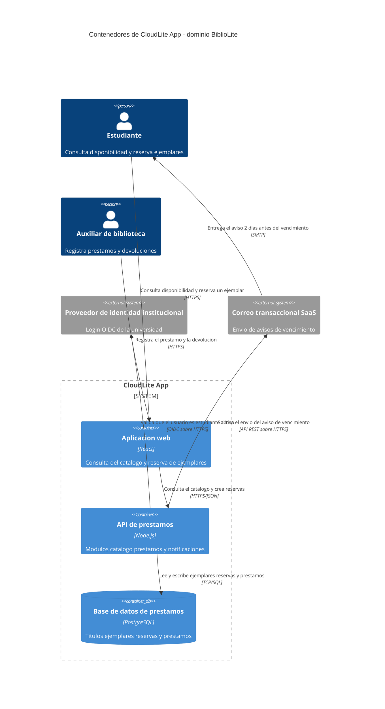
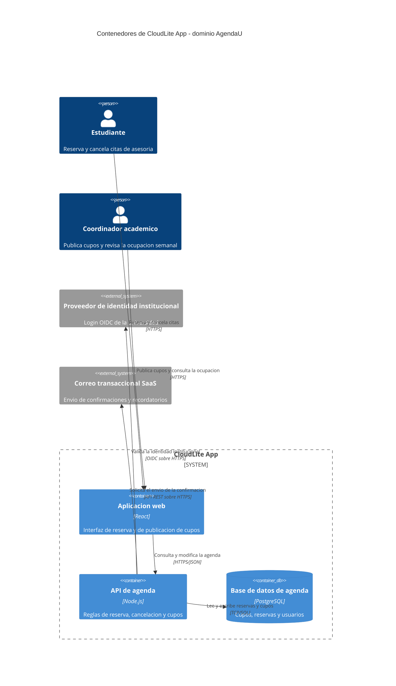

# Solucion — Actividad del Corte 1, preguntas 12 a 15 (monolito modular, C4 Container, contratos y riesgos)

> **DOCUMENTO DOCENTE — PRIVADO.** No publicar en `Clases/` ni en ExamLab antes del cierre de la entrega.

**Resumen:** Las cuatro ultimas preguntas del Corte 1, resueltas sobre **BiblioLite**. Las cuatro son **una sola cadena**: la decision de la 12 fija cuantas cajas puede tener el diagrama de la 13, las cajas de la 13 son los nombres que la 14 tiene que citar textualmente, y la 15 analiza las fronteras que la 13 dibujo. Se califican en ese orden y comparandolas entre si; leidas por separado, las cuatro parecen correctas incluso cuando se contradicen.

> Estas 4 preguntas valen los **25 puntos finales** de la actividad del Corte 1 y cierran los 100. La 13 es la unica pregunta de tipo **diagrama** de estas cuatro: si no renderiza, no se puede calificar, asi que conviene pedir que la peguen en la plataforma temprano y no en el ultimo minuto.

## Alineacion con el taller

- Taller del estudiante: `Clases/Clase 4 - Microservicios y arquitecturas distribuidas/`
- Configuracion en la plataforma: `Kit docente/Clase 4/Taller en ExamLab - Clase 4 (configuracion).md`
- Hito del PI: Diagramar componentes/servicios de CloudLite y sus contratos
- Entregable: Diagrama C4 Container/Componentes v0.9 + lista de APIs entre servicios
- **Estas preguntas: 25.0 puntos** en 4 preguntas.

| # | Pregunta | Tipo | Puntos |
|---|---|---|---|
| 12 | Monolito modular o microservicios para BiblioLite | `abierta` | 4.0 |
| 13 | C4 Container de BiblioLite en Mermaid | `diagrama` | 11.0 |
| 14 | Los tres contratos de BiblioLite | `abierta` | 7.0 |
| 15 | Los tres riesgos de distribucion de BiblioLite | `abierta` | 3.0 |

---

## Pregunta 12 · Monolito modular o microservicios para BiblioLite · 4.0 pts

### Respuesta esperada

**1. La decision**
BiblioLite se construye como **monolito modular**: un solo despliegue de la API de
prestamos, con tres modulos internos de frontera explicita — `catalogo`, `prestamos` y
`notificaciones` — y una sola base de datos.

**2. Los dos criterios**

- **Tamano del equipo**: **una persona**, durante **doce semanas**, con otras cuatro
  asignaturas encima. Partir en servicios significaria mantener tres despliegues, tres
  pipelines y tres registros de log yo solo. El costo de operacion se multiplica por tres y
  el tiempo de desarrollo no se divide por nada, porque el que programa sigue siendo uno.
- **Acoplamiento**: en BiblioLite, **reservar un ejemplar y marcar ese ejemplar como no
  disponible son el mismo cambio**. Si separo catalogo de prestamos, esas dos escrituras
  caen en dos servicios y en dos bases distintas, y tengo que resolver a mano lo que hoy
  resuelve una transaccion de una linea. Lo unico que de verdad cambia por separado es
  **notificaciones**: el aviso de vencimiento se puede modificar sin tocar la regla de
  prestamo, y por eso es el unico modulo que algun dia seria candidato a salir. Hoy no sale:
  todavia no hay razon.

**3. Que gano y que pierdo**

- **Gano**: la regla «no se presta el ultimo ejemplar si ya esta reservado» se cumple con
  una transaccion en una sola base. No necesito nada mas para que dos estudiantes no se
  lleven el mismo libro.
- **Pierdo**: no puedo escalar solo la consulta de disponibilidad, que es la operacion mas
  usada en semana de parciales. Si esa consulta se vuelve el cuello de botella, tengo que
  replicar toda la API. Es un precio que acepto hoy y que la Clase 13 va a revisar con
  numeros.

### Como calificar

- 1 pt la decision **nombrada en una frase y sin ambiguedad**. «Un poco de los dos», «monolito por ahora pero microservicios despues» o no elegir es **cero** en este criterio. El «despues» solo cuenta si va como frase aparte y la decision de hoy quedo dicha.
- 1 pt tamano del equipo **con numero y plazo**. «Somos pocos» no es numero; «una persona en doce semanas» si.
- 1 pt acoplamiento diciendo **que partes de su dominio cambian juntas**. Se espera un par concreto de su ficha. Repetir la definicion de acoplamiento sin aplicarla vale cero.
- 1 pt el que gana y que pierde **en terminos del dominio**. «Gano simplicidad y pierdo escalabilidad» son etiquetas: valen la mitad si no dicen que operacion concreta se beneficia y cual queda limitada.
- **Elegir microservicios NO se penaliza.** Si el estudiante los sustenta — por ejemplo porque el modulo de notificaciones tiene un ritmo de cambio distinto y lo separa — la nota es completa, **y entonces la pregunta 13 debe mostrar esas cajas separadas**. Lo que se penaliza es partir por moda.
- Antes de cerrar la nota, mire el diagrama de la pregunta 13. La incoherencia entre las dos se castiga alla (3 pts), no aqui: aqui solo se evalua el argumento.

### Errores frecuentes y que hacer

- «Microservicios porque es lo que se usa en la industria». Es la respuesta que la regla del curso ataca de frente. Pregunte en voz alta: «¿quien despliega el tercer servicio el domingo antes de la sustentacion?».
- Elegir monolito y creer que es la respuesta comoda o de menor nota. No lo es, y conviene decirlo el primer minuto: un monolito modular bien argumentado vale exactamente igual. Si no se dice, la mitad del grupo escribe microservicios por miedo.
- Confundir monolito modular con monolito sin modulos. Si elige monolito, tiene que poder nombrar sus modulos internos; si no puede, lo que describio es un solo bloque sin fronteras, que es otra cosa.
- Justificar por tecnologia («React y Node son microservicios»). Ni el lenguaje ni el framework deciden esto: lo decide cuantas unidades desplegables hay.
- Decidir microservicios y dibujar despues un solo contenedor con la base, o al contrario. Es la incoherencia mas frecuente entre las dos preguntas y cuesta 3 pts en la 13.

---

## Pregunta 13 · C4 Container de BiblioLite en Mermaid · 11.0 pts

### Respuesta esperada

**Justificacion de cada caja** (las dos preguntas obligatorias: que responsabilidad propia
tiene y por que se despliega por separado)

- **Aplicacion web (React)** — responsabilidad: presentar el catalogo y capturar la reserva.
  Se despliega por separado porque son archivos estaticos que se sirven desde un CDN y se
  actualizan sin reiniciar la API. Es una unidad desplegable distinta de verdad, no una
  carpeta.
- **API de prestamos (Node.js)** — responsabilidad: las reglas de disponibilidad, reserva y
  renovacion. Es **el** monolito modular de la pregunta 12: los tres modulos van dentro de
  esta caja, no en cajas separadas, y eso es lo que hace coherentes las dos preguntas.
- **Base de datos de prestamos (PostgreSQL)** — responsabilidad: guardar el estado. Se
  despliega por separado porque tiene su propio ciclo de vida: sobrevive a cada nueva
  version de la API y se respalda con otra frecuencia.

**Tres contenedores, no seis.** No hay caja de cache, ni de worker, ni de «servicio de
autenticacion»: la autenticacion la delega el `idp`, que ya es un `System_Ext` y por eso no
se dibuja adentro. Cada caja que no pueda responder las dos preguntas no se dibuja.

**Trazabilidad con el Context de la pregunta 3.** Los cinco nombres se copian tal cual:
`Estudiante`, `Auxiliar de biblioteca`, `CloudLite App`, `Proveedor de identidad
institucional` y `Correo transaccional SaaS`. Lo unico que cambia es que la caja que en
Context era una sola ahora es una `System_Boundary` con tres contenedores dentro. Estos
mismos nombres son los que la Clase 7 pone en el diagrama de despliegue y los que la Clase
11 revisa en el checkpoint.

### Respuesta esperada (dominio de la solucion)

### Modelo de referencia que ve el estudiante

Es el que aparece en el enunciado de la plataforma, sobre el dominio **AgendaU**. Sirve para comparar estructura y conteos, no para calificar contenido:

### Como calificar

- 3 pts **entre 2 y 5 contenedores, cada uno con su tecnologia** entre parentesis. Se descuenta por cada caja de mas sin justificacion: la prueba es si el estudiante puede responder las dos preguntas (responsabilidad propia, despliegue por separado) de esa caja.
- 2 pts los almacenes de datos con `ContainerDb(...)`. Una base declarada como `Container` normal pierde este criterio completo, aunque diga PostgreSQL: el tipo de caja es informacion, no decoracion.
- 3 pts que **TODA** flecha lleve protocolo y formato. Se cuenta flecha por flecha: una sola sin protocolo ya descuenta. Formas aceptables: `HTTPS`, `HTTPS/JSON`, `TCP/SQL`, `OIDC sobre HTTPS`, `SMTP`, `evento/cola`.
- 2 pts que los nombres de sistema, actores y sistemas externos sean **identicos** a los del C4 Context de la pregunta 3. Este criterio se califica con las dos respuestas abiertas al lado; no se puede evaluar leyendo solo el diagrama.
- 1 pt que renderice sin error en la plataforma. Si no renderiza, ese punto se pierde pero **los otros diez se siguen calificando** sobre el codigo que escribio: no se anula la pregunta entera por una coma.
- **Si el numero de cajas contradice la decision de la pregunta 12** — cinco servicios sueltos habiendo elegido monolito modular, o un solo contenedor habiendo elegido microservicios — **se pierden los 3 pts de los contenedores**. Es la unica penalizacion cruzada del dia y hay que anunciarla antes del taller.
- Que la API contenga varios modulos **nombrados en la descripcion de la caja** es la forma correcta de mostrar un monolito modular en C4. No exija cajas internas para los modulos: C4 Container muestra unidades desplegables, y tres modulos en un despliegue son una caja.

### Errores frecuentes y que hacer

- Dibujar el `idp` o el correo **dentro** de la `System_Boundary`. Son sistemas de terceros: si estuvieran adentro, el estudiante tendria que desplegarlos. Es el error de frontera mas comun del nivel Container.
- Renombrar las cajas respecto al Context: «Alumno» donde antes decia «Estudiante», «Servicio de email» donde decia «Correo transaccional SaaS». Cuesta los 2 pts de trazabilidad y rompe las Clases 7 y 11.
- Comas dentro de las etiquetas entre comillas. Rompen la sintaxis del C4 en Mermaid y se llevan el punto de renderizado. Se separa con «y» o con espacio, como en `"Titulos ejemplares reservas y prestamos"`.
- Una caja por cada tabla de la base de datos. Confunde nivel Container con modelo de datos. La base es **una** caja `ContainerDb`; lo que hay dentro se modela en Bases de Datos II.
- Flechas rotuladas «usa», «se conecta» o «envia datos». Sin verbo de negocio y sin protocolo no cuentan, igual que en la pregunta 3.
- Pegar el Mermaid que devolvio la IA sin revisarlo: aparecen cinco cajas y una cola de mensajes que nadie decidio, y el diagrama contradice la pregunta 12. La sintaxis la acierta la IA; la decision sigue siendo del estudiante y es lo que se califica.
- Usar `C4Context` en la primera linea por copiar la pregunta 3. La primera linea debe ser exactamente `C4Container`, y con la otra el `System_Boundary` no dibuja los contenedores.

---

## Pregunta 14 · Los tres contratos de BiblioLite · 7.0 pts

### Respuesta esperada

| Contrato | Quien llama a quien | Verbo y ruta | Error de negocio |
|---|---|---|---|
| Reservar un ejemplar | Aplicacion web -> API de prestamos | `POST /titulos/{isbn}/reservas` | **409** el ultimo ejemplar disponible ya fue reservado por otro estudiante mientras este llenaba el formulario |
| Validar al solicitante | API de prestamos -> Proveedor de identidad institucional | `POST /oauth2/introspect` | **403** el carne es valido pero no corresponde a un estudiante activo de este semestre |
| Avisar el vencimiento | API de prestamos -> Correo transaccional SaaS | `POST /v1/mensajes` | **422** la direccion institucional del estudiante no existe o esta desactivada |

**Por que estos tres y no otros.** Son las tres fronteras que el diagrama de la pregunta 13
dibuja hacia afuera de la API: una desde el front, una hacia identidad y una hacia el correo.
Los nombres de la columna del medio son literalmente los de las cajas: `Aplicacion web`,
`API de prestamos`, `Proveedor de identidad institucional`, `Correo transaccional SaaS`.

**El 409 es el que importa.** Es un conflicto, no una falla: el servidor esta perfectamente
sano y la peticion esta bien formada, pero el mundo cambio entre que el estudiante vio
«1 disponible» y que apreto el boton. Ese caso aparece en cuanto dos personas hacen lo mismo
a la vez, y en semana de parciales pasa todos los dias. El 409 se retoma en la Clase 13 con
concurrencia y escalado, y en Bases de Datos II con la transaccion que lo evita.

**Nota sobre el tercero.** Si el aviso de vencimiento se hiciera con una cola en vez de una
llamada directa, este contrato se escribiria como **`evento prestamo.por_vencer`** en la
columna del verbo, y entonces el error de negocio no seria un codigo de respuesta sino la
politica del mensaje que no se pudo entregar. Hoy es sincrono porque el diagrama de la
pregunta 13 no tiene cola, y el contrato tiene que describir lo que esta dibujado, no lo que
seria elegante.

### Como calificar

- 3 pts los tres contratos con **quien llama a quien usando los nombres exactos** de las cajas del diagrama, 1 pt cada uno. «El front llama al backend» no son los nombres exactos: vale la mitad de ese punto.
- 2 pts los verbos y rutas **bien formados**: verbo HTTP en mayuscula mas ruta con recurso en plural, o el nombre del evento si la comunicacion es asincrona. `GET /obtenerDatos` o `POST /hacerReserva` estan mal formados; descuente sin dramatizar y muestre la forma correcta.
- 2 pts los errores de negocio con **codigo y significado en el dominio**. Se pierde el punto del error que diga `500` o «error generico»: eso es una falla, no un contrato.
- **Se pierde 1 pt del total si ninguno de los tres es un `409` de conflicto.** Es explicito en el enunciado y hay que anunciarlo: es el unico requisito de la pregunta que no se puede improvisar al final.
- Un `403` o un `422` bien explicados en el dominio valen igual que el 409 en su propia fila. Lo que no se acepta es que los tres sean el mismo codigo o los tres del mismo par de cajas.
- Si los contratos citan cajas que **no existen** en el diagrama de la pregunta 13, se pierden los puntos de esas filas. Es la senal de que la respuesta se escribio sin mirar el diagrama propio.

### Errores frecuentes y que hacer

- «500 error del servidor» como error de negocio. Es el error que el enunciado descarta con nombre propio: un 500 significa que el sistema se rompio, y de eso no se puede hacer un contrato porque nadie promete romperse de una forma concreta.
- Los tres contratos entre la misma pareja de cajas, casi siempre `Aplicacion web -> API de prestamos`. Se acepta uno repetido si son operaciones distintas, pero tres seguidos indican que no se recorrieron las fronteras del diagrama.
- Codigo sin significado: «409 conflicto». La mitad del criterio es el **que significa en su dominio**. Pida la frase completa: «409 el ultimo ejemplar ya fue reservado».
- Confundir 401 con 403: 401 es «no se sabe quien es usted», 403 es «se sabe y no puede». En el contrato de identidad el correcto suele ser 403, pero no descuente si el 401 esta bien argumentado.
- Contratos hacia la base de datos escritos como si fueran HTTP (`POST /ejemplares` hacia PostgreSQL). Ese contrato existe, pero se escribe como sentencia SQL o como operacion del repositorio, no como ruta REST.
- Inventar rutas para el proveedor de identidad o para el correo sin mirar su documentacion. No se penaliza la ruta aproximada, pero si vale corregirlo: los contratos con terceros no se eligen, se leen.

---

## Pregunta 15 · Los tres riesgos de distribucion de BiblioLite · 3.0 pts

### Respuesta esperada

**1. Que se rompe cuando una pieza no responde**
Si se cae el **Correo transaccional SaaS**: **deja de funcionar** la capacidad «notificar el
vencimiento del prestamo», que es una de las cuatro de mi ficha; el estudiante no recibe el
aviso dos dias antes y se enterara al devolver tarde. **Sigue funcionando** todo lo demas:
consultar disponibilidad, reservar, renovar y registrar el prestamo en mostrador, porque
ninguna de esas operaciones espera respuesta del correo. La reserva se guarda igual: lo que
se pierde es el aviso, no la reserva. Si en cambio se cayera la **Base de datos de
prestamos**, ahi si se cae todo, porque es la unica caja sin la cual no hay estado.

**2. Que latencia agrega cada salto**
Contando una reserva completa de punta a punta, son **seis saltos de red**:

1. Estudiante -> Aplicacion web (HTTPS)
2. Aplicacion web -> API de prestamos (HTTPS/JSON)
3. API -> Proveedor de identidad institucional (validar el token)
4. API -> Base de datos (leer la disponibilidad del ejemplar)
5. API -> Base de datos (escribir la reserva)
6. API -> Correo transaccional SaaS (confirmacion)

**Antes eran cero.** En el prototipo de una sola pieza con un archivo local, reservar era una
llamada de funcion y una escritura en disco: ni un salto. Dos observaciones que salen de
contarlos: si guardo en cache las claves publicas del `idp`, el salto 3 desaparece de la
mayoria de las peticiones; y si el correo se envia en segundo plano, el estudiante espera
cinco saltos en vez de seis. Contar es lo que permite ver esas dos decisiones.

**3. Que datos quedan expuestos a inconsistencia**
El **estado del ejemplar** (`ejemplares.estado`) se actualiza en el mismo momento en que se
crea la reserva: son **dos escrituras** que deben ocurrir juntas. Si la primera guarda la
reserva y la segunda falla, el ejemplar sigue apareciendo como disponible y el siguiente
estudiante lo reserva tambien: dos reservas sobre el mismo ejemplar fisico, y alguien llega a
la biblioteca a un libro que no esta. Como las dos escrituras viven en la misma base
—consecuencia directa de haber elegido monolito modular—, una transaccion las cubre.
El dato que **no** puedo cubrir es el correo ya enviado: si la transaccion se revierte
despues de que el aviso salio, el estudiante tiene en su bandeja la confirmacion de una
reserva que no existe, y un correo no se puede hacer rollback.

### Como calificar

- 1 pt el riesgo de indisponibilidad **nombrando una caja concreta** del diagrama y **distinguiendo que deja de funcionar de que sigue funcionando**. «Se cae todo» es media respuesta: media si eligio una caja de la que efectivamente depende todo, cero si no eligio ninguna.
- 1 pt el conteo de saltos de **una** operacion de punta a punta, con el numero dicho. No se verifica si el numero es «el correcto»: se verifica que la lista de saltos corresponda a su propio diagrama y que el total coincida con la lista.
- 1 pt el dato expuesto a inconsistencia **nombrado** y con lo que pasa si falla el segundo paso. Se espera un nombre de dato o de campo, no una categoria: «los datos del prestamo» no lo es.
- Una respuesta generica sobre «los microservicios son mas complejos» **no suma en ningun criterio**, ni siquiera parcialmente. Es la respuesta que esta pregunta esta diseñada para detectar.
- Si eligio **monolito modular** en la pregunta 12, la pregunta aplica igual y no se le baja nada: los saltos a la base y a los sistemas externos son red. Rechazar la respuesta «no aplica porque es monolito» es lo correcto, pero explique por que en la retroalimentacion.
- Reconocer que el correo ya enviado no se puede revertir es un detalle que merece comentario positivo. No es obligatorio para la nota completa, pero es exactamente el tipo de observacion que la sustentacion de la Clase 15 premia.

### Errores frecuentes y que hacer

- «Si se cae un servicio se cae todo». Es el atajo que la pregunta pide evitar de forma explicita. La correccion es concreta: «elija la caja del correo y dígame si el estudiante puede reservar sin ella».
- Contar saltos sin mirar el diagrama propio: aparecen cuatro saltos en una arquitectura que tiene seis fronteras, o al reves. Cuente con el estudiante sobre su Mermaid; toma un minuto y es la parte que mas aprende.
- Olvidar que la base de datos es un salto de red. Es el olvido mas comun de quienes eligieron monolito: creen que solo cuentan las llamadas entre servicios.
- Nombrar como riesgo de inconsistencia algo que se resuelve con una transaccion **sin decirlo**. Si las dos escrituras estan en la misma base, la respuesta completa incluye que ahi hay una transaccion posible; si estuvieran en dos bases, no la habria, y eso es justo el costo de partir.
- Confundir riesgo con falla de seguridad («alguien puede robar los datos»). Eso es la Clase 6 y tiene su propio entregable; aqui el tema es indisponibilidad, latencia e inconsistencia.
- Responder los tres riesgos en un solo parrafo sin numerar. El enunciado pide ese orden y con tres criterios de 1 pt cada uno; sin separacion, la calificacion se vuelve adivinanza y casi siempre pierde puntos el estudiante.

---

## Lo que van a preguntar (respuestas listas)

Estas son las dudas que aparecen todos los semestres. Tenerlas resueltas por escrito es lo que evita responder la misma cosa quince veces durante el taller.

**¿Cuantas cajas debe tener mi diagrama?**

Entre 2 y 5, y el numero lo decide la pregunta 12, no el gusto. Con monolito modular lo normal son tres: front, API y base. Cada caja de mas tiene que responder «que responsabilidad propia tiene» y «por que se despliega por separado»; si no responde las dos, se borra.

**Si elijo monolito modular, ¿donde dibujo los modulos?**

En la descripcion de la caja de la API, no como cajas aparte. C4 Container muestra **unidades desplegables**, y tres modulos en un solo despliegue son una sola caja. Los modulos por separado se dibujan en el nivel Component, que este curso no exige.

**¿El proveedor de identidad va dentro o fuera de la frontera?**

Fuera, como `System_Ext`, igual que en el Context de la pregunta 3. La prueba es simple: ¿lo despliega usted? Si la respuesta es no, va fuera.

**¿Puedo cambiar los nombres que puse en el Context de la pregunta 3?**

No sin volver atras y cambiarlos alli tambien. Son 2 puntos aqui, y los mismos nombres se usan en el diagrama de despliegue de la Clase 7 y en el checkpoint de la Clase 11. Un renombre suelto se paga tres veces.

**¿Mi Mermaid no renderiza y no encuentro el error?**

Casi siempre es una coma dentro de una etiqueta entre comillas, o la primera linea escrita como `C4Context` en vez de `C4Container`. Revise esas dos antes de cualquier otra cosa.

**¿Tengo que usar 409 obligatoriamente?**

Al menos uno de los tres contratos, si. No es capricho: el conflicto es el error que aparece en cuanto dos personas hacen lo mismo a la vez, y es el hilo que la Clase 13 retoma con concurrencia. Sin ningun 409 se pierde 1 punto de los 7.

**¿Y si mi comunicacion es asincrona?**

Entonces en la columna del verbo va el nombre del evento (`evento prestamo.por_vencer`) y la flecha del diagrama va etiquetada `evento/cola`. Lo que no puede pasar es que el contrato diga evento y el diagrama muestre una llamada REST: el contrato describe lo que esta dibujado.

**¿Es peor nota elegir monolito?**

No, y conviene repetirlo hasta que se crea: un monolito modular bien argumentado vale exactamente lo mismo. Con un equipo de una persona y doce semanas, ademas, es casi siempre la decision defendible.

---

## Cierre de la clase

Con esta clase queda cerrado el Corte 1: hay una ficha de dominio, un Context, un ADR, un contenedor que corre y ahora un diagrama de contenedores con contratos y riesgos. Lo que hay que dejar dicho es que **los nombres de estas cajas ya no se cambian**: el diagrama de despliegue de la Clase 7 los coloca en subredes con puertos, la tabla de amenazas de la Clase 6 los usa como activos, la Clase 11 audita que coincidan y la Clase 15 pregunta por que existe cada uno. Y deje anotado el 409 en el tablero: es el error que la Clase 13 va a volver a abrir cuando se hable de escalar.

---

## Politica de entrega

La entrega que se califica es la respuesta dentro de ExamLab (https://uniaj.examlab.workers.dev/). El documento en Word o Google Docs es opcional y solo sirve para que el estudiante conserve sus respuestas. Gratis + navegador; sin cuentas cloud de pago ni tarjeta.
