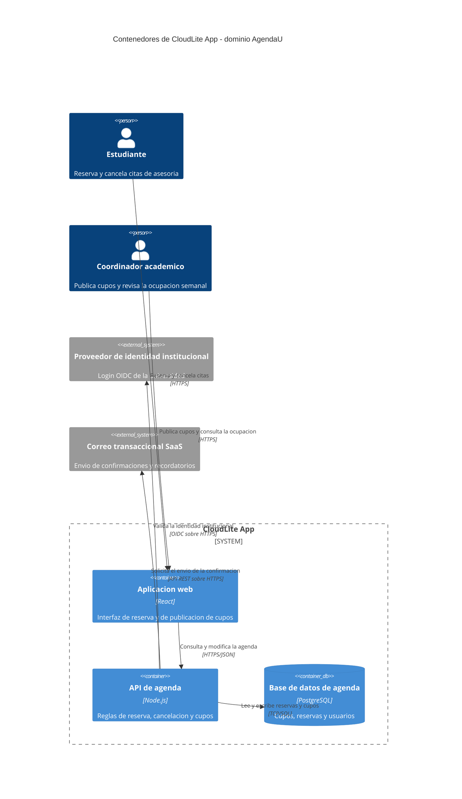

# Taller de la Clase 4 en ExamLab - configuracion

- **Curso:** Arquitectura de Sistemas Computacionales (FI303380)
- **Taller:** Actividad del Corte 1 (preguntas 12 a 15) - C4 Containers, contratos y riesgos
- **Preguntas:** 4 · **Total:** 25 puntos
- **Plataforma:** ExamLab (https://uniaj.examlab.workers.dev/) · modulo Talleres
- **Hito del PI:** Diagramar componentes/servicios de CloudLite y sus contratos
- **Entregable de la clase:** Diagrama C4 Container/Componentes v0.9 + lista de APIs entre servicios

> ExamLab no importa preguntas desde archivo: el alta se hace en la UI del
> docente (o con la pestana de IA). Este documento trae el texto exacto de cada
> campo para copiar y pegar, incluidos el SQL de partida y el codigo base.

**Que produce el estudiante:** Las preguntas 12 a 15 de la actividad del Corte 1, que la cierran. El estudiante decide si parte el sistema, modela el C4 Container reutilizando los nombres del Context, define 3 contratos con su error de negocio y analiza los riesgos que introdujo al distribuir.

---

## Pregunta 12 - Respuesta escrita · 4.0 pts

**Tipo en la plataforma:** `abierta`

**Enunciado (campo Contenido):**

## Monolito modular o microservicios para su CloudLite

Antes de dibujar las cajas hay que decidir si el sistema se parte o no. Escriba su decision
con esta estructura:

1. **La decision**, en una frase: **monolito modular** o **microservicios** para CloudLite.
2. **Dos criterios que la sustentan**, aplicados a su caso concreto:
   - **tamano del equipo**: cuantas personas sostienen el proyecto y durante cuanto tiempo;
   - **acoplamiento**: que partes de su dominio cambian juntas y cuales cambian por separado.
3. **Que gana y que pierde** con la decision: una de cada una, en terminos de su dominio.

> **Regla del curso:** doce microservicios para un equipo de tres es teatro, no
> arquitectura. Partir un sistema tiene un costo real —cada llamada de funcion se convierte
> en una llamada de red, con su latencia y su posibilidad de fallar— y ese costo hay que
> pagarlo con una razon. Un monolito modular bien argumentado vale exactamente lo mismo que
> microservicios bien argumentados; lo que no vale es partir por moda.

Esta decision es la que explica cuantas cajas tendra el diagrama de la pregunta 13: si
elige monolito modular, esas cajas son modulos dentro de un contenedor mas sus almacenes de
datos, no servicios sueltos.

> La entrega oficial es esta respuesta dentro de ExamLab. El documento en Word o Google Docs es opcional y solo sirve para conservar sus respuestas.

**Rubrica esperada (campo Rubrica):**

1 pt la decision nombrada en una frase, sin ambiguedad. 2 pts los dos criterios aplicados al caso: 1 pt tamano del equipo con numero y plazo, 1 pt acoplamiento diciendo que partes cambian juntas. 1 pt el que gana y que pierde en terminos del dominio. Cero en la decision si dice «un poco de los dos» o no elige. Elegir monolito modular NO se penaliza: se penaliza no sustentar.

---

## Pregunta 13 - Diagrama (Mermaid) · 11.0 pts

**Tipo en la plataforma:** `diagrama`

**Enunciado (campo Contenido):**

## C4 Containers de CloudLite App

Modele el diagrama **C4 de nivel Container** de su CloudLite, en Mermaid. La primera linea
debe ser exactamente `C4Container`.

Parta del **C4 Context de la pregunta 3** y **reutilice exactamente los mismos nombres** de
sistema, de actores y de sistemas externos. Es el mismo sistema visto con mas zoom, no otro
sistema.

El diagrama debe tener:

- Entre **2 y 5** contenedores o servicios logicos dentro de la frontera del sistema, cada
  uno con su tecnologia entre parentesis y **coherente con la decision de la pregunta 12**.
- Los **almacenes de datos** como `ContainerDb(...)`.
- Los actores y los sistemas externos que ya estaban en el Context.
- **Cada flecha etiquetada con su protocolo y su formato**: `HTTPS/JSON`, `TCP/SQL`,
  `evento/cola`. Una flecha sin protocolo no cuenta.

> **Justifique cada caja.** Por cada contenedor tiene que poder responder dos preguntas: que
> responsabilidad de negocio propia tiene, y por que se despliega por separado. Si no puede
> responder las dos, esa caja no deberia existir. **Doce microservicios para un equipo de
> tres es teatro, no arquitectura.**

Estos nombres vuelven en el diagrama de despliegue de la Clase 7 y en el checkpoint de la
Clase 11: si aqui llama «api-prestamos» a un servicio, alla tiene que llamarse igual.

> La entrega oficial es esta respuesta dentro de ExamLab. El documento en Word o Google Docs es opcional y solo sirve para conservar sus respuestas.

**Pegar al final del enunciado — flujo de entrega del diagrama:**

**Del boceto al codigo Mermaid.** No subas una imagen: la respuesta de esta pregunta es texto Mermaid.

- **1. Disena visual** Dibuja el diagrama como quieras en Excalidraw o draw.io: es mas rapido arrastrar cajas que escribir codigo, y ahi es donde piensas el modelo.
- **2. Traduce con IA** Copia o describe tu boceto a una IA y pidele el codigo Mermaid: «convierte este diagrama a Mermaid usando `C4Container`». Revisa el resultado: la IA acierta la sintaxis, no tu modelo.
- **3. Pega y renderiza en ExamLab** Pega ese codigo en la caja de texto de la pregunta y mira como lo dibuja la plataforma. Si no renderiza, corrige ahi mismo: lo que se califica es el diagrama renderizado dentro de ExamLab.
- **4. Guarda el PNG para tu PI** Exporta tambien la imagen a la carpeta de tu Proyecto Integrador. Esa copia es para tu informe; no reemplaza la respuesta en la plataforma.

**Diagrama de referencia (Mermaid):**

**Rubrica esperada (campo Rubrica):**

3 pts entre 2 y 5 contenedores, cada uno con su tecnologia; se descuenta por cada caja de mas sin justificacion. 2 pts los almacenes de datos declarados como ContainerDb. 3 pts que TODA flecha lleve protocolo y formato. 2 pts que los nombres de sistema, actores y sistemas externos sean identicos a los del C4 Context de la pregunta 3. 1 pt que renderice sin error. Si el numero de cajas contradice la decision de la pregunta 12 (por ejemplo cinco servicios sueltos habiendo elegido monolito modular) se pierden los 3 pts de los contenedores.

---

## Pregunta 14 - Respuesta escrita · 7.0 pts

**Tipo en la plataforma:** `abierta`

**Enunciado (campo Contenido):**

## Los tres contratos de CloudLite

Liste **3 contratos** entre las piezas del diagrama de la pregunta 13. Un contrato es el
acuerdo de como se hablan dos partes, y aqui se escribe con **cuatro datos**:

| Contrato | Quien llama a quien | Verbo y ruta | Error de negocio |
|---|---|---|---|

- **Quien llama a quien**: los nombres exactos de las cajas del diagrama.
- **Verbo y ruta**: el verbo HTTP y la ruta (`POST /reservas`), o el **evento** si la
  comunicacion es asincrona (`evento reserva.creada`).
- **Error de negocio**: el codigo y **que significa en su dominio**. No vale «500 error del
  servidor»: eso es una falla, no un contrato. Se espera algo como
  `409 el cupo ya fue tomado por otro estudiante` o `422 la fecha esta fuera del periodo`.

> **Al menos uno de los tres errores debe ser un `409` de conflicto**, porque el conflicto
> es el error que aparece en cuanto dos usuarios hacen lo mismo a la vez, y es el que se
> retoma en la Clase 13 cuando se hable de concurrencia y escalado.

Un contrato sin su error solo describe el camino feliz, y el camino feliz nunca es el que
rompe el sistema.

> La entrega oficial es esta respuesta dentro de ExamLab. El documento en Word o Google Docs es opcional y solo sirve para conservar sus respuestas.

**Rubrica esperada (campo Rubrica):**

3 pts los tres contratos con quien llama a quien usando los nombres exactos del diagrama: 1 pt cada uno. 2 pts los verbos y rutas bien formados (o el evento, si es asincrono). 2 pts los errores de negocio con codigo y significado en el dominio; se pierde el punto del error si dice 500 o «error generico», y se pierde 1 pt del total si ninguno de los tres es un 409 de conflicto.

---

## Pregunta 15 - Respuesta escrita · 3.0 pts

**Tipo en la plataforma:** `abierta`

**Enunciado (campo Contenido):**

## Riesgos de distribucion de su arquitectura

Toda frontera que dibujo en la pregunta 13 es una llamada de red, y una llamada de red puede
fallar, tardar o dejar los datos a medias. Analice **los tres riesgos** que introdujo su
propia arquitectura logica, en este orden:

1. **Que se rompe cuando una pieza no responde.** Elija **una** caja concreta de su
   diagrama, digala por su nombre, y describa que deja de funcionar y que sigue funcionando
   si esa pieza se cae. La respuesta interesante no es «se cae todo»: es cual capacidad de
   su ficha queda inservible y cual no.
2. **Que latencia agrega cada salto.** Cuente los saltos de red de **una** operacion
   completa de su dominio, de punta a punta, y diga cuantos son. No hace falta medir: hace
   falta contar y darse cuenta de que antes eran cero.
3. **Que datos quedan expuestos a inconsistencia.** Nombre **un** dato que viva en dos
   sitios o que se actualice en dos pasos, y que pasaria si el segundo paso falla.

> Si su decision de la pregunta 12 fue **monolito modular**, esta pregunta sigue aplicando:
> los saltos hacia la base de datos y hacia los sistemas externos son igualmente red, y el
> riesgo 3 existe en cuanto haya dos escrituras que deban ocurrir juntas.

> La entrega oficial es esta respuesta dentro de ExamLab. El documento en Word o Google Docs es opcional y solo sirve para conservar sus respuestas.

**Rubrica esperada (campo Rubrica):**

1 pt el riesgo de indisponibilidad nombrando una caja concreta y distinguiendo que deja de funcionar de que sigue funcionando; media respuesta si dice «se cae todo». 1 pt el conteo de saltos de una operacion de punta a punta. 1 pt el dato expuesto a inconsistencia, nombrado, con lo que pasa si falla el segundo paso. Una respuesta generica sobre «los microservicios son mas complejos» no suma en ningun criterio.

---

## Al terminar de crearlo

- Verifique que la suma de puntos sea la esperada: **25**.
- Publique el taller y confirme la fecha limite (domingo 23:59 segun el Acuerdo).
- Las preguntas con SQL o codigo: ejecutelas una vez usted mismo antes de publicar,
  para confirmar que el SQL de partida corre y que el starter compila.
