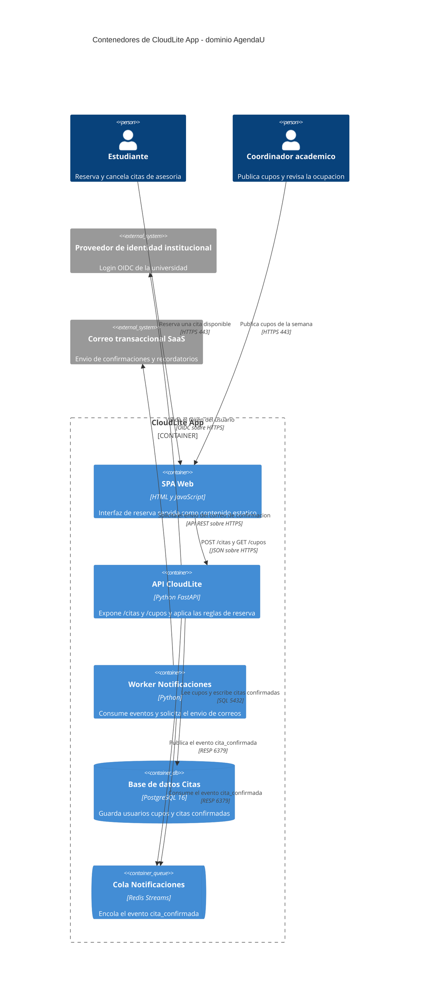
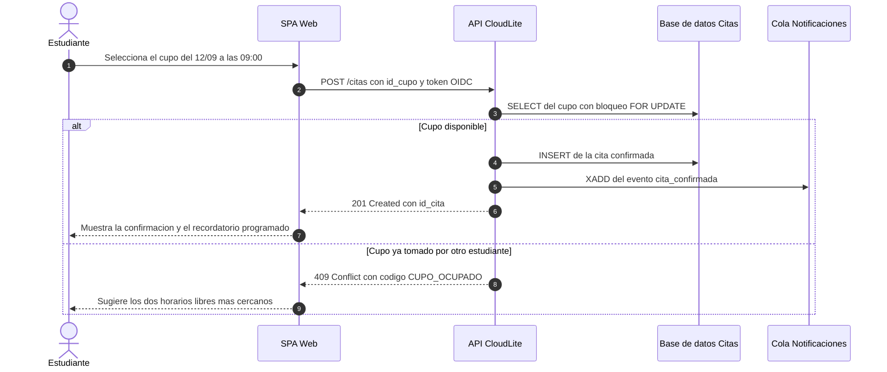

# Taller de la Clase 4 en ExamLab - configuracion

- **Curso:** Arquitectura de Sistemas Computacionales (FI303380)
- **Taller:** Taller Clase 4 en ExamLab - C4 Container y contratos de CloudLite
- **Preguntas:** 5 · **Total:** 100 puntos
- **Plataforma:** ExamLab (https://uniaj.examlab.workers.dev/) · modulo Talleres
- **Hito del PI:** Diagramar componentes/servicios de CloudLite y sus contratos
- **Entregable de la clase:** Diagrama C4 Container/Componentes v0.9 + lista de APIs entre servicios

> ExamLab no importa preguntas desde archivo: el alta se hace en la UI del
> docente (o con la pestana de IA). Este documento trae el texto exacto de cada
> campo para copiar y pegar, incluidos el SQL de partida y el codigo base.

**Que produce el estudiante:** El estudiante entrega el mapa logico de CloudLite como C4Container renderizado, con 5 contenedores de nombre congelado, 3 contratos con errores de negocio y el flujo principal en un diagrama de secuencia con camino de error.

---

## Pregunta 1 - Diagrama (Mermaid) · 35 pts

**Tipo en la plataforma:** `diagrama`

**Enunciado (campo Contenido):**

## C4 Container de CloudLite App

Escriba en Mermaid el diagrama **C4Container**. La primera linea debe ser exactamente `C4Container`. Debe contener:

- Un `Container_Boundary(...)` rotulado `CloudLite App` con **exactamente 5 contenedores**: una interfaz web, una API, un procesador asincrono, un almacen relacional con `ContainerDb(...)` y una cola con `ContainerQueue(...)`.
- Los **2 `Person(...)`** y los **2 `System_Ext(...)`** de su Clase 1, con los mismos nombres.
- Cada contenedor con sus 3 datos: **nombre**, **tecnologia tentativa** y **responsabilidad en una frase**.
- Exactamente **8 `Rel(...)`**, cada una con **protocolo y puerto** cuando aplique (`HTTPS 443`, `JSON sobre HTTPS`, `SQL 5432`, `RESP 6379`).

**Reglas de verificacion antes de enviar:**
1. Ningun actor habla directamente con la base de datos ni con la cola.
2. Ningun contenedor es un modulo interno de otro (los componentes internos son la Clase 11).
3. Ningun nombre se repite, y estos 5 nombres se congelan: el despliegue de la Clase 7 debe usar los mismos.

**Consejo de sintaxis:** no use comas dentro de las etiquetas entre comillas.

**Diagrama de referencia (Mermaid):**

**Rubrica esperada (campo Rubrica):**

12 pts los 5 contenedores dentro del boundary con nombre, tecnologia y responsabilidad, usando ContainerDb y ContainerQueue donde corresponde. 8 pts los 2 Person y 2 System_Ext con los mismos nombres de la Clase 1. 10 pts las 8 relaciones con protocolo y puerto. 5 pts que ningun actor toque directamente la base de datos o la cola. Se descuentan 10 pts si hay mas de 5 contenedores o si aparece un sexto servicio sin justificacion.

---

## Pregunta 2 - Respuesta escrita · 25 pts

**Tipo en la plataforma:** `abierta`

**Enunciado (campo Contenido):**

## Los 3 contratos de CloudLite

Construya una tabla de **6 columnas** con encabezados exactos:

`ID | Consumidor -> Proveedor | Verbo y ruta o evento | Request | Respuesta 2xx | Error de negocio`

con **exactamente 3 filas**:

- **C-01**: la operacion principal de escritura de su dominio (por ejemplo `SPA Web -> API CloudLite`, `POST /citas`).
- **C-02**: una operacion de lectura o consulta.
- **C-03**: **un contrato asincrono por evento** (por ejemplo `API CloudLite -> Cola Notificaciones`, evento `cita_confirmada`), donde en lugar de respuesta 2xx describa la **garantia de entrega** y quien consume el evento.

Reglas por fila:
- `Request` lista **los 3 campos minimos** con su tipo.
- `Respuesta 2xx` indica el **codigo exacto** (`201`, `200`) y los campos que devuelve.
- `Error de negocio` es un **codigo y una constante**, por ejemplo `409 CUPO_OCUPADO` o `401 TOKEN_INVALIDO`. **No se acepta `500 error interno`** como error de negocio.

Cierre con **2 lineas**: que pasa si el consumidor reintenta `C-01` con los mismos datos (idempotencia) y quien es el dueno del contrato.

**Rubrica esperada (campo Rubrica):**

9 pts las 3 filas completas con las 6 columnas. 6 pts que C-03 sea realmente asincrono por evento con garantia de entrega y consumidor declarado. 6 pts los errores de negocio con codigo y constante, sin usar 500 como error de negocio. 4 pts las 2 lineas de idempotencia y dueno del contrato.

---

## Pregunta 3 - Diagrama (Mermaid) · 20 pts

**Tipo en la plataforma:** `diagrama`

**Enunciado (campo Contenido):**

## Flujo del contrato C-01 con su camino de error

Escriba un `sequenceDiagram` del contrato **C-01** con **exactamente 5 participantes**, usando **los mismos nombres** de sus contenedores (por ejemplo `Estudiante`, `SPA Web`, `API CloudLite`, `Base de datos Citas`, `Cola Notificaciones`).

Debe incluir:
- `autonumber`.
- Un bloque `alt ... else ... end` con **el camino feliz** y **el camino de error de negocio** de su tabla de contratos.
- En el camino feliz: la validacion, la escritura en la base de datos, la publicacion del evento en la cola y la respuesta `201` al usuario.
- En el camino de error: la respuesta con **el mismo codigo y constante** que declaro en `C-01` (por ejemplo `409 CUPO_OCUPADO`) y **sin** escritura en la base de datos.

**Verificacion:** cuente los mensajes y confirme que en la rama de error **no hay ningun mensaje de escritura** ni publicacion en la cola.

**Diagrama de referencia (Mermaid):**

**Rubrica esperada (campo Rubrica):**

6 pts los 5 participantes con los nombres identicos a los contenedores. 6 pts el bloque alt con camino feliz y camino de error. 5 pts que la rama de error use el mismo codigo y constante del contrato y no escriba ni publique. 3 pts autonumber y que renderice sin error.

---

## Pregunta 4 - Respuesta escrita · 12 pts

**Tipo en la plataforma:** `abierta`

**Enunciado (campo Contenido):**

## Riesgos de partir el sistema

Al separar CloudLite en 5 contenedores aparecen problemas que un monolito no tiene. Construya una tabla de **3 columnas** (`Riesgo de distribucion | Donde aparece en mi diagrama | Mitigacion concreta`) con **exactamente 3 filas**, eligiendo 3 riesgos distintos entre: fallo parcial de un salto de red, latencia acumulada, consistencia entre la base de datos y la cola, doble entrega de un evento, o crecimiento del acoplamiento por contrato.

Reglas:
- La columna del medio **debe citar la flecha exacta** de su C4Container (por ejemplo `API CloudLite -> Cola Notificaciones`).
- La mitigacion debe ser algo **visible en el diseno** (reintento con espera, tiempo de espera maximo, idempotencia por clave, cola con reintento), no una buena intencion.

Cierre con **una frase** que responda: por que 5 contenedores y no 12.

**Rubrica esperada (campo Rubrica):**

6 pts las 3 filas con riesgos distintos y la flecha exacta del diagrama citada. 4 pts las 3 mitigaciones expresadas como mecanismo verificable en el diseno. 2 pts la frase que justifica el numero de contenedores frente al tamano del equipo.

---

## Pregunta 5 - Seleccion multiple · 8 pts

**Tipo en la plataforma:** `cerrada_multi`

**Enunciado (campo Contenido):**

## Antipatrones de arquitectura distribuida

Seleccione las **3 situaciones que son antipatrones**.

**Opciones:**

- [x] Definir 12 microservicios para un equipo de 3 personas y un semestre.
- [x] Dos servicios distintos escribiendo directamente en la misma tabla de la misma base de datos.
- [ ] Nombrar cada contenedor con su responsabilidad y su tecnologia tentativa.
- [x] Encadenar 5 llamadas sincronas entre servicios para responder una sola peticion del usuario.
- [ ] Publicar un evento en una cola para el trabajo que puede terminar despues de responder al usuario.
- [ ] Usar los mismos nombres de contenedor en el C4 y en el diagrama de despliegue.

**Rubrica esperada (campo Rubrica):**

3 pts por cada antipatron correctamente marcado hasta un maximo de 8; se descuentan 3 pts por cada opcion correcta de diseno marcada como antipatron, sin bajar de cero.

---

## Al terminar de crearlo

- Verifique que la suma de puntos sea la esperada: **100**.
- Publique el taller y confirme la fecha limite (domingo 23:59 segun el Acuerdo).
- Las preguntas con SQL o codigo: ejecutelas una vez usted mismo antes de publicar,
  para confirmar que el SQL de partida corre y que el starter compila.
