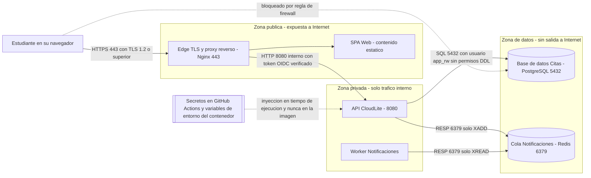

# Taller de la Clase 6 en ExamLab - configuracion

- **Curso:** Arquitectura de Sistemas Computacionales (FI303380)
- **Taller:** Taller Clase 6 en ExamLab - Modelo de amenazas y controles de CloudLite
- **Preguntas:** 5 · **Total:** 100 puntos
- **Plataforma:** ExamLab (https://examlab.lovable.app/) · modulo Talleres
- **Hito del PI:** Modelo de amenazas mínimo + controles para CloudLite
- **Entregable de la clase:** Sección Seguridad PI: 5 amenazas STRIDE-lite + controles + secretos/CI

> ExamLab no importa preguntas desde archivo: el alta se hace en la UI del
> docente (o con la pestana de IA). Este documento trae el texto exacto de cada
> campo para copiar y pegar, incluidos el SQL de partida y el codigo base.

**Que produce el estudiante:** El estudiante entrega el modelo de amenazas STRIDE-lite de su dominio con 5 controles trazados a un diagrama de fronteras de confianza y una politica de secretos que deja el repositorio y el pipeline limpios.

---

## Pregunta 1 - Respuesta escrita · 30 pts

**Tipo en la plataforma:** `abierta`

**Enunciado (campo Contenido):**

## Modelo de amenazas STRIDE-lite de su dominio

Construya una tabla de **5 columnas** con encabezados exactos:

`Categoria STRIDE | Amenaza concreta de mi dominio | Activo afectado | Control | Donde se ve en el diagrama`

con **exactamente 5 filas**, una por categoria y en este orden: **Spoofing (suplantacion)**, **Tampering (manipulacion)**, **Information disclosure (divulgacion)**, **Denial of service (denegacion)**, **Elevation of privilege (elevacion de privilegios)**.

Reglas por fila:
- La amenaza debe nombrar **un activo de su propio C4Container** (`Base de datos Citas`, `Cola Notificaciones`, `token del estudiante`, `clave del correo transaccional`).
- Los **5 controles deben ser distintos** y entre ellos debe haber **al menos uno preventivo, uno detectivo y uno de contencion**; rotule cada control con `[preventivo]`, `[detectivo]` o `[contencion]`.
- La ultima columna cita **la flecha o la zona exacta** del diagrama de la pregunta 2 (por ejemplo `arista Estudiante -> Edge TLS 443`).

No se acepta una amenaza escrita como frase generica del tipo `podrian hackear el sistema`.

**Rubrica esperada (campo Rubrica):**

10 pts las 5 filas con las 5 categorias en orden y amenaza concreta del dominio. 8 pts el activo afectado tomado del C4 propio en las 5 filas. 8 pts los 5 controles distintos con etiqueta preventivo, detectivo o contencion y al menos uno de cada tipo. 4 pts la trazabilidad al diagrama citando la flecha o zona exacta. Cada fila generica del tipo podrian hackear el sistema vale cero.

---

## Pregunta 2 - Diagrama (Mermaid) · 25 pts

**Tipo en la plataforma:** `diagrama`

**Enunciado (campo Contenido):**

## Fronteras de confianza de CloudLite

Escriba un `flowchart LR` con **exactamente 3 subgrafos** rotulados `Zona publica`, `Zona privada` y `Zona de datos`, y ubique dentro los **5 contenedores de su Clase 4** mas el nodo del edge que termina TLS.

Requisitos:
1. El actor del usuario queda **fuera** de los 3 subgrafos.
2. Cada arista solida lleva **protocolo y puerto** y, cuando aplique, **el control** (`HTTPS 443 con TLS 1.2 o superior`, `token OIDC verificado`, `usuario app_rw sin permisos DDL`).
3. Un nodo de secretos con forma `[[ ]]` conectado por **arista punteada** al consumidor, rotulada `inyeccion en tiempo de ejecucion y nunca en la imagen`.
4. **Una arista punteada de trafico bloqueado** desde el usuario hacia la base de datos, rotulada `bloqueado por regla de firewall`.

**Verificacion:** la base de datos y la cola deben quedar en la `Zona de datos` y el usuario **no** puede tener ninguna arista solida hacia ellas.

**Diagrama de referencia (Mermaid):**

**Rubrica esperada (campo Rubrica):**

8 pts los 3 subgrafos con los 5 contenedores ubicados en la zona correcta. 8 pts las aristas solidas con protocolo puerto y control. 5 pts el nodo de secretos con arista punteada de inyeccion en tiempo de ejecucion. 4 pts la arista punteada de trafico bloqueado del usuario a la base de datos. Se descuentan 8 pts si la base de datos o la cola aparecen en la zona publica.

---

## Pregunta 3 - Respuesta escrita · 20 pts

**Tipo en la plataforma:** `abierta`

**Enunciado (campo Contenido):**

## Politica de secretos de CloudLite

Redacte la politica con **estos 6 puntos numerados**, en este orden:

1. **Inventario**: tabla de **4 secretos** con 3 columnas (`Secreto | Para que sirve | Que pasa si se filtra`). Incluya al menos la credencial de la base de datos y la clave del servicio de correo.
2. **Donde vive cada secreto**: una linea por secreto indicando el lugar exacto (`Settings > Secrets and variables > Actions`, variable de entorno del contenedor, gestor local). Prohibido: Dockerfile, repositorio, YAML en claro, captura de pantalla en el informe.
3. **Quien accede**: quien puede ver o rotar cada secreto (usted, y cada integrante si el docente autorizo equipo) y con que criterio de minimo privilegio.
4. **Rotacion**: cada cuanto se rota y **el evento que fuerza rotacion inmediata**.
5. **Plan si se filtra**: exactamente **4 pasos numerados**, y el primero debe ser rotar e invalidar la credencial anterior (borrar el commit **no** es suficiente y debe decirlo explicitamente).
6. **Prohibiciones**: 3 practicas prohibidas en este proyecto, cada una con una frase de por que.

Extension total: entre media y una pagina. Esta politica se pega en la seccion Seguridad del informe.

**Rubrica esperada (campo Rubrica):**

6 pts el inventario de 4 secretos con las 3 columnas incluidas base de datos y correo. 4 pts la ubicacion exacta de cada secreto sin caer en Dockerfile repositorio ni YAML en claro. 3 pts el acceso por minimo privilegio. 3 pts la rotacion con periodo y evento disparador. 4 pts el plan de filtracion con 4 pasos empezando por rotar e invalidar y aclarando que borrar el commit no basta.

---

## Pregunta 4 - Seleccion multiple · 15 pts

**Tipo en la plataforma:** `cerrada_multi`

**Enunciado (campo Contenido):**

## Secretos en el pipeline

Seleccione las **3 practicas correctas** para manejar secretos en GitHub Actions y en la imagen del contenedor.

**Opciones:**

- [x] Guardar la clave del servicio de correo en Settings > Secrets and variables > Actions y leerla como ${{ secrets.EMAIL_API_KEY }}.
- [ ] Escribir la clave en claro dentro del ci.yml porque el repositorio es privado.
- [ ] Copiar el archivo .env al contexto de build para que quede dentro de la imagen.
- [x] Rotar la clave e invalidar la anterior en cuanto aparezca en un commit, aunque despues se borre el archivo.
- [x] Usar un token con permiso solo de envio de correo en lugar del token de administrador de la cuenta.
- [ ] Imprimir el valor del secreto con echo en el log del pipeline para confirmar que llego bien.

**Rubrica esperada (campo Rubrica):**

5 pts por cada practica correcta marcada; se descuentan 5 pts por cada practica incorrecta marcada, sin bajar de cero.

---

## Pregunta 5 - Seleccion unica · 10 pts

**Tipo en la plataforma:** `cerrada`

**Enunciado (campo Contenido):**

## Clasifique la amenaza

Un atacante copia el token que quedo guardado en el `localStorage` del navegador de otro estudiante, lo reenvia en un `POST /citas` y reserva una cita a nombre de esa persona. En STRIDE, que categoria describe **mejor** la amenaza?

**Opciones:**

- [x] Spoofing: suplantacion de la identidad de otro usuario.
- [ ] Denial of service: agotamiento de la capacidad del servicio.
- [ ] Repudiation: imposibilidad de demostrar quien ejecuto la accion.
- [ ] Tampering: alteracion de los datos en transito.

**Rubrica esperada (campo Rubrica):**

10 pts la opcion correcta, 0 en cualquier otra.

---

## Al terminar de crearlo

- Verifique que la suma de puntos sea la esperada: **100**.
- Publique el taller y confirme la fecha limite (domingo 23:59 segun el Acuerdo).
- Las preguntas con SQL o codigo: ejecutelas una vez usted mismo antes de publicar,
  para confirmar que el SQL de partida corre y que el starter compila.
