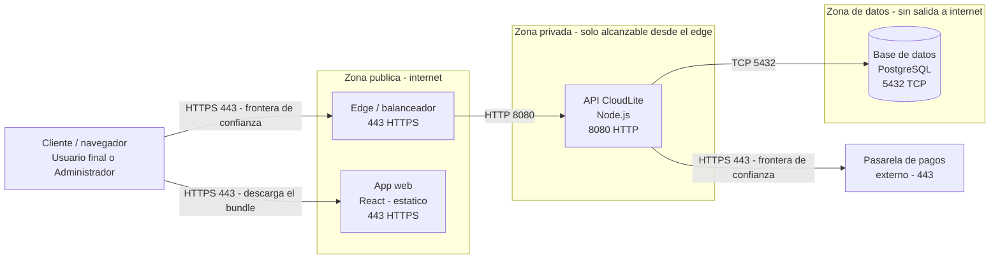

# Guion docente — Clase 7: Redes y almacenamiento cloud

## Información de la clase
- Asignatura: Arquitectura de Sistemas Computacionales (FI303380)
- Duración del bloque: **120 min**
- Tipo: Clase regular (teoría + taller PI) · encuentro síncrono
- Enfoque: **Proyecto Integrador CloudLite App** (parte práctica)
- Sin fechas de periodo · sin bio · sin mapa completo del curso

## Objetivos de la clase
- Modelar red lógica (cliente, edge, app, datos) sin VPC de pago.
- Elegir tipo de almacenamiento según el caso de uso CloudLite.
- Completar el diagrama de despliegue del PI.

## Hoy avanzamos el PI en…
**Diagrama de despliegue: red, zonas, almacenamiento**

**Entregable concreto:** Diagrama Deployment en Mermaid dentro de ExamLab (3 zonas + puertos) + tipo de almacenamiento por componente

**Herramienta:** ExamLab (Mermaid) · boceto en draw.io o Excalidraw

## Fundamento teórico para el docente
### El tercer angulo: que responde el diagrama de despliegue - diapositiva 4
El diagrama de despliegue responde una pregunta que los anteriores no responden: donde corre cada pieza y por que camino de red se hablan entre si. Conviene tener claro el mapa de los tres diagramas del curso, porque el estudiante cree que dibuja lo mismo tres veces. En la Clase 1 se hizo C4 Context: el sistema como una caja, quien lo usa y con que sistemas externos habla; responde QUIEN. En la Clase 4 se hizo C4 Containers: que aplicaciones, servicios y bases de datos lo componen por dentro y con que contratos se comunican; responde QUE. Hoy se hace el despliegue: en que nodos se ejecutan esos contenedores, en que zona de red esta cada nodo, por que puerto y protocolo pasa cada flecha, y donde quedan los datos; responde DONDE. Un nodo es cualquier lugar de ejecucion: una maquina virtual, un host de contenedores, un servicio gestionado. Es el mismo sistema desde un tercer angulo, no un sistema nuevo, y por eso los nombres deben coincidir con los de la Clase 4. Lo que se califica hoy son 25 de los 100 puntos de la actividad del Corte 2, en tres preguntas: 14 puntos el diagrama de despliegue, 5.5 el tipo de almacenamiento de cada componente y 5.5 la tabla de correspondencia con el C4 Containers. Y hay un dato que cambia como se dicta la clase: el entregable NO es una imagen. La pregunta 4 se responde con codigo Mermaid pegado dentro de ExamLab, que la plataforma renderiza en la misma pantalla, y 2 de esos 14 puntos son literalmente que renderice sin error. El boceto en draw.io o en Excalidraw sigue sirviendo, y es el paso 1 del metodo que se proyecta hoy, pero es un borrador de trabajo: no se entrega y no se califica.
### IP, puerto y protocolo: las tres etiquetas de cada flecha - diapositiva 5
Para etiquetar ese diagrama hacen falta tres conceptos de red que el docente debe definir en una frase. Una direccion IP identifica una maquina dentro de una red. Un puerto es un numero entre 1 y 65535 que identifica a que proceso de esa maquina se entrega el trafico: la direccion lleva el paquete al edificio, el puerto lo lleva a la oficina. Un protocolo es el idioma de esa conexion: HTTP o HTTPS para la API, el protocolo propio del motor para la base de datos. Hay puertos fijados por convencion registrada, no por ley fisica: 80 para HTTP, 443 para HTTPS, 5432 para PostgreSQL, 3306 para MySQL, 8080 para desarrollo. Nada impide correr una base de datos en el 9999, pero cambiar la convencion confunde a quien opera. Esto no es decorativo: la pregunta 4 da 2 puntos por que cada componente lleve su puerto etiquetado, y el diagrama de referencia usa exactamente tres, 443 en el edge, 8080 en la API y 5432 en la base de datos, que son los mismos que el estudiante ya escribio en el EXPOSE de su Dockerfile de la Clase 3. Ahi esta el amarre: cuando en Killercoda se ejecuto el contenedor publicando un puerto, esa linea era la decision de que superficie queda expuesta, tema de la Clase 6, y hoy esa decision se dibuja.
### Subred publica y privada: lo definen las rutas, no el nombre - diapositiva 5
Una subred es una subdivision de una red, y lo que la hace publica o privada no es su nombre sino sus rutas. Una subred publica tiene camino de entrada desde internet: alguien de afuera puede iniciar una conexion hacia lo que vive ahi. Una privada no lo tiene; solo se alcanza desde dentro, aunque normalmente si puede salir para descargar actualizaciones. Sobre esa distincion se construye la regla que se evalua hoy, y hay que decirla con los tres nombres exactos porque son tres zonas y no dos: en la zona PUBLICA van el punto de entrada, el balanceador o proxy inverso, y la aplicacion web estatica, que es publica sin que eso sea una fuga porque no lleva secretos dentro; el cliente que llega de internet se dibuja FUERA de las tres zonas, porque es el actor y no una pieza que el estudiante despliegue, y por eso es una de las dos filas sin par de la tabla de la pregunta 6; la API va en la zona PRIVADA, alcanzable solo desde el edge; y los datos van en una tercera zona, la de DATOS, que solo acepta conexiones desde la aplicacion y no tiene salida a internet. Los 4 puntos de ubicacion de la pregunta 4 se pierden COMPLETOS si la base de datos queda en la zona publica: no es un descuento parcial, es el error que la pregunta esta disenada para detectar. Y las tres zonas rotuladas valen otros 4 puntos por si mismas, asi que un diagrama de dos zonas, aunque tenga la base de datos bien puesta, ya empezo perdiendo. Conviene ademas nombrar la frontera de confianza, que vale 2 puntos: es la linea donde termina lo que el estudiante controla y empieza lo que no. En CloudLite las mas faciles de senalar son las dos flechas que salen a lo que no es suyo, la pasarela de pagos y el correo transaccional: ninguno de los dos esta en las tres zonas, y la del molde que se proyecta es la de la pasarela.
### DNS y balanceador de carga - diapositiva 5
Dos piezas mas hay que explicar sin titubear. El DNS es el directorio distribuido que traduce un nombre legible, como cloudlite.example, en la direccion IP donde atiende el servicio; el registro tipo A apunta un nombre a una IP y el CNAME apunta un nombre a otro nombre. Cada registro tiene un TTL, los segundos que los demas guardan la respuesta en cache; tipicamente de 300 a 3600, asi que un cambio de direccion no es instantaneo para todos. El balanceador de carga recibe todas las peticiones y las reparte entre varias instancias iguales del mismo servicio, con algoritmos como round robin o menor numero de conexiones activas. Su funcion menos obvia y mas importante es el chequeo de salud: consulta un endpoint como /health, por convencion cada 10 a 30 segundos, y si falla dos o tres veces seguidas retira esa instancia de la rotacion hasta que responda. Es tambien donde termina el TLS, es decir donde se descifra HTTPS. En el diagrama de hoy el balanceador es el habitante de la zona publica, y el /health que consulta es el mismo contrato de salud que se verifico con curl en la Clase 3 y el primer monitoreo real de la Clase 8.
### Los tres nombres de almacenamiento que califica la pregunta 5 - diapositiva 6
El almacenamiento se decide por la caracteristica del dato, y aqui hay que ser estricto con el vocabulario porque la pregunta 5 admite TRES palabras y no mas: Relacional, Bloque y Objeto. Vale la pena escribirlas en el tablero y sostenerlas toda la clase. RELACIONAL es el motor de base de datos que guarda registros estructurados y permite cruzarlos con consultas y transacciones; la caracteristica del dato que lo exige es que ese dato se cruza con otro dato, y la prueba es que existe una consulta que los junta. BLOQUE es un disco crudo que el sistema operativo formatea y monta; se conecta a una sola instancia a la vez, es lo que hay debajo del volumen de un contenedor, y se mide en gigabytes y en IOPS, operaciones de lectura y escritura por segundo; la caracteristica que lo exige es que el dato lo monta un solo proceso y se escribe por partes, sin recuperarse entero. OBJETO no tiene carpetas reales: es un espacio plano de contenedores llamados buckets donde cada objeto se guarda bajo una clave, se lee y escribe por HTTP y se reemplaza completo en vez de editarse por partes; es practicamente ilimitado, barato y accesible por URL; la caracteristica que lo exige es que el dato se recupera entero, sin partes. Hay una cuarta categoria en la literatura, el almacenamiento de ARCHIVOS, un sistema de archivos compartido que varias instancias montan por red; conviene nombrarla como contraste para que nadie se sienta enganado, pero no es una de las tres palabras que la pregunta admite, y quien cree necesitarla casi siempre esta describiendo un caso que en la nube se resuelve con objeto. El numero que ordena la decision es el precio relativo: un gigabyte al mes en objetos cuesta del orden de dos a tres centavos de dolar, en disco de bloque cerca de cuatro veces mas, y en base de datos gestionada aun mas porque se paga computo. Son referencias de mercado, no reglas fijas, y aqui no se aprovisiona nada de pago: el valor esta en justificar. Y la justificacion se califica aparte, 2.5 de los 5.5 puntos: cada fila tiene que nombrar la caracteristica del dato. «Es mas rapido», «es lo que usa todo el mundo» o «es lo normal» no son caracteristicas del dato y no suman ni un punto, aunque el tipo elegido sea el correcto.
### El caso de la foto de perfil, y cuando la respuesta correcta es «no necesito objeto» - diapositiva 6
El ejemplo que hace visible la decision, y el error de diseno que conviene provocar: CloudLite permite subir una foto de perfil o adjuntar un PDF. La solucion ingenua es guardar el archivo en una columna binaria de la base de datos. Hay que dejar que el estudiante la proponga y luego cuantificarla: dos megabytes por usuario y cinco mil usuarios son diez gigabytes de binarios dentro de una base cuyos datos utiles podrian ser doscientos megabytes; cada respaldo arrastra esos diez gigabytes y la cache del motor se llena de bytes que ninguna consulta filtra. El diseno correcto separa: el archivo va a almacenamiento de objetos y la base guarda una fila con la clave del objeto, el dueno, el tamano, el tipo de contenido y la fecha. Hay una razon adicional: un contenedor es efimero, lo que se escriba en su sistema de archivos desaparece cuando se reemplaza, y con dos instancias detras del balanceador el archivo subido a una no existe en la otra. Mantener los contenedores sin estado es la condicion del escalado horizontal de la Clase 13. Y ahora la otra mitad, que es la que sorprende al docente: si el dominio del estudiante no maneja archivos, imagenes ni documentos adjuntos, la respuesta correcta y completa es declarar que NO necesita almacenamiento de objetos y explicar por que. La rubrica lo dice al reves de como el grupo lo espera: suma completo quien lo declare y justifique, y se descuenta a quien agregue un almacen de objetos sin un dato que lo pida. Hay que anunciarlo antes del taller, porque si no medio salon inventa un bucket «porque suena a cloud» y pierde puntos por agregar.
### Trazabilidad: la tabla de correspondencia de la pregunta 6 - diapositiva 7
Queda la trazabilidad, donde mas puntos se pierden y donde vive una pregunta entera. Los nombres de las cajas del despliegue deben ser los mismos que los contenedores del C4 Containers de la Clase 4: si alli el servicio se llamaba api-citas, hoy no puede aparecer como backend, ni puede aparecer una caja nueva que nadie declaro. La pregunta 6 pide demostrarlo con una tabla de tres columnas cuyos nombres hay que dictar tal cual: «Componente en el C4 Containers», «Componente en el Despliegue» y «Zona». Los 5.5 puntos se reparten asi, y conviene decirlo en voz alta: 2 puntos la explicacion de por que los nombres deben coincidir, y la respuesta esperada es que los dos diagramas son el MISMO sistema visto desde angulos distintos, uno dice que piezas hay y el otro donde se ejecutan; 2.5 puntos la tabla completa, con una fila por componente y su zona; y 1 punto listar los renombres que se aplicaron, o declarar explicitamente que no hubo ninguno, que tambien vale. La trampa esta en la palabra completa: se descuenta si la tabla deja fuera un componente que si aparece en alguno de los dos diagramas, asi que hay que instruir el gesto de llenarla con los dos diagramas abiertos al lado y contando cajas. La cadena aguas abajo es directa: la Clase 6 identifico amenazas y fronteras de confianza en texto y hoy esas fronteras se vuelven zonas dibujadas; la Clase 8 tomara cada flecha para definir que se mide en ella, porque no se puede monitorear un camino que no esta dibujado; la Clase 10 costeara estas mismas cajas, asi que la eleccion de almacenamiento es tambien decision de costo; y la Clase 13 discutira cual caja se replica y cual no. Todo el bloque se evalua en el Parcial 2 de la Clase 9.
### Recorrer una peticion de CloudLite de punta a punta - diapositiva 8
La mejor forma de dictar la clase es seguir una peticion de CloudLite de punta a punta sobre el diagrama proyectado. Un usuario final abre cloudlite.example en su telefono; el DNS resuelve el nombre a la IP publica del balanceador; el navegador abre una conexion HTTPS al puerto 443 de ese balanceador, que vive en la zona publica; el balanceador elige una de las dos instancias del contenedor de la API, en la zona privada, y le reenvia la peticion por HTTP al puerto 8080; la API consulta el motor de base de datos en la zona de datos por el puerto 5432 y devuelve JSON por el mismo camino. Ese recorrido, con cada flecha etiquetada con protocolo y puerto y cada caja dentro de su zona, es la estructura que la pregunta 4 califica; lo que se pega en la plataforma es su version en Mermaid, que es la seccion siguiente. Sirve tambien para citar numeros: una consulta simple bien indexada responde entre 1 y 20 milisegundos, y el objetivo que se formalizara en la Clase 12 suele fijarse por convencion en menos de 300 milisegundos para el 95 por ciento de las peticiones. Con eso el grupo ve que si una pantalla dispara veinte consultas encadenadas el problema es de diseno y no de servidor.
### El molde de Mermaid, linea por linea - diapositiva 9
La diapositiva del molde existe porque el estudiante puede tener el modelo correcto en la cabeza y perder puntos por sintaxis, y porque 2 de los 14 son que el diagrama renderice. Hay cinco cosas que el docente debe poder explicar sin titubear. Primera: la palabra inicial. Se escribe flowchart LR, donde LR significa de izquierda a derecha, y es lo que hace que el recorrido cliente, edge, aplicacion, datos se lea como un flujo y no como una torre. Segunda: cada zona es un subgraph con su rotulo entre comillas y su propio end. Los subgraph son las tres zonas, y son las que valen 4 puntos; olvidar un end es la causa numero uno de que la plataforma no dibuje nada, porque el bloque queda abierto. Tercera: la forma de la caja dice que es la pieza. Los corchetes rectos son un proceso o servicio, y la combinacion de corchete y parentesis, es decir abrir corchete parentesis, es la base de datos, que se lee como cilindro. Vale la pena senalar la caja de la base de datos y decir «esta forma, dentro de este subgraph, son 4 de los 14 puntos». Cuarta: el puerto va DENTRO del rotulo de la caja, separado con la etiqueta de salto de linea de HTML, y la etiqueta de la flecha va entre barras verticales y comillas, con el protocolo y el puerto. Es la forma mas segura de cumplir los 2 puntos de puertos sin ensuciar el dibujo. Quinta: el servicio externo se declara FUERA de los tres subgraph, y la flecha que llega a el se rotula como frontera de confianza; asi los 2 puntos de fronteras quedan visibles en el propio dibujo y no en un comentario aparte. Dos advertencias practicas. Los comentarios de Mermaid empiezan con dos signos de porcentaje, no se dibujan y tienen que ir en LINEA PROPIA: uno pegado al final de la linea de un nodo puede tumbar el renderizado, y ahi se van los 2 puntos. Sirven para dejar una nota al evaluador, no para responder. Y si un rotulo lleva parentesis, dos puntos o comillas, hay que envolverlo en comillas dobles, porque sin ellas el analizador se detiene ahi. El procedimiento que se proyecta en la demo es el que conviene repetir tres veces: dibujar el boceto donde sea, traducirlo a Mermaid (una IA lo hace bien, y ahi hay que decir la frase exacta: la IA acierta la sintaxis, no el modelo), pegarlo en la pregunta 4 y MIRARLO RENDERIZADO antes de enviar. Si no se dibuja, se corrige ahi mismo; nadie califica un codigo que no dibuja.
### Preguntas frecuentes del grupo - diapositiva 5
Estas cuatro aparecen todos los semestres y las cuatro se responden con material que ya esta proyectado. «Si la base de datos es privada, como se conecta la API?» Privado significa inalcanzable desde internet, no inalcanzable en absoluto: la API esta en la misma red y llega por el nombre interno y el puerto del motor; quien no puede llegar es el usuario final ni un atacante externo. Si un desarrollador necesita entrar, se hace por un unico host intermedio controlado, llamado bastion. «Esto no esta mal por no ser una VPC real de un proveedor?» Lo que se evalua es el razonamiento sobre zonas, puertos y ubicacion de los datos, no la sintaxis de una marca; el curso usa herramientas gratis en navegador y no pide cuenta de pago ni tarjeta. Es mas: la rubrica DESCUENTA por nombrar subredes o servicios de un proveedor concreto, asi que escribir VPC, el nombre de una zona de disponibilidad o el de un servicio de marca resta en vez de sumar. Por eso las zonas se llaman Publica, Privada y Datos. «Puedo subir mi imagen del diagrama en vez del codigo Mermaid?» No para la pregunta 4: lo que se califica es el diagrama renderizado dentro de la plataforma. El PNG exportado va a la carpeta del Proyecto Integrador, para el informe, y no reemplaza la respuesta. «Mi sistema es pequeno, solo tiene la aplicacion y la base de datos; igual necesito tres zonas?» Si, y no es burocracia: las tres zonas son 4 puntos y el sentido de la separacion es justamente que el punto de entrada, la logica y los datos tengan grados de exposicion distintos. Un sistema de dos cajas se dibuja con cliente y edge en la publica, la aplicacion en la privada y la base en la de datos; si de verdad no hay balanceador, el punto de entrada es el servidor web o el proxy que atiende el 443, y ese es el habitante de la zona publica.
### Errores tipicos del docente que no domina el tema
El primero es dejar pasar el dibujo de la nube como una caja difusa con flechas sin etiqueta, donde no se distingue zona publica de privada, no hay puertos y no se sabe donde viven los datos. La consecuencia aguas abajo es acumulativa: sin zonas, los controles de red de la Clase 6 no tienen donde mostrarse; sin flechas etiquetadas, la Clase 8 no tiene sobre que definir latencia ni saturacion; y en la sustentacion de la Clase 15 el estudiante describe su sistema con gestos en vez de senalar componentes. El segundo, y es el mas caro porque el docente lo comete proyectando, es dibujar DOS zonas. La version tipica es «subred publica y subred privada», con la base de datos metida en la privada al lado de la aplicacion: es el diagrama que la rubrica castiga con los 4 puntos de ubicacion completos, y el estudiante copia lo que ve proyectado. Son tres zonas, y la de datos es una zona propia. El tercero es presentar draw.io como el entregable. La herramienta del boceto no es la entrega: la pregunta 4 se califica sobre codigo Mermaid renderizado en ExamLab, y si el docente no proyecta el molde ni pega uno en vivo, el grupo llega al taller con una imagen que no puede subir. El cuarto es permitir que el despliegue introduzca nombres y servicios que no existian en el C4 Containers, o dejar la eleccion de almacenamiento sin justificar («usamos base de datos porque es lo normal»): eso son los 2.5 puntos de justificacion de la pregunta 5 y los 2.5 de la tabla de la pregunta 6, y ademas el informe termina describiendo dos sistemas distintos que se contradicen entre secciones, que es exactamente lo que se califica en el paquete integrado de la Clase 11.

## Referencias a diapositivas
Numeración real del deck `Clases/Clase 7 - Redes y almacenamiento cloud/Presentacion.pptx` (solo tema
de esta clase). Las etiquetas [Slide N] del plan y del fundamento apuntan aquí.

1. Portada · Clase 7 · Redes y almacenamiento cloud
2. Agenda de hoy (120 min)
3. Objetivos de la clase
4. PI CloudLite — entregable de hoy
5. Red lógica para el diagrama
6. Almacenamiento
7. Checklist del diagrama Deployment
8. Ejemplo de diagrama de despliegue (Deployment)
9. El Despliegue en Mermaid: el molde que ExamLab renderiza
10. Herramientas de hoy
11. Del boceto a ExamLab (diagrama)
12. Taller PI (paso a paso)
13. Para continuar (PI)
14. Clase 7 · PI en movimiento

## Plan de clase minuto a minuto (120 min)

### 0–10 · Encuadre PI · [Slide 2][Slide 3][Slide 4]
Di casi literal: «Hoy avanzamos el PI CloudLite App en: **Diagrama de despliegue: red, zonas, almacenamiento**.
Entregable concreto: Diagrama Deployment en Mermaid dentro de ExamLab (3 zonas + puertos) + tipo de almacenamiento por componente.
Teoría breve y luego taller; no es un lab suelto.»
Pasa la diapositiva de agenda y la de objetivos. Abre el enunciado PI si alguien aún no lo tiene.
Pregunta de arranque (1 min): «¿En qué quedó tu CloudLite la clase pasada?» — sirve para detectar estudiantes rezagados antes de avanzar.

### 10–40 · Teoría Core (al servicio del taller) · desde [Slide 5]
Cubre estos conceptos, en este orden, ~10 min cada uno, con su diapositiva:
- **Red lógica para el diagrama** · [Slide 5]
- **Almacenamiento** · [Slide 6]
- **Checklist del diagrama Deployment** · [Slide 7]

**Ninguna se salta**: cada una de esas diapositivas es el mecanismo con que se resuelve
al menos una pregunta de la actividad calificada de hoy.
El desarrollo completo de cada uno está arriba, en «Fundamento teórico para el docente»:
esa sección está escrita para que puedas dictarla sin consultar otra fuente.
Cada 8–10 min amarra al artefacto: «esto es lo que van a dejar hoy en su informe/diagrama/repo».
Pide un estudiante voluntario y usa SU dominio como ejemplo en vivo (no el de la demo).

### 40–55 · Demo en vivo · [Slide 11]
Herramienta del día: **ExamLab (Mermaid) · boceto en draw.io o Excalidraw**.
**Demo que usted debe poder repetir:** Del boceto de tres zonas al Mermaid que se califica

1. En draw.io o Excalidraw dibuje TRES rectangulos, rotulados «Zona publica», «Zona privada» y «Zona de datos».
2. Reparta las cajas de CloudLite: `Edge / balanceador` y `App web` en la publica, `API CloudLite` en la privada, `Base de datos` en la de datos — nunca en la publica. El `Cliente / navegador` va FUERA de las tres zonas: es el actor, no algo que usted despliegue, y esa es una de las dos filas sin par de la pregunta 6.
3. Etiquete cada flecha con su puerto (443 al edge, 8080 a la API, 5432 a la base de datos) y saque una flecha aparte a la `Pasarela de pagos` externa: ahi esta la frontera de confianza, y son 2 de los 14 pts.
4. Pregunte: «si un atacante llega desde internet, con que se topa primero?» — eso es superficie de exposicion.
5. Traduzca ese boceto a Mermaid (el codigo de referencia esta abajo), peguelo en la pregunta 4 de ExamLab y proyectelo RENDERIZADO: 2 de los 14 pts son que renderice sin error.
6. Verifique en voz alta que los nombres de los servicios son LOS MISMOS del C4 Containers de la Clase 4.

**Referencia del resultado:** Despliegue en tres zonas de CloudLite (el resultado de la demo). Si la red falla o prefiere no dibujar a mano, pegue este codigo en la pregunta de diagrama de ExamLab y proyectelo renderizado; tambien sirve para volver a generar la imagen en cualquier editor que soporte Mermaid.

Narra los clics en voz alta. Si falla la red, proyecta la [Slide 9], que ya trae el resultado de la demo, y recórrela rótulo por rótulo.
Cierra la demo con: «copien la estructura, no el dominio de mi ejemplo.»

**Cierra la demo dentro de ExamLab** [Slide 11] — es el paso que el estudiante no adivina: pasa el boceto a codigo Mermaid con ayuda de una IA, pegalo en la pregunta de diagrama y muestralo renderizado.

**Del boceto al codigo Mermaid.** No subas una imagen: la respuesta de esta pregunta es texto Mermaid.

- **1. Disena visual** Dibuja el diagrama como quieras en Excalidraw o draw.io: es mas rapido arrastrar cajas que escribir codigo, y ahi es donde piensas el modelo.
- **2. Traduce con IA** Copia o describe tu boceto a una IA y pidele el codigo Mermaid: «convierte este diagrama a Mermaid usando `flowchart`». Revisa el resultado: la IA acierta la sintaxis, no tu modelo.
- **3. Pega y renderiza en ExamLab** Pega ese codigo en la caja de texto de la pregunta y mira como lo dibuja la plataforma. Si no renderiza, corrige ahi mismo: lo que se califica es el diagrama renderizado dentro de ExamLab.
- **4. Guarda el PNG para tu PI** Exporta tambien la imagen a la carpeta de tu Proyecto Integrador. Esa copia es para tu informe; no reemplaza la respuesta en la plataforma.

### 55–100 · Taller guiado PI (individual · equipos de 2–3 solo si tú los autorizaste) · [Slide 12]
Proyecta la lista de pasos del taller del estudiante (está en la sección «Actividad / taller» de este guion).
Circula por mesas/Meet con la lista de errores frecuentes de abajo en la mano: son los que vas a ver hoy.
A los 80 min anuncia: «faltan 20 min. Falta evidencia: PNG/YAML/enlace. Empiecen a subir borrador.»

### 100–115 · Comprobación y evidencias
Haz 3–4 de las preguntas de comprobación oral de abajo, a personas distintas y al azar
(no al que levanta la mano). Es el mecanismo para verificar la regla de los 60 segundos.
Aplica el quiz corto de `Kit docente/Clase 7/Quiz Clase 7 - Redes y almacenamiento cloud.docx`
(la clave va en archivo aparte y **no se proyecta**).
Mientras responden, verifica que el entregable esté realmente subido.
Retroalimenta 2–3 estudiantes en voz alta, nombrando el error y la corrección concreta.

### 115–120 · Cierre · [Slide 14]
Di: «Queda avanzado: Diagrama de despliegue: red, zonas, almacenamiento.
Criterio de éxito: el estudiante explica su artefacto en 60 s.
Entrega domingo 23:59 en ExamLab. Siguiente hito del PI según el plan.»

## Actividad / taller (detalle)
1. Paso 1: dibuje primero el boceto del despliegue en Excalidraw o draw.io con las tres zonas (publica, privada y de datos), y despues pidale a una IA que lo traduzca a Mermaid; peguelo en la pregunta 4 y verifique en el diagrama ya renderizado que la base de datos NO quede en la zona publica.
2. Paso 2: etiquete en ese mismo diagrama el puerto de cada componente y marque las fronteras de confianza, es decir donde termina lo que usted controla; verifique que no aparezcan nombres de subredes ni de servicios de un proveedor concreto.
3. Paso 3: justifique en la pregunta 5 el tipo de almacenamiento de cada componente diciendo que caracteristica del dato lo exige; si su dominio no necesita almacenamiento de objetos, declarelo y justifiquelo en vez de agregarlo.
4. Paso 4: complete en la pregunta 6 la tabla de correspondencia entre el C4 Containers y el Despliegue, con una fila por componente y su zona, y liste los renombres que aplico; si no hubo ninguno, digalo explicitamente.

### Criterio de éxito
- Artefacto integrado al paquete PI (no archivo huérfano).
- Evidencia adjunta.
- Explicación oral de 60 s por estudiante (muestreo; si autorizaste equipos, pregunta a cualquier integrante).

## Errores frecuentes del estudiante (y cómo corregirlos en el momento)
- Dibujar «la nube» como una caja difusa. Exija las dos zonas, publica y privada, explicitas.
- Poner la base de datos en la subred publica «para que sea mas facil probar». Es exactamente lo que la Clase 6 acaba de prohibir.
- Renombrar servicios respecto al C4 Containers, con lo que los dos diagramas dejan de ser el mismo sistema.

## Preguntas de comprobación oral (no son del quiz)
Úsalas en el tramo 100–115, a personas distintas y al azar.
1. Que va en la subred publica y que en la privada, y por que?
1. Que hace un balanceador de carga en una frase?
1. Cuando conviene object storage y cuando la base de datos?

## Solución del taller (privada)
`Kit docente/Clase 7/Solucion Taller Clase 7 - CloudLite.docx` — es la referencia con la que
comparas lo que entregan los estudiantes. **No proyectarla completa** antes de que trabajen.

## Quiz
`Kit docente/Clase 7/Quiz Clase 7 - Redes y almacenamiento cloud.docx` (versión estudiante, sin respuestas)
y `Kit docente/Clase 7/Quiz Clase 7 - CLAVE DOCENTE.docx` (clave, privada).

## Capturas sugeridas
- 📸 La herramienta del día en uso con el artefacto CloudLite [[captura: demo-clase07.png | receta: 1) Abre ExamLab (Mermaid) · boceto en draw.io o Excalidraw y repite la demo de este guion.  2) Captura solo la ventana útil, no el escritorio completo.  3) Recorta a ~1200 px de ancho.  4) Guárdala como Kit docente/Clase 7/Capturas/demo-clase07.png.  5) Vuelve a generar el guion y la imagen queda embebida aquí sola. Detalle en Capturas/README.txt.]]
- 📸 Evidencia del entregable de un estudiante (diagrama / YAML / lab) [[captura: evidencia-clase07.png | receta: 1) Con permiso del estudiante, captura su artefacto de hoy.  2) Recorta nombre y correo antes de guardar.  3) Guárdala como Kit docente/Clase 7/Capturas/evidencia-clase07.png.  4) Es para tu registro del corte; no se proyecta en clase.]]

## Notas operativas
- Plataforma de entrega: ExamLab (https://uniaj.examlab.workers.dev/). No es la plataforma oficial de la UNIAJC; la universidad no tiene campus virtual propio.
- Prohibido pedir cloud con tarjeta: todo el curso corre con free tier o en el navegador.
- Día de parcial = solo evaluación (no aplica a esta clase).
