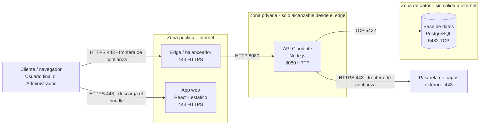

# Guion docente — Clase 7: Redes y almacenamiento cloud

## Información de la clase
- Asignatura: Arquitectura de Sistemas Computacionales (FI303380)
- Duración del bloque: **120 min**
- Tipo: Clase regular (teoría + taller PI) · encuentro síncrono
- Enfoque: **Proyecto Integrador CloudLite App** (parte práctica)
- Sin fechas de periodo · sin bio · sin mapa completo del curso

## Objetivos de la clase
- Modelar red lógica (cliente, edge, app, datos) sin VPC de pago.
- Elegir tipo de almacenamiento según el caso de uso CloudLite.
- Completar el diagrama de despliegue del PI.

## Hoy avanzamos el PI en…
**Diagrama de despliegue: red, zonas, almacenamiento**

**Entregable concreto:** Diagrama Deployment en Mermaid dentro de ExamLab (3 zonas + puertos) + tipo de almacenamiento por componente

**Herramienta:** ExamLab (Mermaid) · boceto en draw.io o Excalidraw

## Fundamento teórico para el docente
## Apoyo por diapositiva

Todo lo que hay que decir **esta proyectado**. Esta seccion dice que subrayar en cada lamina, no repite su contenido.

**[Slide 7] El tercer angulo: que responde el diagrama de despliegue (1/2)** — 5 vinetas.
  - Conviene tener claro el mapa de los tres diagramas del curso, porque el estudiante cree que dibuja lo mismo tres veces.
  - Lo que se califica hoy son 25 de los 100 puntos de la actividad del Corte 2, en tres preguntas: 14 puntos el diagrama de despliegue, 5.5 el tipo de almacenamiento de cada componente y 5.5 la tabla de correspondencia con el C4 Containers.

**[Slide 8] El tercer angulo: que responde el diagrama de despliegue (2/2)** — 4 vinetas.

**[Slide 9] IP, puerto y protocolo: las tres etiquetas de cada flecha (1/2)** — 3 vinetas.
  - Para etiquetar ese diagrama hacen falta tres conceptos de red que el docente debe definir en una frase.
  - Una direccion IP identifica una maquina dentro de una red.
  - Ahi esta el amarre: cuando en Killercoda se ejecuto el contenedor publicando un puerto, esa linea era la decision de que superficie queda expuesta, tema de la Clase 6, y hoy esa decision se dibuja.

**[Slide 10] IP, puerto y protocolo: las tres etiquetas de cada flecha (2/2)** — 3 vinetas.

**[Slide 11] Subred publica y privada: lo definen las rutas, no el nombre (1/2)** — 5 vinetas.
  - Una privada no lo tiene; solo se alcanza desde dentro, aunque normalmente si puede salir para descargar actualizaciones.
  - Conviene ademas nombrar la frontera de confianza, que vale 2 puntos: es la linea donde termina lo que el estudiante controla y empieza lo que no.

**[Slide 12] Subred publica y privada: lo definen las rutas, no el nombre (2/2)** — 3 vinetas.

**[Slide 13] DNS y balanceador de carga (1/2)** — 4 vinetas.
  - El balanceador de carga recibe todas las peticiones y las reparte entre varias instancias iguales del mismo servicio, con algoritmos como round robin o menor numero de conexiones activas.

**[Slide 14] DNS y balanceador de carga (2/2)** — 2 vinetas.

**[Slide 15] Los tres nombres de almacenamiento que califica la pregunta 5 (1/3)** — 4 vinetas.
  - Vale la pena escribirlas en el tablero y sostenerlas toda la clase.

**[Slide 16] Los tres nombres de almacenamiento que califica la pregunta 5 (2/3)** — 6 vinetas.

**[Slide 17] Los tres nombres de almacenamiento que califica la pregunta 5 (3/3)** — 3 vinetas.

**[Slide 18] El caso de la foto de perfil, y cuando la respuesta correcta es «no necesito objeto» (1/2)** — 5 vinetas.
  - Y ahora la otra mitad, que es la que sorprende al docente: si el dominio del estudiante no maneja archivos, imagenes ni documentos adjuntos, la respuesta correcta y completa es declarar que NO necesita almacenamiento de objetos y explicar por que.

**[Slide 19] El caso de la foto de perfil, y cuando la respuesta correcta es «no necesito objeto» (2/2)** — 4 vinetas.

**[Slide 20] Trazabilidad: la tabla de correspondencia de la pregunta 6 (1/3)** — 3 vinetas.
  - Queda la trazabilidad, donde mas puntos se pierden y donde vive una pregunta entera.

**[Slide 21] Trazabilidad: la tabla de correspondencia de la pregunta 6 (2/3)** — 3 vinetas.

**[Slide 22] Trazabilidad: la tabla de correspondencia de la pregunta 6 (3/3)** — 3 vinetas.

**[Slide 23] Recorrer una peticion de CloudLite de punta a punta (1/2)** — 5 vinetas.

**[Slide 24] Recorrer una peticion de CloudLite de punta a punta (2/2)** — 2 vinetas.

**[Slide 25] El molde de Mermaid, linea por linea (1/3)** — 6 vinetas.
  - Hay cinco cosas que el docente debe poder explicar sin titubear.
  - Se escribe flowchart LR, donde LR significa de izquierda a derecha, y es lo que hace que el recorrido cliente, edge, aplicacion, datos se lea como un flujo y no como una torre.
  - Vale la pena senalar la caja de la base de datos y decir «esta forma, dentro de este subgraph, son 4 de los 14 puntos».
  - Dos advertencias practicas.
  - Sirven para dejar una nota al evaluador, no para responder.

**[Slide 26] El molde de Mermaid, linea por linea (2/3)** — 4 vinetas.

**[Slide 27] El molde de Mermaid, linea por linea (3/3)** — 4 vinetas.

**[Slide 28] Preguntas frecuentes del grupo (1/2)** — 4 vinetas.
  - Estas cuatro aparecen todos los semestres y las cuatro se responden con material que ya esta proyectado.
  - Si un desarrollador necesita entrar, se hace por un unico host intermedio controlado, llamado bastion.
  - Por eso las zonas se llaman Publica, Privada y Datos.
  - El PNG exportado va a la carpeta del Proyecto Integrador, para el informe, y no reemplaza la respuesta.

**[Slide 29] Preguntas frecuentes del grupo (2/2)** — 5 vinetas.

**[Slide 30] El diagrama de Despliegue: donde corre cada cosa** — 23 vinetas.

**[Slide 31] Que tipo de almacenamiento pide cada componente** — 11 vinetas.

## Referencias a diapositivas
Numeración real del deck `Clases/Clase 7 - Redes y almacenamiento cloud/Presentacion.pptx` (solo tema
de esta clase). Las etiquetas [Slide N] del plan y del fundamento apuntan aquí.

1. Portada · Clase 7 · Redes y almacenamiento cloud
2. Agenda de hoy (120 min)
3. Objetivos de la clase
4. Red lógica para el diagrama
5. Almacenamiento
6. Checklist del diagrama Deployment
7. El tercer angulo: que responde el diagrama de despliegue (1/2)
8. El tercer angulo: que responde el diagrama de despliegue (2/2)
9. IP, puerto y protocolo: las tres etiquetas de cada flecha (1/2)
10. IP, puerto y protocolo: las tres etiquetas de cada flecha (2/2)
11. Subred publica y privada: lo definen las rutas, no el nombre (1/2)
12. Subred publica y privada: lo definen las rutas, no el nombre (2/2)
13. DNS y balanceador de carga (1/2)
14. DNS y balanceador de carga (2/2)
15. Los tres nombres de almacenamiento que califica la pregunta 5 (1/3)
16. Los tres nombres de almacenamiento que califica la pregunta 5 (2/3)
17. Los tres nombres de almacenamiento que califica la pregunta 5 (3/3)
18. El caso de la foto de perfil, y cuando la respuesta correcta es «no necesito objeto» (1/2)
19. El caso de la foto de perfil, y cuando la respuesta correcta es «no necesito objeto» (2/2)
20. Trazabilidad: la tabla de correspondencia de la pregunta 6 (1/3)
21. Trazabilidad: la tabla de correspondencia de la pregunta 6 (2/3)
22. Trazabilidad: la tabla de correspondencia de la pregunta 6 (3/3)
23. Recorrer una peticion de CloudLite de punta a punta (1/2)
24. Recorrer una peticion de CloudLite de punta a punta (2/2)
25. El molde de Mermaid, linea por linea (1/3)
26. El molde de Mermaid, linea por linea (2/3)
27. El molde de Mermaid, linea por linea (3/3)
28. Preguntas frecuentes del grupo (1/2)
29. Preguntas frecuentes del grupo (2/2)
30. El diagrama de Despliegue: donde corre cada cosa
31. Que tipo de almacenamiento pide cada componente
32. Ejemplo de diagrama de despliegue (Deployment)
33. El Despliegue en Mermaid: el molde que ExamLab renderiza
34. Herramientas de hoy
35. Del boceto a ExamLab (diagrama)
36. PI CloudLite — entregable de hoy
37. Manos a la obra (paso a paso)
38. Para continuar (PI)
39. Clase 7 · PI en movimiento

## Plan de clase minuto a minuto (120 min)

### 0–10 · Encuadre PI · [Slide 2][Slide 3][Slide 36]
Di casi literal: «Hoy avanzamos el PI CloudLite App en: **Diagrama de despliegue: red, zonas, almacenamiento**.
Entregable concreto: Diagrama Deployment en Mermaid dentro de ExamLab (3 zonas + puertos) + tipo de almacenamiento por componente.
Teoría breve y luego taller; no es un lab suelto.»
Pasa la diapositiva de agenda y la de objetivos. Abre el enunciado PI si alguien aún no lo tiene.
Pregunta de arranque (1 min): «¿En qué quedó tu CloudLite la clase pasada?» — sirve para detectar estudiantes rezagados antes de avanzar.

### 10–40 · Teoría Core (al servicio del taller) · desde [Slide 4]
Cubre estos conceptos, en este orden, ~10 min cada uno, con su diapositiva:
- **Red lógica para el diagrama** · [Slide 4]
- **Almacenamiento** · [Slide 5]
- **Checklist del diagrama Deployment** · [Slide 6]

**Ninguna se salta**: cada una de esas diapositivas es el mecanismo con que se resuelve
al menos una pregunta de la actividad calificada de hoy.
El desarrollo completo de cada uno está arriba, en «Fundamento teórico para el docente»:
esa sección está escrita para que puedas dictarla sin consultar otra fuente.
Cada 8–10 min amarra al artefacto: «esto es lo que van a dejar hoy en su informe/diagrama/repo».
Pide un estudiante voluntario y usa SU dominio como ejemplo en vivo (no el de la demo).

### 40–55 · Demo en vivo · [Slide 35]
Herramienta del día: **ExamLab (Mermaid) · boceto en draw.io o Excalidraw**.
**Demo que usted debe poder repetir:** Del boceto de tres zonas al Mermaid que se califica

1. En draw.io o Excalidraw dibuje TRES rectangulos, rotulados «Zona publica», «Zona privada» y «Zona de datos».
2. Reparta las cajas de CloudLite: `Edge / balanceador` y `App web` en la publica, `API CloudLite` en la privada, `Base de datos` en la de datos — nunca en la publica. El `Cliente / navegador` va FUERA de las tres zonas: es el actor, no algo que usted despliegue, y esa es una de las dos filas sin par de la pregunta 6.
3. Etiquete cada flecha con su puerto (443 al edge, 8080 a la API, 5432 a la base de datos) y saque una flecha aparte a la `Pasarela de pagos` externa: ahi esta la frontera de confianza, y son 2 de los 14 pts.
4. Pregunte: «si un atacante llega desde internet, con que se topa primero?» — eso es superficie de exposicion.
5. Traduzca ese boceto a Mermaid (el codigo de referencia esta abajo), peguelo en la pregunta 4 de ExamLab y proyectelo RENDERIZADO: 2 de los 14 pts son que renderice sin error.
6. Verifique en voz alta que los nombres de los servicios son LOS MISMOS del C4 Containers de la Clase 4.

**Referencia del resultado:** Despliegue en tres zonas de CloudLite (el resultado de la demo). Si la red falla o prefiere no dibujar a mano, pegue este codigo en la pregunta de diagrama de ExamLab y proyectelo renderizado; tambien sirve para volver a generar la imagen en cualquier editor que soporte Mermaid.

Narra los clics en voz alta. Si falla la red, proyecta la [Slide 33], que ya trae el resultado de la demo, y recórrela rótulo por rótulo.
Cierra la demo con: «copien la estructura, no el dominio de mi ejemplo.»

**Cierra la demo dentro de ExamLab** [Slide 35] — es el paso que el estudiante no adivina: pasa el boceto a codigo Mermaid con ayuda de una IA, pegalo en la pregunta de diagrama y muestralo renderizado.

**Del boceto al codigo Mermaid.** No subas una imagen: la respuesta de esta pregunta es texto Mermaid.

- **1. Disena visual** Dibuja el diagrama como quieras en Excalidraw o draw.io: es mas rapido arrastrar cajas que escribir codigo, y ahi es donde piensas el modelo.
- **2. Traduce con IA** Copia o describe tu boceto a una IA y pidele el codigo Mermaid: «convierte este diagrama a Mermaid usando `flowchart`». Revisa el resultado: la IA acierta la sintaxis, no tu modelo.
- **3. Pega y renderiza en ExamLab** Pega ese codigo en la caja de texto de la pregunta y mira como lo dibuja la plataforma. Si no renderiza, corrige ahi mismo: lo que se califica es el diagrama renderizado dentro de ExamLab.
- **4. Guarda el PNG para tu PI** Exporta tambien la imagen a la carpeta de tu Proyecto Integrador. Esa copia es para tu informe; no reemplaza la respuesta en la plataforma.

### 55–100 · Taller guiado PI (individual · equipos de 2–3 solo si tú los autorizaste) · [Slide 37]
Proyecta la lista de pasos del taller del estudiante (está en la sección «Actividad / taller» de este guion).
Circula por mesas/Meet con la lista de errores frecuentes de abajo en la mano: son los que vas a ver hoy.
A los 80 min anuncia: «faltan 20 min. Falta evidencia: PNG/YAML/enlace. Empiecen a subir borrador.»

### 100–115 · Comprobación y evidencias
Haz 3–4 de las preguntas de comprobación oral de abajo, a personas distintas y al azar
(no al que levanta la mano). Es el mecanismo para verificar la regla de los 60 segundos.
Aplica el quiz corto de `Kit docente/Clase 7/Quiz Clase 7 - Redes y almacenamiento cloud.docx`
(la clave va en archivo aparte y **no se proyecta**).
Mientras responden, verifica que el entregable esté realmente subido.
Retroalimenta 2–3 estudiantes en voz alta, nombrando el error y la corrección concreta.

### 115–120 · Cierre · [Slide 39]
Di: «Queda avanzado: Diagrama de despliegue: red, zonas, almacenamiento.
Criterio de éxito: el estudiante explica su artefacto en 60 s.
Entrega domingo 23:59 en ExamLab. Siguiente hito del PI según el plan.»

## Actividad / taller (detalle)
1. Paso 1: dibuje primero el boceto del despliegue en Excalidraw o draw.io con las tres zonas (publica, privada y de datos), y despues pidale a una IA que lo traduzca a Mermaid; peguelo en la pregunta 4 y verifique en el diagrama ya renderizado que la base de datos NO quede en la zona publica.
2. Paso 2: etiquete en ese mismo diagrama el puerto de cada componente y marque las fronteras de confianza, es decir donde termina lo que usted controla; verifique que no aparezcan nombres de subredes ni de servicios de un proveedor concreto.
3. Paso 3: justifique en la pregunta 5 el tipo de almacenamiento de cada componente diciendo que caracteristica del dato lo exige; si su dominio no necesita almacenamiento de objetos, declarelo y justifiquelo en vez de agregarlo.
4. Paso 4: complete en la pregunta 6 la tabla de correspondencia entre el C4 Containers y el Despliegue, con una fila por componente y su zona, y liste los renombres que aplico; si no hubo ninguno, digalo explicitamente.

### Criterio de éxito
- Artefacto integrado al paquete PI (no archivo huérfano).
- Evidencia adjunta.
- Explicación oral de 60 s por estudiante (muestreo; si autorizaste equipos, pregunta a cualquier integrante).

## Errores frecuentes del estudiante (y cómo corregirlos en el momento)
- Dibujar «la nube» como una caja difusa. Exija las dos zonas, publica y privada, explicitas.
- Poner la base de datos en la subred publica «para que sea mas facil probar». Es exactamente lo que la Clase 6 acaba de prohibir.
- Renombrar servicios respecto al C4 Containers, con lo que los dos diagramas dejan de ser el mismo sistema.

## Preguntas de comprobación oral (no son del quiz)
Úsalas en el tramo 100–115, a personas distintas y al azar.
1. Que va en la subred publica y que en la privada, y por que?
1. Que hace un balanceador de carga en una frase?
1. Cuando conviene object storage y cuando la base de datos?

## Solución del taller (privada)
`Kit docente/Clase 7/Solucion Taller Clase 7 - CloudLite.docx` — es la referencia con la que
comparas lo que entregan los estudiantes. **No proyectarla completa** antes de que trabajen.

## Quiz
`Kit docente/Clase 7/Quiz Clase 7 - Redes y almacenamiento cloud.docx` (versión estudiante, sin respuestas)
y `Kit docente/Clase 7/Quiz Clase 7 - CLAVE DOCENTE.docx` (clave, privada).

## Capturas sugeridas
- 📸 La herramienta del día en uso con el artefacto CloudLite [[captura: demo-clase07.png | receta: 1) Abre ExamLab (Mermaid) · boceto en draw.io o Excalidraw y repite la demo de este guion.  2) Captura solo la ventana útil, no el escritorio completo.  3) Recorta a ~1200 px de ancho.  4) Guárdala como Kit docente/Clase 7/Capturas/demo-clase07.png.  5) Vuelve a generar el guion y la imagen queda embebida aquí sola. Detalle en Capturas/README.txt.]]
- 📸 Evidencia del entregable de un estudiante (diagrama / YAML / lab) [[captura: evidencia-clase07.png | receta: 1) Con permiso del estudiante, captura su artefacto de hoy.  2) Recorta nombre y correo antes de guardar.  3) Guárdala como Kit docente/Clase 7/Capturas/evidencia-clase07.png.  4) Es para tu registro del corte; no se proyecta en clase.]]

## Notas operativas
- Plataforma de entrega: ExamLab (https://uniaj.examlab.workers.dev/). No es la plataforma oficial de la UNIAJC; la universidad no tiene campus virtual propio.
- Prohibido pedir cloud con tarjeta: todo el curso corre con free tier o en el navegador.
- Día de parcial = solo evaluación (no aplica a esta clase).
