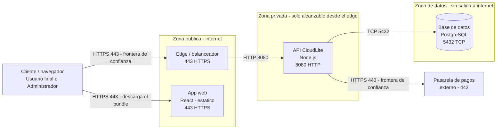

# Guion docente — Clase 7: Redes y almacenamiento cloud

## Información de la clase
- Asignatura: Arquitectura de Sistemas Computacionales (FI303380)
- Duración del bloque: **120 min**
- Tipo: Clase regular (teoría + taller PI) · encuentro síncrono
- Enfoque: **Proyecto Integrador CloudLite App** (parte práctica)
- Sin fechas de periodo · sin bio · sin mapa completo del curso

## Objetivos de la clase
- Modelar red lógica (cliente, edge, app, datos) sin VPC de pago.
- Elegir tipo de almacenamiento según el caso de uso CloudLite.
- Completar el diagrama de despliegue del PI.

## Hoy avanzamos el PI en…
**Diagrama de despliegue: red, zonas, almacenamiento**

**Entregable concreto:** Diagrama Deployment en Mermaid en la plataforma del curso (3 zonas + puertos) + tipo de almacenamiento por componente

**Herramienta:** Navegador · editor de diagramas del curso (Mermaid) · boceto libre opcional

## Fundamento teórico para el docente
## Apoyo por diapositiva

Todo lo que hay que decir **esta proyectado**. Esta seccion dice que subrayar en cada lamina, no repite su contenido.

**[Slide 7] El tercer angulo: que responde el diagrama de despliegue (1/2)** — 4 vinetas.
  - Conviene tener claro el mapa de los tres diagramas del curso, porque el estudiante cree que dibuja lo mismo tres veces.
  - (Sobre la actividad, no se proyecta) Lo que se califica hoy son 25 de los 100 puntos de la actividad del Corte 2, en tres preguntas: 14 puntos el diagrama de despliegue, 5.5 el tipo de almacenamiento de cada componente y 5.5 la tabla de correspondencia con el C4 Containers.
  - (Sobre la actividad, no se proyecta) Y hay un dato que cambia como se dicta la clase: el entregable NO es una imagen.
  - (Sobre la actividad, no se proyecta) La pregunta 4 se responde con codigo Mermaid pegado en la plataforma del curso, que la plataforma renderiza en la misma pantalla, y 2 de esos 14 puntos son literalmente que renderice sin error.
  - (Sobre la actividad, no se proyecta) El boceto en draw.io o en Excalidraw sigue sirviendo, y es el paso 1 del metodo que se proyecta hoy, pero es un borrador de trabajo: no se entrega y no se califica.

**[Slide 8] El tercer angulo: que responde el diagrama de despliegue (2/2)** — 2 vinetas.

**[Slide 9] IP, puerto y protocolo: las tres etiquetas de cada flecha** — 4 vinetas.
  - Para etiquetar ese diagrama hacen falta tres conceptos de red que el docente debe definir en una frase.
  - Una direccion IP identifica una maquina dentro de una red.
  - Ahi esta el amarre: cuando en Killercoda se ejecuto el contenedor publicando un puerto, esa linea era la decision de que superficie queda expuesta, tema de la Clase 6, y hoy esa decision se dibuja.
  - (Sobre la actividad, no se proyecta) Esto no es decorativo: la pregunta 4 da 2 puntos por que cada componente lleve su puerto etiquetado, y el diagrama de referencia usa exactamente tres, 443 en el edge, 8080 en la API y 5432 en la base de datos, que son los mismos que el estudiante ya escribio en el EXPOSE de su Dockerfile de la Clase 3.

**[Slide 10] Subred publica y privada: lo definen las rutas, no el nombre (1/2)** — 4 vinetas.
  - Una privada no lo tiene; solo se alcanza desde dentro, aunque normalmente si puede salir para descargar actualizaciones.
  - Conviene ademas nombrar la frontera de confianza: es la linea donde termina lo que el estudiante controla y empieza lo que no.
  - (Sobre la actividad, no se proyecta) Los 4 puntos de ubicacion de la pregunta 4 se pierden COMPLETOS si la base de datos queda en la zona publica: no es un descuento parcial, es el error que la pregunta esta disenada para detectar.
  - (Sobre la actividad, no se proyecta) Y las tres zonas rotuladas valen otros 4 puntos por si mismas, asi que un diagrama de dos zonas, aunque tenga la base de datos bien puesta, ya empezo perdiendo.

**[Slide 11] Subred publica y privada: lo definen las rutas, no el nombre (2/2)** — 2 vinetas.

**[Slide 12] DNS y balanceador de carga (1/2)** — 4 vinetas.
  - El balanceador de carga recibe todas las peticiones y las reparte entre varias instancias iguales del mismo servicio, con algoritmos como round robin o menor numero de conexiones activas.

**[Slide 13] DNS y balanceador de carga (2/2)** — 2 vinetas.

**[Slide 14] Los tres nombres de almacenamiento (1/3)** — 4 vinetas.
  - Vale la pena escribirlas en el tablero y sostenerlas toda la clase.
  - Y cada eleccion se justifica nombrando la caracteristica del dato.

**[Slide 15] Los tres nombres de almacenamiento (2/3)** — 5 vinetas.

**[Slide 16] Los tres nombres de almacenamiento (3/3)** — 3 vinetas.

**[Slide 17] El caso de la foto de perfil, y cuando la respuesta correcta es «no necesito objeto» (1/2)** — 4 vinetas.
  - Y ahora la otra mitad, que es la que sorprende al docente: si el dominio del estudiante no maneja archivos, imagenes ni documentos adjuntos, la respuesta correcta y completa es declarar que NO necesita almacenamiento de objetos y explicar por que.
  - (Sobre la actividad, no se proyecta) La rubrica lo dice al reves de como el grupo lo espera: suma completo quien lo declare y justifique, y se descuenta a quien agregue un almacen de objetos sin un dato que lo pida.
  - (Sobre la actividad, no se proyecta) Hay que anunciarlo antes del taller, porque si no medio salon inventa un bucket «porque suena a cloud» y pierde puntos por agregar.

**[Slide 18] El caso de la foto de perfil, y cuando la respuesta correcta es «no necesito objeto» (2/2)** — 3 vinetas.

**[Slide 19] Trazabilidad: la tabla de correspondencia (1/2)** — 3 vinetas.
  - (Sobre la actividad, no se proyecta) Queda la trazabilidad, donde mas puntos se pierden y donde vive una pregunta entera.
  - (Sobre la actividad, no se proyecta) Los 5.5 puntos se reparten asi, y conviene decirlo en voz alta: 2 puntos la explicacion de por que los nombres deben coincidir, y la respuesta esperada es que los dos diagramas son el MISMO sistema visto desde angulos distintos, uno dice que piezas hay y el otro donde se ejecutan; 2.5 puntos la tabla completa, con una fila por componente y su zona; y 1 punto listar los renombres que se aplicaron, o declarar explicitamente que no hubo ninguno, que tambien vale.
  - (Sobre la actividad, no se proyecta) La trampa esta en la palabra completa: se descuenta si la tabla deja fuera un componente que si aparece en alguno de los dos diagramas, asi que hay que instruir el gesto de llenarla con los dos diagramas abiertos al lado y contando cajas.

**[Slide 20] Trazabilidad: la tabla de correspondencia (2/2)** — 2 vinetas.

**[Slide 21] Recorrer una peticion de CloudLite de punta a punta (1/2)** — 4 vinetas.
  - (Sobre la actividad, no se proyecta) Ese recorrido, con cada flecha etiquetada con protocolo y puerto y cada caja dentro de su zona, es la estructura que la pregunta 4 califica; lo que se pega en la plataforma es su version en Mermaid, que es la seccion siguiente.

**[Slide 22] Recorrer una peticion de CloudLite de punta a punta (2/2)** — 2 vinetas.

**[Slide 23] El molde de Mermaid, linea por linea (1/2)** — 6 vinetas.
  - Hay cinco cosas que el docente debe poder explicar sin titubear.
  - Se escribe flowchart LR, donde LR significa de izquierda a derecha, y es lo que hace que el recorrido cliente, edge, aplicacion, datos se lea como un flujo y no como una torre.
  - Dos advertencias practicas.
  - Sirven para dejar una nota al evaluador, no para responder.
  - (Sobre la actividad, no se proyecta) La diapositiva del molde existe porque el estudiante puede tener el modelo correcto en la cabeza y perder puntos por sintaxis, y porque 2 de los 14 son que el diagrama renderice.
  - (Sobre la actividad, no se proyecta) Vale la pena senalar la caja de la base de datos y decir «esta forma, dentro de este subgraph, son 4 de los 14 puntos».
  - (Sobre la actividad, no se proyecta) Si no se dibuja, se corrige ahi mismo; nadie califica un codigo que no dibuja.

**[Slide 24] El molde de Mermaid, linea por linea (2/2)** — 6 vinetas.

**[Slide 25] Preguntas frecuentes del grupo** — 5 vinetas.
  - Estas cuatro aparecen todos los semestres y las cuatro se responden con material que ya esta proyectado.
  - Si un desarrollador necesita entrar, se hace por un unico host intermedio controlado, llamado bastion.
  - Por eso las zonas se llaman Publica, Privada y Datos.
  - El PNG exportado va a la carpeta del Proyecto Integrador, para el informe, y no reemplaza la respuesta.
  - (Sobre la actividad, no se proyecta) Es mas: la rubrica DESCUENTA por nombrar subredes o servicios de un proveedor concreto, asi que escribir VPC, el nombre de una zona de disponibilidad o el de un servicio de marca resta en vez de sumar.
  - (Sobre la actividad, no se proyecta) «Puedo subir mi imagen del diagrama en vez del codigo Mermaid?» No para la pregunta 4: lo que se califica es el diagrama renderizado dentro de la plataforma.
  - (Sobre la actividad, no se proyecta) «Mi sistema es pequeno, solo tiene la aplicacion y la base de datos; igual necesito tres zonas?» Si, y no es burocracia: las tres zonas son 4 puntos y el sentido de la separacion es justamente que el punto de entrada, la logica y los datos tengan grados de exposicion distintos.

**[Slide 26] El diagrama de Despliegue: donde corre cada cosa** — 23 vinetas.

**[Slide 27] Que tipo de almacenamiento pide cada componente** — 11 vinetas.

## Referencias a diapositivas
Numeración real del deck `Clases/Clase 7 - Redes y almacenamiento cloud/Presentacion.pptx` (solo tema
de esta clase). Las etiquetas [Slide N] del plan y del fundamento apuntan aquí.

1. Portada · Clase 7 · Redes y almacenamiento cloud
2. Agenda de hoy (120 min)
3. Objetivos de la clase
4. Red lógica para el diagrama
5. Almacenamiento
6. Checklist del diagrama Deployment
7. El tercer angulo: que responde el diagrama de despliegue (1/2)
8. El tercer angulo: que responde el diagrama de despliegue (2/2)
9. IP, puerto y protocolo: las tres etiquetas de cada flecha
10. Subred publica y privada: lo definen las rutas, no el nombre (1/2)
11. Subred publica y privada: lo definen las rutas, no el nombre (2/2)
12. DNS y balanceador de carga (1/2)
13. DNS y balanceador de carga (2/2)
14. Los tres nombres de almacenamiento (1/3)
15. Los tres nombres de almacenamiento (2/3)
16. Los tres nombres de almacenamiento (3/3)
17. El caso de la foto de perfil, y cuando la respuesta correcta es «no necesito objeto» (1/2)
18. El caso de la foto de perfil, y cuando la respuesta correcta es «no necesito objeto» (2/2)
19. Trazabilidad: la tabla de correspondencia (1/2)
20. Trazabilidad: la tabla de correspondencia (2/2)
21. Recorrer una peticion de CloudLite de punta a punta (1/2)
22. Recorrer una peticion de CloudLite de punta a punta (2/2)
23. El molde de Mermaid, linea por linea (1/2)
24. El molde de Mermaid, linea por linea (2/2)
25. Preguntas frecuentes del grupo
26. El diagrama de Despliegue: donde corre cada cosa
27. Que tipo de almacenamiento pide cada componente
28. Ejemplo de diagrama de despliegue (Deployment)
29. El Despliegue en Mermaid: el molde que un visor renderiza
30. Del boceto al código Mermaid
31. Clase 7 · cierre conceptual

## Plan de clase minuto a minuto (120 min)

### 0–10 · Encuadre PI · [Slide 2][Slide 3]
Di casi literal: «Hoy avanzamos el PI CloudLite App en: **Diagrama de despliegue: red, zonas, almacenamiento**.
Entregable concreto: Diagrama Deployment en Mermaid en la plataforma del curso (3 zonas + puertos) + tipo de almacenamiento por componente.
Teoría breve y luego taller; no es un lab suelto.»
Pasa la diapositiva de agenda y la de objetivos. Abre el enunciado PI si alguien aún no lo tiene.
Pregunta de arranque (1 min): «¿En qué quedó tu CloudLite la clase pasada?» — sirve para detectar estudiantes rezagados antes de avanzar.

### 10–40 · Teoría Core (al servicio del taller) · desde [Slide 4]
Cubre estos conceptos, en este orden, ~10 min cada uno, con su diapositiva:
- **Red lógica para el diagrama** · [Slide 4]
- **Almacenamiento** · [Slide 5]
- **Checklist del diagrama Deployment** · [Slide 6]

**Ninguna se salta**: cada una de esas diapositivas es el mecanismo con que se resuelve
al menos una pregunta de la actividad calificada de hoy.
El desarrollo completo de cada uno está arriba, en «Fundamento teórico para el docente»:
esa sección está escrita para que puedas dictarla sin consultar otra fuente.
Cada 8–10 min amarra al artefacto: «esto es lo que van a dejar hoy en su informe/diagrama/repo».
Pide un estudiante voluntario y usa SU dominio como ejemplo en vivo (no el de la demo).

### 40–55 · Demo en vivo · [Slide 30]
Herramienta del día: **Navegador · editor de diagramas del curso (Mermaid) · boceto libre opcional**.
**Demo que usted debe poder repetir:** Del boceto de tres zonas al Mermaid que se califica

1. En draw.io o Excalidraw dibuje TRES rectangulos, rotulados «Zona publica», «Zona privada» y «Zona de datos».
2. Reparta las cajas de CloudLite: `Edge / balanceador` y `App web` en la publica, `API CloudLite` en la privada, `Base de datos` en la de datos — nunca en la publica. El `Cliente / navegador` va FUERA de las tres zonas: es el actor, no algo que usted despliegue, y esa es una de las dos filas sin par de la pregunta 6.
3. Etiquete cada flecha con su puerto (443 al edge, 8080 a la API, 5432 a la base de datos) y saque una flecha aparte a la `Pasarela de pagos` externa: ahi esta la frontera de confianza, y son 2 de los 14 pts.
4. Pregunte: «si un atacante llega desde internet, con que se topa primero?» — eso es superficie de exposicion.
5. Traduzca ese boceto a Mermaid (el codigo de referencia esta abajo), peguelo en la pregunta 4 de la actividad y proyectelo RENDERIZADO: 2 de los 14 pts son que renderice sin error.
6. Verifique en voz alta que los nombres de los servicios son LOS MISMOS del C4 Containers de la Clase 4.

**Referencia del resultado:** Despliegue en tres zonas de CloudLite (el resultado de la demo). Si la red falla o prefiere no dibujar a mano, pegue este codigo en la pregunta de diagrama de la actividad y proyectelo renderizado; tambien sirve para volver a generar la imagen en cualquier editor que soporte Mermaid.

```mermaid
flowchart LR
    cliente["Cliente / navegador<br/>Usuario final o Administrador"]
    subgraph publica["Zona publica - internet"]
        edge["Edge / balanceador<br/>443 HTTPS"]
        web["App web<br/>React - estatico<br/>443 HTTPS"]
    end
    subgraph privada["Zona privada - solo alcanzable desde el edge"]
        api["API CloudLite<br/>Node.js<br/>8080 HTTP"]
    end
    subgraph datos["Zona de datos - sin salida a internet"]
        db[("Base de datos<br/>PostgreSQL<br/>5432 TCP")]
    end
    pagos["Pasarela de pagos<br/>externo - 443"]
    cliente -->|"HTTPS 443 - frontera de confianza"| edge
    cliente -->|"HTTPS 443 - descarga el bundle"| web
    edge -->|"HTTP 8080"| api
    api -->|"TCP 5432"| db
    api -->|"HTTPS 443 - frontera de confianza"| pagos
```

Narra los clics en voz alta. Si falla la red, proyecta la [Slide 29], que ya trae el resultado de la demo, y recórrela rótulo por rótulo.
Cierra la demo con: «copien la estructura, no el dominio de mi ejemplo.»

**Si se hace el taller, cierra la demo en la plataforma del curso** (sin diapositiva: el flujo está en el `Taller … .docx`) — es el paso que el estudiante no adivina: pasa el boceto a codigo Mermaid con ayuda de una IA, pegalo en la pregunta de diagrama y muestralo renderizado.

**Del boceto al codigo Mermaid.** No subas una imagen: la respuesta de esta pregunta es texto Mermaid.

- **1. Disena visual** Dibuja el diagrama como quieras en Excalidraw o draw.io: es mas rapido arrastrar cajas que escribir codigo, y ahi es donde piensas el modelo.
- **2. Traduce con IA** Copia o describe tu boceto a una IA y pidele el codigo Mermaid: «convierte este diagrama a Mermaid usando `flowchart`». Revisa el resultado: la IA acierta la sintaxis, no tu modelo.
- **3. Pega y renderiza en la plataforma del curso** Pega ese codigo en la caja de texto de la pregunta y mira como lo dibuja la plataforma. Si no renderiza, corrige ahi mismo: lo que se califica es el diagrama renderizado dentro de la plataforma del curso.
- **4. Guarda el PNG para tu PI** Exporta tambien la imagen a la carpeta de tu Proyecto Integrador. Esa copia es para tu informe; no reemplaza la respuesta en la plataforma.

### 55–100 · Taller guiado PI (individual · equipos de 2–3 solo si tú los autorizaste) · opcional · sin diapositiva
El taller es **opcional** y ya no está en el deck: si se hace hoy, comparte el `Taller … .docx` de
`Clases/Clase 7 - Redes y almacenamiento cloud/` (los pasos también están en la sección «Actividad / taller» de este guion).
Circula por mesas/Meet con la lista de errores frecuentes de abajo en la mano: son los que vas a ver hoy.
A los 80 min anuncia: «faltan 20 min. Falta evidencia: PNG/YAML/enlace. Empiecen a subir borrador.»

### 100–115 · Comprobación y evidencias
Haz 3–4 de las preguntas de comprobación oral de abajo, a personas distintas y al azar
(no al que levanta la mano). Es el mecanismo para verificar la regla de los 60 segundos.
Aplica el quiz corto de `Kit docente/Clase 7/Quiz Clase 7 - Redes y almacenamiento cloud.docx`
(la clave va en archivo aparte y **no se proyecta**).
Mientras responden, verifica que el entregable esté realmente subido.
Retroalimenta 2–3 estudiantes en voz alta, nombrando el error y la corrección concreta.

### 115–120 · Cierre · [Slide 31]
Di: «Queda avanzado: Diagrama de despliegue: red, zonas, almacenamiento.
Criterio de éxito: el estudiante explica su artefacto en 60 s.
Entrega domingo 23:59 en la plataforma del curso. Siguiente hito del PI según el plan.»

## Actividad / taller (detalle)
1. Paso 1: dibuje primero el boceto del despliegue en Excalidraw o draw.io con las tres zonas (publica, privada y de datos), y despues pidale a una IA que lo traduzca a Mermaid; peguelo en la pregunta 4 y verifique en el diagrama ya renderizado que la base de datos NO quede en la zona publica.
2. Paso 2: etiquete en ese mismo diagrama el puerto de cada componente y marque las fronteras de confianza, es decir donde termina lo que usted controla; verifique que no aparezcan nombres de subredes ni de servicios de un proveedor concreto.
3. Paso 3: justifique en la pregunta 5 el tipo de almacenamiento de cada componente diciendo que caracteristica del dato lo exige; si su dominio no necesita almacenamiento de objetos, declarelo y justifiquelo en vez de agregarlo.
4. Paso 4: complete en la pregunta 6 la tabla de correspondencia entre el C4 Containers y el Despliegue, con una fila por componente y su zona, y liste los renombres que aplico; si no hubo ninguno, digalo explicitamente.

### Criterio de éxito
- Artefacto integrado al paquete PI (no archivo huérfano).
- Evidencia adjunta.
- Explicación oral de 60 s por estudiante (muestreo; si autorizaste equipos, pregunta a cualquier integrante).

## Errores frecuentes del estudiante (y cómo corregirlos en el momento)
- Dibujar «la nube» como una caja difusa. Exija las dos zonas, publica y privada, explicitas.
- Poner la base de datos en la subred publica «para que sea mas facil probar». Es exactamente lo que la Clase 6 acaba de prohibir.
- Renombrar servicios respecto al C4 Containers, con lo que los dos diagramas dejan de ser el mismo sistema.

## Preguntas de comprobación oral (no son del quiz)
Úsalas en el tramo 100–115, a personas distintas y al azar.
1. Que va en la subred publica y que en la privada, y por que?
1. Que hace un balanceador de carga en una frase?
1. Cuando conviene object storage y cuando la base de datos?

## Solución del taller (privada)
`Kit docente/Clase 7/Solucion Taller Clase 7 - CloudLite.docx` — es la referencia con la que
comparas lo que entregan los estudiantes. **No proyectarla completa** antes de que trabajen.

## Quiz
`Kit docente/Clase 7/Quiz Clase 7 - Redes y almacenamiento cloud.docx` (versión estudiante, sin respuestas)
y `Kit docente/Clase 7/Quiz Clase 7 - CLAVE DOCENTE.docx` (clave, privada).

## Capturas sugeridas
- 📸 La herramienta del día en uso con el artefacto CloudLite [[captura: demo-clase07.png | receta: 1) Abre Navegador · editor de diagramas del curso (Mermaid) · boceto libre opcional y repite la demo de este guion.  2) Captura solo la ventana útil, no el escritorio completo.  3) Recorta a ~1200 px de ancho.  4) Guárdala como Kit docente/Clase 7/Capturas/demo-clase07.png.  5) Vuelve a generar el guion y la imagen queda embebida aquí sola. Detalle en Capturas/README.txt.]]
- 📸 Evidencia del entregable de un estudiante (diagrama / YAML / lab) [[captura: evidencia-clase07.png | receta: 1) Con permiso del estudiante, captura su artefacto de hoy.  2) Recorta nombre y correo antes de guardar.  3) Guárdala como Kit docente/Clase 7/Capturas/evidencia-clase07.png.  4) Es para tu registro del corte; no se proyecta en clase.]]

## Notas operativas
- Plataforma de entrega: la plataforma del curso (la plataforma del curso). No es la plataforma oficial de la UNIAJC; la universidad no tiene campus virtual propio.
- Prohibido pedir cloud con tarjeta: todo el curso corre con free tier o en el navegador.
- Día de parcial = solo evaluación (no aplica a esta clase).
