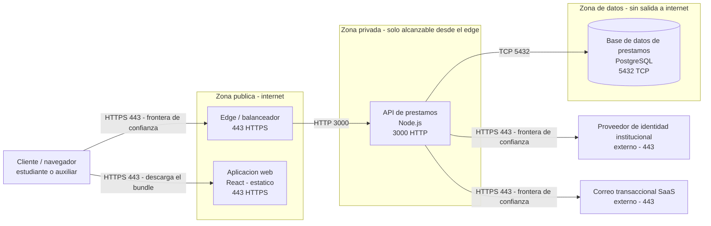
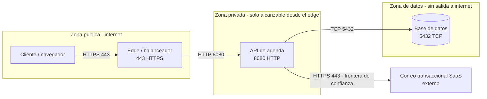

# Solucion — Actividad del Corte 2, preguntas 4 a 6 (despliegue en tres zonas, almacenamiento y correspondencia de nombres)

> **DOCUMENTO DOCENTE — PRIVADO.** No publicar en `Clases/` ni en ExamLab antes del cierre de la entrega.

**Resumen:** Las tres preguntas de la Clase 7 sobre **BiblioLite**, con el tercer angulo del sistema: donde se ejecuta cada pieza. La pregunta 4 vale 14 de los 25 puntos y tiene una trampa deliberada — **la base de datos en la zona publica cuesta 4 puntos completos** — y la 6 es la que cobra la trazabilidad de nombres que se viene exigiendo desde la Clase 4. Las tres se califican con el C4 Container del Corte 1 abierto al lado.

> Estas 3 preguntas valen **25 de los 100 puntos** de la actividad del Corte 2 (Clases 6, 7, 8 y 10). La 4 es de tipo **diagrama** y es la pregunta con mas puntos de toda la actividad: conviene que la peguen en la plataforma en la primera media hora del taller y no al final.

## Alineacion con el taller

- Taller del estudiante: `Clases/Clase 7 - Redes y almacenamiento cloud/`
- Configuracion en la plataforma: `Kit docente/Clase 7/Taller en ExamLab - Clase 7 (configuracion).md`
- Hito del PI: Diagrama de despliegue: red, zonas, almacenamiento
- Entregable: Diagrama Deployment (draw.io) + elección de storage (objeto/bloque/relacional conceptual)
- **Estas preguntas: 25.0 puntos** en 3 preguntas.

| # | Pregunta | Tipo | Puntos |
|---|---|---|---|
| 4 | Diagrama de Despliegue de BiblioLite | `diagrama` | 14.0 |
| 5 | Tipo de almacenamiento de cada componente de BiblioLite | `abierta` | 5.5 |
| 6 | Correspondencia entre el C4 Container y el Despliegue | `abierta` | 5.5 |

---

## Pregunta 4 · Diagrama de Despliegue de BiblioLite · 14.0 pts

### Respuesta esperada

**Las tres zonas y por que cada pieza esta donde esta**

- **Zona publica** — lo que internet alcanza directamente: el `Edge / balanceador` en el 443 y
  la `Aplicacion web`, que son archivos estaticos y por definicion publicos. Que el bundle de
  React sea publico no es una fuga: no contiene secretos, porque los secretos viven en la API.
- **Zona privada** — la `API de prestamos` en el **3000**, alcanzable **solo desde el edge**.
  Nadie desde internet abre una conexion directa al 3000. Ese numero no se eligio hoy: es el
  mismo `EXPOSE 3000` del Dockerfile de la Clase 3, y esa coherencia es parte de la nota.
- **Zona de datos** — la `Base de datos de prestamos` en el 5432, **sin salida a internet** y
  alcanzable unicamente desde la zona privada. No tiene puerto publicado hacia afuera ni ruta
  de salida: ni entra ni sale.

**Las fronteras de confianza**, marcadas en tres flechas: la del cliente hacia el edge (ahi
empieza lo que yo controlo) y las dos de la API hacia el `Proveedor de identidad
institucional` y el `Correo transaccional SaaS` (ahi termina). Los dos sistemas externos se
dibujan **fuera de las tres zonas** a proposito: no los despliego yo, no puedo cambiar su
configuracion y no puedo garantizar su disponibilidad — que es exactamente el riesgo 1 de la
pregunta 15 del Corte 1.

**Nada de nombres de proveedor.** No hay VPC, ni zona de disponibilidad, ni nombre de
servicio de marca. Las zonas son conceptuales y el diagrama tiene que servir igual en
cualquier proveedor, que es la posicion del curso desde el ADR-001: no se abren cuentas de
nube de pago.

**Lo que cambia respecto al C4 Container.** Aparecen dos piezas que alli no existian —el
`Cliente / navegador` y el `Edge / balanceador`— porque son infraestructura, no contenedores
con responsabilidad de negocio. Ese detalle es justo lo que la pregunta 6 pide declarar.

### Respuesta esperada (dominio de la solucion)

### Modelo de referencia que ve el estudiante

Es el que aparece en el enunciado de la plataforma, sobre el dominio **AgendaU**. Sirve para comparar estructura y conteos, no para calificar contenido:

### Como calificar

- 4 pts las **tres zonas presentes y rotuladas**: publica, privada y de datos. Los rotulos pueden variar en las palabras, pero las tres tienen que existir como frontera visible. Dos zonas valen la mitad.
- 4 pts **cada componente en la zona que le corresponde**. **Se pierden los 4 completos si la base de datos queda en la zona publica**, sin prorrateo. Es la penalizacion mas dura del diagrama y hay que anunciarla antes del taller: es el error que la pregunta busca detectar.
- 2 pts las **fronteras de confianza marcadas**: donde termina lo que el estudiante controla y empieza lo que no. Se acepta como etiqueta en la flecha, como nota o como estilo distinto, siempre que se pueda senalar.
- 2 pts **el puerto de cada componente**. Si falta el de una pieza se prorratea; si no hay ningun puerto, es cero. Los puertos tienen que ser creibles y **coherentes con el Dockerfile de la Clase 3**: si alla el `EXPOSE` era 3000 y aqui aparece 8080 sin explicacion, comentelo.
- 2 pts que renderice sin error en la plataforma.
- **Se descuenta por nombrar subredes o servicios de un proveedor concreto** (VPC, nombres de servicios de marca, zonas de disponibilidad). No es un capricho: el diagrama es conceptual y el curso no abre cuentas de pago, asi que un diagrama atado a un proveedor no se puede ni verificar.
- Los sistemas externos **fuera** de las tres zonas es lo correcto. Si el estudiante los mete en la zona publica, no descuente de la ubicacion de componentes: comente que lo que esta en las zonas es lo que el despliega.

### Errores frecuentes y que hacer

- **La base de datos en la zona publica.** Es el error caro (4 pts) y aparece todos los semestres, casi siempre por comodidad de dibujo: se pone al lado del cliente porque cabe mejor. Repita en voz alta antes del taller que la base no se alcanza desde internet nunca.
- Zonas dibujadas pero sin componentes dentro, o componentes sueltos fuera de toda zona. Cada pieza que usted despliega vive en exactamente una zona.
- Nombres de proveedor: «VPC», «subnet-public-1a», nombres de servicios de marca. Se descuenta y se explica: el diagrama tiene que sobrevivir a un cambio de proveedor, que es lo que el ADR-001 dejo abierto.
- Puertos inventados o repetidos: la API y la base en el mismo puerto, o el 443 en todo. Cada componente escucha en el suyo, y el de la API ya estaba decidido desde el `EXPOSE` de la Clase 3.
- Flechas sin direccion o bidireccionales por defecto. La direccion importa: que la API llame a la base no significa que la base llame a la API, y esa asimetria es la que justifica que la zona de datos no tenga salida.
- Renombrar las piezas respecto al C4 Container («backend», «servidor», «bd»). No se descuenta aqui, se descuenta en la pregunta 6, que es peor: alla vale 2.5 pts y ademas hay que listar los renombres.
- Dibujar el diagrama como si fuera otro C4 Container, con `System_Boundary` y `Container(...)`. Este es un diagrama de despliegue: la pregunta es **donde se ejecuta**, y por eso se modela con zonas y puertos.

---

## Pregunta 5 · Tipo de almacenamiento de cada componente de BiblioLite · 5.5 pts

### Respuesta esperada

| Componente | Tipo | Que caracteristica del dato lo exige |
|---|---|---|
| Base de datos de prestamos | **Relacional** | El dato se cruza: un prestamo une estudiante, ejemplar y titulo, y la capacidad «saber que titulos se agotan cada semestre» es una consulta que atraviesa las tres tablas. Sin relaciones habria que resolver ese cruce a mano en la API. |
| Volumen de datos del motor PostgreSQL | **Bloque** | Lo monta **un solo proceso** —el motor— y escribe en el a nivel de bloque, incluido el registro de transacciones. Ningun otro proceso puede escribir ese disco al mismo tiempo, y eso es exactamente lo que caracteriza al almacenamiento de bloque. |
| Aplicacion web (bundle de React) | **Objeto** | Son archivos completos que se recuperan **enteros y por su nombre** (`index.html`, `app.js`), nunca por su contenido. Nadie consulta «dame la linea 40 del bundle»: se sirve el archivo tal cual desde el edge. |
| Respaldo diario de la base | **Objeto** | El `dump` es un archivo inmutable que se escribe una vez, se guarda por fecha y se recupera completo el dia que haga falta. No se consulta por dentro ni se modifica: se reemplaza. |

**Lo que BiblioLite NO necesita, dicho a proposito**

BiblioLite **no necesita almacenamiento de objetos para datos del dominio**, y esa es una
respuesta completa, no una omision. El bloque «fuera de alcance» de la ficha de la Clase 1 lo
dice: el sistema **no digitaliza el contenido de los libros**. No hay PDF, ni portadas
subidas por el usuario, ni documentos adjuntos, ni fotos de perfil. Los dos usos de objeto que
si aparecen —el bundle estatico y los respaldos— son de infraestructura, no del dominio.

Si manana el alcance cambiara y se agregara «adjuntar la portada del titulo», ahi si entraria
un almacen de objetos del dominio, y el motivo estaria escrito: una imagen se guarda y se
recupera entera por su nombre, no se cruza con nada. Mientras el dato no exista, agregar el
almacen seria decorar el diagrama.

**Por que el volumen del motor va aparte de la base.** Es la fila que mas se olvida y la que
mas ensena: «relacional» describe **como se consulta** el dato, y «bloque» describe **como se
persiste** en el disco. Son dos capas, no dos opciones que compiten. La base de datos es
relacional **y** se apoya en un disco de bloque; decir solo lo primero deja la mitad de la
historia sin contar.

### Como calificar

- 3 pts la **clasificacion correcta de cada componente** del despliegue. Se prorratea entre las filas. La base como relacional y el bundle como objeto son las dos que tienen que estar bien; el volumen de bloque es la que distingue una buena respuesta.
- 2.5 pts que **cada justificacion nombre la caracteristica del dato** —se cruza con otros, lo monta un solo proceso, se recupera entero— **y no una preferencia**. «Porque PostgreSQL es lo que se usa» o «porque es mas rapido» no nombran ninguna caracteristica del dato: esa fila no suma en este criterio aunque el tipo este bien.
- **Suma completo quien declare que su dominio no necesita almacenamiento de objetos y lo justifique.** Eso incluye justificarlo con el «fuera de alcance» de su propia ficha, que es la forma mas solida.
- **Se descuenta quien incluya objeto sin un dato que lo pida**: un almacen de archivos en un dominio que no maneja archivos. Es la decision «porque suena a cloud» que la pregunta esta diseñada para detectar.
- Que el estudiante distinga el **volumen de bloque** del motor de la base relacional que corre encima no es obligatorio para la nota completa, pero es el detalle que merece comentario positivo: significa que separo la forma de consultar de la forma de persistir.
- La tabla tiene que cubrir **los componentes de su propio despliegue** de la pregunta 4. Un componente del diagrama que no aparece en la tabla se descuenta de los 3 pts de clasificacion.

### Errores frecuentes y que hacer

- Agregar un almacen de objetos «porque toda arquitectura cloud tiene uno». Es el error que el enunciado nombra con todas sus letras. La pregunta de corte: «¿que archivo de su dominio va ahi?». Si no hay respuesta, no va.
- Justificar por preferencia o por popularidad: «uso relacional porque es lo que se, porque es gratis, porque lo vimos en Bases de Datos». La pregunta es que caracteristica **del dato** lo exige.
- Confundir objeto con bloque. La prueba mas simple: ¿se recupera el archivo entero por su nombre (objeto) o lo monta un proceso como disco y escribe dentro (bloque)?
- Clasificar el codigo fuente o el repositorio como almacenamiento del sistema. El repositorio no es un componente del despliegue: no se ejecuta en ninguna de las tres zonas.
- Dejar fuera de la tabla los respaldos. Son el almacenamiento que decide si el proyecto sobrevive a un error, y ademas conectan con el RPO y el RTO que Bases de Datos II trabaja en su Clase 4.
- Decir «no necesito objeto» sin justificarlo. La declaracion suma completo **con** el motivo; sin motivo se parece a un olvido y se califica como tal.

---

## Pregunta 6 · Correspondencia entre el C4 Container y el Despliegue · 5.5 pts

### Respuesta esperada

| Componente en el C4 Container | Componente en el Despliegue | Zona |
|---|---|---|
| `Aplicacion web` (React) | `Aplicacion web` | Publica |
| `API de prestamos` (Node.js) | `API de prestamos` | Privada |
| `Base de datos de prestamos` (PostgreSQL) | `Base de datos de prestamos` | Datos |
| `Proveedor de identidad institucional` (`System_Ext`) | `Proveedor de identidad institucional` | Externa — fuera de las tres zonas |
| `Correo transaccional SaaS` (`System_Ext`) | `Correo transaccional SaaS` | Externa — fuera de las tres zonas |
| — (no existe en el C4 Container) | `Edge / balanceador` | Publica |
| — (no existe en el C4 Container) | `Cliente / navegador` | Fuera: es el actor `Estudiante` o `Auxiliar de biblioteca` |

**Por que los nombres tienen que coincidir**
Porque **no son dos sistemas: es el mismo sistema visto desde dos angulos**. El C4 Container
responde «que piezas hay y de que se encarga cada una»; el Despliegue responde «donde se
ejecuta cada una y por que puerto se habla». Si una pieza se llama `API de prestamos` en uno y
`servidor-backend` en el otro, nadie que lea los dos documentos puede saber si son la misma
cosa o si el proyecto tiene dos backends. En la sustentacion de la Clase 15 eso se lee como
dos sistemas distintos, y en el checkpoint de la Clase 11 se marca como hallazgo de
coherencia. El nombre es el unico hilo que une los tres diagramas del curso: Context,
Container y Despliegue.

**Renombres aplicados: ninguno.** Lo declaro explicitamente, que es lo que pide el enunciado.
Los cinco nombres que venian del C4 Container —y antes del Context de la Clase 1— se copiaron
letra por letra.

**Las dos filas sin par, que no son un error.** El `Edge / balanceador` y el
`Cliente / navegador` aparecen solo en el Despliegue, y esa asimetria tiene explicacion:

- El **edge** es infraestructura de ejecucion, no un contenedor con responsabilidad de
  negocio propia. En el nivel Container no existe porque no implementa ninguna capacidad de
  la ficha; en el Despliegue es imprescindible porque es lo que separa la zona publica de la
  privada.
- El **cliente / navegador** no es una pieza que yo despliegue: es el actor `Estudiante` o
  `Auxiliar de biblioteca` del Context, dibujado aqui porque el diagrama de despliegue tiene
  que mostrar de donde viene la primera peticion.

Declararlas es mejor que esconderlas: son las dos filas que demuestran que el estudiante
entendio para que sirve cada nivel, y no solo que copio nombres.

### Como calificar

- 2 pts la explicacion de por que los nombres deben coincidir, **en terminos de que son el mismo sistema visto desde angulos distintos**. «Para que se entienda mejor» o «por orden» valen la mitad: no dicen que es el mismo sistema.
- 2.5 pts la tabla completa, **una fila por componente, con su zona**. Se prorratea. **Se descuenta si la tabla deja fuera algun componente que si aparece en alguno de los dos diagramas** — y eso incluye el edge y el cliente, que solo estan en el despliegue.
- 1 pt **listar los renombres aplicados, o declarar explicitamente que no hubo ninguno**. Dejar el tema en silencio es cero en este criterio, aunque de hecho no haya renombres: la declaracion es el entregable.
- Si hubo renombres, la respuesta completa dice **cual de los dos diagramas se actualizo** para que queden iguales. No importa cual: importa que quede uno solo de los dos nombres vivo.
- Las filas «no existe en el C4 Container» para el edge y el cliente, con su explicacion, son la mejor version de esta respuesta. No se exige, pero si el estudiante las omite y ademas no menciona el edge en ninguna parte, descuente de los 2.5 pts de la tabla.
- Esta pregunta se califica con los dos diagramas al lado y en dos minutos. Si un nombre no coincide, verifique tambien la pregunta 4: a veces el diagrama esta bien y la tabla mal transcrita.

### Errores frecuentes y que hacer

- Tabla con tres filas que ignora los sistemas externos y el edge. Es la omision mas comun y la que descuenta: el enunciado dice «algun componente que si aparece en **alguno de los dos** diagramas».
- Explicar la coincidencia de nombres como una cuestion de prolijidad. La razon es de fondo: sin el nombre compartido no hay forma de saber que los diagramas describen un solo sistema.
- Renombrar en el despliegue «porque en produccion se llama distinto» y no declararlo. Si de verdad se llama distinto, se declara el renombre y se elige un nombre unico. Dos nombres vivos es la peor de las tres opciones.
- No decir nada sobre renombres. Cuesta el punto completo aunque no haya habido ninguno. La frase «no aplique ningun renombre» es literalmente la respuesta que vale.
- Poner el edge como si fuera un contenedor del C4 y volver atras a agregarlo alli. No hace falta y desordena el nivel Container: el edge no tiene responsabilidad de negocio. Basta declararlo en esta tabla.
- Zonas que no coinciden con el diagrama de la pregunta 4: la tabla dice que la base esta en la zona de datos y el diagrama la dibujo en la publica. Cuando pasa, la penalizacion de los 4 pts de la 4 sigue en pie: se califica el diagrama, no la intencion.

---

## Lo que van a preguntar (respuestas listas)

Estas son las dudas que aparecen todos los semestres. Tenerlas resueltas por escrito es lo que evita responder la misma cosa quince veces durante el taller.

**¿Cuantas zonas exactamente? ¿Puedo tener cuatro?**

Las tres exigidas son publica, privada y de datos. Puede agregar una cuarta si su arquitectura la pide y la justifica, pero no suma puntos: lo que se califica es que las tres esten y que cada pieza este en la correcta.

**¿La aplicacion web va en la zona publica o en la privada?**

Publica: son archivos estaticos que el navegador descarga. Que sea publica no es una fuga, porque no contiene secretos. Si su bundle tiene una clave dentro, ese es un hallazgo de la Clase 6, no un problema de zonas.

**¿Por que la base de datos no puede estar en la zona publica?**

Porque un puerto de base de datos abierto a internet es escaneado en minutos, y porque no hay ninguna razon para que lo este: el unico que le habla es la API, que vive en la zona privada. Son 4 puntos completos y es el error que la pregunta busca.

**¿Tengo que usar los mismos puertos del Dockerfile de la Clase 3?**

Si. El `EXPOSE` de alla y el puerto de la API de aqui son el mismo numero. Si los cambio en el laboratorio y no corrigio el Dockerfile, este es el momento de arreglar los dos.

**¿Puedo nombrar el proveedor de nube que voy a usar?**

No en el diagrama: se descuenta. El diagrama es conceptual y tiene que servir igual en cualquier proveedor, que es justo lo que el ADR-001 dejo abierto. El proveedor concreto se menciona en el ADR, no en las zonas.

**Mi dominio no maneja archivos, ¿pierdo puntos por no tener objeto?**

Al contrario: declararlo y justificarlo suma completo. Lo que se descuenta es incluir un almacen de objetos sin un dato que lo pida.

**En el despliegue tengo piezas que no estan en el C4 Container, ¿esta mal?**

No, si las declara. El edge y el cliente son los dos casos normales: son infraestructura y actor, no contenedores con responsabilidad de negocio. Declararlas es parte de la respuesta de la pregunta 6.

**¿Que hago si me di cuenta de que renombre algo hace dos clases?**

Elija un nombre, actualice el diagrama que quedo desactualizado, y **liste el renombre** en la pregunta 6. Eso vale el punto completo. Lo que no vale es dejar los dos nombres vivos y esperar que nadie lo note en la Clase 11.

---

## Cierre de la clase

Con el diagrama de despliegue quedan los tres angulos completos: que hace el sistema (Context), de que piezas esta hecho (Container) y donde se ejecutan (Despliegue). Deje dicho para donde va cada cosa: los puertos de hoy son los que el pipeline de la Clase 8 va a consultar en el endpoint de salud, las zonas son donde se ubican los controles de la Clase 6, el conteo de saltos de la Clase 4 se puede rehacer ahora con los puertos reales, y la tabla de correspondencia de la pregunta 6 es literalmente una de las cinco verificaciones del checkpoint de la Clase 11. Si alguien todavia tiene nombres distintos entre diagramas, hoy es el ultimo dia barato para arreglarlo.

---

## Politica de entrega

La entrega que se califica es la respuesta dentro de ExamLab (https://uniaj.examlab.workers.dev/). El documento en Word o Google Docs es opcional y solo sirve para que el estudiante conserve sus respuestas. Gratis + navegador; sin cuentas cloud de pago ni tarjeta.
