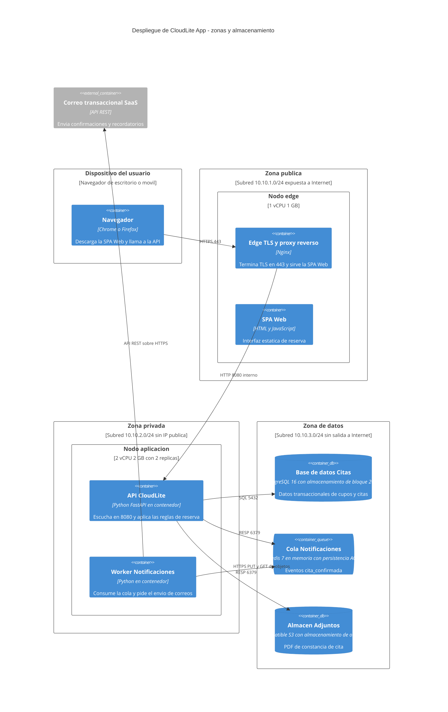

# Taller de la Clase 7 en ExamLab - configuracion

- **Curso:** Arquitectura de Sistemas Computacionales (FI303380)
- **Taller:** Taller Clase 7 en ExamLab - Despliegue por zonas y almacenamiento de CloudLite
- **Preguntas:** 5 · **Total:** 100 puntos
- **Plataforma:** ExamLab (https://uniaj.examlab.workers.dev/) · modulo Talleres
- **Hito del PI:** Diagrama de despliegue: red, zonas, almacenamiento
- **Entregable de la clase:** Diagrama Deployment (draw.io) + elección de storage (objeto/bloque/relacional conceptual)

> ExamLab no importa preguntas desde archivo: el alta se hace en la UI del
> docente (o con la pestana de IA). Este documento trae el texto exacto de cada
> campo para copiar y pegar, incluidos el SQL de partida y el codigo base.

**Que produce el estudiante:** El estudiante entrega el diagrama de despliegue de CloudLite por zonas con puertos y almacenamiento elegido, y demuestra en el simulador de red que la zona de datos no es alcanzable desde el equipo del usuario.

---

## Pregunta 1 - Diagrama (Mermaid) · 30 pts

**Tipo en la plataforma:** `diagrama`

**Enunciado (campo Contenido):**

## C4 Deployment de CloudLite App

Escriba en Mermaid el diagrama **C4Deployment**. La primera linea debe ser exactamente `C4Deployment`. Debe contener **exactamente 4 `Deployment_Node(...)` de primer nivel**:

1. `Dispositivo del usuario`.
2. `Zona publica` con la subred `10.10.1.0/24`.
3. `Zona privada` con la subred `10.10.2.0/24` y la nota `sin IP publica`.
4. `Zona de datos` con la subred `10.10.3.0/24` y la nota `sin salida a Internet`.

Requisitos:
- Los **5 contenedores de su Clase 4** aparecen con **el mismo nombre letra por letra**, cada uno dentro de su zona; agregue el nodo del **edge** que termina TLS.
- Cada nodo declara su **tamano tentativo** (`1 vCPU 1 GB`, `2 vCPU 2 GB con 2 replicas`).
- La base de datos usa `ContainerDb(...)` y declara su **tipo de almacenamiento** (`almacenamiento de bloque 20 GB`); la cola usa `ContainerQueue(...)`.
- Agregue **un almacen de objetos** para los adjuntos de su dominio, tambien con `ContainerDb(...)` y la nota `almacenamiento de objetos`.
- Exactamente **7 `Rel(...)`**, todas con **puerto o protocolo**.

**Verificacion:** compare nombre por nombre contra su C4Container de la Clase 4; si alguno difiere, corrija aqui y anote la correccion en el informe.

**Pegar al final del enunciado — flujo de entrega del diagrama:**

**Del boceto al codigo Mermaid.** No subas una imagen: la respuesta de esta pregunta es texto Mermaid.

- **1. Disena visual** Dibuja el diagrama como quieras en Excalidraw o draw.io: es mas rapido arrastrar cajas que escribir codigo, y ahi es donde piensas el modelo.
- **2. Traduce con IA** Copia o describe tu boceto a una IA y pidele el codigo Mermaid: «convierte este diagrama a Mermaid usando `C4Deployment`». Revisa el resultado: la IA acierta la sintaxis, no tu modelo.
- **3. Pega y renderiza en ExamLab** Pega ese codigo en la caja de texto de la pregunta y mira como lo dibuja la plataforma. Si no renderiza, corrige ahi mismo: lo que se califica es el diagrama renderizado dentro de ExamLab.
- **4. Guarda el PNG para tu PI** Exporta tambien la imagen a la carpeta de tu Proyecto Integrador. Esa copia es para tu informe; no reemplaza la respuesta en la plataforma.

**Diagrama de referencia (Mermaid):**

**Rubrica esperada (campo Rubrica):**

10 pts los 4 Deployment_Node con su subred y sus notas. 8 pts los 5 contenedores con nombre identico al de la Clase 4 ubicados en la zona correcta. 6 pts el tamano de cada nodo y el tipo de almacenamiento declarado en la base de datos y en el almacen de objetos. 6 pts las 7 relaciones con puerto o protocolo. Se descuentan 10 pts si la base de datos o la cola aparecen en la zona publica.

---

## Pregunta 2 - Topologia de red · 20 pts

**Tipo en la plataforma:** `red_gui`

**Enunciado (campo Contenido):**

## Arme la topologia de CloudLite en el simulador

Usando el editor de topologia, construya la red que acaba de disenar con **exactamente 5 dispositivos** y **3 subredes**:

| Dispositivo | Zona | Subred | Direccion sugerida |
|---|---|---|---|
| `pc-estudiante` | fuera de las zonas | red del usuario | segun su simulador |
| `edge-nginx` | Zona publica | `10.10.1.0/24` | `10.10.1.10` |
| `app-1` | Zona privada | `10.10.2.0/24` | `10.10.2.11` |
| `app-2` | Zona privada | `10.10.2.0/24` | `10.10.2.12` |
| `datos-1` | Zona de datos | `10.10.3.0/24` | `10.10.3.20` |

Requisitos de la topologia:
1. `pc-estudiante` se conecta **unicamente** con `edge-nginx`.
2. `edge-nginx` es el **unico** que alcanza `app-1` y `app-2`.
3. `datos-1` se conecta **solo** con la zona privada: **no** debe tener camino hacia la red del usuario.
4. Rotule cada enlace con el **puerto permitido** (`443`, `8080`, `5432`, `6379`).

**Verificacion antes de enviar:** cada interfaz tiene una direccion dentro de su subred, ningun enlace salta de la red del usuario a la zona de datos, y los nombres de los dispositivos corresponden a los nodos de su C4Deployment.

**Rubrica esperada (campo Rubrica):**

8 pts los 5 dispositivos con direccion valida dentro de su subred. 6 pts la topologia con las 3 restricciones de conexion respetadas, en especial la ausencia de camino del usuario a la zona de datos. 4 pts los enlaces rotulados con el puerto permitido. 2 pts la correspondencia de nombres con el C4Deployment.

---

## Pregunta 3 - Consola de red · 15 pts

**Tipo en la plataforma:** `red_consola`

**Enunciado (campo Contenido):**

## Compruebe el aislamiento de la zona de datos

En la consola del simulador ejecute **exactamente estas 4 comprobaciones** sobre la topologia de la pregunta anterior y pegue la salida de cada una:

1. Ver las direcciones de las interfaces de `pc-estudiante` y de `datos-1` (`ip addr` o el comando equivalente de su simulador).
2. Alcanzar `edge-nginx` desde `pc-estudiante` (`ping 10.10.1.10`) -> **debe tener exito**.
3. Alcanzar `app-1` desde `edge-nginx` (`ping 10.10.2.11`) -> **debe tener exito**.
4. Alcanzar `datos-1` desde `pc-estudiante` (`ping 10.10.3.20` y luego el trazado de ruta) -> **debe fallar**.

Debajo de las salidas escriba **3 lineas de interpretacion**:
- Que demuestra el exito de las comprobaciones 2 y 3.
- Que demuestra el **fallo** de la comprobacion 4 y por que un exito ahi seria un hallazgo de seguridad.
- Que control del diagrama de la Clase 6 corresponde a ese fallo.

Si su simulador nombra distinto el comando de trazado de ruta, escriba el comando exacto que uso.

**Rubrica esperada (campo Rubrica):**

6 pts las 4 comprobaciones ejecutadas con su salida pegada. 5 pts que las comprobaciones 2 y 3 tengan exito y la 4 falle. 4 pts las 3 lineas de interpretacion incluyendo la referencia al control de la Clase 6. Si la comprobacion 4 tiene exito y el estudiante no lo detecta, la pregunta vale como maximo 5 pts.

---

## Pregunta 4 - Respuesta escrita · 25 pts

**Tipo en la plataforma:** `abierta`

**Enunciado (campo Contenido):**

## Eleccion de almacenamiento para CloudLite

Construya una tabla de **5 columnas** con encabezados exactos:

`Dato o componente | Tipo de almacenamiento | Por que ese tipo y no otro | Retencion | Costo cualitativo B/M/A`

con **exactamente 5 filas**, una por cada dato de su dominio:

1. Datos transaccionales (cupos, citas, usuarios).
2. Archivos adjuntos o comprobantes (PDF, imagenes).
3. Eventos o mensajes de notificacion.
4. Registros de actividad (logs).
5. Respaldos.

En la columna `Tipo de almacenamiento` use **solo** estos rotulos: `relacional`, `almacenamiento de objetos`, `almacenamiento de bloque`, `en memoria`.

Reglas:
- La columna `Por que ese tipo y no otro` debe **nombrar el tipo descartado** (por ejemplo `objetos y no relacional porque el PDF no se consulta por campos`).
- `Retencion` es un tiempo concreto (`90 dias`, `mientras dure el semestre`, `12 meses`).

Cierre con **una frase**: cual de los 5 datos crece mas rapido y que hara cuando eso pase.

**Rubrica esperada (campo Rubrica):**

10 pts las 5 filas con los 5 datos y solo los 4 rotulos permitidos. 8 pts la justificacion que nombra el tipo descartado en cada fila. 4 pts la retencion como tiempo concreto en las 5 filas. 3 pts la frase de crecimiento con la accion prevista.

---

## Pregunta 5 - Respuesta escrita · 10 pts

**Tipo en la plataforma:** `abierta`

**Enunciado (campo Contenido):**

## Matriz de puertos y reglas de red

Construya una tabla de **5 columnas** con encabezados exactos:

`Origen | Destino | Puerto | Protocolo | Permitido o negado`

con **exactamente 6 filas**, que cubran: (1) usuario al edge, (2) edge a la API, (3) API a la base de datos, (4) API a la cola, (5) worker al servicio de correo externo, (6) **usuario a la base de datos, que debe quedar `negado`**.

En cada fila `negado` agregue entre parentesis **el motivo** (`la zona de datos no publica rutas hacia Internet`).

**Verificacion:** los 5 numeros de puerto de esta matriz deben ser exactamente los mismos que aparecen en su C4Deployment y en los enlaces de su topologia; si alguno no coincide, corrija los tres artefactos antes de enviar.

**Rubrica esperada (campo Rubrica):**

5 pts las 6 filas con las 5 columnas completas. 3 pts que la fila usuario a base de datos este marcada como negada con su motivo. 2 pts que los puertos coincidan con el C4Deployment y con la topologia del simulador.

---

## Al terminar de crearlo

- Verifique que la suma de puntos sea la esperada: **100**.
- Publique el taller y confirme la fecha limite (domingo 23:59 segun el Acuerdo).
- Las preguntas con SQL o codigo: ejecutelas una vez usted mismo antes de publicar,
  para confirmar que el SQL de partida corre y que el starter compila.
