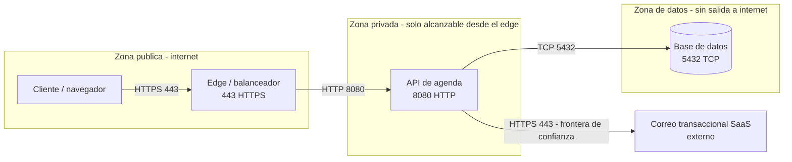

# Taller de la Clase 7 en ExamLab - configuracion

- **Curso:** Arquitectura de Sistemas Computacionales (FI303380)
- **Taller:** Actividad del Corte 2 (preguntas 4 a 6) - Despliegue, almacenamiento y nombres
- **Preguntas:** 3 · **Total:** 25 puntos
- **Plataforma:** ExamLab (https://uniaj.examlab.workers.dev/) · modulo Talleres
- **Hito del PI:** Diagrama de despliegue: red, zonas, almacenamiento
- **Entregable de la clase:** Diagrama Deployment en Mermaid dentro de ExamLab (3 zonas + puertos) + tipo de almacenamiento por componente

> ExamLab no importa preguntas desde archivo: el alta se hace en la UI del
> docente (o con la pestana de IA). Este documento trae el texto exacto de cada
> campo para copiar y pegar, incluidos el SQL de partida y el codigo base.

**Que produce el estudiante:** Las preguntas 4 a 6 de la actividad del Corte 2. El estudiante deja el diagrama de Despliegue con sus tres zonas, justifica el almacenamiento de cada componente y demuestra que los nombres coinciden con el C4 Containers del Corte 1.

---

## Pregunta 4 - Diagrama (Mermaid) · 14.0 pts

**Tipo en la plataforma:** `diagrama`

**Enunciado (campo Contenido):**

## Diagrama de Despliegue de CloudLite

Modele en Mermaid el diagrama de **Despliegue** de su CloudLite, con sus **tres zonas** y
el flujo completo **Cliente -> edge -> aplicacion -> datos**.

Debe tener:

- Las **tres zonas** como fronteras explicitas: **publica**, **privada** y **de datos**.
- Cada componente **ubicado en su zona**. **La base de datos NO puede quedar en la zona
  publica**: es el error que la pregunta busca detectar.
- Las **fronteras de confianza** marcadas: donde termina lo que usted controla y empieza lo
  que no.
- **El puerto de cada componente** etiquetado.

> **No invente subredes de un proveedor concreto.** Nada de nombres de VPC, de
> disponibilidad ni de servicios de marca: el diagrama es conceptual y tiene que servir
> igual en cualquier proveedor. El curso no abre cuentas de nube de pago.

Reutilice **los mismos nombres** de componentes del C4 Containers del Corte 1: es el mismo
sistema visto desde donde se ejecuta.

> La entrega oficial es esta respuesta dentro de ExamLab. El documento en Word o Google Docs es opcional y solo sirve para conservar sus respuestas.

**Pegar al final del enunciado — flujo de entrega del diagrama:**

**Del boceto al codigo Mermaid.** No subas una imagen: la respuesta de esta pregunta es texto Mermaid.

- **1. Disena visual** Dibuja el diagrama como quieras en Excalidraw o draw.io: es mas rapido arrastrar cajas que escribir codigo, y ahi es donde piensas el modelo.
- **2. Traduce con IA** Copia o describe tu boceto a una IA y pidele el codigo Mermaid: «convierte este diagrama a Mermaid usando `flowchart`». Revisa el resultado: la IA acierta la sintaxis, no tu modelo.
- **3. Pega y renderiza en ExamLab** Pega ese codigo en la caja de texto de la pregunta y mira como lo dibuja la plataforma. Si no renderiza, corrige ahi mismo: lo que se califica es el diagrama renderizado dentro de ExamLab.
- **4. Guarda el PNG para tu PI** Exporta tambien la imagen a la carpeta de tu Proyecto Integrador. Esa copia es para tu informe; no reemplaza la respuesta en la plataforma.

**Diagrama de referencia (Mermaid):**

**Rubrica esperada (campo Rubrica):**

4 pts las tres zonas presentes y rotuladas. 4 pts cada componente en la zona que le corresponde; **se pierden los 4 completos si la base de datos queda en la zona publica**. 2 pts las fronteras de confianza marcadas. 2 pts el puerto de cada componente. 2 pts que renderice sin error. Se descuenta por nombrar subredes o servicios de un proveedor concreto.

---

## Pregunta 5 - Respuesta escrita · 5.5 pts

**Tipo en la plataforma:** `abierta`

**Enunciado (campo Contenido):**

## Tipo de almacenamiento de cada componente

Justifique **que tipo de almacenamiento** le corresponde a cada componente de su
despliegue, a nivel conceptual:

- **Relacional**: datos con relaciones y consultas que los cruzan.
- **Bloque**: un disco crudo que un solo proceso monta y escribe.
- **Objeto**: archivos completos que se guardan y se recuperan enteros, por su nombre.

Para cada componente diga **que caracteristica del dato lo exige**, no que tipo le gusta
mas. Formato: `Componente | Tipo | Que caracteristica del dato lo exige`.

> **Use almacenamiento de objetos solo si su dominio realmente lo necesita.** Si no maneja
> archivos, imagenes ni documentos adjuntos, no lo incluya: agregar un almacen de objetos
> «porque suena a cloud» es exactamente el tipo de decision que este curso pide justificar.
> Decir «mi dominio no necesita objeto, y por eso no lo tengo» es una respuesta correcta y
> completa.

> La entrega oficial es esta respuesta dentro de ExamLab. El documento en Word o Google Docs es opcional y solo sirve para conservar sus respuestas.

**Rubrica esperada (campo Rubrica):**

3 pts la clasificacion correcta de cada componente del despliegue. 2.5 pts que cada justificacion nombre la caracteristica del dato (se cruza con otros, lo monta un solo proceso, se recupera entero) y no una preferencia. Suma completo quien declare que su dominio no necesita almacenamiento de objetos y lo justifique; se descuenta quien lo incluya sin un dato que lo pida.

---

## Pregunta 6 - Respuesta escrita · 5.5 pts

**Tipo en la plataforma:** `abierta`

**Enunciado (campo Contenido):**

## Correspondencia entre el C4 Containers y el Despliegue

Explique **por que** los nombres del diagrama de Despliegue tienen que ser **exactamente los
mismos** del C4 Containers, y demuestrelo con la tabla de correspondencia:

`Componente en el C4 Containers | Componente en el Despliegue | Zona`

Si al dibujar el despliegue **renombro** algo, **liste los renombres** que aplico y diga
cual de los dos diagramas actualizo para que queden iguales.

> Los dos diagramas son **el mismo sistema visto desde angulos distintos**: el C4 Containers
> muestra que piezas hay y el Despliegue donde se ejecutan. Si una pieza se llama
> «api-agenda» en uno y «servidor-backend» en otro, nadie puede saber si son la misma cosa,
> y en la sustentacion de la Clase 15 eso se lee como dos sistemas distintos.

> La entrega oficial es esta respuesta dentro de ExamLab. El documento en Word o Google Docs es opcional y solo sirve para conservar sus respuestas.

**Rubrica esperada (campo Rubrica):**

2 pts la explicacion de por que los nombres deben coincidir, en terminos de que son el mismo sistema. 2.5 pts la tabla completa con una fila por componente y su zona. 1 pt listar los renombres aplicados, o declarar explicitamente que no hubo ninguno. Se descuenta si la tabla deja fuera algun componente que si aparece en alguno de los dos diagramas.

---

## Al terminar de crearlo

- Verifique que la suma de puntos sea la esperada: **25**.
- Publique el taller y confirme la fecha limite (domingo 23:59 segun el Acuerdo).
- Las preguntas con SQL o codigo: ejecutelas una vez usted mismo antes de publicar,
  para confirmar que el SQL de partida corre y que el starter compila.
