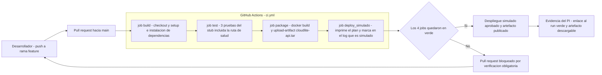

# Taller de la Clase 8 en ExamLab - configuracion

- **Curso:** Arquitectura de Sistemas Computacionales (FI303380)
- **Taller:** Taller Clase 8 en ExamLab - Pipeline de Actions y monitoreo de CloudLite
- **Preguntas:** 5 · **Total:** 100 puntos
- **Plataforma:** ExamLab (https://uniaj.examlab.workers.dev/) · modulo Talleres
- **Hito del PI:** Workflow Actions (build/test/simulate) + métricas de monitoreo del PI
- **Entregable de la clase:** .github/workflows/ci.yml + sección Monitoreo/CI del informe

> ExamLab no importa preguntas desde archivo: el alta se hace en la UI del
> docente (o con la pestana de IA). Este documento trae el texto exacto de cada
> campo para copiar y pegar, incluidos el SQL de partida y el codigo base.

**Que produce el estudiante:** El estudiante entrega un workflow de GitHub Actions con build, pruebas, artefacto y despliegue simulado, evidenciado con un run verde, mas el plan de monitoreo de CloudLite con umbrales y acciones.

---

## Pregunta 1 - Respuesta escrita · 30 pts

**Tipo en la plataforma:** `abierta`

**Enunciado (campo Contenido):**

## Workflow ci.yml de CloudLite

> ExamLab **no ejecuta** este YAML: los workflows corren en GitHub Actions. Aqui se evalua el contenido pegado **mas la evidencia del run real**.

**Parte A.** Pegue el contenido completo de `.github/workflows/ci.yml`. Debe tener:
- `on:` con `push` y `pull_request` sobre la rama principal.
- **4 jobs** encadenados con `needs:`, nombrados `build`, `test`, `package` y `deploy_simulado`.
- `test` ejecuta **al menos 3 pruebas** reales (no `echo`).
- `package` construye la imagen y publica un artefacto con `actions/upload-artifact`.
- `deploy_simulado` imprime el plan de despliegue y **dice en el log que es simulado**.
- Todo secreto se lee como `${{ secrets.NOMBRE }}`; **cero valores en claro**.

**Parte B.** Tabla de **2 columnas** (`Job | Que verifica y por que el siguiente no debe correr si este falla`) con **4 filas**.

**Parte C.** Evidencia, en 3 lineas: enlace publico al **run verde**, nombre y tamano del artefacto publicado, y numero de pruebas ejecutadas segun el log.

**Plan B aceptado:** si Actions falla por cuota o por permisos, pegue el **mensaje de error textual**, la marca de tiempo y una explicacion de 4 lineas de que habria pasado en cada job. El plan B pierde solo los puntos de la Parte C.

**Rubrica esperada (campo Rubrica):**

12 pts el YAML con los 4 jobs encadenados por needs y los disparadores pedidos. 6 pts que test ejecute al menos 3 pruebas reales y package publique artefacto. 4 pts que no haya ningun secreto en claro y que el deploy declare que es simulado. 4 pts la tabla de 4 filas. 4 pts la evidencia del run verde con artefacto y conteo de pruebas, o el plan B con error textual y explicacion.

---

## Pregunta 2 - Diagrama (Mermaid) · 20 pts

**Tipo en la plataforma:** `diagrama`

**Enunciado (campo Contenido):**

## Pipeline de CloudLite en Mermaid

Escriba un `flowchart LR` del pipeline que acaba de crear. Requisitos:

1. Un **subgrafo** rotulado con el nombre del archivo (`GitHub Actions - ci.yml`) que contenga **los 4 jobs con sus nombres exactos** del YAML, encadenados en orden.
2. Antes del subgrafo: el nodo del desarrollador que hace push y el nodo del pull request.
3. Despues del subgrafo: **un nodo de decision con forma de rombo** que pregunte si los 4 jobs quedaron en verde.
4. Dos salidas de la decision: `Si` hacia el **despliegue simulado con publicacion del artefacto**, y `No` hacia el **bloqueo del pull request**.
5. Un nodo final de **evidencia** (enlace al run y artefacto descargable) y una arista de retorno del bloqueo hacia el desarrollador.

**Verificacion:** al renderizar debe contar 4 nodos de job, 1 rombo y 2 salidas rotuladas `Si` y `No`; los nombres de los jobs deben coincidir letra por letra con el YAML.

**Pegar al final del enunciado — flujo de entrega del diagrama:**

**Del boceto al codigo Mermaid.** No subas una imagen: la respuesta de esta pregunta es texto Mermaid.

- **1. Disena visual** Dibuja el diagrama como quieras en Excalidraw o draw.io: es mas rapido arrastrar cajas que escribir codigo, y ahi es donde piensas el modelo.
- **2. Traduce con IA** Copia o describe tu boceto a una IA y pidele el codigo Mermaid: «convierte este diagrama a Mermaid usando `flowchart`». Revisa el resultado: la IA acierta la sintaxis, no tu modelo.
- **3. Pega y renderiza en ExamLab** Pega ese codigo en la caja de texto de la pregunta y mira como lo dibuja la plataforma. Si no renderiza, corrige ahi mismo: lo que se califica es el diagrama renderizado dentro de ExamLab.
- **4. Guarda el PNG para tu PI** Exporta tambien la imagen a la carpeta de tu Proyecto Integrador. Esa copia es para tu informe; no reemplaza la respuesta en la plataforma.

**Diagrama de referencia (Mermaid):**

**Rubrica esperada (campo Rubrica):**

8 pts el subgrafo con los 4 jobs en orden y con los nombres exactos del YAML. 5 pts el rombo de decision con las salidas Si y No rotuladas. 4 pts el nodo de despliegue simulado y el de bloqueo del pull request. 3 pts el nodo de evidencia y la arista de retorno al desarrollador.

---

## Pregunta 3 - Respuesta escrita · 25 pts

**Tipo en la plataforma:** `abierta`

**Enunciado (campo Contenido):**

## Plan de monitoreo de CloudLite

Construya una tabla de **5 columnas** con encabezados exactos:

`Senal | Tipo | Donde se mide | Umbral objetivo | Accion si se rompe`

con **exactamente 5 filas**. En la columna `Tipo` use **solo** estos rotulos y **cubra los cuatro**: `latencia`, `errores`, `trafico`, `saturacion` (la quinta fila repite el tipo que mas le duela a su dominio y debe justificar por que).

Reglas por fila:
- `Donde se mide` cita **un componente exacto** de su C4Deployment (`Edge TLS`, `API CloudLite`, `Base de datos Citas`, `Cola Notificaciones`, `Worker Notificaciones`).
- `Umbral objetivo` lleva **numero y ventana de tiempo** (`p95 por debajo de 800 ms en 5 minutos`, `tasa de error por debajo de 1 por ciento en 15 minutos`, `menos de 500 mensajes en cola`).
- `Accion si se rompe` nombra **quien hace que** (`el responsable de laboratorio revisa el log del worker y reencola`), no `investigar`.

Cierre con **2 lineas**: cual de las 5 senales avisaria primero de una caida real de su dominio, y que senal es solo ruido en un proyecto academico.

**Rubrica esperada (campo Rubrica):**

10 pts las 5 filas con los 4 tipos cubiertos y la quinta justificada. 6 pts que cada senal cite un componente exacto del C4Deployment. 6 pts los umbrales con numero y ventana de tiempo en las 5 filas. 3 pts las 2 lineas de cierre. Cada fila con umbral sin numero pierde su parte proporcional.

---

## Pregunta 4 - Seleccion multiple · 15 pts

**Tipo en la plataforma:** `cerrada_multi`

**Enunciado (campo Contenido):**

## Que es realista con GitHub Actions gratuito

En este curso esta prohibido cloud de pago y tarjeta de credito. Seleccione las **3 opciones realistas y aceptadas** para el PI.

**Opciones:**

- [x] Ejecutar build y pruebas unitarias en cada push sobre un runner alojado gratuito.
- [x] Publicar un artefacto con upload-artifact y descargarlo como evidencia del run.
- [ ] Desplegar automaticamente en un cluster Kubernetes administrado de pago como parte del PI.
- [x] Simular el despliegue con un job que imprime el plan, adjunta el artefacto y deja en el log que es simulado.
- [ ] Guardar la clave de produccion en claro dentro del ci.yml para que el despliegue real funcione.
- [ ] Comprar minutos adicionales de runner con tarjeta de credito para alcanzar la entrega.

**Rubrica esperada (campo Rubrica):**

5 pts por cada opcion correcta marcada; se descuentan 5 pts por cada opcion incorrecta marcada, sin bajar de cero.

---

## Pregunta 5 - Seleccion unica · 10 pts

**Tipo en la plataforma:** `cerrada`

**Enunciado (campo Contenido):**

## Como se llama lo que tiene el equipo

El workflow compila, ejecuta pruebas y publica un artefacto, pero **ningun paso lleva el cambio a un ambiente**: el ultimo job solo imprime el plan de despliegue. Como se describe correctamente lo que tiene el equipo?

**Opciones:**

- [x] Integracion continua con despliegue simulado.
- [ ] Despliegue continuo completo hasta produccion.
- [ ] Entrega continua con aprobacion manual a produccion.
- [ ] No es un pipeline, porque un pipeline se define por desplegar.

**Rubrica esperada (campo Rubrica):**

10 pts la opcion correcta, 0 en cualquier otra. Comprueba que el estudiante no llame despliegue continuo a un pipeline que no despliega.

---

## Al terminar de crearlo

- Verifique que la suma de puntos sea la esperada: **100**.
- Publique el taller y confirme la fecha limite (domingo 23:59 segun el Acuerdo).
- Las preguntas con SQL o codigo: ejecutelas una vez usted mismo antes de publicar,
  para confirmar que el SQL de partida corre y que el starter compila.
