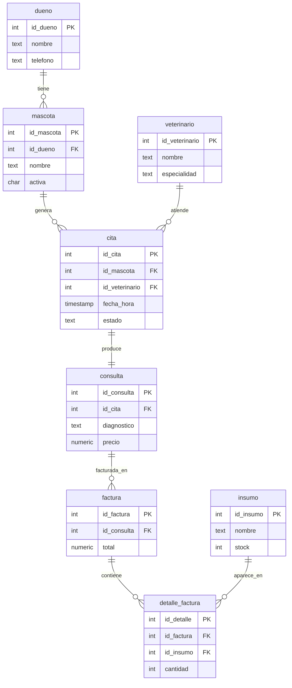

# Taller de la Clase 1 en ExamLab - configuracion

- **Curso:** Bases de Datos II (FI303215)
- **Taller:** Taller Clase 1 en ExamLab - Arranque VetCare DB y repaso de DDL
- **Preguntas:** 5 · **Total:** 100 puntos
- **Plataforma:** ExamLab (https://uniaj.examlab.workers.dev/) · modulo Talleres
- **Hito del PI:** Arranque PI: dominio, alcance y borrador ER de VetCare DB
- **Entregable de la clase:** Ficha del PI (plantilla) + ER en Mermaid renderizado en ExamLab (PNG para tu carpeta) + 3 reglas Condicion -> Accion

> ExamLab no importa preguntas desde archivo: el alta se hace en la UI del
> docente (o con la pestana de IA). Este documento trae el texto exacto de cada
> campo para copiar y pegar, incluidos el SQL de partida y el codigo base.

**Que produce el estudiante:** El estudiante deja creado el esqueleto de VetCare DB (dueno, mascota, cita) con integridad declarativa, su modelo ER en Mermaid y el alcance escrito del Proyecto Integrador.

---

## Pregunta 1 - SQL sobre PostgreSQL real · 30 pts

**Tipo en la plataforma:** `bd_sql`

**Enunciado (campo Contenido):**

## 1. DDL base de VetCare DB

La clinica veterinaria **Huellitas** arranca su base de datos `VetCare DB`. En esta base ya existe una tabla `proyecto_pi` donde cada estudiante registra su Proyecto Integrador.

> **Modalidad de trabajo: individual por defecto.** El docente puede autorizar equipos de 2 o 3 integrantes; en ese caso el artefacto puede ser compartido, pero **la entrega en ExamLab siempre es individual**.

**Escribe el SQL (PostgreSQL) que:**

1. Registre tu proyecto en `proyecto_pi` con tu nombre completo, tu codigo y el nombre de tu proyecto. Si el docente te autorizo trabajar en equipo, lista ademas los otros integrantes en la columna opcional `integrantes`; si trabajas solo, dejala nula.
2. Cree las **tres tablas base** con estas reglas exactas:

| Tabla | Columnas y restricciones |
|---|---|
| `dueno` | `id_dueno` autonumerico PK; `nombre` texto obligatorio; `telefono`; `email`; `ciudad` con valor por defecto `'Cali'` |
| `mascota` | `id_mascota` autonumerico PK; `id_dueno` obligatorio con **FK** a `dueno`; `nombre` obligatorio; `especie` obligatoria; `fecha_nac` tipo fecha; `activa` de un caracter, por defecto `'S'`, que **solo** acepte `'S'` o `'N'` |
| `cita` | `id_cita` autonumerico PK; `id_mascota` obligatorio con **FK** a `mascota`; `fecha_hora` tipo `TIMESTAMP` obligatorio; `estado` texto por defecto `'PROGRAMADA'` que **solo** acepte `'PROGRAMADA'`, `'ATENDIDA'` o `'CANCELADA'` |

3. Inserte **3 duenos**, **4 mascotas** (al menos una con `activa = 'N'`) y **3 citas** con datos realistas de una veterinaria en Cali (nombres en espanol: 'Firulais', 'Ana Gomez', ...).
4. Termine con un `SELECT` que muestre nombre de mascota, nombre del dueno y fecha de la cita usando `JOIN`.

**Recuerda:** el motor es **PostgreSQL**, no Oracle. Usa `SERIAL` (o `GENERATED ALWAYS AS IDENTITY`) y `TEXT`/`VARCHAR`; no existen `NUMBER` ni `VARCHAR2`.

**Convenciones de nombres del curso** (rigen todas las entregas del semestre; son lo que hace que tu script corra a la primera):

- Todo en **minusculas** y **sin comillas dobles**: PostgreSQL pliega a minuscula cualquier identificador sin comillas, asi que `CREATE TABLE Mascota` y luego una consulta entrecomillada da error de tabla inexistente.
- Nombres de tabla en **singular**, sin tildes ni enes: `dueno`, `mascota`, `cita`, `veterinario`.
- Identificadores sustitutos con el patron **`id_<entidad>`**, con el **mismo nombre** en la tabla propia y en la que la referencia: `cita.id_mascota` apunta a `mascota.id_mascota`.
- Palabras compuestas con guion bajo (`detalle_factura`, `fecha_hora`), nunca camelCase.

**SQL de partida (`options.db.setupSql`)** - corre antes del SQL del
estudiante, sobre una base limpia. PostgreSQL, no Oracle:

```sql
-- Base limpia para el arranque de VetCare DB.
-- Solo se entrega la bitacora de proyectos; el esquema lo construye el estudiante.
CREATE TABLE proyecto_pi (
  id_registro SERIAL PRIMARY KEY,
  estudiante TEXT NOT NULL,
  codigo TEXT NOT NULL,
  proyecto TEXT NOT NULL,
  integrantes TEXT,  -- opcional: solo si el docente autorizo equipo
  fecha_registro DATE NOT NULL DEFAULT CURRENT_DATE
);

INSERT INTO proyecto_pi (estudiante, codigo, proyecto)
VALUES ('Ejemplo del docente', '000000', 'VetCare-Demo');
```

**Rubrica esperada (campo Rubrica):**

Las 3 tablas se crean sin error con PK, las 2 FK, el DEFAULT de ciudad y los 2 CHECK exigidos (activa y estado). Se insertan al menos 3 duenos, 4 mascotas (>=1 inactiva) y 3 citas coherentes con las FK. El SELECT final devuelve filas y usa JOIN explicito, no producto cartesiano. Sintaxis 100% PostgreSQL (SERIAL/TEXT); se penaliza NUMBER, VARCHAR2 o comillas dobles mal usadas. Se respetan las convenciones de nombres: minusculas, tabla en singular sin tildes e identificadores id_<entidad> con el mismo nombre a ambos lados de la FK. Se registra el proyecto propio en proyecto_pi (estudiante, codigo y proyecto); la columna integrantes solo se llena si hubo equipo autorizado y su ausencia no descuenta.

---

## Pregunta 2 - Diagrama (Mermaid) · 20 pts

**Tipo en la plataforma:** `diagrama`

**Enunciado (campo Contenido):**

## 2. Modelo ER de VetCare DB en Mermaid

Dibuja el **modelo entidad-relacion completo** del Proyecto Integrador usando `erDiagram` de Mermaid. Debe contener las **8 entidades** del dominio y las relaciones con su cardinalidad:

- `dueno` **1 - N** `mascota`
- `mascota` **1 - N** `cita`
- `veterinario` **1 - N** `cita`
- `cita` **1 - 1** `consulta`
- `consulta` **1 - N** `factura`
- `factura` **1 - N** `detalle_factura`
- `insumo` **1 - N** `detalle_factura`

Para cada entidad lista **al menos su PK y 2 atributos**, marcando `PK` y `FK`.

Usa **exactamente los mismos nombres** que en la pregunta 1: minusculas, singular e `id_<entidad>`. Si el ER y el DDL no coinciden, no son el mismo modelo.

Este diagrama es el ER borrador del entregable de la clase. El PNG exportado va a tu carpeta del PI para el informe, pero **lo que se califica es el Mermaid renderizado aqui**.

**Pegar al final del enunciado — flujo de entrega del diagrama:**

**Del boceto al codigo Mermaid.** No subas una imagen: la respuesta de esta pregunta es texto Mermaid.

- **1. Disena visual** Dibuja el diagrama como quieras en Excalidraw o draw.io: es mas rapido arrastrar cajas que escribir codigo, y ahi es donde piensas el modelo.
- **2. Traduce con IA** Copia o describe tu boceto a una IA y pidele el codigo Mermaid: «convierte este diagrama a Mermaid usando `erDiagram`». Revisa el resultado: la IA acierta la sintaxis, no tu modelo.
- **3. Pega y renderiza en ExamLab** Pega ese codigo en la caja de texto de la pregunta y mira como lo dibuja la plataforma. Si no renderiza, corrige ahi mismo: lo que se califica es el diagrama renderizado dentro de ExamLab.
- **4. Guarda el PNG para tu PI** Exporta tambien la imagen a la carpeta de tu Proyecto Integrador. Esa copia es para tu informe; no reemplaza la respuesta en la plataforma.

**Diagrama de referencia (Mermaid):**



**Rubrica esperada (campo Rubrica):**

El diagrama renderiza sin error de sintaxis Mermaid (erDiagram). Aparecen las 8 entidades con nombres exactos y las 7 relaciones con la cardinalidad correcta (||--o{ para 1-N, ||--|| para 1-1). Cada entidad declara al menos PK + 2 atributos, con PK/FK marcados. Se descuenta por entidades faltantes, cardinalidades invertidas o relaciones inventadas. Los nombres de entidades y de claves coinciden con el DDL de la pregunta 1 (minusculas, singular, id_<entidad>).

---

## Pregunta 3 - SQL sobre PostgreSQL real · 25 pts

**Tipo en la plataforma:** `bd_sql`

**Enunciado (campo Contenido):**

## 3. Consultas de repaso sobre datos reales de Huellitas

El esquema `dueno`, `mascota`, `veterinario` y `cita` **ya esta creado y poblado** (6 duenos, 4 veterinarios, 8 mascotas, 10 citas). Recuerda que **Rocky (id 3)** y **Kiara (id 8)** estan inactivas.

Escribe **cuatro consultas**, en este orden, separadas por `;`:

1. **Agenda del 1 de septiembre de 2026**: `id_cita`, `fecha_hora`, nombre de la mascota, nombre del dueno y nombre del veterinario, solo citas en estado `PROGRAMADA`, ordenadas por hora. Filtra por **rango de fecha** (`>=` y `<`), no con funciones sobre la columna.
2. **Mascotas sin ninguna cita registrada**: nombre de la mascota y de su dueno. Usa `LEFT JOIN ... IS NULL` o `NOT EXISTS`.
3. **Citas por veterinario**: nombre del veterinario y cuantas citas tiene en cada estado (`PROGRAMADA`, `ATENDIDA`, `CANCELADA`), con `COUNT` y `GROUP BY`. Los veterinarios sin citas deben aparecer igualmente.
4. **Riesgo de negocio**: citas cuyo estado no sea `CANCELADA` pero cuya mascota este **inactiva** (`activa = 'N'`). Muestra `id_cita`, mascota y estado. Si el resultado sale vacio, la regla de negocio se cumple hoy.

**SQL de partida (`options.db.setupSql`)** - corre antes del SQL del
estudiante, sobre una base limpia. PostgreSQL, no Oracle:

```sql
CREATE TABLE dueno (
  id_dueno SERIAL PRIMARY KEY,
  nombre TEXT NOT NULL,
  telefono TEXT,
  email TEXT,
  ciudad TEXT DEFAULT 'Cali'
);

CREATE TABLE mascota (
  id_mascota SERIAL PRIMARY KEY,
  id_dueno INT NOT NULL REFERENCES dueno(id_dueno),
  nombre TEXT NOT NULL,
  especie TEXT NOT NULL,
  fecha_nac DATE,
  activa CHAR(1) NOT NULL DEFAULT 'S' CHECK (activa IN ('S','N'))
);

CREATE TABLE veterinario (
  id_veterinario SERIAL PRIMARY KEY,
  nombre TEXT NOT NULL,
  especialidad TEXT,
  activo CHAR(1) NOT NULL DEFAULT 'S' CHECK (activo IN ('S','N'))
);

CREATE TABLE cita (
  id_cita SERIAL PRIMARY KEY,
  id_mascota INT NOT NULL REFERENCES mascota(id_mascota),
  id_veterinario INT NOT NULL REFERENCES veterinario(id_veterinario),
  fecha_hora TIMESTAMP NOT NULL,
  estado TEXT NOT NULL DEFAULT 'PROGRAMADA'
    CHECK (estado IN ('PROGRAMADA','ATENDIDA','CANCELADA'))
);

-- Duenos (ids 1..6 en este orden)
INSERT INTO dueno (nombre, telefono, email) VALUES
  ('Ana Gomez',      '3001112233', 'ana.gomez@mail.com'),
  ('Carlos Ruiz',    '3014445566', 'carlos.ruiz@mail.com'),
  ('Marcela Diaz',   '3027778899', 'marcela.diaz@mail.com'),
  ('Jorge Pineda',   '3105551212', 'jorge.pineda@mail.com'),
  ('Luisa Cardona',  '3123334455', 'luisa.cardona@mail.com'),
  ('Andres Vallejo', '3159998877', 'andres.vallejo@mail.com');

-- Veterinarios (ids 1..4)
INSERT INTO veterinario (nombre, especialidad) VALUES
  ('Laura Restrepo', 'General'),
  ('Diego Moreno',   'Cirugia'),
  ('Paula Salazar',  'Dermatologia'),
  ('Ivan Ortiz',     'General');

-- Mascotas (ids 1..8). Rocky (3) y Kiara (8) estan INACTIVAS.
INSERT INTO mascota (id_dueno, nombre, especie, fecha_nac, activa) VALUES
  (1, 'Firulais', 'Canino', DATE '2019-04-12', 'S'),
  (1, 'Luna',     'Felino', DATE '2021-08-30', 'S'),
  (2, 'Rocky',    'Canino', DATE '2015-01-20', 'N'),
  (3, 'Mishi',    'Felino', DATE '2022-11-05', 'S'),
  (3, 'Bobby',    'Canino', DATE '2018-06-17', 'S'),
  (4, 'Nube',     'Felino', DATE '2023-02-09', 'S'),
  (5, 'Toby',     'Canino', DATE '2020-09-25', 'S'),
  (6, 'Kiara',    'Canino', DATE '2013-03-03', 'N');

-- Citas (ids 1..10)
INSERT INTO cita (id_mascota, id_veterinario, fecha_hora, estado) VALUES
  (1, 1, TIMESTAMP '2026-09-01 08:00:00', 'PROGRAMADA'),
  (2, 1, TIMESTAMP '2026-09-01 09:00:00', 'ATENDIDA'),
  (4, 2, TIMESTAMP '2026-09-01 10:00:00', 'PROGRAMADA'),
  (5, 3, TIMESTAMP '2026-09-02 08:30:00', 'CANCELADA'),
  (6, 2, TIMESTAMP '2026-09-02 11:00:00', 'ATENDIDA'),
  (7, 4, TIMESTAMP '2026-09-03 07:45:00', 'PROGRAMADA'),
  (1, 1, TIMESTAMP '2026-09-05 15:00:00', 'ATENDIDA'),
  (2, 3, TIMESTAMP '2026-09-08 16:00:00', 'PROGRAMADA'),
  (4, 4, TIMESTAMP '2026-09-10 08:00:00', 'PROGRAMADA'),
  (6, 1, TIMESTAMP '2026-09-10 09:00:00', 'ATENDIDA');
```

**Rubrica esperada (campo Rubrica):**

Las 4 consultas corren sin error y responden exactamente lo pedido. (1) usa rango de TIMESTAMP y no to_char/EXTRACT sobre fecha_hora. (2) detecta correctamente las mascotas huerfanas de cita. (3) incluye veterinarios sin citas (LEFT JOIN, no INNER). (4) cruza cita con mascota inactiva y excluye CANCELADA. Se descuenta por SELECT *, joins implicitos con comas o resultados que no correspondan a los datos entregados.

---

## Pregunta 4 - Seleccion multiple · 10 pts

**Tipo en la plataforma:** `cerrada_multi`

**Enunciado (campo Contenido):**

## 4. Que puede garantizar el DDL por si solo

En VetCare DB hay tres reglas de negocio criticas:

- **R1:** una mascota inactiva no puede tener una cita nueva.
- **R2:** el stock de un insumo nunca queda negativo.
- **R3:** todo cambio de estado de una cita queda auditado.

Selecciona **todas** las afirmaciones correctas sobre lo que se puede resolver con DDL declarativo (tipos, `NOT NULL`, `CHECK`, `UNIQUE`, `PRIMARY KEY`, `FOREIGN KEY`) frente a lo que exige logica programada (funcion, procedimiento o trigger) en PostgreSQL.

**Opciones:**

- [x] R2 se puede garantizar con un CHECK (stock >= 0) sobre la tabla insumo, porque solo depende de la fila que se modifica.
- [ ] R1 se puede garantizar con un CHECK en la tabla cita que consulte la columna activa de mascota.
- [x] R1 necesita logica programada (trigger o procedimiento) porque involucra una fila de OTRA tabla en el momento de la insercion.
- [x] R3 necesita un trigger AFTER UPDATE sobre cita: el DDL declarativo no registra historia de cambios.
- [ ] Una FOREIGN KEY de cita hacia mascota alcanza para impedir agendar mascotas inactivas.
- [x] El CHECK (estado IN ('PROGRAMADA','ATENDIDA','CANCELADA')) es un buen uso de DDL: valida un dominio cerrado sin mirar otras tablas.

**Rubrica esperada (campo Rubrica):**

Se otorgan los 10 puntos con las 4 opciones correctas marcadas y ninguna incorrecta; puntaje proporcional por acierto parcial. Correctas: indices 0, 2, 3 y 5.

---

## Pregunta 5 - Respuesta escrita · 15 pts

**Tipo en la plataforma:** `abierta`

**Enunciado (campo Contenido):**

## 5. Alcance del Proyecto Integrador VetCare DB

Redacta la ficha de alcance de tu proyecto. Debe incluir, con estos titulos:

1. **Autor y proyecto**: tu nombre y codigo, el nombre de tu proyecto y una frase que describa VetCare DB. Si el docente autorizo equipo, agrega los otros integrantes.
2. **Que SI hara el PI** (5 a 8 lineas): procesos de la clinica Huellitas que la base de datos va a soportar (por ejemplo agendamiento, historia clinica, facturacion con insumos, auditoria).
3. **Que NO hara el PI** (3 a 5 lineas): limites explicitos (por ejemplo: no habra pasarela de pagos, no habra app movil, no se manejara nomina).
4. **Tres reglas de negocio propias** que tu adoptas, distintas o adicionales a las tres del enunciado general. Escribelas en formato **`Condicion -> Accion`**: `Si <condicion verificable> -> entonces <lo que hace la base>`. Ejemplo: `Si la mascota tiene activa = 'N' -> entonces no se puede crear una cita nueva para ella`. Para cada una, indica **como piensas implementarla**: `CHECK`, `UNIQUE`, `FK`, trigger o procedimiento.
5. **Riesgo principal** que ves para terminar el PI y como lo mitigas.

**Copia esta plantilla y llenala.** Son exactamente los campos que se califican; no cambies los titulos.

```
Nombre del proyecto: VetCare - [Apellido]
Autor: [nombre completo]        Codigo: [__________]
Integrantes: [solo si el docente autorizo equipo; si trabajas solo, escribe "individual"]
Descripcion en una frase: [que es VetCare DB para la clinica Huellitas]

1) QUE SI HARA EL PI  (5 a 8 lineas)
   - ...

2) QUE NO HARA EL PI  (3 a 5 lineas)
   - ...

3) TRES REGLAS DE NEGOCIO PROPIAS  (formato Condicion -> Accion)
   R1. Si ... -> entonces ...     Se implementa con: [CHECK | UNIQUE | FK | procedimiento | trigger]
   R2. Si ... -> entonces ...     Se implementa con: ...
   R3. Si ... -> entonces ...     Se implementa con: ...

4) RIESGO PRINCIPAL Y MITIGACION  (2 lineas)
   Riesgo: ...        Mitigacion: ...
```

**Rubrica esperada (campo Rubrica):**

Estan las 5 secciones de la plantilla y el proyecto se llama VetCare - [Apellido]. El SI/NO delimita el alcance de forma concreta y realista para un semestre (no promesas vagas). Las 3 reglas de negocio estan escritas en formato Condicion -> Accion, son verificables y cada una viene con el mecanismo de implementacion propuesto, coherente con lo visto en la pregunta 4. Se descuenta si las reglas repiten literalmente las del enunciado o si no se indica mecanismo. Tambien se descuenta si las reglas estan redactadas como deseos («el sistema debe ser seguro») en vez de como condicion y accion.

---

## Al terminar de crearlo

- Verifique que la suma de puntos sea la esperada: **100**.
- Publique el taller y confirme la fecha limite (domingo 23:59 segun el Acuerdo).
- Las preguntas con SQL o codigo: ejecutelas una vez usted mismo antes de publicar,
  para confirmar que el SQL de partida corre y que el starter compila.
