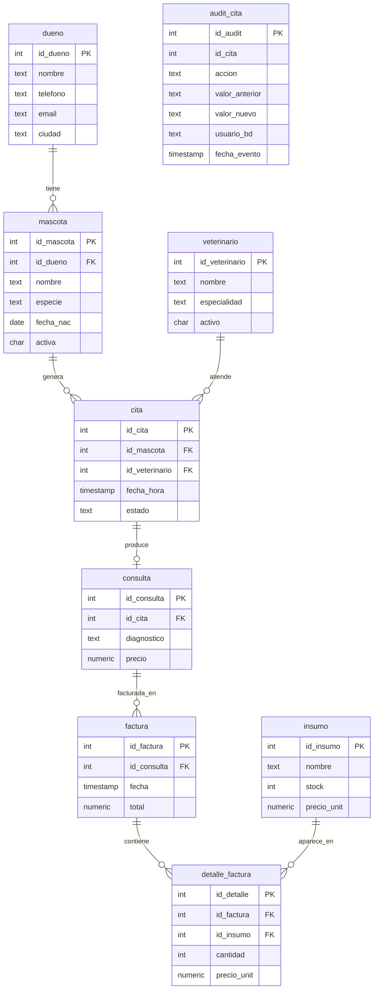

# Solucion del taller · Clase 11 · Avance del PI VetCare DB (hito formal)

> **DOCUMENTO DOCENTE — PRIVADO.** No publicar en `Clases/` ni en ExamLab antes del cierre de la entrega.

**Resumen:** El ER consolidado con los nombres **reales** del DDL —incluida `audit_cita` sin FK y las columnas que el borrador de la Clase 1 no tenia—; la bateria de cinco pruebas de verificacion que arroja **4 de 5** y encuentra un defecto real: las tres facturas historicas estan descuadradas contra sus detalles, y eso **no es un error del estudiante sino el hallazgo del hito**; los tres reportes de la demo con sus filas exactas, la trampa del conteo inflado desmontada con numeros y la advertencia de que dos de los tres reportes **pasan por suerte** con estos datos; y el checklist de 14 items con el 79 % declarado, el item mas debil argumentado y los seis gaps con responsable, fecha anterior al 16 de noviembre y evidencia concreta de cierre.

> **Tres avisos de logistica antes de nada.** Primero: **las Clases 11 y 12 son la misma sesion doble** del lunes **2026-10-26**, de 18:00 a 20:00, asi que las dos horas tienen que cubrir el hito formal **y** el tema de integracion de apps externas. La demo de 3 a 5 minutos por estudiante **no cabe en vivo** para un grupo completo: hay que decidir de antemano si se graba y se entrega como enlace, o si solo sale una muestra al aire. Segundo: la sustentacion final del PI es el **2026-11-16** (sesion 13), asi que **todas** las fechas de cierre de la pregunta 5 tienen que ser anteriores a esa —y conviene recordar que el 2026-11-09 es el Parcial 3 y ese dia no se cierra nada—. Tercero y mas importante: **la prueba 5 de la pregunta 2 da `cumple = FALSE` a proposito.** Las tres facturas que trae la base sembrada estan descuadradas contra la suma de sus detalles —71.000 contra 41.400, 47.000 contra 16.500 y 60.200 contra 28.600— y ese `FALSE` es la respuesta **correcta**. Hay que avisarlo al abrir el taller o media clase va a creer que escribio mal la consulta. Y es la leccion del hito, que conviene decir en voz alta: **una bateria de verificacion donde todo sale bien no verifico nada.** **El motor es PostgreSQL, no Oracle.** Por ultimo, las preguntas 4 y 5 son sobre el PI **real** de cada estudiante, asi que lo que sigue es un **modelo de referencia y no una clave**: se califica que la evidencia sea rastreable y que la aritmetica cuadre, no que los estados coincidan con estos. En la firma se acepta unicamente el nombre propio del estudiante; no se piden ni se guardan datos personales de terceros.

## Alineacion con el taller

- Taller del estudiante: `Clases/Clase 11 - Avance del proyecto final/Taller PI - Clase 11 - VetCare.docx`
- Configuracion en la plataforma: `Kit docente/Clase 11/Taller en ExamLab - Clase 11 (configuracion).md`
- Caso de estudio: `Clases/Proyecto Integrador/Anexo - Caso de estudio Clinica Huellitas - Bases de Datos II.docx`
- Hito del PI: Demo parcial + checklist de avance (hito formal PI)
- Entregable: Checklist firmada + enlace/ZIP avance (DDL+procs+ER)
- **Estas preguntas: 100 puntos** en 5 preguntas.

| # | Pregunta | Tipo | Puntos |
|---|---|---|---|
| 1 | ER consolidado de VetCare DB (version del hito) | `diagrama` | 20 |
| 2 | Bateria de verificacion del avance del PI | `bd_sql` | 35 |
| 3 | Los tres reportes de la demo | `bd_sql` | 20 |
| 4 | Checklist de avance del PI (firmada) | `abierta` | 15 |
| 5 | Lista de gaps con responsable y fecha | `abierta` | 10 |

---

## Pregunta 1 · ER consolidado de VetCare DB (version del hito) · 20 pts

### Respuesta esperada

Lo que separa este diagrama del de la Clase 1 no es que tenga una tabla mas: es que **se puede verificar contra el DDL linea por linea**. El enunciado pide «los nombres exactos que usaste en tu DDL», y ahi esta el criterio de calificacion mas objetivo de toda la pregunta —se abre `/db/01_ddl.sql` y se compara—. Tres decisiones merecen explicacion:

**1. `audit_cita` va sin relacion de FK, y es una decision, no un olvido.** Guarda `id_cita` pero **no** lo declara como clave foranea. La razon es de negocio: una bitacora tiene que sobrevivir a lo que audita. Si `audit_cita` tuviera una FK contra `cita`, borrar una cita obligaria a borrar su historia —y entonces el registro de auditoria protegeria a la base de todo menos de quien quiera tapar algo—. Es el mismo criterio de cualquier sistema contable: la traza no puede depender del dato que traza. Por eso en el diagrama la entidad aparece dibujada y **no sale ninguna linea de ella**, y conviene que en la demo se diga esa frase completa.

**2. La cardinalidad `cita`–`consulta` es la unica discutible, y hay que saber defender las dos versiones.** El enunciado pide **1-1** y eso es lo que se califica. Pero el DDL real dice `id_cita INT NOT NULL UNIQUE REFERENCES cita(id_cita)`, que en rigor significa **uno a cero-o-uno** (`||--o|` en Mermaid): cada consulta pertenece a exactamente una cita, y cada cita tiene **como maximo** una consulta. Y los datos lo confirman: de las 10 citas sembradas, **solo 4** tienen consulta —las ATENDIDAS 2, 5, 7 y 10—; las otras seis no la tienen porque estan PROGRAMADAS o CANCELADAS. Se acepta `||--||` porque es lo que pide el enunciado, y se reconoce `||--o|` como la version mas precisa. Lo mismo pasa con `consulta`–`factura`: es 1-N y en los datos la consulta 4 **no** tiene factura, asi que en rigor es cero-o-mas (`||--o{`), que es justamente lo que escribe el modelo de abajo.

**3. Las columnas que el borrador de la Clase 1 no tenia.** Este es el punto que distingue un ER copiado de uno consolidado. Aparecieron por el camino y tienen que estar: `dueno.ciudad` (con `DEFAULT 'Cali'`), `mascota.fecha_nac`, `mascota.activa` —la que sostiene la regla «mascota inactiva no agenda»—, `veterinario.activo`, `cita.estado` con su `CHECK` de tres valores, y `audit_cita.usuario_bd` con `DEFAULT current_user`, que es la columna que convierte una bitacora en una auditoria: sin ella se sabe **que** cambio, pero no **quien** lo cambio.

> **La frase para la demo:** «este no es el modelo que planeamos, es el modelo que quedo». Si el diagrama y el DDL no coinciden, el que esta equivocado es el diagrama.

### Respuesta esperada (dominio de la solucion)



### Como calificar

- **6 pts — las 9 entidades.** Las 8 del dominio mas `audit_cita`, a 0,67 pts cada una. La que mas se olvida es `audit_cita`, porque no estaba en el borrador de la Clase 1 y aparecio en la Clase 4. Si falta, se pierden esos 0,67 **y** los 3 pts del punto siguiente, porque no hay nada que dibujar sin FK.
- **5 pts — las 7 relaciones con su cardinalidad,** a 0,71 pts cada una. Se aceptan **las dos** versiones de `cita`–`consulta`: `||--||` porque es lo que pide el enunciado, y `||--o|` porque es lo que dice el DDL —`UNIQUE` mas seis citas sin consulta en los datos—. Quien escriba `||--o|` y lo explique en una linea tiene la mejor respuesta; quien escriba `}o--o{` en cualquier relacion no entendio la direccion de la FK y ahi si se descuenta.
- **3 pts — `audit_cita` dibujada sin FK y con la razon dicha.** 1 pt que no salga ninguna linea de ella y **2 pts la justificacion**: una bitacora tiene que sobrevivir a lo que audita, y con una FK contra `cita` borrar una cita borraria su historia. Dibujarla sin FK sin poder explicar por que vale 1 de 3: es la diferencia entre copiar el enunciado y entenderlo.
- **4 pts — al menos dos atributos mas de la PK y las FK, en las 9 entidades, con los nombres exactos del DDL.** Este es el punto mas verificable de la pregunta: se abre el DDL del estudiante y se compara. Se descuenta por `nombre_mascota` cuando el DDL dice `nombre`, por `precio_unitario` cuando dice `precio_unit`, o por columnas inventadas que no existen. Se reconoce como sobresaliente que aparezcan las que se agregaron por el camino —`ciudad`, `fecha_nac`, `activa`, `activo`, `usuario_bd`—, porque son la prueba de que el diagrama se actualizo de verdad.
- **2 pts — que renderice sin errores y sea legible al proyectarlo.** Un `erDiagram` que no renderiza vale 0 en toda la pregunta, porque el entregable **es** la lamina de la demo. Vale la pena decirlo antes del taller: se pega en ExamLab, se mira que salga el dibujo, y solo entonces se entrega.
- **Se reconoce como sobresaliente, sin puntos extra:** notar que `usuario_bd` con `DEFAULT current_user` es lo que convierte una bitacora en una auditoria —sin ella se sabe que cambio pero no quien—; o llegar a la frase de que si el diagrama y el DDL no coinciden, el equivocado es el diagrama.

### Errores frecuentes y que hacer

- **Entregar el ER de la Clase 1 sin tocarlo.** Es el error dominante y se detecta en dos segundos: no trae `audit_cita`. La pregunta pide el modelo **tal como quedo despues de las Clases 1 a 8**, no el que se planeo. Un ER que no cambio en ocho clases de un proyecto que si cambio esta mintiendo.
- **Dibujarle una FK a `audit_cita`.** Parece mas «correcto» y es peor: acopla la bitacora al dato que vigila. Al devolverlo conviene hacer la pregunta concreta —«¿que pasa con la auditoria si se borra la cita 1?»—, porque la respuesta se contesta sola.
- **Nombres inventados o castellanizados que no estan en el DDL:** `precio_unitario` por `precio_unit`, `fecha_nacimiento` por `fecha_nac`, `esta_activa` por `activa`. El diagrama deja de servir para lo unico que sirve, que es orientarse en el codigo real, y en la demo cualquier pregunta del jurado lo descubre.
- **Invertir la direccion de una relacion:** poner `mascota ||--o{ dueno` en vez de `dueno ||--o{ mascota`. La FK esta en `mascota`, asi que el lado «uno» es `dueno`. La regla practica que conviene repetir: **el lado «muchos» es siempre el que carga la FK.**
- **Omitir `detalle_factura` o fundirla con `factura`.** Sin ella no hay manera de explicar la pregunta 2 —la prueba 5 compara justamente `factura.total` contra la suma de sus detalles— ni la coherencia de la facturacion en la demo.
- **Un diagrama con las 9 entidades y 25 atributos cada una, ilegible al proyectarlo.** El enunciado pide «al menos dos atributos mas», no todos. La lamina se juzga en la demo: si el jurado no puede leer la PK a tres metros, el diagrama esta mal aunque el modelo este bien.

---

## Pregunta 2 · Bateria de verificacion del avance del PI · 35 pts

### Respuesta esperada (SQL que corre tal cual)

```sql
-- ======================================================================
-- PRUEBA 1 - INTEGRIDAD REFERENCIAL cita -> mascota
-- Se intenta insertar una cita con id_mascota = 999, que no existe. La FK
-- tiene que rechazarla. Se captura foreign_key_violation y NO ...WHEN
-- OTHERS: si el INSERT fallara por otra razon -- un CHECK, un NOT NULL --
-- queremos que el script muera y nos lo diga, en vez de anotar "OK" por
-- el motivo equivocado.
--
-- Cada prueba escribe SIEMPRE una fila en checklist_pi: la del camino
-- feliz (FALLO, cumple = FALSE) y la del camino esperado (OK, TRUE). Si
-- solo se escribe la del EXCEPTION, un dia que la regla se rompa la
-- bateria no dira "FALLO": simplemente no dira nada, que es peor.
-- ======================================================================
DO $$
BEGIN
  INSERT INTO cita (id_mascota, id_veterinario, fecha_hora)
  VALUES (999, 1, TIMESTAMP '2026-11-05 10:00:00');

  INSERT INTO checklist_pi (item, resultado, cumple)
  VALUES ('Integridad referencial cita->mascota',
          'FALLO: la base acepto una cita con id_mascota = 999, que no existe',
          FALSE);
EXCEPTION WHEN foreign_key_violation THEN
  INSERT INTO checklist_pi (item, resultado, cumple)
  VALUES ('Integridad referencial cita->mascota',
          'OK rechazada por la FK: ' || SQLERRM,
          TRUE);
END $$;

-- ======================================================================
-- PRUEBA 2 - REGLA DE NEGOCIO: MASCOTA INACTIVA NO AGENDA
-- Rocky (mascota 3) tiene activa = 'N'. sp_agendar_cita valida eso y
-- lanza excepcion. Aqui SI se captura WHEN OTHERS, porque lo que llega es
-- una excepcion de usuario -- el RAISE EXCEPTION que escribimos dentro
-- del procedimiento -- y esa cae en raise_exception (P0001), no en un
-- codigo especifico del motor. Guardamos el SQLERRM completo: sin el, la
-- evidencia dice que "fallo" pero no que fallo POR LA REGLA que se queria
-- probar (pudo fallar porque la franja estaba ocupada, y seria otra cosa).
-- ======================================================================
DO $$
BEGIN
  CALL sp_agendar_cita(3, 2, TIMESTAMP '2026-11-05 09:00:00');

  INSERT INTO checklist_pi (item, resultado, cumple)
  VALUES ('Regla: mascota inactiva no agenda',
          'FALLO: se agendo cita para Rocky (mascota 3), que esta inactiva',
          FALSE);
EXCEPTION WHEN OTHERS THEN
  INSERT INTO checklist_pi (item, resultado, cumple)
  VALUES ('Regla: mascota inactiva no agenda',
          'OK rechazada por el procedimiento: ' || SQLERRM,
          TRUE);
END $$;

-- ======================================================================
-- PRUEBA 3 - REGLA DE NEGOCIO: STOCK NUNCA NEGATIVO
-- El insumo 2 tiene stock 3 y se piden 10. sp_facturar hace el UPDATE
-- condicional, obtiene 0 filas y lanza excepcion.
--
-- El detalle fino de esta prueba: el SELECT del stock va DENTRO del
-- manejador, DESPUES de la excepcion. Eso no es casualidad -- el bloque
-- BEGIN...EXCEPTION abre un savepoint implicito, asi que cuando el
-- manejador arranca la base YA volvio atras todo lo que el procedimiento
-- alcanzo a hacer, incluida la factura que ya habia insertado. El 3 que
-- leemos aqui es el valor restaurado, y por eso es evidencia valida de
-- que el intento fallido no movio nada.
-- ======================================================================
DO $$
DECLARE
  v_stock INT;
BEGIN
  CALL sp_facturar(4, ARRAY[2], ARRAY[10]);

  INSERT INTO checklist_pi (item, resultado, cumple)
  VALUES ('Regla: stock nunca negativo',
          'FALLO: se facturaron 10 unidades del insumo 2, que solo tenia 3',
          FALSE);
EXCEPTION WHEN OTHERS THEN
  SELECT stock INTO v_stock FROM insumo WHERE id_insumo = 2;

  INSERT INTO checklist_pi (item, resultado, cumple)
  VALUES ('Regla: stock nunca negativo',
          'OK rechazada: ' || SQLERRM
            || ' | stock actual del insumo 2 = ' || v_stock,
          TRUE);
END $$;

-- ======================================================================
-- PRUEBA 4 - AUDITORIA ACTIVA
-- La cita 1 esta PROGRAMADA. Al pasarla a CANCELADA, el trigger
-- trg_audit_cita (AFTER UPDATE OF estado, con WHEN de estado distinto)
-- tiene que dejar la fila en audit_cita.
--
-- El veredicto se calcula con la propia consulta, no a mano: el
-- INSERT ... SELECT toma el COUNT(*) de las filas que cumplen las CUATRO
-- condiciones -- la cita, la accion, el valor anterior y el nuevo -- y de
-- ahi sale el booleano. Escribir "TRUE" a mano despues de mirar el
-- resultado no es una prueba: es una opinion.
-- ======================================================================
UPDATE cita SET estado = 'CANCELADA' WHERE id_cita = 1;

INSERT INTO checklist_pi (item, resultado, cumple)
SELECT 'Auditoria de cambios de estado',
       CASE WHEN COUNT(*) = 1
            THEN 'OK auditada: audit_cita registro PROGRAMADA -> CANCELADA'
                 || ' para la cita 1 (' || COUNT(*) || ' fila)'
            ELSE 'FALLO: audit_cita tiene ' || COUNT(*)
                 || ' filas para el cambio de estado de la cita 1, se esperaba 1'
       END,
       COUNT(*) = 1
  FROM audit_cita
 WHERE id_cita = 1
   AND accion = 'CAMBIO_ESTADO'
   AND valor_anterior = 'PROGRAMADA'
   AND valor_nuevo = 'CANCELADA';

-- ======================================================================
-- PRUEBA 5 - COHERENCIA DE FACTURACION
-- Para cada factura: el total guardado, coincide con la suma de
-- cantidad * precio_unit de sus detalles?
--
-- Se usa LEFT JOIN y COALESCE a proposito: una factura SIN detalles tiene
-- que aparecer como descuadrada si su total no es 0, no desaparecer del
-- analisis. Con un INNER JOIN, la factura mas sospechosa de todas -- una
-- con total y sin un solo detalle -- seria justo la que no se revisa.
--
-- AVISO: esta prueba devuelve cumple = FALSE, y esa es la respuesta
-- correcta. Las tres facturas historicas de esta base ESTAN descuadradas.
-- Ver el bloque de cierre.
-- ======================================================================
WITH descuadre AS (
  SELECT f.id_factura,
         f.total                                       AS total_guardado,
         COALESCE(SUM(d.cantidad * d.precio_unit), 0)   AS suma_detalles
    FROM factura f
    LEFT JOIN detalle_factura d ON d.id_factura = f.id_factura
   GROUP BY f.id_factura, f.total
  HAVING f.total <> COALESCE(SUM(d.cantidad * d.precio_unit), 0)
)
INSERT INTO checklist_pi (item, resultado, cumple)
SELECT 'Total de factura coincide con sus detalles',
       CASE WHEN NOT EXISTS (SELECT 1 FROM descuadre)
            THEN 'OK: ninguna factura descuadrada'
            ELSE 'FALLO: ' || (SELECT string_agg('factura ' || id_factura
                                                 || ' guarda ' || total_guardado
                                                 || ' y sus detalles suman ' || suma_detalles,
                                                 '; ' ORDER BY id_factura)
                                 FROM descuadre)
       END,
       NOT EXISTS (SELECT 1 FROM descuadre);

-- Consulta de diagnostico: la que se proyecta cuando el jurado pregunte
-- "y por que ese FALSE?". No arregla nada, muestra el tamano del problema
-- factura por factura.
SELECT f.id_factura,
       f.total                                                AS total_guardado,
       COALESCE(SUM(d.cantidad * d.precio_unit), 0)            AS suma_detalles,
       f.total - COALESCE(SUM(d.cantidad * d.precio_unit), 0)  AS diferencia,
       COUNT(d.id_detalle)                                     AS lineas_de_detalle
  FROM factura f
  LEFT JOIN detalle_factura d ON d.id_factura = f.id_factura
 GROUP BY f.id_factura, f.total
 ORDER BY f.id_factura;

-- ======================================================================
-- CIERRE DE LA BATERIA
-- ======================================================================
SELECT id_item, item, cumple, resultado FROM checklist_pi ORDER BY id_item;

-- Resumen de una linea, el que se proyecta en la demo.
SELECT COUNT(*) FILTER (WHERE cumple)     AS pruebas_ok,
       COUNT(*) FILTER (WHERE NOT cumple) AS pruebas_falladas,
       COUNT(*)                           AS total_pruebas
  FROM checklist_pi;

-- ======================================================================
-- QUE SIGNIFICA EL 4 DE 5
--
-- Las cuatro primeras pruebas confirman que las reglas escritas en las
-- Clases 1 a 8 SIRVEN: la FK rechaza, el procedimiento valida, el stock
-- no baja de cero y el trigger deja rastro. La quinta encontro algo que
-- nadie habia mirado: las tres facturas historicas no cuadran con sus
-- detalles. Y no es un error de la consulta -- se comprueba a mano:
--   factura 1: 31.000 + 900 + 9.500       = 41.400, pero guarda 71.000
--   factura 2: 9.500 + 7.000              = 16.500, pero guarda 47.000
--   factura 3: 22.000 + 4.800 + 1.800     = 28.600, pero guarda 60.200
--
-- Lo importante es DONDE esta el problema y donde NO esta: sp_facturar
-- calcula bien -- la factura que crea en la Clase 8 cuadra al centavo --,
-- asi que el descuadre esta en los datos cargados ANTES de que el
-- procedimiento existiera. Es la historia de cualquier migracion real: el
-- codigo nuevo es correcto y los datos viejos no lo cumplen.
--
-- Y LO QUE NO SE HACE AQUI: no se "arregla" con un
--   UPDATE factura SET total = (SELECT SUM(...) FROM detalle_factura ...)
-- Por dos razones. Primera, esos totales pueden ser lo que el cliente
-- REALMENTE pago -- quiza incluyen el precio de la consulta o un cargo
-- que nunca se detallo --, y sobrescribirlos con la suma de los insumos
-- seria falsear la contabilidad para que cuadre el reporte. Segunda, en
-- medio de una demo se estaria borrando la evidencia del unico hallazgo
-- del hito. Se documenta, se decide con quien conozca el negocio, y se
-- convierte en el gap numero 1 de la pregunta 5. Un checklist con 5 de 5
-- no habria descubierto nada.
-- ======================================================================
```

### Salida esperada

```
checklist_pi -- 5 filas

 id_item |                    item                    | cumple |                     resultado
---------+--------------------------------------------+--------+---------------------------------------------------
       1 | Integridad referencial cita->mascota       | t      | OK rechazada por la FK: insert or update on table
         |                                            |        | "cita" violates foreign key constraint
         |                                            |        | "cita_id_mascota_fkey"
       2 | Regla: mascota inactiva no agenda          | t      | OK rechazada por el procedimiento: ERROR: la
         |                                            |        | mascota 3 esta inactiva; no se agenda cita
       3 | Regla: stock nunca negativo                | t      | OK rechazada: ERROR: stock insuficiente del
         |                                            |        | insumo 2 (se pidieron 10) | stock actual del
         |                                            |        | insumo 2 = 3
       4 | Auditoria de cambios de estado             | t      | OK auditada: audit_cita registro PROGRAMADA ->
         |                                            |        | CANCELADA para la cita 1 (1 fila)
       5 | Total de factura coincide con sus detalles | f      | FALLO: factura 1 guarda 71000.00 y sus detalles
         |                                            |        | suman 41400.00; factura 2 guarda 47000.00 y sus
         |                                            |        | detalles suman 16500.00; factura 3 guarda
         |                                            |        | 60200.00 y sus detalles suman 28600.00

Dos detalles de las filas 2 y 3 que sorprenden y no son errores. El texto dice
"ERROR: ERROR:" cuando se lee entero, porque el mensaje que el procedimiento
escribio con RAISE EXCEPTION ya empieza con "ERROR:" y SQLERRM devuelve ese
texto tal cual. Y el "stock actual del insumo 2 = 3" se lee DESPUES de la
excepcion, cuando la base ya volvio atras: por eso vale como evidencia.

Consulta de diagnostico -- 3 filas

 id_factura | total_guardado | suma_detalles | diferencia | lineas_de_detalle
------------+----------------+---------------+------------+-------------------
          1 |       71000.00 |      41400.00 |   29600.00 |                 3
          2 |       47000.00 |      16500.00 |   30500.00 |                 2
          3 |       60200.00 |      28600.00 |   31600.00 |                 3

Las tres estan descuadradas y las tres tienen sus lineas de detalle, asi que no
es una factura huerfana: son totales cargados sin conciliar. Ninguna diferencia
coincide con el precio de su consulta -- 40.000, 38.000 y 55.000 --, asi que
tampoco es que el total incluya la consulta. Es un dato historico que nunca se
verifico, y hoy se verifico.

Resumen -- 1 fila

 pruebas_ok | pruebas_falladas | total_pruebas
------------+------------------+---------------
          4 |                1 |             5

El numero de la clase es 4 de 5. Un 5 de 5 aqui significaria que la prueba 5 se
escribio de forma que no puede fallar.

Estado de la base al terminar, para el que califique de cerca:

- cita: 10 filas, con la cita 1 ya en CANCELADA. El INSERT rechazado de la
  prueba 1 no dejo fila, pero SI consumio el id 11 de la secuencia: las
  secuencias no vuelven atras.
- audit_cita: 1 fila (id_audit 1), con valor_anterior = 'PROGRAMADA' y
  valor_nuevo = 'CANCELADA'.
- factura: 3 filas. La prueba 3 alcanzo a insertar la factura 4 antes de fallar
  en el stock, y el savepoint implicito la deshizo -- pero el id 4 de la
  secuencia quedo consumido y la proxima factura sera la 5.
- insumo 2: stock 3, intacto. Es el numero que sostiene la prueba 3.
- detalle_factura: 8 filas, sin cambios.
- checklist_pi: 5 filas.
```

### Como calificar

- **6 pts — prueba 1, integridad referencial.** 3 pts que el `INSERT` con `id_mascota = 999` sea rechazado y capturado, y 3 pts que quede **una** fila en `checklist_pi` con el item exacto `'Integridad referencial cita->mascota'` y `cumple = TRUE`. Se reconoce como mejor solucion capturar `WHEN foreign_key_violation` en vez de `WHEN OTHERS`: con `OTHERS`, un fallo por un `CHECK` o un `NOT NULL` se registraria como «OK rechazada» por el motivo equivocado.
- **6 pts — prueba 2, mascota inactiva.** 3 pts que el `CALL sp_agendar_cita(3, 2, ...)` lance excepcion y quede capturado, y **3 pts que el `SQLERRM` este guardado en `resultado`**, que es lo que el enunciado pide literalmente. Sin el `SQLERRM`, la evidencia dice que «fallo» pero no que fallo **por la regla** que se queria probar —podria haber fallado porque la franja estaba ocupada, y seria otra prueba—. Aqui `WHEN OTHERS` **si** es correcto: un `RAISE EXCEPTION` de usuario cae en `raise_exception` (P0001), no en un codigo especifico del motor.
- **8 pts — prueba 3, stock nunca negativo.** 3 pts el `CALL sp_facturar(4, ARRAY[2], ARRAY[10])` capturado, 2 pts el `SQLERRM`, y **3 pts la evidencia del stock: el `resultado` tiene que traer el `3`**. Es el requisito explicito de la rubrica y el que mas se olvida. Se reconoce como sobresaliente explicar **por que** ese 3 es evidencia valida: el manejador corre despues del `ROLLBACK` al savepoint implicito, asi que el valor leido es el restaurado.
- **7 pts — prueba 4, auditoria.** 2 pts el `UPDATE` de la cita 1 a `'CANCELADA'`, 3 pts la verificacion de que `audit_cita` tiene la fila con `valor_anterior = 'PROGRAMADA'` y `valor_nuevo = 'CANCELADA'`, y 2 pts que el `cumple` **se calcule con la consulta** y no se escriba a mano. Un `TRUE` literal despues de mirar el resultado no es una prueba: si manana el trigger se cae, la bateria seguira diciendo que todo esta bien.
- **8 pts — prueba 5, coherencia de facturacion, y aqui esta el corazon del hito.** 3 pts que la consulta compare `factura.total` contra `SUM(cantidad * precio_unit)` agrupando por factura; 2 pts el `NOT EXISTS` (o equivalente) que produce el booleano; y **3 pts que se registre `cumple = FALSE` y se nombren las tres facturas descuadradas**. **`FALSE` es la respuesta correcta y hay que decirlo asi en la devolucion.** Quien reporte `TRUE` escribio una consulta que no puede fallar —casi siempre un `INNER JOIN` mal agrupado o un `HAVING` invertido— y pierde los 8 pts, no por el veredicto sino porque su bateria no verifica nada. Se reconoce como sobresaliente el `LEFT JOIN` con `COALESCE`, que deja visible la factura mas sospechosa de todas: una con total y sin un solo detalle.
- **Los 35 pts requieren ademas que el script no aborte en ningun punto** y que el `SELECT` final muestre las **5** filas, que es requisito literal de la rubrica. Se reconoce como sobresaliente, sin puntos extra: haber escrito **las dos** filas de `checklist_pi` en cada prueba —la del camino feliz y la del esperado—, de modo que el dia que una regla se rompa la bateria diga «FALLO» en vez de quedarse callada; y no haber «arreglado» el descuadre con un `UPDATE factura SET total = ...` en medio de la demo.

### Errores frecuentes y que hacer

- **Reportar `cumple = TRUE` en la prueba 5.** Es el error mas revelador de toda la clase. Las tres facturas **estan** descuadradas —41.400 contra 71.000, 16.500 contra 47.000, 28.600 contra 60.200— y se comprueba con una suma a mano. Un `TRUE` significa que la consulta esta escrita de forma que no puede fallar, y una prueba que no puede fallar no es una prueba. Al devolverlo conviene pedir la resta de la factura 1 en voz alta.
- **«Arreglar» el descuadre con un `UPDATE factura SET total = (SELECT SUM(...))`.** Aparece con buena intencion y es la decision mas peligrosa del taller: esos totales pueden ser lo que el cliente **realmente pago**, asi que sobrescribirlos para que el reporte cuadre es falsear la contabilidad. Y encima borra la evidencia del unico hallazgo del hito. Se documenta, se decide con quien conozca el negocio, y se convierte en un gap.
- **Escribir el `cumple` a mano en vez de calcularlo.** Se mira el resultado, se escribe `TRUE`, y la bateria queda inservible: el proximo semestre el trigger se cae y el checklist sigue diciendo que todo esta bien. El veredicto tiene que salir de la consulta —un `COUNT(*) = 1`, un `NOT EXISTS`—, siempre.
- **Olvidar el stock en el `resultado` de la prueba 3.** Sin el `3`, la prueba demuestra que el procedimiento fallo, pero **no** que el intento fallido dejo la base intacta, que es la mitad interesante. Es el requisito explicito de la rubrica y cuesta 3 de los 8 puntos de esa prueba.
- **Capturar `WHEN OTHERS` en la prueba 1.** Ahi si importa: se quiere probar que **la FK** rechaza, no que «algo» fallo. Con `OTHERS`, un `NOT NULL` olvidado en el `INSERT` se registraria como integridad referencial funcionando. Al reves, en las pruebas 2 y 3 `OTHERS` es lo correcto porque lo que llega es una excepcion de usuario.
- **Que el script aborte a mitad de camino** —normalmente por escribir los `CALL` sin bloque `DO`, o por un `$$` mal cerrado—. Entonces `checklist_pi` queda con dos o tres filas y la demo se cae en vivo. Conviene correr la bateria completa una vez antes de presentarla y contar las filas: tienen que ser 5.
- **Registrar solo la fila del `EXCEPTION` y omitir la del camino feliz.** Funciona hoy y falla en silencio manana: si la regla se rompe, el `INSERT` no lanza excepcion, el manejador no corre y en `checklist_pi` **no aparece nada**. Una prueba que desaparece cuando falla es peor que ninguna, porque el conteo final dice «4 de 4».

---

## Pregunta 3 · Los tres reportes de la demo · 20 pts

### Respuesta esperada (SQL que corre tal cual)

```sql
-- ======================================================================
-- R1 - AGENDA OPERATIVA
-- Citas no canceladas de septiembre de 2026, con todo lo que la
-- recepcionista necesita para llamar: mascota, especie, dueno, telefono y
-- veterinario.
--
-- El filtro de fecha va por RANGO y no con EXTRACT(MONTH FROM ...) = 9.
-- Dos razones: la version con funcion sobre la columna NO es sargable --
-- ningun indice sobre fecha_hora se puede usar -- y ademas confundiria
-- septiembre de 2026 con septiembre de cualquier otro ano. El limite
-- superior es "< 2026-10-01", nunca "<= 2026-09-30": con un TIMESTAMP,
-- ese <= perderia todo lo que pase entre las 00:00:01 y las 23:59:59 del
-- 30 de septiembre.
-- ======================================================================
SELECT c.fecha_hora,
       m.nombre     AS mascota,
       m.especie,
       d.nombre     AS dueno,
       d.telefono,
       v.nombre     AS veterinario,
       c.estado
  FROM cita c
  JOIN mascota m     ON m.id_mascota     = c.id_mascota
  JOIN dueno d       ON d.id_dueno       = m.id_dueno
  JOIN veterinario v ON v.id_veterinario = c.id_veterinario
 WHERE c.estado <> 'CANCELADA'
   AND c.fecha_hora >= TIMESTAMP '2026-09-01 00:00:00'
   AND c.fecha_hora <  TIMESTAMP '2026-10-01 00:00:00'
 ORDER BY c.fecha_hora, m.nombre;

-- ======================================================================
-- R2 - HISTORIA CLINICA Y FACTURACION POR DUENO
-- Una fila por dueno, incluidos los que no tienen actividad.
--
-- Cuatro subconsultas escalares en vez de una cadena de LEFT JOIN. Es la
-- forma que NO se puede inflar: cada subconsulta cuenta sobre su propia
-- tabla y no hay producto cartesiano posible. La cadena
--   dueno -> mascota -> cita -> consulta -> factura
-- multiplica filas, y COUNT(m.id_mascota) empieza a contar la misma
-- mascota una vez por cada cita que tenga. Con COUNT(DISTINCT ...) se
-- arregla, pero hay que acordarse en las cuatro columnas y una sola que
-- se olvide da un numero falso con cara de correcto.
--
-- Los COUNT no necesitan COALESCE: un COUNT sin filas devuelve 0. El SUM
-- si, porque un SUM sin filas devuelve NULL, y "0" y "no se sabe" no son
-- lo mismo en un reporte de facturacion.
-- ======================================================================
SELECT d.id_dueno,
       d.nombre,
       (SELECT COUNT(*)
          FROM mascota m
         WHERE m.id_dueno = d.id_dueno)                      AS mascotas,
       (SELECT COUNT(*)
          FROM cita c
          JOIN mascota m ON m.id_mascota = c.id_mascota
         WHERE m.id_dueno = d.id_dueno)                      AS citas,
       (SELECT COUNT(*)
          FROM consulta co
          JOIN cita c    ON c.id_cita    = co.id_cita
          JOIN mascota m ON m.id_mascota = c.id_mascota
         WHERE m.id_dueno = d.id_dueno)                      AS consultas,
       (SELECT COALESCE(SUM(f.total), 0)
          FROM factura f
          JOIN consulta co ON co.id_consulta = f.id_consulta
          JOIN cita c      ON c.id_cita      = co.id_cita
          JOIN mascota m   ON m.id_mascota   = c.id_mascota
         WHERE m.id_dueno = d.id_dueno)                      AS total_facturado
  FROM dueno d
 ORDER BY total_facturado DESC, d.id_dueno;
-- El segundo criterio del ORDER BY no es adorno: cuatro duenos empatan en
-- 0.00 y sin desempate su orden lo decide el motor. Un reporte que sale
-- en distinto orden cada vez que se proyecta no es un reporte.

-- ======================================================================
-- R3 - INSUMOS EN RIESGO
-- Stock actual, unidades consumidas segun detalle_factura y semaforo.
--
-- LEFT JOIN para que un insumo que nunca se vendio aparezca con 0 y no
-- desaparezca -- justo el que hay que revisar antes de comprar mas.
--
-- El orden de los WHEN del CASE hace el trabajo: cuando se evalua el
-- segundo, ya se sabe que stock >= 5, asi que "stock <= 10" significa
-- "entre 5 y 10" sin tener que escribirlo. El 10 queda en BAJO, que es la
-- lectura inclusiva de "entre 5 y 10" del enunciado.
-- ======================================================================
SELECT i.id_insumo,
       i.nombre,
       i.stock,
       COALESCE(SUM(d.cantidad), 0)      AS unidades_consumidas,
       CASE WHEN i.stock <  5  THEN 'CRITICO'
            WHEN i.stock <= 10 THEN 'BAJO'
            ELSE                    'OK'
       END                               AS alerta
  FROM insumo i
  LEFT JOIN detalle_factura d ON d.id_insumo = i.id_insumo
 GROUP BY i.id_insumo, i.nombre, i.stock
 ORDER BY CASE WHEN i.stock <  5  THEN 1
               WHEN i.stock <= 10 THEN 2
               ELSE                    3
          END,
          i.stock,
          i.id_insumo;

-- ======================================================================
-- QUE DECISION DEL NEGOCIO HABILITA CADA REPORTE
--
-- R1 -> Es la hoja de ruta del dia: a quien llamar y a que hora. Decide a
--       quien se le confirma la cita el dia anterior y, si una veterinaria
--       falta, a que duenos hay que telefonear para reagendar -- por eso
--       el telefono va en el reporte y no en otra consulta.
--
-- R2 -> Decide a quien se le ofrece el plan de vacunacion anual y a quien
--       se le hace seguimiento. Las dos puntas importan: Ana Gomez
--       concentra 131.200 de los 178.200 facturados, asi que perderla es
--       perder tres cuartas partes del ingreso conocido; y los cuatro
--       duenos en 0.00 son la lista de reactivacion -- entre ellos Marcela
--       Diaz, que tiene 3 citas y ninguna factura, que es una pregunta
--       para el mostrador, no para la base.
--
-- R3 -> Decide la orden de compra de esta semana. La Vacuna triple felina
--       esta en CRITICO con 3 unidades y es el insumo mas caro de los
--       consumidos (31.000), asi que quedarse sin ella cancela consultas
--       facturables. La Gasa esteril esta en BAJO con 8 y ya se
--       consumieron 4: es la que sigue.
-- ======================================================================
```

### Salida esperada

```
R1 - Agenda operativa -- 9 filas

     fecha_hora      | mascota  | especie |    dueno      |  telefono  |  veterinario   |   estado
---------------------+----------+---------+---------------+------------+----------------+------------
 2026-09-01 08:00:00 | Firulais | Canino  | Ana Gomez     | 3001112233 | Laura Restrepo | PROGRAMADA
 2026-09-01 09:00:00 | Luna     | Felino  | Ana Gomez     | 3001112233 | Laura Restrepo | ATENDIDA
 2026-09-01 10:00:00 | Mishi    | Felino  | Marcela Diaz  | 3027778899 | Diego Moreno   | PROGRAMADA
 2026-09-02 11:00:00 | Nube     | Felino  | Jorge Pineda  | 3105551212 | Diego Moreno   | ATENDIDA
 2026-09-03 07:45:00 | Toby     | Canino  | Luisa Cardona | 3123334455 | Ivan Ortiz     | PROGRAMADA
 2026-09-05 15:00:00 | Firulais | Canino  | Ana Gomez     | 3001112233 | Laura Restrepo | ATENDIDA
 2026-09-08 16:00:00 | Luna     | Felino  | Ana Gomez     | 3001112233 | Paula Salazar  | PROGRAMADA
 2026-09-10 08:00:00 | Mishi    | Felino  | Marcela Diaz  | 3027778899 | Ivan Ortiz     | PROGRAMADA
 2026-09-10 09:00:00 | Nube     | Felino  | Jorge Pineda  | 3105551212 | Laura Restrepo | ATENDIDA

9 de las 10 citas: la unica que se cae es la del 2026-09-02 08:30 de Bobby, que
esta CANCELADA. Ese 9 es el numero que hay que ver.

Honestidad sobre el filtro de fecha: las 10 citas de esta base estan en
septiembre de 2026, asi que el rango NO excluye ninguna fila. El resultado seria
identico con un filtro mal escrito o incluso sin filtro de fecha. Eso significa
que R1 se califica leyendo el SQL, no contando filas -- y que quien use
EXTRACT(MONTH FROM c.fecha_hora) = 9 va a ver las mismas 9 filas y a creer que
esta bien.

R2 - Historia clinica y facturacion por dueno -- 6 filas

 id_dueno |     nombre     | mascotas | citas | consultas | total_facturado
----------+----------------+----------+-------+-----------+-----------------
        1 | Ana Gomez      |        2 |     4 |         2 |       131200.00
        4 | Jorge Pineda   |        1 |     2 |         2 |        47000.00
        2 | Carlos Ruiz    |        1 |     0 |         0 |            0.00
        3 | Marcela Diaz   |        2 |     3 |         0 |            0.00
        5 | Luisa Cardona  |        1 |     1 |         0 |            0.00
        6 | Andres Vallejo |        1 |     0 |         0 |            0.00

Los seis duenos aparecen, incluidos los cuatro sin facturacion: eso es lo que
prueba el LEFT JOIN o, aqui, las subconsultas escalares. Las columnas cuadran
contra el total: 2+1+2+1+1+1 = 8 mascotas, 4+0+3+2+1+0 = 10 citas,
2+0+0+2+0+0 = 4 consultas y 131200 + 47000 = 178200 = 71000 + 47000 + 60200.
Los cuatro subtotales son la forma rapida de calificar la pregunta.

Y asi se ve el conteo inflado, para el que uso la cadena de LEFT JOIN sin
DISTINCT (solo las filas que cambian):

 id_dueno |     nombre     | mascotas | citas | consultas | total_facturado
----------+----------------+----------+-------+-----------+-----------------
        1 | Ana Gomez      |        4 |     4 |         2 |       131200.00
        3 | Marcela Diaz   |        3 |     3 |         0 |            0.00
        4 | Jorge Pineda   |        2 |     2 |         2 |        47000.00

Ana Gomez pasa de 2 mascotas a 4 y Marcela Diaz de 2 a 3: la cadena repite la
mascota una vez por cada cita. Ojo con lo que NO se infla: las citas, las
consultas y el total facturado salen correctos, porque cita->consulta es 1 a 1 y
cada factura aparece una sola vez. Es decir, la trampa se delata en UNA sola
columna con estos datos -- y si alguien pone COUNT(DISTINCT m.id_mascota) y
olvida el resto, no habria diferencia visible. La columna de mascotas es el
punto donde hay que mirar.

R3 - Insumos en riesgo -- 6 filas

 id_insumo |         nombre          | stock | unidades_consumidas | alerta
-----------+-------------------------+-------+---------------------+---------
         2 | Vacuna triple felina    |     3 |                   1 | CRITICO
         5 | Gasa esteril            |     8 |                   4 | BAJO
         1 | Vacuna antirrabica      |    12 |                   1 | OK
         4 | Suero fisiologico 500ml |    25 |                   1 | OK
         3 | Antiparasitario oral    |    40 |                   2 | OK
         6 | Jeringa 5ml             |    60 |                   3 | OK

Un CRITICO, un BAJO y cuatro OK, con los criticos arriba. Las unidades
consumidas suman 12, que es el total de cantidad en las 8 filas de
detalle_factura: 1+1+2+1+4+3 = 12.

Dos limites de este reporte que conviene decir en la devolucion. Primero: los 6
insumos aparecen en detalle_factura, asi que un INNER JOIN devuelve exactamente
las mismas 6 filas y el LEFT JOIN no se puede distinguir por el resultado -- hay
que leer el SQL. Segundo: ningun insumo tiene stock 5 ni 10, asi que los bordes
del CASE tampoco se prueban con estos datos. Quien quiera comprobarlos de verdad
puede correr
  UPDATE insumo SET stock = 10 WHERE id_insumo = 6;
y confirmar que el 10 queda en BAJO, que es la lectura inclusiva de "entre 5 y
10". Los dos reportes que pasan por suerte son R1 y R3; el unico que se delata
solo es R2.
```

### Como calificar

- **6 pts — R1, agenda operativa.** 3 pts las **siete** columnas pedidas —`fecha_hora`, mascota, especie, dueno, telefono del dueno, veterinario y `estado`—, que salen de un `JOIN` de cuatro tablas; 2 pts el filtro **por rango** (`>= '2026-09-01'` y `< '2026-10-01'`) y la exclusion de las canceladas; 1 pt el `ORDER BY fecha_hora`. **Se califica leyendo el SQL, no contando filas:** las 10 citas de esta base estan en septiembre de 2026, asi que un `EXTRACT(MONTH FROM c.fecha_hora) = 9` devuelve las mismas 9 filas y aun asi vale 0 de los 2 pts del filtro, por no ser sargable y por confundir septiembre de 2026 con el de cualquier otro ano.
- **8 pts — R2, y es la pregunta que de verdad se evalua aqui.** 2 pts las seis columnas; 2 pts que los **seis** duenos aparezcan, con `0` los que no tienen actividad —`LEFT JOIN` o subconsultas escalares, mas `COALESCE` en el `SUM`—; **3 pts que los conteos no esten inflados**, con `COUNT(DISTINCT ...)` o con subconsultas agregadas; 1 pt el `ORDER BY total_facturado DESC`. La forma rapida de calificar es sumar las columnas: **8 mascotas, 10 citas, 4 consultas y 178.200** facturados. Si algun subtotal no cuadra, el conteo esta inflado.
- **5 pts — R3, insumos en riesgo.** 2 pts el `CASE` con los tres niveles bien delimitados —`CRITICO` con stock menor que 5, `BAJO` entre 5 y 10, `OK` el resto—; 2 pts las unidades consumidas desde `detalle_factura` con `LEFT JOIN` y `COALESCE`; 1 pt el orden por criticidad. El resultado esperado es **un `CRITICO` (Vacuna triple felina, 3), un `BAJO` (Gasa esteril, 8) y cuatro `OK`**, con 12 unidades consumidas en total.
- **1 pt — los tres comentarios `--` de decision de negocio,** uno por reporte. Se pide una **decision concreta** —«decide la orden de compra de esta semana»—, no una descripcion del reporte —«muestra los insumos con poco stock»—. Se reconoce como sobresaliente citar un numero de la propia salida: que Ana Gomez concentra 131.200 de los 178.200, o que Marcela Diaz tiene 3 citas y ninguna factura, que es una pregunta para el mostrador y no para la base.
- **Advertencia para calificar, que vale la pena decirle al grupo:** de los tres reportes, **dos pasan por suerte con estos datos**. En R1 el filtro de fecha no excluye ninguna fila, y en R3 los seis insumos aparecen en `detalle_factura`, asi que un `INNER JOIN` da el mismo resultado que el `LEFT JOIN`, y ningun stock vale 5 ni 10, asi que los bordes del `CASE` no se prueban. **R2 es el unico que se delata solo.** Por eso R2 pesa 8 de los 20 puntos y los otros dos se leen linea por linea.
- **Se reconoce como sobresaliente, sin puntos extra:** notar que los `COUNT` no necesitan `COALESCE` pero el `SUM` si —un `COUNT` sin filas devuelve 0, un `SUM` sin filas devuelve `NULL`—; o poner un segundo criterio en el `ORDER BY` de R2 porque **cuatro duenos empatan en 0.00** y sin desempate el orden lo decide el motor.

### Errores frecuentes y que hacer

- **El conteo inflado en R2.** Es el error central de la pregunta y el enunciado lo avisa. Con la cadena `dueno -> mascota -> cita -> consulta -> factura` sin `DISTINCT`, Ana Gomez pasa de **2 mascotas a 4** y Marcela Diaz de 2 a 3. Lo traicionero es que las citas, las consultas y el total facturado **salen correctos** con estos datos, asi que la trampa se delata en una sola columna: la de mascotas es la que hay que mirar siempre.
- **`EXTRACT(MONTH FROM c.fecha_hora) = 9` en R1.** Devuelve las 9 filas correctas y aun asi esta mal por dos razones independientes: no es sargable —ningun indice sobre `fecha_hora` se puede usar, que es toda la Clase 6— y confunde septiembre de 2026 con septiembre de cualquier otro ano. Con esta base no se nota; con dos anos de historia, si.
- **`c.fecha_hora <= TIMESTAMP '2026-09-30'`** en vez de `< '2026-10-01'`. Con un `TIMESTAMP`, ese `<=` corta a las 00:00:00 y **pierde todo el 30 de septiembre**. Aqui no hay citas ese dia, asi que el error no se ve —y por eso es de los que llegan a produccion—. La regla: con fechas-hora, el limite superior siempre es exclusivo y del dia siguiente.
- **`INNER JOIN` en R2 y los duenos sin actividad desaparecen.** El reporte sale con 2 filas en vez de 6, y las cuatro que faltan son precisamente la lista de reactivacion: el reporte pierde a los clientes que hay que llamar. Se detecta contando filas —tienen que ser **6**—.
- **Olvidar el `COALESCE` en el `SUM` de R2.** Los cuatro duenos sin facturas salen con `NULL` en lugar de `0.00`, y al proyectarlo se ven cuatro celdas vacias. El enunciado lo pide explicitamente. Ademas cualquier calculo posterior sobre esa columna se contamina, porque `NULL` no es cero.
- **Los bordes del `CASE` en R3 mal delimitados:** dejar el 5 en `CRITICO` o escribir los tres `WHEN` como rangos independientes con un hueco entre ellos, y que un insumo caiga en `NULL`. Con estos datos no se ve, porque **ningun stock vale 5 ni 10**. Un `UPDATE insumo SET stock = 10 WHERE id_insumo = 6;` lo comprueba en cinco segundos.
- **Comentarios de decision que describen el reporte en vez de decidir algo:** «R3 muestra los insumos con poco stock». Eso ya se ve en el titulo. Lo que se pide es la frase que se dice en la demo: «este reporte decide la orden de compra de esta semana, y hoy dice que la Vacuna triple felina se pide ya».

---

## Pregunta 4 · Checklist de avance del PI (firmada) · 15 pts

### Respuesta esperada

| # | Item | Estado | Evidencia (archivo u objeto) | Observacion |
|---|---|---|---|---|
| 1 | Modelo ER actualizado y coherente con el DDL real | **SI** | `/informe/01-modelo-er.md` y la pregunta 1 de esta clase en ExamLab | Ya trae `audit_cita` sin FK y las columnas que aparecieron por el camino: `ciudad`, `fecha_nac`, `activa`, `activo`, `usuario_bd` |
| 2 | DDL completo de las 8 tablas con PK, FK y `CHECK` | **PARCIAL** | `/db/01_ddl.sql` | Las 8 tablas con PK, FK y los `CHECK` de `activa`, `activo`, `estado`, `stock >= 0`, `precio >= 0` y `cantidad > 0`. Faltan dos cosas: el `uq_cita_vet_franja` de la Clase 10 **no se llevo al script**, y no hay **ninguna** restriccion que proteja la coherencia de `factura.total` — la prueba 5 de hoy encontro las tres facturas historicas descuadradas |
| 3 | Plan de roles y privilegios con matriz rol x objeto | **PARCIAL** | `/informe/03-roles.md` (la matriz) y `/db/03_roles.sql` | La matriz esta completa para los tres roles —`vetcare_recepcion`, `vetcare_veterinario`, `vetcare_admin`— pero solo se probaron los `GRANT` de recepcion. **Ninguna prueba negativa:** nadie verifico que recepcion *no* pueda borrar una factura |
| 4 | Al menos un procedimiento de negocio con validacion | **SI** | objeto `sp_agendar_cita` en `/db/02_procedimientos.sql` | Valida existencia de la mascota, `activa` y franja ocupada. Verificado hoy en la prueba 2 con el `SQLERRM` guardado |
| 5 | Al menos una funcion util al PI | **SI** | objetos `fn_precio_consulta` y `fn_tomar_stock` en `/db/02_procedimientos.sql` | Dos funciones, no una. `fn_tomar_stock` es la de la Clase 10 y devuelve `BOOLEAN` en vez de lanzar excepcion, a proposito: «no hay stock» es un caso de negocio, no un error tecnico |
| 6 | Al menos un trigger de auditoria funcionando | **SI** | objetos `fn_trg_audit_cita` y `trg_audit_cita`, tabla `audit_cita` | Son **dos** objetos, no uno: la funcion y el disparador. Verificado hoy en la prueba 4, con `PROGRAMADA -> CANCELADA` registrado |
| 7 | Regla «mascota inactiva no agenda» verificada con una prueba que falla a proposito | **SI** | prueba 2 de la pregunta 2 de hoy; fila 2 de `checklist_pi` | La evidencia guarda el `SQLERRM`, no solo el veredicto: se puede demostrar que fallo **por esa** regla y no por otra |
| 8 | Regla «stock nunca negativo» verificada con una prueba que falla a proposito | **SI** | prueba 3 de la pregunta 2 de hoy; fila 3 de `checklist_pi` | Ademas del rechazo, la evidencia trae el **stock del insumo 2 = 3** despues del intento: prueba que el fallo no movio nada |
| 9 | Transaccion de facturacion atomica con rollback demostrado | **SI** | Clase 8, pregunta 2, y `/informe/08-transacciones.md` | El intento fallido dejo la base identica y el reintento valido paso. Documentado ademas que el `id_factura` de la secuencia **si** se consume, asi que quedan huecos en la numeracion |
| 10 | Par de consultas antes/despues con evidencia de `EXPLAIN` | **SI** | `/informe/06-explain-antes-despues.md` con las dos capturas | `Seq Scan` con `Rows Removed by Filter` antes, `Index Cond` despues. Las dos capturas con el `EXPLAIN (ANALYZE, BUFFERS)` completo, no recortado |
| 11 | Al menos dos indices justificados | **SI** | `/db/04_indices.sql` | Tres: `cita (id_veterinario, fecha_hora)`, el parcial de `estado <> 'CANCELADA'` y `detalle_factura (id_insumo)` —este ultimo porque PostgreSQL **no** crea indice por declarar una FK, solo por PK y `UNIQUE` |
| 12 | Plan de respaldo con procedimiento de restore de prueba | **NO** | `/informe/04-respaldo.md`, que trae **solo el plan** | El plan esta escrito con RPO de 15 minutos y RTO de 4 horas, pero **el restore nunca se ensayo**. Un respaldo que no se ha restaurado no es un respaldo: es un archivo del que nadie sabe si sirve |
| 13 | Escenarios de concurrencia documentados con su mitigacion | **PARCIAL** | `/informe/10-concurrencia.md` y `/db/05_restricciones_concurrencia.sql` | Los dos escenarios documentados con linea de tiempo y mitigacion elegida, y la restriccion **si** quedo probada. Lo que no se pudo es **verificar la concurrencia**: ExamLab corre PostgreSQL en WebAssembly con una sola conexion |
| 14 | Scripts organizados y ejecutables en orden | **PARCIAL** | carpeta `/db/` con `01_ddl.sql` a `05_restricciones_concurrencia.sql` | Estan numerados y ordenados, pero **nunca se corrieron de cero sobre una base vacia**. El orden es una suposicion razonable, no un hecho verificado |

**Porcentaje de avance declarado: 79 %.** La cuenta, que tiene que estar escrita y no solo el resultado: **9 items en `SI`** —1, 4, 5, 6, 7, 8, 9, 10 y 11— valen 1 cada uno; **4 en `PARCIAL`** —2, 3, 13 y 14— valen 0,5 cada uno; **1 en `NO`** —el 12— vale 0. Total **9 + 2 = 11 sobre 14 = 78,57 %**, que se declara como **79 %**. Si el porcentaje no se puede reconstruir desde la tabla, el checklist no es un checklist: es una opinion con formato de tabla.

**El item mas debil: el 12, el respaldo.** Y no es el mas debil por ser el unico `NO` —eso seria contar—, sino por una razon que conviene decir completa: **es el unico item cuyo fallo no tiene arreglo posterior.** Si la matriz de roles esta a medias, un dia alguien ve datos que no debia y se corrige. Si la concurrencia no esta verificada, aparece una cita duplicada y se limpia. Pero si el respaldo no restaura, **no hay nada que corregir**: se perdio. Y lo mas incomodo es que un respaldo roto se ve exactamente igual que uno bueno hasta el dia en que se necesita —el archivo esta ahi, pesa lo que debe, la tarea programada dice «exito»—. El plan documenta un RPO de 15 minutos y un RTO de 4 horas, y esos dos numeros hoy son **promesas sin medir**: nadie ha cronometrado un restore, asi que el RTO de 4 horas es una estimacion tan buena como cualquier otra.

*Segundo mas debil, para tenerlo a la vista:* el item 2, y no por las 8 tablas —esas estan— sino por lo que la prueba 5 de hoy destapo. No hay ninguna restriccion que impida que `factura.total` se separe de la suma de sus detalles, y las tres facturas historicas ya estan separadas. El DDL protege bien el dominio de cada columna y **no protege ninguna relacion entre columnas de tablas distintas**, que es exactamente donde se escondio el defecto.

**Compromiso.** Los seis gaps de la pregunta 5 se cierran antes del **2026-11-16**, fecha de la sustentacion del PI, con las fechas y la evidencia que ahi se detallan. El item 12 se cierra primero, porque es el unico irreversible.

> Firmado: **(nombre y apellido del estudiante que entrega)** — Bases de Datos II, grupo 641A-2 — **2026-10-26**.

*Nota sobre la firma, para quien califique:* se exige el nombre propio y la fecha, y se rechaza «el equipo» o un nombre de grupo. Si el trabajo es en equipo autorizado, firman todos los integrantes, cada uno con su nombre. No se piden ni se registran otros datos personales: nombre y fecha bastan para que el compromiso sea atribuible.

### Como calificar

- **7 pts — los 14 items con estado, evidencia y observacion,** a 0,5 pts cada uno. El estado tiene que ser `SI` / `NO` / `PARCIAL`, sin inventar categorias intermedias. Los tres campos son obligatorios: un item con estado y sin observacion vale 0,25.
- **4 pts — que la evidencia sea rastreable, y este es el criterio duro de la pregunta.** La rubrica dice literalmente «evidencia nombrada (archivo u objeto concreto)», y **nombrada** significa que se puede abrir: `/db/02_procedimientos.sql`, el objeto `trg_audit_cita`, «la prueba 3 de la pregunta 2 de esta clase». Se descuenta sin excepcion por «esta en mi carpeta», «lo hice en clase», «ver el codigo» o «en ExamLab» sin decir cual. La regla practica al calificar: si no se puede verificar en 30 segundos, no es evidencia.
- **2 pts — el porcentaje aritmeticamente coherente con los estados marcados.** `SI` = 1, `PARCIAL` = 0,5, `NO` = 0, sobre 14. Se exige **la cuenta escrita**, no solo el numero: cuantos `SI`, cuantos `PARCIAL`, cuantos `NO` y la division. Un 95 % declarado sobre una tabla con cuatro `PARCIAL` y un `NO` pierde estos 2 pts completos —y conviene senalar en la devolucion que es el tipo de incoherencia que un jurado detecta en la primera lamina—.
- **1,5 pts — el item mas debil, argumentado.** 0,5 pts nombrarlo y **1 pt la razon**. Se acepta cualquier item si el argumento se sostiene, pero el argumento tiene que ir mas alla de «es el unico `NO`»: lo que se busca es un criterio —irreversibilidad, impacto en el negocio, dependencia de otros items—. El razonamiento mas fuerte es el del respaldo: **es el unico cuyo fallo no se puede corregir despues**, y encima un respaldo roto se ve igual que uno bueno hasta el dia en que se necesita.
- **0,5 pts — la firma con nombre propio y fecha.** Se rechaza «el equipo» o un nombre de grupo; en equipo autorizado firman todos los integrantes con su nombre. La fecha es la de la sesion, **2026-10-26**. No se piden ni se registran mas datos personales.
- **Este checklist es un modelo de referencia, no una clave.** Cada estudiante declara su propio PI y la distribucion correcta de estados es la que corresponda a su avance real. Lo que **si** conviene contrastar: los items 7 y 8 deberian ser `SI` en todo el grupo, porque se verificaron hoy en la pregunta 2 de esta misma clase; y el item 13 dificilmente puede ser `SI`, porque el entorno no permite verificar concurrencia. Un checklist con 14 `SI` es la senal mas clara de que no se reviso nada —y con el item 12, ademas, es casi seguro falso, porque el restore no se ha podido ensayar en ninguna clase—.

### Errores frecuentes y que hacer

- **Los 14 items en `SI` y un 100 % declarado.** Es el error dominante y el que mas cuesta, porque contradice el sentido del hito: un checklist sirve para encontrar lo que falta. Se desmonta con dos preguntas concretas —«¿cuando ensayaste el restore?» y «¿como verificaste la concurrencia con una sola conexion?»— y ninguna de las dos tiene respuesta posible con lo visto en el curso.
- **Evidencia generica:** «esta en mi carpeta del PI», «lo trabajamos en clase», «ver el codigo», «en ExamLab». No es evidencia porque no se puede abrir. Cuesta hasta 4 pts y ademas hace inutil el checklist para lo unico que sirve, que es reencontrar el trabajo tres semanas despues.
- **El porcentaje que no cuadra con la tabla.** Aparece de dos formas: inventado a ojo, o contando los `PARCIAL` como 1. Es el punto mas facil de verificar al calificar —se cuentan los estados y se divide— y el mas facil de evitar: se escribe la cuenta debajo de la tabla.
- **Marcar `PARCIAL` sin decir que falta.** «Parcial» sin la parte que falta no informa nada, y sobre todo **no se puede convertir en un gap** de la pregunta 5. La observacion de un `PARCIAL` tiene que ser precisamente la tarea pendiente: «falta llevar `uq_cita_vet_franja` al script», no «esta a medias».
- **Marcar el item 13 como `SI` porque «se documento la concurrencia».** Documentar no es verificar, y el item dice «documentados con su mitigacion», que es justo el punto discutible. `PARCIAL` con la razon —una sola conexion en ExamLab— es la respuesta madura; `SI` a secas contradice la propia solucion de la Clase 10, donde se declaro por escrito que no se pudo probar.
- **Firmar «el equipo» o con el nombre del grupo.** El compromiso tiene que ser atribuible a una persona. Es la misma logica de la pregunta 5 con los responsables, y es lo que separa un plan de un deseo colectivo.
- **Un item mas debil elegido sin argumento,** o argumentado solo con «es el unico que no hice». La pregunta pide un criterio. Sin el, se pierde 1 de los 1,5 pts, y en la sustentacion la respuesta a «¿que es lo que mas te preocupa?» se queda en el aire.

---

## Pregunta 5 · Lista de gaps con responsable y fecha · 10 pts

### Respuesta esperada

| # | Gap (tarea verificable) | Item | Impacto si no se cierra | Responsable | Fecha | Como se verificara |
|---|---|---|---|---|---|---|
| 1 | Conciliar las facturas 1, 2 y 3: decidir con el criterio del negocio si el total correcto es el guardado o la suma de los detalles, documentar la decision y ajustar el lado que corresponda | 2 | El reporte de facturacion de la demo no cuadra. Si el jurado suma una factura a mano, el PI queda con un descuadre de 29.600 sin explicacion | (el estudiante que firma) | **2026-10-30** | La prueba 5 de la bateria devuelve `cumple = TRUE` **y** el archivo `/informe/11-conciliacion-facturas.md` contiene la decision con el antes y el despues de las tres filas |
| 2 | Llevar `CREATE UNIQUE INDEX uq_cita_vet_franja ON cita (id_veterinario, fecha_hora) WHERE estado <> 'CANCELADA'` al script `/db/01_ddl.sql` | 2 | La mitigacion de la doble reserva existe en ExamLab pero no en el proyecto: al recrear la base desde los scripts, la clinica vuelve a poder agendar dos citas en la misma franja | (el estudiante que firma) | **2026-10-30** | `SELECT indexname FROM pg_indexes WHERE tablename = 'cita';` devuelve `uq_cita_vet_franja` en una base creada **solo** con los scripts de `/db/` |
| 3 | Ejecutar los `GRANT` y `REVOKE` de los tres roles y correr **una prueba negativa por rol**: que `vetcare_recepcion` reciba «permiso denegado» al intentar `DELETE FROM factura` | 3 | La matriz de roles es un documento sin efecto. Cualquier usuario de la aplicacion puede borrar facturas, y eso es justo lo que la auditoria no puede reconstruir | (el estudiante que firma) | **2026-11-06** | `/informe/03-roles.md` con las tres capturas del mensaje `permission denied for table factura`, una por rol |
| 4 | Ensayar el restore completo: generar el respaldo, crear una base vacia, restaurarla, **cronometrar** y verificar con la bateria de la pregunta 2 que las 5 pruebas dan el mismo resultado | 12 | Es el unico gap irreversible. Si el respaldo no sirve y se descubre el dia del incidente, no hay correccion posible: el PI se queda sin base y la clinica sin historia clinica | (el estudiante que firma) | **2026-11-06** | `/informe/04-respaldo.md` con el tiempo real medido frente al RTO prometido de 4 horas, y la salida de `checklist_pi` sobre la base restaurada |
| 5 | Verificar los dos escenarios de concurrencia con **dos sesiones de `psql`** contra un PostgreSQL local, capturando la sesion bloqueada | 13 | La seccion de concurrencia se sustenta con razonamiento y sin evidencia. Si el jurado pregunta «¿lo probaste?», la respuesta honesta hoy es no | (el estudiante que firma) | **2026-11-11** | `/informe/10-evidencia.txt` con la fila de `pg_locks` en `granted = false`, el `wait_event_type = 'Lock'` de `pg_stat_activity` y el `unique_violation` de la segunda sesion |
| 6 | Correr `/db/01_ddl.sql` a `/db/05_restricciones_concurrencia.sql` en ese orden sobre una base **vacia**, sin editar nada, y corregir el orden si algo falla | 14 | Es el gap que se cobra el dia de la sustentacion: si un script depende de un objeto que se crea despues, la demo se cae en vivo y no hay tiempo de arreglarlo | (el estudiante que firma) | **2026-11-13** | Bitacora en `/informe/14-orden-de-scripts.md` con la salida de los cinco scripts sin un solo `ERROR`, y la bateria de la pregunta 2 corriendo al final |

**El riesgo mas grande es el gap 4, el restore que nunca se ha ensayado, y por dos razones que se suman.** Es el unico irreversible —los otros cinco se descubren, se corrigen y se sigue; este se descubre el dia en que ya no hay nada que corregir— y es el unico que depende de algo que **no** esta en ExamLab: hace falta un PostgreSQL de verdad, con `pg_dump` y `psql`, y ahi puede aparecer cualquier tropiezo de instalacion que consuma la unica semana disponible. Encima el RTO de 4 horas que el plan promete es hoy una estimacion sin medir: puede resultar que restaurar tome veinte minutos, y tambien puede resultar que el respaldo no cargue.

**Plan B si el gap 4 no se cierra:** presentar el procedimiento de restore **escrito paso a paso y ejecutable** —comandos exactos de `pg_dump` y `psql`, con el orden y los parametros—, declarar en la lamina que **no se ensayo** y por que, y sustituir el ensayo completo por la evidencia parcial que si es alcanzable: un `pg_dump` generado, su tamano, y el `pg_restore --list` que demuestra que el archivo es legible y trae las 8 tablas mas los procedimientos. No es lo mismo que un restore cronometrado y hay que decirlo asi: **prueba que el respaldo existe y es legible, no que la base vuelve a funcionar.** El RTO se presenta marcado como «estimado, sin medir». Es lo mismo que se hizo con la concurrencia en la Clase 10 y es la unica forma honesta de cerrar: se entrega la mitigacion en papel con el limite escrito encima, nunca un `SI` que no se puede sostener.

*Y una nota sobre el calendario, porque las fechas de la tabla no son arbitrarias:* del **2026-10-26** al **2026-11-16** hay tres semanas, pero el **2026-11-09 es el Parcial 3** y ese dia no se cierra ningun gap. Por eso los dos gaps baratos —1 y 2, que son media hora de SQL— caen el 30 de octubre; los dos que necesitan montar algo —3 y 4— el 6 de noviembre, antes del parcial; y los dos ultimos el 11 y el 13, dejando el fin de semana del 14 y 15 libre para armar la presentacion. **Ningun gap cae el mismo dia de la sustentacion**, que es el error clasico de estas tablas.

### Como calificar

- **5 pts — la tabla con 4 a 8 gaps y sus siete columnas completas.** Aproximadamente 0,8 pts por gap con las columnas llenas. Menos de 4 filas o mas de 8 se descuenta por no seguir el enunciado. **Los gaps tienen que corresponder a los `NO` y `PARCIAL` de la pregunta 4** —eso lo exige la rubrica— asi que la primera cosa que se hace al calificar es contrastar las dos preguntas: un gap que no sale de ningun item marcado es un gap inventado, y un `PARCIAL` sin gap es un pendiente que nadie va a cerrar.
- **2 pts — que cada gap este redactado como tarea verificable.** El enunciado da el contraste exacto: «crear el trigger `trg_stock_no_negativo` y probarlo con dos casos» **si**, «mejorar los triggers» **no**. La prueba practica al calificar: si al leer el gap no se puede decir quien hace **que** y como se sabra que termino, no es verificable. Un buen gap nombra el objeto, el archivo o el comando.
- **1,5 pts — un responsable con nombre real por fila y fechas anteriores a la sustentacion.** 1 pt el responsable: **se rechaza «el equipo»** sin excepcion, y si el estudiante trabaja solo tiene que aparecer su nombre en las seis filas. 0,5 pts las fechas, todas anteriores al **2026-11-16**. Se reconoce como sobresaliente que las fechas esten escalonadas por costo y que ninguna caiga el 2026-11-09, que es el Parcial 3, ni el dia mismo de la sustentacion.
- **1 pt — la columna de verificacion con evidencia concreta.** Tiene que nombrar una consulta, un script, una captura o una fila: «la prueba 5 devuelve `TRUE`», «`SELECT indexname FROM pg_indexes ...` devuelve `uq_cita_vet_franja`», «la fila de `pg_locks` con `granted = false`». Se descuenta por «se revisara», «quedara funcionando» o «se verificara en clase».
- **0,5 pts — el riesgo mas grande y el plan B, en 3 a 5 lineas.** El plan B tiene que ser **realista y especifico**, y el enunciado ya sugiere la forma: documentar el limite y presentar la mitigacion en papel en lugar de ejecutada. Se reconoce como sobresaliente que el plan B diga **que prueba menos** que el plan A —«un `pg_restore --list` demuestra que el archivo es legible, no que la base vuelve a funcionar»—, porque eso es exactamente lo que un jurado va a preguntar.
- **Este plan es un modelo de referencia, no una clave:** los gaps de cada estudiante son los de su propio checklist. Lo que si conviene esperar en casi todo el grupo son dos: el **descuadre de las facturas** que la pregunta 2 destapo hoy, y el **restore sin ensayar**. Si ninguno de los dos aparece en la tabla, vale la pena releer la pregunta 4 del mismo estudiante, porque casi seguro hay un `SI` que no se sostiene.

### Errores frecuentes y que hacer

- **Gaps redactados como deseos:** «mejorar la seguridad», «optimizar las consultas», «terminar la documentacion». No se pueden cerrar porque no se puede decir cuando estan cerrados. El enunciado lo advierte con un ejemplo literal y aun asi es el error mas comun. Al devolverlo conviene pedir la reescritura de uno solo: casi siempre el estudiante ve el patron y corrige los demas.
- **«El equipo» o «todos» como responsable.** Un gap con responsable colectivo no tiene responsable. Es la traduccion practica de la firma de la pregunta 4: si el trabajo es individual, van seis filas con el mismo nombre y eso esta bien; si hay equipo autorizado, se reparte por nombre.
- **Fechas posteriores a la sustentacion, o todas el mismo dia.** Poner los seis gaps «para el 2026-11-15» no es un plan: es la misma frase repetida seis veces. Y cualquier fecha del 2026-11-16 o despues incumple el enunciado, porque cerrar un gap el dia de la sustentacion es no cerrarlo.
- **Gaps que no salen del checklist de la pregunta 4.** Aparecen dos formas y las dos se descuentan: inventar gaps nuevos que no corresponden a ningun `NO` ni `PARCIAL`, y —peor— dejar un `PARCIAL` de la pregunta 4 sin ningun gap que lo cierre. Las dos preguntas se califican juntas, siempre.
- **Columna de verificacion vacia de contenido:** «se verificara con una prueba», «quedara funcionando», «lo revisara el docente». Si la verificacion no nombra una consulta, un archivo o una captura, el gap no se puede declarar cerrado y el plan no sirve para nada.
- **Un plan B que es el plan A otra vez:** «si no alcanzo a ensayar el restore, lo ensayo el fin de semana». Eso no es un plan B, es la misma tarea con otra fecha. Un plan B verdadero **entrega menos y lo dice**: el procedimiento escrito, la evidencia parcial que si es alcanzable, y el limite declarado en la lamina.
- **Omitir el descuadre de facturas y el restore sin ensayar.** Son los dos gaps que este hito destapo y los dos que un jurado va a encontrar. Un plan de cierre que no los incluye esta escrito sobre un checklist demasiado optimista, y conviene decirselo asi al devolver la pregunta.

---

## Lo que van a preguntar (respuestas listas)

Estas son las dudas que aparecen todos los semestres. Tenerlas resueltas por escrito es lo que evita responder la misma cosa quince veces durante el taller.

**La prueba 5 me da `cumple = FALSE`. ¿Escribi mal la consulta?**

Casi seguro que no: **`FALSE` es la respuesta correcta.** Las tres facturas que trae la base estan descuadradas de verdad y se comprueba con una suma a mano: la factura 1 guarda 71.000 y sus detalles suman 31.000 + 900 + 9.500 = **41.400**; la 2 guarda 47.000 contra 9.500 + 7.000 = **16.500**; la 3 guarda 60.200 contra 22.000 + 4.800 + 1.800 = **28.600**. Si te salio `TRUE`, revisa la consulta: lo mas probable es un `INNER JOIN` mal agrupado o un `HAVING` invertido. Y no lo tomes como un problema: es el hallazgo del hito. Una bateria de verificacion donde las cinco pruebas salen bien no verifico nada; la tuya encontro un dato incorrecto que llevaba semanas ahi.

**Entonces, ¿arreglo las facturas con un `UPDATE` antes de la demo?**

**No, y esta es la pregunta mas importante de la clase.** Por dos razones. La primera es tecnica y es facil: en medio de la demo estarias borrando la evidencia del unico hallazgo del hito. La segunda es de negocio y es la que importa: **esos totales pueden ser lo que el cliente realmente pago.** Si sobrescribes 71.000 con 41.400 «para que cuadre el reporte», estas cambiando un registro contable para que encaje con tu consulta, no arreglando un error. Lo correcto es lo que haria cualquiera en un trabajo real: documentar el descuadre con numeros, preguntarle a quien conozca el negocio cual de los dos valores es el bueno, y dejarlo como gap numero 1 con responsable y fecha. Fijate ademas donde **no** esta el problema: `sp_facturar` calcula bien —la factura que creo en la Clase 8 cuadra al centavo—, asi que el descuadre es de los datos cargados antes de que el procedimiento existiera. Es la historia de cualquier migracion.

**¿Por que en la prueba 1 hay que capturar `foreign_key_violation` y en la 2 vale `WHEN OTHERS`?**

Porque lo que se quiere probar es distinto. En la prueba 1 se quiere probar que **la FK** rechaza: si capturas `OTHERS`, un `NOT NULL` olvidado en tu `INSERT` tambien entraria por el manejador y quedaria registrado como «integridad referencial funcionando», cuando en realidad no probaste nada. En las pruebas 2 y 3, en cambio, lo que llega es una **excepcion de usuario**: el `RAISE EXCEPTION` que escribiste dentro del procedimiento, que cae en `raise_exception` (`P0001`) y no en un codigo especifico del motor. Ahi `WHEN OTHERS` es lo razonable, y por eso el enunciado pide guardar el `SQLERRM`: el texto del mensaje es lo unico que demuestra que fallo por **esa** regla y no porque la franja estuviera ocupada.

**En la prueba 3, ¿por que el stock que leo es 3 y no 0 o un negativo?**

Porque el `SELECT` del stock esta **dentro del manejador**, y el manejador corre **despues** de que la base volvio atras. Un bloque `BEGIN ... EXCEPTION` abre un savepoint implicito: cuando salta la excepcion, PostgreSQL deshace todo lo que el procedimiento alcanzo a hacer —incluida la factura que ya habia insertado— y solo entonces ejecuta tu manejador. Ese 3 es el valor **restaurado**, y justamente por eso vale como evidencia: prueba que el intento fallido no dejo rastro. Un detalle para la demo: la fila de `factura` desaparecio, pero el **id 4 de la secuencia si se consumio**, asi que la proxima factura sera la 5. Las secuencias no vuelven atras ni con un `ROLLBACK`.

**Mi reporte R1 da las mismas 9 filas usando `EXTRACT(MONTH ...) = 9`. ¿Esta bien?**

Da el resultado correcto y aun asi esta mal, por dos razones independientes. La primera es la de la Clase 6: envolver la columna en una funcion **rompe la sargabilidad**, asi que ningun indice sobre `fecha_hora` se puede usar y la consulta queda condenada a leer la tabla entera. La segunda es de correccion: `EXTRACT(MONTH ...) = 9` es septiembre **de cualquier ano**, asi que el dia que la clinica tenga dos temporadas de historia el reporte de septiembre de 2026 va a traer tambien el de 2025. Que con esta base no se note es precisamente el problema: las 10 citas estan todas en septiembre de 2026, asi que el filtro **no excluye ninguna fila** y hasta sin `WHERE` de fecha verias lo mismo. Esta pregunta se califica leyendo el SQL.

**¿Como evito el conteo inflado en R2 sin volverme loco con los `DISTINCT`?**

Con **una subconsulta escalar por metrica**, que es la forma que no se puede inflar: cada `COUNT` cuenta sobre su propia tabla y no hay producto cartesiano posible. La alternativa —`COUNT(DISTINCT ...)` en una cadena de `LEFT JOIN`— tambien funciona, pero hay que acordarse en las cuatro columnas y una sola que se olvide da un numero falso con cara de correcto. Con estos datos, la cadena sin `DISTINCT` infla a Ana Gomez de **2 mascotas a 4** y a Marcela Diaz de 2 a 3, mientras que las citas, las consultas y el total facturado salen bien. O sea que la trampa se delata en **una sola columna**: mira siempre la de mascotas. Y un detalle util: los `COUNT` no necesitan `COALESCE` porque un `COUNT` sin filas devuelve 0; el `SUM` si, porque devuelve `NULL`.

**¿La demo de 3 a 5 minutos es en clase? Las Clases 11 y 12 son la misma sesion.**

Correcto, y es un dato que conviene tener claro desde el principio: **las Clases 11 y 12 se dictan juntas el lunes 2026-10-26**, de 18:00 a 20:00, y esas dos horas tienen que cubrir el hito **y** el tema de integracion de apps externas. Para un grupo completo la demo en vivo no cabe, asi que lo que se pide es tenerla **lista y ensayada** —el ER de la pregunta 1 como lamina, la bateria de la pregunta 2 corriendo, los tres reportes de la pregunta 3 proyectables— y entregarla como grabacion o presentarla en la muestra que alcance. La practica que ahorra el peor momento: correr la bateria completa una vez de principio a fin **antes** de presentarla y contar las filas de `checklist_pi`. Tienen que ser 5.

**¿Que fecha maxima puedo poner en los gaps de la pregunta 5?**

Cualquiera **anterior al 2026-11-16**, que es la sesion de sustentaciones del PI. Dos advertencias practicas. Una: el **2026-11-09 es el Parcial 3**, asi que no pongas gaps ese dia porque no vas a cerrar nada. Dos: poner los seis gaps «para el 2026-11-15» no es un plan, es la misma frase repetida seis veces, y se descuenta. Lo que se espera es que las fechas esten **escalonadas por costo**: lo que son treinta minutos de SQL —conciliar las facturas, llevar el indice al script— va primero; lo que exige montar un PostgreSQL local va despues, con margen para que algo salga mal; y el fin de semana anterior queda libre para armar la presentacion. Que ningun gap caiga el dia de la sustentacion es lo primero que revisa quien califica.

---

## Cierre de la clase

- Al terminar, cada estudiante debe tener listo lo que se proyecta en la demo: el **ER consolidado** con las 9 entidades, `audit_cita` sin FK y los nombres verificados contra su propio DDL; la **bateria de cinco pruebas** que corre completa sin abortar y deja **5 filas** en `checklist_pi` con un veredicto de **4 de 5**; los **tres reportes** —9 filas en la agenda, 6 duenos con 8 mascotas / 10 citas / 4 consultas / 178.200 facturados, y un `CRITICO` mas un `BAJO` en insumos—; el **checklist de 14 items** con evidencia rastreable, el porcentaje reconstruible y la firma; y la **lista de gaps** con responsable, fecha anterior al 2026-11-16 y evidencia concreta de cierre.
- Antes de cerrar hay que verificar **cuatro cosas**, y todas se leen sin ejecutar nada. Que la prueba 5 diga **`FALSE`** —si dice `TRUE`, la consulta esta escrita de forma que no puede fallar—. Que el `resultado` de la prueba 3 traiga el **3** del insumo 2, que es la evidencia de que el intento fallido no movio nada. Que en R2 los subtotales cuadren —**8, 10, 4 y 178.200**—, porque si alguno no cuadra el conteo esta inflado. Y la coherencia entre las preguntas 4 y 5: **cada `PARCIAL` o `NO` del checklist tiene que tener su gap**, y cada gap tiene que salir de un item marcado. Un checklist con 14 `SI` y una lista de gaps vacia no es un avance del 100 %: es una revision que no se hizo.
- Y el mensaje del hito, que es el que conviene dejar dicho: **la bateria valio la pena precisamente porque una prueba fallo.** Las cuatro primeras confirmaron lo que ya se sabia —la FK rechaza, el procedimiento valida, el stock no baja de cero, el trigger deja rastro—; la quinta encontro tres facturas descuadradas que llevaban semanas ahi y que nadie habia mirado, en datos cargados antes de que `sp_facturar` existiera. Un 5 de 5 no habria descubierto nada. Eso cambia la forma de leer el checklist de la pregunta 4: el numero que importa no es el 79 %, es el **12** —el respaldo que nunca se ensayo—, porque es el unico item cuyo fallo no se puede corregir despues y porque un respaldo roto se ve exactamente igual que uno bueno hasta el dia en que se necesita. La Clase 12 arma la capa que la aplicacion consume y la integracion con apps externas; el 2026-11-16 hay que sustentar. **Los seis gaps de hoy son la lista real de trabajo hasta esa fecha, y el primero que se cierra es el irreversible.**

---

## Politica de entrega

La entrega que se califica es la respuesta dentro de ExamLab (https://uniaj.examlab.workers.dev/). El documento en Word o Google Docs es opcional y solo sirve para que el estudiante conserve sus respuestas. El motor de la plataforma es PostgreSQL (PGlite en el navegador), no Oracle.
