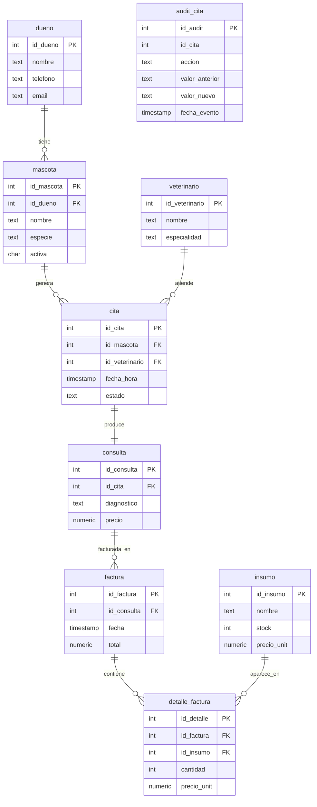

# Taller de la Clase 11 en ExamLab - configuracion

- **Curso:** Bases de Datos II (FI303215)
- **Taller:** Taller Clase 11 en ExamLab - Avance del PI VetCare DB (hito formal)
- **Preguntas:** 5 · **Total:** 100 puntos
- **Plataforma:** ExamLab (https://examlab.lovable.app/) · modulo Talleres
- **Hito del PI:** Demo parcial + checklist de avance (hito formal PI)
- **Entregable de la clase:** Checklist firmada + enlace/ZIP avance (DDL+procs+ER)

> ExamLab no importa preguntas desde archivo: el alta se hace en la UI del
> docente (o con la pestana de IA). Este documento trae el texto exacto de cada
> campo para copiar y pegar, incluidos el SQL de partida y el codigo base.

**Que produce el estudiante:** El estudiante ejecuta la bateria de verificacion del avance de VetCare (integridad, reglas de negocio y auditoria), entrega el ER consolidado, los reportes de la demo, el checklist firmado y la lista de gaps.

---

## Pregunta 1 - Diagrama (Mermaid) · 20 pts

**Tipo en la plataforma:** `diagrama`

**Enunciado (campo Contenido):**

## 1. ER consolidado de VetCare DB (version del hito)

Entrega el **ER definitivo** de VetCare DB tal como quedo despues de las Clases 1 a 8, en `erDiagram` de Mermaid. Debe reflejar el estado **real** de tu base, no el borrador de la Clase 1. Incluye:

- Las 8 entidades del dominio: `dueno`, `mascota`, `veterinario`, `cita`, `consulta`, `insumo`, `factura`, `detalle_factura`.
- La entidad de **auditoria** `audit_cita`, que aparecio en la Clase 4, dibujada sin relacion de FK (es una bitacora historica: guarda el `id_cita` pero no debe impedir borrar ni cambiar la cita).
- Para cada entidad, la PK, las FK y al menos dos atributos mas, con los **nombres exactos** que usaste en tu DDL.
- Las cardinalidades: `dueno` 1-N `mascota`, `mascota` 1-N `cita`, `veterinario` 1-N `cita`, `cita` 1-1 `consulta`, `consulta` 1-N `factura`, `factura` 1-N `detalle_factura`, `insumo` 1-N `detalle_factura`.

Este diagrama es el que proyectas en la demo de 3 a 5 minutos, asi que debe ser legible.

**Diagrama de referencia (Mermaid):**



**Rubrica esperada (campo Rubrica):**

El diagrama renderiza sin errores y contiene las 8 entidades del dominio mas audit_cita. Las 7 relaciones llevan la cardinalidad correcta y audit_cita aparece sin FK, con la razon evidente. Los nombres de tablas y columnas coinciden con el DDL entregado en las clases anteriores. Se descuenta por entidades o relaciones faltantes y por nombres que no correspondan al codigo real.

---

## Pregunta 2 - SQL sobre PostgreSQL real · 35 pts

**Tipo en la plataforma:** `bd_sql`

**Enunciado (campo Contenido):**

## 2. Bateria de verificacion del avance del PI

Esta base trae **el avance completo de VetCare** tal como deberia estar en este hito: las 8 tablas con datos, la tabla `audit_cita` con su trigger `trg_audit_cita`, el procedimiento `sp_agendar_cita` y el procedimiento `sp_facturar`.

Tu trabajo es escribir el **script de verificacion** que se ejecuta en la demo. Son **cinco pruebas**; cada una debe registrar su resultado en la tabla `checklist_pi (id_item SERIAL, item TEXT, resultado TEXT, cumple BOOLEAN)` que ya existe.

**Prueba 1 - Integridad referencial.** Intenta insertar una cita con `id_mascota = 999` (no existe) dentro de un bloque `DO` que capture `foreign_key_violation`. Registra en `checklist_pi` el item `'Integridad referencial cita->mascota'` con `cumple = TRUE` si la base **rechazo** la insercion.

**Prueba 2 - Regla: mascota inactiva no agenda.** Llama `CALL sp_agendar_cita(3, 2, TIMESTAMP '2026-11-05 09:00:00');` (la mascota 3, Rocky, esta inactiva) dentro de un `DO` con `EXCEPTION WHEN OTHERS`. Registra el item `'Regla: mascota inactiva no agenda'` con `cumple = TRUE` si el procedimiento **lanzo** excepcion, guardando el `SQLERRM` en `resultado`.

**Prueba 3 - Regla: stock nunca negativo.** Llama `CALL sp_facturar(4, ARRAY[2], ARRAY[10]);` (el insumo 2 tiene stock 3) dentro de un `DO` con captura. Registra el item `'Regla: stock nunca negativo'` con `cumple = TRUE` si fallo, y **anade en `resultado` el stock actual del insumo 2** para probar que no se movio.

**Prueba 4 - Auditoria activa.** Ejecuta `UPDATE cita SET estado = 'CANCELADA' WHERE id_cita = 1;` y luego verifica que `audit_cita` tenga la fila correspondiente con `valor_anterior = 'PROGRAMADA'` y `valor_nuevo = 'CANCELADA'`. Registra el item `'Auditoria de cambios de estado'` con el `cumple` que corresponda.

**Prueba 5 - Coherencia de facturacion.** Escribe una consulta que compare, para cada factura, el `total` guardado contra la suma de `cantidad * precio_unit` de su `detalle_factura`, y registra el item `'Total de factura coincide con sus detalles'` con `cumple = TRUE` **solo si no hay ninguna factura descuadrada**. Sugerencia: usa `NOT EXISTS` sobre la consulta de descuadres.

Cierra con `SELECT id_item, item, cumple, resultado FROM checklist_pi ORDER BY id_item;`

**SQL de partida (`options.db.setupSql`)** - corre antes del SQL del
estudiante, sobre una base limpia. PostgreSQL, no Oracle:

```sql
CREATE TABLE dueno (
  id_dueno SERIAL PRIMARY KEY,
  nombre TEXT NOT NULL,
  telefono TEXT,
  email TEXT,
  ciudad TEXT DEFAULT 'Cali'
);

CREATE TABLE mascota (
  id_mascota SERIAL PRIMARY KEY,
  id_dueno INT NOT NULL REFERENCES dueno(id_dueno),
  nombre TEXT NOT NULL,
  especie TEXT NOT NULL,
  fecha_nac DATE,
  activa CHAR(1) NOT NULL DEFAULT 'S' CHECK (activa IN ('S','N'))
);

CREATE TABLE veterinario (
  id_veterinario SERIAL PRIMARY KEY,
  nombre TEXT NOT NULL,
  especialidad TEXT,
  activo CHAR(1) NOT NULL DEFAULT 'S' CHECK (activo IN ('S','N'))
);

CREATE TABLE cita (
  id_cita SERIAL PRIMARY KEY,
  id_mascota INT NOT NULL REFERENCES mascota(id_mascota),
  id_veterinario INT NOT NULL REFERENCES veterinario(id_veterinario),
  fecha_hora TIMESTAMP NOT NULL,
  estado TEXT NOT NULL DEFAULT 'PROGRAMADA'
    CHECK (estado IN ('PROGRAMADA','ATENDIDA','CANCELADA'))
);

CREATE TABLE consulta (
  id_consulta SERIAL PRIMARY KEY,
  id_cita INT NOT NULL UNIQUE REFERENCES cita(id_cita),
  diagnostico TEXT,
  precio NUMERIC(12,2) NOT NULL CHECK (precio >= 0)
);

CREATE TABLE insumo (
  id_insumo SERIAL PRIMARY KEY,
  nombre TEXT NOT NULL,
  stock INT NOT NULL CHECK (stock >= 0),
  precio_unit NUMERIC(12,2) NOT NULL
);

CREATE TABLE factura (
  id_factura SERIAL PRIMARY KEY,
  id_consulta INT NOT NULL REFERENCES consulta(id_consulta),
  fecha TIMESTAMP NOT NULL DEFAULT now(),
  total NUMERIC(12,2) NOT NULL DEFAULT 0
);

CREATE TABLE detalle_factura (
  id_detalle SERIAL PRIMARY KEY,
  id_factura INT NOT NULL REFERENCES factura(id_factura) ON DELETE CASCADE,
  id_insumo INT NOT NULL REFERENCES insumo(id_insumo),
  cantidad INT NOT NULL CHECK (cantidad > 0),
  precio_unit NUMERIC(12,2) NOT NULL
);

-- Duenos (ids 1..6 en este orden)
INSERT INTO dueno (nombre, telefono, email) VALUES
  ('Ana Gomez',      '3001112233', 'ana.gomez@mail.com'),
  ('Carlos Ruiz',    '3014445566', 'carlos.ruiz@mail.com'),
  ('Marcela Diaz',   '3027778899', 'marcela.diaz@mail.com'),
  ('Jorge Pineda',   '3105551212', 'jorge.pineda@mail.com'),
  ('Luisa Cardona',  '3123334455', 'luisa.cardona@mail.com'),
  ('Andres Vallejo', '3159998877', 'andres.vallejo@mail.com');

-- Veterinarios (ids 1..4)
INSERT INTO veterinario (nombre, especialidad) VALUES
  ('Laura Restrepo', 'General'),
  ('Diego Moreno',   'Cirugia'),
  ('Paula Salazar',  'Dermatologia'),
  ('Ivan Ortiz',     'General');

-- Mascotas (ids 1..8). Rocky (3) y Kiara (8) estan INACTIVAS.
INSERT INTO mascota (id_dueno, nombre, especie, fecha_nac, activa) VALUES
  (1, 'Firulais', 'Canino', DATE '2019-04-12', 'S'),
  (1, 'Luna',     'Felino', DATE '2021-08-30', 'S'),
  (2, 'Rocky',    'Canino', DATE '2015-01-20', 'N'),
  (3, 'Mishi',    'Felino', DATE '2022-11-05', 'S'),
  (3, 'Bobby',    'Canino', DATE '2018-06-17', 'S'),
  (4, 'Nube',     'Felino', DATE '2023-02-09', 'S'),
  (5, 'Toby',     'Canino', DATE '2020-09-25', 'S'),
  (6, 'Kiara',    'Canino', DATE '2013-03-03', 'N');

-- Citas (ids 1..10)
INSERT INTO cita (id_mascota, id_veterinario, fecha_hora, estado) VALUES
  (1, 1, TIMESTAMP '2026-09-01 08:00:00', 'PROGRAMADA'),
  (2, 1, TIMESTAMP '2026-09-01 09:00:00', 'ATENDIDA'),
  (4, 2, TIMESTAMP '2026-09-01 10:00:00', 'PROGRAMADA'),
  (5, 3, TIMESTAMP '2026-09-02 08:30:00', 'CANCELADA'),
  (6, 2, TIMESTAMP '2026-09-02 11:00:00', 'ATENDIDA'),
  (7, 4, TIMESTAMP '2026-09-03 07:45:00', 'PROGRAMADA'),
  (1, 1, TIMESTAMP '2026-09-05 15:00:00', 'ATENDIDA'),
  (2, 3, TIMESTAMP '2026-09-08 16:00:00', 'PROGRAMADA'),
  (4, 4, TIMESTAMP '2026-09-10 08:00:00', 'PROGRAMADA'),
  (6, 1, TIMESTAMP '2026-09-10 09:00:00', 'ATENDIDA');

-- Consultas (ids 1..4) sobre las citas ATENDIDAS 2, 5, 7 y 10
INSERT INTO consulta (id_cita, diagnostico, precio) VALUES
  (2,  'Vacunacion triple felina', 40000),
  (5,  'Control de peso',          38000),
  (7,  'Otitis externa',           55000),
  (10, 'Desparasitacion',          35000);

-- Insumos (ids 1..6). Ojo: 2 y 5 tienen stock bajo a proposito.
INSERT INTO insumo (nombre, stock, precio_unit) VALUES
  ('Vacuna antirrabica',       12, 22000),
  ('Vacuna triple felina',      3, 31000),
  ('Antiparasitario oral',     40,  9500),
  ('Suero fisiologico 500ml',  25,  7000),
  ('Gasa esteril',              8,  1200),
  ('Jeringa 5ml',              60,   900);

-- Facturas (ids 1..3) y sus detalles
INSERT INTO factura (id_consulta, fecha, total) VALUES
  (1, TIMESTAMP '2026-09-01 09:40:00', 71000),
  (2, TIMESTAMP '2026-09-02 11:35:00', 47000),
  (3, TIMESTAMP '2026-09-05 15:50:00', 60200);

INSERT INTO detalle_factura (id_factura, id_insumo, cantidad, precio_unit) VALUES
  (1, 2, 1, 31000),
  (1, 6, 1,   900),
  (1, 3, 1,  9500),
  (2, 3, 1,  9500),
  (2, 4, 1,  7000),
  (3, 1, 1, 22000),
  (3, 5, 4,  1200),
  (3, 6, 2,   900);

CREATE PROCEDURE sp_agendar_cita(
  p_id_mascota     INT,
  p_id_veterinario INT,
  p_fecha_hora     TIMESTAMP
)
LANGUAGE plpgsql
AS $proc$
DECLARE
  v_activa CHAR(1);
  v_ocupado INT;
BEGIN
  SELECT activa INTO v_activa FROM mascota WHERE id_mascota = p_id_mascota;
  IF NOT FOUND THEN
    RAISE EXCEPTION 'ERROR: la mascota % no existe', p_id_mascota;
  END IF;
  IF v_activa <> 'S' THEN
    RAISE EXCEPTION 'ERROR: la mascota % esta inactiva; no se agenda cita', p_id_mascota;
  END IF;
  SELECT COUNT(*) INTO v_ocupado
  FROM cita
  WHERE id_veterinario = p_id_veterinario
    AND fecha_hora = p_fecha_hora
    AND estado <> 'CANCELADA';
  IF v_ocupado > 0 THEN
    RAISE EXCEPTION 'ERROR: el veterinario % ya tiene cita en %', p_id_veterinario, p_fecha_hora;
  END IF;
  INSERT INTO cita (id_mascota, id_veterinario, fecha_hora, estado)
  VALUES (p_id_mascota, p_id_veterinario, p_fecha_hora, 'PROGRAMADA');
END;
$proc$;

CREATE PROCEDURE sp_facturar(
  p_id_consulta INT,
  p_insumos     INT[],
  p_cantidades  INT[]
)
LANGUAGE plpgsql
AS $proc$
DECLARE
  v_id_factura INT;
  v_total NUMERIC(12,2) := 0;
  v_precio NUMERIC(12,2);
  v_filas INT;
  i INT;
BEGIN
  IF array_length(p_insumos, 1) IS DISTINCT FROM array_length(p_cantidades, 1) THEN
    RAISE EXCEPTION 'ERROR: insumos y cantidades deben tener la misma longitud';
  END IF;

  INSERT INTO factura (id_consulta, total) VALUES (p_id_consulta, 0)
  RETURNING id_factura INTO v_id_factura;

  FOR i IN 1 .. array_length(p_insumos, 1) LOOP
    SELECT precio_unit INTO v_precio FROM insumo WHERE id_insumo = p_insumos[i];
    IF NOT FOUND THEN
      RAISE EXCEPTION 'ERROR: el insumo % no existe', p_insumos[i];
    END IF;

    UPDATE insumo
       SET stock = stock - p_cantidades[i]
     WHERE id_insumo = p_insumos[i]
       AND stock >= p_cantidades[i];
    GET DIAGNOSTICS v_filas = ROW_COUNT;
    IF v_filas = 0 THEN
      RAISE EXCEPTION 'ERROR: stock insuficiente del insumo % (se pidieron %)',
        p_insumos[i], p_cantidades[i];
    END IF;

    INSERT INTO detalle_factura (id_factura, id_insumo, cantidad, precio_unit)
    VALUES (v_id_factura, p_insumos[i], p_cantidades[i], v_precio);

    v_total := v_total + (v_precio * p_cantidades[i]);
  END LOOP;

  UPDATE factura SET total = v_total WHERE id_factura = v_id_factura;
  RAISE NOTICE 'Factura % creada por %', v_id_factura, v_total;
END;
$proc$;

CREATE TABLE audit_cita (
  id_audit SERIAL PRIMARY KEY,
  id_cita INT NOT NULL,
  accion TEXT NOT NULL,
  valor_anterior TEXT,
  valor_nuevo TEXT,
  usuario_bd TEXT NOT NULL DEFAULT current_user,
  fecha_evento TIMESTAMP NOT NULL DEFAULT now()
);

CREATE FUNCTION fn_trg_audit_cita() RETURNS TRIGGER
LANGUAGE plpgsql
AS $fn$
BEGIN
  INSERT INTO audit_cita (id_cita, accion, valor_anterior, valor_nuevo)
  VALUES (NEW.id_cita, 'CAMBIO_ESTADO', OLD.estado, NEW.estado);
  RETURN NULL;
END;
$fn$;

CREATE TRIGGER trg_audit_cita
AFTER UPDATE OF estado ON cita
FOR EACH ROW
WHEN (OLD.estado IS DISTINCT FROM NEW.estado)
EXECUTE FUNCTION fn_trg_audit_cita();

CREATE TABLE checklist_pi (
  id_item SERIAL PRIMARY KEY,
  item TEXT NOT NULL,
  resultado TEXT,
  cumple BOOLEAN
);
```

**Rubrica esperada (campo Rubrica):**

Las 5 pruebas se ejecutan sin abortar el script y cada una inserta exactamente una fila en checklist_pi con su veredicto. La prueba 1 captura foreign_key_violation, las 2 y 3 capturan la excepcion del procedimiento y la 3 evidencia que el stock del insumo 2 sigue en 3. La prueba 4 confirma la fila de audit_cita con los valores anterior y nuevo. La prueba 5 calcula el descuadre con la suma de los detalles y solo marca cumple si no hay ninguno. El SELECT final muestra las 5 filas.

---

## Pregunta 3 - SQL sobre PostgreSQL real · 20 pts

**Tipo en la plataforma:** `bd_sql`

**Enunciado (campo Contenido):**

## 3. Los tres reportes de la demo

Misma base con el avance completo de VetCare. Para la demo de 3 a 5 minutos necesitas **tres consultas de reporte** listas para proyectar. Escribelas en este orden:

**R1 - Agenda operativa.** Para las citas **no canceladas** de septiembre de 2026: `fecha_hora`, nombre de la mascota, especie, nombre del dueno, telefono del dueno, nombre del veterinario y `estado`. Filtra `fecha_hora` por **rango** (`>= '2026-09-01'` y `< '2026-10-01'`) y ordena por `fecha_hora`.

**R2 - Historia clinica y facturacion por dueno.** Una fila por dueno con: `id_dueno`, nombre, cuantas mascotas tiene, cuantas citas suman todas sus mascotas, cuantas consultas se le registraron y el **total facturado** (suma de `factura.total`). Los duenos sin actividad deben aparecer con `0`, no desaparecer: usa `LEFT JOIN` y `COALESCE`. Ordena por total facturado descendente.
*Cuidado con el conteo duplicado*: si unes varias tablas en cadena, los `COUNT` se inflan. Resuelvelo con `COUNT(DISTINCT ...)` o con subconsultas agregadas por dueno.

**R3 - Insumos en riesgo.** Para cada insumo: `nombre`, `stock` actual, total de unidades consumidas segun `detalle_factura` y una columna `alerta` que diga `'CRITICO'` si el stock es menor a 5, `'BAJO'` si esta entre 5 y 10, y `'OK'` en los demas casos (usa `CASE`). Ordena poniendo primero los criticos.

Al final, escribe en comentarios `--` una linea por reporte indicando **que decision del negocio** habilita cada uno.

**SQL de partida (`options.db.setupSql`)** - corre antes del SQL del
estudiante, sobre una base limpia. PostgreSQL, no Oracle:

```sql
CREATE TABLE dueno (
  id_dueno SERIAL PRIMARY KEY,
  nombre TEXT NOT NULL,
  telefono TEXT,
  email TEXT,
  ciudad TEXT DEFAULT 'Cali'
);

CREATE TABLE mascota (
  id_mascota SERIAL PRIMARY KEY,
  id_dueno INT NOT NULL REFERENCES dueno(id_dueno),
  nombre TEXT NOT NULL,
  especie TEXT NOT NULL,
  fecha_nac DATE,
  activa CHAR(1) NOT NULL DEFAULT 'S' CHECK (activa IN ('S','N'))
);

CREATE TABLE veterinario (
  id_veterinario SERIAL PRIMARY KEY,
  nombre TEXT NOT NULL,
  especialidad TEXT,
  activo CHAR(1) NOT NULL DEFAULT 'S' CHECK (activo IN ('S','N'))
);

CREATE TABLE cita (
  id_cita SERIAL PRIMARY KEY,
  id_mascota INT NOT NULL REFERENCES mascota(id_mascota),
  id_veterinario INT NOT NULL REFERENCES veterinario(id_veterinario),
  fecha_hora TIMESTAMP NOT NULL,
  estado TEXT NOT NULL DEFAULT 'PROGRAMADA'
    CHECK (estado IN ('PROGRAMADA','ATENDIDA','CANCELADA'))
);

CREATE TABLE consulta (
  id_consulta SERIAL PRIMARY KEY,
  id_cita INT NOT NULL UNIQUE REFERENCES cita(id_cita),
  diagnostico TEXT,
  precio NUMERIC(12,2) NOT NULL CHECK (precio >= 0)
);

CREATE TABLE insumo (
  id_insumo SERIAL PRIMARY KEY,
  nombre TEXT NOT NULL,
  stock INT NOT NULL CHECK (stock >= 0),
  precio_unit NUMERIC(12,2) NOT NULL
);

CREATE TABLE factura (
  id_factura SERIAL PRIMARY KEY,
  id_consulta INT NOT NULL REFERENCES consulta(id_consulta),
  fecha TIMESTAMP NOT NULL DEFAULT now(),
  total NUMERIC(12,2) NOT NULL DEFAULT 0
);

CREATE TABLE detalle_factura (
  id_detalle SERIAL PRIMARY KEY,
  id_factura INT NOT NULL REFERENCES factura(id_factura) ON DELETE CASCADE,
  id_insumo INT NOT NULL REFERENCES insumo(id_insumo),
  cantidad INT NOT NULL CHECK (cantidad > 0),
  precio_unit NUMERIC(12,2) NOT NULL
);

-- Duenos (ids 1..6 en este orden)
INSERT INTO dueno (nombre, telefono, email) VALUES
  ('Ana Gomez',      '3001112233', 'ana.gomez@mail.com'),
  ('Carlos Ruiz',    '3014445566', 'carlos.ruiz@mail.com'),
  ('Marcela Diaz',   '3027778899', 'marcela.diaz@mail.com'),
  ('Jorge Pineda',   '3105551212', 'jorge.pineda@mail.com'),
  ('Luisa Cardona',  '3123334455', 'luisa.cardona@mail.com'),
  ('Andres Vallejo', '3159998877', 'andres.vallejo@mail.com');

-- Veterinarios (ids 1..4)
INSERT INTO veterinario (nombre, especialidad) VALUES
  ('Laura Restrepo', 'General'),
  ('Diego Moreno',   'Cirugia'),
  ('Paula Salazar',  'Dermatologia'),
  ('Ivan Ortiz',     'General');

-- Mascotas (ids 1..8). Rocky (3) y Kiara (8) estan INACTIVAS.
INSERT INTO mascota (id_dueno, nombre, especie, fecha_nac, activa) VALUES
  (1, 'Firulais', 'Canino', DATE '2019-04-12', 'S'),
  (1, 'Luna',     'Felino', DATE '2021-08-30', 'S'),
  (2, 'Rocky',    'Canino', DATE '2015-01-20', 'N'),
  (3, 'Mishi',    'Felino', DATE '2022-11-05', 'S'),
  (3, 'Bobby',    'Canino', DATE '2018-06-17', 'S'),
  (4, 'Nube',     'Felino', DATE '2023-02-09', 'S'),
  (5, 'Toby',     'Canino', DATE '2020-09-25', 'S'),
  (6, 'Kiara',    'Canino', DATE '2013-03-03', 'N');

-- Citas (ids 1..10)
INSERT INTO cita (id_mascota, id_veterinario, fecha_hora, estado) VALUES
  (1, 1, TIMESTAMP '2026-09-01 08:00:00', 'PROGRAMADA'),
  (2, 1, TIMESTAMP '2026-09-01 09:00:00', 'ATENDIDA'),
  (4, 2, TIMESTAMP '2026-09-01 10:00:00', 'PROGRAMADA'),
  (5, 3, TIMESTAMP '2026-09-02 08:30:00', 'CANCELADA'),
  (6, 2, TIMESTAMP '2026-09-02 11:00:00', 'ATENDIDA'),
  (7, 4, TIMESTAMP '2026-09-03 07:45:00', 'PROGRAMADA'),
  (1, 1, TIMESTAMP '2026-09-05 15:00:00', 'ATENDIDA'),
  (2, 3, TIMESTAMP '2026-09-08 16:00:00', 'PROGRAMADA'),
  (4, 4, TIMESTAMP '2026-09-10 08:00:00', 'PROGRAMADA'),
  (6, 1, TIMESTAMP '2026-09-10 09:00:00', 'ATENDIDA');

-- Consultas (ids 1..4) sobre las citas ATENDIDAS 2, 5, 7 y 10
INSERT INTO consulta (id_cita, diagnostico, precio) VALUES
  (2,  'Vacunacion triple felina', 40000),
  (5,  'Control de peso',          38000),
  (7,  'Otitis externa',           55000),
  (10, 'Desparasitacion',          35000);

-- Insumos (ids 1..6). Ojo: 2 y 5 tienen stock bajo a proposito.
INSERT INTO insumo (nombre, stock, precio_unit) VALUES
  ('Vacuna antirrabica',       12, 22000),
  ('Vacuna triple felina',      3, 31000),
  ('Antiparasitario oral',     40,  9500),
  ('Suero fisiologico 500ml',  25,  7000),
  ('Gasa esteril',              8,  1200),
  ('Jeringa 5ml',              60,   900);

-- Facturas (ids 1..3) y sus detalles
INSERT INTO factura (id_consulta, fecha, total) VALUES
  (1, TIMESTAMP '2026-09-01 09:40:00', 71000),
  (2, TIMESTAMP '2026-09-02 11:35:00', 47000),
  (3, TIMESTAMP '2026-09-05 15:50:00', 60200);

INSERT INTO detalle_factura (id_factura, id_insumo, cantidad, precio_unit) VALUES
  (1, 2, 1, 31000),
  (1, 6, 1,   900),
  (1, 3, 1,  9500),
  (2, 3, 1,  9500),
  (2, 4, 1,  7000),
  (3, 1, 1, 22000),
  (3, 5, 4,  1200),
  (3, 6, 2,   900);
```

**Rubrica esperada (campo Rubrica):**

Los 3 reportes corren y devuelven datos coherentes con la base. R1 filtra por rango de fecha y excluye canceladas. R2 conserva los duenos sin actividad con ceros y evita el conteo inflado usando COUNT(DISTINCT) o subconsultas agregadas. R3 clasifica correctamente con CASE los tres niveles de alerta y ordena por criticidad. Los comentarios finales asocian cada reporte a una decision concreta del negocio.

---

## Pregunta 4 - Respuesta escrita · 15 pts

**Tipo en la plataforma:** `abierta`

**Enunciado (campo Contenido):**

## 4. Checklist de avance del PI (firmada)

Entrega el checklist del hito con el estado real de tu PI. Para **cada** item indica `SI` / `NO` / `PARCIAL`, la **evidencia** (nombre de archivo, de objeto de base de datos o numero de pregunta de ExamLab donde quedo) y una linea de observacion:

1. Modelo ER actualizado y coherente con el DDL real.
2. DDL completo de las 8 tablas con PK, FK y restricciones de dominio (`CHECK`).
3. Plan de roles y privilegios documentado, con la matriz rol x objeto.
4. Al menos un procedimiento de negocio con validacion (`sp_agendar_cita`).
5. Al menos una funcion util al PI (`fn_precio_consulta` u otra).
6. Al menos un trigger de auditoria funcionando.
7. Regla de negocio "mascota inactiva no agenda" verificada con una prueba que falla a proposito.
8. Regla de negocio "stock nunca negativo" verificada con una prueba que falla a proposito.
9. Transaccion de facturacion atomica con rollback demostrado.
10. Par de consultas antes/despues con evidencia de `EXPLAIN`.
11. Al menos dos indices justificados.
12. Plan de respaldo con procedimiento de restore de prueba.
13. Escenarios de concurrencia documentados con su mitigacion.
14. Scripts organizados y ejecutables en orden en tu carpeta del PI.

Cierra con: **porcentaje de avance** que declaras (cuenta los `SI` como 1, los `PARCIAL` como 0,5), **el item mas debil** y una frase de compromiso firmada con tu nombre y la fecha (y los de los demas integrantes, si trabajas en equipo autorizado).

**Rubrica esperada (campo Rubrica):**

Los 14 items tienen estado, evidencia nombrada (archivo u objeto concreto) y observacion. La evidencia es rastreable, no generica. El porcentaje declarado es aritmeticamente coherente con los estados marcados. Se identifica el item mas debil y aparece la firma con nombre y fecha. Se descuenta por items sin evidencia o por porcentajes que no cuadran con el checklist.

---

## Pregunta 5 - Respuesta escrita · 10 pts

**Tipo en la plataforma:** `abierta`

**Enunciado (campo Contenido):**

## 5. Lista de gaps con responsable y fecha

Convierte los `NO` y `PARCIAL` de tu checklist en un **plan de cierre**. Entrega una tabla con **minimo 4 y maximo 8 filas**:

| # | Gap (que falta exactamente) | Item del checklist | Impacto si no se cierra | Responsable (nombre real) | Fecha de cierre | Como se verificara que quedo cerrado |
|---|---|---|---|---|---|---|

Reglas:

- El gap debe estar redactado como una tarea **verificable** ("crear el trigger `trg_stock_no_negativo` y probarlo con dos casos"), no como un deseo ("mejorar los triggers").
- Cada gap debe tener **un** responsable con nombre real (si trabajas solo, seras tu en todas las filas; si hay equipo autorizado, reparte, pero nunca escribas "el equipo").
- Las fechas deben ser anteriores a la sustentacion final del PI.
- La columna de verificacion debe nombrar la **evidencia concreta** (una consulta, un script, una captura de `EXPLAIN`, una fila en `audit_cita`).

Debajo de la tabla, responde en 3 a 5 lineas: **cual es el riesgo mas grande** para llegar a la sustentacion y cual es tu **plan B** si ese gap no se cierra (por ejemplo: documentar el limite y presentar la mitigacion en papel en lugar de ejecutada).

**Rubrica esperada (campo Rubrica):**

La tabla tiene entre 4 y 8 gaps, cada uno redactado como tarea verificable, con un unico responsable nombrado, fecha anterior a la sustentacion y evidencia concreta de cierre. Los gaps corresponden efectivamente a los NO y PARCIAL del checklist de la pregunta 4. El plan B es realista y especifico.

---

## Al terminar de crearlo

- Verifique que la suma de puntos sea la esperada: **100**.
- Publique el taller y confirme la fecha limite (domingo 23:59 segun el Acuerdo).
- Las preguntas con SQL o codigo: ejecutelas una vez usted mismo antes de publicar,
  para confirmar que el SQL de partida corre y que el starter compila.
