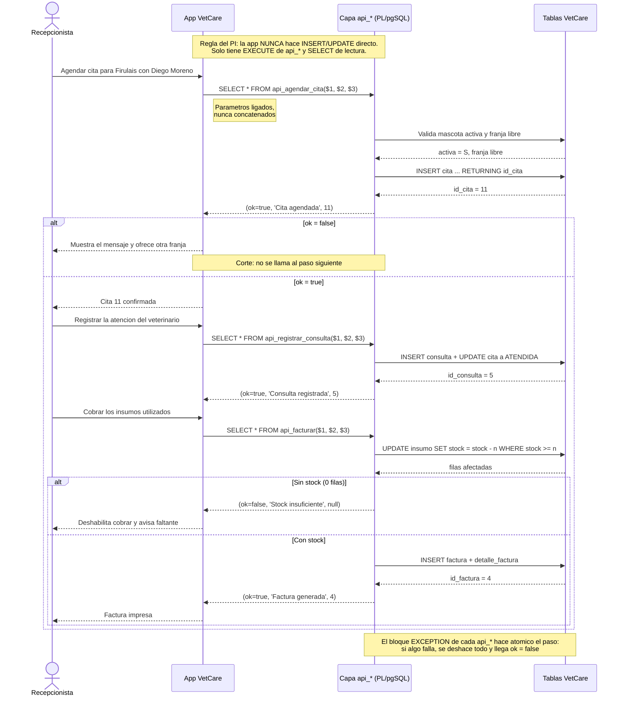

# Solucion del taller · Clase 12 · Contrato de integracion app ↔ BD y sustentacion

> **DOCUMENTO DOCENTE — PRIVADO.** No publicar en `Clases/` ni en ExamLab antes del cierre de la entrega.

**Resumen:** Las tres funciones `api_*` con el contrato uniforme `(ok, mensaje, id_generado)` y las seis llamadas con sus valores exactos; el cliente Python con parametros ligados, `dataclass` y corte en el primer rechazo; el diagrama de secuencia con la rama de error; el blindaje de privilegios **con la prueba negativa via `SET ROLE`, que destapa el defecto central de la clase: sin `SECURITY DEFINER` el rol de la aplicacion no puede usar la API**; el contrato de integracion con la tabla de los 13 mensajes de rechazo y el veredicto honesto de idempotencia (dos de las tres operaciones absorben el reintento por accidente, `api_facturar` cobra dos veces); y el guion de sustentacion de 7 minutos con la demo de 10 sentencias, el plan B y las tres preguntas del jurado que de verdad van a hacer.

> **Esta clase comparte sesion con la 11:** el lunes **2026-10-26**, 18:00 a 20:00, entran las dos. Seis preguntas no caben en lo que queda de esas dos horas, asi que lo razonable es guiar en vivo la pregunta 1 —que es donde se aprende el contrato— y dejar el resto como trabajo autonomo con fecha de cierre antes del **2026-11-16**, que es la sustentacion. **El motor es PostgreSQL, no Oracle.** Y hay que subrayar tres cosas antes de abrir el taller, porque son las que el jurado va a tocar. Primera y mas importante: **tal como esta escrita la pregunta 4, el rol `app_vetcare` no puede usar la API.** Las funciones se crean con `SECURITY INVOKER` —el valor por omision—, asi que corren con los privilegios de quien llama, y quien llama solo tiene `SELECT`: el `INSERT INTO cita` de adentro falla con «permission denied» y el `EXCEPTION WHEN OTHERS` lo devuelve como si fuera un rechazo de negocio. Falta `SECURITY DEFINER`, la rubrica no lo pide y por lo tanto no se descuenta, pero hay que decirlo en voz alta y la solucion lo demuestra con `SET ROLE`. Segunda: `api_agendar_cita` valida la franja con un `SELECT COUNT(*)`, que es **exactamente** el write skew de la Clase 10 —codigo, no restriccion—, asi que la API hereda el problema completo. Tercera: ese `EXCEPTION WHEN OTHERS` que hace elegante el contrato tambien convierte cualquier fallo de infraestructura en un mensaje de negocio, y eso es un riesgo, no una virtud. Por ultimo: la pregunta 2 es de tipo `codigo` y **no se ejecuta** —se califica leyendola—, y las preguntas 5 y 6 son sobre el PI real de cada estudiante, asi que lo que sigue es un **modelo de referencia y no una clave**. En la pregunta 2 no se aceptan credenciales escritas en el codigo: van por variables de entorno.

## Alineacion con el taller

- Taller del estudiante: `Clases/Clase 12 - Integracion y preparacion final/Taller PI - Clase 12 - VetCare.docx`
- Configuracion en la plataforma: `Kit docente/Clase 12/Taller en ExamLab - Clase 12 (configuracion).md`
- Caso de estudio: `Clases/Proyecto Integrador/Anexo - Caso de estudio Clinica Huellitas - Bases de Datos II.docx`
- Hito del PI: Contrato integracion + preparacion de entrega/sustentacion
- Entregable: Contrato app<->BD + outline de slides de sustentacion (5-8 min)
- **Estas preguntas: 100 puntos** en 6 preguntas.

| # | Pregunta | Tipo | Puntos |
|---|---|---|---|
| 1 | La capa de API de VetCare: tres operaciones con contrato uniforme | `bd_sql` | 28 |
| 2 | El cliente de la aplicacion: consumir la API con parametros ligados | `codigo` | 17 |
| 3 | Flujo app → BD del caso de uso «atender una mascota» | `diagrama` | 12 |
| 4 | Blindar la API: la aplicacion solo puede EXECUTE | `bd_sql` | 13 |
| 5 | Contrato de integracion app ↔ BD | `abierta` | 18 |
| 6 | Guion de la sustentacion (5 a 8 minutos) | `abierta` | 12 |

---

## Pregunta 1 · La capa de API de VetCare: tres operaciones con contrato uniforme · 28 pts

### Respuesta esperada (SQL que corre tal cual)

```sql
-- ======================================================================
-- POR QUE LAS TRES FUNCIONES SE PARECEN TANTO
--
-- El contrato es identico a proposito: RETURNS TABLE (ok, mensaje,
-- id_generado). La aplicacion aprende UNA forma de leer la respuesta y la
-- usa para las tres operaciones -- y para las que vengan despues. Eso es
-- lo que se entrega en la pregunta 5 como "contrato de integracion".
--
-- Tres detalles de plpgsql que hay que tener claros antes de escribir:
--
-- 1) RETURN QUERY NO TERMINA LA FUNCION. Agrega filas al resultado y
--    sigue ejecutando la linea de abajo. Por eso cada rechazo lleva un
--    RETURN; desnudo detras. Si se omite, la funcion devuelve DOS filas
--    -- una con ok = false y otra con ok = true -- y ademas hace el
--    INSERT que se queria evitar. Es el error mas grave y mas silencioso
--    de esta pregunta.
--
-- 2) IF NOT FOUND funciona despues de SELECT columna INTO var, pero NO
--    despues de SELECT COUNT(*) INTO var: un COUNT siempre devuelve una
--    fila, aunque sea 0. Por eso la franja se comprueba con
--    "IF v_ocupado > 0", no con NOT FOUND.
--
-- 3) El bloque EXCEPTION es lo que hace ATOMICA a cada funcion. Abre un
--    savepoint implicito: si algo falla a mitad de camino -- por ejemplo
--    en api_facturar, despues de descontar el stock y antes de insertar
--    la factura -- se deshace TODO lo de ese bloque y la aplicacion
--    recibe ok = false. Sin el, quedaria stock descontado sin factura.
--
-- Y una advertencia sobre ese mismo bloque, que va en el informe: el
-- WHEN OTHERS atrapa TODO, incluidos los errores que no son de negocio
-- (permisos, disco lleno, tabla inexistente). El contrato se cumple --
-- la app nunca ve una excepcion cruda -- pero un problema de
-- infraestructura llega disfrazado de rechazo de negocio. Se resuelve en
-- la aplicacion: SQLERRM se registra en el log y al usuario se le muestra
-- un mensaje genérico, nunca el texto crudo (delata nombres de tablas).
-- ======================================================================

-- ----------------------------------------------------------------------
-- 1. api_agendar_cita
-- ----------------------------------------------------------------------
CREATE OR REPLACE FUNCTION api_agendar_cita(p_id_mascota INT,
                                            p_id_veterinario INT,
                                            p_fecha_hora TIMESTAMP)
RETURNS TABLE (ok BOOLEAN, mensaje TEXT, id_generado INT)
LANGUAGE plpgsql
AS $fn$
DECLARE
  v_activa  CHAR(1);
  v_ocupado INT;
  v_id      INT;
BEGIN
  -- Existencia. SELECT ... INTO deja FOUND en falso si no hubo fila, y
  -- por eso aqui SI sirve IF NOT FOUND.
  SELECT activa INTO v_activa FROM mascota WHERE id_mascota = p_id_mascota;
  IF NOT FOUND THEN
    RETURN QUERY SELECT FALSE, 'La mascota no existe', NULL::INT;
    RETURN;                      -- <-- sin este RETURN la funcion sigue
  END IF;

  -- Regla de negocio: mascota inactiva no agenda.
  IF v_activa <> 'S' THEN
    RETURN QUERY SELECT FALSE, 'La mascota esta inactiva', NULL::INT;
    RETURN;
  END IF;

  -- Franja libre. OJO: esto es codigo, no una restriccion. Con dos
  -- sesiones concurrentes las dos pueden contar 0 y las dos insertar --
  -- es el write skew de la Clase 10. La mitigacion real es el indice
  -- unico parcial uq_cita_vet_franja; esta validacion solo da un mensaje
  -- amable en el caso secuencial.
  SELECT COUNT(*) INTO v_ocupado
    FROM cita
   WHERE id_veterinario = p_id_veterinario
     AND fecha_hora     = p_fecha_hora
     AND estado        <> 'CANCELADA';
  IF v_ocupado > 0 THEN
    RETURN QUERY SELECT FALSE, 'Franja ocupada', NULL::INT;
    RETURN;
  END IF;

  INSERT INTO cita (id_mascota, id_veterinario, fecha_hora, estado)
  VALUES (p_id_mascota, p_id_veterinario, p_fecha_hora, 'PROGRAMADA')
  RETURNING id_cita INTO v_id;   -- el id que la app necesita para el paso siguiente

  RETURN QUERY SELECT TRUE, 'Cita agendada', v_id;
EXCEPTION WHEN OTHERS THEN
  RETURN QUERY SELECT FALSE, SQLERRM, NULL::INT;
END;
$fn$;

-- ----------------------------------------------------------------------
-- 2. api_registrar_consulta
-- ----------------------------------------------------------------------
CREATE OR REPLACE FUNCTION api_registrar_consulta(p_id_cita INT,
                                                  p_diagnostico TEXT,
                                                  p_precio NUMERIC)
RETURNS TABLE (ok BOOLEAN, mensaje TEXT, id_generado INT)
LANGUAGE plpgsql
AS $fn$
DECLARE
  v_estado TEXT;
  v_id     INT;
BEGIN
  SELECT estado INTO v_estado FROM cita WHERE id_cita = p_id_cita;
  IF NOT FOUND THEN
    RETURN QUERY SELECT FALSE, 'La cita no existe', NULL::INT;
    RETURN;
  END IF;

  IF v_estado = 'CANCELADA' THEN
    RETURN QUERY SELECT FALSE, 'La cita esta cancelada', NULL::INT;
    RETURN;
  END IF;

  -- Esta validacion tiene red de seguridad: consulta.id_cita es UNIQUE en
  -- el DDL. Si dos sesiones pasaran el EXISTS al mismo tiempo, la segunda
  -- chocaria contra el indice unico, el WHEN OTHERS lo atraparia y la app
  -- recibiria ok = false. Es el patron correcto: la restriccion garantiza,
  -- el EXISTS solo mejora el mensaje.
  IF EXISTS (SELECT 1 FROM consulta WHERE id_cita = p_id_cita) THEN
    RETURN QUERY SELECT FALSE, 'La cita ya tiene consulta', NULL::INT;
    RETURN;
  END IF;

  -- p_precio IS NULL primero: NULL <= 0 no es falso, es NULL, y un IF con
  -- condicion NULL no entra. Sin la comprobacion explicita, un precio
  -- nulo se colaria hasta el CHECK de la tabla.
  IF p_precio IS NULL OR p_precio <= 0 THEN
    RETURN QUERY SELECT FALSE, 'Precio invalido', NULL::INT;
    RETURN;
  END IF;

  INSERT INTO consulta (id_cita, diagnostico, precio)
  VALUES (p_id_cita, p_diagnostico, p_precio)
  RETURNING id_consulta INTO v_id;

  UPDATE cita SET estado = 'ATENDIDA' WHERE id_cita = p_id_cita;

  RETURN QUERY SELECT TRUE, 'Consulta registrada', v_id;
EXCEPTION WHEN OTHERS THEN
  RETURN QUERY SELECT FALSE, SQLERRM, NULL::INT;
END;
$fn$;

-- ----------------------------------------------------------------------
-- 3. api_facturar
-- ----------------------------------------------------------------------
CREATE OR REPLACE FUNCTION api_facturar(p_id_consulta INT,
                                        p_id_insumo INT,
                                        p_cantidad INT)
RETURNS TABLE (ok BOOLEAN, mensaje TEXT, id_generado INT)
LANGUAGE plpgsql
AS $fn$
DECLARE
  v_precio NUMERIC(12,2);
  v_filas  INT;
  v_id     INT;
BEGIN
  IF NOT EXISTS (SELECT 1 FROM consulta WHERE id_consulta = p_id_consulta) THEN
    RETURN QUERY SELECT FALSE, 'La consulta no existe', NULL::INT;
    RETURN;
  END IF;

  IF p_cantidad IS NULL OR p_cantidad <= 0 THEN
    RETURN QUERY SELECT FALSE, 'Cantidad invalida', NULL::INT;
    RETURN;
  END IF;

  SELECT precio_unit INTO v_precio FROM insumo WHERE id_insumo = p_id_insumo;
  IF NOT FOUND THEN
    RETURN QUERY SELECT FALSE, 'El insumo no existe', NULL::INT;
    RETURN;
  END IF;

  -- El corazon de la funcion, y es el patron de la Clase 10: la condicion
  -- del stock va en el WHERE, no en un IF previo. Asi la comprobacion y
  -- el descuento son UNA operacion y no hay ventana entre las dos. Si no
  -- hay stock, el UPDATE afecta 0 filas y no toca nada.
  UPDATE insumo
     SET stock = stock - p_cantidad
   WHERE id_insumo = p_id_insumo
     AND stock    >= p_cantidad;
  GET DIAGNOSTICS v_filas = ROW_COUNT;   -- no existe SQL%ROWCOUNT aqui
  IF v_filas = 0 THEN
    RETURN QUERY SELECT FALSE, 'Stock insuficiente', NULL::INT;
    RETURN;
  END IF;

  -- De aqui en adelante el stock ya bajo. Si alguno de los dos INSERT
  -- fallara, el bloque EXCEPTION deshace tambien el descuento: eso es lo
  -- que hace atomica la operacion completa.
  INSERT INTO factura (id_consulta, total)
  VALUES (p_id_consulta, v_precio * p_cantidad)
  RETURNING id_factura INTO v_id;

  INSERT INTO detalle_factura (id_factura, id_insumo, cantidad, precio_unit)
  VALUES (v_id, p_id_insumo, p_cantidad, v_precio);

  RETURN QUERY SELECT TRUE, 'Factura generada', v_id;
EXCEPTION WHEN OTHERS THEN
  RETURN QUERY SELECT FALSE, SQLERRM, NULL::INT;
END;
$fn$;

-- ======================================================================
-- LAS SEIS LLAMADAS QUE DEMUESTRAN EL CONTRATO
--
-- Todas con SELECT * FROM ..., y no es capricho: una funcion
-- RETURNS TABLE se consume en el FROM. Un CALL api_agendar_cita(...)
-- falla con "api_agendar_cita(...) is not a procedure", porque CALL es
-- para procedimientos.
--
-- Ninguna de las seis lanza error. Tres devuelven ok = true y tres
-- ok = false, y esa es toda la idea: la aplicacion siempre recibe una
-- fila que puede leer igual.
-- ======================================================================
SELECT * FROM api_agendar_cita(1, 2, TIMESTAMP '2026-10-01 09:00:00');   -- ok = true
SELECT * FROM api_agendar_cita(3, 2, TIMESTAMP '2026-10-01 10:00:00');   -- Rocky inactiva
SELECT * FROM api_registrar_consulta(1, 'Vacunacion anual', 45000);      -- ok = true
SELECT * FROM api_registrar_consulta(4, 'Revision', 30000);              -- cita 4 CANCELADA
SELECT * FROM api_facturar(1, 6, 2);                                     -- ok = true
SELECT * FROM api_facturar(1, 2, 10);                                    -- insumo 2 tiene 3

-- ======================================================================
-- VERIFICACION: que quedo en la base, que es lo que se proyecta
-- ======================================================================
-- La cita nueva, y el estado de la cita 1. Ojo al detalle: la llamada 3
-- registro la consulta de la cita 1, NO de la cita 11. Las seis llamadas
-- del enunciado no forman una cadena.
SELECT id_cita, id_mascota, id_veterinario, fecha_hora, estado
  FROM cita
 WHERE id_cita IN (1, 11)
 ORDER BY id_cita;

-- La consulta nueva es la 5, sobre la cita 1.
SELECT id_consulta, id_cita, diagnostico, precio
  FROM consulta
 ORDER BY id_consulta;

-- El insumo 6 bajo de 60 a 58; el 2 sigue en 3, intacto. El CHECK
-- (stock >= 0) nunca se activo: lo que protegio fue el WHERE del UPDATE.
-- El CHECK es la red por si alguien escribe mal el procedimiento.
SELECT id_insumo, nombre, stock FROM insumo WHERE id_insumo IN (2, 6) ORDER BY id_insumo;

-- La factura nueva con su unico detalle, y el total cuadrado.
SELECT f.id_factura, f.id_consulta, f.total,
       d.id_insumo, d.cantidad, d.precio_unit,
       d.cantidad * d.precio_unit AS suma_detalle
  FROM factura f
  JOIN detalle_factura d ON d.id_factura = f.id_factura
 WHERE f.id_factura = 4;

-- ======================================================================
-- DOS LIMITES DE ESTA API QUE VAN AL INFORME, NO SE OCULTAN
--
-- a) api_facturar cobra UNA linea por llamada, como pide el enunciado
--    "para simplificar". La consecuencia real: una visita con tres
--    insumos produce TRES facturas, no una factura con tres lineas. Por
--    eso factura 4 queda sobre la consulta 1, que ya tenia la factura 1.
--    El modelo lo permite (consulta 1-N factura) y de paso explica por
--    que estas facturas si cuadran: cada una tiene un solo detalle. La
--    version util para el negocio recibe arrays -- como el sp_facturar
--    de la Clase 8 -- y crea una sola factura con N detalles.
--
-- b) La validacion de franja de api_agendar_cita no resiste concurrencia,
--    por la razon de la Clase 10: un SELECT COUNT(*) no toma candado y no
--    puede tomarlo, porque la fila en conflicto todavia no existe. Lo
--    tranquilizador es que la API ya esta preparada para la mitigacion:
--    al agregar el indice unico parcial uq_cita_vet_franja, la segunda
--    sesion recibe unique_violation, el WHEN OTHERS lo atrapa y la app
--    ve un ok = false normal. O sea que la restriccion no rompe el
--    contrato: lo completa.
-- ======================================================================
```

### Salida esperada

```
Las seis llamadas, una fila cada una y ningun error:

  ok  |         mensaje          | id_generado
------+--------------------------+-------------
 t    | Cita agendada            |          11
 f    | La mascota esta inactiva |      (null)
 t    | Consulta registrada      |           5
 f    | La cita esta cancelada   |      (null)
 t    | Factura generada         |           4
 f    | Stock insuficiente       |      (null)

Tres exitos y tres rechazos, y cero excepciones: eso es el contrato. Fijate en
que los tres rechazos devuelven id_generado en NULL -- no en 0, no en -1 -- y
que ese detalle esta documentado en la pregunta 5.

Estado de cita 1 y 11 -- 2 filas

 id_cita | id_mascota | id_veterinario |     fecha_hora      |   estado
---------+------------+----------------+---------------------+------------
       1 |          1 |              1 | 2026-09-01 08:00:00 | ATENDIDA
      11 |          1 |              2 | 2026-10-01 09:00:00 | PROGRAMADA

Aqui esta la sorpresa que hay que explicar: la cita 1 paso a ATENDIDA y la
11 sigue PROGRAMADA. La tercera llamada del enunciado es
api_registrar_consulta(1, ...), o sea sobre la cita 1, no sobre la que se acabo
de crear. Las seis llamadas son seis casos de prueba independientes, no un flujo
encadenado -- el flujo encadenado es lo que se arma en la pregunta 2 con
flujo_atencion, que si pasa el id_generado de un paso al siguiente.

consulta -- 5 filas

 id_consulta | id_cita |        diagnostico        |  precio
-------------+---------+---------------------------+----------
           1 |       2 | Vacunacion triple felina  | 40000.00
           2 |       5 | Control de peso           | 38000.00
           3 |       7 | Otitis externa            | 55000.00
           4 |      10 | Desparasitacion           | 35000.00
           5 |       1 | Vacunacion anual          | 45000.00

insumo -- 2 filas

 id_insumo |        nombre        | stock
-----------+----------------------+-------
         2 | Vacuna triple felina |     3
         6 | Jeringa 5ml          |    58

El 6 bajo de 60 a 58 (dos jeringas). El 2 sigue en 3: el UPDATE condicional
afecto 0 filas y no toco nada. El CHECK (stock >= 0) nunca se activo, y eso es
lo correcto -- el CHECK es la red por si el procedimiento esta mal escrito, no
el mecanismo de todos los dias.

factura 4 con su detalle -- 1 fila

 id_factura | id_consulta |  total  | id_insumo | cantidad | precio_unit | suma_detalle
------------+-------------+---------+-----------+----------+-------------+--------------
          4 |           1 | 1800.00 |         6 |        2 |      900.00 |      1800.00

total = suma_detalle. Compara con lo que encontro la Clase 11: las facturas
historicas 1, 2 y 3 estan descuadradas y esta cuadra al centavo. La diferencia
es que esta la creo una funcion y aquellas las cargo alguien a mano.

Y un dato para la pregunta 5: los tres rechazos NO consumieron secuencia,
porque los tres devuelven antes de llegar a su INSERT. Por eso la cita nueva es
la 11 y no la 13. La secuencia solo se quema cuando el INSERT se intenta y
falla, que es lo que paso en la Clase 11.
```

### Como calificar

- **12 pts — las tres funciones con el contrato exacto,** 4 pts cada una. 1,5 pts la firma con `RETURNS TABLE (ok BOOLEAN, mensaje TEXT, id_generado INT)` **literal** —cambiar un nombre de columna rompe el contrato que la pregunta 5 documenta y la pregunta 2 consume—; 1,5 pts las validaciones propias de cada una; 1 pt el `RETURNING ... INTO` que devuelve el id generado.
- **6 pts — el bloque `EXCEPTION WHEN OTHERS THEN RETURN QUERY SELECT FALSE, SQLERRM, NULL::INT;` en las tres,** 2 pts cada una. Es lo que garantiza que la aplicacion **nunca** reciba una excepcion cruda, y es requisito literal del enunciado. Se reconoce como sobresaliente explicar el efecto secundario valioso: el bloque abre un savepoint implicito, asi que si `api_facturar` falla despues de descontar el stock, el descuento se deshace. **Sin `EXCEPTION` la funcion no es atomica.**
- **4 pts — el `RETURN;` desnudo detras de cada `RETURN QUERY` de rechazo.** Es el punto tecnico que decide la pregunta y conviene calificarlo aparte. `RETURN QUERY` **no** termina la funcion: agrega filas y sigue. Sin el `RETURN;`, `api_agendar_cita(3, ...)` devuelve **dos filas** —una `false` y una `true`— y **agenda la cita de la mascota inactiva**. La forma de detectarlo al calificar es contar filas: cada llamada tiene que devolver exactamente 1.
- **4 pts — `api_facturar` con el `UPDATE` condicional y `GET DIAGNOSTICS ... ROW_COUNT`.** 2 pts que la condicion del stock este **en el `WHERE`** y no en un `IF` previo, y 2 pts el `GET DIAGNOSTICS` con el `IF v_filas = 0`. Es requisito literal de la rubrica y es la conclusion de la Clase 10: cuando la condicion cabe en el `WHERE`, va en el `WHERE`.
- **2 pts — las seis llamadas con `SELECT * FROM ...`,** todas devolviendo fila y ninguna lanzando error, con los valores esperados: `11`, rechazo por inactiva, `5`, rechazo por cancelada, `4`, rechazo por stock. Un `CALL` en vez de `SELECT` falla con «is not a procedure» y cuesta estos 2 pts.
- **Se reconoce como sobresaliente, sin puntos extra:** notar que la llamada 3 opera sobre la cita **1** y no sobre la 11 recien creada, asi que las seis llamadas son casos independientes y no un flujo; ver que los tres rechazos **no** queman secuencia porque devuelven antes del `INSERT`; o dejar escrito que `api_facturar` produce una factura por llamada y que por eso una visita con tres insumos generaria tres facturas.

### Errores frecuentes y que hacer

- **Omitir el `RETURN;` despues de un `RETURN QUERY` de rechazo.** Es el error mas grave del taller y el mas facil de pasar por alto, porque «funciona»: la primera fila dice `false` y el estudiante se queda tranquilo. Lo que en realidad ocurre es que la funcion sigue y **hace el `INSERT`**, de modo que la mascota inactiva **si** queda agendada. El sintoma es visible: la llamada devuelve **dos** filas. Al devolverlo conviene pedir `SELECT COUNT(*) FROM api_agendar_cita(3, 2, ...)`.
- **Usar `IF NOT FOUND` despues de `SELECT COUNT(*) INTO`.** Nunca entra, porque un `COUNT` siempre devuelve una fila aunque valga 0. Es el mismo error que aparecio en la Clase 8 y sigue vivo. La franja se comprueba con `IF v_ocupado > 0`.
- **Comprobar el stock con un `IF` antes del `UPDATE`:** `SELECT stock INTO v_stock ...; IF v_stock >= p_cantidad THEN UPDATE ...`. Da el mismo resultado en ExamLab y es el patron inseguro que la Clase 10 desmonto: entre el `SELECT` y el `UPDATE` hay una ventana. Cuesta los 2 pts del `WHERE` aunque la salida sea identica.
- **Cambiar los nombres del contrato:** `exito` por `ok`, `msg` por `mensaje`, `id` por `id_generado`. Rompe la pregunta 2 —el `SELECT ok, mensaje, id_generado FROM ...` deja de compilar— y rompe el documento de la pregunta 5. El contrato se llama contrato precisamente porque no se negocia.
- **Olvidar `p_precio IS NULL` en `api_registrar_consulta`.** `NULL <= 0` no es falso: es `NULL`, y un `IF` con condicion nula no entra. El precio nulo se cuela hasta el `NOT NULL` de la tabla, salta como excepcion, el `WHEN OTHERS` la atrapa y la aplicacion recibe un mensaje del motor en ingles en vez del «Precio invalido» del contrato. Funciona, pero el mensaje ya no es el documentado.
- **Llamar las funciones con `CALL`.** Falla con «is not a procedure»: `CALL` es para procedimientos, y una funcion `RETURNS TABLE` se consume en el `FROM`. Aparece por arrastre de la Clase 8, donde todo era `CALL sp_*`.
- **Declarar una variable con el mismo nombre que una columna del `RETURNS TABLE`** —por ejemplo `DECLARE mensaje TEXT;`—. PostgreSQL responde «column reference “mensaje” is ambiguous» y el error no dice donde. La convencion `v_` para variables locales, que el curso viene usando desde la Clase 4, existe justamente para esto.

---

## Pregunta 2 · El cliente de la aplicacion: consumir la API con parametros ligados · 17 pts

### Respuesta esperada

Esta pregunta **no se ejecuta**: se califica leyendo el codigo. Y lo que se lee son cuatro cosas concretas —parametros ligados sin excepcion, el `dataclass` que traduce el contrato, `commit`/`rollback` gobernados por `ok`, y el corte en el primer rechazo—. Una decision de diseno que conviene explicar antes del codigo: **las tres funciones delegan en un unico helper `_llamar`**. El enunciado pide `with conn.cursor()` y captura de `psycopg2.Error` en cada operacion, y ponerlo tres veces seria copiar y pegar el mismo `try` con la misma decision de transaccion; concentrarlo en un lugar significa que **hay un solo sitio donde se ejecuta SQL en todo el archivo**, y eso es exactamente lo que hace auditable el requisito de «ningun `INSERT` directo»: se revisa una funcion, no tres. Las dos formas se aceptan.

```python
"""Capa de acceso a datos de la app VetCare (Huellitas).

Regla del PI: la app NUNCA hace INSERT/UPDATE/DELETE directo sobre
cita, consulta ni factura. Solo invoca las funciones api_*.
"""
import os
from dataclasses import dataclass

import psycopg2


@dataclass
class Resultado:
    ok: bool
    mensaje: str
    id_generado: int | None


# Las tres sentencias de la capa. Son constantes con marcadores %s: el
# texto del SQL nunca depende de los datos del usuario, y por eso no hay
# forma de inyectar nada.
_SQL_AGENDAR = (
    "SELECT ok, mensaje, id_generado "
    "FROM api_agendar_cita(%s, %s, %s)"
)
_SQL_CONSULTA = (
    "SELECT ok, mensaje, id_generado "
    "FROM api_registrar_consulta(%s, %s, %s)"
)
_SQL_FACTURAR = (
    "SELECT ok, mensaje, id_generado "
    "FROM api_facturar(%s, %s, %s)"
)


def _llamar(conn, sql: str, params: tuple) -> Resultado:
    """Unico punto del modulo donde se ejecuta SQL.

    Traduce el contrato (ok, mensaje, id_generado) de la base al
    Resultado de la aplicacion y decide la transaccion: se confirma
    solo si la base dijo ok; en cualquier otro caso se deshace.
    """
    try:
        with conn.cursor() as cur:
            cur.execute(sql, params)   # <- parametros ligados, siempre
            fila = cur.fetchone()
    except psycopg2.Error as exc:
        # Falla de infraestructura: la funcion no llego a responder.
        conn.rollback()
        # El texto crudo va al log, no a la pantalla del usuario.
        print(f"[ERROR BD] {exc}")
        return Resultado(
            False,
            "No fue posible completar la operacion. Intenta de nuevo.",
            None,
        )

    if fila is None:
        # No deberia pasar: las api_* siempre devuelven una fila. Si
        # pasa, el contrato esta roto y hay que enterarse.
        conn.rollback()
        return Resultado(False, "La API no devolvio fila", None)

    ok, mensaje, id_generado = fila
    if ok:
        conn.commit()
    else:
        conn.rollback()
    return Resultado(bool(ok), mensaje, id_generado)


def agendar_cita(conn, id_mascota: int, id_veterinario: int,
                 fecha_hora) -> Resultado:
    return _llamar(conn, _SQL_AGENDAR,
                   (id_mascota, id_veterinario, fecha_hora))


def registrar_consulta(conn, id_cita: int, diagnostico: str,
                       precio) -> Resultado:
    return _llamar(conn, _SQL_CONSULTA, (id_cita, diagnostico, precio))


def facturar(conn, id_consulta: int, id_insumo: int,
             cantidad: int) -> Resultado:
    return _llamar(conn, _SQL_FACTURAR,
                   (id_consulta, id_insumo, cantidad))


def flujo_atencion(conn, id_mascota, id_veterinario, fecha_hora,
                   diagnostico, precio, id_insumo,
                   cantidad) -> Resultado:
    """Caso de uso completo: agendar -> registrar consulta -> facturar.

    Corta en el primer ok = False y devuelve ese Resultado, que ya trae
    el mensaje que se le muestra al usuario. Cada paso recibe el
    id_generado del anterior: para eso existe esa columna del contrato.
    """
    r_cita = agendar_cita(conn, id_mascota, id_veterinario, fecha_hora)
    if not r_cita.ok:
        return r_cita

    r_consulta = registrar_consulta(conn, r_cita.id_generado,
                                    diagnostico, precio)
    if not r_consulta.ok:
        return r_consulta

    return facturar(conn, r_consulta.id_generado, id_insumo, cantidad)


def _conectar():
    """Credenciales por variables de entorno, nunca en el codigo."""
    return psycopg2.connect(
        host=os.environ.get("VETCARE_HOST", "localhost"),
        dbname=os.environ.get("VETCARE_DB", "vetcare"),
        user=os.environ["VETCARE_USER"],
        password=os.environ["VETCARE_PASSWORD"],
    )


def _mostrar(titulo: str, r: Resultado) -> None:
    etiqueta = "OK" if r.ok else "RECHAZADO"
    print(f"{titulo}\n  [{etiqueta}] {r.mensaje} (id={r.id_generado})")


if __name__ == "__main__":
    conn = _conectar()
    try:
        _mostrar(
            "Caso exitoso: Firulais (mascota 1) con Diego Moreno (vet 2)",
            flujo_atencion(conn, 1, 2, "2026-10-01 09:00:00",
                           "Vacunacion anual", 45000, 6, 2),
        )
        _mostrar(
            "Caso rechazado: Rocky (mascota 3) esta inactiva",
            flujo_atencion(conn, 3, 2, "2026-10-01 10:00:00",
                           "Revision general", 30000, 6, 1),
        )
    finally:
        conn.close()
```

**Lo que imprime el bloque `main`,** que es lo que el enunciado pide mostrar:

```
Caso exitoso: Firulais (mascota 1) con Diego Moreno (vet 2)
  [OK] Factura generada (id=4)
Caso rechazado: Rocky (mascota 3) esta inactiva
  [RECHAZADO] La mascota esta inactiva (id=None)
```

**Tres cosas que conviene senalar al revisar.** La primera es la que mas se malinterpreta: en el caso exitoso el mensaje final es «Factura generada», no «Cita agendada», porque `flujo_atencion` devuelve el `Resultado` del **ultimo** paso. Si la interfaz necesita mostrar el numero de cita, hay que guardarlo durante el recorrido —o devolver los tres resultados—; es una limitacion real del diseno y se documenta en lugar de disimularse. La segunda: en el caso rechazado el `id_generado` llega como `None` y no como `0`, porque la base devuelve `NULL::INT` y `psycopg2` lo traduce a `None`; por eso el `dataclass` declara `int | None`. La tercera: el `except psycopg2.Error` **no** le muestra el texto del error al usuario. Ese texto puede decir «permission denied for table cita» y estaria delatando nombres de tablas y fallas de configuracion a quien esta al otro lado de la pantalla; va al log y al usuario se le da un mensaje generico.

*Nota tecnica:* `int | None` en una anotacion requiere Python 3.10 o superior, igual que el `starter` que entrega la plataforma. En una version anterior se escribe `Optional[int]` con `from typing import Optional`.

### Como calificar

- **5 pts — parametros ligados en las tres funciones, sin una sola excepcion.** El SQL tiene que ser una cadena constante con `%s` y los valores viajar en la tupla del segundo argumento de `execute`. **Una sola f-string o una concatenacion con `+` o `%` dentro del SQL cuesta los 5 pts completos**, aunque el resto del archivo sea impecable: es la puerta de la inyeccion y el enunciado la prohibe con esa palabra. Se descuenta igual `cur.execute(sql % params)`, que es concatenacion disfrazada.
- **3 pts — el `dataclass Resultado` traduciendo el contrato.** 2 pts que las tres funciones devuelvan `Resultado` y no la tupla cruda de `fetchone()`, y 1 pt que el tipo sea `int | None` (u `Optional[int]`) porque un rechazo trae `NULL` y `psycopg2` lo entrega como `None`. Devolver la tupla directa cuesta los 2 pts: la aplicacion quedaria atada a la posicion de las columnas.
- **3 pts — `commit` / `rollback` gobernados por `ok`,** mas `with conn.cursor() as cur:` y `except psycopg2.Error`. Se acepta que esto viva en un helper compartido —es mejor diseno— o repetido en cada funcion, que es lo que sugiere el enunciado. Lo que **no** se acepta es confirmar siempre, ni dejar la transaccion abierta cuando `ok` es falso.
- **3 pts — `flujo_atencion` cortando en el primer `ok = False`.** 2 pts el corte con retorno inmediato y 1 pt que cada paso reciba el `id_generado` del anterior —`registrar_consulta(conn, r_cita.id_generado, ...)`—, que es la razon de ser de esa columna del contrato. Un `flujo_atencion` que ejecuta los tres pasos y despues revisa vale 1 de 3: facturaria una consulta que no existe.
- **2 pts — ningun `INSERT`, `UPDATE` ni `DELETE` directo a `cita`, `consulta` o `factura` en todo el archivo.** Se verifica buscando esas cuatro palabras en el codigo; la unica sentencia permitida es `SELECT ... FROM api_*`. Es la regla de oro del PI y se califica de forma binaria.
- **1 pt — el bloque `if __name__ == "__main__":` con un caso exitoso y uno rechazado,** imprimiendo el mensaje que veria el usuario final. Se reconoce como sobresaliente que las credenciales vengan de variables de entorno y no escritas en el archivo, y que el caso rechazado sea el de la mascota inactiva que pide el enunciado.
- **Se reconoce como sobresaliente, sin puntos extra:** notar que en el caso exitoso el mensaje que llega es «Factura generada» y no «Cita agendada», porque `flujo_atencion` devuelve el ultimo paso; o no mostrarle al usuario el texto de `psycopg2.Error`, que puede delatar nombres de tablas.

### Errores frecuentes y que hacer

- **Cualquier f-string o concatenacion en el SQL:** `cur.execute(f"SELECT * FROM api_agendar_cita({id_mascota}, ...)")`. Es el error mas costoso de la pregunta y aparece porque «se ve mas corto». Con un campo de texto —el diagnostico— basta para que un usuario cierre la cadena y agregue su propia sentencia. Al devolverlo conviene mostrar el ejemplo concreto con un `'); DROP TABLE cita; --` en el diagnostico.
- **Confundir marcadores:** usar `?` (que es de SQLite) o `:nombre` (que es de SQLAlchemy y de Oracle) en vez de `%s`. `psycopg2` usa `%s` para **todos** los tipos, tambien para cadenas y fechas, y **sin comillas alrededor**: escribir `'%s'` convierte el marcador en un literal y rompe la consulta.
- **Hacer `commit()` siempre, o no hacer `rollback()` cuando `ok` es falso.** Con estas tres funciones el dano es limitado porque el rechazo no escribe nada, pero deja la transaccion abierta y la siguiente operacion hereda un estado que nadie previo. La regla del contrato es directa: **la transaccion la decide `ok`.**
- **Un `flujo_atencion` que no corta.** Ejecuta los tres pasos y revisa al final, o ignora el `id_generado` y pasa el parametro original. Si agendar falla, `r_cita.id_generado` es `None` y `registrar_consulta(conn, None, ...)` sale con «La cita no existe»: dos mensajes de error por una sola causa, y el usuario ve el equivocado.
- **Devolver la tupla de `fetchone()` en vez del `Resultado`.** Obliga a toda la aplicacion a recordar que `ok` es la posicion 0, y el dia que la base agregue una cuarta columna al contrato hay que tocar cada pantalla. El `dataclass` es requisito del enunciado, no un adorno.
- **Dejar usuario y contrasena escritos en el archivo,** aunque sea `password="1234"` en una demo. Es lo que despues llega a un repositorio publico y ademas contradice toda la pregunta 4: no tiene sentido montar privilegio minimo y publicar la credencial. Variables de entorno o un archivo de configuracion fuera del control de versiones.
- **Mostrarle al usuario el `SQLERRM` o el texto de `psycopg2.Error`.** Aparece como «para que se entienda mejor» y es una fuga de informacion: esos mensajes traen nombres de tablas, de restricciones y a veces la consulta completa. Al log el texto crudo, a la pantalla un mensaje generico.

---

## Pregunta 3 · Flujo app → BD del caso de uso «atender una mascota» · 12 pts

### Respuesta esperada

El diagrama tiene una sola tarea: **dejar visible que la aplicacion no toca las tablas.** Si un jurado ve una flecha que va de `APP` a `DB`, toda la arquitectura de la clase se cae en esa lamina, y por eso la rubrica dice literalmente que «se descuenta si el diagrama muestra a la aplicacion escribiendo directamente en las tablas». La regla de dibujo que lo garantiza: **`APP` solo habla con `API`, y solo `API` habla con `DB`.**

El `alt` / `else` es la otra pieza que se califica, y conviene entender por que importa tanto en un diagrama que parece una formalidad: sin la rama, el diagrama cuenta el camino feliz, que es justo el que nunca da problemas. Lo que hay que poder mostrar es el corte —cuando `ok = false`, la aplicacion muestra el mensaje y **se detiene**—, porque es el comportamiento que `flujo_atencion` implementa en la pregunta 2 y el que la pregunta 5 documenta como accion de interfaz. El diagrama, el codigo y el contrato tienen que contar la misma historia.

El modelo de abajo usa **dos** `alt` anidados: uno para el rechazo al agendar y otro para el rechazo al facturar por stock, porque son los dos rechazos que se demuestran en vivo en la sustentacion. Un solo `alt` en el nivel superior **cumple la rubrica completa**; el segundo es un extra que ayuda en la demo. Lo unico no negociable es que renderice: se pega en ExamLab, se comprueba que salga el dibujo, y solo entonces se entrega.

### Respuesta esperada (dominio de la solucion)



### Como calificar

- **3 pts — que renderice sin errores y esten los cuatro participantes:** la recepcionista, la aplicacion, la capa `api_*` y las tablas. Un diagrama que no renderiza vale 0 en la pregunta completa, porque el entregable es una lamina de la sustentacion. Se acepta `actor` o `participant` para la recepcionista.
- **4 pts — las tres invocaciones `api_*` con sus parametros y el retorno del contrato,** algo mas de 1,3 pts cada una. La flecha de ida tiene que nombrar la funcion y la de vuelta tiene que traer las **tres** columnas —`(ok, mensaje, id_generado)`—, no un «responde OK». Mostrar el `id_generado` concreto (11, 5, 4) es lo que deja ver que el flujo se encadena.
- **3 pts — el bloque `alt` / `else` que representa el corte cuando `ok` es falso.** 2 pts la estructura y 1 pt que en la rama de error se vea que la aplicacion **no continua**. Un `alt` en el nivel superior cumple la rubrica completa; los anidados son un extra que no da mas puntos y si añade riesgo de que no renderice.
- **2 pts — la nota `Note over` con la regla del PI:** la aplicacion no hace `INSERT` directo. Se reconoce como mejor version la que ademas dice **por que** es cierto —solo tiene `EXECUTE` de `api_*` y `SELECT` de lectura—, porque conecta esta lamina con la pregunta 4.
- **Se descuenta hasta el total de la pregunta si aparece una flecha de `APP` a `DB`.** Es requisito literal de la rubrica y no es una formalidad: esa flecha contradice la arquitectura que el estudiante acaba de construir, y es lo primero que un jurado va a mirar. La regla de dibujo: `APP` solo habla con `API`, y solo `API` habla con `DB`.
- **Se reconoce como sobresaliente, sin puntos extra:** anotar que `api_facturar` descuenta el stock de forma atomica —con el `UPDATE` condicional visible en la flecha—, o dejar una nota sobre el bloque `EXCEPTION` que hace atomico cada paso.

### Errores frecuentes y que hacer

- **La flecha de `APP` directo a `DB`.** Es el error que la rubrica castiga por nombre y aparece casi siempre por comodidad de dibujo, no por convencimiento. Vale la pena senalarlo con la pregunta que hara el jurado: «entonces, ¿para que sirve la capa `api_*`?».
- **Un diagrama sin `alt`, solo con el camino feliz.** Cuenta la mitad de la historia, y la mitad que sobra: el camino feliz nunca es el que genera soporte. Ademas contradice el `flujo_atencion` de la pregunta 2, que existe precisamente para cortar.
- **Flechas de retorno que dicen «OK» o «responde bien» en vez del contrato.** Toda la clase gira alrededor de que la respuesta son **tres** columnas siempre; si el diagrama no las muestra, no esta documentando la integracion que la pregunta 5 va a entregar por escrito.
- **Un diagrama que no renderiza.** Casi siempre por un `alt` mal cerrado —falta un `end`— o por un `Note` con un salto de linea literal en vez de `<br/>`. Cada `alt` necesita su `end`, y si hay anidados, los `end` van en orden inverso. La comprobacion cuesta cinco segundos y evita perder los 12 pts.
- **Usar un `flowchart` o un `graph TD` en vez de `sequenceDiagram`.** El enunciado pide un diagrama de secuencia y no es un detalle de sintaxis: lo que se quiere mostrar es **el orden temporal y quien llama a quien**, y un grafo de cajas no lo dice.
- **Poner a la recepcionista hablando con `API`.** La recepcionista usa una pantalla; la que invoca funciones es la aplicacion. Parece un detalle y no lo es: el diagrama tiene que reflejar que la persona nunca tiene credenciales de base de datos.

---

## Pregunta 4 · Blindar la API: la aplicacion solo puede EXECUTE · 13 pts

### Respuesta esperada (SQL que corre tal cual)

```sql
-- ======================================================================
-- 1. El rol de la aplicacion
-- NOLOGIN porque no es una persona ni un servicio que se conecte por si
-- mismo: es el conjunto de permisos que despues se le otorga al usuario
-- real de la aplicacion con GRANT app_vetcare TO usuario_app. Separar el
-- rol de permisos del usuario que se conecta es lo que permite rotar
-- credenciales sin volver a repartir privilegios.
-- ======================================================================
CREATE ROLE app_vetcare NOLOGIN;

-- ======================================================================
-- 2. Cerrar la puerta grande
-- Redundante hoy -- a app_vetcare nunca se le otorgo nada -- y aun asi se
-- escribe, porque un script de permisos tiene que poder leerse como la
-- DECISION de diseno y no solo como su efecto. El dia que alguien haga un
-- GRANT ALL de apuro, esta linea al reejecutar el script lo revierte.
--
-- Es normal que PostgreSQL responda "WARNING: no privileges could be
-- revoked for ..." una vez por tabla: esta avisando que no habia nada que
-- quitar, que es exactamente lo que se queria confirmar. No es un error y
-- el script sigue.
-- ======================================================================
REVOKE INSERT, UPDATE, DELETE
    ON cita, consulta, factura, detalle_factura, insumo
  FROM app_vetcare;

-- ======================================================================
-- 3. EL PUNTO QUE CASI TODOS OLVIDAN
-- En PostgreSQL, una funcion recien creada queda con EXECUTE otorgado a
-- PUBLIC. O sea que sin este REVOKE, CUALQUIER rol de la base puede
-- llamar api_facturar y cobrarle a un cliente. El GRANT del paso 4 no
-- sirve de nada mientras PUBLIC siga teniendo el privilegio: no se le
-- esta dando acceso a app_vetcare, se le esta quitando a todos los demas.
--
-- La firma tiene que ir COMPLETA y con los tipos exactos, porque las
-- funciones se identifican por nombre + tipos de argumentos. Un
-- REVOKE ... ON FUNCTION api_facturar(INT, INT) falla con "function
-- api_facturar(integer, integer) does not exist".
-- ======================================================================
REVOKE EXECUTE ON FUNCTION api_agendar_cita(INT, INT, TIMESTAMP)   FROM PUBLIC;
REVOKE EXECUTE ON FUNCTION api_registrar_consulta(INT, TEXT, NUMERIC) FROM PUBLIC;
REVOKE EXECUTE ON FUNCTION api_facturar(INT, INT, INT)             FROM PUBLIC;

-- ======================================================================
-- 4. Otorgar EXECUTE solo al rol de la aplicacion
-- ======================================================================
GRANT EXECUTE ON FUNCTION api_agendar_cita(INT, INT, TIMESTAMP)      TO app_vetcare;
GRANT EXECUTE ON FUNCTION api_registrar_consulta(INT, TEXT, NUMERIC) TO app_vetcare;
GRANT EXECUTE ON FUNCTION api_facturar(INT, INT, INT)                TO app_vetcare;

-- ======================================================================
-- 5. Solo la lectura que necesita para pintar pantallas
-- Cuatro tablas y ni una mas. Notese lo que NO esta: consulta, factura,
-- detalle_factura e insumo. La aplicacion no lee precios ni stock
-- directamente; lo que necesite de ahi se lo devuelve una funcion, y asi
-- la lista de precios no se puede extraer con un SELECT.
-- ======================================================================
GRANT SELECT ON dueno, mascota, veterinario, cita TO app_vetcare;

-- ======================================================================
-- 6. Verificacion
-- ======================================================================
SELECT grantee, routine_name, privilege_type
  FROM information_schema.routine_privileges
 WHERE routine_name LIKE 'api_%'
 ORDER BY routine_name, grantee;

SELECT grantee, table_name, privilege_type
  FROM information_schema.role_table_grants
 WHERE grantee = 'app_vetcare'
 ORDER BY table_name, privilege_type;

-- ======================================================================
-- 7. LA PRUEBA NEGATIVA (esto va mas alla de lo que pide el enunciado y
--    es lo mas valioso de la pregunta, porque destapa un hueco real)
--
-- Un privilegio no esta probado hasta que se comprueba que estorba. Y a
-- diferencia de la concurrencia de la Clase 10, esto SI se puede
-- verificar con una sola conexion: un superusuario puede ponerse la piel
-- de cualquier rol con SET ROLE, incluso de uno NOLOGIN.
-- ======================================================================
SET ROLE app_vetcare;

SELECT current_user;                                   -- app_vetcare

SELECT id_mascota, nombre, activa FROM mascota WHERE id_mascota = 1;  -- funciona

-- La puerta grande, cerrada. Tiene que fallar.
INSERT INTO cita (id_mascota, id_veterinario, fecha_hora)
VALUES (1, 3, TIMESTAMP '2026-10-02 09:00:00');
-- ERROR: permission denied for table cita

-- Y ahora la sorpresa: la puerta autorizada tampoco sirve.
SELECT * FROM api_agendar_cita(1, 3, TIMESTAMP '2026-10-02 09:00:00');
-- (f, 'permission denied for table cita', null)

RESET ROLE;

-- ======================================================================
-- POR QUE FALLA LA API Y COMO SE ARREGLA
--
-- Las funciones se crearon con SECURITY INVOKER, que es el valor por
-- omision: la funcion corre con los privilegios de QUIEN LA LLAMA. Y
-- app_vetcare solo tiene SELECT, asi que el INSERT INTO cita de adentro
-- se rechaza. El EXCEPTION WHEN OTHERS lo atrapa y lo devuelve como si
-- fuera un rechazo de negocio -- el contrato se cumple, la aplicacion no
-- ve una excepcion cruda, y precisamente por eso el problema puede vivir
-- meses sin que nadie lo note.
--
-- Para que el diseno de esta pregunta funcione hace falta SECURITY
-- DEFINER: la funcion corre con los privilegios de su PROPIETARIO, que si
-- puede escribir. Eso es lo que permite que la app tenga EXECUTE y nada
-- mas. Y va acompanado obligatoriamente de fijar el search_path: una
-- funcion SECURITY DEFINER con search_path abierto se puede enganar
-- creando una tabla "cita" en un esquema que aparezca antes.
-- ======================================================================
ALTER FUNCTION api_agendar_cita(INT, INT, TIMESTAMP)
  SECURITY DEFINER SET search_path = public, pg_temp;
ALTER FUNCTION api_registrar_consulta(INT, TEXT, NUMERIC)
  SECURITY DEFINER SET search_path = public, pg_temp;
ALTER FUNCTION api_facturar(INT, INT, INT)
  SECURITY DEFINER SET search_path = public, pg_temp;

-- Ahora si: mismo rol, misma llamada, resultado distinto.
SET ROLE app_vetcare;
SELECT * FROM api_agendar_cita(1, 3, TIMESTAMP '2026-10-02 09:00:00');
-- (t, 'Cita agendada', 11)

-- Y la puerta grande sigue cerrada, que es el punto: la app puede hacer
-- el negocio y no puede hacer nada mas.
INSERT INTO cita (id_mascota, id_veterinario, fecha_hora)
VALUES (1, 3, TIMESTAMP '2026-10-02 11:00:00');
-- ERROR: permission denied for table cita

RESET ROLE;

-- ======================================================================
-- POR QUE ESTE ESQUEMA HACE IMPOSIBLE SALTARSE LAS VALIDACIONES
--
-- -- La aplicacion no tiene INSERT, UPDATE ni DELETE sobre ninguna tabla
-- -- de negocio, asi que el UNICO camino que le queda para modificar
-- -- datos son las tres funciones api_*, y cada una de ellas ejecuta sus
-- -- validaciones antes de escribir. No es que la app "deba" validar: es
-- -- que no tiene forma fisica de escribir sin pasar por la validacion.
-- -- Un bug de la aplicacion, un desarrollador nuevo que no leyo el
-- -- contrato o incluso una inyeccion SQL exitosa terminan igual --
-- -- "permission denied" --, porque el permiso vive en la base y no en el
-- -- codigo que se puede olvidar de llamar.
-- ======================================================================
```

### Salida esperada

```
routine_privileges -- 6 filas

   grantee   |      routine_name      | privilege_type
-------------+------------------------+----------------
 app_vetcare | api_agendar_cita       | EXECUTE
 postgres    | api_agendar_cita       | EXECUTE
 app_vetcare | api_facturar           | EXECUTE
 postgres    | api_facturar           | EXECUTE
 app_vetcare | api_registrar_consulta | EXECUTE
 postgres    | api_registrar_consulta | EXECUTE

Dos filas por funcion y las dos son correctas: app_vetcare porque se le acaba de
otorgar, y el propietario porque un propietario conserva EXECUTE sobre lo suyo.
El nombre del propietario depende del entorno -- en ExamLab suele ser postgres --
y no es lo que se califica. Lo que se califica es que PUBLIC ya no aparece:
antes del REVOKE habia una fila con el grantee vacio o PUBLIC por cada funcion, y
esa era la puerta abierta.

role_table_grants para app_vetcare -- 4 filas

   grantee   | table_name  | privilege_type
-------------+-------------+----------------
 app_vetcare | cita        | SELECT
 app_vetcare | dueno       | SELECT
 app_vetcare | mascota     | SELECT
 app_vetcare | veterinario | SELECT

Cuatro filas, las cuatro SELECT, y aqui esta el detalle mas fino de la pregunta:
la evidencia del REVOKE de escritura es una ausencia. No hay ninguna fila que
diga "INSERT revocado"; lo que prueba el blindaje es que en estas 4 filas no
aparece ni un INSERT, ni un UPDATE, ni un DELETE, y que consulta, factura,
detalle_factura e insumo no aparecen en absoluto. Al calificar se cuenta: 4 filas
exactas. Si salen 5 o mas, algo se otorgo de mas.

Prueba negativa con SET ROLE -- lo que de verdad cierra la pregunta

 current_user
--------------
 app_vetcare

 id_mascota |  nombre  | activa
------------+----------+--------
          1 | Firulais | S

INSERT INTO cita ...
ERROR:  permission denied for table cita

SELECT * FROM api_agendar_cita(1, 3, TIMESTAMP '2026-10-02 09:00:00');
  ok |               mensaje                | id_generado
-----+--------------------------------------+-------------
 f   | permission denied for table cita     |      (null)

Ese ultimo resultado es el hallazgo de la clase y hay que detenerse en el. La
aplicacion no recibio una excepcion -- el contrato funciono perfectamente -- y
justo por eso el problema es peligroso: la interfaz mostraria "permission denied
for table cita" como si fuera un mensaje de negocio, al lado de "La mascota esta
inactiva". Nadie abre un ticket por eso. La causa es que las funciones son
SECURITY INVOKER (el valor por omision) y corren con los privilegios de quien
llama.

Despues de ALTER FUNCTION ... SECURITY DEFINER SET search_path = public, pg_temp:

SELECT * FROM api_agendar_cita(1, 3, TIMESTAMP '2026-10-02 09:00:00');
  ok |    mensaje    | id_generado
-----+---------------+-------------
 t   | Cita agendada |          11

INSERT INTO cita ...
ERROR:  permission denied for table cita

Y ese par de resultados es la arquitectura completa en dos lineas: la aplicacion
puede hacer el negocio y no puede hacer nada mas. El id 11 es el que
corresponde en una base recien sembrada; si en tu corrida sale 12, es porque el
intento rechazado alcanzo a pedir el nextval antes del chequeo de permisos. El
numero no es lo que se califica.

Sobre el WARNING del paso 2: es esperable ver una vez por tabla
  WARNING:  no privileges could be revoked for "cita"
porque a app_vetcare nunca se le habia otorgado nada. Es informativo, no es un
error, y el script continua.
```

### Como calificar

- **2 pts — `CREATE ROLE app_vetcare NOLOGIN;`.** Se reconoce como sobresaliente explicar por que `NOLOGIN`: el rol es el paquete de permisos, no la credencial; el usuario real se conecta y recibe el paquete con `GRANT app_vetcare TO usuario_app`, y asi la contrasena se puede rotar sin volver a repartir privilegios.
- **2 pts — el `REVOKE INSERT, UPDATE, DELETE` sobre las cinco tablas de negocio.** Se otorga aunque sea redundante, porque el enunciado lo pide como evidencia explicita de la decision. Si el estudiante lo omite «porque no hacia falta», se descuentan los 2 pts y se le senala que un script de permisos se lee como la decision de diseno, no solo como su efecto.
- **4 pts — el `REVOKE EXECUTE ... FROM PUBLIC` de las tres funciones con su firma exacta.** Es el punto de mas peso de la pregunta porque es el que casi todos olvidan, y sin el, el `GRANT` del paso siguiente no protege nada: **una funcion recien creada trae `EXECUTE` para `PUBLIC`**, asi que cualquier rol de la base puede llamar `api_facturar`. Se descuenta 1 pt por cada firma incompleta o con tipos que no corresponden: las funciones se identifican por nombre mas tipos de argumentos, y `api_facturar(INT, INT)` no existe.
- **2 pts — el `GRANT EXECUTE` de las tres solo a `app_vetcare`,** y **1,5 pts el `GRANT SELECT` limitado a las cuatro tablas pedidas** —`dueno`, `mascota`, `veterinario`, `cita`— y a nada mas. Un `GRANT SELECT ON ALL TABLES` cuesta esos 1,5 pts completos: le entrega a la aplicacion la lista de precios y el stock, que es justo lo que no debe poder leer.
- **1,5 pts — las dos consultas de verificacion devolviendo filas coherentes:** **6 filas** en `routine_privileges` —dos por funcion: `app_vetcare` y el propietario— y **4 filas** en `role_table_grants`, todas `SELECT`. Se reconoce como sobresaliente notar que **la evidencia del `REVOKE` de escritura es una ausencia**: no hay fila que diga «revocado», lo que prueba el blindaje es que no aparezca ningun `INSERT`/`UPDATE`/`DELETE` y que `PUBLIC` haya desaparecido.
- **Los 13 pts requieren el comentario final de dos lineas** explicando por que la aplicacion no puede saltarse las validaciones. La respuesta correcta no es «porque la app siempre llama a las funciones» —eso es una promesa— sino **«porque no tiene forma fisica de escribir sin pasar por ellas»**: el permiso vive en la base, no en el codigo que alguien puede olvidar de invocar. Se reconoce como sobresaliente cerrar con la consecuencia fuerte: hasta una inyeccion SQL exitosa termina en «permission denied».
- **Se reconoce como muy sobresaliente, sin puntos extra, la prueba negativa con `SET ROLE app_vetcare`** y el descubrimiento de que **la API tampoco funciona** por falta de `SECURITY DEFINER`. La rubrica no lo pide y por lo tanto no se descuenta a nadie, pero quien llegue ahi resolvio el hueco de diseno de todo el taller y tiene lista la respuesta a la pregunta mas probable del jurado.

### Errores frecuentes y que hacer

- **Omitir el `REVOKE EXECUTE ... FROM PUBLIC`.** Es el error dominante y el mas costoso: el estudiante hace el `GRANT` a `app_vetcare`, ve las filas de la verificacion y concluye que blindo la API, cuando en realidad **cualquier rol de la base sigue pudiendo facturar**. Se detecta mirando si `PUBLIC` aparece todavia en `routine_privileges`.
- **Firmas incompletas o con tipos equivocados en el `REVOKE` o el `GRANT`:** `api_facturar(INT, INT)`, o `api_registrar_consulta(INT, VARCHAR, NUMERIC)` cuando el parametro es `TEXT`. Falla con «function ... does not exist» y el estudiante suele culpar al `REVOKE`. Las funciones se identifican por nombre **mas** tipos de argumentos.
- **`GRANT SELECT ON ALL TABLES IN SCHEMA public TO app_vetcare;`** en vez de las cuatro tablas. Es mas rapido de escribir y contradice el objetivo entero: le entrega a la aplicacion `insumo` —la lista de precios y el stock— y `factura`. Se detecta contando filas en la segunda verificacion: tienen que ser 4.
- **Interpretar el `WARNING: no privileges could be revoked for "cita"` como un fallo** y empezar a cambiar el script. Es informativo: avisa que no habia nada que quitar, que es justo lo que se queria confirmar. El script sigue corriendo.
- **Dar `LOGIN` y contrasena al rol** «para poder probarlo». No hace falta y empeora la postura de seguridad: con `SET ROLE` se prueba desde la misma sesion, sin crear una credencial mas que despues hay que administrar.
- **Un comentario final que promete en vez de explicar:** «la app no se puede saltar las validaciones porque siempre usa las funciones». Eso es una convencion de equipo, y las convenciones se rompen con un desarrollador nuevo. Lo que se pide es el argumento de imposibilidad: sin `INSERT`, no hay camino.
- **Concluir que la pregunta esta cerrada sin haber intentado usar la API como `app_vetcare`.** No cuesta puntos, pero deja pasar el hueco de `SECURITY INVOKER`: el rol tiene todos los permisos que el enunciado pide y aun asi **no puede agendar una cita**. Vale la pena mostrarlo en clase, porque es la diferencia entre configurar permisos y verificarlos.

---

## Pregunta 5 · Contrato de integracion app ↔ BD · 18 pts

### Respuesta esperada

| Funcion | `mensaje` devuelto | Causa | Accion de la interfaz |
|---|---|---|---|
| `api_agendar_cita` | `La mascota no existe` | El `id_mascota` no esta en la tabla | Error de programacion o dato viejo en pantalla: recargar la lista de mascotas y registrar el caso en el log. **No** se le pide al usuario que reintente |
| `api_agendar_cita` | `La mascota esta inactiva` | `mascota.activa = 'N'` | Aviso claro —«Rocky esta inactivo»— y ofrecer el boton de reactivar, que es otra operacion con su propio permiso. Deshabilitar «Agendar» mientras siga inactiva |
| `api_agendar_cita` | `Franja ocupada` | Ese veterinario ya tiene una cita no cancelada a esa hora | Mostrar las tres franjas libres mas cercanas del mismo veterinario. Es el rechazo mas frecuente y el que mas se gana con una buena interfaz |
| `api_registrar_consulta` | `La cita no existe` | `id_cita` invalido; casi siempre porque el paso anterior devolvio `id_generado` en `NULL` y la app lo paso igual | Cortar el flujo y registrar el caso: es un defecto de la aplicacion, no del usuario. Es exactamente lo que `flujo_atencion` evita cortando en el primer `ok = false` |
| `api_registrar_consulta` | `La cita esta cancelada` | `cita.estado = 'CANCELADA'` | Aviso y ofrecer agendar una cita nueva. No se «revive» una cita cancelada: se crea otra, para que la historia quede completa |
| `api_registrar_consulta` | `La cita ya tiene consulta` | Existe una consulta con ese `id_cita` (`UNIQUE` en el DDL) | **Es la respuesta esperada ante un reintento por timeout.** La interfaz debe mostrar la consulta existente en vez de un error, y para eso necesita poder recuperar su id: ver la seccion de idempotencia |
| `api_registrar_consulta` | `Precio invalido` | `p_precio` nulo, cero o negativo | Validar tambien en el formulario para no gastar un viaje a la base, pero **sin quitar** la validacion de la funcion: la del formulario es comodidad, la de la base es la garantia |
| `api_facturar` | `La consulta no existe` | `id_consulta` invalido, mismo patron que arriba | Cortar y registrar. Nunca ofrecer «reintentar cobro» |
| `api_facturar` | `Cantidad invalida` | `p_cantidad` nula, cero o negativa | Control numerico con minimo 1 en la interfaz. Una cantidad negativa seria una devolucion, y eso es otra operacion que hoy no existe |
| `api_facturar` | `El insumo no existe` | `id_insumo` fuera de catalogo | Recargar el catalogo. Indica que la pantalla quedo abierta mientras alguien cambio el inventario |
| `api_facturar` | `Stock insuficiente` | El `UPDATE` condicional afecto 0 filas | **Deshabilitar el boton de cobrar** para ese insumo, mostrar el faltante y ofrecer un sustituto. Reintentar tal cual **no** sirve: el stock no va a aparecer solo |
| Las tres | Cualquier texto en ingles del motor | Cayo en el `EXCEPTION WHEN OTHERS`: `unique_violation`, `permission denied`, disco lleno, tabla inexistente | **Mensaje generico al usuario y el texto crudo al log.** Nunca se muestra el `SQLERRM` en pantalla: delata nombres de tablas y de restricciones. Si el texto empieza por `duplicate key`, se puede tratar como reintento absorbido; si dice `permission denied`, es una alerta de operaciones, no un aviso al usuario |
| Las tres | *(sin mensaje: cero filas)* | El contrato esta roto —normalmente falta un `RETURN;` detras de un `RETURN QUERY`, o sobran filas— | Tratarlo como fallo duro y alertar. La aplicacion debe comprobar que recibio **exactamente una** fila; dos filas significan que una funcion hizo el `INSERT` que decia estar rechazando |

### 1. `api_agendar_cita`

**Proposito.** Reservar una franja horaria de un veterinario para una mascota activa, sin permitir que dos citas ocupen el mismo hueco.

**Firma e invocacion.** `api_agendar_cita(p_id_mascota INT, p_id_veterinario INT, p_fecha_hora TIMESTAMP)`. Se invoca como `SELECT * FROM api_agendar_cita($1, $2, $3);` —en el `FROM`, porque es una funcion `RETURNS TABLE`; un `CALL` falla—.

**Retorno.** `ok BOOLEAN` dice si la operacion se realizo. `mensaje TEXT` es texto para el usuario cuando `ok` es verdadero o falso por regla de negocio, y texto **del motor** cuando cayo en el manejador de excepciones. `id_generado INT` trae el `id_cita` creado si `ok` es verdadero y **`NULL` siempre que `ok` sea falso** —`NULL`, no `0` ni `-1`: el cliente debe tipificarlo como nullable—.

**Precondiciones del llamador.** Los tres parametros no nulos; `p_fecha_hora` como `TIMESTAMP` sin zona; el rol necesita `EXECUTE` de esta funcion. No se exige que la mascota exista ni este activa: **eso lo valida la funcion**, que es el punto de tener una API.

**Efectos si `ok` es verdadero.** Exactamente una fila nueva en `cita` con `estado = 'PROGRAMADA'`. Nada mas. Si `ok` es falso, **cero** cambios, y ademas los tres rechazos de negocio devuelven antes del `INSERT`, asi que tampoco consumen la secuencia.

### 2. `api_registrar_consulta`

**Proposito.** Dejar constancia clinica de la atencion y marcar la cita como atendida, en un solo paso indivisible.

**Firma e invocacion.** `api_registrar_consulta(p_id_cita INT, p_diagnostico TEXT, p_precio NUMERIC)`; `SELECT * FROM api_registrar_consulta($1, $2, $3);`.

**Retorno.** El mismo contrato. `id_generado` trae el `id_consulta`.

**Precondiciones.** `p_id_cita` debe venir del `id_generado` de `api_agendar_cita` o de una consulta de lectura sobre `cita`; `p_precio` mayor que 0. `p_diagnostico` puede ser nulo en la base, pero el contrato **exige** que la aplicacion lo envie: una consulta sin diagnostico es una historia clinica inservible.

**Efectos si `ok` es verdadero.** Dos cambios que van juntos o no van: una fila nueva en `consulta` y `cita.estado` pasando a `'ATENDIDA'`. Es atomico por el bloque `EXCEPTION`, no porque la aplicacion los pida seguidos.

### 3. `api_facturar`

**Proposito.** Cobrar **un** insumo consumido en una consulta, descontando inventario sin que el stock pueda quedar negativo.

**Firma e invocacion.** `api_facturar(p_id_consulta INT, p_id_insumo INT, p_cantidad INT)`; `SELECT * FROM api_facturar($1, $2, $3);`.

**Retorno.** El mismo contrato. `id_generado` trae el `id_factura`.

**Precondiciones.** `p_cantidad` mayor que 0. Y una advertencia que **tiene que estar en el contrato porque cambia la interfaz**: esta version cobra una linea por llamada, asi que una visita con tres insumos produce **tres facturas**, no una factura con tres lineas. Es una simplificacion aceptada, no un descuido, y la version con arrays —como el `sp_facturar` de la Clase 8— es la que el negocio necesita.

**Efectos si `ok` es verdadero.** Tres cambios atomicos: `insumo.stock` baja, una fila nueva en `factura` con `total = precio_unit * cantidad`, y una fila nueva en `detalle_factura`. Si `ok` es falso, cero cambios —incluido el caso en que el stock ya se habia descontado y falla el `INSERT`, porque el `EXCEPTION` deshace el bloque completo—.

---

### Idempotencia y reintentos: el veredicto honesto

**Ninguna de las tres operaciones es idempotente por diseno. Dos lo parecen por accidente y la tercera es peligrosa.** El escenario a considerar es concreto: la aplicacion llama, la base ejecuta y confirma, y la respuesta se pierde en la red. El cliente no sabe si paso o no y vuelve a llamar.

- **`api_agendar_cita` — reintento absorbido, pero con el mensaje equivocado.** El segundo intento encuentra la franja ocupada... **por la propia cita del primer intento**, y devuelve «Franja ocupada». No se duplica nada, que es lo importante, pero la aplicacion se queda sin el `id_cita` y el usuario recibe un mensaje que suena a error ajeno cuando en realidad su cita quedo agendada. Se salva por accidente, y el accidente es fragil: **solo protege si el reintento usa el mismo veterinario y la misma hora exacta**.
- **`api_registrar_consulta` — reintento absorbido, y este si con red estructural.** El segundo intento devuelve «La cita ya tiene consulta», y detras de esa validacion hay un `UNIQUE` sobre `consulta.id_cita`, asi que la proteccion no depende del `EXISTS`: aunque dos llamadas pasaran la validacion a la vez, la segunda choca contra el indice. Mismo problema de siempre: no devuelve el id de la consulta que ya existe.
- **`api_facturar` — NO es segura, y es la que cuesta dinero.** No hay nada que impida dos facturas identicas: el segundo intento **descuenta el stock otra vez y cobra otra vez**. Doble cargo al cliente y doble descuento de inventario, sin ningun error visible. Es el unico de los tres casos donde el reintento produce dano real y silencioso.

**Que se le agrega, concretamente.** Dos cambios, en este orden:

1. **Clave de idempotencia en `api_facturar`.** Un cuarto parametro `p_clave_idem TEXT` que la aplicacion genera **una vez por intento de cobro** —un UUID que sobrevive al reintento—, una columna `factura.clave_idem TEXT UNIQUE` y esta logica: si la clave ya existe, la funcion **no** cobra otra vez y devuelve `(true, 'Factura ya generada', id_factura_existente)`. Asi el reintento es seguro **y** util, porque la app recupera el id. Que la garantia sea un `UNIQUE` y no un `IF` es deliberado: es la conclusion de la Clase 10.
2. **Devolver el id existente en vez de un error en las otras dos.** Cambiar «La cita ya tiene consulta» por `(true, 'La cita ya tenia consulta', id_consulta_existente)`, y lo equivalente en agendar cuando la cita ocupada resulte ser de la misma mascota. Convierte dos rechazos confusos en dos reintentos limpios.

Y un limite que se declara y no se disimula: **el hueco de concurrencia de `api_agendar_cita` sigue abierto** mientras la franja se valide con un `SELECT COUNT(*)`. La mitigacion esta identificada desde la Clase 10 —el indice unico parcial `uq_cita_vet_franja`— y encaja sin tocar el contrato: la segunda sesion recibiria `unique_violation`, el `EXCEPTION WHEN OTHERS` la atrapa y la aplicacion ve un `ok = false` normal. Falta llevar el indice al script del proyecto.

---

### Las dos reglas del contrato

> **Regla de acceso.** La aplicacion tiene `EXECUTE` de `api_agendar_cita`, `api_registrar_consulta` y `api_facturar`, y `SELECT` sobre `dueno`, `mascota`, `veterinario` y `cita`. **No** tiene `INSERT`, `UPDATE` ni `DELETE` sobre ninguna tabla de negocio, y no se le otorgaran: toda escritura entra por una funcion `api_*`. Si una operacion nueva hace falta, se publica una funcion nueva; no se abre una tabla.

> **Regla de parametros.** Todo valor que provenga del usuario viaja como parametro ligado —`%s` en `psycopg2`, `$1` en el SQL—. Queda **prohibido** construir el texto de una sentencia concatenando datos, con `+`, con `%` o con f-strings. El texto del SQL es una constante del programa; los datos son argumentos.

*Nota para el docente:* el hueco de `SECURITY DEFINER` que aparece en la pregunta 4 afecta a este documento. La regla de acceso, tal como esta escrita, **solo es implementable** si las tres funciones son `SECURITY DEFINER` con `search_path` fijado; con el `SECURITY INVOKER` por omision, un rol que solo tiene `EXECUTE` y `SELECT` recibe `permission denied for table cita` desde dentro de la funcion. Se acepta el contrato sin esa mencion —la rubrica no la pide— y se reconoce como sobresaliente que aparezca.

### Como calificar

- **9 pts — los siete puntos documentados para las tres operaciones,** 3 pts por operacion. Dentro de cada una: 0,5 el proposito de negocio, 0,5 la firma exacta con la forma de invocacion, 0,5 el contrato de retorno **incluido que `id_generado` es `NULL` cuando `ok` es falso** —lo pide el enunciado con esas palabras—, 0,5 las precondiciones, 1 los efectos en la base nombrando **tablas y filas concretas**. «Inserta los datos» no vale: se pide «una fila en `consulta` y `cita.estado` a `'ATENDIDA'`».
- **3 pts — que las firmas coincidan exactamente con las funciones de la pregunta 1.** Es el punto mas mecanico de calificar y el que mas revela: se ponen los dos documentos uno al lado del otro. Un contrato que documenta `api_facturar(id_consulta, arreglo_insumos)` cuando la funcion recibe tres enteros no es un contrato, es un borrador.
- **3 pts — la tabla de casos de rechazo cubriendo todos los mensajes que devuelve el codigo,** con causa y accion de interfaz. Los mensajes explicitos son **diez** —tres en agendar, cuatro en registrar consulta, cuatro en facturar, y ese ultimo cuenta `El insumo no existe`— mas el caso del `EXCEPTION WHEN OTHERS`. Se descuenta por acciones de interfaz que no son acciones: «mostrar error» aparece once veces y no informa nada. Lo que se pide es «deshabilitar el boton de cobrar», «ofrecer las tres franjas libres mas cercanas», «recargar el catalogo».
- **2 pts — la seccion de idempotencia con veredicto honesto y propuesta concreta.** 1 pt el veredicto y 1 pt la propuesta. El veredicto correcto es que **`api_facturar` no es segura ante reintentos** —cobra y descuenta dos veces, sin error visible— y que las otras dos absorben el duplicado sin haberlo buscado. Se acepta cualquier propuesta que funcione; la mas fuerte es una clave de idempotencia con `UNIQUE` que **devuelva el id existente** en vez de un error. Un «si, es idempotente» sin argumento vale 0 de los 2 pts.
- **1 pt — las dos reglas de cierre redactadas en imperativo,** como pide la rubrica. «Seria bueno usar parametros ligados» no es una regla; «todo valor que provenga del usuario viaja como parametro ligado» si. Son las dos frases que un desarrollador nuevo tiene que poder cumplir sin discutir.
- **Se reconoce como sobresaliente, sin puntos extra:** declarar que `api_facturar` produce **una factura por llamada**, con la consecuencia de que una visita con tres insumos genera tres facturas; senalar que el hueco de concurrencia de la franja sigue abierto y que el indice unico parcial encaja sin tocar el contrato; o advertir que la regla de acceso **solo es implementable** con `SECURITY DEFINER`.

### Errores frecuentes y que hacer

- **Documentar la API que se queria y no la que se escribio.** Firmas con parametros que no existen, arrays donde hay enteros, mensajes de rechazo inventados. Es el error mas comun porque el documento se redacta de memoria. Se detecta en un minuto poniendo la pregunta 1 al lado, y hace inservible el documento para su unico proposito: que un equipo que nunca vio la base pueda programar contra ella.
- **Omitir que `id_generado` viene en `NULL` cuando `ok` es falso.** Es requisito literal del enunciado y tiene consecuencia directa en el cliente: quien lo tipifique como `int` no nulo se rompe en el primer rechazo. La pregunta 2 lo declara `int | None` precisamente por esto.
- **Una tabla de rechazos con «mostrar error» en las once filas.** No es una accion de interfaz: es la ausencia de una. Cada mensaje habilita algo distinto —sugerir franja, deshabilitar cobro, recargar catalogo, reactivar mascota, cortar y alertar— y ese mapeo **es** el valor del documento.
- **Declarar la API «idempotente» sin analizarla.** Suena bien y es falso donde mas importa: dos llamadas a `api_facturar` cobran dos veces. El enunciado pide honestidad explicita, asi que un «si» a la ligera cuesta los 2 pts y ademas es el tipo de afirmacion que el jurado desmonta con una sola pregunta.
- **Mostrarle el `SQLERRM` al usuario final** como accion de interfaz para el caso del `EXCEPTION WHEN OTHERS`. Ese texto puede decir «permission denied for table cita» o «duplicate key value violates unique constraint uq_cita_vet_franja»: nombres de tablas y restricciones en pantalla. Al log el texto crudo, a la pantalla un mensaje generico.
- **Confundir precondiciones con validaciones.** Escribir «precondicion: la mascota debe estar activa» invierte el diseno: si el llamador tuviera que garantizarlo, la funcion no haria falta. La precondicion es lo que la funcion **no** verifica —tipos, no nulos, permiso de `EXECUTE`—; lo demas es responsabilidad de la API y hay que documentarlo como rechazo, no como requisito.
- **Reglas de cierre redactadas como recomendaciones.** «Se recomienda no concatenar SQL» le deja la decision al desarrollador apurado. La rubrica pide forma imperativa porque un contrato no sugiere: obliga.

---

## Pregunta 6 · Guion de la sustentacion (5 a 8 minutos) · 12 pts

### Respuesta esperada

| # | Titulo de la diapositiva | Que se muestra en pantalla | Quien habla | Minutos |
|---|---|---|---|---|
| 1 | Huellitas: el problema y hasta donde llegamos | Tres cifras de la clinica —8 mascotas, 10 citas, 4 consultas del corte de prueba— y una frase de alcance: **agenda, historia clinica y facturacion de insumos**. Lo que queda fuera, escrito: nomina, proveedores y contabilidad | (el estudiante que sustenta) | 0,5 |
| 2 | El modelo que quedo | El `erDiagram` de la Clase 11 con las 9 entidades, `audit_cita` sin FK resaltada, y una sola frase: «esto no es el modelo que planeamos, es el que quedo» | (el estudiante que sustenta) | 1 |
| 3 | Las reglas y quien las hace cumplir | Tabla de 4 filas: regla · donde vive · como se probo. `stock >= 0` en un `CHECK` + `UPDATE` condicional; mascota inactiva en `api_agendar_cita`; auditoria en `trg_audit_cita`; franja unica en `uq_cita_vet_franja`. La columna «como se probo» apunta a la bateria de la Clase 11 | (el estudiante que sustenta) | 1,5 |
| 4 | Demo: la app no puede escribir en las tablas | ExamLab en vivo con las 10 sentencias del guion de abajo. El momento clave son las dos que **fallan a proposito** y el `stock` que **no se movio** | (el estudiante que sustenta) | 2 |
| 5 | Rendimiento: antes y despues | Las dos capturas de `EXPLAIN (ANALYZE, BUFFERS)` de la Clase 6 lado a lado: `Seq Scan` con `Rows Removed by Filter` arriba, `Index Cond` abajo, con los dos tiempos reales. Debajo, los tres indices con una linea de justificacion cada uno | (el estudiante que sustenta) | 1 |
| 6 | Seguridad, respaldo y lo que aprendimos | La matriz rol x objeto en tres filas, el `REVOKE ... FROM PUBLIC` resaltado, el estado real del respaldo —**plan escrito, restore sin ensayar**— y las dos lecciones: «una bateria donde todo pasa no verifico nada» y «si la regla se puede declarar, se declara» | (el estudiante que sustenta) | 1 |

**Total: 7 minutos** —0,5 + 1 + 1,5 + 2 + 1 + 1—, dentro del rango de 5 a 8 que pide el enunciado y con margen para las preguntas. La distribucion no es uniforme a proposito: la diapositiva 4 se lleva casi un tercio del tiempo porque es la unica donde se **demuestra** algo; las demas lo cuentan.

### Guion de la demo en vivo (diapositiva 4)

Diez sentencias en orden, sobre una base recien sembrada. Van pegadas en un solo archivo y se ejecutan de arriba hacia abajo; nada se escribe en vivo.

```sql
-- 1. El escenario, en una linea. "Firulais esta activo, Rocky no."
SELECT id_mascota, nombre, activa FROM mascota WHERE id_mascota IN (1, 3);
-- espera: 1 Firulais S | 3 Rocky N

-- 2. El camino feliz.
SELECT * FROM api_agendar_cita(1, 2, TIMESTAMP '2026-10-01 09:00:00');
-- espera: t | Cita agendada | 11

-- 3. FALLA A PROPOSITO: mascota inactiva.
SELECT * FROM api_agendar_cita(3, 2, TIMESTAMP '2026-10-01 10:00:00');
-- espera: f | La mascota esta inactiva | null   <- sin excepcion

-- 4. FALLA A PROPOSITO: la misma franja otra vez.
SELECT * FROM api_agendar_cita(1, 2, TIMESTAMP '2026-10-01 09:00:00');
-- espera: f | Franja ocupada | null

-- 5. Se encadena con el id que devolvio el paso 2.
SELECT * FROM api_registrar_consulta(11, 'Vacunacion anual', 45000);
-- espera: t | Consulta registrada | 5

-- 6. El stock antes de cobrar.
SELECT stock FROM insumo WHERE id_insumo = 2;   -- espera: 3

-- 7. FALLA A PROPOSITO: se piden 10 y hay 3.
SELECT * FROM api_facturar(5, 2, 10);
-- espera: f | Stock insuficiente | null

-- 8. LA SENTENCIA MAS IMPORTANTE DE LA DEMO.
SELECT stock FROM insumo WHERE id_insumo = 2;   -- espera: 3, sin moverse

-- 9. Cobro valido.
SELECT * FROM api_facturar(5, 6, 2);
-- espera: t | Factura generada | 4

-- 10. El total cuadra con su detalle.
SELECT f.id_factura, f.total, d.cantidad, d.precio_unit,
       d.cantidad * d.precio_unit AS suma_detalle
  FROM factura f JOIN detalle_factura d ON d.id_factura = f.id_factura
 WHERE f.id_factura = 4;
-- espera: 4 | 1800.00 | 2 | 900.00 | 1800.00
```

**La frase que hay que decir en el paso 8,** porque es donde se gana la sustentacion: «el cobro se rechazo y el inventario no se movio ni una unidad; eso no lo garantiza el programa, lo garantiza el `UPDATE` condicional». Y **si el tiempo aprieta, lo que se recorta es el paso 1 y el paso 4** —el escenario se puede contar de palabra y un rechazo ya se mostro en el 3—. Lo que **no** se recorta nunca es el par 7-8: es el unico momento en que se ve una garantia funcionando.

### Plan B de la demo

Tres niveles, en este orden, y decididos **antes** de subir:

1. **Si una sentencia falla pero la base responde:** se pasa a la captura de esa sentencia —`/demo/capturas/01.png` a `10.png`, numeradas igual que los pasos— y se sigue en voz alta sin detenerse a depurar. Depurar en vivo consume los dos minutos y deja las diapositivas 5 y 6 sin tiempo.
2. **Si la base no carga o no hay internet:** video de 90 segundos (`/demo/demo.mp4`) con la corrida completa hecha la noche anterior, **en el computador propio y descargado**, no en un enlace de nube.
3. **Si falla el proyector o el equipo:** las diez sentencias con su salida impresas en una hoja, y la demo se cuenta. Es el peor caso y aun asi la sustentacion se sostiene, porque el argumento no depende del espectaculo.

*Regla de oro del plan B:* se prueba el dia anterior en el equipo real y con el proyector real si se puede. Un plan B que no se ensayo es exactamente el item 12 del checklist de la Clase 11.

### Tres preguntas del jurado, con respuesta

**1. «Si la aplicacion solo tiene `EXECUTE`, ¿como escribe la funcion en las tablas?»** *(la mas probable, y la que descubre el hueco)*

Con `SECURITY INVOKER`, que es el valor por omision, **no puede**: la funcion corre con los privilegios de quien llama y el `INSERT` de adentro devuelve «permission denied for table cita», que el `EXCEPTION WHEN OTHERS` disfraza de rechazo de negocio. La correccion es `ALTER FUNCTION api_* SECURITY DEFINER SET search_path = public, pg_temp`, para que la funcion corra con los privilegios de su propietario; el `search_path` fijo es obligatorio, porque una funcion `SECURITY DEFINER` con el camino abierto se puede enganar. Lo verifique con `SET ROLE app_vetcare` antes y despues.

**2. «¿Que pasa si dos recepcionistas agendan la misma franja al mismo tiempo?»** *(concurrencia)*

Hoy se cuelan las dos. `api_agendar_cita` valida con un `SELECT COUNT(*)`, que no toma candado y **no puede tomarlo**, porque la fila en conflicto todavia no existe: es un write skew sobre un predicado. La mitigacion esta identificada y probada en la Clase 10 —el indice unico parcial `uq_cita_vet_franja`— y encaja sin tocar el contrato: la segunda sesion recibiria `unique_violation` y la aplicacion veria un `ok = false` normal. Lo que falta es llevar el indice al script del proyecto, y es el gap 2 de mi lista con fecha del 30 de octubre.

**3. «¿Probaron el restore?»** *(respaldo)*

No todavia, y prefiero decirlo: el plan esta escrito con RPO de 15 minutos y RTO de 4 horas, pero esos dos numeros son estimaciones sin medir. Es el unico item de mi checklist en `NO` y lo puse primero en la lista de cierre porque es el unico irreversible: un respaldo roto se ve igual que uno bueno hasta el dia en que se necesita. La prueba de aceptacion ya esta definida —correr la bateria de verificacion sobre la base restaurada y confirmar el mismo resultado— y la fecha es el 6 de noviembre.

### Checklist de empaquetado

```
vetcare-db-<apellido>.zip
  LEEME.md                      <- como correr todo, en 10 lineas
  db/
    01_ddl.sql                  <- tablas, PK, FK, CHECK
    02_procedimientos.sql       <- sp_* y fn_*
    03_roles.sql                <- roles y GRANT de tablas
    04_indices.sql              <- los tres indices justificados
    05_restricciones_concurrencia.sql  <- uq_cita_vet_franja
    06_api.sql                  <- las tres funciones api_*
    07_privilegios_api.sql      <- REVOKE FROM PUBLIC + GRANT EXECUTE
    08_datos_demo.sql           <- la siembra de la demo
  app/
    vetcare_datos.py            <- la capa de la pregunta 2
  informe/                      <- 01-modelo-er.md ... 14-orden-de-scripts.md
  demo/
    demo.sql                    <- las 10 sentencias en orden
    demo.mp4                    <- plan B nivel 2
    capturas/01.png ... 10.png  <- plan B nivel 1
```

**El orden de ejecucion es `01` a `08` y no es decorativo: hay una dependencia real.** `07_privilegios_api.sql` tiene que ir **despues** de `06_api.sql`, porque no se puede otorgar `EXECUTE` sobre una funcion que no existe —falla con «function does not exist»—. Y `08_datos_demo.sql` va al final, porque `05_restricciones_concurrencia.sql` crea un indice unico que fallaria si los datos ya lo violaran. El `LEEME.md` dice esas dos cosas en una linea cada una. Correr los ocho scripts de cero sobre una base vacia es el gap 6 de la lista de la Clase 11, con fecha del 13 de noviembre: **el orden es una suposicion hasta que se ejecuta.**

### Como calificar

- **4 pts — el storyboard de 6 filas con contenido real, responsable nombrado y minutos que suman entre 5 y 8.** 3 pts las filas —0,5 cada una, y una fila cuenta solo si la columna «que se muestra en pantalla» dice algo concreto: «el `erDiagram` con `audit_cita` resaltada», no «el modelo»— y 1 pt la suma dentro del rango. **La suma se verifica con la calculadora**: es el error mas facil de cometer y el mas facil de detectar. Los seis temas obligatorios del enunciado tienen que estar los seis.
- **4 pts — el guion de la demo con sentencias exactas, en orden, y al menos un fallo intencional con su resultado esperado.** 2 pts que las sentencias sean **ejecutables tal como estan escritas** —no «llamar a la funcion de agendar»—, 1 pt el orden con el encadenamiento de ids, 1 pt el caso que falla a proposito con lo que el publico debe ver. Se reconoce como sobresaliente incluir la sentencia de **despues** del fallo —el `SELECT stock` que demuestra que no se movio—, porque un rechazo sin esa comprobacion solo prueba que salio un mensaje.
- **1,5 pts — el plan B especifico.** «Tengo capturas» no alcanza: se pide que diga **cuando** se usa cada nivel y **donde** estan los archivos. Se reconoce como sobresaliente el plan de tres niveles —falla una sentencia / no carga la base / falla el equipo— y sobre todo tener el video **descargado en el computador propio** y no en un enlace de nube, que es lo que falla justo cuando se necesita.
- **1,5 pts — las tres preguntas del jurado con respuesta de 2 o 3 lineas, al menos una de concurrencia o de respaldo.** 0,5 cada una. Lo que se califica es que la pregunta sea **incomoda de verdad** y que la respuesta sea honesta: «no lo ensaye todavia, es mi unico `NO` y lo cierro el 6 de noviembre» vale mas que una respuesta que finge. Una pregunta autocomplaciente —«¿por que eligieron PostgreSQL?»— vale 0,25.
- **1 pt — el checklist de empaquetado nombrando archivos y su orden de ejecucion.** Se reconoce como sobresaliente nombrar una **dependencia real** del orden: los privilegios de la API van despues de crear la API, porque no se puede otorgar `EXECUTE` sobre algo que no existe.
- **Este guion es un modelo de referencia, no una clave:** cada estudiante sustenta su propio PI. Lo que si conviene contrastar es la coherencia con las otras preguntas: si la diapositiva 6 declara el respaldo como resuelto mientras el checklist de la Clase 11 lo tiene en `NO`, hay una contradiccion que el jurado va a encontrar antes que nadie, y es mejor senalarla al calificar que dejarla para el dia de la sustentacion.

### Errores frecuentes y que hacer

- **Minutos que no suman entre 5 y 8.** Aparece de dos formas: sumar 12 o 15 —porque cada diapositiva «necesita» dos minutos— o no poner la suma en ningun lado. El enunciado da un rango explicito y la comprobacion es una resta. Un guion de 15 minutos para una franja de 8 no es un guion: es la garantia de que las diapositivas 5 y 6 no se van a ver.
- **Un guion de demo con descripciones en vez de sentencias:** «muestro que agendar una mascota inactiva falla». El dia de la sustentacion eso se escribe en vivo, con el jurado mirando, y ahi aparece el error de sintaxis. El enunciado pide **las sentencias exactas** y la razon es practica: se pegan y se ejecutan.
- **No incluir ningun caso que falle a proposito,** o incluirlo sin decir que se espera ver. Una demo donde todo sale bien no demuestra que las reglas existan: demuestra que se eligieron datos que no las activan. El par «rechazo + comprobar que nada se movio» es lo que convence.
- **Plan B generico:** «si algo falla, lo explico de palabra». No es un plan, es una resignacion. Y el clasico que si parece plan y falla igual: dejar el video en un enlace de nube, que es lo que no abre cuando la red esta caida —que es justo el escenario del plan B—.
- **Preguntas del jurado autocomplacientes:** «¿por que eligieron PostgreSQL?», «¿fue dificil el proyecto?». El ejercicio sirve para lo contrario: anticipar las tres que **no** se quieren oir. Si ninguna incomoda, la lista esta mal hecha, y el enunciado obliga a que al menos una sea de concurrencia o respaldo, que son las dos areas mas debiles del proyecto.
- **Responder la pregunta del respaldo con un «si, esta cubierto».** Contradice el checklist de la Clase 11, donde el item 12 esta en `NO`, y un jurado que compare los dos documentos lo encuentra en un minuto. La respuesta fuerte es la honesta con fecha de cierre: reconocer el hueco y mostrar el plan pesa mas que fingir que no existe.
- **Un checklist de empaquetado que lista carpetas sin orden de ejecucion.** El enunciado pide «en que orden se ejecutan los scripts», porque de eso depende que el proyecto se pueda reconstruir. Un ZIP con los archivos correctos y sin el orden es un rompecabezas sin la caja.

---

## Lo que van a preguntar (respuestas listas)

Estas son las dudas que aparecen todos los semestres. Tenerlas resueltas por escrito es lo que evita responder la misma cosa quince veces durante el taller.

**Mi `api_agendar_cita(3, ...)` devuelve `ok = false` y **aun asi** la cita queda creada. ¿Que pasa?**

Te falta el `RETURN;` desnudo detras del `RETURN QUERY` del rechazo. Es el error numero uno de esta clase y vale la pena entenderlo bien: **`RETURN QUERY` no termina la funcion.** Lo que hace es agregar filas al resultado y seguir ejecutando la linea de abajo, asi que la funcion llega al `INSERT`, lo hace, y despues agrega una segunda fila con `ok = true`. El sintoma que lo confirma en dos segundos: `SELECT COUNT(*) FROM api_agendar_cita(3, 2, TIMESTAMP '2026-10-01 10:00:00');` devuelve **2** y tiene que devolver 1. La regla: cada `RETURN QUERY SELECT FALSE, ...` lleva un `RETURN;` inmediatamente detras, sin excepcion.

**¿Por que `CALL api_agendar_cita(...)` me dice «is not a procedure»?**

Porque no lo es. `CALL` sirve para procedimientos —los `sp_*` de la Clase 8— y aqui son **funciones** que devuelven una tabla, asi que se consumen en el `FROM`: `SELECT * FROM api_agendar_cita(1, 2, TIMESTAMP '2026-10-01 09:00:00');`. La confusion es normal porque en la Clase 8 todo era `CALL`. Y hay una razon de diseno detras del cambio: un procedimiento no puede devolver una fila de resultado a la aplicacion de forma comoda, y todo el contrato `(ok, mensaje, id_generado)` depende precisamente de eso.

**Hice todo lo de la pregunta 4 y `app_vetcare` sigue sin poder agendar. ¿Que me falta?**

**Nada de lo que pide el enunciado: te falta algo que el enunciado no pide.** Y es el hallazgo mas importante de la clase. Las funciones se crearon con `SECURITY INVOKER`, que es el valor por omision, y eso significa que corren con los privilegios de **quien las llama**. `app_vetcare` solo tiene `SELECT`, asi que el `INSERT INTO cita` de adentro se rechaza con «permission denied for table cita», el `EXCEPTION WHEN OTHERS` lo atrapa, y tu aplicacion recibe un `ok = false` con ese texto como si fuera un rechazo de negocio. La correccion son tres lineas: `ALTER FUNCTION api_agendar_cita(INT, INT, TIMESTAMP) SECURITY DEFINER SET search_path = public, pg_temp;` y lo equivalente para las otras dos. El `search_path` fijo no es opcional: una funcion `SECURITY DEFINER` con el camino abierto se puede enganar creando una tabla `cita` en otro esquema. Compruebalo con `SET ROLE app_vetcare;` antes y despues.

**¿Puedo probar los permisos si `app_vetcare` es `NOLOGIN` y en ExamLab hay una sola conexion?**

Si, y es la diferencia con la Clase 10. Un superusuario puede ponerse la piel de cualquier rol con `SET ROLE app_vetcare;` —tambien de uno `NOLOGIN`—, hacer las pruebas y volver con `RESET ROLE;`. Asi que aqui **si** se puede verificar de verdad: un `INSERT INTO cita` tiene que fallar con «permission denied» y un `SELECT` sobre `mascota` tiene que funcionar. Aprovechalo, porque es la unica prueba negativa del curso que el entorno permite ejecutar. Y no crees un rol con `LOGIN` y contrasena «para poder probar»: no hace falta y es una credencial mas que administrar.

**¿Por que la llamada 3 registra la consulta de la cita **1** y no de la 11 que acabo de crear?**

Porque las seis llamadas del enunciado son **seis casos de prueba independientes**, no un flujo encadenado. Estan escritas para ejercitar tres exitos y tres rechazos con los datos que ya trae la base, y la cita 1 sirve porque esta `PROGRAMADA` y sin consulta. Por eso al final vas a ver algo que sorprende: la cita **1** quedo `ATENDIDA` y la **11** sigue `PROGRAMADA`. El flujo encadenado —donde el `id_generado` de un paso alimenta al siguiente— es lo que armas en la pregunta 2 con `flujo_atencion`, y ahi si la consulta se registra sobre la cita que se acabo de crear.

**¿Puedo usar f-strings en Python si los datos vienen de un formulario que ya valide?**

No, y conviene ser categorico: **es la unica prohibicion de la pregunta 2 que cuesta los 5 puntos completos.** La validacion del formulario es comodidad, no garantia: cambia el dia que alguien agregue una pantalla nueva, o una llamada desde otro modulo, o un script de carga masiva. Con parametros ligados el texto del SQL es una constante del programa y los datos son argumentos, asi que **no hay forma** de que un dato se convierta en sentencia. Piensa en el campo del diagnostico, que es texto libre escrito por un veterinario apurado: con una f-string, un `'); DROP TABLE cita; --` ahi dentro es una sentencia; con `%s` es una cadena de caracteres y nada mas.

**¿`api_facturar` es segura si la app reintenta por un timeout de red?**

**No, y es la unica de las tres que hace dano real.** Un segundo intento crea una segunda factura y **descuenta el stock otra vez**: doble cargo al cliente y doble descuento de inventario, sin ningun error visible. Las otras dos se salvan, aunque por accidente: agendar devuelve «Franja ocupada» —ocupada por tu propia cita del primer intento— y registrar consulta devuelve «La cita ya tiene consulta», con un `UNIQUE` de verdad detras. Ni una ni otra te devuelven el id de lo que ya existe, que es lo que la aplicacion necesitaba. La solucion concreta que va en el contrato: un parametro `p_clave_idem TEXT` que la app genera una vez por intento, una columna `factura.clave_idem TEXT UNIQUE`, y que si la clave ya existe la funcion devuelva `(true, 'Factura ya generada', id_existente)` sin cobrar de nuevo.

**El `REVOKE` del paso 2 de la pregunta 4 me saca un `WARNING`. ¿Esta mal?**

No. `WARNING: no privileges could be revoked for "cita"` significa que a `app_vetcare` nunca se le habia otorgado nada sobre esa tabla, que es exactamente lo que querias confirmar. Es informativo, aparece una vez por tabla y el script sigue corriendo. La sentencia se escribe igual, y el enunciado explica por que: un script de permisos tiene que poder leerse como la **decision** de diseno y no solo como su efecto. El dia que alguien haga un `GRANT ALL` de apuro, esa linea lo revierte al reejecutar el script.

---

## Cierre de la clase

- Al terminar, cada estudiante debe tener: las **tres funciones `api_*`** con el contrato literal `(ok, mensaje, id_generado)` y las seis llamadas devolviendo `11 / rechazo / 5 / rechazo / 4 / rechazo` **sin una sola excepcion**; el **cliente Python** con parametros ligados, `dataclass` y `flujo_atencion` cortando en el primer `ok = false`; el **diagrama de secuencia** con los cuatro participantes, el `alt` del corte y ninguna flecha de la app a las tablas; el **script de privilegios** con el `REVOKE EXECUTE ... FROM PUBLIC` —6 filas y 4 filas en las verificaciones—; el **contrato de integracion** con los tres bloques de siete puntos, la tabla de rechazos y el veredicto de idempotencia; y el **guion de sustentacion** de 7 minutos con la demo de 10 sentencias y el plan B de tres niveles.
- Cuatro comprobaciones rapidas antes de cerrar, todas de leer y contar. Que cada llamada `api_*` devuelva **exactamente una fila** —dos filas significan que falta un `RETURN;` y que la funcion hizo el `INSERT` que decia estar rechazando—. Que en el archivo Python **no haya ni una f-string dentro del SQL** ni la palabra `INSERT`. Que el diagrama **renderice** y que ninguna flecha vaya de `APP` a `DB`. Y que el `REVOKE EXECUTE ... FROM PUBLIC` este, con las tres firmas completas: sin el, el `GRANT` a `app_vetcare` no protege nada, porque una funcion recien creada trae `EXECUTE` para todo el mundo.
- El mensaje de la clase es el de la pregunta 4, y conviene decirlo con las dos mitades. La primera es la que se buscaba: **el permiso hace imposible lo que la disciplina solo hace improbable.** La aplicacion no se salta las validaciones no porque el equipo se haya comprometido a llamar las funciones, sino porque sin `INSERT` **no tiene camino** —y eso vale igual para un bug, para un desarrollador nuevo o para una inyeccion SQL exitosa, que terminan todas en «permission denied»—. La segunda mitad es la incomoda, y es lo mejor que se llevan de hoy: al probarlo con `SET ROLE` resulta que **la API tampoco funciona**, porque falta `SECURITY DEFINER`, y el `EXCEPTION WHEN OTHERS` que hace tan elegante el contrato disfraza ese fallo de configuracion como si fuera un rechazo de negocio. Un permiso configurado y no verificado es una suposicion, igual que el respaldo que nunca se restauro. El **2026-11-09** es el Parcial 3 y el **2026-11-16** hay que sustentar: la pregunta 1 del jurado ya esta escrita en esta clase, y tambien su respuesta.

---

## Politica de entrega

La entrega que se califica es la respuesta dentro de ExamLab (https://uniaj.examlab.workers.dev/). El documento en Word o Google Docs es opcional y solo sirve para que el estudiante conserve sus respuestas. El motor de la plataforma es PostgreSQL (PGlite en el navegador), no Oracle.
