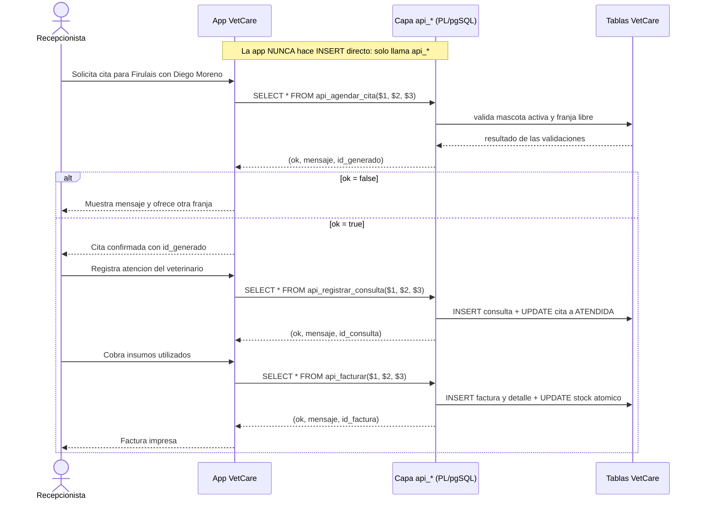

# Taller de la Clase 12 en ExamLab - configuracion

- **Curso:** Bases de Datos II (FI303215)
- **Taller:** Taller Clase 12 en ExamLab - Contrato de integracion app <-> BD y preparacion de la sustentacion
- **Preguntas:** 6 · **Total:** 100 puntos
- **Plataforma:** ExamLab (https://examlab.lovable.app/) · modulo Talleres
- **Hito del PI:** Contrato integracion + preparacion de entrega/sustentacion
- **Entregable de la clase:** Contrato app<->BD + outline de slides de sustentacion (5-8 min)

> ExamLab no importa preguntas desde archivo: el alta se hace en la UI del
> docente (o con la pestana de IA). Este documento trae el texto exacto de cada
> campo para copiar y pegar, incluidos el SQL de partida y el codigo base.

**Que produce el estudiante:** El estudiante publica la capa de API de VetCare (tres funciones con contrato de retorno uniforme), la consume desde codigo con parametros ligados, la blinda con privilegios de EXECUTE y prepara el guion de la sustentacion.

---

## Pregunta 1 - SQL sobre PostgreSQL real · 28 pts

**Tipo en la plataforma:** `bd_sql`

**Enunciado (campo Contenido):**

## 1. La capa de API de VetCare: tres operaciones con contrato uniforme

Regla de oro del PI: **la aplicacion nunca hace `INSERT`, `UPDATE` ni `DELETE` directo** sobre `cita`, `consulta` o `factura`. Solo invoca funciones publicadas por la base. Aqui construyes esa capa.

Esquema completo de VetCare creado y poblado. Recuerda: mascotas 3 (Rocky) y 8 (Kiara) estan **inactivas**; el veterinario 1 tiene cita el `2026-09-01 08:00:00`; las citas 2, 5, 7 y 10 ya tienen consulta; la cita 4 esta `CANCELADA`; el insumo 2 tiene stock 3.

Crea **tres funciones** que comparten el **mismo contrato de retorno**:

```sql
RETURNS TABLE (ok BOOLEAN, mensaje TEXT, id_generado INT)
```

Cada funcion debe **capturar sus propios errores** con un bloque `EXCEPTION WHEN OTHERS THEN RETURN QUERY SELECT FALSE, SQLERRM, NULL::INT;` para que la aplicacion **nunca** reciba una excepcion cruda, sino siempre una fila con `ok`, `mensaje` e `id_generado`.

1. **`api_agendar_cita(p_id_mascota INT, p_id_veterinario INT, p_fecha_hora TIMESTAMP)`**
   Valida: mascota existe, mascota activa, franja del veterinario libre (estado distinto de `'CANCELADA'`). Inserta la cita y devuelve `TRUE`, un mensaje de exito y el `id_cita` generado (usa `RETURNING id_cita INTO`).

2. **`api_registrar_consulta(p_id_cita INT, p_diagnostico TEXT, p_precio NUMERIC)`**
   Valida: cita existe, cita no `CANCELADA`, cita sin consulta previa, precio mayor que 0. Inserta la consulta, pasa la cita a `'ATENDIDA'` y devuelve el `id_consulta`.

3. **`api_facturar(p_id_consulta INT, p_id_insumo INT, p_cantidad INT)`** (una linea por llamada, para simplificar)
   Valida: consulta existe, cantidad mayor que 0 y stock suficiente usando `UPDATE insumo SET stock = stock - p_cantidad WHERE id_insumo = p_id_insumo AND stock >= p_cantidad` con `GET DIAGNOSTICS ... ROW_COUNT`. Crea la `factura`, su `detalle_factura` y devuelve el `id_factura`.

**Demuestra el contrato** ejecutando las seis llamadas siguientes, **todas con `SELECT`** (nunca deben lanzar error, siempre devuelven una fila):

```sql
SELECT * FROM api_agendar_cita(1, 2, TIMESTAMP '2026-10-01 09:00:00');   -- ok = true
SELECT * FROM api_agendar_cita(3, 2, TIMESTAMP '2026-10-01 10:00:00');   -- ok = false, inactiva
SELECT * FROM api_registrar_consulta(1, 'Vacunacion anual', 45000);      -- ok = true
SELECT * FROM api_registrar_consulta(4, 'Revision', 30000);              -- ok = false, cancelada
SELECT * FROM api_facturar(1, 6, 2);                                     -- ok = true
SELECT * FROM api_facturar(1, 2, 10);                                    -- ok = false, sin stock
```

**SQL de partida (`options.db.setupSql`)** - corre antes del SQL del
estudiante, sobre una base limpia. PostgreSQL, no Oracle:

```sql
CREATE TABLE dueno (
  id_dueno SERIAL PRIMARY KEY,
  nombre TEXT NOT NULL,
  telefono TEXT,
  email TEXT,
  ciudad TEXT DEFAULT 'Cali'
);

CREATE TABLE mascota (
  id_mascota SERIAL PRIMARY KEY,
  id_dueno INT NOT NULL REFERENCES dueno(id_dueno),
  nombre TEXT NOT NULL,
  especie TEXT NOT NULL,
  fecha_nac DATE,
  activa CHAR(1) NOT NULL DEFAULT 'S' CHECK (activa IN ('S','N'))
);

CREATE TABLE veterinario (
  id_veterinario SERIAL PRIMARY KEY,
  nombre TEXT NOT NULL,
  especialidad TEXT,
  activo CHAR(1) NOT NULL DEFAULT 'S' CHECK (activo IN ('S','N'))
);

CREATE TABLE cita (
  id_cita SERIAL PRIMARY KEY,
  id_mascota INT NOT NULL REFERENCES mascota(id_mascota),
  id_veterinario INT NOT NULL REFERENCES veterinario(id_veterinario),
  fecha_hora TIMESTAMP NOT NULL,
  estado TEXT NOT NULL DEFAULT 'PROGRAMADA'
    CHECK (estado IN ('PROGRAMADA','ATENDIDA','CANCELADA'))
);

CREATE TABLE consulta (
  id_consulta SERIAL PRIMARY KEY,
  id_cita INT NOT NULL UNIQUE REFERENCES cita(id_cita),
  diagnostico TEXT,
  precio NUMERIC(12,2) NOT NULL CHECK (precio >= 0)
);

CREATE TABLE insumo (
  id_insumo SERIAL PRIMARY KEY,
  nombre TEXT NOT NULL,
  stock INT NOT NULL CHECK (stock >= 0),
  precio_unit NUMERIC(12,2) NOT NULL
);

CREATE TABLE factura (
  id_factura SERIAL PRIMARY KEY,
  id_consulta INT NOT NULL REFERENCES consulta(id_consulta),
  fecha TIMESTAMP NOT NULL DEFAULT now(),
  total NUMERIC(12,2) NOT NULL DEFAULT 0
);

CREATE TABLE detalle_factura (
  id_detalle SERIAL PRIMARY KEY,
  id_factura INT NOT NULL REFERENCES factura(id_factura) ON DELETE CASCADE,
  id_insumo INT NOT NULL REFERENCES insumo(id_insumo),
  cantidad INT NOT NULL CHECK (cantidad > 0),
  precio_unit NUMERIC(12,2) NOT NULL
);

-- Duenos (ids 1..6 en este orden)
INSERT INTO dueno (nombre, telefono, email) VALUES
  ('Ana Gomez',      '3001112233', 'ana.gomez@mail.com'),
  ('Carlos Ruiz',    '3014445566', 'carlos.ruiz@mail.com'),
  ('Marcela Diaz',   '3027778899', 'marcela.diaz@mail.com'),
  ('Jorge Pineda',   '3105551212', 'jorge.pineda@mail.com'),
  ('Luisa Cardona',  '3123334455', 'luisa.cardona@mail.com'),
  ('Andres Vallejo', '3159998877', 'andres.vallejo@mail.com');

-- Veterinarios (ids 1..4)
INSERT INTO veterinario (nombre, especialidad) VALUES
  ('Laura Restrepo', 'General'),
  ('Diego Moreno',   'Cirugia'),
  ('Paula Salazar',  'Dermatologia'),
  ('Ivan Ortiz',     'General');

-- Mascotas (ids 1..8). Rocky (3) y Kiara (8) estan INACTIVAS.
INSERT INTO mascota (id_dueno, nombre, especie, fecha_nac, activa) VALUES
  (1, 'Firulais', 'Canino', DATE '2019-04-12', 'S'),
  (1, 'Luna',     'Felino', DATE '2021-08-30', 'S'),
  (2, 'Rocky',    'Canino', DATE '2015-01-20', 'N'),
  (3, 'Mishi',    'Felino', DATE '2022-11-05', 'S'),
  (3, 'Bobby',    'Canino', DATE '2018-06-17', 'S'),
  (4, 'Nube',     'Felino', DATE '2023-02-09', 'S'),
  (5, 'Toby',     'Canino', DATE '2020-09-25', 'S'),
  (6, 'Kiara',    'Canino', DATE '2013-03-03', 'N');

-- Citas (ids 1..10)
INSERT INTO cita (id_mascota, id_veterinario, fecha_hora, estado) VALUES
  (1, 1, TIMESTAMP '2026-09-01 08:00:00', 'PROGRAMADA'),
  (2, 1, TIMESTAMP '2026-09-01 09:00:00', 'ATENDIDA'),
  (4, 2, TIMESTAMP '2026-09-01 10:00:00', 'PROGRAMADA'),
  (5, 3, TIMESTAMP '2026-09-02 08:30:00', 'CANCELADA'),
  (6, 2, TIMESTAMP '2026-09-02 11:00:00', 'ATENDIDA'),
  (7, 4, TIMESTAMP '2026-09-03 07:45:00', 'PROGRAMADA'),
  (1, 1, TIMESTAMP '2026-09-05 15:00:00', 'ATENDIDA'),
  (2, 3, TIMESTAMP '2026-09-08 16:00:00', 'PROGRAMADA'),
  (4, 4, TIMESTAMP '2026-09-10 08:00:00', 'PROGRAMADA'),
  (6, 1, TIMESTAMP '2026-09-10 09:00:00', 'ATENDIDA');

-- Consultas (ids 1..4) sobre las citas ATENDIDAS 2, 5, 7 y 10
INSERT INTO consulta (id_cita, diagnostico, precio) VALUES
  (2,  'Vacunacion triple felina', 40000),
  (5,  'Control de peso',          38000),
  (7,  'Otitis externa',           55000),
  (10, 'Desparasitacion',          35000);

-- Insumos (ids 1..6). Ojo: 2 y 5 tienen stock bajo a proposito.
INSERT INTO insumo (nombre, stock, precio_unit) VALUES
  ('Vacuna antirrabica',       12, 22000),
  ('Vacuna triple felina',      3, 31000),
  ('Antiparasitario oral',     40,  9500),
  ('Suero fisiologico 500ml',  25,  7000),
  ('Gasa esteril',              8,  1200),
  ('Jeringa 5ml',              60,   900);

-- Facturas (ids 1..3) y sus detalles
INSERT INTO factura (id_consulta, fecha, total) VALUES
  (1, TIMESTAMP '2026-09-01 09:40:00', 71000),
  (2, TIMESTAMP '2026-09-02 11:35:00', 47000),
  (3, TIMESTAMP '2026-09-05 15:50:00', 60200);

INSERT INTO detalle_factura (id_factura, id_insumo, cantidad, precio_unit) VALUES
  (1, 2, 1, 31000),
  (1, 6, 1,   900),
  (1, 3, 1,  9500),
  (2, 3, 1,  9500),
  (2, 4, 1,  7000),
  (3, 1, 1, 22000),
  (3, 5, 4,  1200),
  (3, 6, 2,   900);
```

**Rubrica esperada (campo Rubrica):**

Las 3 funciones se crean con el contrato exacto RETURNS TABLE (ok BOOLEAN, mensaje TEXT, id_generado INT) y capturan sus errores para no propagar excepciones. Cada una aplica sus validaciones y devuelve el id generado con RETURNING en el caso exitoso. Las 6 llamadas devuelven fila sin lanzar error, con ok true/false segun corresponde y mensaje informativo. api_facturar usa el UPDATE condicional con GET DIAGNOSTICS ROW_COUNT.

---

## Pregunta 2 - Codigo ejecutable · 17 pts

**Tipo en la plataforma:** `codigo`

**Enunciado (campo Contenido):**

## 2. El cliente de la aplicacion: consumir la API con parametros ligados

Escribe el modulo de acceso a datos de la aplicacion de Huellitas en **Python** con `psycopg2`. No se ejecuta contra la base: se evalua el **codigo**, y sobre todo que respete el contrato y las buenas practicas.

Requisitos obligatorios:

1. Una funcion por operacion: `agendar_cita(conn, id_mascota, id_veterinario, fecha_hora)`, `registrar_consulta(conn, id_cita, diagnostico, precio)` y `facturar(conn, id_consulta, id_insumo, cantidad)`.
2. **Parametros ligados siempre**: `cur.execute("SELECT ok, mensaje, id_generado FROM api_agendar_cita(%s, %s, %s)", (id_mascota, id_veterinario, fecha_hora))`. **Prohibido** construir SQL concatenando cadenas o con f-strings: es la puerta de la inyeccion SQL.
3. Cada funcion lee la unica fila del resultado y **devuelve el contrato como un objeto propio de la aplicacion**: un `dataclass` `Resultado(ok: bool, mensaje: str, id_generado: int | None)`.
4. **Ningun `INSERT` directo** a `cita`, `consulta` o `factura` en todo el archivo.
5. Manejo de transaccion y de errores: `conn.commit()` cuando `ok` es verdadero, `conn.rollback()` cuando es falso o cuando `psycopg2` lanza una excepcion; usa `with conn.cursor() as cur:` y captura `psycopg2.Error`.
6. Una funcion `flujo_atencion(conn, id_mascota, id_veterinario, fecha_hora, diagnostico, precio, id_insumo, cantidad)` que orqueste el caso de uso completo (agendar -> registrar consulta -> facturar) y que **se detenga en el primer `ok = False`** devolviendo el mensaje al usuario, sin continuar los pasos siguientes.
7. Un `if __name__ == "__main__":` que muestre en consola un caso exitoso y un caso rechazado (mascota inactiva), imprimiendo el mensaje que le llegaria al usuario final.

**Lenguaje:** `python`

**Codigo de partida (starter):**

```python
"""Capa de acceso a datos de la app VetCare (Huellitas).
Regla del PI: la app NUNCA hace INSERT/UPDATE/DELETE directo sobre
cita, consulta ni factura. Solo invoca las funciones api_*.
"""
from dataclasses import dataclass

import psycopg2


@dataclass
class Resultado:
    ok: bool
    mensaje: str
    id_generado: int | None


def agendar_cita(conn, id_mascota: int, id_veterinario: int, fecha_hora) -> Resultado:
    # TODO: SELECT ok, mensaje, id_generado FROM api_agendar_cita(%s, %s, %s)
    #       parametros ligados, commit si ok, rollback si no
    ...


def registrar_consulta(conn, id_cita: int, diagnostico: str, precio) -> Resultado:
    ...


def facturar(conn, id_consulta: int, id_insumo: int, cantidad: int) -> Resultado:
    ...


def flujo_atencion(conn, id_mascota, id_veterinario, fecha_hora,
                   diagnostico, precio, id_insumo, cantidad) -> Resultado:
    # TODO: agendar -> registrar consulta -> facturar, cortando en el primer ok = False
    ...


if __name__ == "__main__":
    ...
```

**Rubrica esperada (campo Rubrica):**

Las 3 funciones existen con la firma pedida y usan exclusivamente parametros ligados con %s; no hay concatenacion ni f-strings en el SQL, ni INSERT directo a cita/consulta/factura. El dataclass Resultado traduce el contrato de la base. Hay commit/rollback segun ok y captura de psycopg2.Error. flujo_atencion corta en el primer ok = False y el bloque main muestra un caso exitoso y uno rechazado.

---

## Pregunta 3 - Diagrama (Mermaid) · 12 pts

**Tipo en la plataforma:** `diagrama`

**Enunciado (campo Contenido):**

## 3. Flujo app -> BD del caso de uso "atender una mascota"

Dibuja con `sequenceDiagram` de Mermaid el flujo completo del caso de uso, mostrando **quien llama a quien** y **que devuelve**. Participantes obligatorios: la recepcionista, la aplicacion, la capa de API de la base (las funciones `api_*`) y las tablas.

El diagrama debe mostrar, como minimo:

1. La recepcionista pide una cita y la aplicacion invoca `api_agendar_cita(...)` con **parametros ligados**.
2. La base responde con el contrato `(ok, mensaje, id_generado)`.
3. Una **rama de error**: cuando `ok = false` (mascota inactiva o franja ocupada), la aplicacion muestra el mensaje y **no** contina. Usa `alt` / `else` de Mermaid.
4. El camino feliz siguiendo con `api_registrar_consulta(...)` y `api_facturar(...)`, indicando que `api_facturar` descuenta stock de forma atomica.
5. Una nota (`Note over`) que deje escrita la regla del PI: la aplicacion no hace `INSERT` directo.

**Diagrama de referencia (Mermaid):**



**Rubrica esperada (campo Rubrica):**

El sequenceDiagram renderiza sin error e incluye los 4 participantes. Se ven las 3 invocaciones api_* con sus parametros y el retorno del contrato (ok, mensaje, id_generado). Existe un bloque alt/else que representa el corte cuando ok es falso. Aparece la nota con la regla de no hacer INSERT directo. Se descuenta si el diagrama muestra a la aplicacion escribiendo directamente en las tablas.

---

## Pregunta 4 - SQL sobre PostgreSQL real · 13 pts

**Tipo en la plataforma:** `bd_sql`

**Enunciado (campo Contenido):**

## 4. Blindar la API: la aplicacion solo puede EXECUTE

Esta base ya trae las tres funciones `api_agendar_cita`, `api_registrar_consulta` y `api_facturar` creadas, junto con el esquema y los datos.

Vas a aplicar privilegio minimo al usuario que usara la aplicacion. Escribe el SQL que:

1. Cree el rol `app_vetcare` con `NOLOGIN`.
2. **Cierre la puerta grande**: revoca de `app_vetcare` cualquier privilegio de escritura directa sobre las tablas de negocio:
   `REVOKE INSERT, UPDATE, DELETE ON cita, consulta, factura, detalle_factura, insumo FROM app_vetcare;`
   (Aunque sea redundante porque nunca se otorgo, la sentencia queda como evidencia explicita de la decision de diseno.)
3. **Punto clave que casi todos olvidan**: en PostgreSQL las funciones nuevas quedan con `EXECUTE` otorgado a `PUBLIC` por defecto. Revocalo para las tres funciones:
   `REVOKE EXECUTE ON FUNCTION api_agendar_cita(INT, INT, TIMESTAMP) FROM PUBLIC;` y lo equivalente para las otras dos, respetando su firma exacta (`api_registrar_consulta(INT, TEXT, NUMERIC)`, `api_facturar(INT, INT, INT)`).
4. Otorgue `EXECUTE` de las tres funciones **solo** a `app_vetcare`.
5. Otorgue a `app_vetcare` unicamente el `SELECT` que necesita para pintar pantallas: sobre `dueno`, `mascota`, `veterinario` y `cita`. Nada mas.
6. **Verifique** con dos consultas:
   - `SELECT grantee, routine_name, privilege_type FROM information_schema.routine_privileges WHERE routine_name LIKE 'api_%' ORDER BY routine_name, grantee;`
   - `SELECT grantee, table_name, privilege_type FROM information_schema.role_table_grants WHERE grantee = 'app_vetcare' ORDER BY table_name, privilege_type;`
7. Cierre con un comentario `--` de dos lineas explicando por que este esquema de permisos hace **imposible** que un error de la aplicacion salte las validaciones de negocio.

**SQL de partida (`options.db.setupSql`)** - corre antes del SQL del
estudiante, sobre una base limpia. PostgreSQL, no Oracle:

```sql
CREATE TABLE dueno (
  id_dueno SERIAL PRIMARY KEY,
  nombre TEXT NOT NULL,
  telefono TEXT,
  email TEXT,
  ciudad TEXT DEFAULT 'Cali'
);

CREATE TABLE mascota (
  id_mascota SERIAL PRIMARY KEY,
  id_dueno INT NOT NULL REFERENCES dueno(id_dueno),
  nombre TEXT NOT NULL,
  especie TEXT NOT NULL,
  fecha_nac DATE,
  activa CHAR(1) NOT NULL DEFAULT 'S' CHECK (activa IN ('S','N'))
);

CREATE TABLE veterinario (
  id_veterinario SERIAL PRIMARY KEY,
  nombre TEXT NOT NULL,
  especialidad TEXT,
  activo CHAR(1) NOT NULL DEFAULT 'S' CHECK (activo IN ('S','N'))
);

CREATE TABLE cita (
  id_cita SERIAL PRIMARY KEY,
  id_mascota INT NOT NULL REFERENCES mascota(id_mascota),
  id_veterinario INT NOT NULL REFERENCES veterinario(id_veterinario),
  fecha_hora TIMESTAMP NOT NULL,
  estado TEXT NOT NULL DEFAULT 'PROGRAMADA'
    CHECK (estado IN ('PROGRAMADA','ATENDIDA','CANCELADA'))
);

CREATE TABLE consulta (
  id_consulta SERIAL PRIMARY KEY,
  id_cita INT NOT NULL UNIQUE REFERENCES cita(id_cita),
  diagnostico TEXT,
  precio NUMERIC(12,2) NOT NULL CHECK (precio >= 0)
);

CREATE TABLE insumo (
  id_insumo SERIAL PRIMARY KEY,
  nombre TEXT NOT NULL,
  stock INT NOT NULL CHECK (stock >= 0),
  precio_unit NUMERIC(12,2) NOT NULL
);

CREATE TABLE factura (
  id_factura SERIAL PRIMARY KEY,
  id_consulta INT NOT NULL REFERENCES consulta(id_consulta),
  fecha TIMESTAMP NOT NULL DEFAULT now(),
  total NUMERIC(12,2) NOT NULL DEFAULT 0
);

CREATE TABLE detalle_factura (
  id_detalle SERIAL PRIMARY KEY,
  id_factura INT NOT NULL REFERENCES factura(id_factura) ON DELETE CASCADE,
  id_insumo INT NOT NULL REFERENCES insumo(id_insumo),
  cantidad INT NOT NULL CHECK (cantidad > 0),
  precio_unit NUMERIC(12,2) NOT NULL
);

-- Duenos (ids 1..6 en este orden)
INSERT INTO dueno (nombre, telefono, email) VALUES
  ('Ana Gomez',      '3001112233', 'ana.gomez@mail.com'),
  ('Carlos Ruiz',    '3014445566', 'carlos.ruiz@mail.com'),
  ('Marcela Diaz',   '3027778899', 'marcela.diaz@mail.com'),
  ('Jorge Pineda',   '3105551212', 'jorge.pineda@mail.com'),
  ('Luisa Cardona',  '3123334455', 'luisa.cardona@mail.com'),
  ('Andres Vallejo', '3159998877', 'andres.vallejo@mail.com');

-- Veterinarios (ids 1..4)
INSERT INTO veterinario (nombre, especialidad) VALUES
  ('Laura Restrepo', 'General'),
  ('Diego Moreno',   'Cirugia'),
  ('Paula Salazar',  'Dermatologia'),
  ('Ivan Ortiz',     'General');

-- Mascotas (ids 1..8). Rocky (3) y Kiara (8) estan INACTIVAS.
INSERT INTO mascota (id_dueno, nombre, especie, fecha_nac, activa) VALUES
  (1, 'Firulais', 'Canino', DATE '2019-04-12', 'S'),
  (1, 'Luna',     'Felino', DATE '2021-08-30', 'S'),
  (2, 'Rocky',    'Canino', DATE '2015-01-20', 'N'),
  (3, 'Mishi',    'Felino', DATE '2022-11-05', 'S'),
  (3, 'Bobby',    'Canino', DATE '2018-06-17', 'S'),
  (4, 'Nube',     'Felino', DATE '2023-02-09', 'S'),
  (5, 'Toby',     'Canino', DATE '2020-09-25', 'S'),
  (6, 'Kiara',    'Canino', DATE '2013-03-03', 'N');

-- Citas (ids 1..10)
INSERT INTO cita (id_mascota, id_veterinario, fecha_hora, estado) VALUES
  (1, 1, TIMESTAMP '2026-09-01 08:00:00', 'PROGRAMADA'),
  (2, 1, TIMESTAMP '2026-09-01 09:00:00', 'ATENDIDA'),
  (4, 2, TIMESTAMP '2026-09-01 10:00:00', 'PROGRAMADA'),
  (5, 3, TIMESTAMP '2026-09-02 08:30:00', 'CANCELADA'),
  (6, 2, TIMESTAMP '2026-09-02 11:00:00', 'ATENDIDA'),
  (7, 4, TIMESTAMP '2026-09-03 07:45:00', 'PROGRAMADA'),
  (1, 1, TIMESTAMP '2026-09-05 15:00:00', 'ATENDIDA'),
  (2, 3, TIMESTAMP '2026-09-08 16:00:00', 'PROGRAMADA'),
  (4, 4, TIMESTAMP '2026-09-10 08:00:00', 'PROGRAMADA'),
  (6, 1, TIMESTAMP '2026-09-10 09:00:00', 'ATENDIDA');

-- Consultas (ids 1..4) sobre las citas ATENDIDAS 2, 5, 7 y 10
INSERT INTO consulta (id_cita, diagnostico, precio) VALUES
  (2,  'Vacunacion triple felina', 40000),
  (5,  'Control de peso',          38000),
  (7,  'Otitis externa',           55000),
  (10, 'Desparasitacion',          35000);

-- Insumos (ids 1..6). Ojo: 2 y 5 tienen stock bajo a proposito.
INSERT INTO insumo (nombre, stock, precio_unit) VALUES
  ('Vacuna antirrabica',       12, 22000),
  ('Vacuna triple felina',      3, 31000),
  ('Antiparasitario oral',     40,  9500),
  ('Suero fisiologico 500ml',  25,  7000),
  ('Gasa esteril',              8,  1200),
  ('Jeringa 5ml',              60,   900);

-- Facturas (ids 1..3) y sus detalles
INSERT INTO factura (id_consulta, fecha, total) VALUES
  (1, TIMESTAMP '2026-09-01 09:40:00', 71000),
  (2, TIMESTAMP '2026-09-02 11:35:00', 47000),
  (3, TIMESTAMP '2026-09-05 15:50:00', 60200);

INSERT INTO detalle_factura (id_factura, id_insumo, cantidad, precio_unit) VALUES
  (1, 2, 1, 31000),
  (1, 6, 1,   900),
  (1, 3, 1,  9500),
  (2, 3, 1,  9500),
  (2, 4, 1,  7000),
  (3, 1, 1, 22000),
  (3, 5, 4,  1200),
  (3, 6, 2,   900);

CREATE FUNCTION api_agendar_cita(p_id_mascota INT, p_id_veterinario INT, p_fecha_hora TIMESTAMP)
RETURNS TABLE (ok BOOLEAN, mensaje TEXT, id_generado INT)
LANGUAGE plpgsql
AS $fn$
DECLARE
  v_activa CHAR(1);
  v_ocupado INT;
  v_id INT;
BEGIN
  SELECT activa INTO v_activa FROM mascota WHERE id_mascota = p_id_mascota;
  IF NOT FOUND THEN
    RETURN QUERY SELECT FALSE, 'La mascota no existe', NULL::INT;
    RETURN;
  END IF;
  IF v_activa <> 'S' THEN
    RETURN QUERY SELECT FALSE, 'La mascota esta inactiva', NULL::INT;
    RETURN;
  END IF;
  SELECT COUNT(*) INTO v_ocupado FROM cita
   WHERE id_veterinario = p_id_veterinario AND fecha_hora = p_fecha_hora AND estado <> 'CANCELADA';
  IF v_ocupado > 0 THEN
    RETURN QUERY SELECT FALSE, 'Franja ocupada', NULL::INT;
    RETURN;
  END IF;
  INSERT INTO cita (id_mascota, id_veterinario, fecha_hora, estado)
  VALUES (p_id_mascota, p_id_veterinario, p_fecha_hora, 'PROGRAMADA')
  RETURNING id_cita INTO v_id;
  RETURN QUERY SELECT TRUE, 'Cita agendada', v_id;
EXCEPTION WHEN OTHERS THEN
  RETURN QUERY SELECT FALSE, SQLERRM, NULL::INT;
END;
$fn$;

CREATE FUNCTION api_registrar_consulta(p_id_cita INT, p_diagnostico TEXT, p_precio NUMERIC)
RETURNS TABLE (ok BOOLEAN, mensaje TEXT, id_generado INT)
LANGUAGE plpgsql
AS $fn$
DECLARE
  v_estado TEXT;
  v_id INT;
BEGIN
  SELECT estado INTO v_estado FROM cita WHERE id_cita = p_id_cita;
  IF NOT FOUND THEN
    RETURN QUERY SELECT FALSE, 'La cita no existe', NULL::INT;
    RETURN;
  END IF;
  IF v_estado = 'CANCELADA' THEN
    RETURN QUERY SELECT FALSE, 'La cita esta cancelada', NULL::INT;
    RETURN;
  END IF;
  IF EXISTS (SELECT 1 FROM consulta WHERE id_cita = p_id_cita) THEN
    RETURN QUERY SELECT FALSE, 'La cita ya tiene consulta', NULL::INT;
    RETURN;
  END IF;
  IF p_precio IS NULL OR p_precio <= 0 THEN
    RETURN QUERY SELECT FALSE, 'Precio invalido', NULL::INT;
    RETURN;
  END IF;
  INSERT INTO consulta (id_cita, diagnostico, precio)
  VALUES (p_id_cita, p_diagnostico, p_precio)
  RETURNING id_consulta INTO v_id;
  UPDATE cita SET estado = 'ATENDIDA' WHERE id_cita = p_id_cita;
  RETURN QUERY SELECT TRUE, 'Consulta registrada', v_id;
EXCEPTION WHEN OTHERS THEN
  RETURN QUERY SELECT FALSE, SQLERRM, NULL::INT;
END;
$fn$;

CREATE FUNCTION api_facturar(p_id_consulta INT, p_id_insumo INT, p_cantidad INT)
RETURNS TABLE (ok BOOLEAN, mensaje TEXT, id_generado INT)
LANGUAGE plpgsql
AS $fn$
DECLARE
  v_precio NUMERIC(12,2);
  v_filas INT;
  v_id INT;
BEGIN
  IF NOT EXISTS (SELECT 1 FROM consulta WHERE id_consulta = p_id_consulta) THEN
    RETURN QUERY SELECT FALSE, 'La consulta no existe', NULL::INT;
    RETURN;
  END IF;
  IF p_cantidad IS NULL OR p_cantidad <= 0 THEN
    RETURN QUERY SELECT FALSE, 'Cantidad invalida', NULL::INT;
    RETURN;
  END IF;
  SELECT precio_unit INTO v_precio FROM insumo WHERE id_insumo = p_id_insumo;
  IF NOT FOUND THEN
    RETURN QUERY SELECT FALSE, 'El insumo no existe', NULL::INT;
    RETURN;
  END IF;
  UPDATE insumo SET stock = stock - p_cantidad
   WHERE id_insumo = p_id_insumo AND stock >= p_cantidad;
  GET DIAGNOSTICS v_filas = ROW_COUNT;
  IF v_filas = 0 THEN
    RETURN QUERY SELECT FALSE, 'Stock insuficiente', NULL::INT;
    RETURN;
  END IF;
  INSERT INTO factura (id_consulta, total) VALUES (p_id_consulta, v_precio * p_cantidad)
  RETURNING id_factura INTO v_id;
  INSERT INTO detalle_factura (id_factura, id_insumo, cantidad, precio_unit)
  VALUES (v_id, p_id_insumo, p_cantidad, v_precio);
  RETURN QUERY SELECT TRUE, 'Factura generada', v_id;
EXCEPTION WHEN OTHERS THEN
  RETURN QUERY SELECT FALSE, SQLERRM, NULL::INT;
END;
$fn$;
```

**Rubrica esperada (campo Rubrica):**

Se crea el rol app_vetcare y se ejecutan el REVOKE de escritura sobre las tablas, el REVOKE EXECUTE ... FROM PUBLIC de las tres funciones con su firma correcta y el GRANT EXECUTE solo a app_vetcare. Los SELECT otorgados se limitan a las 4 tablas de lectura pedidas. Las dos consultas de verificacion devuelven filas que evidencian la configuracion. El comentario final explica correctamente por que la app no puede saltar las validaciones.

---

## Pregunta 5 - Respuesta escrita · 18 pts

**Tipo en la plataforma:** `abierta`

**Enunciado (campo Contenido):**

## 5. Contrato de integracion app <-> BD (documento del entregable)

Redacta el **contrato de integracion** de VetCare DB, el documento que le entregarias a un equipo de desarrollo que nunca ha visto tu base. Una seccion por operacion, para las **tres** (`api_agendar_cita`, `api_registrar_consulta`, `api_facturar`), y cada seccion con:

1. **Proposito** en una frase de negocio.
2. **Firma exacta**: nombre, parametros en orden con tipo PostgreSQL, y forma de invocacion (`SELECT * FROM api_...(...)`).
3. **Contrato de retorno**: las tres columnas `ok`, `mensaje`, `id_generado`, con el significado de cada una y que valor trae `id_generado` cuando `ok` es falso.
4. **Precondiciones** que debe cumplir el llamador.
5. **Efectos en la base** si `ok` es verdadero: exactamente que filas se insertan o actualizan, en que tablas.
6. **Tabla de casos de rechazo**: cada `mensaje` posible, la causa y la **accion de la interfaz** (mostrar aviso, sugerir otra franja, deshabilitar el boton de cobrar, reintentar).
7. **Idempotencia y reintentos**: que pasa si la aplicacion, por un timeout de red, vuelve a llamar la misma operacion. Di honestamente si tu API es segura ante reintentos y, si no lo es, que le agregarias (por ejemplo una clave de idempotencia o una restriccion unica que absorba el duplicado).

Cierra con dos reglas del contrato, escritas para que un desarrollador las cumpla sin discutir:

- **Regla de acceso**: la aplicacion solo tiene `EXECUTE` de las funciones `api_*` y `SELECT` de lectura; no tiene `INSERT`/`UPDATE`/`DELETE` sobre las tablas de negocio.
- **Regla de parametros**: todo valor que venga del usuario viaja como **parametro ligado**; nunca concatenado en la cadena SQL.

**Rubrica esperada (campo Rubrica):**

Las 3 operaciones estan documentadas con los 7 puntos. Las firmas coinciden exactamente con las funciones implementadas en la pregunta 1. La tabla de rechazos cubre todos los mensajes que devuelve el codigo, cada uno con su accion de interfaz. La seccion de idempotencia da un veredicto honesto y una propuesta concreta si la API no es segura ante reintentos. Las dos reglas de cierre aparecen redactadas de forma imperativa.

---

## Pregunta 6 - Respuesta escrita · 12 pts

**Tipo en la plataforma:** `abierta`

**Enunciado (campo Contenido):**

## 6. Guion de la sustentacion (5 a 8 minutos)

Prepara el **outline de la sustentacion final** de VetCare DB. Entrega:

1. **Storyboard de 6 diapositivas**, una fila por diapositiva:

| # | Titulo de la diapositiva | Que se muestra en pantalla | Quien habla | Minutos |
|---|---|---|---|---|

Cubre obligatoriamente: (1) problema y alcance de Huellitas, (2) modelo ER, (3) reglas de negocio y como las hace cumplir la base, (4) demo en vivo de una operacion `api_*` con su caso de rechazo, (5) rendimiento (antes/despues e indices con evidencia de `EXPLAIN`), (6) seguridad, respaldo y cierre con lecciones aprendidas. La suma de minutos debe quedar entre **5 y 8**.

2. **Guion de la demo en vivo**, paso a paso: las **sentencias exactas** que vas a ejecutar y en que orden, incluyendo **un caso que falla a proposito** (agendar la mascota inactiva o facturar sin stock). Indica el resultado que espera el publico ver en cada paso.

3. **Plan B de la demo**: que haces si la base no carga o una sentencia falla en vivo (capturas de pantalla preparadas, script alterno, video corto).

4. **Tres preguntas dificiles** que crees que hara el jurado, con tu respuesta en 2 o 3 lineas cada una. Al menos una debe ser sobre concurrencia o sobre respaldo.

5. **Checklist de empaquetado** del entregable: que archivos van en el ZIP, en que orden se ejecutan los scripts y como se llama cada uno.

**Rubrica esperada (campo Rubrica):**

El storyboard tiene 6 filas con contenido, responsable nombrado y minutos que suman entre 5 y 8. El guion de la demo lista sentencias concretas en orden e incluye al menos un caso de fallo intencional con el resultado esperado. Hay plan B especifico y 3 preguntas del jurado con respuesta, al menos una de concurrencia o respaldo. El checklist de empaquetado nombra archivos y su orden de ejecucion.

---

## Al terminar de crearlo

- Verifique que la suma de puntos sea la esperada: **100**.
- Publique el taller y confirme la fecha limite (domingo 23:59 segun el Acuerdo).
- Las preguntas con SQL o codigo: ejecutelas una vez usted mismo antes de publicar,
  para confirmar que el SQL de partida corre y que el starter compila.
