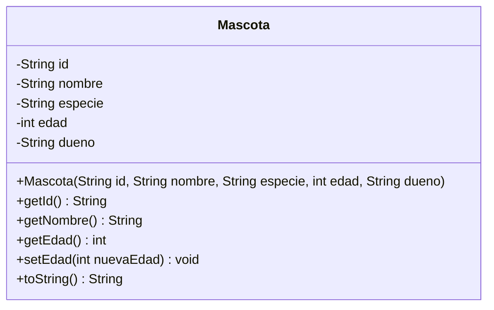

# Taller de la Clase 1 en ExamLab - configuracion

- **Curso:** Programacion II (FI303204)
- **Taller:** Taller Clase 1 en ExamLab - POO: la primera clase del dominio VetCare
- **Preguntas:** 5 · **Total:** 100 puntos
- **Plataforma:** ExamLab (https://examlab.lovable.app/) · modulo Talleres
- **Hito del PI:** Entorno de desarrollo listo y la primera clase del dominio VetCare escrita
- **Entregable de la clase:** Proyecto NetBeans con la clase Mascota (atributos privados, constructor y toString) y un main que crea dos objetos distintos

> ExamLab no importa preguntas desde archivo: el alta se hace en la UI del
> docente (o con la pestana de IA). Este documento trae el texto exacto de cada
> campo para copiar y pegar, incluidos el SQL de partida y el codigo base.

**Que produce el estudiante:** El estudiante deja el entorno Java funcionando y entrega la clase Mascota (atributos privados, constructor, getters, toString y un setter validado) instanciada dos veces desde un main.

---

## Pregunta 1 - Codigo ejecutable · 35 pts

**Tipo en la plataforma:** `codigo`

**Enunciado (campo Contenido):**

## Molde y objetos: la clase `Mascota` de VetCare

La clinica veterinaria **«Huellitas»** necesita la primera clase de su sistema **VetCare**. Escriba la clase `Mascota` como el *molde* del que saldran todas las fichas de la clinica.

**Requisitos de la clase `Mascota`:**
1. Cinco atributos **privados**: `id` (String), `nombre` (String), `especie` (String), `edad` (int), `dueno` (String).
2. Un **constructor** que reciba los cinco valores y los asigne usando `this.`
3. Al menos los getters `getId()`, `getNombre()` y `getEdad()`.
4. `toString()` sobreescrito con `@Override` para que la ficha se lea en palabras.

**En el `main` cree DOS objetos distintos** con estas fichas reales del escenario:

| ID | Nombre | Especie | Edad | Dueno |
|----|--------|---------|------|-------|
| M-001 | Firulais | canino | 4 | Ana Gomez |
| M-003 | Rocky | canino | 9 | Luisa Perez |

**Al ejecutar debe imprimir exactamente estas dos lineas:**

```
Mascota M-001 -> Firulais (canino, 4 anios), dueno: Ana Gomez
Mascota M-003 -> Rocky (canino, 9 anios), dueno: Luisa Perez
```

> Escribimos `anios` y `dueno` sin tilde ni ene a proposito: asi la salida de consola es identica en cualquier maquina y se puede comparar caracter por caracter.

> En NetBeans usted tendra `Mascota.java` y la clase de arranque en archivos separados dentro del paquete `vetcare`. En ExamLab todo va en un solo archivo: la clase publica `Main` con el `main` y debajo `Mascota` sin `public`.

**Lenguaje:** `java`

**Codigo de partida (starter):**

```java
public class Main {

    public static void main(String[] args) {
        // TODO: cree DOS objetos Mascota con datos distintos usando las fichas
        //       M-001 Firulais y M-003 Rocky del escenario de la clinica.
        // TODO: imprima cada uno con System.out.println(...)
    }
}

// En NetBeans esta clase va en su propio archivo Mascota.java, dentro del paquete vetcare.
// En ExamLab la dejamos en el mismo archivo, sin la palabra public.
class Mascota {

    // TODO: declare los cinco atributos PRIVADOS: id, nombre, especie, edad, dueno

    // TODO: escriba el constructor
    //       Mascota(String id, String nombre, String especie, int edad, String dueno)
    //       y asigne cada parametro al atributo usando this.

    // TODO: escriba los getters getId(), getNombre() y getEdad()

    // TODO: sobreescriba toString() con @Override para devolver exactamente el formato
    //       "Mascota M-001 -> Firulais (canino, 4 anios), dueno: Ana Gomez"
}
```

**Rubrica esperada (campo Rubrica):**

Los cinco atributos son private y el constructor los inicializa todos con this. Existen los getters pedidos y toString() esta sobreescrito con @Override. El main crea DOS objetos distintos de la misma clase y la salida coincide caracter por caracter con las dos lineas pedidas (nunca algo como vetcare.Mascota@6d06d69c).

---

## Pregunta 2 - Codigo ejecutable · 20 pts

**Tipo en la plataforma:** `codigo`

**Enunciado (campo Contenido):**

## Un setter que defiende los datos de la clinica

En la clinica alguien va a escribir una edad negativa. Un atributo `private` no sirve de nada si el setter deja pasar cualquier valor: el setter es el **guardian** del objeto.

Complete `setEdad(int nuevaEdad)` en la clase `Mascota` con esta regla:
- Si `nuevaEdad` es **menor que 0** o **mayor que 30**, imprima el rechazo y **no cambie** el atributo.
- Si es valida, asigne el nuevo valor e imprima la confirmacion.

El `main` ya esta escrito: crea a Rocky (M-003, canino, 9 anios, dueno Luisa Perez), intenta ponerle edad `-2` y luego edad `10`.

**Al ejecutar debe imprimir exactamente:**

```
Edad rechazada: -2 no es una edad valida para Rocky
Edad tras el intento invalido: 9
Edad actualizada: Rocky ahora tiene 10 anios
Edad tras el intento valido: 10
```

Fijese en la segunda linea: despues del intento invalido la edad sigue siendo **9**. Eso es la prueba de que el setter protegio al objeto.

**Lenguaje:** `java`

**Codigo de partida (starter):**

```java
public class Main {

    public static void main(String[] args) {
        Mascota rocky = new Mascota("M-003", "Rocky", "canino", 9, "Luisa Perez");

        rocky.setEdad(-2);
        System.out.println("Edad tras el intento invalido: " + rocky.getEdad());

        rocky.setEdad(10);
        System.out.println("Edad tras el intento valido: " + rocky.getEdad());
    }
}

class Mascota {

    private String id;
    private String nombre;
    private String especie;
    private int edad;
    private String dueno;

    public Mascota(String id, String nombre, String especie, int edad, String dueno) {
        this.id = id;
        this.nombre = nombre;
        this.especie = especie;
        this.edad = edad;
        this.dueno = dueno;
    }

    public String getNombre() {
        return nombre;
    }

    public int getEdad() {
        return edad;
    }

    public void setEdad(int nuevaEdad) {
        // TODO: si nuevaEdad es menor que 0 o mayor que 30, imprima
        //       "Edad rechazada: -2 no es una edad valida para Rocky"
        //       y NO modifique el atributo.
        // TODO: si es valida, asigne this.edad = nuevaEdad e imprima
        //       "Edad actualizada: Rocky ahora tiene 10 anios"
    }

    @Override
    public String toString() {
        return "Mascota " + id + " -> " + nombre + " (" + especie + ", " + edad
                + " anios), dueno: " + dueno;
    }
}
```

**Rubrica esperada (campo Rubrica):**

setEdad valida el rango 0 a 30 antes de asignar. Tras el intento con -2 el atributo conserva el valor 9 (no se asigna nada) y tras el intento con 10 el valor cambia. Las cuatro lineas de salida coinciden exactamente con las pedidas.

---

## Pregunta 3 - Seleccion unica · 10 pts

**Tipo en la plataforma:** `cerrada`

**Enunciado (campo Contenido):**

## La linea fea que todos ven la primera vez

Un compañero ejecuta su proyecto VetCare y en la consola de NetBeans aparece:

```
vetcare.Mascota@6d06d69c
```

Su clase `Mascota` tiene los atributos privados, el constructor completo y los getters. El objeto fue creado sin errores.

**¿Cual es la causa exacta de esa salida?**

**Opciones:**

- [ ] El objeto quedo en null y Java imprime su direccion de memoria en lugar de los datos.
- [x] La clase no sobreescribio toString(), asi que se ejecuta la version heredada de Object, que imprime el nombre completo de la clase y un codigo hash.
- [ ] Los atributos son private y por eso Java oculta sus valores al imprimir el objeto.
- [ ] Falta declarar la clase como public; las clases sin public no se pueden imprimir.

**Rubrica esperada (campo Rubrica):**

Respuesta correcta: la clase no sobreescribio toString(), asi que se usa la version heredada de Object, que imprime nombre de clase y hash. Se acierta o no; no hay puntaje parcial.

---

## Pregunta 4 - Diagrama (Mermaid) · 15 pts

**Tipo en la plataforma:** `diagrama`

**Enunciado (campo Contenido):**

## El molde en un diagrama de clases

Dibuje en **Mermaid** el diagrama de clases (`classDiagram`) de la clase `Mascota` que acaba de escribir. Debe incluir:

- Los **cinco atributos** con visibilidad privada (`-`) y su tipo: `id`, `nombre`, `especie`, `edad`, `dueno`.
- El **constructor** y los metodos publicos (`+`): los getters, `setEdad(int)` y `toString()`.

Use la sintaxis de Mermaid para diagrama de clases, por ejemplo:

```
classDiagram
    class Mascota {
        -String id
        +getId() String
    }
```

Este diagrama es la primera pagina de la documentacion de VetCare: en las siguientes clases le iremos agregando `RegistroMascotas`, `Cita` y los servicios.

**Diagrama de referencia (Mermaid):**



**Rubrica esperada (campo Rubrica):**

El diagrama es un classDiagram valido de Mermaid que renderiza. Aparecen los cinco atributos con visibilidad privada y su tipo, el constructor y los metodos publicos con tipo de retorno. Los nombres coinciden con el codigo entregado en la pregunta 1.

---

## Pregunta 5 - Respuesta escrita · 20 pts

**Tipo en la plataforma:** `abierta`

**Enunciado (campo Contenido):**

## Reporte de entorno y justificacion

Responda las tres partes. Sea breve y concreto.

**(a) Entorno funcionando (obligatorio).** Escriba:
- La version del JDK que le devuelve `java -version` en la terminal.
- La version de Apache NetBeans que instalo.
- El nombre del proyecto y del paquete que creo (debe ser proyecto `VetCare`, paquete `vetcare`) y la ruta donde quedo en su disco.

**(b) Clase y objeto.** Explique con las fichas M-001 Firulais y M-003 Rocky la diferencia entre la **clase** `Mascota` y un **objeto** `Mascota`. Use la palabra *molde* y diga cuantos moldes y cuantos objetos hay en su programa.

**(c) Encapsulamiento.** Si los atributos fueran `public`, cualquier parte del programa podria escribir `firulais.edad = -7;`. Explique que se pierde exactamente al hacer publicos los atributos y como lo evita el setter validado que escribio en la pregunta 2.

**Rubrica esperada (campo Rubrica):**

(a) Reporta version de JDK, version de NetBeans y nombre de proyecto/paquete concretos, no genericos. (b) Distingue clase de objeto con las fichas del escenario e identifica un molde y dos objetos. (c) Explica que con atributos publicos se pierde el control de las reglas del dominio y conecta esa perdida con el setter validado de la pregunta 2.

---

## Al terminar de crearlo

- Verifique que la suma de puntos sea la esperada: **100**.
- Publique el taller y confirme la fecha limite (domingo 23:59 segun el Acuerdo).
- Las preguntas con SQL o codigo: ejecutelas una vez usted mismo antes de publicar,
  para confirmar que el SQL de partida corre y que el starter compila.
