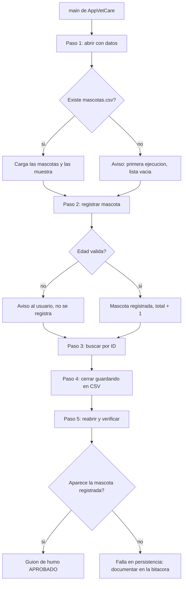

# Taller de la Clase 12 en ExamLab - configuracion

- **Curso:** Programacion II (FI303204)
- **Taller:** Taller Clase 12 en ExamLab - Integracion de modulos y guion de humo
- **Preguntas:** 5 · **Total:** 100 puntos
- **Plataforma:** ExamLab (https://uniaj.examlab.workers.dev/) · modulo Talleres
- **Hito del PI:** VetCare arranca, carga el archivo, registra, busca por ID, lista y guarda al cerrar: el flujo completo del PI corre sin tocar código.
- **Entregable de la clase:** El proyecto VetCare ejecutable (carpeta del proyecto o JAR) más la bitácora de integración con tres defectos hallados con el debugger, cada uno con síntoma, causa, corrección y evidencia, subidos a ExamLab.

> ExamLab no importa preguntas desde archivo: el alta se hace en la UI del
> docente (o con la pestana de IA). Este documento trae el texto exacto de cada
> campo para copiar y pegar, incluidos el SQL de partida y el codigo base.

**Que produce el estudiante:** El estudiante deja VetCare arrancando desde un unico main con las capas separadas y una sola instancia de servicio y repositorio, corre el guion de humo de cinco pasos y documenta tres defectos hallados con el debugger.

---

## Pregunta 1 - Codigo ejecutable · 30 pts

**Tipo en la plataforma:** `codigo`

**Enunciado (campo Contenido):**

## Un solo `main`, una sola instancia, cinco pasos

Hasta ahora cada taller dejo su propio `main` y su propio repositorio. Hoy VetCare arranca de **un solo punto** y todo lo demas recibe lo que necesita **por constructor**.

El starter ya trae las cuatro capas listas y correctas: `Mascota` (modelo), `RepositorioMascotas` (datos, con el archivo simulado en memoria para este ejercicio), `ServicioMascotas` (logica) y `VentanaPrincipal` (ui, que **recibe** el servicio y nunca lo crea).

Escriba el `main` de `AppVetCare` con el **guion de humo de cinco pasos**:

1. Cree **una sola vez** el repositorio y el servicio, e inyecte el repositorio al servicio por constructor. Pase el **mismo** servicio a la ventana.
2. **Paso 1 - abrir con datos:** `ventana.abrir()`, que carga y muestra el listado (M-001 Firulais, M-002 Michi, M-003 Rocky).
3. **Paso 2 - registrar:** `ventana.clicRegistrar("M-007", "Luna", "felino", "2")`.
4. **Paso 3 - buscar:** `ventana.clicBuscar("M-003")`.
5. **Paso 4 - cerrar guardando:** `ventana.cerrar()`.
6. **Paso 5 - reabrir:** cree una `VentanaPrincipal` **nueva** sobre el **mismo** servicio y llame a `abrir()`: Luna debe seguir ahi.
7. Al final imprima la evidencia de instancia unica comparando `idServicio()` de las dos ventanas.

**Al ejecutar debe imprimir exactamente:**

```
=== Guion de humo de VetCare ===
[datos] cargadas 3 mascotas del archivo
Mascotas en pantalla (3):
  - M-001 - Firulais (canino, 4 anios)
  - M-002 - Michi (felino, 2 anios)
  - M-003 - Rocky (canino, 9 anios)
Registrada M-007 Luna. Total: 4
Encontrada: M-003 - Rocky (canino, 9 anios)
[datos] guardadas 4 mascotas en el archivo
Ventana cerrada
[datos] cargadas 4 mascotas del archivo
Mascotas en pantalla (4):
  - M-001 - Firulais (?, 0 anios)
  - M-002 - Michi (?, 0 anios)
  - M-003 - Rocky (?, 0 anios)
  - M-007 - Luna (?, 0 anios)
El servicio es el mismo objeto en los dos momentos: true
```

Dos cosas para mirar con atencion:
- Luna **sobrevivio** al cierre: eso es el paso 5 del guion de humo.
- Las mascotas reaparecen con `?` y `0 anios`. Eso **no** lo debe arreglar aqui: es exactamente el tipo de defecto que va a documentar en la bitacora (el `guardar` del repositorio esta perdiendo campos). Anotelo.

**Lenguaje:** `java`

**Codigo de partida (starter):**

```java
import java.util.ArrayList;
import java.util.List;

public class AppVetCare {

    // UNICO main de todo el proyecto VetCare.
    public static void main(String[] args) {
        System.out.println("=== Guion de humo de VetCare ===");

        // TODO 1: cree AQUI, una sola vez, el repositorio y el servicio,
        //         y pase el repositorio al servicio por CONSTRUCTOR.
        RepositorioMascotas repositorio = null;
        ServicioMascotas servicio = null;

        // TODO 2: pase el MISMO servicio a la "ventana" por constructor
        //         (aqui la ventana es una clase de consola que simula la interfaz).
        VentanaPrincipal ventana = null;

        // TODO 3: PASO 1 - abrir con datos: cargue el archivo simulado y muestre el listado
        // TODO 4: PASO 2 - registrar M-007 Luna felino 2 desde la ventana
        // TODO 5: PASO 3 - buscar por ID M-003 desde la ventana
        // TODO 6: PASO 4 - cerrar guardando
        // TODO 7: PASO 5 - reabrir: cree una ventana NUEVA sobre el MISMO servicio,
        //         cargue y verifique que Luna sigue ahi
        // TODO 8: imprima la evidencia de instancia unica comparando
        //         System.identityHashCode(servicio) en el paso 2 y en el paso 5
    }
}

class Mascota {

    private final String id;
    private final String nombre;
    private final String especie;
    private final int edad;

    public Mascota(String id, String nombre, String especie, int edad) {
        this.id = id;
        this.nombre = nombre;
        this.especie = especie;
        this.edad = edad;
    }

    public String getId() {
        return id;
    }

    public String getNombre() {
        return nombre;
    }

    @Override
    public String toString() {
        return id + " - " + nombre + " (" + especie + ", " + edad + " anios)";
    }
}

// Capa vetcare.datos: simula el archivo mascotas.csv en memoria para este ejercicio.
class RepositorioMascotas {

    private final List<String> archivoSimulado = new ArrayList<>();
    private final List<Mascota> enMemoria = new ArrayList<>();

    public RepositorioMascotas() {
        archivoSimulado.add("M-001;Firulais;canino;4");
        archivoSimulado.add("M-002;Michi;felino;2");
        archivoSimulado.add("M-003;Rocky;canino;9");
    }

    public List<Mascota> cargar() {
        enMemoria.clear();
        for (String linea : archivoSimulado) {
            String[] p = linea.split(";");
            enMemoria.add(new Mascota(p[0], p[1], p[2], Integer.parseInt(p[3])));
        }
        System.out.println("[datos] cargadas " + enMemoria.size() + " mascotas del archivo");
        return new ArrayList<>(enMemoria);
    }

    public void guardar(List<Mascota> mascotas) {
        archivoSimulado.clear();
        for (Mascota m : mascotas) {
            archivoSimulado.add(m.getId() + ";" + m.getNombre() + ";?;0");
        }
        System.out.println("[datos] guardadas " + archivoSimulado.size() + " mascotas en el archivo");
    }
}

// Capa vetcare.logica
class ServicioMascotas {

    private final RepositorioMascotas repositorio;
    private final List<Mascota> mascotas = new ArrayList<>();

    public ServicioMascotas(RepositorioMascotas repositorio) {
        this.repositorio = repositorio;
    }

    public void cargar() {
        mascotas.clear();
        mascotas.addAll(repositorio.cargar());
    }

    public void registrar(String id, String nombre, String especie, String edadTexto) {
        if (nombre == null || nombre.trim().isEmpty()) {
            throw new IllegalArgumentException("El nombre es obligatorio");
        }
        int edad;
        try {
            edad = Integer.parseInt(edadTexto.trim());
        } catch (NumberFormatException ex) {
            throw new IllegalArgumentException("La edad debe ser un numero entero, se recibio '" + edadTexto + "'");
        }
        for (Mascota m : mascotas) {
            if (m.getId().equals(id)) {
                throw new IllegalArgumentException("Ya existe una mascota con el ID " + id);
            }
        }
        mascotas.add(new Mascota(id, nombre.trim(), especie, edad));
    }

    public Mascota buscar(String id) {
        for (Mascota m : mascotas) {
            if (m.getId().equals(id)) {
                return m;
            }
        }
        return null;
    }

    public String listado() {
        StringBuilder sb = new StringBuilder("Mascotas en pantalla (" + mascotas.size() + "):");
        for (Mascota m : mascotas) {
            sb.append("\n  - ").append(m);
        }
        return sb.toString();
    }

    public void guardarTodo() {
        repositorio.guardar(mascotas);
    }

    public int total() {
        return mascotas.size();
    }
}

// Capa vetcare.ui: recibe el servicio, NUNCA lo crea.
class VentanaPrincipal {

    private final ServicioMascotas servicio;

    public VentanaPrincipal(ServicioMascotas servicio) {
        this.servicio = servicio;
    }

    public void abrir() {
        servicio.cargar();
        System.out.println(servicio.listado());
    }

    public void clicRegistrar(String id, String nombre, String especie, String edadTexto) {
        try {
            servicio.registrar(id, nombre, especie, edadTexto);
            System.out.println("Registrada " + id + " " + nombre + ". Total: " + servicio.total());
        } catch (IllegalArgumentException ex) {
            System.out.println("Aviso al usuario: " + ex.getMessage());
        }
    }

    public void clicBuscar(String id) {
        Mascota m = servicio.buscar(id);
        System.out.println(m == null ? "No existe ninguna mascota con el ID " + id : "Encontrada: " + m);
    }

    public void cerrar() {
        servicio.guardarTodo();
        System.out.println("Ventana cerrada");
    }

    public int idServicio() {
        return System.identityHashCode(servicio);
    }
}
```

**Rubrica esperada (campo Rubrica):**

El main es el unico punto de arranque: crea repositorio y servicio una sola vez e inyecta por constructor, sin usar new dentro de las capas. Los cinco pasos del guion se ejecutan en orden y la mascota registrada aparece al reabrir. La comparacion de identityHashCode imprime true. La salida coincide linea por linea, incluida la evidencia del defecto de campos perdidos.

---

## Pregunta 2 - Codigo ejecutable · 20 pts

**Tipo en la plataforma:** `codigo`

**Enunciado (campo Contenido):**

## El defecto que encontro el debugger: la edad vacia entra como 0

Con un breakpoint en el boton Registrar se vio esto en la ventana **Variables**: el usuario dejo el campo edad **vacio**, `Integer.parseInt` lanzo `NumberFormatException`, el `catch` la ignoro y la mascota entro al sistema con **edad 0** como si el dato hubiera sido valido. El dato se corrompio en la **frontera** entre la interfaz y el servicio.

El starter tiene el defecto tal cual. Corrija `registrarDesdeFormulario` en `ControladorRegistro`:

1. Si `edadTexto` es `null` o queda vacio tras `trim()`: avise `Aviso al usuario: la edad es obligatoria` y **no** llame al servicio.
2. Si el texto no es numerico: avise `Aviso al usuario: la edad debe ser un numero entero, se recibio 'abc'` y **no** llame al servicio.
3. Solo con dato valido: registre e imprima la confirmacion.

Borre el `int edad = 0;` que arrastra el valor por defecto: la variable no debe existir hasta que haya un dato bueno.

El `main` prueba tres entradas: campo vacio `""`, campo con espacios `"   "` y `"5"`.

**Al ejecutar debe imprimir exactamente:**

```
Aviso al usuario: la edad es obligatoria
Aviso al usuario: la edad es obligatoria
Registrada M-012 Duna con edad 5
Mascotas guardadas (1):
  - M-012 - Duna (canino, 5 anios)
```

La ultima linea es la correccion demostrada: de tres intentos, **solo uno** llego al servicio. Antes del arreglo habrian entrado tres, dos de ellas con edad 0.

**Lenguaje:** `java`

**Codigo de partida (starter):**

```java
import java.util.ArrayList;
import java.util.List;

public class AppVetCare {

    public static void main(String[] args) {
        ServicioMascotas servicio = new ServicioMascotas();
        ControladorRegistro controlador = new ControladorRegistro(servicio);

        // El usuario dejo el campo edad VACIO y oprimio Registrar.
        controlador.registrarDesdeFormulario("M-010", "Nube", "felino", "");

        // El usuario escribio espacios en el campo edad.
        controlador.registrarDesdeFormulario("M-011", "Copo", "felino", "   ");

        // Registro correcto.
        controlador.registrarDesdeFormulario("M-012", "Duna", "canino", "5");

        servicio.imprimirTodo();
    }
}

class ServicioMascotas {

    private final List<String> mascotas = new ArrayList<>();

    public void registrar(String id, String nombre, String especie, int edad) {
        mascotas.add(id + " - " + nombre + " (" + especie + ", " + edad + " anios)");
    }

    public void imprimirTodo() {
        System.out.println("Mascotas guardadas (" + mascotas.size() + "):");
        for (String m : mascotas) {
            System.out.println("  - " + m);
        }
    }
}

class ControladorRegistro {

    private final ServicioMascotas servicio;

    public ControladorRegistro(ServicioMascotas servicio) {
        this.servicio = servicio;
    }

    public void registrarDesdeFormulario(String id, String nombre, String especie, String edadTexto) {
        // AQUI ESTA EL DEFECTO QUE ENCONTRO EL DEBUGGER:
        // con el campo vacio, parseInt lanza NumberFormatException, el catch la ignora
        // y la mascota entra al sistema con edad 0 como si el dato fuera valido.
        int edad = 0;
        try {
            edad = Integer.parseInt(edadTexto.trim());
        } catch (NumberFormatException ex) {
            // se ignora y sigue con edad = 0
        }
        servicio.registrar(id, nombre, especie, edad);

        // TODO 1: valide en la FRONTERA. Si edadTexto es null o queda vacio tras trim(),
        //         avise "Aviso al usuario: la edad es obligatoria" y NO llame al servicio.
        // TODO 2: si el texto no es numerico, avise
        //         "Aviso al usuario: la edad debe ser un numero entero, se recibio 'abc'"
        //         y NO llame al servicio (nunca convierta el error en un 0 silencioso).
        // TODO 3: cuando el dato es valido, registre e imprima
        //         "Registrada M-012 Duna con edad 5"
    }
}
```

**Rubrica esperada (campo Rubrica):**

El valor por defecto 0 desaparecio y el catch ya no ignora el error. Los dos casos invalidos (vacio y espacios) producen aviso y no llaman al servicio; solo el valido registra. La coleccion queda con una sola mascota y la salida coincide exactamente con la pedida.

---

## Pregunta 3 - Proyecto en ZIP · 25 pts

**Tipo en la plataforma:** `codigo_zip`

**Enunciado (campo Contenido):**

## Entrega: el proyecto VetCare integrado

Suba el **ZIP del proyecto NetBeans `VetCare`** (o el JAR mas el codigo fuente) con la integracion terminada:

**Estructura obligatoria de paquetes:**
- `vetcare.modelo` — `Mascota`, `Dueno`, `Cita`
- `vetcare.datos` — `RepositorioMascotasCSV` (guardar y cargar de la Clase 9)
- `vetcare.logica` — el servicio con las reglas y validaciones
- `vetcare.ui` — la ventana Swing de registro y listado

**Requisitos verificables:**
1. **Un unico `main`** en toda la aplicacion. Elimine los `main` sobrantes de los talleres anteriores (busque `void main` con Ctrl+F y reporte cuantos borro en la bitacora).
2. Repositorio y servicio se crean en el `main` y se **inyectan por constructor** a la ventana.
3. El **guion de humo de cinco pasos** corre de corrido **sin tocar codigo**: abrir con datos, registrar, buscar por ID, cerrar guardando, reabrir y verificar.
4. Ningun `catch` vacio: validacion en el servicio, mensaje al usuario en la interfaz.
5. Incluya en el ZIP: el `mascotas.csv` generado, `captura_paso1.png` (tabla con datos al abrir) y `captura_paso5.png` (la mascota registrada sobreviviendo al reinicio).

**Prueba de aceptacion:** el docente abre el proyecto, oprime Run una sola vez y completa los cinco pasos sin editar nada.

**Lenguaje:** `java`

**Rubrica esperada (campo Rubrica):**

El proyecto compila y arranca desde un unico main con los cuatro paquetes separados. Repositorio y servicio se inyectan por constructor. El guion de humo se completa sin editar codigo y la mascota registrada aparece al reabrir. No hay catch vacios. Incluye el CSV generado y las dos capturas pedidas.

---

## Pregunta 4 - Diagrama (Mermaid) · 10 pts

**Tipo en la plataforma:** `diagrama`

**Enunciado (campo Contenido):**

## El guion de humo como flujo

Dibuje en **Mermaid** un `flowchart TD` con los **cinco pasos** del guion de humo de VetCare y sus puntos de fallo. Debe incluir:

- El arranque en el unico `main`.
- Los cinco pasos en orden: abrir con datos, registrar, buscar por ID, cerrar guardando, reabrir y verificar.
- Al menos **dos decisiones** (`{...}`) con las dos salidas: por ejemplo *¿el archivo existe?* (si carga / si no arranca vacio con aviso) y *¿la edad es valida?* (si registra / si avisa al usuario y no registra).
- Un nodo final que diga si el guion paso o en que paso fallo.

Este diagrama es la lista de chequeo que va a usar el dia de la sustentacion: si un nodo no se puede recorrer en vivo, no esta integrado.

**Diagrama de referencia (Mermaid):**



**Rubrica esperada (campo Rubrica):**

El flowchart renderiza y muestra los cinco pasos del guion en orden desde el unico main, con al menos dos nodos de decision y sus dos salidas cada uno (incluyendo el camino de error hacia el aviso al usuario) y un nodo final de resultado.

---

## Pregunta 5 - Respuesta escrita · 15 pts

**Tipo en la plataforma:** `abierta`

**Enunciado (campo Contenido):**

## Bitacora de integracion: tres defectos con el debugger

Documente **tres defectos** que encontro al integrar, cada uno con esta estructura:

```
DEFECTO N
Sintoma observable: <que vio el usuario o la consola, con el texto exacto>
Paso del guion donde aparecio: <1 a 5>
Causa (hallada con el debugger): <breakpoint donde lo puso, que variable inspecciono,
                                  que valor real tenia y en que capa se corrompio el dato>
Correccion aplicada: <clase, metodo y que cambio>
Como lo verifique: <que volvio a ejecutar y que resultado obtuvo>
```

Uno de los tres puede ser el defecto de la **edad vacia entrando como 0** de la pregunta 2, y otro el de los **campos perdidos al guardar** que vio en la pregunta 1 (mascotas que reaparecen con `?` y `0 anios`). El tercero debe ser propio de su proyecto.

Cierre la bitacora con:
- Cuantos `main` sobrantes borro y en que clases estaban.
- La evidencia de instancia unica: donde puso los dos breakpoints y que valor de identificador del objeto `servicio` vio en la ventana **Variables** en cada uno.
- Confirmacion de que el guion de humo corrio **completo dos veces seguidas**, con la hora de cada corrida.

**Rubrica esperada (campo Rubrica):**

Los tres defectos tienen sintoma textual, paso del guion, causa hallada con el debugger (breakpoint y variable inspeccionada), correccion concreta y forma de verificacion. Ningun defecto queda 'arreglado' sin explicacion. Reporta los main eliminados, la evidencia de instancia unica en la ventana Variables y las dos corridas completas del guion.

---

## Al terminar de crearlo

- Verifique que la suma de puntos sea la esperada: **100**.
- Publique el taller y confirme la fecha limite (domingo 23:59 segun el Acuerdo).
- Las preguntas con SQL o codigo: ejecutelas una vez usted mismo antes de publicar,
  para confirmar que el SQL de partida corre y que el starter compila.
