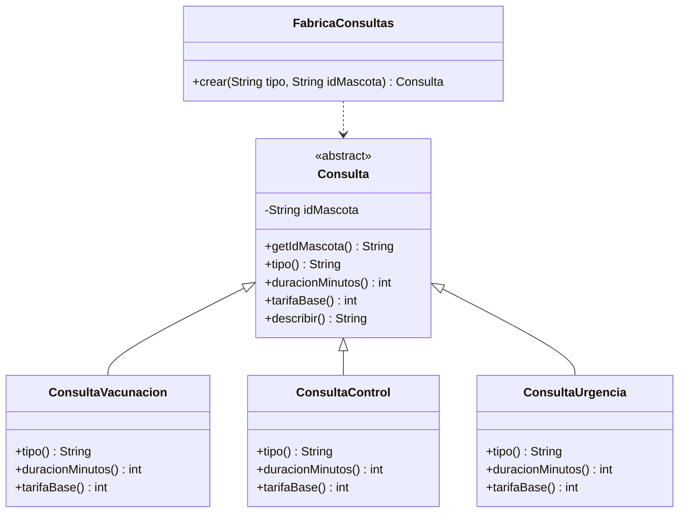

# Taller de la Clase 7 en ExamLab - configuracion

- **Curso:** Programacion II (FI303204)
- **Taller:** Taller Clase 7 en ExamLab - Singleton y Factory en VetCare
- **Preguntas:** 5 · **Total:** 100 puntos
- **Plataforma:** ExamLab (https://uniaj.examlab.workers.dev/) · modulo Talleres
- **Hito del PI:** VetCare queda con un unico repositorio de datos en memoria compartido por todas las ventanas y una fabrica que crea las consultas del dominio.
- **Entregable de la clase:** Clase RepositorioVetCare convertida en Singleton, FabricaConsultas con tres tipos y evidencia de que dos ventanas ven la misma lista, subido a ExamLab.

> ExamLab no importa preguntas desde archivo: el alta se hace en la UI del
> docente (o con la pestana de IA). Este documento trae el texto exacto de cada
> campo para copiar y pegar, incluidos el SQL de partida y el codigo base.

**Que produce el estudiante:** El estudiante deja el repositorio de VetCare como una unica instancia compartida por todas las ventanas y una FabricaConsultas que crea los tres tipos de consulta sin que quien llama conozca las subclases.

---

## Pregunta 1 - Codigo ejecutable · 28 pts

**Tipo en la plataforma:** `codigo`

**Enunciado (campo Contenido):**

## Un solo repositorio para toda la clinica (Singleton)

Hasta ahora cada ventana hacia `new RepositorioVetCare()`: Recepcion registraba una mascota y Consultorio no la veia, porque **eran dos listas distintas**. El patron Singleton garantiza que exista **una sola** instancia.

Convierta `RepositorioVetCare` en Singleton. El atributo **`private static RepositorioVetCare instancia;`** ya viene declarado; complete las otras dos piezas:

1. El constructor debe ser **`private`**, con un `System.out.println("[RepositorioVetCare] creando la unica instancia")` adentro (es el testigo que prueba el patron).
2. `getInstancia()` debe quedar **`public static synchronized`** y crear la instancia **solo si todavia es `null`**, devolviendo siempre la misma. Tal como esta en el starter devuelve `null` y el programa falla: ese es el arreglo.

El `main` ya simula las dos ventanas: pide la instancia tres veces, compara referencias e `identityHashCode`, y registra M-001 Kira desde "Recepcion" y M-002 Michi desde "Consultorio".

**Al ejecutar debe imprimir exactamente:**

```
--- Arranca la aplicacion ---
[RepositorioVetCare] creando la unica instancia
Misma instancia en las tres llamadas: true
Coinciden los identityHashCode: true
Registrada M-001 Kira. Total en el repositorio: 1
Registrada M-002 Michi. Total en el repositorio: 2
Lo que ve Recepcion: [M-001 Kira, M-002 Michi]
Lo que ve Consultorio: [M-001 Kira, M-002 Michi]
```

Dos evidencias del patron: el mensaje del constructor aparece **una sola vez** aunque se pidio la instancia tres veces, y las dos ultimas lineas son **identicas** aunque cada "ventana" uso su propia variable.

**Lenguaje:** `java`

**Codigo de partida (starter):**

```java
import java.util.ArrayList;
import java.util.List;

public class Main {

    public static void main(String[] args) {
        System.out.println("--- Arranca la aplicacion ---");

        RepositorioVetCare a = RepositorioVetCare.getInstancia();
        RepositorioVetCare b = RepositorioVetCare.getInstancia();
        RepositorioVetCare c = RepositorioVetCare.getInstancia();

        System.out.println("Misma instancia en las tres llamadas: " + (a == b && b == c));
        System.out.println("Coinciden los identityHashCode: "
                + (System.identityHashCode(a) == System.identityHashCode(b)));

        // La "ventana Recepcion" registra a Kira
        RepositorioVetCare.getInstancia().registrar("M-001 Kira");
        // La "ventana Consultorio" registra a Michi
        RepositorioVetCare.getInstancia().registrar("M-002 Michi");

        System.out.println("Lo que ve Recepcion: " + a.listar());
        System.out.println("Lo que ve Consultorio: " + c.listar());
    }
}

class RepositorioVetCare {

    // Pieza 1 del patron (ya declarada): el unico lugar donde vive la instancia.
    private static RepositorioVetCare instancia;

    private final List<String> mascotas = new ArrayList<>();

    // TODO 1: cambie la visibilidad de este constructor a private e imprima adentro
    //         "[RepositorioVetCare] creando la unica instancia"
    RepositorioVetCare() {
    }

    // TODO 2: agregue synchronized a la firma y complete el cuerpo:
    //         si instancia todavia es null, creela aqui; devuelva siempre la misma.
    //         Tal como esta, devuelve null y el programa falla: eso es lo que va a arreglar.
    public static RepositorioVetCare getInstancia() {
        return instancia;
    }

    public void registrar(String ficha) {
        mascotas.add(ficha);
        System.out.println("Registrada " + ficha + ". Total en el repositorio: " + mascotas.size());
    }

    public String listar() {
        return mascotas.toString();
    }
}
```

**Rubrica esperada (campo Rubrica):**

Existe el atributo private static, el constructor es private e imprime el mensaje testigo, y getInstancia es public static synchronized con creacion perezosa (solo si es null). El mensaje de creacion aparece exactamente una vez, las comparaciones dan true y las dos ventanas listan el mismo contenido. La salida coincide linea por linea.

---

## Pregunta 2 - Codigo ejecutable · 27 pts

**Tipo en la plataforma:** `codigo`

**Enunciado (campo Contenido):**

## `FabricaConsultas`: quien pide no sabe que recibe (Factory)

VetCare maneja tres tipos de consulta con reglas distintas:

| Tipo | Clase | Duracion | Tarifa base |
|------|-------|----------|-------------|
| vacunacion | `ConsultaVacunacion` | 20 min | 45000 |
| control | `ConsultaControl` | 30 min | 60000 |
| urgencia | `ConsultaUrgencia` | 45 min | 120000 |

La clase abstracta `Consulta` ya declara el contrato (`tipo()`, `duracionMinutos()`, `tarifaBase()` abstractos) y su `describir()` los usa. Complete:

1. En cada subclase: los tres metodos ya estan sobreescritos devolviendo `""` y `0`. Reemplace esos valores por los de la tabla.
2. En `FabricaConsultas.crear(String tipo, String idMascota)`:
   - **Normalice** el texto con `trim()` y `toLowerCase()` (por eso `"  CONTROL  "` y `"Urgencia"` deben funcionar).
   - Devuelva la subclase correspondiente, **con tipo de retorno `Consulta`**: quien llama no sabe cual recibio.
   - Si el tipo no existe, lance `IllegalArgumentException` con el mensaje exacto que se muestra abajo.

**Al ejecutar debe imprimir exactamente:**

```
Consulta de vacunacion para M-001: 20 min, tarifa base 45000
Consulta de control para M-002: 30 min, tarifa base 60000
Consulta de urgencia para M-004: 45 min, tarifa base 120000
Tipo rechazado: No existe el tipo de consulta 'peluqueria espacial'
```

Note que el `main` nunca escribe `new ConsultaVacunacion(...)`: solo conoce `Consulta` y la fabrica. Manana se agrega `ConsultaCirugia` y el `main` no se toca.

**Lenguaje:** `java`

**Codigo de partida (starter):**

```java
public class Main {

    public static void main(String[] args) {
        Consulta c1 = FabricaConsultas.crear("vacunacion", "M-001");
        System.out.println(c1.describir());

        Consulta c2 = FabricaConsultas.crear("  CONTROL  ", "M-002");
        System.out.println(c2.describir());

        Consulta c3 = FabricaConsultas.crear("Urgencia", "M-004");
        System.out.println(c3.describir());

        try {
            FabricaConsultas.crear("peluqueria espacial", "M-005");
        } catch (IllegalArgumentException ex) {
            System.out.println("Tipo rechazado: " + ex.getMessage());
        }
    }
}

abstract class Consulta {

    private final String idMascota;

    protected Consulta(String idMascota) {
        this.idMascota = idMascota;
    }

    public String getIdMascota() {
        return idMascota;
    }

    // El contrato de la jerarquia: toda consulta sabe decir su tipo, su duracion y su tarifa.
    public abstract String tipo();

    public abstract int duracionMinutos();

    public abstract int tarifaBase();

    public String describir() {
        return "Consulta de " + tipo() + " para " + idMascota + ": "
                + duracionMinutos() + " min, tarifa base " + tarifaBase();
    }
}

class ConsultaVacunacion extends Consulta {

    public ConsultaVacunacion(String idMascota) {
        super(idMascota);
    }

    @Override
    public String tipo() {
        return "";  // TODO: devuelva "vacunacion"
    }

    @Override
    public int duracionMinutos() {
        return 0;  // TODO: devuelva 20
    }

    @Override
    public int tarifaBase() {
        return 0;  // TODO: devuelva 45000
    }
}

class ConsultaControl extends Consulta {

    public ConsultaControl(String idMascota) {
        super(idMascota);
    }

    @Override
    public String tipo() {
        return "";  // TODO: devuelva "control"
    }

    @Override
    public int duracionMinutos() {
        return 0;  // TODO: devuelva 30
    }

    @Override
    public int tarifaBase() {
        return 0;  // TODO: devuelva 60000
    }
}

class ConsultaUrgencia extends Consulta {

    public ConsultaUrgencia(String idMascota) {
        super(idMascota);
    }

    @Override
    public String tipo() {
        return "";  // TODO: devuelva "urgencia"
    }

    @Override
    public int duracionMinutos() {
        return 0;  // TODO: devuelva 45
    }

    @Override
    public int tarifaBase() {
        return 0;  // TODO: devuelva 120000
    }
}

class FabricaConsultas {

    private FabricaConsultas() {
    }

    public static Consulta crear(String tipo, String idMascota) {
        // TODO 1: normalice el texto recibido con trim() y toLowerCase()
        // TODO 2: devuelva la subclase que corresponda ("vacunacion", "control", "urgencia").
        //         El tipo de retorno es Consulta: quien llama NO sabe que subclase recibio.
        // TODO 3: si el tipo no existe lance
        //         new IllegalArgumentException("No existe el tipo de consulta 'peluqueria espacial'")
        return null;
    }
}
```

**Rubrica esperada (campo Rubrica):**

Consulta declara los metodos abstractos y las tres subclases los implementan con los valores exactos de la tabla. crear() normaliza con trim y toLowerCase, devuelve el tipo base Consulta y lanza IllegalArgumentException con el mensaje exacto para un tipo desconocido. El main no instancia subclases directamente y la salida coincide caracter por caracter.

---

## Pregunta 3 - Diagrama (Mermaid) · 15 pts

**Tipo en la plataforma:** `diagrama`

**Enunciado (campo Contenido):**

## La jerarquia y la fabrica en un diagrama

Dibuje en **Mermaid** (`classDiagram`) el diseno que acaba de programar. Debe mostrar:

- La clase **abstracta** `Consulta` con `idMascota` privado y sus metodos (`tipo()`, `duracionMinutos()`, `tarifaBase()`, `describir()`).
- Las tres subclases `ConsultaVacunacion`, `ConsultaControl` y `ConsultaUrgencia` **heredando** de `Consulta` (flecha de herencia `<|--`).
- La clase `FabricaConsultas` con `crear(String tipo, String idMascota) Consulta` y su **dependencia** hacia `Consulta` (`..>`).

Marque `Consulta` como abstracta con la anotacion `<<abstract>>`.

El diagrama debe dejar claro de un vistazo lo que gana el diseno: la fabrica es el **unico** punto del sistema que conoce las tres subclases.

**Pegar al final del enunciado — flujo de entrega del diagrama:**

**Del boceto al codigo Mermaid.** No subas una imagen: la respuesta de esta pregunta es texto Mermaid.

- **1. Disena visual** Dibuja el diagrama como quieras en Excalidraw o draw.io: es mas rapido arrastrar cajas que escribir codigo, y ahi es donde piensas el modelo.
- **2. Traduce con IA** Copia o describe tu boceto a una IA y pidele el codigo Mermaid: «convierte este diagrama a Mermaid usando `classDiagram`». Revisa el resultado: la IA acierta la sintaxis, no tu modelo.
- **3. Pega y renderiza en ExamLab** Pega ese codigo en la caja de texto de la pregunta y mira como lo dibuja la plataforma. Si no renderiza, corrige ahi mismo: lo que se califica es el diagrama renderizado dentro de ExamLab.
- **4. Guarda el PNG para tu PI** Exporta tambien la imagen a la carpeta de tu Proyecto Integrador. Esa copia es para tu informe; no reemplaza la respuesta en la plataforma.

**Diagrama de referencia (Mermaid):**



**Rubrica esperada (campo Rubrica):**

El classDiagram renderiza y muestra Consulta marcada como abstracta con sus metodos, las tres subclases unidas con la flecha de herencia y FabricaConsultas con el metodo crear devolviendo Consulta. Los nombres coinciden con el codigo de la pregunta 2.

---

## Pregunta 4 - Seleccion unica · 10 pts

**Tipo en la plataforma:** `cerrada`

**Enunciado (campo Contenido):**

## ¿Que hace exactamente que el Singleton sea Singleton?

Un compañero escribio esto y jura que es un Singleton:

```java
public class RepositorioVetCare {

    private static RepositorioVetCare instancia;
    private final List<Mascota> mascotas = new ArrayList<>();

    public RepositorioVetCare() {
        System.out.println("[RepositorioVetCare] creando la unica instancia");
    }

    public static synchronized RepositorioVetCare getInstancia() {
        if (instancia == null) {
            instancia = new RepositorioVetCare();
        }
        return instancia;
    }
}
```

Al ejecutar la aplicacion, el mensaje de creacion aparece **tres veces** y las ventanas siguen viendo listas distintas.

**¿Cual es el error?**

**Opciones:**

- [ ] Falta declarar el atributo instancia como final para que no se pueda reasignar.
- [x] El constructor es public: cualquier clase puede seguir escribiendo new RepositorioVetCare() y saltarse getInstancia por completo.
- [ ] El metodo getInstancia deberia ser private para proteger la instancia unica.
- [ ] El problema es synchronized: bloquea el metodo y obliga a crear una instancia por hilo.

**Rubrica esperada (campo Rubrica):**

Respuesta correcta: el constructor es public, asi que cualquier clase puede seguir haciendo new y saltarse getInstancia. Se acierta o no.

---

## Pregunta 5 - Respuesta escrita · 20 pts

**Tipo en la plataforma:** `abierta`

**Enunciado (campo Contenido):**

## Justificacion del patron y de su costo

**(a) Evidencia (obligatoria).** Pegue las lineas de consola de su ejecucion que demuestran el patron: el mensaje del constructor apareciendo **una sola vez** y los dos `identityHashCode` con el **mismo numero**. Diga tambien cuantos `new RepositorioVetCare()` quedaron en el proyecto despues del Ctrl+F (debe ser exactamente uno, dentro de `getInstancia`) y en que clases estaban antes.

**(b) ¿Por que el repositorio SI y `Mascota` NO?** Explique por que tiene sentido que exista un unico repositorio y por que seria un desastre que `Mascota` fuera Singleton. Sea concreto: diga que pasaria en la clinica si solo pudiera existir un objeto `Mascota` en toda la aplicacion.

**(c) El costo que pagaremos en la Clase 8.** El Singleton guarda estado en una variable `static` que vive durante toda la ejecucion. Explique que problema aparece cuando escribamos pruebas automaticas: si la prueba A registra M-001 y la prueba B tambien, ¿que ve la prueba B al arrancar y por que eso rompe la independencia entre pruebas? Proponga una salida (por ejemplo un metodo `limpiar()` o inyectar el repositorio por constructor como en la Clase 6).

**Rubrica esperada (campo Rubrica):**

(a) Pega evidencia real de consola con el mensaje unico y los identityHashCode iguales, y reporta el resultado del Ctrl+F. (b) Justifica el Singleton por recurso unico compartido y explica que Mascota es una entidad con muchas instancias por naturaleza. (c) Identifica el estado global compartido entre pruebas como fuente de dependencia entre casos y propone una salida concreta (reset o inyeccion por constructor).

---

## Al terminar de crearlo

- Verifique que la suma de puntos sea la esperada: **100**.
- Publique el taller y confirme la fecha limite (domingo 23:59 segun el Acuerdo).
- Las preguntas con SQL o codigo: ejecutelas una vez usted mismo antes de publicar,
  para confirmar que el SQL de partida corre y que el starter compila.
