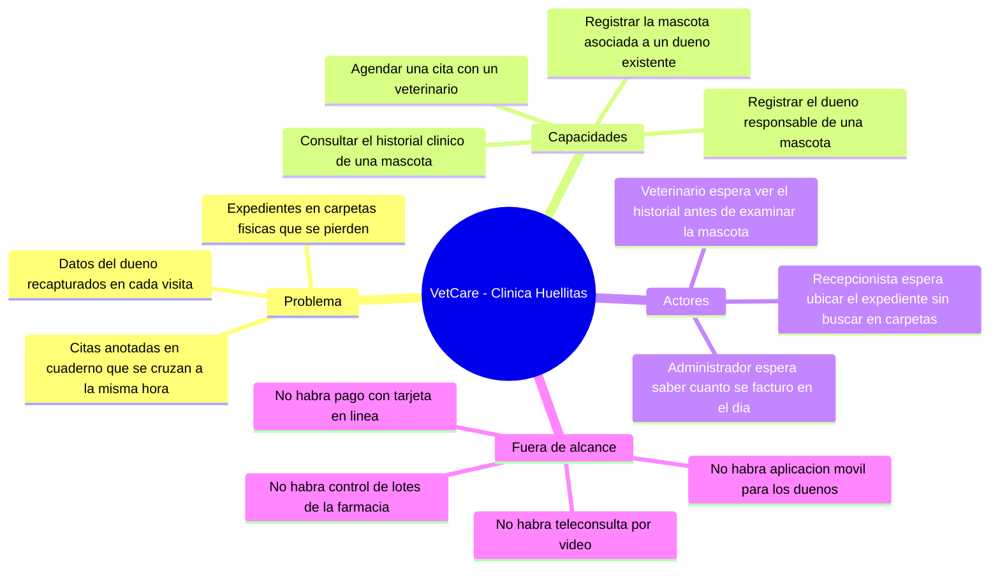

# Taller de la Clase 1 en ExamLab - configuracion

- **Curso:** Seminario de Sistemas (FI303301)
- **Taller:** Taller Clase 1 en ExamLab - Acotar el dominio de VetCare
- **Preguntas:** 5 · **Total:** 100 puntos
- **Plataforma:** ExamLab (https://uniaj.examlab.workers.dev/) · modulo Talleres
- **Hito del PI:** Dominio del proyecto acotado (trabajo individual por defecto)
- **Entregable de la clase:** Ficha de dominio: problema en 2-3 frases, 3-5 capacidades, 2-3 actores y lo que queda fuera de alcance

> ExamLab no importa preguntas desde archivo: el alta se hace en la UI del
> docente (o con la pestana de IA). Este documento trae el texto exacto de cada
> campo para copiar y pegar, incluidos el SQL de partida y el codigo base.

**Que produce el estudiante:** El estudiante entrega la ficha de dominio de VetCare: problema con actor y dolor observable, capacidades, actores con interes, fuera de alcance y su primer par RF/RNF bien escrito.

---

## Pregunta 1 - Respuesta escrita · 25 pts

**Tipo en la plataforma:** `abierta`

**Enunciado (campo Contenido):**

## Ficha de dominio y problema de la clinica Huellitas

La clinica veterinaria «Huellitas» atiende unas 25 mascotas al dia. Hoy los expedientes estan en carpetas fisicas, las citas se anotan en un cuaderno y los datos del dueno se vuelven a copiar en cada visita. Usted es el analista que va a dibujar los planos del sistema VetCare (recuerde: aqui no se construye la casa, se dibujan los planos; el codigo lo hara Programacion II).

**Escriba su respuesta con estos cuatro bloques rotulados, en este orden:**

1. **AUTOR**: su nombre completo. El trabajo es **individual por defecto**; si el docente autorizo equipo de 2 o 3 integrantes, liste tambien a los demas, pero esta entrega la responde cada uno con sus propias palabras.
2. **PROBLEMA (exactamente 2 o 3 frases)**: cada frase debe nombrar **un actor concreto** de la clinica (recepcionista, veterinario, administrador; no «los usuarios») y **un dolor observable** (algo que se pueda ver o medir hoy: tiempo perdido, carpeta extraviada, cita cruzada, dato recapturado).
3. **EVIDENCIA DEL DOLOR (3 renglones)**: para cada frase del problema, como se nota hoy ese dolor en la operacion diaria. Use al menos un numero estimado (minutos, veces por semana, cantidad de carpetas).
4. **NO ES**: una frase que diga que problema NO va a resolver este sistema, para que quede claro el foco.

Prohibido escribir frases genericas tipo «la clinica no esta sistematizada» o «hay desorden en la informacion»: eso no nombra actor ni dolor.

**Rubrica esperada (campo Rubrica):**

Se esperan los 4 bloques rotulados. El problema tiene 2 o 3 frases y cada una nombra un actor concreto de la clinica y un dolor observable, no una generalidad. La evidencia incluye al menos un numero estimado. Se descuenta si aparecen frases como «falta sistematizacion» o si el actor es «el usuario».

---

## Pregunta 2 - Respuesta escrita · 20 pts

**Tipo en la plataforma:** `abierta`

**Enunciado (campo Contenido):**

## Capacidades y actores de VetCare

**Parte A - Capacidades (escriba exactamente 4).** Liste 4 capacidades del sistema como **verbo de negocio en infinitivo + objeto del dominio** (por ejemplo: «Registrar la mascota de un dueno»). Reglas:
- Prohibido nombrar pantallas, menus o botones: nada de «pantalla de login», «modulo de reportes», «boton guardar».
- Cada capacidad en una sola linea y con una sola accion: si necesita la palabra «y» para unir dos cosas, son dos capacidades.

**Parte B - Actores (escriba exactamente 3).** Para cada actor use la plantilla literal:

`<Rol>: espera obtener <resultado concreto> para poder <tarea de su trabajo>`

Use roles, no nombres propios ni cargos inventados. Los roles disponibles del dominio son: Recepcionista, Veterinario, Administrador.

**Parte C - Fuera de alcance (escriba exactamente 4 items).** Que NO hara VetCare este semestre. Cada item debe ser especifico y verificable (por ejemplo «no habra pago con tarjeta en linea»), no vago (mal: «no haremos cosas complejas»). Cierre con un renglon que explique por que esa lista protege al proyecto.

**Rubrica esperada (campo Rubrica):**

Se esperan exactamente 4 capacidades como verbo de negocio + objeto, sin pantallas ni la conjuncion «y» uniendo dos capacidades; 3 actores escritos con la plantilla completa (rol + resultado esperado + tarea), sin nombres propios; y 4 items especificos de fuera de alcance mas el renglon de justificacion.

---

## Pregunta 3 - Diagrama (Mermaid) · 20 pts

**Tipo en la plataforma:** `diagrama`

**Enunciado (campo Contenido):**

## Mapa de dominio de VetCare en Mermaid

Dibuje el mapa de dominio de VetCare usando un **mindmap de Mermaid** (se renderiza aqui mismo, no necesita draw.io).

Estructura obligatoria: la raiz es `root((VetCare - Clinica Huellitas))` y debe tener **exactamente estas 4 ramas de primer nivel**, escritas asi: `Problema`, `Capacidades`, `Actores`, `Fuera de alcance`.

Cantidades exigidas:
- `Problema`: 3 hojas (los 3 dolores observables de la clinica).
- `Capacidades`: 4 hojas (las mismas 4 capacidades que escribio en la pregunta anterior, verbo + objeto).
- `Actores`: 3 hojas y cada hoja debe incluir el rol **y** lo que espera obtener.
- `Fuera de alcance`: 4 hojas.

Reglas de sintaxis del mindmap: la jerarquia se define **solo con indentacion** (2 espacios por nivel), una idea por linea, sin guiones al inicio y sin parentesis dentro del texto de las hojas. Escriba el texto sin tildes para que el render no falle.

**Pegar al final del enunciado — flujo de entrega del diagrama:**

**Del boceto al codigo Mermaid.** No subas una imagen: la respuesta de esta pregunta es texto Mermaid.

- **1. Disena visual** Dibuja el diagrama como quieras en Excalidraw o draw.io: es mas rapido arrastrar cajas que escribir codigo, y ahi es donde piensas el modelo.
- **2. Traduce con IA** Copia o describe tu boceto a una IA y pidele el codigo Mermaid: «convierte este diagrama a Mermaid usando `mindmap`». Revisa el resultado: la IA acierta la sintaxis, no tu modelo.
- **3. Pega y renderiza en ExamLab** Pega ese codigo en la caja de texto de la pregunta y mira como lo dibuja la plataforma. Si no renderiza, corrige ahi mismo: lo que se califica es el diagrama renderizado dentro de ExamLab.
- **4. Guarda el PNG para tu PI** Exporta tambien la imagen a la carpeta de tu Proyecto Integrador. Esa copia es para tu informe; no reemplaza la respuesta en la plataforma.

**Diagrama de referencia (Mermaid):**

**Rubrica esperada (campo Rubrica):**

Debe ser un mindmap valido que renderice, con la raiz VetCare y las 4 ramas exactas Problema, Capacidades, Actores y Fuera de alcance, con 3, 4, 3 y 4 hojas respectivamente. Las hojas de Actores incluyen rol e interes. Las capacidades son verbos de negocio, no pantallas. Coherencia total con las respuestas anteriores del taller.

---

## Pregunta 4 - Respuesta escrita · 20 pts

**Tipo en la plataforma:** `abierta`

**Enunciado (campo Contenido):**

## De la frase cruda al requisito bien escrito

En la entrevista, el Dr. Ramirez dijo textualmente:

> «Necesito buscar rapido el expediente de un animal; hoy revisamos carpetas fisicas y a veces se pierden.»

Esa frase es una **necesidad**, no un requisito. Conviertala en dos requisitos usando **exactamente** estas plantillas:

**RF-01** — `El sistema debe permitir a <actor> <accion> <objeto> [bajo <condicion>]`

**RNF-01** — `El sistema debe <cualidad> <valor numerico medible> <unidad> [en <condicion de medicion>]`

Y agregue debajo de cada uno:
- `Origen:` la frase de la entrevista y quien la dijo.
- `Criterio de verificacion:` como se comprueba que se cumplio, con un numero (segundos, cantidad de registros, porcentaje). Debe ser algo que alguien pueda medir con un cronometro o contando, no una opinion.

Al final escriba 2 renglones titulados **«Por que la palabra rapido no sirve»** explicando que problema causa esa palabra en un documento de requisitos y con que la reemplazo usted.

**Rubrica esperada (campo Rubrica):**

El RF usa la plantilla con actor explicito y una sola accion. El RNF trae un valor numerico con unidad y una condicion de medicion (por ejemplo 3 segundos con 5000 mascotas registradas). Ambos tienen Origen y Criterio de verificacion medible. Los 2 renglones finales explican por que «rapido» es ambiguo y con que se sustituyo.

---

## Pregunta 5 - Seleccion multiple · 15 pts

**Tipo en la plataforma:** `cerrada_multi`

**Enunciado (campo Contenido):**

## Verificacion: RF o RNF

Marque **todos** los enunciados que sean **requisitos no funcionales correctamente escritos** para VetCare (cuantificados y verificables).

**Opciones:**

- [ ] El sistema debe permitir a la recepcionista registrar una mascota asociada a un dueno ya existente.
- [x] La busqueda de un expediente debe devolver resultados en 3 segundos o menos con 5.000 mascotas registradas.
- [ ] El sistema debe ser rapido y amigable para la auxiliar de recepcion.
- [x] Solo el rol Veterinario puede crear o modificar el campo diagnostico; la Recepcionista lo ve en modo lectura.
- [x] El sistema debe generar un respaldo automatico diario a las 23:00 con retencion de 7 dias.
- [ ] El sistema debe permitir al veterinario consultar el historial de atenciones de una mascota.

**Rubrica esperada (campo Rubrica):**

Correctas: las opciones 1, 3 y 4. La 0 y la 5 son requisitos funcionales (describen una accion del sistema para un actor). La 2 es un RNF mal escrito porque usa «rapido» y «amigable» sin numero ni forma de medirlo.

---

## Al terminar de crearlo

- Verifique que la suma de puntos sea la esperada: **100**.
- Publique el taller y confirme la fecha limite (domingo 23:59 segun el Acuerdo).
- Las preguntas con SQL o codigo: ejecutelas una vez usted mismo antes de publicar,
  para confirmar que el SQL de partida corre y que el starter compila.
