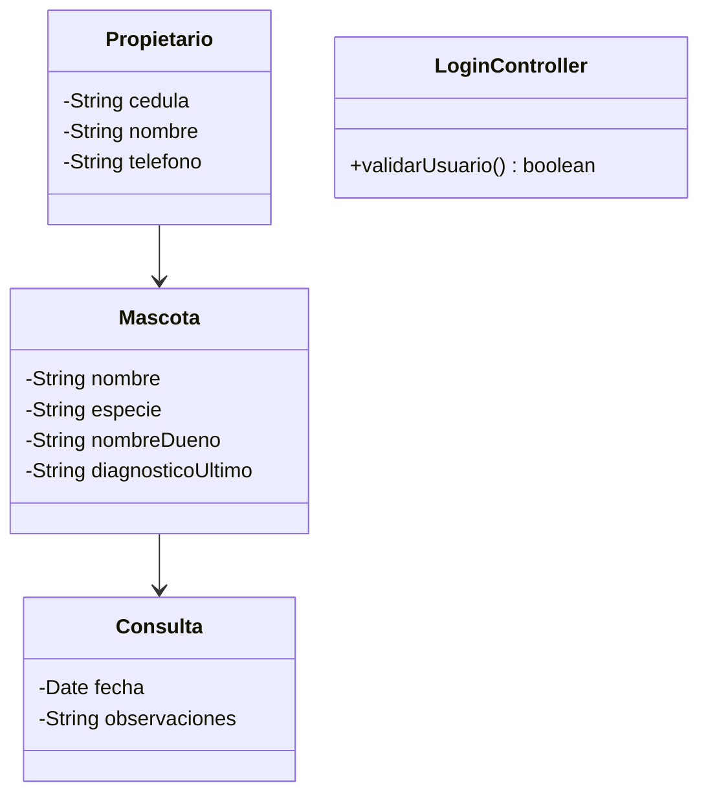
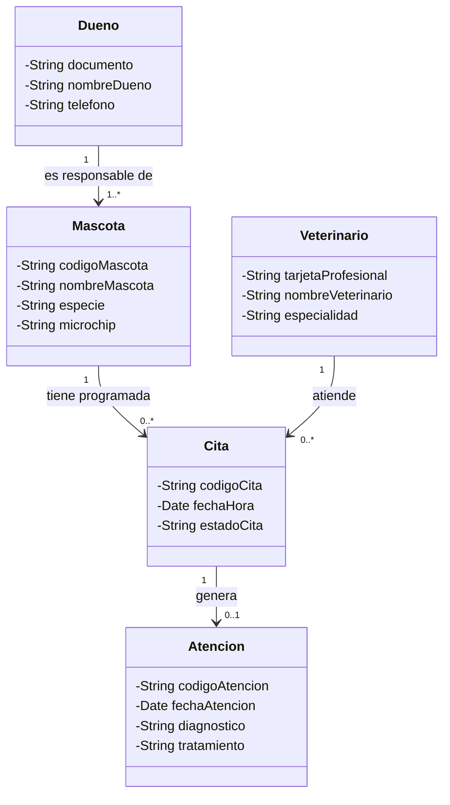

# Taller de la Clase 11 en ExamLab - configuracion

- **Curso:** Seminario de Sistemas (FI303301)
- **Taller:** Taller Clase 11 en ExamLab - Auditoria cruzada del paquete VetCare
- **Preguntas:** 5 · **Total:** 100 puntos
- **Plataforma:** ExamLab (https://uniaj.examlab.workers.dev/) · modulo Talleres
- **Hito del PI:** El paquete de diseño de VetCare queda auditado y consistente: requisitos, casos de uso y diagrama de clases usan los mismos nombres y no se contradicen entre si.
- **Entregable de la clase:** Un documento con la matriz de trazabilidad RF a CU a Clase, el glosario de nombres canonicos, el acta de revision entre pares con hallazgos clasificados por severidad y el backlog priorizado de correcciones, subido a ExamLab.

> ExamLab no importa preguntas desde archivo: el alta se hace en la UI del
> docente (o con la pestana de IA). Este documento trae el texto exacto de cada
> campo para copiar y pegar, incluidos el SQL de partida y el codigo base.

**Que produce el estudiante:** El estudiante entrega la matriz RF a CU a Clase, el glosario de nombres canonicos, el acta de auditoria con hallazgos por severidad, el modelo corregido y el backlog de correcciones.

---

## Pregunta 1 - Respuesta escrita · 25 pts

**Tipo en la plataforma:** `abierta`

**Enunciado (campo Contenido):**

## Matriz de trazabilidad completa del paquete VetCare

Hasta hoy produjeron requisitos (clase 6), historias (clase 7), clases (clase 8) y casos de uso (clase 9). Ahora hay que probar que **son el mismo sistema** y no cuatro documentos que se contradicen.

Escriba una tabla markdown con **una fila por cada RF del catalogo (minimo 8 filas)** y **estas 6 columnas**:

`| RF | Historia HU | Caso de uso CU | Clase o clases implicadas | Pantalla o mockup previsto | Estado: Completo / Incompleto |`

Reglas:
- Marque como `Incompleto` toda fila a la que le falte **cualquier** celda, y escriba en la misma celda **que falta exactamente** (por ejemplo: «falta CU, se crea CU-08» o «falta clase, el RF-08 no tiene ninguna clase que lo soporte»).
- Debajo de la tabla escriba tres conteos: **cuantas filas completas**, **cuantas incompletas** y **cual es el porcentaje de cobertura** del paquete.
- Agregue una lista rotulada `ELEMENTOS SIN ORIGEN` con todo caso de uso o clase de su paquete que **no** aparezca en ninguna fila de la matriz, y la decision para cada uno: se elimina, se documenta el requisito que faltaba o se aplaza.

Esta matriz es el insumo de las tres preguntas siguientes: si esta mal, todo lo demas queda mal.

**Rubrica esperada (campo Rubrica):**

Tabla con minimo 8 filas y las 6 columnas, con estado por fila y descripcion exacta de lo que falta en las incompletas. Estan los tres conteos con el porcentaje de cobertura. La lista de elementos sin origen existe y cada uno tiene decision escrita. Cobertura del cien por ciento de los RF del catalogo.

---

## Pregunta 2 - Respuesta escrita · 20 pts

**Tipo en la plataforma:** `abierta`

**Enunciado (campo Contenido):**

## Glosario de nombres canonicos

El error mas comun del paquete: la misma cosa se llama de tres formas distintas segun el documento (Dueno en el diagrama, Propietario en los requisitos, Cliente en el mockup). Cierrelo con un glosario.

Escriba una tabla markdown con **minimo 8 filas** y **estas 4 columnas**:

`| Nombre canonico | Definicion en una linea | Sinonimos prohibidos | Donde aparecia mal escrito (artefacto y ubicacion) |`

Conceptos que debe incluir obligatoriamente: **Dueno, Mascota, Cita, Atencion, Veterinario, Expediente, Insumo, Factura**.

Reglas:
- El nombre canonico debe ser **exactamente** el que usa su diagrama de clases: si su clase se llama `Dueno`, el canonico es Dueno y `Propietario` va en la columna de prohibidos.
- La definicion debe distinguir conceptos que se confunden: **Cita** (compromiso agendado a una fecha y hora) frente a **Atencion** (lo que efectivamente ocurrio en el consultorio); **Expediente** (vista consolidada de la mascota y su historial) frente a **Mascota** (la entidad del dominio).
- La ultima columna **no puede quedar vacia en al menos 4 filas**: tienen que haber encontrado de verdad 4 lugares donde el nombre estaba mal y decir en cual artefacto y en que parte.

Cierre con un renglon: `RENOMBRAMIENTOS APLICADOS: <cuantos, y en cuales artefactos>`.

**Rubrica esperada (campo Rubrica):**

Minimo 8 conceptos con nombre canonico, definicion de una linea y sinonimos prohibidos. Cita y Atencion quedan distinguidas, igual que Expediente y Mascota. Al menos 4 filas indican el artefacto y la ubicacion exacta donde el nombre estaba mal, y el renglon final declara los renombramientos aplicados.

---

## Pregunta 3 - Respuesta escrita · 25 pts

**Tipo en la plataforma:** `abierta`

**Enunciado (campo Contenido):**

## Acta de auditoria del paquete de otro proyecto (Patitas)

Audite el paquete que entrego otro proyecto del curso. Este es su material completo, tal como lo subieron:

**Catalogo de requisitos del equipo Patitas**
- RF-01: El sistema debe permitir a la recepcionista registrar un dueno con documento, nombre y telefono.
- RF-02: El sistema debe permitir a la recepcionista registrar una mascota asociada a un dueno.
- RF-03: El sistema debe permitir a la recepcionista buscar el expediente de una mascota por numero de microchip.
- RF-04: El sistema debe permitir a la recepcionista agendar una cita con un veterinario.
- RF-08: El sistema debe permitir al administrador facturar la atencion.

**Casos de uso del equipo Patitas**
- CU-01 Registrar mascota (actor: Recepcionista)
- CU-02 Buscar expediente (actor: Recepcionista)
- CU-04 Agendar cita (actor: Recepcionista)
- CU-09 Enviar recordatorio por WhatsApp (actor: Sistema)

**Diagrama de clases del equipo Patitas**

**Dato adicional del acta de la clase 6 de ese equipo:** el recordatorio por WhatsApp quedo clasificado como **Wont** en su propia priorizacion MoSCoW.

**Su tarea:** escriba el acta de revision con **exactamente 6 hallazgos**, en una tabla markdown con **estas 5 columnas**:

`| # | Ubicacion exacta (artefacto y elemento) | Descripcion objetiva del hallazgo | Severidad: Bloqueante / Mayor / Menor | Regla o criterio que se incumple |`

Reglas de la auditoria:
- **Prohibido proponer soluciones** en esta tabla: solo se describe el problema. La correccion va en las dos preguntas siguientes.
- La descripcion debe ser **objetiva y verificable** («la clase Mascota tiene el atributo nombreDueno, que duplica un dato de Propietario»), no un juicio («el diagrama esta feo» o «les falto trabajar»).
- Al menos **2 hallazgos deben ser Bloqueantes** y debe justificar en la columna de criterio por que bloquean (por ejemplo: un caso de uso que ninguna clase puede soportar).
- Los 6 hallazgos deben ser **distintos entre si**: no repita el mismo problema en dos filas.

Pistas de lo que debe mirar: RF sin caso de uso, caso de uso sin RF y contradictorio con su propio MoSCoW, nombres que no coinciden entre artefactos, atributos ubicados en la clase equivocada, clases tecnicas en un modelo de dominio, ausencia de una clase necesaria para un caso de uso, asociaciones sin multiplicidad, y un atributo exigido por un RF que no existe en ninguna clase.

**Rubrica esperada (campo Rubrica):**

Seis hallazgos distintos, cada uno con ubicacion exacta del elemento, descripcion objetiva y verificable, severidad asignada y criterio incumplido. Al menos 2 son bloqueantes con justificacion de por que bloquean. No se proponen soluciones ni se emiten juicios subjetivos.

---

## Pregunta 4 - Diagrama (Mermaid) · 20 pts

**Tipo en la plataforma:** `diagrama`

**Enunciado (campo Contenido):**

## Modelo de dominio corregido del equipo Patitas

Ahora si corrija. Entregue en **Mermaid** (`classDiagram`) el modelo de dominio del equipo Patitas **ya saneado**, aplicando **estas 6 correcciones obligatorias**:

1. Elimine la clase tecnica que no pertenece a un modelo de dominio.
2. Aplique los **nombres canonicos de su glosario**: la clase se llama `Dueno` (no `Propietario`) y la clase clinica se llama `Atencion` (no `Consulta`).
3. Quite de `Mascota` el atributo que duplica un dato del dueno y el atributo clinico que no le corresponde, y ubiquelos donde van.
4. Agregue la clase que hacia falta para que **CU-04 Agendar cita** tenga soporte en el modelo, y la clase `Veterinario` que lo atiende.
5. Agregue en `Mascota` el atributo que exige **RF-03** y que hoy no existe en ninguna clase.
6. Ponga **multiplicidad en ambos extremos y nombre de relacion** en **todas** las asociaciones.

Use minimo 3 atributos tipados por clase, con visibilidad. Escriba los nombres sin tildes.

**Pegar al final del enunciado — flujo de entrega del diagrama:**

**Del boceto al codigo Mermaid.** No subas una imagen: la respuesta de esta pregunta es texto Mermaid.

- **1. Disena visual** Dibuja el diagrama como quieras en Excalidraw o draw.io: es mas rapido arrastrar cajas que escribir codigo, y ahi es donde piensas el modelo.
- **2. Traduce con IA** Copia o describe tu boceto a una IA y pidele el codigo Mermaid: «convierte este diagrama a Mermaid usando `classDiagram`». Revisa el resultado: la IA acierta la sintaxis, no tu modelo.
- **3. Pega y renderiza en ExamLab** Pega ese codigo en la caja de texto de la pregunta y mira como lo dibuja la plataforma. Si no renderiza, corrige ahi mismo: lo que se califica es el diagrama renderizado dentro de ExamLab.
- **4. Guarda el PNG para tu PI** Exporta tambien la imagen a la carpeta de tu Proyecto Integrador. Esa copia es para tu informe; no reemplaza la respuesta en la plataforma.

**Diagrama de referencia (Mermaid):**

**Rubrica esperada (campo Rubrica):**

El diagrama corregido no tiene clases tecnicas, usa los nombres canonicos Dueno y Atencion, reubica nombreDueno y el dato clinico, incorpora Cita y Veterinario para soportar CU-04, agrega microchip en Mascota por RF-03 y todas las asociaciones tienen multiplicidad en ambos extremos y nombre de relacion. Minimo 3 atributos tipados por clase.

---

## Pregunta 5 - Respuesta escrita · 10 pts

**Tipo en la plataforma:** `abierta`

**Enunciado (campo Contenido):**

## Respuesta a los hallazgos y backlog de correcciones

**Parte A - Respuesta a los hallazgos recibidos.** Otro estudiante audito **su** paquete. Escriba una tabla con **minimo 4 filas** y **estas 4 columnas**:

`| # del hallazgo | Severidad | Decision: Aceptado / Rechazado con justificacion / Aplazado por acuerdo | Argumento en una linea |`

Regla: **ningun hallazgo se borra del acta**, ni siquiera los que rechazan. Si rechaza uno, el argumento debe ser tecnico (por ejemplo: «el nombre Consulta si es canonico en nuestro glosario y esta declarado en la fila 4»), no «no estamos de acuerdo».

**Parte B - Backlog priorizado de correcciones.** Tabla con **minimo 5 filas** y **estas 5 columnas**:

`| Prioridad | Correccion a aplicar | Artefacto afectado | Responsable (su nombre; si hay equipo, el del integrante) | Criterio de cierre verificable |`

Reglas:
- Ordenado por **severidad**: primero los Bloqueantes, luego Mayores, luego Menores.
- El **criterio de cierre debe ser verificable por un tercero**: «la clase Cita existe en el diagrama y aparece en la fila del RF-04 de la matriz» sirve; «quedar bien» no sirve.
- Marque con `[APLICADA EN CLASE]` las **2 correcciones bloqueantes** que ya dejaron aplicadas hoy, y diga en un renglon **como se puede comprobar** que quedaron aplicadas.

**Rubrica esperada (campo Rubrica):**

Minimo 4 hallazgos recibidos con decision explicita y argumento tecnico, sin borrar ninguno. Backlog de minimo 5 correcciones ordenado por severidad, con responsable nominal y criterio de cierre verificable por un tercero. Las 2 bloqueantes estan marcadas como aplicadas con su forma de comprobacion.

---

## Al terminar de crearlo

- Verifique que la suma de puntos sea la esperada: **100**.
- Publique el taller y confirme la fecha limite (domingo 23:59 segun el Acuerdo).
- Las preguntas con SQL o codigo: ejecutelas una vez usted mismo antes de publicar,
  para confirmar que el SQL de partida corre y que el starter compila.
