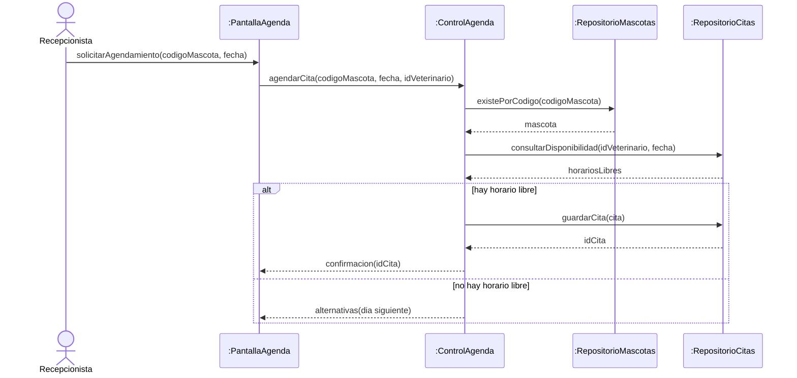
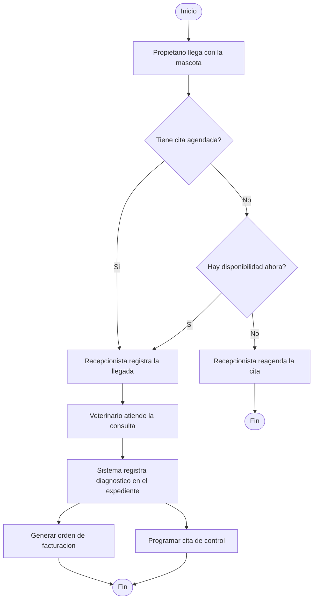

# Diagramas dinamicos de VetCare - secuencia y actividad

> Regla: estos diagramas NO se inventan. Se derivan del flujo principal ya escrito en la especificacion del caso de uso y de las clases ya definidas.

## 1. Cuando usar cada uno

| Pregunta que quiero responder | Diagrama correcto |
|---|---|
| Quien le habla a quien y en que orden para cumplir un caso de uso | Secuencia |
| Que objeto deberia ser responsable de esta tarea | Secuencia |
| En que orden hace el trabajo la gente de la clinica, incluyendo pasos manuales | Actividad |
| Donde se decide algo y que ocurre en paralelo | Actividad |

## 2. Punto de partida: flujo principal de CU-04 Agendar cita (RF-08)

| Paso | Actor | Sistema |
|---|---|---|
| 1 | Selecciona Agendar cita e indica codigo de mascota, veterinario y fecha | Muestra el formulario de agendamiento |
| 2 | -- | Verifica que la mascota exista |
| 3 | -- | Consulta la disponibilidad del veterinario para esa fecha |
| 4 | Escoge uno de los horarios libres | Muestra los horarios libres |
| 5 | Confirma | Registra la cita y muestra el identificador |

- Alterno 3a: el veterinario no tiene disponibilidad; el sistema ofrece los horarios del dia siguiente.

## 3. Diagrama de secuencia - CU-04 Agendar cita

## 4. Tabla de mapeo mensaje a operacion (obligatoria)

| Mensaje del diagrama | Clase destinataria | Operacion que debe existir | Ya existe? |
|---|---|---|---|
| existePorCodigo(codigoMascota) | RepositorioMascotas | existePorCodigo(codigo): booleano | |
| consultarDisponibilidad(idVeterinario, fecha) | RepositorioCitas | consultarDisponibilidad(idVeterinario, fecha): lista de horarios | |
| guardarCita(cita) | RepositorioCitas | guardarCita(cita): idCita | |

> Si una fila queda sin clase destinataria, el diagrama de clases esta incompleto. Ese es el hallazgo mas valioso del ejercicio.

## 5. Diagrama de actividad - proceso de atencion en Huellitas

> En draw.io este mismo flujo se dibuja con calles: Propietario, Recepcionista, Veterinario y Sistema VetCare, para que se vea de un golpe quien es responsable de cada paso y cual ocurre sin tocar el computador.

## 6. Checklist antes de entregar en ExamLab

- [ ] El orden de los mensajes coincide paso por paso con el flujo principal del caso de uso.
- [ ] Todos los participantes son actores legitimos o clases del diagrama de clases.
- [ ] Aparecen las flechas de retorno indicando que informacion devuelven.
- [ ] Hay al menos un fragmento alt con sus dos condiciones de guarda escritas.
- [ ] El fragmento alt corresponde a un flujo alterno ya documentado en el texto.
- [ ] El diagrama de actividad tiene calles, minimo dos decisiones y una bifurcacion en paralelo.
- [ ] La tabla de mapeo mensaje a operacion no tiene filas incompletas.
