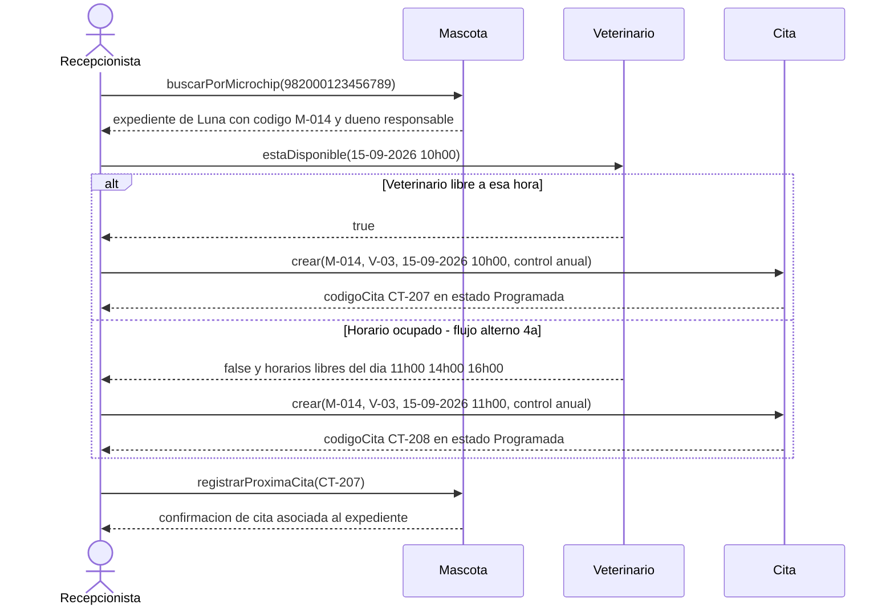
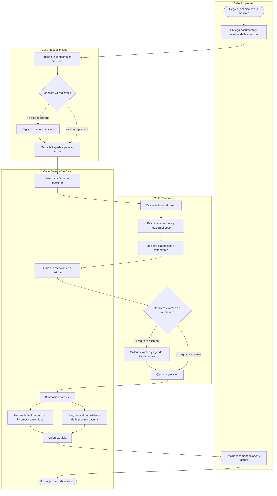

# Taller de la Clase 12 en ExamLab - configuracion

- **Curso:** Seminario de Sistemas (FI303301)
- **Taller:** Taller Clase 12 en ExamLab - Secuencia y actividad de VetCare
- **Preguntas:** 5 · **Total:** 100 puntos
- **Plataforma:** ExamLab (https://uniaj.examlab.workers.dev/) · modulo Talleres
- **Hito del PI:** Queda modelada la dinamica de VetCare: el diagrama de secuencia del caso de uso Agendar cita y el diagrama de actividad del proceso de atencion en el consultorio.
- **Entregable de la clase:** Un PDF con el diagrama de secuencia de Agendar cita incluyendo el fragmento alt para horario ocupado, el diagrama de actividad del proceso de atencion con calles por rol, y la tabla que mapea cada mensaje del diagrama de secuencia a una operacion del diagrama de clases, subido a ExamLab.

> ExamLab no importa preguntas desde archivo: el alta se hace en la UI del
> docente (o con la pestana de IA). Este documento trae el texto exacto de cada
> campo para copiar y pegar, incluidos el SQL de partida y el codigo base.

**Que produce el estudiante:** El estudiante entrega la dinamica de VetCare: el diagrama de secuencia de CU-04 Agendar cita con fragmento alt, el diagrama de actividad con calles y la tabla que mapea cada mensaje a una operacion del diagrama de clases.

---

## Pregunta 1 - Respuesta escrita · 15 pts

**Tipo en la plataforma:** `abierta`

**Enunciado (campo Contenido):**

## Del flujo principal a la lista de mensajes

Antes de dibujar cualquier cosa hay que saber que mensajes existen. Este es el **flujo principal ya especificado de CU-04 Agendar cita** (es el de la clase 9; usese tal cual, no lo cambie):

```
CU-04 Agendar cita
Actor primario: Recepcionista
Precondiciones: la mascota esta registrada en VetCare; existe al menos un veterinario con horario disponible.
Flujo principal:
1. La recepcionista digita el numero de microchip de la mascota.
2. El sistema muestra el expediente de la mascota con su dueno responsable.
3. La recepcionista selecciona el veterinario y la fecha y hora deseadas.
4. El sistema verifica que el veterinario no tenga otra cita a esa hora.
5. La recepcionista confirma el motivo de la consulta.
6. El sistema crea la cita en estado Programada y devuelve el codigo de la cita.
7. La recepcionista le dicta al dueno el codigo y la hora confirmada.
Flujo alterno 4a (horario ocupado): el sistema informa que el veterinario ya tiene una cita a esa hora y ofrece los horarios libres del dia; la recepcionista escoge otro horario y el flujo retorna al paso 5.
```

**Entregue una tabla markdown con entre 6 y 8 filas** y **estas 4 columnas**:

`| # mensaje | Paso del flujo principal que lo origina | Mensaje (emisor -> receptor) | Dato que devuelve (o Ninguno) |`

Reglas:
- El receptor de cada mensaje debe ser **un actor legitimo o una clase que exista en su diagrama de clases** de la clase 8 (`Mascota`, `Cita`, `Veterinario`, `Dueno`, `Atencion`). Si un mensaje no tiene clase que lo pueda responder, marquelo con `[FALTA CLASE U OPERACION]` y digalo: eso es exactamente lo que hay que descubrir aqui.
- No invente pasos que no esten en el flujo principal de arriba.
- Los mensajes de **retorno** tambien cuentan: por cada mensaje que pide algo debe decir que dato regresa.
- Marque con `[ALT]` los mensajes que pertenecen al flujo alterno 4a.

**Rubrica esperada (campo Rubrica):**

Tabla de 6 a 8 mensajes, cada uno amarrado al paso numerado del flujo principal que lo origina, con emisor y receptor donde el receptor es un actor o una clase existente del modelo. Se indica el dato de retorno de cada mensaje y se marcan los del flujo alterno 4a. No hay pasos inventados fuera de la especificacion dada.

---

## Pregunta 2 - Diagrama (Mermaid) · 30 pts

**Tipo en la plataforma:** `diagrama`

**Enunciado (campo Contenido):**

## Diagrama de secuencia de CU-04 Agendar cita

Dibuje en **Mermaid** (`sequenceDiagram`) la secuencia de **CU-04 Agendar cita**, derivada linea por linea del flujo principal de la pregunta anterior.

**Obligatorio:**
1. **La Recepcionista como actor** (use `actor REC as Recepcionista`).
2. **Minimo 3 participantes** y todos deben ser **clases que existan en su diagrama de clases** de la clase 8: use `participant M as Mascota`, `participant V as Veterinario`, `participant C as Cita`. Prohibido inventar participantes tipo `SistemaGeneral`, `BaseDeDatos` o `Controlador`.
3. **Flechas de retorno con el dato que devuelven**: use `-->>` y escriba el dato concreto (el expediente con su codigo, true o false, el codigo de la cita y su estado). Un retorno vacio o que solo diga `ok` se penaliza.
4. **Un fragmento `alt`** que modele el horario ocupado, con **las dos condiciones de guarda escritas** (la del `alt` y la del `else`). La rama `else` debe corresponder al **flujo alterno 4a ya documentado** e incluir tanto la respuesta del sistema como el reintento con otro horario.
5. El orden de los mensajes debe ser **exactamente** el del flujo principal: si en la especificacion primero se ubica la mascota y despues se valida el veterinario, en el diagrama va en ese orden.

Escriba las horas como `15-09-2026 10h00` (evite los dos puntos en el texto de los mensajes) y no use tildes.

**Diagrama de referencia (Mermaid):**



**Rubrica esperada (campo Rubrica):**

Secuencia valida con la Recepcionista como actor y minimo 3 participantes que son clases reales del modelo. El orden reproduce el flujo principal de CU-04 sin pasos inventados. Todas las peticiones tienen su flecha de retorno con dato concreto. Existe un fragmento alt con las dos guardas escritas y la rama else corresponde al flujo alterno 4a, incluyendo el reintento.

---

## Pregunta 3 - Diagrama (Mermaid) · 30 pts

**Tipo en la plataforma:** `diagrama`

**Enunciado (campo Contenido):**

## Diagrama de actividad del proceso de atencion en el consultorio

Dibuje en **Mermaid** (`flowchart TB`) el diagrama de actividad del proceso de atencion en el consultorio de Huellitas, usando **subgraphs como calles**.

**Obligatorio:**
1. **Exactamente 4 calles** (subgraphs), rotuladas: `Calle Propietario`, `Calle Recepcionista`, `Calle Veterinario`, `Calle Sistema VetCare`. Cada actividad debe estar dentro de la calle del rol que la ejecuta.
2. **Un nodo de inicio** y **un nodo de fin** con forma de estadio: `([Llega a la clinica con la mascota])` y `([Fin del proceso de atencion])`.
3. **Minimo 2 nodos de decision** en forma de rombo `{ }`, cada uno con **sus dos salidas rotuladas con la condicion**. Las dos decisiones obligatorias son: `Mascota ya registrada` (en la calle de la Recepcionista) y `Requiere examen de laboratorio` (en la calle del Veterinario).
4. **Una bifurcacion en paralelo**: al cerrar la atencion, el sistema hace **dos cosas al mismo tiempo** (generar la factura con los insumos consumidos y programar el recordatorio de la proxima vacuna) y luego **se vuelven a unir**. Modelelo con un nodo `Bifurcacion paralela` que sale hacia dos actividades y un nodo `Union paralela` que las recibe.
5. **Minimo 10 actividades** en total repartidas entre las 4 calles.

Regla de sintaxis critica: **declare todas las flechas que cruzan de una calle a otra despues de cerrar todos los subgraphs**, si no el diagrama no renderiza. Escriba los textos sin tildes, sin comas y sin parentesis dentro de los corchetes.

**Diagrama de referencia (Mermaid):**



**Rubrica esperada (campo Rubrica):**

Cuatro calles como subgraphs con las actividades ubicadas en el rol correcto, inicio y fin marcados, minimo 10 actividades. Dos rombos de decision con ambas salidas rotuladas con la condicion. Bifurcacion y union en paralelo correctamente modeladas alrededor de facturar y programar el recordatorio. Las flechas entre calles estan declaradas fuera de los subgraphs y el diagrama renderiza.

---

## Pregunta 4 - Respuesta escrita · 15 pts

**Tipo en la plataforma:** `abierta`

**Enunciado (campo Contenido):**

## Tabla de mapeo mensaje a operacion

Cada mensaje de un diagrama de secuencia necesita **una clase dueña que lo pueda responder**. Si la operacion no existe en el diagrama de clases, el diagrama de secuencia es una mentira. Cierre ese hueco.

Escriba una tabla markdown con **una fila por cada mensaje de su diagrama de secuencia** (minimo 6 filas) y **estas 4 columnas**:

`| Mensaje del diagrama de secuencia | Clase destinataria | Operacion que debe existir (firma completa) | Ya existia en el diagrama de clases? Si / No - se agrega |`

Reglas:
- **Ninguna fila puede quedar con la clase en blanco.** Si un mensaje no tiene clase destinataria posible, el mensaje esta mal planteado o falta una clase: digalo explicitamente en la fila.
- La firma completa se escribe como en Mermaid: `+estaDisponible(fechaHora) boolean`, con visibilidad, parametros y tipo de retorno.
- Debajo de la tabla escriba el bloque `OPERACIONES AGREGADAS AL DIAGRAMA DE CLASES` listando **todas** las operaciones nuevas que este ejercicio obligo a crear, indicando **en cual clase** entra cada una. Si no le salio ninguna operacion nueva, revise otra vez: casi siempre falta al menos una en `Veterinario` o en `Cita`.
- Cierre con un renglon: `COHERENCIA CON LA CLASE 8: <como quedo actualizado su diagrama de clases y que cambio exactamente>`.

**Rubrica esperada (campo Rubrica):**

Minimo 6 filas, una por mensaje, sin ninguna fila con clase en blanco. Cada operacion esta escrita con firma completa (visibilidad, parametros y tipo de retorno). El bloque de operaciones agregadas lista las nuevas indicando su clase, y el renglon final declara como quedo actualizado el diagrama de clases de la clase 8.

---

## Pregunta 5 - Seleccion multiple · 10 pts

**Tipo en la plataforma:** `cerrada_multi`

**Enunciado (campo Contenido):**

## Verificacion: que es valido en un diagrama de secuencia

Marque **todas** las afirmaciones **correctas** sobre el diagrama de secuencia de CU-04 Agendar cita en VetCare.

**Opciones:**

- [x] Cada mensaje enviado a un participante exige que exista una operacion de esa clase capaz de responderlo.
- [ ] Es correcto agregar un participante llamado BaseDeDatos para mostrar donde se guardan las citas.
- [x] Las flechas de retorno deben indicar el dato concreto que devuelven, por ejemplo el codigo de la cita y su estado.
- [ ] Para modelar que el horario esta ocupado se debe usar un fragmento loop, porque la recepcionista intenta varias veces.
- [x] El fragmento alt debe tener las dos condiciones de guarda escritas y su rama else debe corresponder a un flujo alterno ya documentado en la especificacion del caso de uso.
- [ ] El diagrama de secuencia puede incluir pasos que no aparecen en el flujo principal, para dejarlo mas completo.

**Rubrica esperada (campo Rubrica):**

Correctas: 0, 2 y 4. La 1 es falsa porque los participantes deben ser clases del modelo o actores, no cajas tecnicas inventadas. La 3 confunde alt (caminos excluyentes segun una guarda) con loop (repeticion). La 5 es falsa: la secuencia no puede agregar pasos que no esten en la especificacion del caso de uso.

---

## Al terminar de crearlo

- Verifique que la suma de puntos sea la esperada: **100**.
- Publique el taller y confirme la fecha limite (domingo 23:59 segun el Acuerdo).
- Las preguntas con SQL o codigo: ejecutelas una vez usted mismo antes de publicar,
  para confirmar que el SQL de partida corre y que el starter compila.
