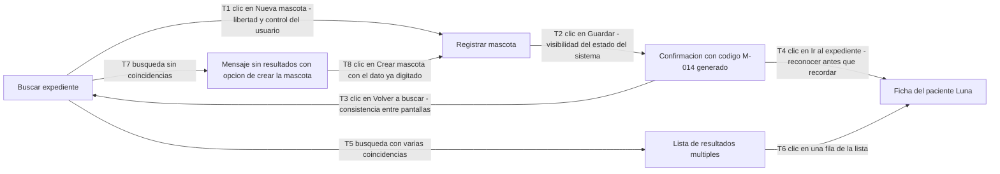

# Taller de la Clase 13 en ExamLab - configuracion

- **Curso:** Seminario de Sistemas (FI303301)
- **Taller:** Taller Clase 13 en ExamLab - Diseno de interfaces de VetCare
- **Preguntas:** 5 · **Total:** 100 puntos
- **Plataforma:** ExamLab (https://uniaj.examlab.workers.dev/) · modulo Talleres
- **Hito del PI:** Quedan listas las pantallas de Registrar mascota y Buscar expediente de VetCare, anotadas y conectadas en un prototipo navegable.
- **Entregable de la clase:** Un archivo de Figma o Penpot con las dos pantallas anotadas y minimo tres transiciones navegables, mas la hoja de anotaciones que amarra cada campo a un RF y a un atributo del diccionario de datos, subido a ExamLab.

> ExamLab no importa preguntas desde archivo: el alta se hace en la UI del
> docente (o con la pestana de IA). Este documento trae el texto exacto de cada
> campo para copiar y pegar, incluidos el SQL de partida y el codigo base.

**Que produce el estudiante:** El estudiante entrega los wireframes anotados de Registrar mascota y Buscar expediente, el prototipo navegable enlazado, la trazabilidad campo a RF y la bitacora de la prueba de pasillo.

---

## Pregunta 1 - Respuesta escrita · 30 pts

**Tipo en la plataforma:** `abierta`

**Enunciado (campo Contenido):**

## Wireframe de la pantalla Registrar mascota

**Aviso honesto sobre la herramienta:** los wireframes **no se pueden hacer en Mermaid** (Mermaid dibuja diagramas, no pantallas). Por eso esta pantalla se dibuja en **Figma, Penpot o Excalidraw** y aqui en ExamLab se entrega **el enlace publico mas la descripcion anotada**. El enlace debe abrir sin pedir permisos: si esta privado, no se califica.

**Entregue en este orden:**

1. `ENLACE AL ARCHIVO:` la URL publica de Figma, Penpot o Excalidraw con la pantalla **Registrar mascota** en version **wireframe en gris** (sin colores de marca, sin logos, sin imagenes decorativas).
2. `DESCRIPCION DE LA ESTRUCTURA:` describa la pantalla por bloques, de arriba hacia abajo, usando esta plantilla por bloque:

```
Bloque <n> - <nombre del bloque>: <que campos o elementos contiene> | <por que esta en esa posicion>
```

Los **3 bloques obligatorios** son: **datos del dueno**, **datos de la mascota** y **zona de accion** (botones).
3. `INVENTARIO DE CAMPOS:` liste todos los campos de la pantalla con su tipo de control (campo de texto, lista desplegable, selector de fecha, area de texto). **Maximo 9 campos en total**: si le salen mas, decida que se va y explique por que.
4. `CABE SIN SCROLL:` confirme que la pantalla completa cabe en una sola vista sin desplazamiento y diga como lo logro (agrupacion, dos columnas, valores por defecto).
5. `LISTAS CERRADAS:` indique **minimo 2 campos** que resolvio con lista desplegable en lugar de texto libre (por ejemplo especie y sexo) y que error de captura evita cada uno.

Recuerde la regla del curso: aqui no se construye la casa, se dibujan los planos. No se entrega HTML ni codigo de interfaz.

**Rubrica esperada (campo Rubrica):**

Enlace publico que abre y muestra la pantalla en wireframe en gris sin colores ni logos. Los 3 bloques descritos con su contenido y su justificacion de posicion. Inventario con maximo 9 campos y su tipo de control. Confirmacion de que cabe sin scroll con la tecnica usada, y minimo 2 listas cerradas con el error de captura que evitan.

---

## Pregunta 2 - Respuesta escrita · 25 pts

**Tipo en la plataforma:** `abierta`

**Enunciado (campo Contenido):**

## Tabla de anotaciones: cada campo amarrado a un RF y a un atributo

Numere de **1 a 6** los elementos criticos de su wireframe de Registrar mascota (los numeros deben aparecer dibujados en el archivo de Figma, Penpot o Excalidraw) y entregue aqui la tabla de anotaciones con **6 filas** y **estas 6 columnas**:

`| # | Elemento en la pantalla | Atributo del diccionario de datos (Clase.atributo) | Tipo del atributo | RF o HU que lo exige | Obligatorio u opcional y por que |`

Reglas duras:
- La columna del atributo debe usar la notacion `Clase.atributo` con los **nombres exactos de su diagrama de clases** (por ejemplo `Mascota.microchip`, `Dueno.documento`): si el nombre no coincide con el diagrama, es un hallazgo de inconsistencia.
- **Ningun elemento puede quedar sin RF**. Si un campo que usted dibujo no tiene RF que lo exija, tiene dos salidas y debe ejecutar una: **borrarlo de la pantalla** (digalo) o **escribir el requisito faltante** aqui mismo con la plantilla `El sistema debe permitir a <actor> <accion> <objeto>` y asignarle un ID nuevo.
- Al menos **1 de los 6 elementos** debe ser un elemento de **prevencion de errores** (validacion en linea, valor por defecto, formato guiado, confirmacion antes de una accion destructiva) y debe explicar que error humano previene.
- Cierre con el bloque `CAMPOS HUERFANOS ENCONTRADOS: <cuantos y que hizo con cada uno>`.

**Rubrica esperada (campo Rubrica):**

Seis filas con los 6 elementos numerados igual que en el archivo de diseno, cada uno con su atributo en notacion Clase.atributo coincidente con el diagrama de clases, su tipo, su RF o HU de origen y su obligatoriedad justificada. Ningun campo queda huerfano: los que lo estaban fueron borrados o generaron un requisito nuevo redactado con la plantilla. Al menos un elemento es de prevencion de errores con su explicacion.

---

## Pregunta 3 - Respuesta escrita · 20 pts

**Tipo en la plataforma:** `abierta`

**Enunciado (campo Contenido):**

## Pantalla Buscar expediente y el caso de resultados multiples

Diseñe la segunda pantalla resolviendo por escrito el caso que casi todo el mundo olvida: **que pasa cuando la busqueda devuelve varias mascotas**. En la clinica Huellitas hay **cuatro mascotas llamadas Luna**.

**Entregue estos 5 bloques rotulados:**

1. `ENLACE:` la URL publica de la pantalla **Buscar expediente** (wireframe en gris) en Figma, Penpot o Excalidraw.
2. `CRITERIOS DE BUSQUEDA:` los **3 criterios exactos** con los que se puede buscar (deben coincidir con RF-03) y diga cual es el criterio por defecto y por que.
3. `COLUMNAS DE LA LISTA DE RESULTADOS:` **minimo 4 columnas** que permitan **desambiguar** entre las cuatro Lunas. Para cada columna explique en media linea por que ayuda a distinguirlas (pista: dueno responsable, especie y raza, edad o fecha de nacimiento, ultima atencion).
4. `MENSAJE DE CERO RESULTADOS:` el **texto exacto entre comillas** que se muestra cuando no hay ningun resultado, mas la **accion de salida** que se le ofrece al actor para que no quede bloqueado (por ejemplo un boton que lleve a registrar la mascota con el criterio ya digitado). El mensaje no puede ser «Error» ni «No hay datos».
5. `ESTADO DESPUES DE GUARDAR:` describa el mensaje de estado que confirma una operacion exitosa en Registrar mascota, con el **codigo generado** visible, y cuanto tiempo permanece en pantalla.

Cierre con un renglon indicando **cuantos clics** necesita la recepcionista para pasar de la busqueda a la ficha del paciente en el camino mas corto.

**Rubrica esperada (campo Rubrica):**

Los 5 bloques completos. Tres criterios de busqueda coherentes con RF-03 y criterio por defecto justificado. Minimo 4 columnas de desambiguacion con su razon. Mensaje de cero resultados escrito textualmente entre comillas, con accion de salida y sin usar Error ni No hay datos. Mensaje de estado con codigo generado visible y conteo de clics del camino mas corto.

---

## Pregunta 4 - Diagrama (Mermaid) · 15 pts

**Tipo en la plataforma:** `diagrama`

**Enunciado (campo Contenido):**

## Mapa de navegacion del prototipo

Esto si se puede hacer en Mermaid: el **mapa de navegacion** entre pantallas. Dibujelo con un `flowchart LR` donde **cada nodo es una pantalla** y **cada flecha es una transicion que debe funcionar al hacer clic** en su prototipo de Figma o Penpot.

**Obligatorio:**
1. **Minimo 5 pantallas** como nodos: `Buscar expediente`, `Registrar mascota`, `Confirmacion con codigo generado`, `Ficha del paciente` y `Lista de resultados multiples`.
2. **Minimo 5 transiciones**, y entre ellas **estas 3 obligatorias**: Registrar mascota hacia la confirmacion con codigo, confirmacion hacia Buscar expediente, y un resultado de la lista hacia la ficha del paciente.
3. **Cada flecha rotulada** con el numero de la transicion, el gesto que la dispara y **el principio de usabilidad que cumple**, con este formato de etiqueta: `T1 clic en Guardar - visibilidad del estado del sistema`.
4. **Minimo 2 caminos alternos** representados como transiciones propias: el de **resultados multiples** y el de **sin resultados** (que debe llevar a una salida util, no a un callejon sin salida).

Escriba las etiquetas sin tildes, sin comas y sin parentesis. Al final del diagrama no olvide que el prototipo real debe tener esas mismas transiciones funcionando: el enlace ya lo entrego en las preguntas anteriores.

**Pegar al final del enunciado — flujo de entrega del diagrama:**

**Del boceto al codigo Mermaid.** No subas una imagen: la respuesta de esta pregunta es texto Mermaid.

- **1. Disena visual** Dibuja el diagrama como quieras en Excalidraw o draw.io: es mas rapido arrastrar cajas que escribir codigo, y ahi es donde piensas el modelo.
- **2. Traduce con IA** Copia o describe tu boceto a una IA y pidele el codigo Mermaid: «convierte este diagrama a Mermaid usando `flowchart`». Revisa el resultado: la IA acierta la sintaxis, no tu modelo.
- **3. Pega y renderiza en ExamLab** Pega ese codigo en la caja de texto de la pregunta y mira como lo dibuja la plataforma. Si no renderiza, corrige ahi mismo: lo que se califica es el diagrama renderizado dentro de ExamLab.
- **4. Guarda el PNG para tu PI** Exporta tambien la imagen a la carpeta de tu Proyecto Integrador. Esa copia es para tu informe; no reemplaza la respuesta en la plataforma.

**Diagrama de referencia (Mermaid):**



**Rubrica esperada (campo Rubrica):**

Flowchart con minimo 5 pantallas y minimo 5 transiciones, incluyendo las 3 obligatorias. Cada flecha esta rotulada con numero de transicion, gesto que la dispara y principio de usabilidad. Estan representados los 2 caminos alternos y el de sin resultados ofrece una salida util.

---

## Pregunta 5 - Respuesta escrita · 10 pts

**Tipo en la plataforma:** `abierta`

**Enunciado (campo Contenido):**

## Prueba de pasillo y evidencia de los cuatro principios

**Parte A - Bitacora de la prueba de pasillo.** Consiga a **otro compañero del curso** que no haya trabajado en su diseno, no le explique nada y deje su prototipo abierto. Tarea que debe darle textualmente: «registre la mascota Luna de la señora Perez y luego encuentre su ficha». Registre:

```
Nombre del probador (y su equipo, si trabaja en equipo):
Tiempo total cronometrado:
Cantidad de clics realizados:
Punto de duda 1: <en que pantalla y que estaba buscando>
Punto de duda 2: <en que pantalla y que estaba buscando>
Dijo algo textual mientras dudaba:
```

**Parte B - Dos cambios concretos.** Escriba **exactamente 2 cambios** que hara al diseno por lo observado, con esta plantilla: `Cambio <n>: <que se modifica en que pantalla> porque <observacion de la prueba>, y se comprueba <como se verificara que mejoro>`. Prohibido escribir «mejorar la interfaz» sin decir que elemento cambia.

**Parte C - Evidencia de los cuatro principios.** Una linea por principio, señalando **el elemento concreto de sus pantallas** que lo cumple:
1. `Visibilidad del estado del sistema:` ...
2. `Prevencion de errores (minimo 2 mecanismos):` ...
3. `Consistencia entre pantallas:` ...
4. `Reconocer antes que recordar (listas cerradas en lugar de memoria):` ...

**Rubrica esperada (campo Rubrica):**

Bitacora completa con probador externo identificado, tiempo, clics y los dos puntos de duda ubicados en pantallas concretas. Dos cambios escritos con la plantilla, cada uno amarrado a una observacion de la prueba y con su forma de comprobacion. Los cuatro principios evidenciados con elementos concretos de las pantallas, incluyendo minimo 2 mecanismos de prevencion de errores.

---

## Al terminar de crearlo

- Verifique que la suma de puntos sea la esperada: **100**.
- Publique el taller y confirme la fecha limite (domingo 23:59 segun el Acuerdo).
- Las preguntas con SQL o codigo: ejecutelas una vez usted mismo antes de publicar,
  para confirmar que el SQL de partida corre y que el starter compila.
