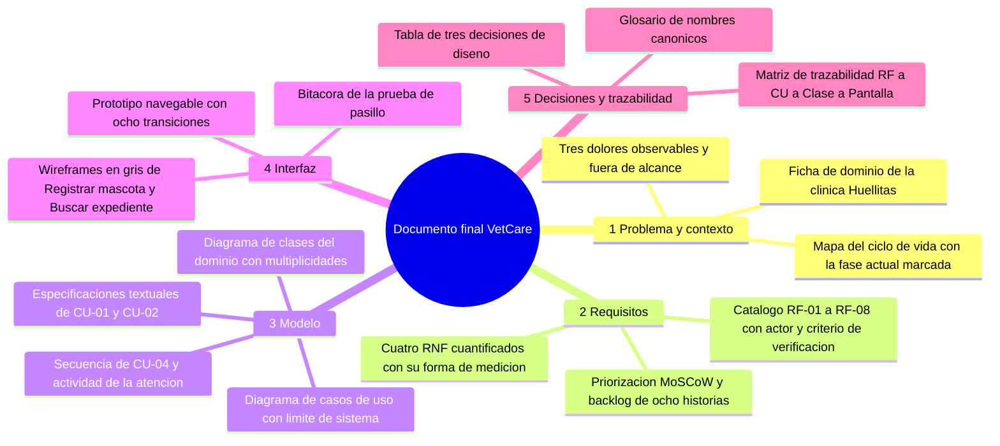

```mermaid
gantt
    title Guion cronometrado de sustentacion VetCare - 12 minutos
    dateFormat HH:mm
    axisFormat %H:%M
    section 1 Problema
    Dolor de Huellitas y fuera de alcance en una lamina :b1, 00:00, 00:02
    section 2 Requisitos
    Catalogo RF-01 a RF-08 y los 4 RNF cuantificados en pantalla :b2, 00:02, 00:05
    section 3 Modelo
    Diagrama de clases casos de uso y secuencia de CU-04 :b3, 00:05, 00:08
    section 4 Interfaz
    Prototipo navegable en vivo y resultado de la prueba de pasillo :b4, 00:08, 00:10
    section 5 Decisiones
    Tabla de tres decisiones y matriz de trazabilidad final :b5, 00:10, 00:12
```

# Taller de la Clase 14 en ExamLab - configuracion

- **Curso:** Seminario de Sistemas (FI303301)
- **Taller:** Taller Clase 14 en ExamLab - Sustentacion y cierre de VetCare
- **Preguntas:** 6 · **Total:** 100 puntos
- **Plataforma:** ExamLab (https://examlab.lovable.app/) · modulo Talleres
- **Hito del PI:** Queda armado el guion cronometrado de sustentacion de VetCare y consolidado el documento final de diseño en una sola pieza coherente.
- **Entregable de la clase:** Un documento en Google Docs con el guion minuto a minuto repartido en bloques con tiempos y evidencia (con responsable nominal solo si el docente autorizo equipo), la tabla de tres decisiones de diseño defendidas y el banco de diez preguntas con su respuesta, mas el indice del documento final consolidado, subido a ExamLab.

> ExamLab no importa preguntas desde archivo: el alta se hace en la UI del
> docente (o con la pestana de IA). Este documento trae el texto exacto de cada
> campo para copiar y pegar, incluidos el SQL de partida y el codigo base.

**Que produce el estudiante:** El estudiante entrega el guion cronometrado de doce minutos con reparto nominal, las tres decisiones de diseno defendidas, el banco de preguntas del jurado y el documento final consolidado con una inconsistencia corregida.

---

## Pregunta 1 - Diagrama (Mermaid) · 20 pts

**Tipo en la plataforma:** `diagrama`

**Enunciado (campo Contenido):**

## Guion cronometrado de la sustentacion en Mermaid

Represente el guion de la sustentacion de VetCare con un **diagrama de Gantt de Mermaid**, usando el tiempo como eje.

**Obligatorio:**
1. `dateFormat HH:mm` y `axisFormat %H:%M`. Cada bloque se declara con **hora de inicio y hora de fin** en formato `mm` de minutos: por ejemplo `00:00, 00:02`.
2. **Exactamente 5 secciones** (`section`), en **este orden**: `1 Problema`, `2 Requisitos`, `3 Modelo`, `4 Interfaz`, `5 Decisiones`. Ese orden no se negocia: es el orden en que un jurado entiende un sistema.
3. El titulo de la seccion lleva el numero y el nombre del bloque (`section 3 Modelo`). Si el docente autorizo equipo, agregue el **nombre del integrante responsable** (`section 3 Modelo - Carlos`).
4. Los bloques deben **sumar exactamente 12 minutos** y **ninguna seccion puede quedar con menos de 2 minutos**. Si el docente autorizo equipo, ademas **ningun integrante puede quedar con menos de 2 minutos** de tiempo total sumado.
5. En el nombre de cada tarea escriba **que se muestra en pantalla** en ese bloque (el diagrama de clases, el prototipo navegable, la matriz de trazabilidad), no un titulo vacio como «explicacion».

Regla de sintaxis: los nombres de tarea **no pueden contener el caracter dos puntos**, porque rompe el Gantt. Escriba sin tildes.

**Diagrama de referencia (Mermaid):**



**Rubrica esperada (campo Rubrica):**

Gantt valido con las 5 secciones en el orden problema, requisitos, modelo, interfaz y decisiones. Los bloques suman exactamente 12 minutos y ninguna seccion baja de 2 minutos (si hay equipo, ningun integrante baja de 2 minutos sumados y su nombre aparece en el titulo de la seccion). Cada tarea dice que artefacto se muestra en pantalla.

---

## Pregunta 2 - Respuesta escrita · 15 pts

**Tipo en la plataforma:** `abierta`

**Enunciado (campo Contenido):**

## Reparto del guion por bloques y ensayo cronometrado

**Parte A - Reparto.** Tabla markdown con **una fila por bloque del guion (5 filas)** y **estas 5 columnas**:

`| Bloque | Minutos asignados | Responsable (su nombre; si hay equipo, el del integrante) | Artefacto que proyecta en pantalla | Frase de apertura del bloque (una sola frase) |`

Reglas: los minutos deben sumar **12**; **ningun bloque** puede quedar sin responsable, sin artefacto proyectado ni con menos de **2 minutos**; si el docente autorizo equipo, **cada integrante** debe aparecer con **minimo 2 minutos** sumados; la frase de apertura debe ser la que de verdad va a decir, no un titulo.

**Parte B - Ensayo cronometrado.** Haga el ensayo **de pie y con el prototipo abierto**, y registre:

```
Tiempo real bloque 1: <mm:ss>   | Diferencia con lo planeado: <+/- ss>
Tiempo real bloque 2: ...
Tiempo real bloque 3: ...
Tiempo real bloque 4: ...
Tiempo real bloque 5: ...
TIEMPO TOTAL REAL: <mm:ss>
QUE SE RECORTO PARA CABER EN 12 MINUTOS: <que contenido se elimino o se resumio, sea concreto>
PUNTO DONDE SE ENREDO 1: <en que bloque y por que>
PUNTO DONDE SE ENREDO 2: <en que bloque y por que>
ACCION PARA CADA ENREDO: <que va a hacer distinto>
```

Si el tiempo total real fue mayor a 12 minutos y no recortaron nada, la respuesta esta incompleta.

**Rubrica esperada (campo Rubrica):**

Tabla de reparto con 5 bloques que suman 12 minutos, ninguno por debajo de 2 minutos ni sin responsable (si hay equipo, todos los integrantes con minimo 2 minutos), artefacto proyectado y frase de apertura real por bloque. Bitacora del ensayo con tiempo real y diferencia por bloque, total, contenido recortado concreto y los dos puntos de enredo con su accion correctiva.

---

## Pregunta 3 - Respuesta escrita · 25 pts

**Tipo en la plataforma:** `abierta`

**Enunciado (campo Contenido):**

## Tres decisiones de diseno defendidas

Un jurado no pregunta si el diagrama es bonito: pregunta **por que lo hicieron asi y que sacrificaron**. Entregue una tabla markdown con **exactamente 3 filas** y **estas 5 columnas**:

`| Decision tomada | Alternativa descartada | Criterio con el que se decidio | Consecuencia asumida | Evidencia en el paquete (artefacto y ubicacion) |`

Restricciones de contenido:
- **Decision 1 obligatoriamente sobre el modelo de clases.** Use una de estas: por que `Atencion` es una clase aparte y no unos atributos dentro de `Cita`; o por que el `diagnostico` no vive en `Mascota`; o por que un `Dueno` puede tener muchas mascotas pero una mascota tiene un solo dueno responsable.
- **Decision 2 obligatoriamente sobre un requisito no funcional.** Por ejemplo: por que el tiempo de respuesta de la busqueda se fijo en 3 segundos con 5.000 mascotas y no en 1 segundo; o por que el respaldo es diario a las 23:00 y no cada hora.
- **Decision 3 libre**, pero debe ser sobre **alcance o interfaz**: algo que dejaron fuera a proposito o una pantalla que simplificaron.

Reglas de calidad:
- La columna `Criterio` debe nombrar el criterio explicito: dolor del cliente que resuelve, dependencia del dominio, costo de mantenimiento del dato duplicado, tiempo del semestre, riesgo de seguridad. **Prohibido** justificar por gusto, por costumbre o porque «asi lo vimos en clase».
- La columna `Consecuencia asumida` debe decir **que se perdio o que cuesta mas caro** por haber decidido asi. Si una fila no tiene consecuencia, no era una decision: era una preferencia.
- La columna de evidencia debe apuntar a un artefacto real de su paquete (por ejemplo: «diagrama de clases, asociacion Cita genera Atencion 0..1»).

**Rubrica esperada (campo Rubrica):**

Tres filas con las 5 columnas completas. La decision 1 es sobre el modelo de clases y la 2 sobre un RNF, la 3 sobre alcance o interfaz. Cada criterio es explicito y tecnico (no gusto ni costumbre), cada consecuencia declara lo que se perdio o lo que costara mas, y cada fila apunta a un artefacto concreto del paquete.

---

## Pregunta 4 - Respuesta escrita · 20 pts

**Tipo en la plataforma:** `abierta`

**Enunciado (campo Contenido):**

## Banco de diez preguntas del jurado

Entregue una tabla markdown con **exactamente 10 filas** y **estas 4 columnas**:

`| # | Pregunta del jurado | Respuesta (maximo 2 frases) | Artefacto que se muestra al responder |`

**Tres preguntas obligatorias** (van si o si, con este contenido):
1. **Concurrencia:** ¿que pasa si dos recepcionistas registran la misma mascota al mismo tiempo? La respuesta debe nombrar la regla o el atributo que lo impide (pista: el microchip es unico) y que mensaje ve la segunda persona.
2. **Medicion de RNF:** ¿como se mide su requisito no funcional de tiempo de respuesta? La respuesta debe traer el numero, la condicion de la medicion y el instrumento.
3. **Alcance excluido:** ¿que quedo fuera del alcance y por que? La respuesta debe nombrar dos exclusiones concretas y la razon.

Las **7 preguntas restantes** deben cubrir, al menos: una sobre trazabilidad (de donde salio una clase), una sobre un flujo alterno de un caso de uso, una sobre por que no hay codigo en esta entrega (recuerde: aqui se dibujan los planos, el sistema se construye en Programacion II), una sobre control de acceso al diagnostico, una sobre la prueba de pasillo, una sobre priorizacion MoSCoW y una incomoda que ustedes mismos teman.

Reglas: **maximo 2 frases por respuesta** (si necesita mas, no dominan el tema); la columna del artefacto no puede quedar vacia en ninguna fila.

**Rubrica esperada (campo Rubrica):**

Diez preguntas con respuesta de maximo dos frases y artefacto de respaldo en todas las filas. Estan las tres obligatorias: concurrencia resuelta con la regla del microchip unico y el mensaje al segundo usuario, medicion del RNF con numero, condicion e instrumento, y alcance excluido con dos exclusiones y su razon. Las otras siete cubren los temas exigidos.

---

## Pregunta 5 - Diagrama (Mermaid) · 10 pts

**Tipo en la plataforma:** `diagrama`

**Enunciado (campo Contenido):**

## Indice del documento final consolidado

Represente el indice del documento final de diseno de VetCare con un **mindmap de Mermaid**.

**Obligatorio:**
- Raiz escrita exactamente asi: `root((Documento final VetCare))`.
- **5 ramas de primer nivel numeradas**, en este orden: `1 Problema y contexto`, `2 Requisitos`, `3 Modelo`, `4 Interfaz`, `5 Decisiones y trazabilidad`.
- **Minimo 2 subitems por rama** (minimo 12 hojas en total), y cada hoja debe nombrar **un artefacto real que ustedes ya produjeron en el semestre** (catalogo RF-01 a RF-08, diagrama de clases, especificacion de CU-01 y CU-02, secuencia de CU-04, diagrama de actividad, prototipo navegable, glosario de nombres canonicos, matriz de trazabilidad). **Prohibidas** las hojas genericas tipo «introduccion», «marco teorico» o «conclusiones».
- La rama 5 debe incluir obligatoriamente la **matriz de trazabilidad** y el **glosario de nombres canonicos**.

Jerarquia solo por indentacion, sin guiones al inicio, sin parentesis en las hojas y sin tildes.

**Diagrama de referencia (Mermaid):**



**Rubrica esperada (campo Rubrica):**

Mindmap valido con la raiz Documento final VetCare y las 5 ramas numeradas en el orden pedido, con minimo 2 hojas por rama y minimo 12 hojas en total. Cada hoja nombra un artefacto realmente producido en el semestre, sin secciones genericas. La rama 5 incluye la matriz de trazabilidad y el glosario.

---

## Pregunta 6 - Respuesta escrita · 10 pts

**Tipo en la plataforma:** `abierta`

**Enunciado (campo Contenido):**

## Inconsistencia final detectada y corregida

Ultimo control de calidad del semestre. Revise que **los nombres coincidan exactamente** en los tres frentes: los atributos del **diagrama de clases**, los campos del **diccionario de datos** y los campos de las **pantallas** del prototipo.

Entregue este bloque, completo:

```
INCONSISTENCIA DETECTADA
Donde estaba (artefacto 1 y ubicacion):
Donde estaba (artefacto 2 y ubicacion):
Que decia cada uno (ANTES, textual):
Por que es un problema real (una linea, en terminos de lo que le pasaria al equipo de Programacion II al construirlo):
Nombre canonico que se impuso y por que ese y no el otro:
Que se cambio exactamente (DESPUES, textual):
COMO SE COMPRUEBA QUE QUEDO CORREGIDA: (algo que el docente pueda abrir y verificar)
VERSION DEL DOCUMENTO FINAL: v<x.y> - fecha - quien la aprobo
```

Debe ser una inconsistencia **real** de su propio paquete (por ejemplo `Dueno.nombreDueno` en el diagrama frente a `nombrePropietario` en la pantalla, o `Cita.estadoCita` frente a `estado` en el mockup). Si escribe una inventada o generica, no cuenta. Cierre con un renglon: `OTRAS INCONSISTENCIAS PENDIENTES: <cuantas quedaron y en que backlog quedaron registradas>`.

**Rubrica esperada (campo Rubrica):**

Bloque completo con la inconsistencia ubicada en dos artefactos concretos, el texto ANTES y DESPUES, la razon del problema expresada como impacto en la construccion, el nombre canonico elegido con su justificacion, la forma de comprobacion verificable y la version del documento final con fecha y aprobador. Debe ser una inconsistencia real del paquete propio.

---

## Al terminar de crearlo

- Verifique que la suma de puntos sea la esperada: **100**.
- Publique el taller y confirme la fecha limite (domingo 23:59 segun el Acuerdo).
- Las preguntas con SQL o codigo: ejecutelas una vez usted mismo antes de publicar,
  para confirmar que el SQL de partida corre y que el starter compila.
