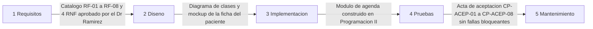

```mermaid
flowchart LR
    subgraph I1[Incremento 1 - Ficha del paciente]
        A1[Requisitos] --> B1[Diseno] --> C1[Implementacion] --> D1[Pruebas] --> E1[Entrega a la clinica]
    end
    subgraph I2[Incremento 2 - Historia clinica y busqueda]
        A2[Requisitos] --> B2[Diseno] --> C2[Implementacion] --> D2[Pruebas] --> E2[Entrega a la clinica]
    end
    subgraph I3[Incremento 3 - Reportes y metricas]
        A3[Requisitos] --> B3[Diseno] --> C3[Implementacion] --> D3[Pruebas] --> E3[Entrega a la clinica]
    end
    E1 -->|Retroalimentacion del Dr Ramirez sobre la ficha| A2
    E2 -->|Retroalimentacion de la recepcionista sobre la busqueda| A3
    E3 -->|Solicitud de mantenimiento de la clinica| A1
```

# Taller de la Clase 2 en ExamLab - configuracion

- **Curso:** Seminario de Sistemas (FI303301)
- **Taller:** Taller Clase 2 en ExamLab - Ciclo de vida de VetCare
- **Preguntas:** 5 · **Total:** 100 puntos
- **Plataforma:** ExamLab (https://examlab.lovable.app/) · modulo Talleres
- **Hito del PI:** Queda listo el mapa de fases de VetCare con el artefacto concreto que produce cada fase y la marca de en cual esta parado el equipo hoy.
- **Entregable de la clase:** Un documento de una pagina en Google Docs con la tabla Fase / Pregunta que responde / Artefacto de VetCare / Quien lo aprueba, mas dos diagramas en draw.io (recorrido lineal y recorrido en tres vueltas) exportados a PDF y subidos a ExamLab.

> ExamLab no importa preguntas desde archivo: el alta se hace en la UI del
> docente (o con la pestana de IA). Este documento trae el texto exacto de cada
> campo para copiar y pegar, incluidos el SQL de partida y el codigo base.

**Que produce el estudiante:** El estudiante entrega el mapa de fases de VetCare con el artefacto concreto de cada fase, los dos recorridos dibujados en Mermaid y la distincion producto vs proyecto.

---

## Pregunta 1 - Respuesta escrita · 25 pts

**Tipo en la plataforma:** `abierta`

**Enunciado (campo Contenido):**

## Tabla de fases del ciclo de vida de VetCare

Escriba una tabla en markdown con **exactamente 5 filas** (una por fase: Requisitos, Diseno, Implementacion, Pruebas, Mantenimiento) y **estas 4 columnas**:

`| Fase | Pregunta que responde | Artefacto concreto de VetCare | Quien lo aprueba |`

Reglas duras:
- En la columna **Artefacto** esta **prohibido** escribir generalidades de libro. Mal: «documento de requisitos», «el software». Bien: «Catalogo RF-01 a RF-08 y 4 RNF de Huellitas», «Mockup de la ficha del paciente en Penpot», «Acta de pruebas de aceptacion CP-ACEP-01 a CP-ACEP-08».
- En **Quien lo aprueba** debe ir un rol real con nombre de funcion: el Dr. Ramirez como cliente, la recepcionista como usuaria, el docente como arquitecto revisor. No escriba «el equipo».
- La **Pregunta que responde** se escribe como pregunta terminada en signo de interrogacion (por ejemplo: ¿Que debe hacer el sistema para la clinica?).

Recuerde que en este curso la fase de Implementacion produce planos ejecutados en Programacion II: digalo asi en la tabla.

**Rubrica esperada (campo Rubrica):**

Tabla con las 5 fases y las 4 columnas completas. Cada artefacto es un entregable de VetCare con nombre propio (IDs, nombre de pantalla, nombre de acta), no una definicion generica. Cada fila tiene un rol aprobador concreto. Las preguntas estan formuladas como preguntas.

---

## Pregunta 2 - Diagrama (Mermaid) · 25 pts

**Tipo en la plataforma:** `diagrama`

**Enunciado (campo Contenido):**

## Recorrido lineal del ciclo de vida de VetCare

Dibuje en **Mermaid** (`flowchart LR`) el recorrido **lineal** de VetCare: **exactamente 5 cajas** en fila, en este orden: Requisitos, Diseno, Implementacion, Pruebas, Mantenimiento.

Requisito clave: **sobre cada una de las 4 flechas** debe ir rotulado el **artefacto que se entrega para poder pasar a la siguiente fase** (use la sintaxis de etiqueta de flecha `A -->|texto| B`). El rotulo debe ser el artefacto concreto de VetCare que puso en su tabla, no el nombre de la fase.

Escriba las etiquetas sin tildes y sin comas para que el diagrama renderice. Guarde estos mismos 5 nombres de caja: en la pregunta siguiente tiene que reutilizarlos identicos.

**Diagrama de referencia (Mermaid):**



**Rubrica esperada (campo Rubrica):**

Flowchart valido con 5 cajas en el orden Requisitos, Diseno, Implementacion, Pruebas, Mantenimiento y 4 flechas rotuladas. Cada rotulo nombra un artefacto concreto de VetCare (catalogo de RF, diagrama, acta de pruebas), no una fase ni un verbo suelto.

---

## Pregunta 3 - Diagrama (Mermaid) · 25 pts

**Tipo en la plataforma:** `diagrama`

**Enunciado (campo Contenido):**

## Recorrido en tres vueltas del mismo ciclo

Ahora dibuje en **Mermaid** (`flowchart LR`) el **mismo** ciclo pero recorrido en **tres vueltas incrementales**. Reglas:

- Use **3 subgraphs**, uno por incremento, rotulados exactamente: `Incremento 1 - Ficha del paciente`, `Incremento 2 - Historia clinica y busqueda`, `Incremento 3 - Reportes y metricas`.
- Dentro de cada subgraph van **las mismas 5 fases** de la pregunta anterior (mismos nombres). Lo unico que cambia entre el diagrama lineal y este es **el recorrido**, no las cajas.
- Agregue **2 flechas de retroalimentacion** rotuladas que vayan desde la entrega de un incremento hacia los requisitos del siguiente, y **1 flecha** desde el ultimo incremento hacia Requisitos rotulada como solicitud de mantenimiento.

Declare las flechas que cruzan de un subgraph a otro **despues** de cerrar todos los subgraphs, si no el diagrama no renderiza.

**Diagrama de referencia (Mermaid):**



**Rubrica esperada (campo Rubrica):**

Tres subgraphs con los nombres exactos de los incrementos, cada uno con las mismas 5 fases del diagrama lineal. Existen las 2 flechas de retroalimentacion entre incrementos y la flecha de mantenimiento, todas rotuladas. Si las cajas no coinciden con el diagrama lineal, se penaliza.

---

## Pregunta 4 - Respuesta escrita · 15 pts

**Tipo en la plataforma:** `abierta`

**Enunciado (campo Contenido):**

## En que fase esta parado su equipo hoy

Declare en que fase del ciclo esta su equipo **hoy** y sustentelo. Formato exacto de la respuesta:

```
FASE ACTUAL: <nombre de una de las 5 fases>
EVIDENCIA 1 (existe): <algo que ya existe y se puede abrir o mostrar>
EVIDENCIA 2 (no existe todavia): <algo propio de la fase siguiente que aun no existe>
PROXIMO ARTEFACTO: <el artefacto exacto que deben producir para pasar de fase y en que clase lo produciran>
```

Las dos evidencias deben ser **verificables**: el docente tiene que poder pedirsela y ustedes mostrarla (o confirmar que no existe). Mal: «ya entendimos el problema». Bien: «existe la transcripcion de la entrevista al Dr. Ramirez en el documento X» y «no existe ningun diagrama de clases aprobado».

**Rubrica esperada (campo Rubrica):**

Se espera la fase declarada con las dos evidencias en el formato pedido: una que existe y se puede mostrar, y una que todavia no existe. Ambas deben ser objetos verificables (documento, diagrama, acta), no percepciones. El proximo artefacto esta nombrado con precision.

---

## Pregunta 5 - Respuesta escrita · 10 pts

**Tipo en la plataforma:** `abierta`

**Enunciado (campo Contenido):**

## Producto vs proyecto en VetCare

Escriba un parrafo de **exactamente 3 renglones** titulado «Producto vs proyecto en VetCare» que responda, en este orden, las tres preguntas:

1. ¿Cuando termina el **proyecto** VetCare? (indique el hecho concreto y verificable que lo cierra: una entrega, un acta, una fecha del semestre).
2. ¿Cuando terminaria el **producto** VetCare? (indique la condicion que haria que la clinica lo deje de usar).
3. Un **ejemplo concreto de solicitud de mantenimiento** que Huellitas podria pedir un ano despues de la entrega, y de que tipo es: correctivo, evolutivo o adaptativo. Diga por que es de ese tipo en media linea.

No repita definiciones de libro: use hechos de VetCare.

**Rubrica esperada (campo Rubrica):**

Tres renglones que distingan el cierre del proyecto (hecho verificable) del fin del producto (condicion de uso), mas un ejemplo concreto de mantenimiento de Huellitas clasificado como correctivo, evolutivo o adaptativo con su razon. Se penaliza responder con definiciones genericas sin datos de VetCare.

---

## Al terminar de crearlo

- Verifique que la suma de puntos sea la esperada: **100**.
- Publique el taller y confirme la fecha limite (domingo 23:59 segun el Acuerdo).
- Las preguntas con SQL o codigo: ejecutelas una vez usted mismo antes de publicar,
  para confirmar que el SQL de partida corre y que el starter compila.
