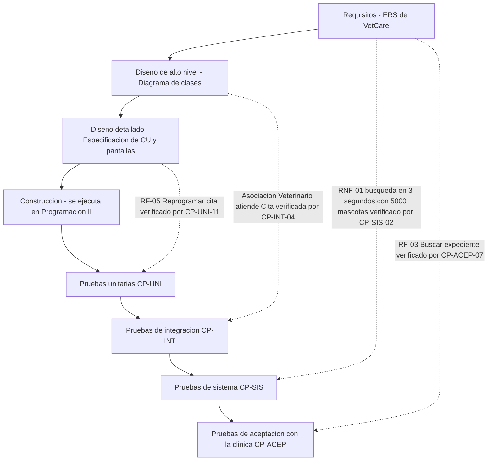

# Taller de la Clase 3 en ExamLab - configuracion

- **Curso:** Seminario de Sistemas (FI303301)
- **Taller:** Taller Clase 3 en ExamLab - ERS y modelo en V de VetCare
- **Preguntas:** 5 · **Total:** 100 puntos
- **Plataforma:** ExamLab (https://examlab.lovable.app/) · modulo Talleres
- **Hito del PI:** Queda listo el indice del documento formal de diseño de VetCare y la matriz en V que amarra cada requisito con la prueba que lo va a verificar.
- **Entregable de la clase:** Un documento en Google Docs con el indice del ERS de VetCare, cuatro requisitos escritos en formato de ficha con version y linea base, la matriz en V (requisito - nivel de prueba - criterio de aceptacion) y un formato de solicitud de cambio diligenciado; mas el diagrama en V dibujado en draw.io y subido a ExamLab.

> ExamLab no importa preguntas desde archivo: el alta se hace en la UI del
> docente (o con la pestana de IA). Este documento trae el texto exacto de cada
> campo para copiar y pegar, incluidos el SQL de partida y el codigo base.

**Que produce el estudiante:** El estudiante entrega el indice del ERS, cuatro requisitos en ficha formal con linea base, la matriz en V con trazabilidad requisito-prueba y una solicitud de cambio decidida.

---

## Pregunta 1 - Respuesta escrita · 25 pts

**Tipo en la plataforma:** `abierta`

**Enunciado (campo Contenido):**

## Cuatro requisitos de VetCare en ficha formal

En una metodologia tradicional el requisito no es una frase suelta: es una **ficha versionada**. Escriba **4 fichas completas** de requisitos de VetCare, cada una con **estos 10 campos rotulados** (todos obligatorios, ninguno vacio):

```
ID: RF-0x o RNF-0x
Nombre:
Fuente: (quien lo pidio y en que entrevista o acta)
Prioridad: Alta | Media | Baja
Estabilidad: Estable | Puede cambiar
Descripcion: (plantilla: el sistema debe permitir a <actor> <accion> <objeto>)
Precondicion:
Criterio de aceptacion: (con numero medible)
Depende de: (ID de otro requisito o Ninguno)
Version / Estado: v1.0 / Aprobado en linea base
```

Restricciones de contenido:
- **Al menos una** de las 4 fichas debe ser un **RNF** (desempeno, seguridad, usabilidad o respaldo) con su valor numerico.
- **Al menos una** ficha debe declarar en `Depende de` el ID de otra de sus fichas, y esa dependencia debe tener sentido (por ejemplo: no se puede registrar una mascota si antes no existe el dueno).
- Use como base los requisitos de VetCare: registrar dueno, registrar mascota, buscar expediente por nombre o documento o microchip, agendar cita sin cruce de horario, registrar atencion con diagnostico, consultar historial, facturar atencion.
- Prohibidas las palabras rapido, amigable, facil, intuitivo, robusto u optimo sin un numero al lado.

**Rubrica esperada (campo Rubrica):**

Cuatro fichas con los 10 campos diligenciados, ID unico, fuente identificada con nombre y origen, version y estado. Al menos una es RNF con valor numerico y al menos una declara dependencia coherente con otro ID propio. Todo criterio de aceptacion es medible (numero, tiempo, cantidad o porcentaje).

---

## Pregunta 2 - Diagrama (Mermaid) · 30 pts

**Tipo en la plataforma:** `diagrama`

**Enunciado (campo Contenido):**

## Modelo en V de VetCare con trazabilidad

Dibuje en **Mermaid** (`flowchart TB`) el modelo en **V** de VetCare. Debe contener:

1. **Rama descendente (4 cajas)**: Requisitos - ERS de VetCare, Diseno de alto nivel - diagrama de clases, Diseno detallado - especificacion de casos de uso y pantallas, Construccion (que en este curso se ejecuta en Programacion II).
2. **Rama ascendente (4 cajas)**: Pruebas unitarias CP-UNI, Pruebas de integracion CP-INT, Pruebas de sistema CP-SIS, Pruebas de aceptacion con la clinica CP-ACEP.
3. **Exactamente 4 lineas de trazabilidad punteadas** (`-.->`) que unan cada fase de la izquierda con su nivel de prueba emparejado a la derecha. **Cada linea punteada debe ir rotulada con el ID del requisito y el ID del caso de prueba** que lo verifica, por ejemplo `RF-03 Buscar expediente verificado por CP-ACEP-07`.

Al menos una de las 4 lineas debe trazar un **RNF** hasta pruebas de sistema. Escriba los textos sin tildes ni comas.

**Diagrama de referencia (Mermaid):**



**Rubrica esperada (campo Rubrica):**

El diagrama muestra las dos ramas de la V con 4 cajas cada una y 4 lineas punteadas de emparejamiento. Cada linea punteada esta rotulada con un ID de requisito real de VetCare y un ID de caso de prueba, y el emparejamiento es correcto (requisitos con aceptacion, diseno de alto nivel con integracion, diseno detallado con unitarias, RNF con pruebas de sistema).

---

## Pregunta 3 - Respuesta escrita · 20 pts

**Tipo en la plataforma:** `abierta`

**Enunciado (campo Contenido):**

## Matriz en V y indice del ERS

**Parte A - Indice del ERS de VetCare.** Escriba el indice numerado con **minimo estas 7 secciones**: 1. Proposito y alcance, 2. Glosario del dominio veterinario, 3. Requisitos funcionales, 4. Requisitos no funcionales, 5. Reglas de negocio, 6. Matriz de trazabilidad, 7. Control de versiones y aprobaciones. En la seccion 2 liste **5 terminos del dominio** con su definicion de una linea (por ejemplo: expediente, microchip, triage, insumo, atencion). En la seccion 5 escriba **2 reglas de negocio** de Huellitas (por ejemplo: un veterinario no puede tener dos citas a la misma hora).

**Parte B - Matriz en V.** Escriba una tabla markdown de **4 columnas** y **minimo 4 filas**:

`| Fase de la izquierda | Artefacto que produce | Nivel de prueba emparejado | Caso de prueba de VetCare que lo verifica |`

Cada uno de los **4 requisitos** de la primera pregunta debe aparecer con su codigo de caso de prueba (CP-UNI-xx, CP-INT-xx, CP-SIS-xx o CP-ACEP-xx). Ningun requisito puede quedar sin caso de prueba.

**Rubrica esperada (campo Rubrica):**

Indice con las 7 secciones numeradas, glosario con 5 terminos definidos y 2 reglas de negocio propias de Huellitas. La matriz empareja correctamente cada fase con su nivel de prueba y los 4 requisitos de la pregunta 1 aparecen con codigo de caso de prueba, sin filas incompletas.

---

## Pregunta 4 - Respuesta escrita · 15 pts

**Tipo en la plataforma:** `abierta`

**Enunciado (campo Contenido):**

## Solicitud de cambio sobre linea base aprobada

Situacion real: la linea base del ERS de VetCare **ya fue aprobada y firmada** por el Dr. Ramirez. Dos semanas despues, la clinica pide que la busqueda de expediente **tambien funcione por numero de microchip**.

Diligencie el formato de solicitud de cambio con **estos 8 campos rotulados**:

```
SC-01
Solicitante:
Fecha:
Descripcion del cambio solicitado:
Requisito afectado: (ID exacto y version)
Impacto en diseno: (que artefactos ya hechos hay que modificar: clases, atributos, pantallas, casos de uso)
Impacto en pruebas: (que casos de prueba se agregan o se modifican, con codigo)
Esfuerzo estimado: (en horas de analisis, no de codigo)
Decision: Aprobar | Aplazar al siguiente incremento | Rechazar
Justificacion de la decision: (2 renglones)
```

La justificacion no puede ser «si, se agrega porque el cliente lo pidio»: debe argumentar con el impacto que usted mismo escribio y con la prioridad frente a los otros requisitos Must. Diga tambien que nueva version queda el requisito afectado (por ejemplo de v1.0 a v1.1).

**Rubrica esperada (campo Rubrica):**

Los 8 campos diligenciados. El requisito afectado se cita con ID y version. El impacto en diseno menciona artefactos concretos (por ejemplo el atributo microchip en la clase Mascota y la pantalla Buscar expediente) y el impacto en pruebas cita codigos de casos. La decision esta justificada con base en el impacto declarado y se indica el cambio de version.

---

## Pregunta 5 - Seleccion unica · 10 pts

**Tipo en la plataforma:** `cerrada`

**Enunciado (campo Contenido):**

## Verificacion: que significa tener una linea base

El ERS de VetCare v1.0 esta aprobado como linea base. Segun una metodologia tradicional, ¿cual es la consecuencia correcta de ese hecho?

**Opciones:**

- [ ] El documento queda congelado y ningun requisito puede cambiar hasta que termine el proyecto.
- [ ] Cualquier integrante puede editar el documento siempre que avise por el grupo de WhatsApp del equipo.
- [x] Todo cambio posterior debe entrar por una solicitud formal, ser evaluado en su impacto sobre diseno y pruebas, aprobarse o rechazarse con justificacion y generar una nueva version del documento.
- [ ] La linea base solo aplica a los requisitos funcionales; los requisitos no funcionales se pueden ajustar libremente porque no afectan el diseno.

**Rubrica esperada (campo Rubrica):**

Correcta: la opcion 2. La linea base no congela el proyecto ni prohibe cambios: los canaliza por un procedimiento formal de control de cambios con evaluacion de impacto, decision y nueva version. Las opciones 0, 1 y 3 describen mal el control de configuracion.

---

## Al terminar de crearlo

- Verifique que la suma de puntos sea la esperada: **100**.
- Publique el taller y confirme la fecha limite (domingo 23:59 segun el Acuerdo).
- Las preguntas con SQL o codigo: ejecutelas una vez usted mismo antes de publicar,
  para confirmar que el SQL de partida corre y que el starter compila.
