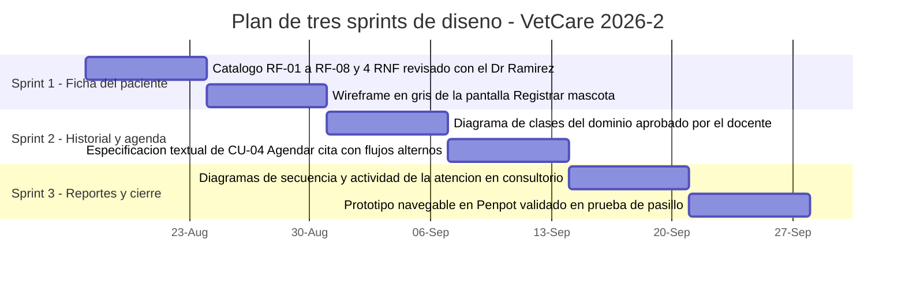
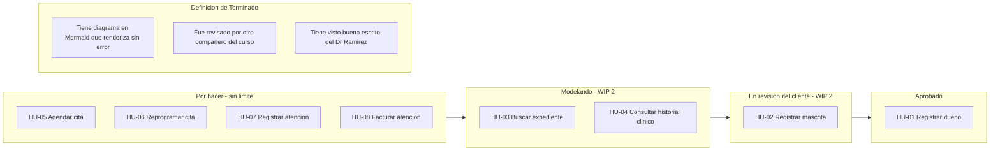

# Taller de la Clase 4 en ExamLab - configuracion

- **Curso:** Seminario de Sistemas (FI303301)
- **Taller:** Taller Clase 4 en ExamLab - Backlog agil y sprints de VetCare
- **Preguntas:** 5 · **Total:** 100 puntos
- **Plataforma:** ExamLab (https://uniaj.examlab.workers.dev/) · modulo Talleres
- **Hito del PI:** Queda listo el backlog priorizado de VetCare repartido en sprints del semestre, con las primeras historias de usuario escritas con criterios de aceptacion.
- **Entregable de la clase:** Un tablero en draw.io o Excalidraw con el Product Backlog priorizado de VetCare y las columnas de flujo con limite de trabajo en curso, mas un documento con el plan de tres sprints (objetivo y entregable de diseño de cada uno), la Definicion de Terminado y tres historias de usuario con criterios en formato Dado/Cuando/Entonces.

> ExamLab no importa preguntas desde archivo: el alta se hace en la UI del
> docente (o con la pestana de IA). Este documento trae el texto exacto de cada
> campo para copiar y pegar, incluidos el SQL de partida y el codigo base.

**Que produce el estudiante:** El estudiante entrega el Product Backlog priorizado de VetCare, tres historias con escenarios Dado-Cuando-Entonces, el plan de tres sprints y el tablero con limite de trabajo en curso.

---

## Pregunta 1 - Respuesta escrita · 25 pts

**Tipo en la plataforma:** `abierta`

**Enunciado (campo Contenido):**

## Product Backlog priorizado de VetCare

Escriba el Product Backlog de VetCare como tabla markdown con **exactamente 8 items** y **estas 4 columnas**:

`| # | Item redactado como historia corta | Prioridad (Alta/Media/Baja) | Valor para Huellitas en una linea |`

Reglas:
- El orden de la tabla **es** la priorizacion: el item 1 es lo primero que se trabaja. No es un orden alfabetico ni por comodidad.
- Cada item se escribe como historia corta: `Como <rol de la clinica> quiero <accion> para <beneficio>`. Roles validos: Recepcionista, Veterinario, Administrador. **Prohibido el rol «usuario».**
- La columna de valor debe decir que dolor de la clinica alivia (expedientes en carpetas que se pierden, citas cruzadas en el cuaderno, datos del dueno recapturados en cada visita).

Debajo de la tabla escriba un bloque de **2 renglones** rotulado `POR QUE EL ITEM 1 ES EL PRIMERO` que argumente con **uno de los tres dolores** de Huellitas y con lo que se bloquea si no se hace primero (pista: sin dueno registrado no hay mascota, y sin mascota no hay cita).

**Rubrica esperada (campo Rubrica):**

Ocho items en formato Como/quiero/para con roles concretos de la clinica y ningun «usuario». La tabla esta ordenada por prioridad de arriba hacia abajo y cada item declara el valor concreto para Huellitas. El bloque final justifica el primer item con un dolor real y con la dependencia que desbloquea.

---

## Pregunta 2 - Respuesta escrita · 25 pts

**Tipo en la plataforma:** `abierta`

**Enunciado (campo Contenido):**

## Tres historias con criterios de aceptacion

Tome los items 1, 2 y 3 de su backlog y escribalos completos. Para **cada una de las 3 historias** entregue:

```
HU-0x  |  Item de backlog #x  |  Trazabilidad: RF-0x
Como <rol concreto> quiero <accion> para <beneficio>

Escenario 1 (camino feliz):
  Dado que ...
  Cuando ...
  Entonces ...

Escenario 2 (alterno o de error):
  Dado que ...
  Cuando ...
  Entonces ...
```

Exigencias:
- **Minimo 2 escenarios por historia**, y **al menos uno** de los dos debe ser alterno o de error. Ejemplos de escenarios alternos validos en VetCare: el documento del dueno ya existe, el veterinario ya tiene una cita a esa hora, la busqueda no devuelve ningun resultado, la busqueda devuelve varias mascotas con el mismo nombre.
- El `Entonces` debe describir **un resultado observable** en el sistema (mensaje exacto, registro creado con codigo, cita en estado Programada). Mal: «entonces funciona correctamente».
- Nada de escenarios que hablen de codigo, tablas de base de datos o clases: aqui se especifica comportamiento, no implementacion.

**Rubrica esperada (campo Rubrica):**

Tres historias con encabezado, rol concreto, accion y beneficio, cada una con minimo 2 escenarios en Dado-Cuando-Entonces y al menos uno alterno o de error. Los Entonces describen resultados observables y verificables, no juicios de valor. Cada historia trae su trazabilidad a un RF.

---

## Pregunta 3 - Diagrama (Mermaid) · 25 pts

**Tipo en la plataforma:** `diagrama`

**Enunciado (campo Contenido):**

## Plan de tres sprints de diseno en Mermaid

Dibuje el plan de los **3 sprints** del semestre con un **diagrama de Gantt de Mermaid**. Reglas de contenido:

- **Exactamente 3 secciones** (`section`), una por sprint, rotuladas con el numero del sprint y su objetivo, por ejemplo `section Sprint 1 - Ficha del paciente`.
- **2 tareas por sprint** (6 en total). **Cada tarea debe ser un entregable de diseno que la clinica pueda ver y opinar**: un catalogo revisado con el cliente, un wireframe, un diagrama aprobado, un prototipo validado. **Prohibido** poner trabajo interno invisible tipo «investigar», «reunirnos», «estudiar UML».
- Duracion de cada tarea: 7 dias (`7d`). Use `dateFormat YYYY-MM-DD` y arranque el Sprint 1 el `2026-08-17`.
- Los nombres de tarea **no pueden contener el caracter dos puntos** porque rompe la sintaxis del Gantt.

Asegurese de que la ultima tarea del Sprint 3 sea un artefacto que se pueda mostrar en la sustentacion final.

**Pegar al final del enunciado — flujo de entrega del diagrama:**

**Del boceto al codigo Mermaid.** No subas una imagen: la respuesta de esta pregunta es texto Mermaid.

- **1. Disena visual** Dibuja el diagrama como quieras en Excalidraw o draw.io: es mas rapido arrastrar cajas que escribir codigo, y ahi es donde piensas el modelo.
- **2. Traduce con IA** Copia o describe tu boceto a una IA y pidele el codigo Mermaid: «convierte este diagrama a Mermaid usando `gantt`». Revisa el resultado: la IA acierta la sintaxis, no tu modelo.
- **3. Pega y renderiza en ExamLab** Pega ese codigo en la caja de texto de la pregunta y mira como lo dibuja la plataforma. Si no renderiza, corrige ahi mismo: lo que se califica es el diagrama renderizado dentro de ExamLab.
- **4. Guarda el PNG para tu PI** Exporta tambien la imagen a la carpeta de tu Proyecto Integrador. Esa copia es para tu informe; no reemplaza la respuesta en la plataforma.

**Diagrama de referencia (Mermaid):**



**Rubrica esperada (campo Rubrica):**

Gantt valido con 3 secciones (una por sprint, con objetivo en el titulo) y 2 tareas por sprint. Las 6 tareas son entregables de diseno visibles para el cliente (catalogo, wireframe, diagrama, prototipo), no actividades internas. Fechas coherentes y encadenadas a partir del 2026-08-17.

---

## Pregunta 4 - Diagrama (Mermaid) · 15 pts

**Tipo en la plataforma:** `diagrama`

**Enunciado (campo Contenido):**

## Tablero de flujo con limite de trabajo en curso

Dibuje el tablero del equipo en **Mermaid** (`flowchart LR`) usando **4 subgraphs como columnas**, en este orden y con estos rotulos:

1. `Por hacer - sin limite`
2. `Modelando - WIP 2`
3. `En revision del cliente - WIP 2`
4. `Aprobado`

Reglas:
- Distribuya **8 tarjetas** (las 8 historias de su backlog, con su codigo HU-0x) entre las 4 columnas.
- Las dos columnas del medio **no pueden tener mas de 2 tarjetas cada una**: ese es el limite de trabajo en curso y el diagrama debe respetarlo.
- Conecte las columnas con flechas que muestren el flujo de izquierda a derecha.
- Agregue **1 subgraph adicional al final** rotulado `Definicion de Terminado` con **3 nodos**, cada uno una condicion verificable para dar por terminado un artefacto de diseno (por ejemplo: tiene diagrama en Mermaid renderizando, esta revisado por otro compañero del curso, tiene visto bueno del cliente).

**Pegar al final del enunciado — flujo de entrega del diagrama:**

**Del boceto al codigo Mermaid.** No subas una imagen: la respuesta de esta pregunta es texto Mermaid.

- **1. Disena visual** Dibuja el diagrama como quieras en Excalidraw o draw.io: es mas rapido arrastrar cajas que escribir codigo, y ahi es donde piensas el modelo.
- **2. Traduce con IA** Copia o describe tu boceto a una IA y pidele el codigo Mermaid: «convierte este diagrama a Mermaid usando `flowchart`». Revisa el resultado: la IA acierta la sintaxis, no tu modelo.
- **3. Pega y renderiza en ExamLab** Pega ese codigo en la caja de texto de la pregunta y mira como lo dibuja la plataforma. Si no renderiza, corrige ahi mismo: lo que se califica es el diagrama renderizado dentro de ExamLab.
- **4. Guarda el PNG para tu PI** Exporta tambien la imagen a la carpeta de tu Proyecto Integrador. Esa copia es para tu informe; no reemplaza la respuesta en la plataforma.

**Diagrama de referencia (Mermaid):**



**Rubrica esperada (campo Rubrica):**

Cuatro columnas como subgraphs con los rotulos exactos, 8 tarjetas HU distribuidas y ninguna columna del medio con mas de 2 tarjetas. Flechas de flujo entre columnas. Subgraph de Definicion de Terminado con 3 condiciones verificables, no genericas.

---

## Pregunta 5 - Seleccion multiple · 10 pts

**Tipo en la plataforma:** `cerrada_multi`

**Enunciado (campo Contenido):**

## Verificacion: Definicion de Terminado de un artefacto de diseno

En este curso no se entrega codigo: se entregan planos. Marque **todas** las condiciones que pueden formar parte de una Definicion de Terminado valida para un artefacto de diseno de VetCare.

**Opciones:**

- [x] El diagrama esta hecho en Mermaid, renderiza sin errores y todos sus elementos aparecen en la matriz de trazabilidad.
- [ ] El modulo compila sin errores y pasa las pruebas unitarias en Java.
- [x] Otro compañero del curso lo reviso con la rubrica y sus hallazgos bloqueantes fueron corregidos.
- [ ] Usted siente que el artefacto ya quedo bien.
- [x] Cada campo o elemento del artefacto se puede rastrear a un RF o a una historia de usuario.
- [ ] El artefacto fue subido a ExamLab antes de la fecha limite.

**Rubrica esperada (campo Rubrica):**

Correctas: 0, 2 y 4. Son condiciones verificables por un tercero sobre un artefacto de diseno. La 1 pertenece a Programacion II (aqui no se construye codigo). La 3 no es verificable porque depende de una opinion interna. La 5 confunde terminado con entregado a tiempo.

---

## Al terminar de crearlo

- Verifique que la suma de puntos sea la esperada: **100**.
- Publique el taller y confirme la fecha limite (domingo 23:59 segun el Acuerdo).
- Las preguntas con SQL o codigo: ejecutelas una vez usted mismo antes de publicar,
  para confirmar que el SQL de partida corre y que el starter compila.
