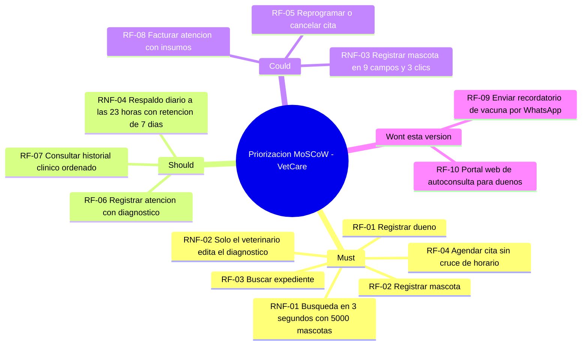

# Taller de la Clase 6 en ExamLab - configuracion

- **Curso:** Seminario de Sistemas (FI303301)
- **Taller:** Taller Clase 6 en ExamLab - Catalogo de requisitos de VetCare
- **Preguntas:** 5 · **Total:** 100 puntos
- **Plataforma:** ExamLab (https://uniaj.examlab.workers.dev/) · modulo Talleres
- **Hito del PI:** Queda listo el catalogo de requisitos de VetCare: 8 RF y 4 RNF con criterio de verificacion y prioridad MoSCoW.
- **Entregable de la clase:** Documento de requisitos de VetCare en PDF, con minimo 8 RF, 4 RNF cuantificados, priorizacion MoSCoW y matriz de trazabilidad, subido a ExamLab.

> ExamLab no importa preguntas desde archivo: el alta se hace en la UI del
> docente (o con la pestana de IA). Este documento trae el texto exacto de cada
> campo para copiar y pegar, incluidos el SQL de partida y el codigo base.

**Que produce el estudiante:** El estudiante entrega el catalogo de VetCare con 8 RF derivados de la entrevista, 4 RNF cuantificados, la priorizacion MoSCoW y la matriz de trazabilidad sin huerfanos.

---

## Pregunta 1 - Respuesta escrita · 30 pts

**Tipo en la plataforma:** `abierta`

**Enunciado (campo Contenido):**

## De las cinco frases de la entrevista a 8 requisitos funcionales

Estas son las **cinco frases crudas** de la entrevista al Dr. Ramirez, director de la clinica Huellitas. Son las unicas fuentes autorizadas: no invente necesidades nuevas.

- **E1**: «Necesito buscar rapido el expediente de un animal; hoy revisamos carpetas fisicas y a veces se pierden.»
- **E2**: «Las citas las anotamos en un cuaderno y se nos cruzan dos consultas a la misma hora con el mismo veterinario.»
- **E3**: «Cuando llega una mascota nueva, la auxiliar vuelve a copiar los datos del dueno aunque ya tenga otras tres mascotas con nosotros.»
- **E4**: «No quiero que la auxiliar pueda cambiar el diagnostico que yo escribo; que lo vea, pero que no lo toque.»
- **E5**: «Si se apaga el computador de recepcion perdemos lo del dia, y los fines de semana nadie saca copia.»

**Entregue una tabla markdown con exactamente 8 filas** (RF-01 a RF-08) y **estas 5 columnas**:

`| ID | Frase de origen (E1..E5) | Requisito funcional | Actor | Criterio de verificacion |`

Reglas duras:
- El requisito se escribe con la plantilla literal: `El sistema debe permitir a <actor> <accion> <objeto> [bajo <condicion>]`. Actores validos: Recepcionista, Veterinario, Administrador.
- **Ningun RF puede usar la palabra «y» uniendo dos capacidades distintas.** Si aparece, partalo en dos RF.
- La columna de origen **no puede quedar vacia en ninguna fila**: todo RF nace de una frase E1 a E5.
- Las 5 frases deben quedar cubiertas: cada Ex debe aparecer al menos una vez en la tabla.
- El criterio de verificacion debe ser observable (registro creado con codigo, mensaje mostrado, cita en estado Programada), no una opinion.

Sugerencia de cobertura para que le den los 8: registrar dueno, registrar mascota asociada a un dueno existente, buscar expediente por nombre o documento o microchip, agendar cita validando que el veterinario este libre, reprogramar o cancelar cita, registrar la atencion con diagnostico y tratamiento, consultar el historial de atenciones ordenado, facturar la atencion con los insumos consumidos.

**Rubrica esperada (campo Rubrica):**

Tabla con 8 RF numerados RF-01 a RF-08, todos con la plantilla completa, actor explicito y una sola accion por requisito (ningun «y» uniendo capacidades). Toda fila declara su frase de origen y las cinco frases E1 a E5 quedan cubiertas. Cada criterio de verificacion es observable.

---

## Pregunta 2 - Respuesta escrita · 22 pts

**Tipo en la plataforma:** `abierta`

**Enunciado (campo Contenido):**

## Cuatro requisitos no funcionales cuantificados

Derive **exactamente 4 RNF** (RNF-01 a RNF-04), **uno por cada categoria** y en este orden:

1. **Desempeno** (nace de E1)
2. **Control de acceso** (nace de E4)
3. **Usabilidad** (nace de E3)
4. **Respaldo** (nace de E5)

Para cada uno escriba estos 4 campos rotulados:

```
ID y categoria:
Enunciado: (debe contener al menos un numero con su unidad: segundos, cantidad de registros, cantidad de campos, clics, frecuencia, dias de retencion o porcentaje)
Como se mide: (instrumento y procedimiento concreto: cronometro, contador de clics, intento de acceso con el rol equivocado, prueba de restauracion)
Quien lo verifica y cuando:
```

Reglas:
- **Prohibidas** las palabras rapido, amigable, facil, intuitivo, robusto u optimo sin numero al lado.
- El RNF de control de acceso debe decir **que rol puede hacer que** sobre el campo diagnostico, y que queda registrado en bitacora.
- El RNF de usabilidad debe estar expresado en **cantidad de campos o de clics** para una tarea concreta de VetCare.
- El de respaldo debe traer **frecuencia, hora y dias de retencion**.

Cierre con un renglon: **cual de los 4 RNF es el mas caro de cumplir y por que**.

**Rubrica esperada (campo Rubrica):**

Cuatro RNF, uno por categoria y en el orden pedido, cada uno con enunciado cuantificado (numero + unidad), procedimiento de medicion concreto y responsable de verificacion. Ninguna palabra ambigua sin cuantificar. El renglon final argumenta el costo con base en el contenido del propio RNF.

---

## Pregunta 3 - Diagrama (Mermaid) · 15 pts

**Tipo en la plataforma:** `diagrama`

**Enunciado (campo Contenido):**

## Priorizacion MoSCoW en Mermaid

Represente la priorizacion **MoSCoW** de sus 12 requisitos (8 RF + 4 RNF) con un **mindmap de Mermaid**.

Estructura obligatoria: raiz `root((Priorizacion MoSCoW - VetCare))` y **exactamente 4 ramas**: `Must`, `Should`, `Could`, `Wont esta version`.

Reglas de cantidad:
- Los **12 requisitos** deben aparecer, cada uno como una hoja con su **ID y nombre corto** (por ejemplo `RF-03 Buscar expediente`).
- Los **Must no pueden pasar de 6**.
- La rama `Wont esta version` debe tener **exactamente 2 hojas** con requisitos que usted decide dejar fuera (puede agregar dos ideas nuevas tipo RF-09 y RF-10, por ejemplo recordatorio por WhatsApp o portal web para duenos).
- Ninguna rama puede quedar vacia.

La jerarquia se define solo con indentacion, sin guiones ni parentesis en el texto de las hojas, y sin tildes.

**Pegar al final del enunciado — flujo de entrega del diagrama:**

**Del boceto al codigo Mermaid.** No subas una imagen: la respuesta de esta pregunta es texto Mermaid.

- **1. Disena visual** Dibuja el diagrama como quieras en Excalidraw o draw.io: es mas rapido arrastrar cajas que escribir codigo, y ahi es donde piensas el modelo.
- **2. Traduce con IA** Copia o describe tu boceto a una IA y pidele el codigo Mermaid: «convierte este diagrama a Mermaid usando `mindmap`». Revisa el resultado: la IA acierta la sintaxis, no tu modelo.
- **3. Pega y renderiza en ExamLab** Pega ese codigo en la caja de texto de la pregunta y mira como lo dibuja la plataforma. Si no renderiza, corrige ahi mismo: lo que se califica es el diagrama renderizado dentro de ExamLab.
- **4. Guarda el PNG para tu PI** Exporta tambien la imagen a la carpeta de tu Proyecto Integrador. Esa copia es para tu informe; no reemplaza la respuesta en la plataforma.

**Diagrama de referencia (Mermaid):**



**Rubrica esperada (campo Rubrica):**

Mindmap valido con las 4 ramas MoSCoW exactas. Los 12 requisitos aparecen con ID y nombre corto, los Must son 6 o menos, ninguna rama esta vacia y Wont tiene 2 hojas. La clasificacion debe ser defendible frente a los tres dolores de Huellitas (lo que desbloquea el resto va en Must).

---

## Pregunta 4 - Respuesta escrita · 20 pts

**Tipo en la plataforma:** `abierta`

**Enunciado (campo Contenido):**

## Matriz de trazabilidad y justificacion de lo que queda fuera

**Parte A - Matriz de trazabilidad.** Escriba una tabla markdown con **minimo 8 filas** (una por RF) y **estas 5 columnas**:

`| Necesidad de origen (E1..E5) | ID del requisito | Pantalla prevista | Prueba de aceptacion (CP-ACEP-xx) | Rol que la aprueba |`

Condiciones de cierre de la matriz:
- **Ninguna** de las 5 frases E1 a E5 puede quedar sin al menos un requisito asociado.
- **Ningun** requisito puede quedar huerfano (sin frase de origen).
- La pantalla prevista debe ser un nombre de pantalla de VetCare (Registrar mascota, Buscar expediente, Agenda del dia, Ficha del paciente, Facturacion), no un modulo abstracto.

**Parte B - Justificacion de los Wont.** Para los **2 requisitos que dejo en Wont**, escriba una linea cada uno con esta plantilla: `RF-0x queda fuera de esta version porque <razon de alcance, costo o dependencia externa>, y se retomaria cuando <condicion>`. No vale «porque no da el tiempo» sin decir que se priorizo en su lugar.

**Parte C.** Escriba un renglon indicando **cuantos Must** quedaron y por que ese numero es manejable para un semestre.

**Rubrica esperada (campo Rubrica):**

Matriz con minimo 8 filas y las 5 columnas completas, sin necesidades sueltas ni requisitos huerfanos, con nombres reales de pantalla y codigos de prueba de aceptacion. Los 2 Wont estan justificados con la plantilla completa incluyendo la condicion de retoma. El renglon final cuantifica los Must.

---

## Pregunta 5 - Seleccion multiple · 13 pts

**Tipo en la plataforma:** `cerrada_multi`

**Enunciado (campo Contenido):**

## Verificacion: cuales requisitos estan mal escritos

Marque **todos** los enunciados que **NO** pueden entrar al catalogo de VetCare tal como estan escritos (porque son ambiguos, no verificables, mezclan dos capacidades, describen implementacion o no son requisitos del sistema).

**Opciones:**

- [x] El sistema debe permitir a la recepcionista registrar la mascota y generar la factura de la consulta.
- [ ] El sistema debe permitir al veterinario registrar el diagnostico de una atencion asociada a una cita en estado Atendida.
- [x] El sistema debe ser intuitivo para que cualquier persona lo use sin capacitacion.
- [x] El sistema debe guardar las mascotas en una tabla MySQL con indice por microchip.
- [ ] El sistema debe impedir agendar una cita si el veterinario ya tiene otra cita a la misma hora.
- [x] El equipo debe entregar el diagrama de clases antes de la semana 8.

**Rubrica esperada (campo Rubrica):**

Correctas: 0, 2, 3 y 5. La 0 mezcla dos capacidades con «y». La 2 es ambigua e inmedible. La 3 describe implementacion tecnica, no comportamiento requerido. La 5 no es un requisito del sistema sino una tarea del equipo. Las opciones 1 y 4 estan bien formuladas.

---

## Al terminar de crearlo

- Verifique que la suma de puntos sea la esperada: **100**.
- Publique el taller y confirme la fecha limite (domingo 23:59 segun el Acuerdo).
- Las preguntas con SQL o codigo: ejecutelas una vez usted mismo antes de publicar,
  para confirmar que el SQL de partida corre y que el starter compila.
